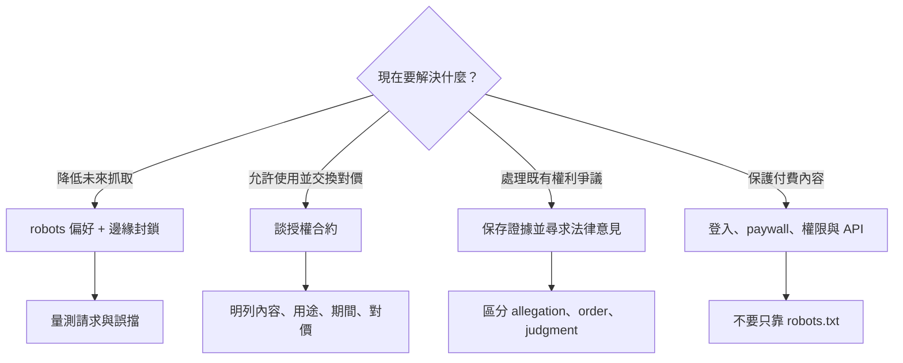

# AI 搜尋 order 2 研究：封鎖、授權與訴訟各自保護什麼

研究日期：2026-09-17
系列：`AI 搜尋正在重寫內容生意` / `AI Search Is Rewriting the Content Business`
order：2

## ELI5

想像你開一間圖書館。封鎖像門禁：決定下一位訪客能不能進門。授權像借閱合約：說清楚誰可以拿哪些書、拿去做什麼、要交換什麼。訴訟像事後去法院：主張有人沒有遵守你的權利，請法院判斷責任與救濟。

三者都可能重要，但保護的不是同一件事。門禁不會自動產生租金，合約只約束簽約雙方，起訴也不代表已經勝訴。

## 研究方法與工具揭露

- 先檢查完整 callable inventory，確認 Groundlane `web_search`、`web_fetch`、`web_extract` 可用。
- 候選來源一律先以 Groundlane `web_search` 尋找，再以 `web_fetch` 讀取完整頁面。
- Groundlane 搜尋曾回報部分 provider unavailable，但 bounded request 整體成功，未以其他搜尋工具替代。
- 兩份法院 PDF 的 Groundlane `web_fetch` 回傳未解析的 PDF binary；平台 PDF fallback 也因 URL 安全／開啟錯誤失敗。文章因此不引用 PDF 內的細節，只使用 Groundlane 完整讀取的 NYT Company 訴訟文件索引頁，確認 complaint 的日期與文件身分。法院 PDF 只列於限制，不作 Confirmed claim 的依據。

## 核心判決

| 手段 | 直接控制的對象 | 能做什麼 | 做不到什麼 | 主要證據 |
|---|---|---|---|---|
| `robots.txt` | 自我識別且願意遵守的 crawler | 表達特定 user agent 不應抓取哪些路徑 | 不是網路層阻擋；不能保證不被抓 | Cloudflare managed robots docs |
| 邊緣／WAF 封鎖 | 被辨識的請求 | 在回應內容前拒絕特定 crawler | 無法召回過去副本；辨識與繞過仍是營運問題 | Cloudflare AI Crawl Control docs |
| 授權 | 簽約雙方與約定內容 | 約定可用內容、用途、期間、對價與交付 | 公告不等於公開完整條款；不約束未簽約者 | AP、News Corp 官方公告 |
| 訴訟 | 特定案件中的原告、被告與請求 | 請法院判斷侵權、抗辯與救濟 | complaint 是主張，不是裁判；未定案不能預判 | NYT Company complaint index |

## 封鎖：先分「請求」和「強制」

### `robots.txt` 是偏好訊號，不是門鎖

Cloudflare 官方文件明確說，`robots.txt` compliance is voluntary；它表達網站偏好，但不在技術上阻止存取。若 crawler 忽略規則，仍可能抓取。

同一份文件把用途進一步拆成 search、ai-input、ai-train。這是 Cloudflare 的 Content Signals 設計，不能宣稱為所有 crawler 普遍採用的標準。

### 平台自己的 bots 也要分用途

OpenAI 官方 crawler 文件把以下 user agents 分開：

- `OAI-SearchBot`：用於 ChatGPT 搜尋中呈現網站；退出後不會顯示於 search answers，但仍可能以 navigational link 出現。
- `GPTBot`：抓取可能用於訓練 foundation models 的內容；封鎖它表示內容不應用於該訓練用途。
- `ChatGPT-User`：使用者動作觸發，不是自動 web crawling；官方說 robots.txt rules may not apply。

因此「封鎖 GPTBot」不能改寫成「退出所有 ChatGPT 搜尋」；「允許 OAI-SearchBot」也不是授權所有訓練用途。

### 邊緣封鎖才是技術拒絕

Cloudflare AI Crawl Control 可針對被辨識的 crawler allow 或 block。Block 由 WAF rule 強制回應；付費方案還可設定 `403` 或 `402` response。免費方案主要依 user-agent string 辨識，付費方案可用更進一步的 bot detection。這是供給端的請求控制，不是法律判決，也不建立需求。

### Pay Per Crawl 還是 beta

Cloudflare 的 Pay Per Crawl 允許 publisher 對 authenticated crawler 設定 per-request price，由 Cloudflare 作 merchant of record、聚合並分配款項；但官方頁截至研究日仍稱 private／closed beta，並說是 first experiment、very early。它證明技術市場機制存在，不能推導已有穩定 publisher revenue 或普遍 crawler adoption。

## 授權：公告能證到哪裡

### AP × OpenAI

AP 官方公告說，OpenAI licensing part of AP's text archive，AP 則取得 OpenAI 的 technology and product expertise；雙方探索生成式 AI 在新聞產品與服務的用途。公告沒有公開完整合約、價格、精確內容清單或所有允許用途。

### News Corp × OpenAI

News Corp 官方公告說，這是 multi-year agreement；OpenAI 可在回答問題時 display News Corp masthead content、enhance its products，並取得指定新聞品牌的 current and archived content。公告也明說不包括 News Corp 其他業務。它沒有公開金額或完整法律條款；`enhance its products` 不應由作者自行改寫成特定訓練權。

### 可寫與不可寫

- 可寫：當事方宣布的內容範圍、公開用途文字、期間屬性（例如 multi-year）、哪些資產明確排除。
- 不可寫：未公開金額、模型訓練權的精確範圍、搜尋顯示的完整規則、衍生資料權、終止與稽核條款。
- 兩個官方公告是不同交易的案例，不是同一 claim 的兩個獨立來源；不能拿來「交叉證明」一個普遍市場價格。

## 訴訟：先標文件階段

NYT Company 官方訴訟文件頁顯示，The New York Times Company 在 2023-12-27 提交 complaint，並提供 complaint 與 exhibits。這只能確認原告提出訴訟文件；complaint 內容屬原告 allegations，不是法院 findings。

文章不採用未完整讀取的 2025-03-26 motion-to-dismiss order 細節。可一般性說明文件階段：complaint → motion → order／ruling → trial／settlement／appeal → final judgment。每一步的證據權重不同；中間 order 即使讓某 claim 繼續，也不等於原告最後勝訴。

U.S. Copyright Office 的 AI 專頁顯示，Part 3 Generative AI Training 至研究日仍標為 pre-publication，final version 尚待發布。這也提醒文章不該把仍演進中的美國政策或單一案件外推成全球定論。

## 決策框架

## 文章應保留的紅線

- 不說 `robots.txt` 能技術阻止所有 crawler。
- 不把 GPTBot、OAI-SearchBot、ChatGPT-User 混成同一用途。
- 不把封鎖寫成能召回過去資料、保證停止所有模型使用或恢復流量。
- 不把 Pay Per Crawl beta 寫成穩定收入市場。
- 不把 partnership announcement 寫成完整合約；不猜交易金額。
- 不把 `enhance products` 自動翻成模型訓練權。
- 每次提 lawsuit 都標 complaint／motion／order／judgment；不預判未定案訴訟。
- 美國案件與主管機關報告不外推為台灣或全球法律意見。

## 圖表構想

1. 三把工具：門禁（封鎖）／借閱合約（授權）／法院（訴訟）。
2. 決策樹：目標 → 對應手段 → 驗證指標。
3. 表格：控制對象、時間方向、直接產出、主要限制、應量測項目。
4. 訴訟狀態階梯：allegation → interim order → final judgment，避免把 filing 寫成 win。

## 來源與讀取完整度

| URL | 支持 claim | 來源角色 | 完整度 | 查詢日 |
|---|---|---|---|---|
| https://developers.cloudflare.com/bots/additional-configurations/managed-robots-txt/ | robots 自願遵守；偏好不等於技術阻擋；Cloudflare Content Signals 類別 | 官方產品文件 | ✅ Groundlane `web_fetch` 全文，未截斷 | 2026-09-17 |
| https://developers.cloudflare.com/ai-crawl-control/features/manage-ai-crawlers/ | allow/block、WAF enforcement、403/402、free/paid detection 差異、Pay Per Crawl closed beta | 官方產品文件 | ✅ Groundlane `web_fetch` 全文，未截斷 | 2026-09-17 |
| https://blog.cloudflare.com/introducing-pay-per-crawl | private beta、per-request price、402、merchant of record、very early | 官方產品公告 | ✅ Groundlane `web_fetch` 全文，未截斷 | 2026-09-17 |
| https://platform.openai.com/docs/gptbot | OAI-SearchBot、GPTBot、ChatGPT-User 用途與各自 robots 控制 | 官方技術文件 | ✅ Groundlane `web_fetch` 全文，未截斷 | 2026-09-17 |
| https://www.ap.org/media-center/press-releases/2023/ap-open-ai-agree-to-share-select-news-content-and-technology-in-new-collaboration | OpenAI license part of AP text archive；AP 取得技術與產品專業；探索用途 | 當事方官方公告 | ✅ Groundlane `web_fetch` 全文，未截斷 | 2026-09-17 |
| https://newscorp.com/2024/05/22/news-corp-and-openai-sign-landmark-multi-year-global-partnership | multi-year；display、enhance products；current/archive；排除其他業務 | 當事方官方公告 | ✅ Groundlane `web_fetch` 全文，未截斷 | 2026-09-17 |
| https://www.nytco.com/press/lawsuit-documents-dec-2023 | 2023-12-27 complaint 與 exhibits 文件索引 | 原告／當事方一手文件索引 | ✅ Groundlane `web_fetch` 全文，未截斷；只用來確認 filing 身分與日期 | 2026-09-17 |
| https://copyright.gov/ai/ | AI report 分部；Part 3 training 仍是 pre-publication | 美國主管機關 | ✅ Groundlane `web_fetch` 全文，未截斷 | 2026-09-17 |
| https://storage.courtlistener.com/recap/gov.uscourts.nysd.612697/gov.uscourts.nysd.612697.485.0.pdf | 2025-03-26 motion-to-dismiss order 候選 | 法院 filing mirror | ❌ Groundlane 回傳未解析 binary；平台 PDF fallback 亦失敗；不作正文事實依據 | 2026-09-17 |

## Post-verify claim verdict（寫稿前）

| Claim | Verdict | 理由 |
|---|---|---|
| `robots.txt` 是自願偏好，不是技術阻擋 | 🟢 Confirmed (single authoritative source) | Cloudflare 官方直接說明 |
| OpenAI search、training、user-action crawlers 分開 | 🟢 Confirmed (single authoritative source) | OpenAI 官方 crawler docs |
| Cloudflare block 由 WAF rule enforce | 🟢 Confirmed (single authoritative source) | Cloudflare 官方 docs |
| Pay Per Crawl 已成普遍穩定收入 | 🔴 Contradicted／不可寫 | 官方仍稱 private/closed beta、very early |
| AP agreement 涵蓋部分文字檔案 | 🟢 Confirmed (party primary source) | AP 官方公告 |
| News Corp agreement 可 display content、enhance products，含 current/archive | 🟢 Confirmed (party primary source) | News Corp 官方公告 |
| 兩份公告證明確切訓練權與交易金額 | 🟡 Unverifiable／不可寫 | 完整合約與金額未公開 |
| NYT complaint 證明 OpenAI/Microsoft 已侵權 | 🔵 Misframed／不可寫 | complaint 是原告主張，不是 finding |
| NYT 在 2023-12-27 提交 complaint | 🟢 Confirmed (party document index) | NYT Company 官方索引頁 |

範圍聲明：本研究只驗證上述將進入文章的宣告，未提供法律意見，也未判斷任何未定案案件的最終結果。
