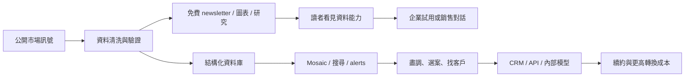
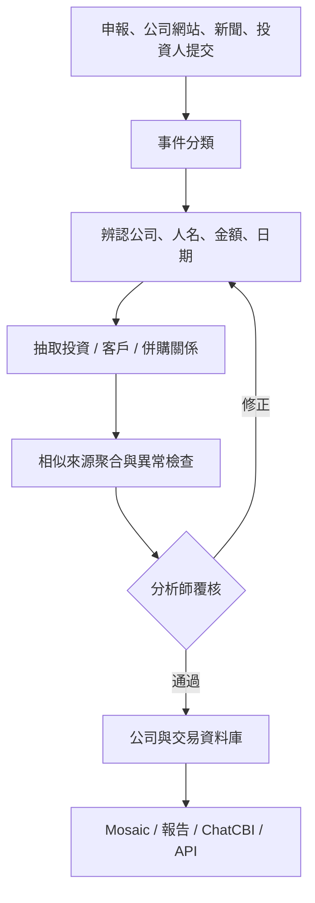
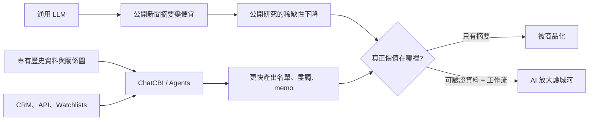

# Research: CB Insights——從免費研究內容到企業決策工作流

- 查詢日：2026-09-16（Asia/Taipei）
- 研究用途：B2B 產業情報子系列的 CB Insights 個案
- 工具：Groundlane `web_search` 找候選、`web_fetch` 讀全文；搜尋 provider 依查詢為 federated / You / Brave，部分深搜提示 Tavily、Exa、Brave 或 Browserbase 個別 provider 不可用，但 bounded search 由其他 provider 成功完成。沒有使用 fallback。
- 核心判斷：CB Insights 不是「把報告搬上網」而已。免費 newsletter 與公開研究是注意力／產品示範層；付費價值來自把分散訊號清洗成結構化資料，再加上評分、搜尋、監控、研究介面、CRM/API 整合，嵌進企業的選案與追蹤工作流。

## 子問題

1. Newsletter／公開研究在商業模式中扮演什麼角色？能否說公司「從 newsletter 起家」？
2. CB Insights 如何把內容與公開訊號產品化成資料庫、預測分數與日常工作流？
3. 資料從哪裡來，機器與人工各做什麼？
4. Mosaic、ChatCBI 與近期 AI agents 的可證能力、方法和限制是什麼？
5. 客群、產品、定價與 Salesforce／Affinity／API 整合如何形成轉換成本？
6. 融資、併購與公司生命週期有哪些可證節點？公開收入數字可信到什麼程度？
7. 這套模式的護城河、AI 風險、失敗模式與不適用情境是什麼？

## 一句話答案

CB Insights 把「免費內容證明我懂市場」升級成「付費資料讓團隊反覆做決策」：newsletter 像超市試吃，資料庫／Mosaic／工作流整合才是企業固定補貨的中央廚房。

## 可直接寫文的敘事主線

### 1. 免費內容不是最後商品，而是「看得見的資料品質」

- 官方 2017 年回顧稱 newsletter 從早期就用來 spotlight emerging technologies、讓新受眾理解公司；同頁把 newsletter 稱為 Intelligence Unit 研究成果的投遞引擎。這是最直接的一手定位。
- CEO Anand Sanwal 在 SaaStr 演講說 newsletter 是已驗證有效的 channel，團隊會反覆放大有效格式；當時稱訂閱數從約 9,000 做到 235,000 花了五年，不是單一 growth hack。
- Axios 2021 報導稱訂閱者接近 100 萬，Sanwal 承認輕鬆語氣偶爾會勸退客戶，但整體是非常成功的 leads generator。
- 因此更精準的寫法是：**CB Insights 不是先做 newsletter、後來才想出產品；而是很早就有資料產品，再用 newsletter／圖表／公開研究把資料能力免費演示給更大受眾。**「從 newsletter 起家」若寫成產品起源會過度簡化。

### 2. 產品化的四次跳躍

| 階段 | 使用者拿到什麼 | 商業上多了什麼 | 可證產品例子 |
|---|---|---|---|
| 內容 | 市場發生什麼 | 注意力、品牌、名單 | newsletter、Research Portal、圖表與報告 |
| 資料 | 哪些公司／交易／關係符合條件 | 可搜尋、可比較、可重複使用 | firmographics、funding/M&A、relationships、management、revenue |
| 判斷 | 哪些公司值得先看 | 排序與優先級，減少人工篩選 | Mosaic、Commercial Maturity、Exit Probability |
| 工作流 | 下一步要追蹤、聯絡、寫 memo 或餵模型什麼 | 嵌入日常流程與轉換成本 | watchlists、personal briefing、Salesforce、Affinity、API、ChatCBI |

關鍵不是「更多文章」，而是把一次性閱讀變成反覆查詢與觸發：找公司 → 排序 → 盡調 → 寫 memo → 推進 CRM → 持續監控。

### 3. 資料工廠：機器先粗加工，人再驗貨

官方 2014 年 Cruncher 說明頁（歷史方法，不應當作 2026 現況比例）描述：

- 當時約 70% 資料由演算法從非結構／半結構來源抽取，約 30% 由投資人直接提交。
- 來源包含監管申報、投資人網站、公司／收購方網站、新聞稿、社群媒體與新聞／產業媒體。
- 流程為 life-event classifier → entity recognition → relationship extraction → clustering → analyst admin review。
- 系統用多篇相似報導與來源信譽作可靠性訊號，最後仍由資料團隊核准才進產品。
- 官方現行 API data overview 則把品質流程寫成「自動檢查與 ML 找異常」＋「人工分析師用多個獨立公開來源交叉驗證」＋「產業研究團隊審查 AI insights」。

可寫成：機器像快速把市場上所有包裹分揀的輸送帶；人類分析師像最後驗貨員。只靠人太慢，只靠機器又會把同名公司、舊交易與錯誤數字一起裝箱。

### 4. Mosaic：不是神諭，是把模糊訊號壓成「先看誰」的排序器

現行官方白皮書披露的 Mosaic：

- 0–1,000 的私人公司健康分數。
- 四個 forward-looking dimensions：Growth Momentum 50%、Financial Strength 40%、Industry Health 5%、Management Strength 5%。FAQ 另說缺值時會動態重分配權重，management 上限 10%；這表示實際權重可能依資料可得性改變。
- 2023-10-01 對非獨角獸公司打分，追蹤至 2025-10-01；150,500 家中 145 家成為獨角獸。
- 前 10% 捕捉 80% 後來的獨角獸，AUC 0.922；top 30 中 7 家（23.3%）成為獨角獸，官方稱是所比較 24 家 Smart Money VC 中最高，為中位 VC hit rate 的 4.7 倍。

必須一起寫的限制：

- 這是 **CB Insights 自行設計、執行、發布的回溯研究**，不是同儕審查或獨立重現。
- 結果變數是「兩年內成為估值 10 億美元公司」，不等於營收品質、投資報酬、倒閉風險或長期企業價值。
- Mosaic top 30 是無需實際下注、可事後按固定日期取分數的排序；VC 投資組合受 ownership、stage、mandate、deal access、資本配置等限制，不能把 4.7 倍直接解讀為演算法投資報酬勝過 VC。
- 模型依賴可觀測 digital breadcrumbs；低曝光、資料稀疏、不同地區／語言或刻意低調的公司可能被低估。官方舊方法頁也明說存在 missing data，會用 clustering、nearest-neighbor imputation 與動態權重處理。

最安全的落點：**Mosaic 的價值是縮小待查名單，不是取代盡職調查。** 官方自己的 use case 也寫成 filter／prioritize due diligence。

### 5. AI 是介面升級，底層稀缺物仍是資料

- ChatCBI 官方頁稱其以 proprietary database 為底，能做自然語言搜尋、M&A／競爭分析、scouting、附件分析、watchlist 建立，並可透過 API 供企業內部 AI 使用。
- 官方 API 文件明確警告 ChatCBI endpoint 使用 generative AI，**may make mistakes**。
- 現行 pricing 頁把 AI agents、ChatCBI、personal briefing、Browser Analyst 與 predictive signals 都包在資料產品周圍。
- 因此 AI 的兩面性是：它降低查詢資料與產出 memo 的摩擦，但也讓「摘要公開資訊」快速商品化。若 CB Insights 的回答只是網路文章摘要，通用 LLM 會侵蝕價值；若答案依靠已清洗交易、商業關係、客戶訪談、歷史資料與可追溯專有分數，AI 反而是更好用的入口。

### 6. 從工具變成基礎設施：整合比閱讀更黏

- Salesforce：把公司、投資人、交易等資料直接加入／補充 account；以 funding、customers、partners、competitors、investors 與 momentum 建 pipeline。
- Affinity：依新融資、客戶公告、重要招募等 trigger 建立公司檔案，不需重複輸入。
- API／Data Solutions：可把 firmographics、transactions、relationships、outlook scores、scouting reports、ChatCBI 放進內部模型、演算法與 LLM。
- Pricing 頁也列 Microsoft Copilot、Snowflake Marketplace 等入口。

護城河不只在「我有一個資料庫」，而是：歷史資料 → 清洗與 entity resolution → 專有衍生分數 → 團隊 watchlists／notes → CRM/API integration → 更多日常使用與回饋。換供應商時，企業換的不只是閱讀介面，還要重接欄位、流程、清單與內部模型。

### 7. 客群與付費方式

| 面向 | 可證內容 | 不應超寫 |
|---|---|---|
| 核心客群 | corporate strategy/innovation、M&A/corp dev、投資團隊、BD/sales；現行頁面以大型企業與金融／策略團隊為主 | 不要說所有客群占比或最大營收來源，未公開 |
| 產品層 | Browser Analyst、Strategy Terminal、Data Solutions；另有研究、mobile、briefing、AI agents、API/feeds | 頁面結構可能持續改名，寫作時標注查詢日 |
| 定價 | 官方 pricing 頁三個主入口都以 Request pricing；Data Solutions 明列 consumption-based access | 不採用 SEO 比價站聲稱的 US$25k/50k/100k 區間，缺少合約與官方佐證 |
| 銷售模型 | enterprise sales、onboarding/migration、dedicated forward-deployed strategist、SSO/security | 無法由頁面推導平均合約價、毛利或續約率 |

### 8. 生命週期與資本

| 時間 | 事件 | 證據強度 |
|---|---|---|
| 2008/2009/2010 | 不同來源對 founded/formed 年份有差異：Business Insider 稱 2008；多個公司資料來源稱 2009；Reuters 稱 2010 formed | ❌ 衝突；正文最好寫「2008–2010 前後成立」，或不寫精確年份 |
| 早期至 2015 | 官方稱公司先靠營收與 NSF 小額 grant；60+ 人時才拿第一筆 institutional financing | ✅ 官方＋Reuters |
| 2015-11 | RSTP 投資 US$10m Series A，用於團隊與核心資料產品／AI；Reuters 稱 first institutional financing | ✅ 官方＋Reuters＋TechCrunch 搜尋候選 |
| 2015 前後 | 官方稱 2014 revenue 成長三倍、公司 profitable；這是公司自行發布、無財報 | ⚠️ 單一公司聲明 |
| 2020-07 | 從 Dow Jones 收購 VentureSource data assets，補入自 1983 起的資料；交易金額未披露 | ✅ 官方新聞稿＋Business Insider |
| 2021-07 | Axios 引述 CEO 稱接近 100 萬 newsletter subscribers，並「on track」次年接近 US$100m ARR | ⚠️ 當時的管理層預測，不是已實現營收；不可寫成公司收入已達 US$100m |
| 2026-09 查詢 | 私營公司，未找到可獨立驗證的現行營收、估值、獲利或續約率 | ✅ 研究結論：數字缺口應保留 |

VentureSource 的意義比「又一次收購」更重要：舊資料是訓練、比較與回測預測模型的時間軸。對資料公司而言，買到 1983 年起的歷史資料，等於替今天的快照補上一整段影片。

## ELI5 比喻

### 首選：試吃攤與中央廚房

- Newsletter／公開圖表：超市試吃，讓你先確認味道與廚師能力。
- 結構化資料庫：中央廚房，把不同市場的食材洗好、去皮、分裝。
- Mosaic：營養標籤，把很多訊號壓成能先排序的數字。
- Salesforce／Affinity／API：冷鏈物流，直接送進客戶每天工作的廚房。
- 護城河：不只是食譜，而是多年供應商、品管流程、歷史庫存與已接好的配送線。

### 備選：氣象台

公開研究像每天的天氣預報；付費產品則是企業自己的雷達站。雷達不保證一定下雨，但能讓團隊把有限時間先放到最可能形成颱風的公司與市場。

## Mermaid 草圖

### 圖 1：內容如何變成企業訂閱

圖解重點：免費內容與付費產品共用同一座資料工廠；內容不是被鎖進 paywall 的唯一商品。

### 圖 2：一筆資料如何進產品

圖解重點：AI 並非直接把網頁摘要送給客戶，中間還有 entity resolution、去重、信心判定與人工覆核。

### 圖 3：AI 對 CB Insights 的攻守

## 比較表構想

### 「文章公司」與「資料工作流公司」

| 問題 | 文章／報告訂閱 | CB Insights 型資料工作流 |
|---|---|---|
| 使用單位 | 個人閱讀 | 團隊共同查詢、標註、匯出、觸發 |
| 產品單位 | 一篇內容 | company / deal / relationship / score / market |
| 更新方式 | 出版節奏 | 資料與 alerts 持續更新 |
| 決策位置 | 決策前的背景閱讀 | 直接進 sourcing、due diligence、CRM、內部模型 |
| AI 衝擊 | 容易被摘要 | 若底層資料稀缺，AI 是新介面；若資料可替代，仍會受壓 |
| 轉換成本 | 取消後少一個閱讀來源 | 需重建欄位映射、名單、整合與歷史脈絡 |

### 與相鄰替代品比較（只寫定位，不寫未證優劣）

| 類型 | 主要任務 | CB Insights 相對定位 |
|---|---|---|
| 新聞／newsletter | 知道今天發生什麼 | 把事件結構化、跨公司比較並保留歷史 |
| 傳統研究／顧問 | 取得分析師觀點與框架 | 結合研究內容與可查資料／分數／工作流 |
| 純公司目錄 | 查公司基本資料 | 加入關係、交易、預測分數、market taxonomy 與 alerts |
| CRM | 管理已知關係與 pipeline | 提供外部公司情報，補進 CRM 而非完全取代 CRM |
| 通用 LLM | 快速綜合公開資訊 | 以 proprietary database、citation、API 與 structured filters 主張差異化 |

## 事實交叉表

| 事實 | 來源 1 | 來源 2 | 驗證狀態／寫作處理 |
|---|---|---|---|
| Newsletter 是早期品牌／研究投遞引擎 | CB Insights 2017 year in review（一手） | SaaStr CEO transcript；Axios 2021 | ✅ 可寫；不要改寫成「產品由 newsletter 才開始」 |
| 2015 融 US$10m Series A，第一筆 institutional financing | 官方 Not a Unicorn | Reuters 2015 | ✅ |
| 早期靠營收與 NSF grant | 官方 Not a Unicorn | Reuters 支持 first institutional financing；SaaStr CEO 說 bootstrapped to ARR | ✅ 方向；grant 精確 US$1.15m 主要來自 2015 Mosaic／二手資料，若要寫數字需清楚標來源 |
| 現行產品涵蓋資料、研究、預測分數、AI、CRM/API | 官方 pricing | API docs、Salesforce/Affinity、ChatCBI | ✅ |
| 現行美元價格 | 官方只 Request pricing | SEO 比價站彼此給出不同區間 | ⚠️ 不採數字；只寫 quote-based／consumption-based data access |
| Mosaic 4.7x median elite VC hit rate | Mosaic whitepaper | Mosaic product page（同一公司） | ⚠️ 單一公司研究重複發布，不算獨立驗證；需附方法限制 |
| Mosaic 0–1,000、目前四構面權重 | Mosaic whitepaper | API data overview 支持分數欄位，舊 launch 支持早期 3M 架構 | ✅ 現行結構以 2025/26 白皮書為準；勿把 2015 3M 與現行 4 構面混寫 |
| 資料採 machine + human verification | 2014 Cruncher 方法頁 | 現行 API data overview | ✅；舊 70/30 比例不得當 2026 現況 |
| 收購 VentureSource data assets、資料回溯 1983 | PR Newswire 官方新聞稿 | Business Insider 2020 | ✅；價格未披露 |
| 2021 接近 100 萬 newsletter subscribers | Axios 引述 CEO | 無第二個獨立全文來源；YourStory 2020 搜尋摘要稱約 64 萬 | ⚠️ 可標「Axios 當時引述 CEO」而非現況 |
| 2022 近 US$100m ARR | Axios 2021 寫 on track next year | 未找到事後財報／獨立確認 | ⚠️ 只可寫當時預測，不可寫已達成 |
| 成立年份 | BI: 2008；多處: 2009；Reuters: 2010 | 來源互相衝突 | ❌ 避免精確年份或明說約 2008–2010 |
| 公司曾大規模裁員／營收下滑 | Glassdoor 搜尋摘要、聚合站 | 無公司或可靠獨立報導 | 🔴 不寫成事實 |

## 我的推論（與事實分開）

| 推論 | 依據 | 可能錯在哪 |
|---|---|---|
| 免費內容是產品 demo，也是名單取得，而不是主要付費 SKU | 官方稱 newsletter 展示公司能力、Axios 稱 lead generator；pricing 聚焦 terminal/data solutions | 未公開各 channel attribution，不能量化 newsletter 對 ARR 貢獻 |
| 最深護城河是「歷史資料＋清洗＋workflow」，不只是研究品牌 | VentureSource 歷史資料、Cruncher、API/CRM/Watchlists | 競爭者也可能有相當資料與整合；沒有客戶 switching study |
| 生成式 AI 會壓低公開研究摘要價值，但提高專有資料的介面價值 | ChatCBI/API 與通用 LLM 可摘要公開網頁 | 若專有資料錯誤、過時或可被其他來源替代，AI 仍可能侵蝕差異化 |
| Mosaic 適合作為 triage，而不該是自動投資決策 | 官方 use case 寫 filter/prioritize due diligence；模型 outcome 與研究限制 | 特定內部流程可能已把分數直接當 trigger，但仍不代表無需人工判斷 |
| CRM／API 整合提高續約黏性 | Salesforce、Affinity、API 的直接嵌入能力 | 沒有公開 cohort churn／renewal 資料，不能證明因果或強度 |

## 產品／客群／定價素材

### 可直接列的產品層

1. **Browser Analyst**：在公司網站或文件上生成 scouting/SWOT、關聯研究與 look-alike lists。
2. **Strategy Terminal**：公司／市場資料、預測分數、AI search/agents、研究、watchlists、briefings。
3. **Data Solutions**：consumption-based feeds/API；給內部 app、model、AI、交易平台或媒體產品使用。
4. **Integrations**：Salesforce、Affinity、Microsoft Copilot、Snowflake 等，把資料送到既有工作場景。

### 可證但要標「官方自述」的規模

- Pricing 頁（查詢日 2026-09-16）宣稱 1,600+ markets、12 million companies、1 billion data points。
- ChatCBI 頁稱可跨 12M+ companies、1,600+ markets，且 proprietary database 包含數億 insights/documents。
- 這些是官方行銷頁數字，沒有獨立 audit；可用「官方稱」而不是客觀保證。

## 失敗、限制與反例段落素材

1. **資料不透明**：私人公司本來就不公開完整財務；Angel deals 等尤其 opaque。沒有資料不等於沒有活動。
2. **可見性偏誤**：大量 hiring、媒體、網站與社群訊號的公司可能比低調公司更容易被模型看見。
3. **錯誤會被壓成漂亮分數**：entity resolution、舊消息重複、同名公司、估值傳聞一旦錯，單一分數會讓錯誤顯得精確。
4. **回測不是實盤**：Mosaic 研究證明的是固定 outcome/window 的排序能力，不是投資組合報酬。
5. **產品複雜與導入成本**：企業需要 onboarding、migration、forward-deployed strategist 本身就暗示資料產品不一定開箱即用；小團隊可能買了卻沒有 analyst capacity。
6. **定價不透明**：官方沒有公開美元價，採詢價；這降低自助比較，也讓文章無法可靠回答「要多少錢」。
7. **AI 幻覺**：官方 API docs 明示 ChatCBI may make mistakes；citation 與原始資料 drill-down 是必要控制，不是裝飾。
8. **內容品牌的反作用**：Axios 報導 Sanwal 說輕鬆 newsletter 語氣有時會勸退客戶；有記憶點不等於適合每個企業採購者。
9. **未能證實的公司壓力**：搜尋到 Glassdoor 與聚合站提 layoffs／renewal 壓力，但沒有可靠一手或獨立報導，不應寫成已發生的公司事實。

## 草稿骨架

### 建議標題

**CB Insights：免費 newsletter 怎麼長成企業的市場情報作業系統**

### 開場

ELI5：一家麵包店每天免費送一小口試吃，真正賺錢的卻不是把剩下的麵包鎖進櫃子，而是替餐廳建好中央廚房、品管與配送。CB Insights 的 newsletter 是試吃；資料庫、Mosaic、CRM/API 才是中央廚房。

### 段落順序

1. **先拆誤會：它不是 newsletter 變付費牆**
2. **一座資料工廠，同時餵免費內容與付費產品**（Mermaid 圖 1、2）
3. **從「發生什麼」走到「先看誰」：Mosaic 的價值與陷阱**
4. **從閱讀走進工作：watchlist、CRM、API 如何提高黏性**
5. **AI 是替代品也是新介面**（Mermaid 圖 3）
6. **歷史資料為什麼值錢：VentureSource 1983 時間軸**
7. **護城河與限制：沒有神諭，只有更快的 triage**
8. **給內容生意的啟示：不要只問如何多寫一篇，要問如何把判斷變成可重複使用的資料物件與工作流**

### 結尾取捨

CB Insights 的升級不是「內容做得更專業」，而是讓內容背後的資料可以被查、排、追、匯、觸發。這使它比單純報告更接近 software/data infrastructure；代價則是資料偏誤、模型黑箱、企業導入成本與生成式 AI 錯誤。最值得學的不是 Mosaic 某個分數，而是把免費內容、資料品管與付費工作流設計成同一條生產線。

## 來源清單與取用紀錄

> 所有 URL 均於 2026-09-16 查詢。`全文` 代表 Groundlane `web_fetch` 回傳完整且 `truncated: false`；頁面未標日期時不猜測發布日。搜尋摘要只用來找候選，未作主要證據。

1. [Pricing - CB Insights](https://www.cbinsights.com/what-we-offer/pricing/) — 官方一手；全文；final URL 正常；HTTP/direct；`truncated: false`。支持現行產品層、功能、1,600+ markets／12m companies／1bn points（官方自述）、Request pricing、consumption-based Data Solutions、Copilot/Salesforce/Snowflake integrations。
2. [Data Overview | CB Insights Developer Portal](https://api-docs.cbinsights.com/portal/docs/CBI-data/data-overview/) — 官方一手；全文；HTTP/direct；`truncated: false`。支持 dataset taxonomy、double verification、human analyst review、Scouting Reports、ChatCBI。
3. [CB Insights API](https://api-docs.cbinsights.com/portal/docs/api/) — 官方一手；全文讀取於同輪；支持把 scores/data/ChatCBI 嵌入 workflows、algorithms、LLMs，以及 generative AI may make mistakes 警告。
4. [Mosaic Whitepaper](https://www.cbinsights.com/mosaic-whitepaper/) — 官方一手／公司自評研究；全文；HTTP/direct；`truncated: false`。支持權重、樣本、追蹤窗、AUC、hit rate、4.7x 與 FAQ；沒有獨立 peer review。
5. [Mosaic Score](https://www.cbinsights.com/mosaic-score/) — 官方一手；全文；HTTP/direct；`truncated: false`。支持現行產品定位與 use cases；4.7x 與白皮書同源，不算獨立驗證。
6. [Moneyball for Startups / Mosaic launch](https://www.cbinsights.com/research/team-blog/mosaic-moneyball-for-startups/) — 官方一手歷史頁；全文；HTTP/direct；`truncated: false`。支持 2015 早期 3M 架構、NSF 支持、missing-data／peer-group 方法與舊模型限制。勿用舊 3M 取代現行四構面。
7. [How Does CB Insights Get Its Data? The Cruncher](https://www.cbinsights.com/research/team-blog/private-company-financing-data-sources-cruncher/) — 官方一手歷史方法頁；全文；HTTP/direct；`truncated: false`。支持歷史 70/30、來源、NLP pipeline、人工核准；比例不是 2026 現況。
8. [ChatCBI](https://www.cbinsights.com/chatcbi/) — 官方一手；全文；HTTP/direct；`truncated: false`。支持 proprietary-data interface、12M+ companies、1,600+ markets、attachments、watchlist、API/internal AI use。
9. [Salesforce Integration](https://www.cbinsights.com/what-we-offer/salesforce-integration/) — 官方一手；全文；HTTP/direct；`truncated: false`。支持 account enrichment、資料欄位、pipeline use case。
10. [Affinity Integration](https://www.cbinsights.com/what-we-offer/integrations/affinity-integration/) — 官方一手；全文；HTTP/direct；`truncated: false`。支持 triggers、no re-entry、pipeline use case。
11. [The CB Insights Year In Review 2017](https://www.cbinsights.com/research/team-blog/cb-insights-year-in-review-2017) — 官方一手；搜尋候選摘要已呈現完整相關段落，未另 fetch；🟡 摘要層級。支持官方如何定位 newsletter 與 Intelligence Unit；正式引用前建議再 fetch 一次全文。
12. [SaaStr: Anand Sanwal — Don’t Do These 68 Things](https://www.saastr.com/anand-sanwal-cb-insights-dont-68-things-saas-company-video-transcript/) — CEO 演講逐字稿／一手作者；全文；HTTP/direct；`truncated: false`。支持 newsletter channel、五年成長、不要賣 startups、人工處理 dirty PDFs、早期客群探索。數字為演講時點，不是現況。
13. [Axios: Data software company CB Insights now has nearly one million email subscribers](https://www.axios.com/2021/07/06/cb-insights-email-subscribers) — 高品質二手、引述 CEO；🟡 本輪只讀 Groundlane 搜尋摘要，未 fetch 全文。支持 2021 newsletter 規模、leads generator 與當時 ARR 預測；正式引用 ARR 前建議全文重抓。
14. [Reuters: CB Insights raises $10 mln financing from RSTP](https://www.reuters.com/article/cbinsights-fundraising/cb-insights-raises-10-mln-financing-from-rstp-idUSL3N13201I20151109/) — 高品質二手；全文；HTTP/direct；`truncated: false`。支持 US$10m、first institutional financing、用途與 2010 formed 說法。
15. [Not a Unicorn](https://www.cbinsights.com/research/team-blog/unicorn/) — 官方一手；全文；HTTP/direct；`truncated: false`。支持 US$10m Series A、60+ 人、此前 revenue-funded + NSF grant、2014 revenue tripled/profitable（公司聲明）、產品方向。
16. [PR Newswire: CB Insights acquires VentureSource data from Dow Jones](https://www.prnewswire.com/news-releases/cb-insights-acquires-venturesource-data-from-dow-jones-significantly-expanding-private-markets-coverage-301093393.html) — 公司新聞稿／一手聲明；搜尋摘要層級；🟡。支持資產範圍與 1983 起歷史資料；由 Business Insider 全文獨立交叉。
17. [Business Insider: CB Insights acquires the data assets of VentureSource](https://www.businessinsider.com/cb-insights-has-acquired-data-assets-venturesource-dow-jones-7-2020) — 高品質二手；全文；HTTP/direct；`truncated: false`。支持收購、未披露金額、1983 歷史資料、管理人員資料與 data strategy。
18. [Newsletter - CB Insights](https://www.cbinsights.com/newsletter/) — 官方一手；本輪批次 fetch 有成功但輸出未完整保留，🟡。支持現行公開定位為五分鐘 tech markets/money/trends rundown；不用於高風險數字。
19. [YourStory: Anand Sanwal on building CB Insights via a B2B newsletter](https://yourstory.com/2020/07/anand-sanwal-cb-insights-b2b-newsletter-data-startups-technology) — 二手訪談；頁面抓取僅取得訂閱 CTA，正文未讀；🔴 不作證據。搜尋摘要稱 2020 約 640,000 subscribers，只可作候選。

## 讀取完整度盤點

| 來源群 | 程度 | 阻礙／注意 |
|---|---|---|
| Pricing、API Data Overview、API、Mosaic whitepaper/product/launch、Cruncher、ChatCBI、Salesforce、Affinity、Not a Unicorn | ✅ 全文 | 官方行銷與公司自評仍需標出利益關係；Mosaic 預測結果未獨立重現 |
| Reuters、Business Insider、SaaStr transcript | ✅ 全文 | Reuters 成立年份與其他來源衝突；SaaStr 是創辦人經驗談 |
| 2017 year in review、Axios、PR Newswire、newsletter landing | 🟡 搜尋摘要／部分 | 可用於低風險敘事；正式引用精確字句／ARR 前再抓全文 |
| YourStory | 🔴 正文未讀 | Groundlane Reader 只抽到 CTA；不可用搜尋摘要當已讀全文 |
| SEO pricing aggregators、Glassdoor layoffs snippets | 🔴 排除 | 無可靠合約／財報／獨立交叉，不進正文事實 |

## 待解問題（若主稿需要再補）

1. 目前 CEO／管理層與公司生命週期是否有重大變更；本稿不需要人物近況時可省略。
2. 是否能取得 Axios 2021 全文來精準呈現「近百萬訂閱」與「US$100m ARR 預測」上下文；否則正文可完全不寫 ARR。
3. Mosaic whitepaper 是否有公開模型卡、獨立 audit、calibration curve、precision/recall 或地區／產業 subgroup performance；目前未找到。
4. 現行 pricing 是否能以公開 procurement records 或實際合約交叉；沒有就維持「詢價」而不猜美元。
5. Blockdata 併購與後續整合若非文章主線可不寫；VentureSource 已足以解釋歷史資料護城河。

## 交稿前反合理化檢查

- [x] 主要結論未依賴搜尋摘要。
- [x] 官方功能頁已全文讀取，保留 `truncated: false` 與工具路徑。
- [x] 高風險融資與併購有一手加獨立來源。
- [x] Mosaic 的 4.7x 沒有偽裝成獨立驗證或投資報酬。
- [x] 2014 的 70/30 沒有冒充 2026 現況。
- [x] 公開價格、現行營收、裁員與成立年份衝突均未硬選答案。
- [x] 推論與已查證事實分開。
- [x] Mermaid 每張都承擔不同解釋任務，不是裝飾性重複。
