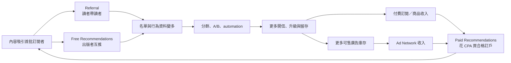

# Research: Beehiiv 如何把電子報變成營運系統

- 研究日期：2026-09-17
- 系列位置：「誰掌握創作者與讀者的關係」order 5
- 選案偏誤：Beehiiv 是英語電子報、廣告市場與 Stripe 生態的高成長 SaaS 案例；不代表小語種、本地金流或無廣告創作者的最佳工具。公司為私人企業，收入與平台成效多為管理層自報。

## 子問題

1. Beehiiv 為何不是單純寄信工具，而是成長、變現與營運的控制台？
2. Recommendations、referral、paid recommendations（原 Boosts）、Ad Network 如何形成飛輪？
3. 平台固定費、0% paid-subscription take rate 與廣告／付費推薦的收入結構如何搭配？
4. 創作者擁有哪些訂閱者、內容、網域與 Stripe 關係？搬家有何摩擦？
5. 內建 AI 的實際功能和限制是什麼？AI agent／MCP 會改變什麼？
6. 飛輪在哪些條件下失效：名單品質、廣告需求、平台依賴或成本？

## ELI5 核心直覺

一般電子報工具像一台印刷機：你把信寫好，它幫你寄。Beehiiv 想做的是整間報社的控制室：一邊看哪些讀者進來，一邊安排互推、獎勵讀者拉朋友、花錢買訂戶、接廣告、賣付費訂閱，再把結果回到分析與自動化。

每個零件都不是新發明。差異在於它們共享同一份訂閱者資料與同一個工作流程，減少創作者在五六套工具之間搬資料。

## 已驗證事實

### 方案與收費（查證日快照）

- 官方 pricing 於 2026-09-17 顯示：Launch $0、最多 2,500 subscribers；Scale 在 1,000-subscriber 條件年繳 `$43/月`（$517/year）；Max 同條件年繳 `$96/月`（$1,151/year）；Enterprise custom。
- Scale 包含 Ad Network、Recommendations、0% paid-subscription take rate、digital products、community、automations、surveys、webhooks 等；Max 再加 remove branding、Sponsorship Storefront、audio newsletters、更多 publications／seats。
- 價格按 active subscriber tier 變動，不能把 `$43/$96` 寫成所有名單規模的固定月費。SendX 等 2026 獨立指南交叉確認 Scale `$43–290`、Max `$96–404` 的年繳區間，但精確區間仍應以發文當日官方 slider 為準。
- `0% take rate` 只指 Beehiiv 不抽 paid-subscription revenue；Stripe processing、Beehiiv SaaS 月費，以及廣告／paid recommendation 各自的商業條件不能混成「零成本」。

### 成長工具不是同一件事

- **Free Recommendations**：出版者在 signup flow 互推其他 publications；核心是互惠／網路分發。
- **Paid Recommendations（原 Boosts）**：以 CPA offer 買進訂戶或接受別人的 offer 變現；官方 2026 help page顯示 Boosts 已重新命名並整合到 Grow > Recommendations，仍保留 verification、wallet、auto-accept、geo targeting。
- **Referral Program**：獎勵自己的既有讀者帶新讀者，屬第一方口碑循環，不是平台互推。
- **Ad Network**：Beehiiv 代為媒合品牌廣告、提供 one-click placement 與 performance tracking，使免費電子報能在不自建 sales team 下變現。
- **Paid subscriptions／digital products**：把部分讀者轉成直接付費；可設 monthly、quarterly、annual、lifetime、donation，並以 automation 做 upgrade／downgrade／pause offer。

### 所有權與遷移

- 官方產品更新明說出版者連接自己的 Stripe，擁有與讀者的 billing relationship，可帶走 subscribers；這是公司主張，實際搬遷仍受來源／目的平台與 Stripe transfer 流程限制。
- Beehiiv 可匯出 post content 與 subscriber CSV。Quick export 含 email、status、tier；Full export 再含 custom fields 與 statistics。這比只有 email 強，但仍不代表所有 automation、referral graph、ad history、recommendation wallet、web analytics 可一鍵重建。
- Paid subscriber import 需要 Beehiiv publication 連接的 active Stripe account，以及來源 Stripe account；流程包含 customer data migration，完成後還可能需要取消舊平台 subscriptions。這證明付費遷移是多步交易作業，不是按一下 CSV。
- 自有網域、內容與 subscriber export 提供較高退出權；但 Beehiiv 的增量價值正來自平台內 Ad Network、paid recommendations、recommendation graph、automation 與 integrated analytics，這些不可攜資產會產生工作流 lock-in。

### 公司規模數字

- Reuters 2026-01-20 報導：Beehiiv CEO 預期 2026 年 annual revenue 接近翻倍至 $50M；平台逾 40,000 monthly active users、近 15,000 paid subscribers、累計融資約 $49.7M。`$50M` 是管理層預測，不是已實現收入。
- Reuters 把成長歸因描述為 flat-fee model 與 ad network；這是採訪整理，不是因果實驗。
- 既有總覽的 `$30M ARR` 有 Sacra／Latka 等估計與 2025 時點差異；本篇最好不用，或明確標「第三方估計」。Reuters 的 `$50M 2026 expected revenue` 也不可改寫成 ARR。

### AI

- Beehiiv 官方 help 顯示 post editor 內建 AI Writer、AI Image、spell check、translation 等；spell check 僅支援英文，功能與 UI 正在更新，方案有 AI request limits。
- 2026 pricing 顯示 AI Website Builder、beehiiv MCP 與 beehiiv Agent：Launch 提供 read access，Scale／Max 提供 write access（依官方當日頁面）。這已超過既有總覽的「AI 有限」，但產品仍在快速變動，文章須標查證日。
- AI 的短期價值：寫作／翻譯／圖片／網站建置、查詢數據、把營運動作寫回系統；真正差異不在文字生成，而在 agent 能否安全操作 audience、segments、campaigns 與 monetization workflow。
- 威脅：AI 把基本電子報製作商品化，降低單一 editor 的差異；大量低品質刊物也可能污染 recommendation／ad network，增加驗證、品牌安全與 deliverability 成本。

## 成長與變現飛輪

這張圖是機制模型，不是已證的平均因果效果。尤其「買來的 subscriber 是否會開信、留存與付費」取決於 verification、內容匹配與來源品質。

## 事實交叉表

| 事實 | 一手來源 | 第二來源 | 狀態 |
|---|---|---|---|
| Launch $0/2,500；Scale $43、Max $96（1,000 subscribers、年繳） | Beehiiv pricing | SendX／多個 2026 pricing guides | ✅ 快照；必須帶條件與日期 |
| Scale paid subscriptions 為 0% take rate | Beehiiv pricing／product update | Reuters 描述 flat-fee model | ✅；不含 Stripe／SaaS 成本 |
| Free recommendations、paid recommendations、referral 是三種不同機制 | Beehiiv help | 官方 pricing／product pages | ✅ |
| 可匯出 post 與 subscriber Quick／Full CSV | Beehiiv Help | migration guides 間接驗證 | ✅ 官方操作事實 |
| 付費訂戶遷移需來源與目的 Stripe 流程 | Beehiiv paid import help | Beehiiv product update 的自有 billing relationship | ✅ 官方操作事實 |
| 2026 預期 revenue $50M；40k MAU、近 15k paid users | CEO 對 Reuters 陳述 | Reuters 報導 | ⚠️ 同一採訪源；$50M 是 forecast |
| 內建 AI Writer／Image／translation，pricing 列 MCP/Agent access | Beehiiv Help | Beehiiv pricing | ✅ 兩個官方頁；功能快速變動 |

## 推論

| 推論 | 依據 | 可能錯在哪 |
|---|---|---|
| Beehiiv 的護城河是共享資料層上的營運閉環 | 成長、廣告、訂閱、分析、automation 共站 | 各模組品質可能不如專用工具；API 可降低 lock-in |
| 免費名單可由廣告補貼，讓 creator 不必急著 paywall | Ad Network + paid subscription 並存 | 小眾／非英語刊物可能拿不到足夠廣告需求 |
| 0% paid take rate 不代表 Beehiiv 與創作者收入完全脫鉤 | SaaS 隨名單增長；廣告／paid recs 也形成交易層 | 各交易抽成與商業條款未在本輪完整核對 |
| Agent write access 會讓「電子報 OS」比 AI writer 更有價值 | pricing 明列 MCP/Agent write access | 權限、安全、可逆性與實際 agent 能力尚未實測 |

## 工具／資產比較表

| 模組 | 解決的工作 | 累積的資產 | 搬家時能否帶走 |
|---|---|---|---|
| Referral | 讓既有讀者拉新讀者 | referral attribution／獎勵狀態 | subscriber 可帶；關係圖與獎勵流程難搬 |
| Free recommendations | 出版者互推 | recommendation graph／合作關係 | 合作關係可重談；平台一鍵流量不可攜 |
| Paid recommendations | 以 CPA 獲客或變現 | source quality、wallet、verification history | 新訂戶可 export；市場與歷史不可攜 |
| Ad Network | 媒合品牌與版位 | advertiser demand、performance history | 讀者／內容可帶；需求池不可攜 |
| Paid subscriptions | 直接讀者收入 | 自有 Stripe customer／billing relationship | 較可攜，但仍需 payment migration |
| Automation／analytics | 分群、轉換、留存 | workflow 與行為歷史 | CSV 只帶部分；需重建規則與報表 |
| AI／Agent | 寫作、建站、查詢／操作 | prompts、workflow knowledge | 標準 API 有助遷移；平台 action schema 不一定可攜 |

## 文章骨架

1. ELI5：印刷機 vs 報社控制室。
2. 先拆開四種常混用的「成長」：referral、free recommendation、paid recommendation、廣告。
3. 畫飛輪：成長 → 資料 → automation → 留存／收入 → 再投資成長。
4. 商業模式：固定 SaaS＋交易網路，不只 0% 訂閱抽成。
5. 所有權：自有 Stripe、網域、內容與 CSV；不可攜的是市場、workflow 與歷史。
6. 遷移測試：免費 subscriber 容易，付費 subscriber 要處理 Stripe 與舊訂閱取消。
7. AI：從生成內容走向可讀／可寫的營運 agent；同時放大品質與品牌安全問題。
8. 失效情境：小語種無廣告需求、買來名單品質差、工具太多反而複雜、成本隨名單上升、平台網路規則改變。
9. 適合：以電子報為核心、要同時做成長＋廣告＋訂閱的營運者；不適合：只要簡單寄信、完全無廣告／增長需求，或必須自架全部資料者。

## 來源清單與完整度

| 來源 | 角色 | 完整度 | 取用日 |
|---|---|---:|---:|
| https://www.beehiiv.com/pricing | 官方價格／features | ✅ 全文；1,000 subscribers 快照 | 2026-09-17 |
| https://www.beehiiv.com/ | 官方產品定位／Ad Network | ✅ 全文 | 2026-09-17 |
| https://product.beehiiv.com/p/flexible-subscriptions-and-fresh-integrations | 官方 Stripe ownership／tier／billing | ✅ 全文 | 2026-09-17 |
| https://www.beehiiv.com/support/article/13091498232855 | 官方 paid recommendations 變更 | ✅ 全文；頁面自註仍在更新 | 2026-09-17 |
| https://www.beehiiv.com/support/article/12258595483543-exporting-post-content-or-subscriber-data-from-beehiiv | 官方 content/subscriber export | ✅ 全文 | 2026-09-17 |
| https://www.beehiiv.com/support/article/12231121444759-how-to-import-paid-subscribers | 官方 paid migration／Stripe | ✅ 全文 | 2026-09-17 |
| https://www.beehiiv.com/support/article/15882638374551-using-ai-features-in-the-beehiiv-post-editor | 官方 AI editor | ✅ 全文；頁面自註功能持續更新 | 2026-09-17 |
| https://www.reuters.com/business/substack-challenger-beehiiv-expects-revenue-nearly-double-newsletter-boom-2026-01-20/ | 獨立媒體／公司訪談與規模 | ✅ 全文；預測來自 CEO | 2026-09-17 |
| https://www.sendx.io/blog/beehiiv-pricing-plans-costs-alternatives-for-newsletter-publishers-2026 | 獨立價格交叉 | 🟡 搜尋摘要；不用於核心產品敘述 | 2026-09-17 |
| https://www.sec.gov/Archives/edgar/data/1889393/000167025424000603/document_2.pdf | 2024 crowdfunding offering／舊收入結構 | 🟡 Groundlane PDF 未回正文；搜尋索引可定位，未作結論依據 | 2026-09-17 |

## 待解問題／發文禁區

- 不沿用既有總覽「Scale $39 起」與「AI 有限」；2026-09-17 官方頁已顯示不同價格與更多 AI／Agent 功能。
- 不把 CEO 預測的 2026 `$50M revenue` 寫成已實現或 ARR。
- 不把 `$30M ARR` 當確定事實；不同第三方估算時點不一致。
- 不將 0% subscription take rate 寫成「平台完全不從交易賺錢」或「創作者零成本」。
- 不宣稱 growth loop 必然成立；需要名單品質、廣告需求、內容留存和足夠市場規模。
- Agent／MCP 僅依 pricing feature list 查到，尚未實際登入測試操作範圍、approval flow、audit log 與撤銷能力；發文應標為功能宣稱，而非已驗證體驗。
