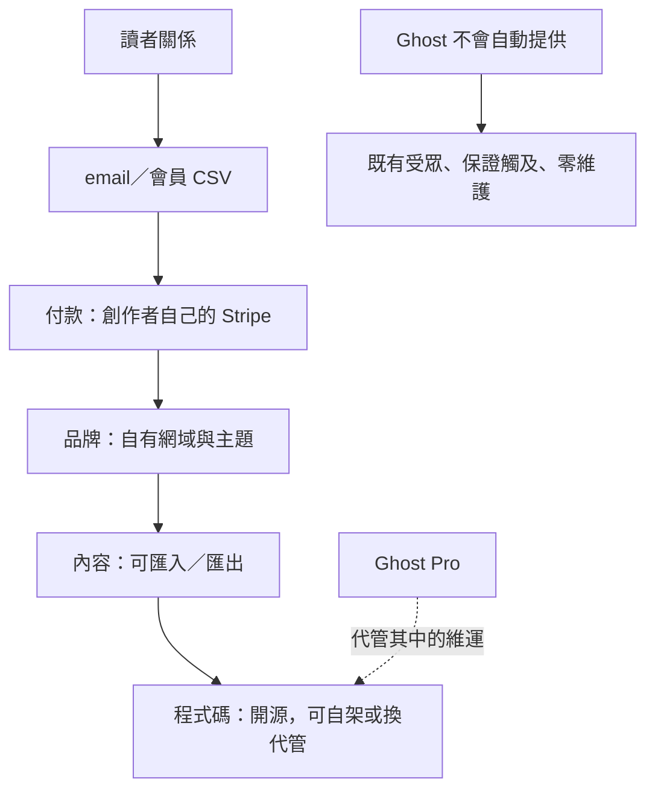

# Research: Ghost 為何代表所有權，而不只是架站

- 研究日期：2026-09-17
- 系列位置：「誰掌握創作者與讀者的關係」order 4
- 選案偏誤：Ghost 是開源／英語出版基礎設施的代表，不代表非技術創作者或台灣本地金流的最低摩擦選擇。Ghost(Pro) 與 self-hosted Ghost 必須分開談。

## 子問題

1. Ghost 所說的「獨立」具體落在程式碼、網域、品牌、會員資料與付款的哪些層？
2. 0% platform fee 的代價是什麼？目前方案如何計價？
3. 內容、會員與 Stripe 關係如何匯入／匯出？搬家是否真能不中斷扣款？
4. 沒有封閉平台 feed 的 Ghost，如何用 Recommendations、Webmention 與 ActivityPub 補發現性？
5. 所有權何時會變成維運負擔？
6. AI 對開源出版層的機會與威脅是什麼？

## ELI5 核心直覺

租百貨公司的櫃位，客人多，但招牌、動線與收銀機多半照百貨規則。Ghost 比較像自己租一間店：門牌是你的、裝潢是你的、會員簿是你的，收款直接進自己的 Stripe。你可以請 Ghost(Pro) 當物業管理，也可以自己管伺服器。

「自己有店」不等於完全沒成本。你仍要付房租／代管、Stripe、寄信與維護成本，也得自己把人帶到門口。

## 已驗證事實

### 所有權的五個控制面

- **程式碼**：Ghost 為開源軟體，可自行部署；Ghost(Pro) 是官方代管服務。開源代表可檢查、修改、換代管，不代表零維運成本。
- **網域與品牌**：Ghost(Pro) 方案支援自有網站、自訂網域與 white-label；讀者面對的是出版者品牌，不必先進 Ghost 平台首頁。
- **內容**：Ghost 提供內容遷移與匯入工具；開源資料層亦降低資料被專有格式永久鎖住的風險。
- **會員資料**：member dashboard 可 import/export lists、segment、notes 等；官方另提供從 Substack、Mailchimp、Medium、Patreon、Beehiiv、Kit 等來源遷移的指南。
- **付款**：Ghost 站點直接連創作者自己的 Stripe account；Ghost 收 0% transaction fee，仍須付 Stripe processing fee。這是它與平台代收模式最重要的差異。

### 價格與收入

- 2026-09-17 官方頁在「最多 1,000 members、年繳」條件顯示 Starter $18/月、Publisher $29/月、Business $199/月；Starter 不含 paid subscriptions，Publisher 才是會員收入比較的起點。方案價格會隨 member count 變動，不能把 `$29` 寫成所有規模的固定費用。
- 多個 2026 獨立價格指南交叉支持 `$29` Publisher 與 `$199` Business 的年繳起價，但 Starter 的 `$15/$18` 描述因計費週期或近期變動不一致。文章應直接寫查證日期、年繳條件與 audience size。
- Ghost 6.0 官方稱 Ghost publishers 累計收入超過 $100M，Nieman Lab 2025-08 報導亦引用並清楚標為 Ghost 數據。它不是 Ghost 公司營收，也不是單年度 GMV。

### 發現性：從孤島走向開放網路

- Ghost Recommendations 以 Webmention 開放標準傳遞推薦；可推薦任何網站，Ghost-to-Ghost 支援新會員訂閱後的一鍵訂閱體驗。
- Ghost 6.0 把 ActivityPub 社交網路整合到所有 Ghost 6.0 站點，官方稱可跨 Bluesky、Flipboard、Threads、Mastodon、WordPress、Ghost 等相容網路被 follow、like、reply。Nieman Lab 獨立報導確認此次方向。
- 這使「Ghost 完全沒有發現性」成為過時說法。更準確：Ghost 沒有單一公司控制的封閉推薦 feed；它用開放協定、出版者互推與自帶流量換較高控制權。實際 reach 與轉換是否能比 Substack／Patreon，公開資料不足。

### 遷移性

- 匯入免費會員只需要 email，其他欄位可選；CSV 可帶 labels／name／complimentary status 等，但依來源格式不同。
- 付款能否無痛搬移取決於「原本是否就是創作者自己的 Stripe account」。Ghost 的 Substack migration guide 可在符合 Stripe 資料轉移條件時處理付費訂戶；從封閉平台搬來仍可能需要協調 payment migration、statement descriptor 與 URL redirects。
- 搬離 Ghost 時，會員 CSV、內容、網域與自有 Stripe 關係都比平台代收容易帶走；但 theme、integration、analytics history、email reputation 與 ActivityPub identity 的移轉仍可能有成本。

### AI

- 本輪未找到 Ghost 核心產品內建生成式寫作助手的官方頁；搜尋到的 GhostAI／OpenAI 為社群或第三方整合，不應寫成 Ghost 官方功能。
- Ghost 的 API、open source 與 integration model 讓出版者能自行接 AI，優點是模型／資料流可自選；缺點是沒有 Beehiiv 那種一體化體驗，治理責任也落在出版者。
- AI 搜尋可能攔截公開文章點擊；Ghost 的防禦不在「更多 AI 文」，而在自有網域、直接 email、付費會員、可辨識品牌與跨開放社交網的關係。
- 風險：開源內容更容易被 crawler 取得；出版者仍需自行決定 robots、licensing 與內容策略。所有權提供選擇權，不自動提供談判力。

## 事實交叉表

| 事實 | 一手來源 | 第二來源 | 狀態 |
|---|---|---|---|
| Ghost 對會員收入收 0% transaction fee，付款直連自有 Stripe | Ghost Help | 多個獨立定價比較；Stripe 費用另計 | ✅ |
| Ghost(Pro) Publisher 年繳、1,000 members 起價 $29/月 | Ghost pricing 2026-09-17 | 2026 獨立價格指南／Ghost forum 討論 | ✅；必須帶條件與日期 |
| Ghost publishers 累計收入逾 $100M | Ghost 6.0 | Nieman Lab 2025-08 | ✅ 公司統計獲獨立媒體明確轉述；非審計 |
| Recommendations 採 Webmention | Ghost developer docs | W3C Webmention 標準頁可驗協定定義 | ✅ |
| Ghost 6.0 支援 ActivityPub social web distribution | Ghost 6.0 | Nieman Lab | ✅ |
| 會員資料可 import/export；有多平台 migration guides | Ghost Help | Ghost developer migration docs | ✅ 官方操作事實 |

## 推論

| 推論 | 依據 | 可能錯在哪 |
|---|---|---|
| Ghost 賣的是退出權，不只是架站 | 自有 domain、Stripe、CSV、open source | 多數非技術使用者可能不會真的行使退出權 |
| 開放網路能部分補回所有權與發現性的取捨 | Webmention + ActivityPub | 沒有公開的可比轉換數據；開放網路可能 reach 小 |
| 0% 抽成特別適合高營收／小名單出版者 | 費用按 member count、非 revenue | 高免費訂戶數會推高 Ghost(Pro) 費用；自架亦有維運成本 |
| AI 時代自有網域與 email 更重要 | 搜尋中介可能攔截點擊 | email deliverability、品牌建立也依賴外部基礎設施 |

## 建議圖表

### Mermaid：控制權堆疊

### 所有權比較表

| 層次 | 封閉會員平台 | Ghost(Pro) | Self-hosted Ghost |
|---|---|---|---|
| 網域／品牌 | 部分 | 高 | 高 |
| 會員 CSV | 常可匯出基本欄位 | 可匯入／匯出與分群 | 可直接控制資料庫＋export |
| 付款關係 | 常由平台代收 | 自有 Stripe | 自有 Stripe |
| 程式碼／主機 | 無 | 程式開源、主機由 Ghost 管 | 程式與主機皆自管 |
| 發現性 | 平台 feed／推薦 | Webmention、ActivityPub、自帶流量 | 同左，但需自行維運 |
| 隱形成本 | 抽成／政策依賴 | member-based 月費 | DevOps、寄信、備援、安全 |

## 文章骨架

1. ELI5：百貨櫃位 vs 自己的店。
2. 「所有權」拆成程式碼、內容、品牌、會員、付款五層。
3. 0% 不是免費：Ghost(Pro) 按名單規模收費，自架用時間與維運付費。
4. 自有 Stripe 為何比可匯出 email 更接近真正的商業可攜性。
5. 遷移的現實：CSV、Stripe、URL、theme、analytics、sender reputation 分層搬。
6. 反駁「Ghost 沒發現性」：Recommendations／Webmention／ActivityPub，但不誇大成等同封閉 feed。
7. AI：開放整合與控制權是選擇權，不是自動護城河。
8. 適合已有受眾、重品牌／付款控制、願意承擔設定者；不適合想靠平台自動配流量、完全不想碰技術／營運者。

## 來源清單與完整度

| 來源 | 角色 | 完整度 | 取用日 |
|---|---|---:|---:|
| https://ghost.org/pricing/ | 官方 Ghost(Pro) pricing | ✅ 全文；動態 member slider 僅核對 1,000 members 條件 | 2026-09-17 |
| https://ghost.org/help/are-there-really-no-transaction-fees/ | 官方 Stripe／0% fee | ✅ 全文 | 2026-09-17 |
| https://ghost.org/help/member-management/ | 官方會員管理／export | ✅ 全文 | 2026-09-17 |
| https://ghost.org/help/import-members/ | 官方 migration 索引 | ✅ 全文 | 2026-09-17 |
| https://ghost.org/docs/members/requirements/ | 官方 membership requirements | ✅ 全文 | 2026-09-17 |
| https://docs.ghost.org/recommendations | 官方 Recommendations／Webmention | ✅ 全文 | 2026-09-17 |
| https://ghost.org/changelog/6/ | 官方 Ghost 6.0、ActivityPub、$100M | ✅ 全文；公司自報數字 | 2026-09-17 |
| https://www.niemanlab.org/2025/08/ghost-makes-it-easier-to-publish-to-the-social-web/ | 獨立二手產品／數字 | ✅ 全文 | 2026-09-17 |
| https://forum.ghost.org/t/updated-ghost-pro-pricing-july-2025-15-mo-starter-29-mo-publisher-199-mo-business/59090 | 價格變更脈絡 | 🟡 搜尋摘要／社群討論，不作主要來源 | 2026-09-17 |
| https://www.w3.org/TR/webmention/ | Webmention 標準 | 🟡 未於本輪全文重讀；只作協定定義備援 | 2026-09-17 |

## 待解問題／發文禁區

- 不沿用既有總覽的 `$9–199/月`：目前官方起價與 feature gates 已變動。
- 不說「Ghost 完全沒有推薦／社群分發」：Ghost 6.0 後已不成立。
- 不把 `$100M` 寫成 Ghost 公司營收或年度 creator GMV。
- 不把 open source 寫成免費、容易或安全；自架成本需另估。
- 不把 CSV export 等同完整可攜；sender reputation、analytics、comments、social identity 仍有摩擦。
