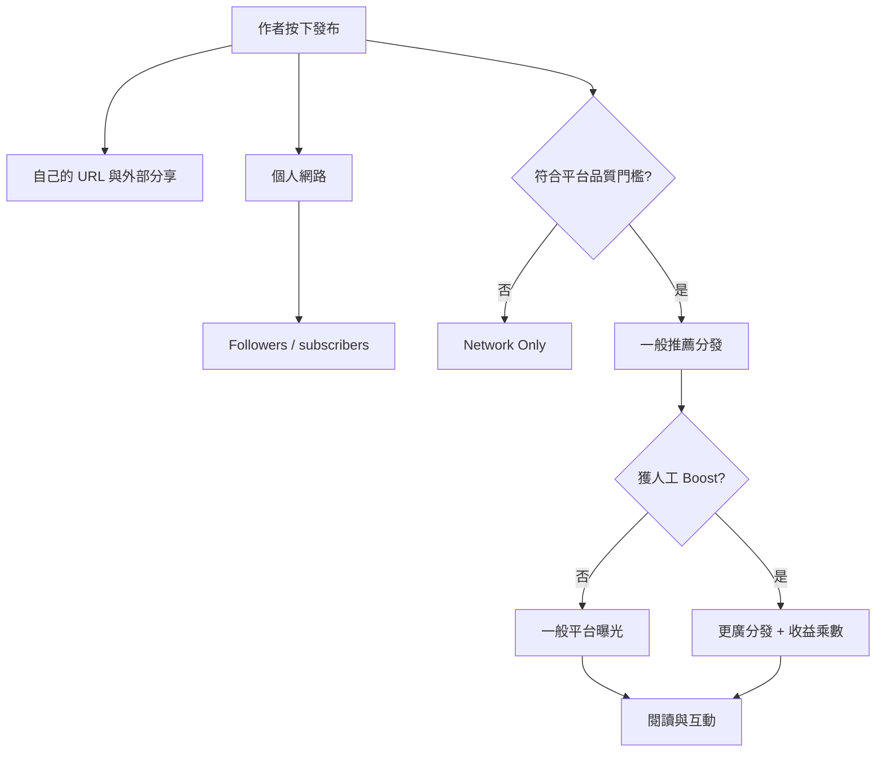
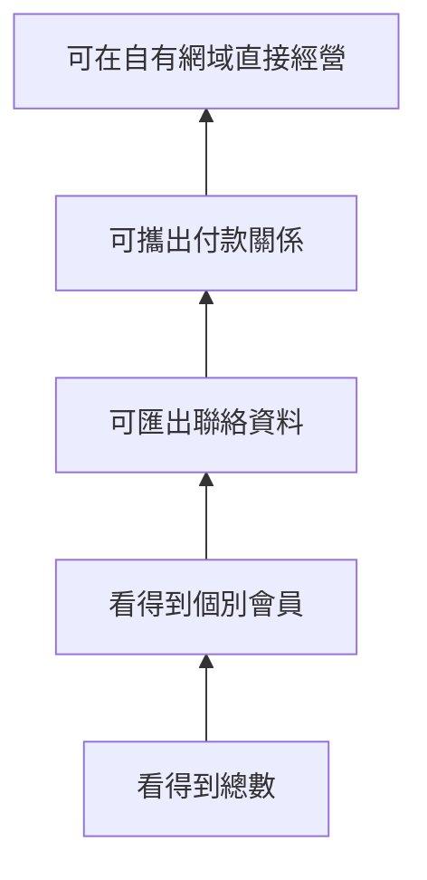

# Research: Medium、Vocus 的平台流量值多少控制權？

研究日期：2026-09-17

預定系列：`誰掌握創作者與讀者的關係` order 1

## 母群、選案與偏誤

母群定義：讓個人或小型創作團隊公開發文、接受平台分發，並可直接或間接變現的文字內容平台；排除純電子報 SaaS、自架 CMS、傳統媒體投稿系統與以影音為主的平台。

掃描範圍包含 Medium、Vocus、Substack、Patreon、Ghost、Beehiiv、PressPlay。本文只選 Medium 與 Vocus，因為兩者都用「站內分發」交換部分控制權，但分別代表全球英文內容池與台灣繁中內容社群。Substack 的平台發現性與 10% 抽成另列 order 2。

| 維度 | Medium | Vocus | 缺口／偏誤 |
|---|---|---|---|
| 市場 | 國際、英文為主 | 台灣、繁中為主 | 未覆蓋日本、韓國與中國平台 |
| 主要分發 | 演算法一般分發、人工作品 Boost、publication | 官方首頁／App／電子報、精選與搜尋曝光；確切排序規則未完整公開 | Vocus 分發機制多依平台自述與單一創作者經驗 |
| 主要變現 | Medium 會員池按表現分配 | 訂閱、單次購買、數位商品、廣告、贊助 | 不比較課程與商務合作抽成 |
| 讀者關係 | follower／email subscriber 留在 Medium；新訂戶 email 不交給作者 | 可看沙龍會員、狀態與活動；可匯出訂單 CSV | 沒有找到 Vocus 可匯出完整 email 名單的官方證據 |
| 生命週期 | 2012 起、多次調整分發與分潤 | 2015 起，從募資／訂閱轉成創作社群 | 缺少失敗平台對照 |

偏誤：Medium 的功能文件完整，Vocus 的公開文件較分散；Vocus 流量成效的外部證據多為創作者個案，不能代表全體。兩家公司皆為私人公司，缺少可稽核的分發、留存與創作者收入分布資料。

## 子問題

1. Medium 與 Vocus 各自如何把文章送到原有粉絲與陌生讀者？
2. 創作者為這些流量交出哪些定價、分潤、資料與品牌控制權？
3. email、會員、付款與互動資料究竟能否攜出？
4. 台灣的語言、金流、發票與稅務，如何讓 Vocus 的價值不同於 Medium？
5. AI 生成內容與 AI 搜尋，如何同時提高供給、壓低搜尋點擊，並改變平台分發價值？

## 核心結論

1. **平台流量不是一包固定流量，而是一串閘門。** Medium 明確區分個人網路、一般演算法分發、人工 Boost、publication 與外部搜尋；每一層都可能放大文章，但創作者不能保證進入哪一層。
2. **Medium 最重要的代價不是抽成，而是讀者身份不可攜。** 官方說明明載：Medium 已不再把新 email subscribers 的 email 地址分享給作者；只能匯出既有、過去可取得的名單。創作者能「寄到讀者」，不等於能把讀者帶走。
3. **Vocus 交換的是台灣營運摩擦。** 它整合藍新、LINE Pay、PayPal、電子發票、提領與台灣稅務流程；對台灣個人創作者，這些後台工作可能比抽成率更有價值。
4. **Vocus 的「會員名單由自己掌握」要拆成權限層級。** 官方後台讓創作者檢視會員暱稱、付費狀態、流失與活動，也能匯出訂單 CSV；但公開文件未證實能匯出完整 email 名單或把付款授權移到別的平台。可管理不等於可攜。
5. **AI 讓「平台幫你篩選」同時升值與變危險。** 生成式 AI 壓低內容供給成本，平台需要更強的品質治理；Medium 已限制未揭露 AI 內容的網路分發。另一方面，AI 搜尋降低外部搜尋點擊，使站內推薦與直接 email 更重要，也讓依賴平台分發的創作者更難判斷真正需求。

## Medium：分發漏斗

Medium 官方把文章分發拆成兩大系統：

- 個人網路：作者 profile、followers 的 Following feed、Digest、作者選擇寄出的 email notification。
- 平台網路：For You、非追蹤者 Digest、topic pages、App Explore、其他文章下方推薦、登出首頁。

平台網路裡又有兩個重要閘門：

- 一般分發：文章預設可進推薦，但垃圾、成人或低品質內容可能被限制成 Network Only。
- Boost：人類策展者與合作 publication 編輯挑選後，得到更廣分發；Boost 文章的 Partner Program engagement points 也有較高乘數。

這張圖的重點不是 Boost 好不好，而是流量控制權：作者掌握發布與外部導流，Medium 掌握陌生讀者的曝光閘門與收益權重。

### Medium 的分潤不是固定稿費

Medium 官方目前列出的 Partner Program 因子包括：付費會員閱讀／聆聽時間、claps／highlights／replies、Boost bonus、外部流量 bonus、搜尋 bonus、email notification bonus、新會員轉換的一次性金額，以及 30 秒 member read ratio 的最後調整。

這代表作者無法從「一千次瀏覽」直接推算收入。Medium 也明說計算模型會定期更新；Partner Program 條款保留調整績效與收入因子的權利。文章可以說「公式由平台治理」，不要編造單篇 CPM 或固定分潤比例。

### Medium 的資料可攜性：最容易誤判的地方

| 資產 | 作者能否查看 | 能否攜出 | 證據邊界 |
|---|---|---|---|
| 文章內容 | 是 | 可另行備份／重發，但本輪未驗證完整匯出格式 | 會員內容權利仍受平台條款與 paywall 設定影響 |
| Followers | 可看數量與 audience stats | 沒有證據可匯出其外部身份 | follower 是 Medium 帳號關係 |
| Email subscribers | 可寄通知、看名單介面 | **只有既有 email lists 可匯出；新訂閱者 email 不再交給作者** | Medium 官方 Help Center 明載 |
| 閱讀／互動 | 可看 presentations、views、reads 等 | 未找到完整事件級匯出證據 | 儀表板存取不等於資料所有權 |
| 付款關係 | Partner Program 由 Medium 統一付款給作者 | 不可搬成作者自己的會員訂閱 | 讀者買的是 Medium membership，不是特定作者訂閱 |

最精準的說法是：Medium 給作者「在平台內接觸受眾」的權限，但不等於交付第一方客戶關係。

## Vocus：在地營運層，而不只是文章流量

Vocus 的公開創作者頁自報 96 萬會員、11 萬創作者、單月 900 萬不重複訪客與每月 2.5 億搜尋曝光。這些是 **2026 官方行銷頁自報，未經獨立稽核**；不應用來估算個別作者可得流量。2025 年一位創作者文章轉述較早官方數字為 72 萬會員與 850 萬月訪客，顯示指標會更新，也可能使用不同統計期。

更可靠的產品事實是：

- 可用免費公開、單次購買與訂閱模式。
- 內容方案的平台營運服務費為 20%；另有第三方金流與稅務扣項。此費率有 Vocus 現行官方指南，以及中央社 2021 年對創辦人的專訪交叉支持；其他金流細項只有當前官方一手，發文時應直接 inline 引用並註明日期。
- 平台整合藍新金流與綠界發票，處理訂單客服、提領、台灣個人稿費所得申報與部分扣繳流程。
- 後台能以付費狀態管理會員、查看流失與活躍度；訂單資料可匯出 CSV。
- 會員條款說創作者保有內容著作權，並以非專屬方式授權平台發布。

### 「不受演算法左右」與實際分發有張力

Vocus 2026 創作者招募頁寫「創作者不受演算法左右」，同頁又主打搜尋曝光、App 推播、電子報與平台流量。2025 年單一創作者經驗則描述即時精選、TOP5 與人工方格精選三種站內曝光，其中即時精選被作者理解為演算法決定。

這是 **敘事衝突，不是已證實的平台矛盾**：

- 官方句子可能只是說創作者能直接管理自己的沙龍會員，不代表首頁完全沒有排序。
- 創作者對精選機制的描述是個人觀察，官方未在本輪全文來源中確認 TOP5／即時精選規則。

文章應寫成：「Vocus 同時提供直達會員的社群空間與站內曝光，但公開資料不足以量化兩者各占多少。」不要寫「Vocus 完全不靠演算法」或「演算法保證新手曝光」。

### Vocus 的資料可攜性

| 資產 | 已驗證能力 | 未驗證／不可外推 |
|---|---|---|
| 內容 | 著作權歸創作者；可同步發在別處 | 是否有完整內容匯出工具未驗證 |
| 會員 | 可在後台看全部、訂閱中、一次購買、流失、未付費會員與活動 | 沒有找到可匯出會員 email 的官方說明 |
| 訂單 | 可依日期／方案篩選並匯出 CSV | 訂單 CSV 是否含可在站外行銷的個資未公開 |
| 付款 | 平台處理金流、發票、退款與提領 | 沒有找到把 recurring payment token 搬到站外的官方機制 |
| 搜尋／推薦數據 | 官方提供儀表板並宣稱有會員名單與數據 | 沒有事件級資料出口或 API 的公開證據 |

Vocus 隱私政策原則上不把會員個資揭露給第三方，除非為了提供訂閱產品／服務或取得授權。因此「創作者擁有會員名單」不應直接翻譯成「創作者擁有 email 地址」。

## 台灣與國際差異

| 問題 | Medium | Vocus | 對台灣創作者的意義 |
|---|---|---|---|
| 語言市場 | 全球平台，英文內容池較大 | 繁中與台灣社群集中 | 繁中創作者在 Vocus 較容易遇到同語讀者，但不能假設流量更大 |
| 金流 | 作者收入來自 Partner Program；非自訂讀者訂閱 | 作者可自訂方案，平台處理本地支付與發票 | Vocus 替個人省掉台灣金流、發票與客服摩擦 |
| 定價控制 | 讀者付 Medium membership，作者不能替單篇建立自己的會員價 | 創作者可設訂閱／購買方案價格 | Vocus 比 Medium 更接近直接生意，但仍由平台結帳 |
| 客戶資料 | 新 email subscriber 地址不提供作者 | 可管理會員／匯出訂單，email 可攜性未證 | 兩者都不能因有 dashboard 就稱為完全擁有受眾 |
| 搜尋與推薦 | 全球 SEO、一般推薦、人工作品 Boost | 官方自報搜尋曝光、站內／App／email 分發 | 流量來源不同，不能只比較抽成 |

## AI 影響

### 供給端：低成本內容讓分發閘門更重要

Medium 明確禁止把低編修的 AI-generated writing 放入 Partner Program；未揭露的 AI 生成內容只給 Network Only，不進廣泛推薦。這證明 AI 已直接進入「誰能得到平台流量」的治理層。

WIRED 2024 委託兩家偵測公司抽樣，分別估計 Medium 近期文章約四成以上可能由 AI 生成；但 AI detector 有 false positives，Medium CEO 也反對用偵測器推算整體比例。因此這組數字只能呈現「平台面臨大量疑似 AI 內容」的風險，不能當成真實占比。

Vocus 本輪沒有找到同等明確的 AI 內容／分發政策。不可因此寫成「Vocus 沒有 AI 治理」，只能列為未公開或未找到。

### 需求端：搜尋曝光不再等於點擊

Pew 以 2025 年 3 月 900 位美國成人、68,879 次 Google 搜尋的瀏覽資料分析：有 AI summary 的結果頁，傳統結果點擊發生於 8% 的造訪；沒有 AI summary 時為 15%。AI summary 內來源連結只在 1% 的造訪被點擊。這是美國樣本、Google 搜尋、特定月份，不能直接套成 Medium 或 Vocus 的流量跌幅。

可用的窄推論：

- 依賴 SEO 的平台文章可能被 AI summary 截留點擊。
- 平台內推薦與直接 email 因此更有相對價值。
- 但若 email 身份與付費關係不能攜出，創作者可能用更高的依賴性換取短期流量。

## 事實交叉表

| 事實 | 來源 1 | 來源 2 | 狀態 |
|---|---|---|---|
| Medium 有個人網路、一般分發、Boost 等不同路徑 | Medium「What happens…」 | Medium earnings calculation | ✅ 兩個官方全文 |
| Medium 新 email subscribers 的地址不再交給作者 | Medium Email notifications 現行說明 | Medium 早期 newsletter mailing lists（只支持過去 opt-in 可匯出） | ✅；政策前後變化清楚 |
| Medium 收益公式會變，且不是固定每千次瀏覽 | earnings calculation | Partner Program terms 搜尋候選與官方頁 | ✅ 核心由一手全文支持；不寫固定金額 |
| Vocus 內容方案服務費 20% | Vocus 現行創作者指南 | 中央社 2021 創辦人專訪 | ✅；第二來源較舊，發文需標現行費率日期 |
| Vocus 可匯出訂單 CSV | Vocus「如何管理沙龍會員及訂單」 | 收入指南亦稱可下載月份明細 | ✅ 兩個官方頁 |
| Vocus 可匯出會員 email | 未找到 | 未找到 | ⚠️ 不可宣稱 |
| Vocus 官方自報 96 萬會員、900 萬單月 UV | 2026 become_creator | 2025 創作者文轉述較早官方數字 72 萬／850 萬 | ⚠️ 時點不同、公司自報；不拿來估個人觸及 |
| AI summaries 與較低外部點擊相關 | Pew 原始分析 | 多家媒體轉述，但本 dossier 以 Pew 為主 | ✅ 對該美國樣本；不可外推平台跌幅 |

## 推論（不得寫成事實）

| 推論 | 依據 | 可能錯在哪 |
|---|---|---|
| Medium 適合把平台當上游曝光，不適合把它當唯一客戶資料庫 | 分發強、但新 email 地址不交給作者 | 某些作者不需要站外關係，只想賺 Partner Program |
| Vocus 的 20% 買的是台灣營運後台，不只流量 | 金流、發票、稅務、客服、訂單與會員管理 | 成熟創作者可能可用更低成本自行整合 |
| AI 讓站內策展價值上升 | AI 供給增加、搜尋點擊下降 | AI 搜尋也可能引用平台內容帶來品牌曝光；因果未量化 |
| 「可看會員」會製造所有權錯覺 | Vocus dashboard 可管理但未證 email／付款可攜 | 平台可能有未公開或登入後才見的匯出功能 |

## ELI5 比喻

把平台想成百貨公司的美食街：

- Medium 像國際大百貨。你不用自己找每個客人，百貨會把餐點放到推薦櫃位；但客人辦的是百貨會員卡，新會員的聯絡資料不一定交給你。
- Vocus 像台灣在地百貨。它不只給櫃位，還替你收台幣、開發票、處理退費與會員分層；代價是每筆交易要付平台費，而且顧客的付款通行證仍留在百貨系統。
- 真正的問題不是「百貨抽多少」，而是關店搬走時，你帶得走食譜、熟客名單、聯絡方式，還是只有過去營業額報表。

## 可用圖表草圖

### 圖 1：平台分發漏斗（正文首選）

使用上方 Mermaid；每層標「作者控制／平台控制」，比單純畫流量箭頭更有用。

### 圖 2：資料所有權階梯

Medium 新訂戶大致停在 B；Vocus 已驗證到 B，訂單資料到 C 的鄰近層但不是 email；不可在沒有證據時把任一平台放到 D。

### 比較表構想

以「陌生讀者分發、定價權、email 身份、付款關係、內容匯出、在地金流、規則變更權」七欄比較 Medium／Vocus；每格只寫已驗證能力，未知就標「未找到公開證據」。

## 文章骨架

1. ELI5 百貨美食街：人流多，不等於客人是你的。
2. 拆解平台分發漏斗：追蹤者、推薦、精選、搜尋。
3. Medium：用全球內容池換定價與受眾身份控制。
4. Vocus：用 20% 與平台關係換台灣金流、發票、社群與曝光。
5. 所有權階梯：dashboard、CSV、email、付款 token 是四回事。
6. AI 後的變化：內容供給暴增、搜尋點擊下降、策展升值。
7. 結論：先決定要租流量還是累積可搬走的關係，最好把平台當上游而非唯一地基。

## 來源清單與讀取完整度

| 來源 | 角色／支持 claim | 完整度 | 訪問日 |
|---|---|---|---|
| [Medium: What happens when you publish](https://help.medium.com/hc/en-us/articles/360018677974-What-happens-to-your-story-when-you-publish-on-Medium) | 官方；分發路徑 | ✅ 全文 7,898 chars | 2026-09-17 |
| [Medium Partner Program earnings calculation](https://help.medium.com/hc/en-us/articles/360036691193-Medium-Partner-Program-earnings-calculation) | 官方；現行收益因子 | ✅ 全文 5,489 chars | 2026-09-17 |
| [Medium Stats](https://help.medium.com/hc/en-us/articles/215108608-Stats) | 官方；presentations/views/reads/audience | ✅ 全文 3,874 chars | 2026-09-17 |
| [Medium Email notifications](https://help.medium.com/hc/en-us/articles/360059837393-Email-notifications) | 官方；新 email 不分享、既有名單可匯出 | ✅ 全文 8,288 chars | 2026-09-17 |
| [Medium Newsletter mailing lists](https://medium.com/blog/newsletter-mailing-lists-53088c958665) | 官方舊文；過去 opt-in email 可匯出 | ✅ 全文 1,085 chars | 2026-09-17 |
| [Medium AI content policy](https://help.medium.com/hc/en-us/articles/22576852947223-Artificial-Intelligence-AI-content-policy) | 官方；AI 內容與分發／變現規則 | ✅ 全文 5,911 chars | 2026-09-17 |
| [WIRED: AI Slop Is Flooding Medium](https://www.wired.com/story/ai-generated-medium-posts-content-moderation/) | 獨立二手＋兩家 detector 分析；AI 供給風險 | ✅ 全文 12,532 chars；需保留偵測限制 | 2026-09-17 |
| [Vocus 收入分潤與提領](https://creator.vocus.cc/vocus-ti-gong-gei-chuang-zuo-zhe-de-feng-fu-bian-xian-ji-zhi/shou-ru-fen-run-yu-ti-ling-shuo-ming) | 官方；費率、金流、稅務、提領 | ✅ 全文 11,806 chars | 2026-09-17 |
| [Vocus 訂閱制／購買制](https://creator.vocus.cc/vocus-ti-gong-gei-chuang-zuo-zhe-de-feng-fu-bian-xian-ji-zhi/ding-yue-zhi-gou-mai-zhi-tou-guo-dan-xing-de-fang-an-she-ding-shi-jian-nei-rong-bian-xian-yu-jiao-li) | 官方；產品模式 | ✅ 全文，工具輸出部分展示截短但回報 `truncated:false` | 2026-09-17 |
| [Vocus 管理沙龍會員及訂單](https://vocus.cc/help_center/ru-he-guan-li-sha-long-hui-yuan-ji-ding-dan) | 官方；會員狀態、活動、訂單 CSV | ✅ 全文 3,146 chars | 2026-09-17 |
| [Vocus creator landing](https://vocus.cc/become_creator) | 官方自報；產品與規模指標 | ✅ 全文 2,585 chars | 2026-09-17 |
| [Vocus 隱私權政策](https://vocus.cc/terms/privacy) | 官方；會員個資使用／揭露邊界 | ✅ 全文 2,756 chars | 2026-09-17 |
| [Vocus 會員服務條款](https://vocus.cc/terms/member) | 官方；著作權、金流、平台終止權 | ✅ 全文 6,024 chars | 2026-09-17 |
| [中央社：方格子創辦人專訪](https://www.cna.com.tw/news/acul/202106050023.aspx) | 獨立媒體；歷史、20% 抽成、早期規模 | ✅ 全文 1,766 chars；2021 舊資料 | 2026-09-17 |
| [Vocus 創作者半年流量實測](https://vocus.cc/article/6859192efd8978000127e451) | 一手使用者個案；精選與流量體感 | ✅ 全文 3,222 chars；不可外推全體 | 2026-09-17 |
| [Pew: AI summaries and clicks](https://www.pewresearch.org/short-reads/2025/07/22/google-users-are-less-likely-to-click-on-links-when-an-ai-summary-appears-in-the-results/) | 獨立原始分析；AI summary 點擊差異 | ✅ 全文 8,734 chars | 2026-09-17 |

## 未採用／受阻來源

- Medium 2026 Partner Program blog update：Groundlane fetch 整體失敗；核心現行公式已由官方 Help Center 全文取代。
- Medium Distribution Guidelines：Groundlane fetch 失敗；分發與 Network Only 的核心資訊由其他兩個官方全文頁交叉支持。
- Vocus email 名單匯出：多輪 Groundlane 搜尋沒有找到官方說明。這是「未找到證據」，不是證明功能不存在。

## 發文紅線

- 不寫「Medium 作者擁有 email list」；現行政策恰好相反，新訂閱者地址不分享。
- 不寫「Vocus 完全不靠演算法」，也不把單一作者觀察當官方排序規則。
- 不把 Vocus 官方規模自報換算成每位創作者的平均流量或成功率。
- 不寫「Vocus 會員可完整匯出」或「付款能搬走」，除非補到官方全文。
- 不把 Pew 美國 Google 樣本直接寫成 Medium／Vocus 流量跌幅。
- 不把 AI detector 的估計當成 Medium 真實 AI 文章占比。
