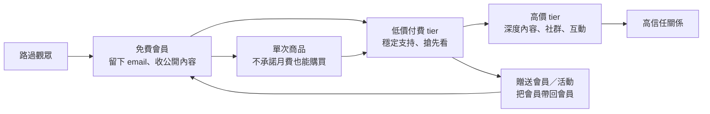

# Research: Patreon 如何把支持者變成會員

- 研究日期：2026-09-17
- 系列位置：「誰掌握創作者與讀者的關係」order 3
- 母群／選案偏誤：本系列比較以英文市場、平台公開資料完整的大型服務為主。Patreon 代表「跨媒介會員平台」，不是電子報 SaaS；其公開成效數字多為公司自報，無法代表典型創作者。

## 子問題

1. Patreon 如何把一次性的「我喜歡你」變成持續會員關係？
2. 免費會員、付費 tier、單次商品、社群與內容各自處在什麼價值階梯？
3. 創作者實際擁有 email、品牌、會員資料與付款關係中的哪些部分？
4. 推薦、Explore、Autopilot 是否構成成長飛輪？其證據強度如何？
5. 搬離 Patreon 時，能帶走什麼、必須重建什麼？
6. AI 對會員平台是創作效率、內容氾濫，還是信任／政策問題？

## ELI5 核心直覺

街頭藝人的帽子只能收一次零錢。Patreon 做的是在旁邊蓋一間會員俱樂部：路過的人可以先免費加入、熟客每月付費進不同房間、鐵粉再買單次商品或贈送會籍。創作者買到的不只是收款頁，而是把「偶爾喜歡」一步步變成「持續參與」的階梯。

但俱樂部的門禁、扣款與站內互動由 Patreon 經營。創作者可下載聯絡人清單，不等於能把每張信用卡授權原封不動搬走。

## 已驗證事實

### 產品與會員價值階梯

- Patreon 在 2023–2024 年把定位從付費 membership 擴成 media、community、business platform：免費會員、Shop／單次購買、community chats、原生影音與 livestreaming，皆可成為付費 tier 之外的接觸面。
- 公司 2024 年回顧稱平台超過 6,000 萬個 free memberships；這是累積／平台總量的公司自報，不能解讀成 6,000 萬名獨立活躍使用者。
- 免費會員讓粉絲先留下聯絡方式與接收公開內容；付費 tier 再用獨家內容、搶先看、社群或其他 benefits 分層；單次商品則服務尚未願意承諾月費的人。
- TechCrunch 2024 報導公司數據：每月約 40 萬免費會員升級付費，Autopilot 測試使 free-to-paid upgrade rate 平均提高 19%；這是 Patreon 提供給媒體的測試結果，沒有公開樣本、基準 conversion rate、信賴區間或長期留存，文章只能標成「公司測試稱」。

### 費率

- 2025-08-04 後發布頁面的新創作者採 standard 10% platform fee；既有創作者保留舊方案，若取消發布後重開可能轉入 10%。另有 payment processing、currency conversion、payout fees，不能把 10% 寫成總成本。
- 費率由 Patreon help center 一手頁與 TechCrunch 2025-06-16 報導交叉確認。舊 Premium／merch 與 legacy plan 有例外，文章不要用「Patreon 一律抽 10%」。

### 成長與發現性

- Patreon 官方稱 free membership、creator recommendations、Explore 合計每年為創作者帶來逾 2 億美元；該數字沒有公開歸因方法，二手來源多為轉述同一公司聲明，故只能寫「Patreon 稱」。
- 官方同頁說 creator recommendations 推出後已帶來逾 200 萬個新 memberships；案例 The Fluffy Folio 的 6 個月期間，12% 新付費會員、37% 新免費會員來自推薦。這是單一案例，不可外推平台平均。
- 推薦與 Explore 的商業作用：更多免費會員 → 更多可轉換對象 → 更多付費／商品收入 → Patreon 抽成增加 → 平台有資源改善推薦。這是誘因一致的推論，不是已證的因果閉環。

### 所有權與遷移

- Patreon 提供 audience/contact CSV export，可依條件下載 email 等聯絡資料。這支持「聯絡名單可攜」，不支持「完整關係可攜」。
- 可攜資產：email／聯絡資料、創作者自己的原始內容檔、品牌在其他網域與社群的認知。
- 難攜資產：站內付費授權／扣款續訂、tier entitlement、留言、聊天、閱讀與互動歷史、推薦排名、原生影音與社群習慣。公開 export 文件沒有承諾輸出完整互動圖譜或付款憑證。
- 因此 Patreon 是「資料部分可攜、付款與行為脈絡高度平台化」。不要簡化成「完全不擁有 email」，也不要反過來因 CSV export 就稱零 lock-in。

### AI

- 本輪沒有找到 Patreon 內建通用 AI 寫作助手的一手產品頁；不能據此斷言平台「沒有任何 AI」。較清楚的 AI 相關一手材料是內容政策：一般頁允許符合規範的 AI 作品；Adult/18+ 的 hyperrealistic 人物需是真人並有明確同意文件。
- 機會：用 propensity model 找可能升級的免費會員、摘要長內容、協助 moderation／客服；Autopilot 已顯示 Patreon 在做預測式轉換，而非只做生成式寫作。
- 威脅：AI 讓可替代內容供給暴增，使「多發內容」更不稀缺；會員價值會往人格、持續互動、社群地位、現場／幕後 access 移動。AI 成人內容也把 consent、真偽與 payment-partner compliance 變成平台成本。

## 事實交叉表

| 事實 | 一手來源 | 第二來源 | 狀態 |
|---|---|---|---|
| 新創作者 standard platform fee 為 10%，自 2025-08-04 後適用 | Patreon Help Center | TechCrunch 2025-06-16 | ✅ |
| 10% 之外仍有 processing 等費用 | Patreon Help Center | The Verge／TechCrunch 費率報導 | ✅ |
| 2024 年超過 6,000 萬 free memberships | Patreon 2024 review | 無獨立資料集；媒體多轉述 | ⚠️ 公司自報，勿寫獨立人數 |
| Discovery 工具每年帶來逾 $200M 給創作者 | Patreon News | Contrary 等僅轉述 Patreon | ⚠️ 公司自報、歸因未公開 |
| 每月 40 萬 free→paid；Autopilot 測試 +19% | Patreon 對外產品資料 | TechCrunch 2024-09-17 | ⚠️ 同源公司數據，缺實驗細節 |
| 可匯出 audience email/contact CSV | Patreon Help Center | Relationship Manager help page | ✅ 兩個官方操作頁；窄功能事實 |

## 推論（不要當成已證事實）

| 推論 | 依據 | 可能錯在哪 |
|---|---|---|
| Patreon 的真正產品是升級階梯，不只是 paywall | 免費會員、tier、商品、gifting、chat、Autopilot | 不同創作者類型可能只使用其中一層 |
| 免費會員降低加入摩擦，也提高 Patreon 對 fan graph 的掌握 | 免費會員與推薦／Explore 相互連動 | 公司未公開推薦模型使用哪些欄位 |
| 會員社群比內容本身更抗 AI 商品化 | AI 可大量生成內容，但較難複製持續關係 | AI persona／虛擬社群也可能形成競爭 |
| 10% 是用營收換成長、影音與社群基建 | Standard plan 包含 media/community/discovery | 尚無獨立研究證明平均創作者得到的增量價值超過抽成 |

## 建議圖表

### Mermaid：會員價值階梯

### 比較表：所有權不是二元開關

| 資產 | 創作者能否帶走 | 搬家時的摩擦 |
|---|---|---|
| email／聯絡名單 | 可 CSV 匯出 | 需重新取得寄信同意與清理狀態 |
| 原始內容檔 | 若自行留存即可 | Patreon 內版面／metadata 需重建 |
| 付款續訂 | 通常不能靠 CSV 直接帶走 | 會員可能需重新授權／刷卡 |
| tier 權限 | 可重建概念，非一鍵搬移 | entitlement 與歷史需映射 |
| 留言／chat／互動圖譜 | 公開文件未見完整 export | 社群記憶與關係流失最大 |
| 推薦／Explore 分發 | 不可攜 | 搬家即歸零 |

## 文章骨架

1. ELI5：帽子旁的會員俱樂部。
2. 從「贊助我」到免費、付費、商品與社群的價值階梯。
3. 為何 10% 不能只拿支付功能比較：平台賣的是 conversion／hosting／community／discovery bundle。
4. Growth loop：免費會員、推薦、升級、抽成；把公司自報數字與未知歸因拆開。
5. 所有權拆成 email、內容、品牌、付款、互動五層。
6. 搬家測試：下載 CSV 不等於搬走會員關係。
7. AI：內容變便宜後，會員付的是 access、identity 與 belonging；同時增加政策成本。
8. 適合：跨媒介、有既有粉絲、會員福利不只文字。較不適合：高營收且不需要 Patreon 網路／影音／社群基建，或高度重視直接 billing ownership 者。

## 來源清單與讀取完整度

| 來源 | 角色 | 完整度 | 取用日 |
|---|---|---:|---:|
| https://support.patreon.com/hc/en-us/articles/36426991446797-A-standard-platform-fee-for-new-creators-effective-after-August-4-2025 | 官方費率 | ✅ 全文 | 2026-09-17 |
| https://support.patreon.com/hc/en-us/articles/11111747095181-Creator-fees-overview | 官方費用結構 | 🟡 搜尋定位；主要費率用前頁全文 | 2026-09-17 |
| https://techcrunch.com/2025/06/16/patreon-will-increase-the-cut-it-takes-from-new-creators/ | 獨立二手費率 | ✅ 全文 | 2026-09-17 |
| https://support.patreon.com/hc/en-us/articles/34784011795469-Exporting-your-audience-s-emails-from-Patreon | 官方 export | ✅ 全文 | 2026-09-17 |
| https://news.patreon.com/articles/discovery-on-patreon-is-driving-over-200-million-to-creators-per-year | 官方 discovery 數據／案例 | ✅ 全文；公司自報 | 2026-09-17 |
| https://news.patreon.com/articles/celebrating-another-year-of-connecting-creators-and-their-real-fans | 官方 2024 回顧 | ✅ 全文；公司自報 | 2026-09-17 |
| https://techcrunch.com/2024/09/17/patreon-launches-features-to-automate-away-creators-administrative-workload-and-help-them-make-more-money | Autopilot、單次購買 | ✅ 全文；數據仍來自公司 | 2026-09-17 |
| https://support.patreon.com/hc/en-us/articles/34055590411789-Understanding-Patreon-s-AI-policies-for-Adult-18-creators | 官方 AI 內容政策 | ✅ 全文 | 2026-09-17 |

## 待解問題／發文禁區

- 不寫「Patreon 每年流過 $2B」：本輪未找到同時滿足一手＋獨立來源且定義清楚的現行數字。
- 不把 6,000 萬 free memberships 寫成 MAU 或 unique people。
- 不把 $200M discovery attribution 當獨立審計事實。
- 不聲稱 Patreon 完全禁止／完全擁抱 AI；政策按頁面類別與內容型態分層。
- 若要計算 10% 與 SaaS 的損益兩平，必須另外加 processing、方案費與創作者實際使用的功能價值，不能只做 `月營收 × 10%`。
