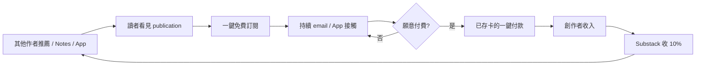
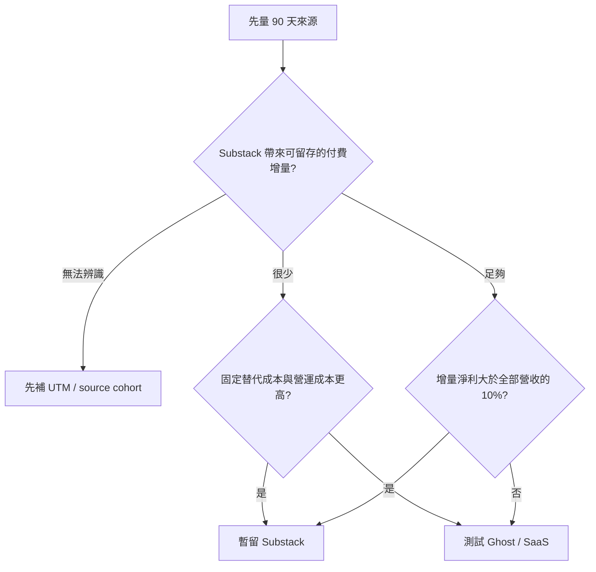

# Research: Substack 的發現性值得 10% 分潤嗎？

研究日期：2026-09-17

預定系列：`誰掌握創作者與讀者的關係` order 2

## 範圍與偏誤

本 dossier 不再做六平台總覽，只回答一個決策：創作者把付費訂閱收入的 10% 交給 Substack，實際買到哪些分發、支付與營運能力，以及什麼時候不划算。

對照組只用 Ghost／自有名單，目的不是完整選型，而是分離「百分比抽成」與「平台網路效果」。資料偏向英語市場與成功出版者；Substack 沒公開按語言、規模、類型拆分的推薦增量，因此不能把全平台平均套在台灣繁中創作者身上。

## 子問題

1. 10% 是什麼費用，還有哪些 Stripe／Apple 成本？
2. Recommendations、App、Notes、cross-posts 與已儲存付款方式帶來多少發現性？
3. 平台自報的 network share 能否證明「10% 回本」？
4. email 名單、內容、互動與 recurring payment 關係各能帶走多少？
5. 對台灣繁中創作者，全球網路效果是否同樣成立？
6. AI 生成內容與 AI 搜尋會提高還是削弱 Substack 的價值？

## 核心結論

1. **10% 不是單純主機費，是對所有付費訂閱營收的變動成本。** Substack 官方現行 Stripe 設定指南明載 10%；Axios 2025 也獨立報導同一費率。Stripe 信用卡與 billing fee 另計；iOS in-app payment 還會有 Apple fee，不能用「創作者實拿 90%」簡化。
2. **Substack 確實有平台發現性，但效果數字是公司自報。** 2022 官方稱 network 帶來約 10% paid subscriptions；2024 公司稱 Recommendations 帶來 25% new paid subscriptions；2025 創辦人向 Hollywood Reporter 稱整個 network 帶來 30% paid subscriptions。口徑、功能範圍與時點都不同，不能畫成同一條精確成長曲線。
3. **10% 是否回本，不能只比較「平台帶來的付費訂戶占比」與 10%。** 平台帶來的是增量收入，抽成則收在全部收入；還要計算留存、退款、Stripe、稅務、營運節省與創作者原本就會帶進來的讀者。
4. **email 與內容相對可攜，付款關係是條件式可攜。** Substack 可匯出完整或篩選後 subscriber CSV；Ghost 官方遷移指南也能匯入內容、免費與付費訂戶。若沿用同一 Stripe account，付費會員可較平順遷移；但 Ghost 明載舊訂閱可能仍繼續被 Substack 收 10%，要另外協調移除費用。若直接在 Substack 斷開 Stripe，官方說會取消並按比例退款所有付費訂閱。
5. **對繁中／台灣創作者，最大未知不是功能而是網路密度。** Substack 的推薦飛輪依賴讀者已在平台、其他作者願意推薦、讀者已存卡且相近語言內容夠密集。本輪沒有按繁中市場拆分的數據，不能宣稱 25%／30% 同樣適用。
6. **AI 同時強化 network 與提高信任成本。** AI 降低內容供給成本，Substack 沒有像 Medium 一樣全面禁止 AI 生成內容；WIRED 的分析顯示部分大型出版物使用 AI，但偵測器不完美。平台推薦越強，平台就越需要處理低成本內容、品牌安全與作者信任。

## 10% 買到什麼

### 基礎設施

- 發文、email delivery、免費／付費訂閱管理。
- Stripe Connect／Billing／Payments，包含 KYC、付款、payout、詐欺偵測與多種付款方式。
- 已在 Substack 儲存卡片的讀者，可一鍵再訂別的 publication；Stripe 案例頁稱有存卡者付費機率為 3 倍。這是 Stripe 與 Substack 的客戶案例，屬公司合作方自報，不是隨機實驗。
- 讀者與創作者 dashboard、分眾、活動與收入資料、CSV 匯出。

### 分發網路

- Recommendations：作者在訂閱流程、首頁與自動 email 推薦其他作者。
- App／web reader：search、leaderboards、reader profiles 與一鍵訂閱。
- Notes、guest posts、mentions、cross-posts、post／publication embeds。
- Referrals 與 Boost offer tools。

Substack 的差異不只是「有演算法」。它把作者間互薦、平台 feed、讀者社交圖與已存付款方式接成一條轉換鏈。



這是平台希望成立的飛輪，不是每個 publication 已被證明的因果效果。

## 公司自報的發現性數字：不能混成一條線

| 時點 | 公司說法 | 口徑 | 外部報導 | 可怎麼用 |
|---|---|---|---|---|
| 2022 | network 帶來 30%+ 新免費訂閱、約 10% paid subscriptions | 整體 network；早期產品 | 官方原文全文 | 歷史基準，只能標公司自報 |
| 2024 | Recommendations 帶來 50% 新訂閱、25% new paid subscriptions | Recommendations；可能是新訂閱 | TechCrunch 轉述公司公告 | 可支持推薦功能已成重要來源，不是獨立稽核 |
| 2025 | 超過 50% subscriptions、30% paid subscriptions 來自 network | network；訪談未完整交代 cohort | Hollywood Reporter 引述共同創辦人 | 最新公開公司說法；不可套到單一作者 |
| 目前 growth page | network drives 25% of paid subscriptions；App 產生 25%+ subscriptions | 網頁未標統計期間；paid 與 all subscriptions 混合 | 無獨立 audit | 與 2025 訪談口徑不同，應列為衝突／版本差異 |

嚴格結論：Substack 的 network share 公開說法從 10%、25% 到 30% 不等，可能反映成長，也可能是功能與分母不同。文章若使用數字，最多寫「Substack 自報其網路帶來約四分之一至三成的付費訂閱；公開資料不足以重建統計口徑或驗證個別作者增量。」

## 10% 損益兩平：正確算法

設：

- `R0`：不用 Substack 時原本能取得的年訂閱營收。
- `ΔR`：Substack network、支付轉換與營運便利帶來的增量年營收。
- `C_alt`：替代平台的年固定／變動成本。
- `C_ops`：自行處理 email、支付、客服、法務、開發等增加的年成本。
- Substack 平台費：`0.10 × (R0 + ΔR)`，Stripe／Apple／稅務另算。

```text
留在 Substack 的淨增益
= ΔR - 0.10 × (R0 + ΔR) + C_alt + C_ops
```

回本條件：

```text
0.90 × ΔR > 0.10 × R0 - C_alt - C_ops
```

### ELI5

像一座市集向你收所有營業額的 10%，不是只抽它帶來的新客。市集說每四個付費客人裡有一個在場內找到你，還不能直接說划算：你要問其中多少人本來就認識你、會留多久，以及離開市集後自己租店與收款要花多少。

### 情境表（純模型，不是市場預測）

| 原有年營收 `R0` | 平台增量 `ΔR` | 10% 平台費 | 暫不計替代與營運成本的淨增益 |
|---:|---:|---:|---:|
| $0 | $10,000 | $1,000 | +$9,000 |
| $50,000 | $10,000 | $6,000 | +$4,000 |
| $100,000 | $10,000 | $11,000 | -$1,000 |
| $500,000 | $25,000 | $52,500 | -$27,500 |

這張表只說明「相同增量對成熟作者價值較低」。不可把 `$10,000` 或 `$25,000` 當作 Substack 真實可帶來的收入。

## 可攜性：不是「email 可以匯出」就結束

| 資產 | 可攜性 | 已驗證細節 |
|---|---|---|
| 內容 | 高至中 | Substack 可產生 export；Ghost 可匯入內容 zip，但版型、URL、comments／Notes 等不保證完整 |
| Email 名單 | 高 | subscriber dashboard 可匯出完整或篩選 CSV，並選擇全部欄位或顯示欄位 |
| 訂戶狀態與活動 | 中 | CSV 可含訂閱類型、收入、來源、活動等欄位；站內 social graph 與 Notes feed 不等於都可重建 |
| 付費訂閱 | 條件式 | Ghost 要求使用同一 Stripe account 以移轉 paid memberships；舊訂閱的 10% 可能仍需協調移除 |
| 平台推薦關係 | 低 | Recommendations、App followers、Notes distribution 離開 Substack即失去 |
| 付款便利 | 低至中 | 已存卡與跨 publication 一鍵付款屬 Substack network；不能跟著 email CSV 搬走 |

重要更正：既有總覽寫「搬家意味著要求每個付費讀者重新刷卡」過度絕對。Ghost 官方 2026 遷移指南顯示，若可沿用同一 Stripe account，可以匯入 paid subscribers；Platformer 搬家公告也說既有訂戶不需做事。較準確的說法是：**付費搬遷依賴 Stripe 帳戶與平台協調，不像 email CSV 那麼簡單；某些路徑能避免重刷卡，但費率、billing ownership 與支援仍需處理。**

## Platformer：發現性有價，但成熟後未必值得 10%

Casey Newton 2024 宣布 Platformer 從 Substack 搬到 Ghost。他說 2023 年增加超過 70,000 免費訂戶，並明確把一部分成長歸因於 Substack 的推薦與網路工具；這是少見的創作者一手承認平台分發有效。

同一公告也說既有訂戶會直接移轉，不需操作。The Verge 訪談則指出轉到 Ghost 省下可觀成本，並討論推薦系統的實際價值。由於本輪 The Verge 全文輸出截斷且 deterministic extract 沒抓到完整數字段落，dossier 不記具體節省金額。

這個案例不證明所有成熟作者都該搬：Platformer 起步時已有來自 The Verge 的名單、品牌與專業聲譽，且 2024 搬家決策也受到內容治理／品牌價值衝突影響。

## 台灣／繁中差異

### 可以確定的

- Substack 以 Stripe 為唯一 web paid subscription provider；能否收款取決於創作者所在國家可用的 Stripe 能力。
- Substack 的 network 效果需要平台內相近讀者、出版物與推薦邊存在。
- 平台能處理多種幣別與付款方式，但本輪沒有證據顯示它替台灣創作者處理本地發票與台灣稿費所得流程，不能類比 Vocus。

### 不能確定的

- 繁體中文內容從 Recommendations／App／Notes 得到的訂閱占比。
- 台灣信用卡、Apple in-app payment 與跨境 Stripe 的實際成功率、稅務與退款成本。
- 繁中作者互薦網路是否已密到足以支付 10%。

因此台灣作者的 go/no-go 不能用平台平均，而要看自己的 subscriber source dashboard：至少追 90 天，分開 direct、Google、Instagram、Substack app、Recommendations 等來源，并比较各來源的 free-to-paid conversion 與留存。

## AI 影響

### 1. 生成成本下降，推薦網路的品質成本上升

WIRED 報導 GPTZero 對 100 個熱門 Substack newsletters 抽樣 25–30 篇文章，估計 10 個以某種方式使用 AI、7 個顯著依賴 AI；4 個被標記的 publication 向 WIRED 確認使用 AI。偵測工具可能誤判，樣本只涵蓋熱門 publications，不能推算整站比例。

Substack 向 WIRED 表示會處理 copypasta、重複內容、SEO spam、phishing 與 bot activity，但不會只因內容由 AI 產生就主動移除；當時沒有專門 AI 政策。2026 Content Guidelines 仍重點處理 plagiarism、spam、phishing、非法內容與人工／非真實活動，沒有像 Medium 一樣禁止 AI 生成內容變現。

[推論] Substack 若用推薦網路替內容背書，AI 內容的品質與揭露爭議會變成網路外部性：一個低品質 publication 不只傷自己，也可能經作者互薦與 feed 影響其他人的讀者信任。

### 2. AI 搜尋降低開放網頁點擊，直接 email 更有價值

Pew 的 2025 美國 Google 樣本顯示，有 AI summary 時傳統結果點擊為 8%，無 summary 時為 15%；summary 來源本身只獲得 1% 點擊。不能把這直接換算為 Substack 流量跌幅，但可支持方向：擁有可直接寄送的 email audience，比只靠 Google 點擊更抗入口變化。

### 3. AI 也可能讓平台品牌與「真人信任」更值錢

訂閱收入靠持續信任，不只靠單次點擊。AI 大量生成的環境可能讓作者聲譽、社群互薦與 reader payment history 更有價值；但這是研究假說，沒有因果證據證明 AI 會提高 Substack paid conversion。

## 事實交叉表

| 事實 | 來源 1 | 來源 2 | 狀態 |
|---|---|---|---|
| Substack 收付費訂閱收入 10% | Substack Stripe 設定官方指南 | Axios 2025 | ✅ 現行費率雙來源 |
| 平台已超過 500 萬 paid subscriptions | Stripe customer story | Axios／Hollywood Reporter 2025 | ✅，但皆依公司資料；不是獨立 audit |
| Recommendations／network 帶來約 25–30% paid subscriptions | Substack growth page／官方 blog | TechCrunch 2024／Hollywood Reporter 2025 | ⚠️ 公司自報被媒體轉述，且口徑與時點不同 |
| 有存卡的讀者更可能再付費 | Stripe customer story 稱 3x | Substack growth page 同稱 3x | ⚠️ 同一商業體系自報，方法未公開 |
| subscriber list 可匯出 CSV | Substack subscriber dashboard | Ghost migration guide | ✅ |
| paid subscribers 搬家一律要重刷卡 | Ghost 指南說可沿用同一 Stripe | Platformer 搬家公告說訂戶不需操作 | ❌ 既有總覽的絕對說法應避免 |
| 離開後舊 paid subscriptions 可能仍被收 10% | Ghost migration guide | 無第二獨立全文 | ⚠️ 對遷移流程有用，但發文應標 Ghost 官方說法並避免泛化 |
| AI summary 與較低搜尋點擊相關 | Pew 原始分析 | 多家報導轉述 | ✅ 對特定美國 Google 樣本 |

## 推論（與事實分開）

| 推論 | 依據 | 可能錯在哪 |
|---|---|---|
| 起步作者較可能讓 10% 回本 | `R0` 小、平台增量相對大 | 從零開始的作者也可能完全拿不到推薦 |
| 成熟作者應每季重算 network increment | 抽成套在全部營收，成熟後成本線性增加 | 平台法律、支付、客服與品牌支援仍可能值更多 |
| 繁中創作者不應採用全平台 25–30% | network density 受語言與推薦圖影響 | Substack 可能已有未公開的繁中使用密度 |
| email 可攜但 social graph 不可攜，是 Substack 真正 lock-in | CSV export vs Recommendations/Notes/App | social graph 也可由品牌在站外重建，只是成本高 |

## ELI5 比喻

Substack 像會替攤商拉客的市集。它不收固定租金，而是每碗麵都抽 10%，包括老闆自己從家鄉帶來的熟客。市集的推薦牆、會員卡與存好的信用卡確實能讓陌生人更容易下單；但要判斷划算，得數「市集新增的回頭客」，不能只看今天攤位前有多少人。

## 可用圖表

### 圖 1：發現到付款飛輪

使用前述 Mermaid，並把「公司希望成立的飛輪」明標為模型。

### 圖 2：10% 回本決策樹



### 表格構想

以不同 `R0`／`ΔR` 情境畫出平台費與淨增益，旁邊固定註明「不含 Stripe、Apple、稅、退款與人工成本；僅為模型」。

## 文章骨架

1. ELI5 市集：10% 抽全部，不只抽平台帶來的新客。
2. 拆出 10% 買到的五層：寄信、收款、推薦、存卡、營運支援。
3. 公司自報 10%／25%／30% 的口徑差異，拒絕把它畫成精確成長曲線。
4. 用 `R0` 與 `ΔR` 解釋回本，而不是拿 25% 直接減 10%。
5. 拆 email、內容、付款、social graph 四種可攜性，修正「一定要重刷卡」。
6. Platformer：平台成長有效，但成熟品牌可能選擇把成本與治理拿回來。
7. 台灣／繁中：沒有 cohort 數據就不套全球平均，先做 90 天來源與留存實驗。
8. AI：直接關係升值，同時推薦網路的信任成本也上升。

## 來源清單與讀取完整度

| 來源 | 角色／支持 claim | 完整度 | 訪問日 |
|---|---|---|---|
| [Substack Stripe setup](https://support.substack.com/hc/en-us/articles/4405482746132-How-do-I-set-up-my-Stripe-account-on-Substack-to-start-receiving-payments) | 官方；10%、Stripe、Apple、payout | ✅ 全文 12,194 chars | 2026-09-17 |
| [Substack subscriber dashboard](https://support.substack.com/hc/en-us/articles/360058529871-How-do-I-use-the-subscriber-dashboard-on-Substack) | 官方；欄位、segments、CSV export | ✅ 全文 10,180 chars | 2026-09-17 |
| [Substack migration into platform](https://support.substack.com/hc/en-us/articles/34558456517396-How-do-I-move-from-my-current-platform-to-Substack) | 官方；跨平台內容／會員／付款遷移結構 | ✅ 全文 9,481 chars | 2026-09-17 |
| [Turn off paid subscriptions](https://support.substack.com/hc/en-us/articles/360060408872-How-do-I-turn-off-paid-subscriptions-on-Substack) | 官方；disconnect Stripe 會退款、取消訂閱 | ✅ 全文 886 chars | 2026-09-17 |
| [Substack: 1 in 3 new subscriptions](https://on.substack.com/p/substack-generates-1-in-3-new-subscriptions) | 官方歷史自報；2022 network share、10% paid | ✅ 全文 5,617 chars | 2026-09-17 |
| [Substack growth features](https://substack.com/growthfeatures) | 官方行銷頁；現行 network／App 自報 | ✅ 全文 5,067 chars；未標統計期 | 2026-09-17 |
| [Stripe customer story](https://stripe.com/customers/substack) | 支付合作方；500 萬 paid、5 萬 paid publications、存卡 3x | ✅ 全文 5,741 chars；商業案例非 audit | 2026-09-17 |
| [Axios: Substack raises $100M](https://www.axios.com/2025/07/17/substack-newsletter-funding-creator-economy) | 獨立媒體；10%、融資、500 萬 paid | ✅ 全文 3,040 chars | 2026-09-17 |
| [TechCrunch: recommendation network](https://techcrunch.com/2024/02/22/substack-now-lets-writers-curate-a-network-of-recommended-publications-for-their-subscribers/) | 獨立媒體轉述；2024 25% new paid、產品機制 | ✅ 全文 3,782 chars；數字源自公司 | 2026-09-17 |
| [Hollywood Reporter: 5M paid](https://www.hollywoodreporter.com/business/business-news/substack-number-subscribers-video-trump-1236158048/) | 獨立媒體訪談；2025 network 30% paid | ✅ 全文 4,336 chars；數字源自共同創辦人 | 2026-09-17 |
| [Ghost: Migrating from Substack](https://docs.ghost.org/migration/substack) | 競爭者官方文件；內容／免費／付費會員遷移、同 Stripe、舊費率 | ✅ 全文 6,247 chars | 2026-09-17 |
| [Platformer: Why we are leaving](https://www.platformer.news/why-platformer-is-leaving-substack/) | 創作者一手；70k free growth、推薦有效、無動作遷移 | 🟡 Groundlane 回傳 18,000 chars 且 `truncated:true`；關鍵段已讀 | 2026-09-17 |
| [The Verge interview with Casey Newton](https://www.theverge.com/2024/2/5/24059524/platformer-casey-newton-substack-moderation-email-newsletters-media-layoffs) | 獨立訪談；遷移經濟與治理 | 🟡 全文過長、18,000 chars 截斷；另用 `web_extract` 讀到遷移節錄，未採具體數字 | 2026-09-17 |
| [WIRED: Substack writers use AI](https://www.wired.com/story/substacks-writers-use-ai-chatgpt/) | 獨立報導＋GPTZero 抽樣；AI 使用與官方回應 | ✅ 全文 8,784 chars；偵測限制保留 | 2026-09-17 |
| [Substack Content Guidelines](https://substack.com/content) | 官方；2026 內容、spam、plagiarism、AI 政策邊界 | ✅ 全文 9,396 chars | 2026-09-17 |
| [Pew: AI summaries and clicks](https://www.pewresearch.org/short-reads/2025/07/22/google-users-are-less-likely-to-click-on-links-when-an-ai-summary-appears-in-the-results/) | 獨立原始分析；AI search 點擊 | ✅ 全文 8,734 chars | 2026-09-17 |

## 受阻與未採用

- SEC 2023 crowdfunding PDF：Groundlane 成功連線但 SEC 回 403 automated-tool page，未讀到文件正文；不採用其中數字。
- The Verge 長訪談：Groundlane fetch 截斷，`web_extract` 只取得遷移概要，故不寫節省金額或推薦帶來的精確收入。
- 多個 2026「Substack pricing」SEO 站：只作候選掃描，不採用；費率回到 Substack 官方與 Axios。

## 發文紅線

- 所有 25%／30% network share 必須寫「Substack 自報」，不可稱獨立驗證。
- 不把 2022、2024、2025 不同口徑數字畫成精確成長率。
- 不寫「平台帶來 25% paid，所以 10% 一定值得」；抽成分母是全部營收。
- 不再寫「搬家一定要求所有付費讀者重刷卡」；同一 Stripe account 可能支援平順遷移。
- 不把 500 萬 paid subscriptions 寫成 500 萬獨立付費讀者。
- 不把全球／英語 network 平均套到繁中或台灣作者。
- 不把 WIRED／GPTZero 的抽樣估計外推為整個 Substack 的 AI 內容比例。
