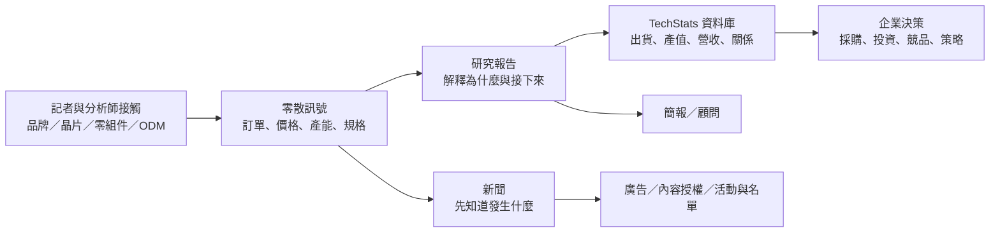
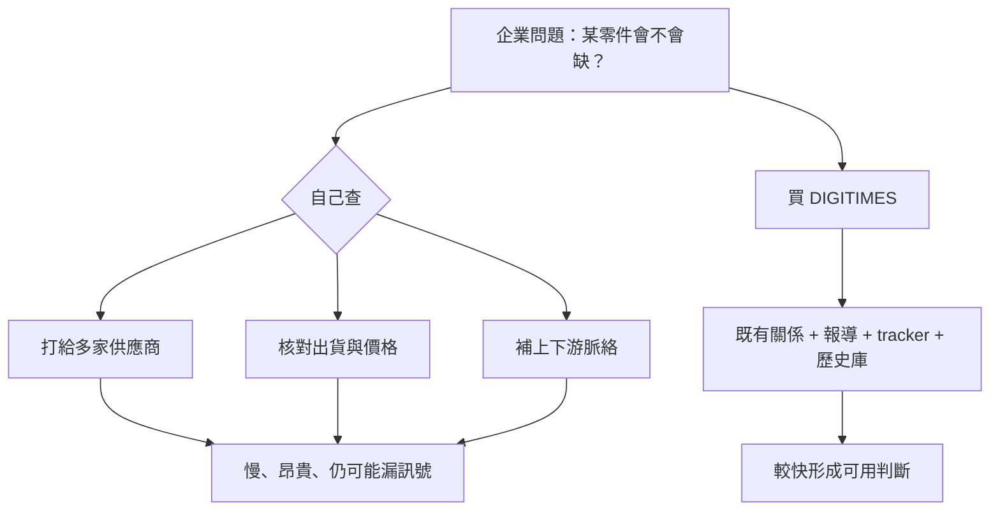
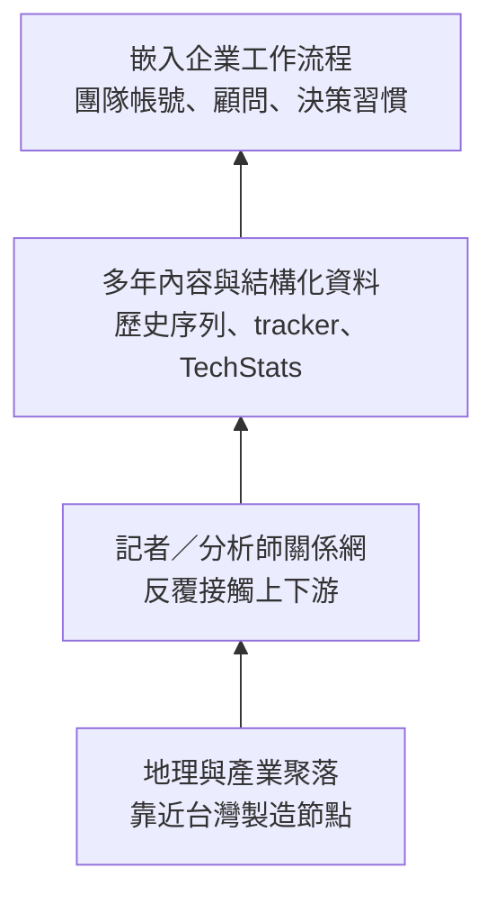

# Research: DIGITIMES——供應鏈關係如何變成企業情報生意

- 查詢日：2026-09-16（Asia/Taipei）
- 研究用途：「B2B 產業情報公司」子系列的 DIGITIMES 個案；不是文章草稿
- 母群位置：B2B 產業情報市場中，介於「專業新聞／獨家消息」與「產業資料庫／分析師顧問」之間的垂直整合業者。不是純流量媒體，也不是只賣標準化資料的資料商。
- 工具揭露：先檢查完整 callable inventory，未發現 Groundlane `web_search`／`web_fetch`／`web_extract`。依本次任務與專案 AGENTS.md 的 fallback 規則，改用已掛載的 Exa MCP 做公開網頁搜尋與全文讀取。本文不能作為「Groundlane 路徑已驗證」的證據。

## 一句話結論

DIGITIMES 的核心不是把「文章」賣貴，而是把台灣電子製造聚落裡零散、難取得、會隨時間累積的訊號，依序加工成新聞、研究報告、資料庫、簡報／顧問與精準行銷服務；客戶付費買的是少走幾輪供應鏈查證、提早看見變化，以及能直接放進決策流程的結構化脈絡。

## 子問題

1. DIGITIMES 在 B2B 情報母群中的位置是什麼，真正賣給誰？
2. 收入線與可見定價有哪些？哪些財務資訊不能證實？
3. 台灣供應鏈的關係與地理優勢如何被加工成可販售情報？
4. 護城河究竟是獨家消息、人際網絡、歷史資料，還是工作流程？
5. AI 搜尋／摘要對它是威脅還是產品化工具？
6. 這套模式有哪些失敗史、偏誤、可信度限制與利益衝突風險？

## 先用 ELI5 說清楚

把全球電子業想成一間超大的餐廳：美國品牌決定菜單，但很多食材、刀具、爐子與代工廚房在台灣。一般科技新聞告訴你「新菜上市了」；DIGITIMES 想賣的是「哪間廚房接單、哪種食材變貴、產能卡在哪、下一季能端出幾盤」。

它的加工鏈可以寫成：

> 圖中「接觸→訊號」是依官方自述與創辦人訪談歸納；官方未公開完整採訪／估算方法，不能寫成已經審計的方法論。

## 公司與母群位置

### 可確認的定位

- 官方將自身描述為亞洲／全球科技供應鏈的新聞與研究服務，橫跨半導體、伺服器、AIoT、筆電、智慧裝置及其他科技領域。
- 官方產品頁顯示至少五層產品：新聞會員、研究頻道訂閱、單篇特別報告、TechStats 資料庫、客製研究／分析師諮詢；另有內容授權、整合行銷與活動服務。
- 官方 About 頁自稱有 1,200+ 家企業信任、70% 客戶來自 ICT、70,000+ 社群成員，並累積 120,000+ 則（自 2000 年起）新聞。這些是公司自報指標，沒有外部審計資料。
- 官方企業方案明確針對團隊：新聞、研究報告、分析師顧問與群組存取，採詢價與規模化定價。

### 母群座標

| 維度 | DIGITIMES 的位置 | 寫作提醒 |
|---|---|---|
| 受眾 | 工程師、採購、產品、策略、投資／分析、企業主管 | 官方表單列職能；不要假裝知道各職能收入占比 |
| 地理 | 從台灣／亞洲製造端看全球 ICT | 這是差異化，不代表所有全球市場都覆蓋同樣深 |
| 交付物 | 新聞 → 報告 → tracker／資料庫 → 顧問 → 行銷 | 不是單一訂閱產品 |
| 價值時間尺度 | 即時訊號 + 季度追蹤 + 五年展望 + 歷史查詢 | 資料庫讓舊內容仍可販售 |
| 競爭範圍 | 可與垂直媒體、產業研究、資料庫、顧問公司部分重疊 | 不宜粗暴宣稱「台灣 Gartner」；交付物與品牌權威不同 |

## 商業模式與收入線

### 已有直接證據的收入線

1. **新聞會員**：Basic 開放內容與 Premium 完整新聞／分析；訪客每 30 天可讀最多 5 篇開放文章。官方條款列季繳自動續訂、年繳自動續訂與一次性年費等類型，但公開抓取頁未顯示目前新聞方案金額。
2. **研究頻道年訂閱**：2026-09-16 官方單人價頁顯示 Server & HPC、Personal Computing、Semiconductor、Physical AI 各為一年 US$5,700。
3. **TechStats 加購資料庫**：同頁顯示多個資料庫各 US$3,000，例如 Servers、Notebooks、IC Manufacturing、Fabless。
4. **單篇研究報告**：同頁可見 2026 年報告每篇 US$900 或 US$1,200 的例子。
5. **企業方案／團隊授權**：5 人以上年訂閱可談團體折扣；企業頁採詢價，提供集中管理與使用分析。
6. **客製研究、到府簡報、分析師顧問**：中英文官方研究頁均列出。
7. **廣告與整合行銷**：官方 About 頁列多頻道 B2B 行銷、webinar／活動導流與 sales leads；服務條款確認網站接受廣告。
8. **內容授權**：官方 About 頁直接列 Content Licensing Services。
9. **論壇／活動**：中文研究頁列每年四場科技趨勢論壇與一場年度論壇；歷史 About 存檔稱累積 3,500+ 場活動，但現行頁未覆核此數字。

### 定價不能混寫

| 價格 | 證據 | 能怎麼寫 |
|---|---|---|
| US$5,700／年／單一研究頻道／單人 | 官方購買頁，2026-09-16 全文 | 可寫「目前公開研究頻道價」 |
| US$3,000／年／單一 TechStats 加購資料庫 | 官方購買頁 | 可寫「部分資料庫加購價」 |
| US$900–1,200／單篇（頁面所列 2026 範例） | 官方購買頁 | 只能說頁面可見範例，不推成所有報告價格 |
| US$550／年新聞訂閱 | 黃欽勇在台灣事實查核中心 Podcast 的自述；Newswav／Storm Media 轉寫 | 只能標「創辦人 2026 年受訪自述」，因現行官方公開頁抓不到這個售價 |
| 企業價 | 官方企業頁稱 scalable pricing／詢價 | 不可自行估價 |

### 收入／獲利不可驗證項

- 未找到經審計的營收、各收入線占比、毛利、訂戶數或續訂率；公司為非公開發行公司時，不能從「高價」推導「高收入」。
- 黃欽勇在 2026 年兩場媒體訪談自述：創業前兩年約虧 NT$2 億、第三年開始獲利、約第 13 年才填平累積虧損並首次分紅。兩家媒體都依賴同一位當事人的回憶，不算獨立財務驗證。
- 「Sony 250 位主管訂閱」、「台積電／鴻海／廣達／台達電付會員費」是創辦人訪談中的客戶案例；未見客戶方確認，文章若使用必須明標「黃欽勇稱」。

## 供應鏈關係如何轉成情報

### 有來源支持的加工步驟

1. **站在供給端，而不是只看終端品牌**：官方研究分類從 IC 設計、晶圓製造、封裝，到 ODM、伺服器、筆電與智慧裝置；創辦人訪談反覆主張西方報告偏需求／品牌端，而台灣優勢在製造端。
2. **把關係轉成採訪入口**：創辦背景與近 50 位產業股東，及長期連結 1,200+ 企業，讓它更接近供應鏈節點。這能支持「接觸入口較多」的推論，但不能證明每篇消息都正確。
3. **把事件轉成反覆更新的欄位**：官方產品頁具體列出季度品牌與 ODM 出貨、技術別出貨、客戶市占與製造商訂單等 tracker。
4. **把一次採訪變成多種 SKU**：同一組訊號可成新聞、季度報告、五年展望、資料庫欄位、顧問簡報；因此採訪成本可被多次回收。
5. **把多年內容變成可查詢資產**：官方稱 TechStats 持續累積各研究服務資料；創辦人把網路定位成「資料庫」，而非只看即時流量。

### ELI5：為什麼客戶願意付錢

客戶買的不是「保證預測正確」，而是把搜集、整理與初步交叉比對外包。這是商模推論，不是官方 SLA；官方條款也明確不保證內容無誤或使用後達成特定結果。

## 客戶與購買任務

| 客群／職能 | 可能購買任務 | 證據強度 |
|---|---|---|
| ICT 製造商、品牌商 | 市場／出貨趨勢、競品、供應鏈布局 | 強：官方產品與客群比例自報 |
| 採購／產品／工程 | 零件、產能、規格與 ODM 變化 | 中：官方企業表單列職能；實際使用方式為推論 |
| 投資與研究人員 | 產業景氣、公司與供應鏈交叉判讀 | 中：官方表單列 investment professional／analyst |
| 企業策略與主管 | 五年展望、客製研究、分析師簡報 | 強：官方列五年展望、顧問與到府簡報 |
| 科技業廣告主 | 精準觸及企業受眾、活動報名、sales leads | 強：官方整合行銷頁自述 |
| 海外企業 | 補足亞洲製造端知識落差 | 中：創辦人訪談 + 英文版產品存在；未見海外收入占比 |

## 護城河：應拆成四層，不只說「人脈」

- **聚落密度**：台灣集中了半導體、ODM、零組件與伺服器製造環節，讓跨節點採訪與比對更便宜。這是 DIGITIMES 的環境優勢，不是它獨占的資產。
- **關係網與專業語言**：長期記者／分析師知道該問誰、訊號在上游還是下游、某次試產是否等於量產。這比單純公開資料抓取更難複製。
- **歷史資料的複利**：120,000+ 新聞（官方自報）、持續更新的 tracker 與資料庫，可讓今天的訊號與過往基準比較。
- **工作流程黏性**：團隊帳號、研究頻道、顧問與資料庫使產品從「讀一篇」變成「每季都要查」。但沒有續訂率或使用頻率，黏性只可作合理推論。
- **品牌與可信度是雙面刃**：細分領域的長期存在能降低購買風險；但若匿名供應鏈傳聞頻繁失準，品牌也會受損。

## AI：威脅、工具與反直覺機會

### 威脅

1. **零點擊與摘要替代**：如果內容只是已公開消息的改寫，AI 摘要會拿走點擊；此風險適用公開新聞與廣告收入線。
2. **內容被模型商品化**：官方條款禁止自動化抓取、資料探勘與未授權建立資料庫，表示資料被大量抽取是明確的權利／產品風險；但未找到 DIGITIMES 公開 AI 授權交易。
3. **分析成本下降**：企業可用 LLM 整理公開財報、法說與新聞，壓縮一般摘要型研究的溢價。
4. **錯誤放大**：若匿名供應鏈訊號本身不可靠，AI 會把一則傳聞轉述得更像確定事實。

### 工具與機會

- 台灣事實查核中心的創辦人專訪摘要稱，DIGITIMES 將「百萬筆數據結合 AI」做高價情報服務；黃欽勇也把媒體定位成可由 AI 查詢的知識庫。這是第一手受訪者自述，未取得產品技術文件、模型評測或客戶實測。
- AI 能降低檢索歷史資料的摩擦，反而提高資料庫價值：答案介面變便宜後，稀缺點轉向「是否擁有別人沒有、且可追溯的原始資料」。
- 付費牆、研究訂閱與顧問關係，使 DIGITIMES 比完全依賴搜尋廣告的媒體更能承受零點擊；但公開新聞的獲客功能仍可能受損。

### 最穩妥的判斷

> AI 不會自動保護 DIGITIMES。它只會把競爭焦點從「誰能寫摘要」推到「誰能取得、驗證、結構化並合法授權稀缺資料」。DIGITIMES 有材料優勢，但能否守住價格取決於資料品質、可追溯性與企業工作流程整合，這三項都缺公開成效數據。

## 台灣脈絡

- DIGITIMES 不是先選「半導體」這個熱門題材，再找受眾；它在 1998 年由熟悉資策會市場情報工作的黃欽勇創辦，並由多位台灣科技業人士出資，與台灣製造／代工產業共同成長。
- 商周訪談把創辦動機描述為：當時主流 IDC、Gartner、Dataquest 報告主要服務 IBM、TI、Dell、HP 等品牌／需求端，台灣企業需要從代工、製造與供應鏈管理出發的視角。這是受訪敘事，卻能解釋產品差異化。
- 台灣的優勢同時是集中風險：若製造重心、客戶決策或資料取得移向其他地區，單一聚落關係網的價值會下降；官方雖稱覆蓋全球，公開產品頁仍明顯以台灣 ODM／亞洲供應鏈為強項。
- 產業人士出資帶來入口，也帶來利益衝突疑問。商周引述黃欽勇稱公司規範股東不得干預編務；未找到可公開檢視的治理章程、股權現況或外部監督報告，因此不可把「編輯獨立」寫成已獨立驗證。

## 失敗、限制與反證

### 早期經濟失敗（但僅有當事人自述）

- 黃欽勇在放言／商周訪談稱，公司資本額約 NT$3 億，前兩年虧約 NT$2 億；第三年獲利約 NT$200 萬，其後逐年改善，約第 13 年才填平累損並首次分紅。
- 這個案例適合說明 B2B 情報前期要先養資料、人才與客戶習慣，回收期很長；不能當作經審計財務史。

### 供應鏈消息不等於成品預測

- TIME 在 2012 年逐項回查 25 則 DIGITIMES Apple 傳聞，結論是多項重大產品預測沒有實現，批評其來源篩選與從傳聞滑向事實語氣。
- DIGITIMES 副主編 Joseph Chen 當時回應（由 Cult of Mac 轉引）：供應鏈看到的許多原型／方案最後不會上市，這使消息事後看似錯誤；並承諾加強驗證與分析。
- 兩者可以同時成立：**供應鏈訊號可能真實存在，但由單一零件／試產訊號推到最終產品，推論仍可能錯。** 文章應把「採到訊號」與「正確預測結果」拆開。

### 其他限制

- 多數關鍵規模、客戶與獲利說法都來自官方或創辦人，缺乏獨立審計。
- 官方稱「rigorous methodologies」，但公開頁沒有抽樣框、訪談數、估算公式、修訂政策或預測命中率。
- 官方服務條款不保證內容無錯、不中斷或能達成使用者特定結果；高價不等於保證正確。
- 不同語言站、新聞與研究產品的會員制度及價格不同，不能把中文會員數、英文新聞年費、研究頻道價格混成一個 ARPU。
- 2012 年 Apple 傳聞批評很舊，能證明歷史風險，不能單獨代表 2026 年所有研究產品的品質。

## 事實交叉表

| 事實／主張 | 來源 1 | 來源 2 | 狀態 |
|---|---|---|---|
| DIGITIMES 同時賣新聞、研究、資料庫、顧問與行銷／授權 | 官方 About／Research Services | 官方註冊／企業方案頁 | ✅ 多個一手頁互證 |
| 研究頻道公開單人年價 US$5,700；部分 TechStats 加購 US$3,000 | 官方 single-user 購買頁 | 官方服務頁確認產品結構但不列價 | ✅ 價格為單一權威一手窄事實，查詢日有效 |
| 2026 年新聞訂閱年費 US$550 | 台灣事實查核中心 Podcast 訪談摘要／創辦人口述 | Newswav／Storm Media 轉寫同一訪談 | ⚠️ 同源轉述；官方公開抓取頁未見價格 |
| 官方自稱 1,200+ 家企業、70% 客戶為 ICT、70,000+ 社群 | 官方 About | 官方 Research／enterprise 頁重複部分數字 | ⚠️ 公司自報，未獨立審計 |
| 每年產出 300+ 研究報告 | 官方中文研究頁（300+） | 黃欽勇 2026 訪談稱前一年 350+ | ✅ 量級互相一致，但後者仍為當事人自述 |
| 前兩年虧約 NT$2 億，第三年起獲利，13 年填平累損 | 放言轉述黃欽勇廣播訪談 | 商周郭奕伶專訪黃欽勇 | ⚠️ 兩媒體但同一當事人口述，非獨立財務驗證 |
| 產業股東不得干預編務 | 商周引述黃欽勇 | 未找到公開治理文件 | ⚠️ 單一當事人自述 |
| Apple 供應鏈傳聞曾大量失準 | TIME 回查 25 則 | Engadget 的另一次非科學回查，方向一致 | ✅ 歷史個案風險；不可外推全部產品 |
| 失準可能因供應鏈接觸到未上市原型 | DIGITIMES 副主編回應（Cult of Mac 轉引） | CNET／其他轉述提到原型在量產前反覆變更（搜尋摘要層級） | ⚠️ 合理解釋但無法逐則證明 |
| 「百萬筆資料 + AI」已形成高價情報服務 | 台灣事實查核中心訪談頁 | KKBOX 節目介紹（同一節目） | ⚠️ 同源宣稱；無技術文件、評測或客戶驗證 |

## 推論（不要混進事實）

| 推論 | 依據 | 可能錯在哪 |
|---|---|---|
| DIGITIMES 真正的產品是「降低決策搜尋成本」 | 多層產品把消息轉成 tracker、資料庫、顧問 | 客戶也可能主要為品牌／社交資本買單，未見使用研究 |
| 關係網是資料採集層，歷史庫才是可擴張資產 | 關係難規模化；資料可反覆查詢與包裝 | 若資料品質／欄位一致性不足，歷史量不等於資產 |
| 新聞可能同時是產品與研究／顧問的獲客入口 | 免費額度、Premium、研究與企業方案階梯 | 未見轉換率，不能證明漏斗實際有效 |
| AI 對一般新聞是替代品，對稀缺資料庫是新介面 | 零點擊邏輯 + 創辦人知識庫主張 | 若模型可從別處重建同類資料，稀缺性會快速下降 |
| 高前期虧損形成進入障礙 | 創辦人自述長回收期、人才／資料／關係需累積 | 也可能只是早期執行效率低，不能浪漫化虧損 |

## 可直接交給文章作者的骨架

### 開場：一則消息怎麼被賣四次

用同一個「AI 伺服器 ODM 出貨變化」示例：先成快訊，再成季度追蹤，再進五年展望與 TechStats，最後變成企業簡報。點出 DIGITIMES 賣的不是 800 字文章，而是情報加工線。

### 第一段：別把它當科技新聞網站

以產品階梯表拆新聞、研究頻道、單篇、資料庫、顧問、整合行銷；用 US$5,700／US$3,000／US$900–1,200 的官方現行例子建立 B2B 價格感，但不要混入未驗證收入。

### 第二段：台灣供應鏈是一張「活的資料庫」

用餐廳／廚房 ELI5 比喻與「設計→晶圓→封裝→零件→ODM→品牌」Mermaid，解釋為什麼靠近製造端能看到品牌端看不到的訊號。

### 第三段：人脈不會自動變成產品

拆加工流程：採訪入口 → 多點比對 → 標準欄位 → 時序資料 → 報告／顧問。明說官方未公開完整 methodology，因此這是商模拆解，不是品質背書。

### 第四段：護城河是四層堆疊

聚落、關係、歷史資料、工作流程；強調最上層黏性最強，但也是公開證據最少的一層。

### 第五段：傳聞錯了，情報還有價值嗎？

用 TIME 的 Apple 回查與 DIGITIMES 回應對照，說清楚「真實的試產訊號 ≠ 最終產品一定上市」。這是專業情報閱讀的必要素養，也能避免把文章寫成品牌業配。

### 第六段：AI 不是單向威脅

三分法：摘要型新聞被替代；未授權抓取侵蝕資料；AI 查詢讓自有歷史庫更好用。落到結論：稀缺原始資料、可追溯性、工作流程整合才是 AI 時代的定價權。

### 結尾：台灣能不能再長出一家 DIGITIMES？

條件不是「找一個熱門產業寫文章」，而是同時擁有：密集產業聚落、長期關係、可重複欄位、願意等多年回收的資本，以及敢公開修正錯誤的方法。可銜接後續 The Information、PitchBook、Gartner：它們分別把獨家、人／公司資料、決策權威做成不同產品。

## 建議圖表

1. **Mermaid：一則供應鏈訊號的多 SKU 加工線**（本 note 第一張，可直接改寫）
2. **表格：免費新聞／Premium／研究頻道／TechStats／顧問的客戶、任務、價格與黏性**
3. **Mermaid：電子供應鏈節點圖**：IC 設計 → 晶圓 → 封測 → 零組件 → ODM → 品牌；旁邊標 DIGITIMES 的採集點
4. **Mermaid：四層護城河**（聚落 → 關係 → 資料 → 工作流程）
5. **對照表：供應鏈訊號 vs 最終產品事實**，避免把 rumor 當 forecast
6. **2×2：公開／專有 × 即時／歷史**，把一般新聞、獨家、tracker、資料庫放入四象限

## 來源清單與可支持 claim

所有頁面訪問日均為 2026-09-16。

1. [About DIGITIMES](https://www.digitimes.com/about-us/) — 官方一手；✅ 全文。支持 1,200+ 企業、70% ICT 客戶、70,000+ 社群、120,000+ 新聞（皆為公司自報），以及內容授權、整合行銷收入線。
2. [DIGITIMES Research products and services](https://www.digitimes.com/reports/services/) — 官方一手；✅ 全文。支持研究頻道、季度品牌／ODM 出貨、技術／客戶／訂單拆分、TechStats、單篇特別報告。
3. [DIGITIMES Research](https://www.digitimes.com/reports/index.php?view=0) — 官方一手；✅ 全文。支持研究領域、全供應鏈定位、客製研究／顧問；「rigorous methodologies」僅為官方自述。
4. [DIGITIMES 中文研究中心](https://www.digitimes.com.tw/research/) — 官方一手；✅ 全文。支持七大領域／23 頻道、每年 300+ 報告、到府簡報與論壇規劃。
5. [Subscription packages](https://www.digitimes.com/register/) — 官方一手；✅ 全文。支持 Basic／Premium、研究頻道與單篇購買、訪客 5 篇／30 天、5 人以上團體年訂閱折扣。
6. [Individual pricing](https://www.digitimes.com/register/single.asp) — 官方一手；✅ 全文。支持查詢日可見的 US$5,700 年費研究頻道、US$3,000 TechStats 加購與 US$900–1,200 單篇範例。
7. [Enterprise membership](https://www.digitimes.com/register/corporate.php) — 官方一手；✅ 全文。支持企業方案的新聞、研究、分析師顧問、團隊存取、集中管理與詢價。
8. [Terms of Service](https://www.digitimes.com/register/terms.php) — 官方一手；✅ 全文。支持訂閱類型、不可自動抓取／建立資料庫、廣告、無退款與不保證內容／成果。
9. [台灣事實查核中心：EP258 黃欽勇專訪](https://tfc-taiwan.org.tw/digitimes-ai-tsmc-nvidia/) — 第一手受訪節目頁；🟡 節目摘要與時間碼，未取得逐字稿。支持「百萬筆資料 + AI」、Sony 250 位主管案例、知識服務定位；數字均屬受訪者自述。
10. [放言：辦 DIGITIMES 前兩年狂燒兩億資金](https://www.fountmedia.io/article/356539) — 二手媒體轉述廣播訪談；✅ 全文。支持創辦人自述早期虧損、第三年起獲利、200–300 人整理資料庫、中文 5 萬使用者、指定企業客戶與 350+ 報告；不可當審計證據。
11. [商業周刊：側寫黃欽勇](https://www.businessweekly.com.tw/business/blog/3020967) — 高品質二手／直接訪談；✅ 全文。支持創辦背景、前兩年虧損與 13 年填平說法、產業股東與不干預編務的自述、供給端定位。
12. [TIME：Fact-Checking Digitimes](https://techland.time.com/2012/05/14/digitimes-apple-rumors/) — 獨立二手回查；🟡 取得大篇幅重點摘錄，未由 fallback 工具回傳完整 25 案全文。支持 2012 年 Apple 傳聞命中率／來源篩選的歷史批評。
13. [Cult of Mac：DIGITIMES 回應 Apple 傳聞](https://www.cultofmac.com/news/digitimes-we-know-we-get-all-our-apple-rumors-wrong-and-well-try-to-be-better-from-now-on) — 二手轉引官方回應；🟡 搜尋摘錄。支持 Joseph Chen 對原型不上市與加強驗證的解釋；應視為公司辯護。
14. [Newswav／Storm Media：DIGITIMES Defies the Zero Click Era](https://newswav.com/article/digitimes-defies-the-zero-click-era-with-550-subscriptions-and-rising-traff-A2609_aD9GQA) — 二手轉寫同一台灣事實查核中心訪談；✅ 全文。支持 US$550、資料庫而非即時新聞、英中流量相近等受訪者說法；不是獨立驗證。
15. [EMIS company profile](https://www.emis.com/php/company-profile/TW/Digitimes_Inc__Digitimes_Inc__en_16843530.html) — 商業資料庫二手；🟡 公開摘要。只支持公司登記／產業分類等背景；財務與員工數付費，未使用。

## 讀取完整度盤點

| 來源 | 程度 | 阻礙／處置 |
|---|---|---|
| 官方 About／Research／Register／Enterprise／Terms 共 8 頁 | ✅ 全文 | Exa MCP 回傳正文；動態購買元件可能只反映查詢日狀態 |
| 台灣事實查核中心 EP258 | 🟡 節目摘要 + 時間碼 | 無逐字稿；當事人數字一律標自述 |
| 放言 | ✅ 全文 | 為廣播訪談轉述，不是獨立財務查核 |
| 商周 | ✅ 全文 | 直接人物訪談，仍高度依賴受訪者敘事 |
| Newswav／Storm Media 轉寫 | ✅ 全文 | 衍生自 EP258，不算第二獨立來源 |
| TIME | 🟡 大篇幅摘錄 | fallback 搜尋提供 25 案結論與多個例子，但沒有逐段全文；只用其明確結論 |
| Cult of Mac | 🟡 搜尋摘錄 | 使用其轉引的 DIGITIMES 回覆；未將評論段落當事實 |
| EMIS | 🟡 公開摘要 | 財務欄位需付費；未推導營收 |

## 不可驗證／發文前仍可補強

- 經審計營收、獲利、各產品收入占比、訂戶數、續訂率、ARPU。
- US$550 新聞年費是否仍是 2026-09-16 對所有新戶有效的公開牌價。
- 1,200+ 企業、70,000+ 社群、中文 5 萬使用者的定義、去重方式與查核。
- 指定客戶（Sony、台積電、鴻海、廣達、台達電）的採購範圍、金額與客戶方確認。
- 採訪與研究的完整 methodology、估算誤差、修訂紀錄、預測命中率。
- 「百萬筆資料 + AI」產品的模型、資料邊界、引用／溯源、評測與實際使用率。
- 當前股權結構、股東不干預編務的正式規章與外部監督。
- AI 搜尋導入前後的自然流量、直訪、付費轉換是否真的上升；目前只有創辦人自述。

## 寫作紅線

- 不寫「DIGITIMES 年營收多少」；沒有證據。
- 不把 US$550 新聞、US$5,700 研究頻道與 US$3,000 資料庫加購混成同一方案。
- 不把官方客戶／社群數寫成第三方認證。
- 不把供應鏈人脈直接等同準確率；必須保留 Apple 傳聞反例。
- 不把同一場訪談的多家轉載當成獨立交叉驗證。
- 不宣稱 AI 已讓流量或續訂上升，除非補到可核對數據。
