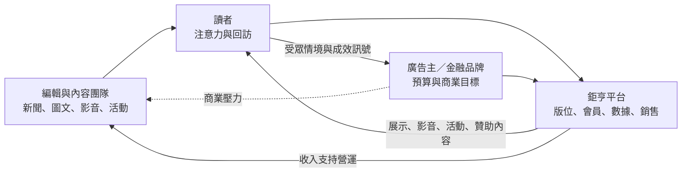

# Research dossier：鉅亨網的三方廣告市場

- 研究日期：2026-09-17
- 系列位置：「免費內容不是免費生意」order 1
- 核心問題：一個不向讀者收新聞訂閱費的財經入口，如何同時服務讀者、廣告主與內容生產者？
- 研究限制：鉅亨金融科技為未上市公司，本輪沒有找到可核對的現行營收、廣告占比、流量、毛利或廣告單價。官方廣告頁可證產品種類與目標客群，不能證明各產品收入權重。

## ELI5：免費雜誌為什麼能活

想像捷運站出口有人免費發財經雜誌。讀者沒有付錢，印刷與記者卻都要成本。真正付錢的是想在雜誌裡接觸投資人的銀行、券商、基金公司與品牌。

但這不是只有「賣版位」兩方交易。讀者提供注意力與部分行為訊號；廣告主提供預算；編輯與內容團隊持續生產可信、及時的內容，讓前兩者願意回來。鉅亨網居中安排版位、影音、活動、贊助專題與代編服務。

三邊少一邊都不成立：沒有內容，讀者不來；沒有讀者，廣告主不買；商業內容若傷害信任，讀者又會離開。

## 已驗證事實

### 1. 鉅亨官方販售的不是單一 banner，而是一組媒體與行銷服務

鉅亨網官方廣告產品頁列出：

- 數位、行動與社群廣告；
- 影音廣告；
- 客製財經講座／論壇、異業合作與網路活動；
- 可由廠商贊助合作的專題報導；
- 一頁式圖文與特刊代編。

這能支持「廣告市場已從版位延伸成內容、活動與整合行銷」。不能據此推算各項收入比例，也不能直接稱為 programmatic advertising；官方頁沒有揭露競價、DSP／SSP 或填充率。

### 2. 官方自己把受眾定位成高價值財經族群

同一頁把使用者描述為金融業菁英、專業經理人、高端投資人與財經社群領袖，並強調用數據改善廣告主與受眾的接觸。這是 sales material 的自我定位，不是經第三方人口調查驗證的 audience profile。

對廣告主而言，財經媒體的價值未必是最大總流量，而是「正在處理投資、保險、銀行、企業決策」的情境。這是垂直媒體能與大型通用平台競爭的假說；本輪沒有鉅亨轉換率或 campaign ROI 可證成。

### 3. 長期合作名單證明廣告主類型，但頁面年代不明

鉅亨的「專業整合行銷」頁列出券商、投信投顧、保險、期貨、銀行、入口網站與資訊公司等合作類別，並明說長期廣告贊助讓網站持續提供資訊與服務。

該頁未標更新日期，且部分公司名稱顯得陳舊。它可用來證明歷史上的廣告主類型，不可當成 2026 年仍有效的客戶名單或現行營收結構。

### 4. 鉅亨也曾／仍展示 B2B 新聞授權能力

官方新聞產品頁把新聞內容提供給券商、投信、期貨商、銀行、企業與公會，並列 FTP／ASP 傳輸方式。頁面包含只支援 IE 的舊式技術說明，顯示它很可能是歷史頁面。

因此文章不能寫「鉅亨網只有廣告收入」。較安全的說法是：目前公開產品頁能確認廣告與整合行銷是重要商業面；網站也保留新聞授權／資訊服務的歷史證據，但現行收入占比未知。

### 5. 個資與廣告資料證據只能限縮到特定服務

「鉅亨基金老司機」隱私政策列出 email、購買紀錄、當機紀錄與 advertising ID，並說資料可用於 App 顯示廣告。這證明該服務有蒐集 advertising ID 與廣告用途。

它不是整個 cnyes.com 的通用隱私政策，不能拿來斷言鉅亨新聞站把所有會員資料提供給第三方，或已建立跨產品的廣告資料市場。

### 6. 台灣數位廣告大盤仍成長，不等於出版商分到更多

台灣數位媒體應用暨行銷協會（DMA）在 2026-08-10 公布的摘要稱，2025 年台灣數位廣告市場為 661.77 億元，影音廣告成為最大類型。這是一手產業協會摘要；若文章要使用精確金額，仍應完整讀取下載報告並找第二個獨立來源。

即使總市場成長，也不能推論鉅亨收入成長。Google、Meta、影音平台與零售媒體都在競爭同一批預算；垂直出版商能否取得份額，取決於受眾品質、第一方關係、內容信任與能否證明成效。

## 三方市場的交換關係

| 角色 | 帶進市場的東西 | 想換到什麼 | 平台若失衡會怎樣 |
|---|---|---|---|
| 讀者／投資人 | 注意力、回訪、可能的會員與行為訊號 | 免費、即時、可信的財經資訊與工具 | 廣告太擾人或商業內容不透明就離開 |
| 廣告主／金融品牌 | 廣告、活動與內容合作預算 | 觸及有投資／金融意圖的受眾 | 無法證明觸及品質或轉換就移轉預算 |
| 編輯／內容團隊 | 新聞、編譯、圖文、影音、活動企畫與品牌信任 | 薪資、資源、分發與持續營運 | 商業壓力侵蝕編輯界線與讀者信任 |
| 鉅亨平台 | 版位、產品設計、數據、銷售與媒合 | 廣告／服務收入及可重複的受眾關係 | 搜尋流量或直接回訪下降，兩側價值一起縮水 |

## 機制模型（不是營收占比）

最後一條虛線是治理風險，不表示廣告主直接指揮新聞編輯。

## 廣告產品其實對應不同的客戶工作

| 官方可證產品 | 廣告主買的是什麼 | 出版商成本／風險 | 可攜性 |
|---|---|---|---|
| 數位／行動／社群廣告 | 曝光與受眾觸及 | 版位品質、廣告體驗、追蹤治理 | 預算容易移往其他平台 |
| 影音廣告 | 更高注意力的敘事格式 | 影音製作與載入體驗 | 影音素材可帶，受眾不可帶 |
| 講座／論壇／活動 | 名單、互動、品牌權威 | 活動製作、法遵、名單同意 | 關係可延續，平台場景需重建 |
| 贊助專題／原生內容 | 把複雜金融議題說清楚 | 商業揭露與編輯信任 | 內容可重用，媒體背書不可複製 |
| 一頁式圖文／特刊代編 | 內容製作服務 | 人力密集、較難規模化 | 專案型收入，續約不保證 |

## AI 影響

### 機會

- 將財報、公告與市場資料先做結構化整理，讓編輯把時間用在核對、採訪與脈絡。
- 為廣告／活動團隊加速報告草稿、素材版本與受眾洞察，但不能把生成結果當成 campaign 實績。
- 把第一方內容庫做成可搜尋、可比較的產品，降低只靠搜尋入口的風險。

### 威脅

- 搜尋引擎與 AI answer layer 可能在站外回答基礎財經問題，削弱點擊與可售廣告曝光。
- 生成式內容降低摘要與改寫成本，也讓同質供給增加；速度不再足以形成差異。
- 廣告主能用 AI 大量製作原生內容，出版商更需要揭露贊助關係、維持事實核對與編輯防火牆。
- 若依賴第三方 cookie 或平台流量，隱私規範與演算法變動會同時打擊 targeting 與觸及。

## 可直接寫稿的論證骨架

1. ELI5：捷運出口的免費財經雜誌。
2. 先修正「免費＝沒有客戶」：真正的客戶與使用者可能不是同一人。
3. 拆三方：讀者、廣告主、內容生產者；平台必須同時守住注意力、成效與信任。
4. 用官方產品頁證明收入商品不是只有 banner，而是影音、活動、原生內容與代編。
5. 解釋垂直情境的價值：財經讀者的意圖可能比通用流量更重要，但這是待驗證假說。
6. 把「廣告大盤成長」與「出版商收入成長」分開。
7. AI 同時降低內容成本與可售頁面流量；最後落在第一方關係、內容信任與衡量能力。

## 發文紅線

- 不寫鉅亨「只靠廣告」「沒有工具／交易／B2B 收入」；公開資料不足，且官方留有新聞授權與集團金融服務證據。
- 不寫鉅亨為「台灣最大」「流量最高」或給出 MAU／PV；本輪沒有一手＋獨立雙源。
- 不把官方自稱的高端投資人輪廓當第三方調查。
- 不把歷史合作名單寫成 2026 現行客戶。
- 不稱其使用 programmatic、即時競價或第三方 cookie，除非另有產品／技術文件。
- 不把「基金老司機」隱私條款外推到全站或全公司。
- 不沿用總覽的 Google AI Overviews「流量平均下降三分之一」與 56%→69% 數字；本輪未完成台灣情境的一手＋雙源核對。
- 不把 DMA 661.77 億元直接寫入文章，除非再讀完整報告並補第二來源；更不能拿市場總額推算鉅亨營收。

## 來源與讀取完整度

| URL | 支持的 claim | 來源角色 | 完整度 | 查詢日 |
|---|---|---|---|---|
| https://www.cnyes.com/cnyes_about/cnyes_AD01.html | 廣告、影音、活動、贊助專題、一頁式圖文、代編；官方受眾定位 | 鉅亨官方 | ✅ Groundlane 全文，未截斷 | 2026-09-17 |
| https://www.cnyes.com/cnyes_about/cnyes_pas04.html | 歷史合作產業類型、廣告贊助支持服務 | 鉅亨官方歷史頁 | ✅ Groundlane 全文；更新日期未知 | 2026-09-17 |
| https://www.cnyes.com/cnyes_about/cnyes_pas03.html | B2B 新聞產品、客戶類型、FTP／ASP 傳輸 | 鉅亨官方歷史頁 | ✅ Groundlane 全文；技術內容明顯老舊 | 2026-09-17 |
| https://invest.cnyes.com/privacy | 基金老司機蒐集 advertising ID 並可用於 App 顯示廣告 | 特定服務官方政策 | ✅ Groundlane 全文 | 2026-09-17 |
| https://www.dma.org.tw/trend | 2025 台灣數位廣告市場摘要與 2026 AI／治理趨勢 | 台灣產業協會 | ✅ Groundlane 全頁；未讀下載報告 | 2026-09-17 |
| https://www.cnyes.com/cnyes_about/cnyes_cooperate.html | 企業合作定位 | 鉅亨官方 | ❌ Groundlane 503；只見搜尋摘要，不作核心證據 | 2026-09-17 |

## 仍待解問題

- 2026 年新聞入口的廣告、原生內容、活動、授權與其他收入占比。
- 是否有自有 ad server、programmatic stack、會員第一方分群或可揭露的成效指標。
- 新聞編輯與商業內容的揭露規範、審稿流程與防火牆。
- 直接流量、App、搜尋、社群與聯播來源各占多少，以及 AI 搜尋是否已實際影響鉅亨。
