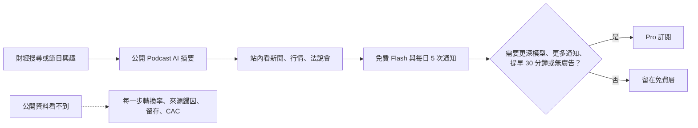
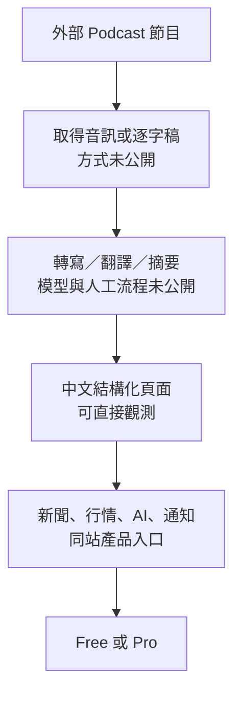

# Research: BigGo Finance 如何把 AI 內容變成漏斗

> 研究日期：2026-09-17；系列：免費內容如何替別的生意獲客，order 3。

## ELI5

想像一家店每天把很長的英文財經節目整理成免費中文講義，路過的人不用註冊就能讀。店真正收錢的不是講義，而是更強的 AI 模型、更多自動通知、提早看到法說會新聞與無廣告體驗。講義像試吃，但目前公開資料只能證明「試吃區和付費櫃檯都存在」，不能證明多少試吃者真的買單。

## 邊界、選案與偏誤

- 母群：以免費資訊或工具吸引投資人，再由訂閱、交易或 B2B 服務變現的台灣財經產品；排除純付費研究與純新聞媒體。
- BigGo Finance 代表「AI 內容 → 財經工具訂閱」；與 order 4 Fugle 的「研究工具 → 券商交易／API」形成對照。
- 偏誤：BigGo Finance 的公開材料幾乎全是產品頁，沒有公開 funnel conversion、流量來源、留存、內容成本或 Finance 產品線財務。以下能拆產品機制，不能證明商業成效。
- 舊 teardown 有實際公開頁面觀察價值，但其中「自動化」、「SEO 策略」、「導流 Pro」屬推論；本 dossier 將事實與推論拆開。

## 子問題

1. 免費入口到底提供什麼？是否真的不用登入或付費？
2. Pro 收費點與免費層差在哪裡？
3. 免費 Podcast 摘要到 Pro 的中間漏斗，有哪些能觀測、哪些只是推論？
4. BigGo 與 BigGo Finance 的公司／品牌關係，可證到哪裡？
5. AI 在內容供應鏈做什麼；哪些模型、ASR、人工編輯流程未公開？
6. 金融準確性、版權／引述與投資建議有哪些紅線？

## 先講結論

BigGo Finance 已把兩層產品放在同一站內：免費的即時報價、新聞、法說會與 Podcast 摘要等入口，以及付費的模型／通知／時效／無廣告權益。這讓「免費內容可能替 Pro 獲客」成為合理產品假說。但公開頁沒有來源歸因、註冊率、付費轉換率或 cohort，不能把相鄰頁面直接寫成已驗證漏斗，也不能宣稱 AI 讓內容邊際成本趨近零。

## 可證的產品事實

### 免費內容入口

- 官網 meta description 將產品描述為免費即時股票報價、最新新聞、國際市場資料與社群情緒分析。
- `/podcast` 搜尋頁標題為「Podcast AI 摘要」，描述為瀏覽財經 Podcast、以 AI 掌握摘要、焦點與市場分析。
- 一個公開單集頁在未登入狀態即可全文讀取，內容包含「本集重點」、多節摘要、表格、風險、引述、財經焦點與後續觀察；它不是單純逐字稿。
- 頁面確實是中文整理，但本輪沒有取得該集原始節目逐字稿逐句比對，因此不能替其準確率背書。

### 付費出口（2026-09-17 官方快照）

| 權益 | Free | Pro |
|---|---|---|
| 價格 | US$0 | US$20/月；US$192/年，頁面標示省 20% |
| AI 模型 | Flash | Flash、Pro、Thinking 深度思考模式 |
| 主動式排程通知 | 每日 5 次 | 每日 150 次 |
| 通訊軟體 | Telegram、LINE、Slack、Discord | 同左 |
| 法說會新聞 | 頁面標為 Pro 限定 | 提前 30 分鐘 |
| 廣告 | 有 | 無 |
| 結帳 | — | Stripe；信用卡／簽帳金融卡；可取消或降級 |

重要限制：這組價目只有官方一手頁完整支持，尚無第二個同期獨立來源，不符合系列文章「高風險定價雙來源」閘門。寫稿時應補來源，否則不放精確金額與額度。

### 公司脈絡

- BigGo 官方關於頁稱 BigGo 由 Kevin Yen、Louis Liu 於 2016 年在高雄創立，核心產品是商品搜尋、歷史價格、通知、現金回饋與聯盟行銷合作。
- 2019 年 MoneyDJ／Yahoo 報導稱 BigGo 宣布 A 輪 500 萬美元第一階段關閉。這是公司活動上的創辦人宣布、媒體轉述，且距 Finance 產品很遠；非本文必要核心數字，建議不寫。
- 本輪沒有找到 BigGo 官方公司頁明文介紹 BigGo Finance 的成立日、團隊、損益或與原比價事業的內部關係。只能從同一品牌／網域辨識產品關聯，不應自行寫成「比價資料或會員已灌入 Finance」。

## 漏斗：已觀測與未證明要分開

上圖前半是產品路徑，箭頭不是已驗證因果。尤其沒有公開證據證明 Podcast 讀者會依序使用行情／通知再訂閱，或 Podcast 是主要 SEO 流量來源。

### 漏斗逐層證據表

| 階段 | 公開證據 | 可以說 | 不可以說 |
|---|---|---|---|
| 被看見 | Podcast 列表可被搜尋引擎索引；單集頁公開 | 公開中文 AI 摘要可成為入口 | SEO 是主要來源、排名或自然流量規模 |
| 建立信任 | 單集頁有長篇結構化內容 | 產品用深度整理降低收聽與語言門檻 | 摘要準確率高、品質優於競品 |
| 進入工具 | 同站有行情、新聞、法說會、行事曆、自選股等導航／頁面 | 免費內容與工具在同一產品環境 | 某篇摘要確實導致加入自選股 |
| 形成習慣 | Free 有 Flash 與每日 5 次排程通知 | 免費層不只是靜態內容 | 使用頻率、留存或通知開啟率 |
| 付費 | 官方 pricing 有 Pro 權益 | 付費出口是能力、額度、時效、無廣告 | Podcast 直接帶來多少付費、Pro ARR |

## AI 內容供應鏈：只能把確定與推論分層

- **已證明：** 官方頁自稱 AI 摘要；輸出是長篇中文結構化頁面；Pro 提供 Flash／Pro／Thinking 模式。
- **合理但未證：** 可能涉及 ASR、翻譯、LLM 摘要與模板化出版。
- **完全未知：** 使用哪個模型；音訊／逐字稿從何取得；是否全自動；人工校對比例；更新頻率與選題標準；內容單位成本；原節目授權／引用安排。
- **不能寫：** 「自動抓熱門節目」、「Whisper 轉寫」、「零邊際成本」、「編輯台選題」——除非另有官方說明。

## 商業模式拆解

1. **免費內容不是唯一入口。** 即時報價、新聞、法說會、行事曆、自選股和免費 AI／通知一起構成 acquisition 與 activation；不能把所有獲客歸功於 Podcast。
2. **Pro 賣的是壓縮決策時間與自動化。** 更強模型、更多通知與提早 30 分鐘都在賣「更快、更主動」；無廣告則是體驗升級。
3. **廣告是可見但未量化的側翼。** pricing 明列免費版有廣告、Pro 無廣告，足以證明廣告存在；無公開資料能證明廣告收入占比或廣告是主力。
4. **通知可能比內容更有留存力。** 這是產品設計推論，不是公開成效；需要 notification opt-in、weekly active、alert-to-return、free-to-Pro 等資料驗證。

## AI 影響

### 機會

- 把長音訊轉成可搜尋、可掃讀的中文頁面，擴大原本受語言與時間限制的內容供給。
- 同一份處理結果可拆成摘要、焦點、引述與問答入口，增加內容再利用。
- Pro 能用模型能力與自動通知分層，而不必把所有內容鎖進付費牆。

### 威脅

- 摘要頁本身也容易被搜尋摘要或其他模型再摘要，若沒有登入、清單、通知或品牌直達，流量可能停在零點擊。
- 金融數字、公司名稱、引述與推論一旦錯誤，風險遠高於一般娛樂摘要；「AI 生成」不是責任豁免。
- 相同基礎模型使摘要格式快速商品化；真正較難複製的是即時資料權、使用者設定、通知工作流與累積信任。
- 原節目內容的轉寫、翻譯、長篇摘要與直接引述涉及授權／合理使用邊界；本輪未找到 BigGo Finance 公開授權說明，不能假定已獲節目方授權，也不能反向指控侵權。

## 文章紅線

- 不把產品路徑寫成已驗證 conversion funnel；用「設計成」「可能」「需以 cohort 驗證」。
- 不寫 Podcast 摘要「完全免費」以外的永久承諾；精確方案只能標 2026-09-17 快照。
- 精確價格、額度與時效在寫稿前需第二個完整獨立來源；找不到就省略數字。
- 不稱 AI 內容邊際成本為零，不猜 ASR／LLM 廠商或自動化比例。
- 不以單篇觀察宣稱摘要正確、優於競品或「品質極高」。
- 不宣稱 Podcast 已獲授權，也不在無證據下指控侵權。
- 不把 BigGo 比價事業的會員、流量、融資或聯盟行銷直接套到 Finance 產品。
- 不把頁面摘要中的外部金融主張當成 BigGo 自己查證過的事實；文章分析產品，不替摘要內容背書。

## 圖表構想

1. **主 Mermaid：** 上方的「公開摘要 → 站內工具 → 免費習慣 → Pro」漏斗，將未知 conversion 指標另畫虛線盒。
2. **AI 供應鏈圖：** 將「可觀測輸出」和「未公開處理」用不同節點，避免把推測畫成事實。
3. **比較表：** 免費層、Pro 層、可證收入機制、未知 KPI；不要做未實測的競品品質排行。
4. **可觀測性表：** pageview、註冊、加入自選、通知啟用、Pro conversion、90-day retention，說明若是經營者該補哪些數據。

## 事實交叉表

| Claim | 一手來源 | 第二來源 | 狀態 |
|---|---|---|---|
| Podcast 頁是 AI 摘要且公開可讀 | BigGo Finance 列表 meta + 單集全文 | 既有公開頁 service teardown | ✅ 產品能力；第二項是本機實測紀錄，不是獨立公司外來源 |
| Pro 為 US$20/月、US$192/年，Free/Pro 權益差異 | 官方 pricing 全文 | 未找到同期獨立來源 | ⚠️ 單一官方，文章精確定價未達雙來源 |
| BigGo 2016 年由 Kevin Yen、Louis Liu 於高雄創立 | BigGo 官方關於頁 | 2019 MoneyDJ／Yahoo 報導支持 2016 起家脈絡 | ✅ |
| 2019 A 輪 500 萬美元第一階段關閉 | MoneyDJ／Yahoo 對公司記者會的報導 | 本輪未得另一完整獨立來源 | ⚠️ 非本文必要，建議不寫 |
| Podcast 內容帶來 Pro conversion | 無 | 無 | ⚠️ 未公開 |
| 摘要由全自動 ASR + LLM 產生 | 無 | 無 | ⚠️ 未公開，僅可列假說 |

## 來源清單與讀取完整度

| URL | 角色／支持 claim | 完整度 | 訪問日 |
|---|---|---|---|
| https://finance.biggo.com.tw/pricing | 官方；方案、價格、額度、時效、廣告、Stripe | ✅ 全文，590 chars；HTTP 與 render 均一致 | 2026-09-17 |
| https://finance.biggo.com.tw/podcast | 官方列表；頁名與 meta 摘要 | 🟡 Groundlane fetch 整體失敗；Groundlane search 可讀索引片段，既有 teardown 有公開頁實測 | 2026-09-17 |
| https://finance.biggo.com.tw/podcast/a31e56a48e4602b5 | 官方單集；長篇中文結構化摘要 | ✅ 全文，未截斷；HTTP direct | 2026-09-17 |
| https://finance.biggo.com.tw/ | 官方首頁；產品定位與公開內容 | 🟡 direct fetch 僅 667 chars，render 重試失敗；只採 meta 與可見內容 | 2026-09-17 |
| https://biggo.com.tw/official/aboutus/ | 官方公司／原比價產品脈絡 | ✅ 全文，2,657 chars | 2026-09-17 |
| https://tw.stock.yahoo.com/news/%E7%8D%B2%E7%B5%B1-%E9%9D%92%E7%9D%9E-biggo%E5%AE%8C%E6%88%90500%E8%90%AC%E7%BE%8E%E5%85%83%E5%8B%9F%E8%B3%87%E7%AC%AC-%E9%9A%8E%E6%AE%B5-095800549.html | MoneyDJ／Yahoo；2019 募資與公司自報規模 | ✅ 全文，11,834 chars；數字來自公司活動 | 2026-09-17 |
| `.research/2026-09-16-biggo-finance-podcast-ai-teardown.md` | 既有公開頁面操作紀錄與早期推論 | ✅ 本機全文；推論已降級 | 2026-09-17 |

## 待解問題

- Podcast 內容的授權、來源連結、人工校對與更正流程。
- 內容頁 → 註冊 → 自選／通知 → Pro 的實際轉換與 90 日留存。
- Finance 產品線的上線日期、團隊、營收結構與廣告占比。
- 同期獨立價格來源；沒有就不要把 `$20/150 次/30 分鐘` 帶進文章正文。
