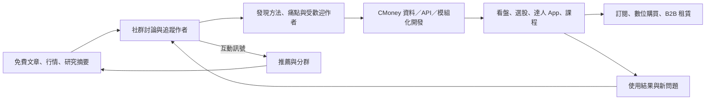

# Research dossier：CMoney 的內容—工具—社群飛輪

- 研究日期：2026-09-17
- 系列位置：「免費內容不是免費生意」order 2
- 核心問題：CMoney 如何把免費文章與討論，轉成工具使用、訂閱商品、創作者合作與社群回訪？
- 研究限制：CMoney／全曜財經為未上市公司，本輪未找到經審計的現行營收、訂閱收入、留存率、付費轉換或產品別占比。大量規模數字來自公司自報；文章若使用必須明標歸屬與日期。

## ELI5：免費讀書會旁邊的工具行

想像一個免費投資讀書會。大家每天交換筆記、討論股票，也看高手怎麼判斷。讀書會隔壁不是賣門票，而是開了一間工具行：有人買看盤工具，有人訂閱達人的選股 App，有人上課，機構客戶則購買更完整的資料與決策系統。

讀書會讓人每天回來，工具把抽象方法變成可重複操作，使用工具產生的新問題又回到社群討論。CMoney 的飛輪不是「文章塞廣告」，而是內容與社群先形成需求，再由工具與教育商品變現。

## 已驗證事實

### 1. CMoney 官方自己把循環寫成「方法—工具—社群」

CMoney 公司產品頁列出三個步驟：理解自己並選擇方法、用工具有紀律地執行、透過社群互動持續下去。這是本篇最強的一手架構證據。

同頁說明它沒有把所有需求塞進一個 all-in-one App，而是針對基本面、籌碼面、波段、短線、當沖或長線等方法做不同 App；達人可以有自己的產品與社群。這支持「內容／方法被產品化成工具」，但不能證明每支 App 都賺錢。

### 2. 免費入口同時包含內容、行情、討論與模擬操作

股市爆料同學會的 Google Play 頁列出即時股價、技術分析、法人動向、新聞、研究報告、發文、匿名問答、模擬交易、達人績效榜與個人化推薦。商店頁也標示「含廣告內容」與「數位購買」。

這證明社群不是純論壇，而是把內容、行情與工具放在同一個日常使用場景。商店描述多由開發者提供，規模與成效宣稱仍屬公司自報。

### 3. 社群也是創作者供給與商品發現層

Google Play 的官方描述寫明「股市創作者計畫」：使用者可申請成為作者，並有機會由官方協助推出 App、書籍與影音課程。CMoney careers 頁則稱合作夥伴事業群與 50 位以上創作者合作，把知識做成 App 與影音課程。

因此可提出機制：社群找出受歡迎的作者與方法 → CMoney 把方法模組化成商品 → 商品作者再把讀者帶回內容／社群。這是合理的飛輪模型，不是已公布的平均轉換漏斗。

### 4. 變現不只一條：B2C 訂閱／課程，也有 B2B 系統

理財寶首頁與商城展示軟體、講座、線上課程、影音與合作作者；籌碼 K 線商品頁確認有自動續訂的年訂閱商品。CMoney 法人系統購買頁則顯示月租／年租與企業客製方案，證明 B2B 決策系統是另一條收入線。

本輪沒有完整、穩定取得 B2C 商品即時售價，也沒有 creator revenue-share 條款。因此文章可以寫「存在訂閱、課程與法人租賃」，不能估算 ARPU、抽成或哪條收入最大。

### 5. 資料與模組化工具是飛輪的共用底座

iThome 2022 深度採訪指出，CMoney 從法人決策工具轉向 2C，將資料與運算邏輯做成共用 API／模組，再以不同 App 服務細分投資方法。該報導亦描述論壇貼文、留言、頁籤、庫存、推播與點擊等行為資料，被用於分析與個人化推薦。

這個獨立媒體來源支持「多 App 共用資料與技術底座」；其中會員、日資料量、推播量與市占數字仍多來自公司受訪者，若引用必須寫成 2022 公司提供的快照。

### 6. 公司規模數字存在口徑與時間差，不宜拼接

2026 careers／product 官方頁同時出現 1,000 萬、1,200 萬、1,300 萬級的產品用戶／會員表述，以及 350 萬或 500 萬 App 活躍用戶、600 萬網站活躍用戶等不同口徑。2022 iThome 則報導 730 萬會員與每週活躍破百萬。

這些數字可能代表不同日期、產品範圍與 active 定義。不可拼成成長率，不可把「產品服務超過 X 萬用戶」當 unique active users。若文章不需要規模，最好全部省略。

### 7. AI 已進入推薦與產品層，但付費狀態要小心

股市爆料同學會 Google Play 頁明說使用 AI 演算法推薦作者與股票文章；iThome 2022 也記錄公司規劃以跨平台行為資料做個人化。

「AI 股神」官方理財寶搜尋結果顯示月訂閱原價 1,680 元、優惠 990 元，但同時標示「尚未開賣」。官方產品頁正文未正常抽出價格／功能，App Store 頁也只確認開發者為 CMoney。故不能寫成已上線且已產生付費收入的產品。可寫「CMoney 已展示／準備 AI 投資助手商品」，並標查詢日與尚未開賣狀態。

另一個官方內容頁描述「股神機器人」把財務、技術、籌碼、新聞與討論區觀點彙整成個股摘要。這證明 AI 能把同一資料底座包成新介面，但官方沒有公開準確率、投資績效或使用者付費轉換。

## 飛輪模型（機制假說，不是已證因果）

圖中「使用結果」不代表投資獲利；它只表示使用工具後會產生觀察、問題與分享。投資績效不可由平台互動推論。

## 每一層真正累積什麼

| 層 | 使用者得到 | CMoney 可能累積 | 變現方式 | 證據強度／未知 |
|---|---|---|---|---|
| 免費內容／行情 | 新聞、研究摘要、個股資訊 | 搜尋入口、題材需求 | 廣告、導向產品 | 有官方頁；廣告收入占比未知 |
| 股市爆料同學會 | 討論、問答、作者、模擬交易 | social graph、互動與偏好訊號 | 廣告、數位購買、導流 | 功能可證；留存／轉換未知 |
| 籌碼 K 線等工具 | 方法執行、看盤／選股 | 自選、使用習慣、產品續訂 | 訂閱 | 自動續訂可證；即時價格／收入未知 |
| 達人合作 App／課程 | 把作者方法做成介面與教學 | 創作者供給、細分客群 | App、課程、書籍 | 合作模式可證；分潤條款未知 |
| 法人系統 | 資料、回測、研究協作 | 長期機構流程與資料整合 | 月租／年租／客製 | 官網可證產品；市占為公司自報 |
| AI 推薦／助手 | 個人化內容或多面向摘要 | 更多互動與決策情境 | 尚待確認 | 推薦可證；AI 股神仍標尚未開賣 |

## 為什麼這比純內容更黏（研究假說）

- 內容可以在別站重寫；自選股、設定、訂閱商品與社群追蹤需要重建。
- 作者不是只供稿，而可能把方法轉成 App、課程與社群，平台能重複使用資料與開發模組。
- 社群提供需求探索與分發，工具提供付費理由，工具使用再製造可討論的情境。
- B2B 與 B2C 共用財經資料底座，可能攤薄資料清理與運算成本。

以上都屬機制推論。沒有 cohort retention、cross-sell rate、CAC、ARPU 或產品別毛利，不能宣稱飛輪已被財務數據證明。

## AI 影響

### 機會

- 把公司既有的財務、技術、籌碼、新聞與社群資料，轉成對話式查詢或個人化摘要。
- 協助把創作者方法做成規則、提示與可操作工具，降低產品化成本。
- 在社群中做內容推薦、重複問題整理、垃圾訊息偵測與風險提示。
- 對 B2B 客戶，把資料查詢與報告組裝變成較低摩擦的工作流。

### 威脅與治理成本

- AI 摘要若把社群傳聞與事實混在一起，會放大金融錯誤資訊。
- 個人化若只優化點擊，可能把使用者推向更刺激、風險更高的內容，而非更好決策。
- 生成式分析容易被讀成投資建議；需要清楚來源、時間戳、模型限制與法遵界線。
- 通用 AI 可以降低基本摘要與指標解讀的差異化，CMoney 的護城河要回到授權資料、即時性、工作流與社群關係。
- 使用者行為、持倉或偏好若進入模型／推薦系統，需有明確同意、用途限制與刪除機制；本輪未完成 CMoney 全產品隱私政策核對。

## 可直接寫稿的論證骨架

1. ELI5：免費投資讀書會旁邊的工具行。
2. 用官方三步驟開場：方法 → 工具 → 社群，這不是外部替 CMoney 發明的定位。
3. 免費內容與論壇負責產生問題、辨識作者與形成日常回訪。
4. 共用資料／API／模組化開發，把方法快速包成不同 App。
5. 訂閱、課程、合作作者與 B2B 決策系統是多條變現線，不猜哪條最大。
6. 畫飛輪並逐箭頭標示「可證事實」或「研究假說」。
7. AI 的價值不是多寫文章，而是跨財務、籌碼、新聞與社群做查詢／推薦；同時增加誤導與法遵成本。
8. 結尾給讀者判斷：若平台只提供內容，替代成本低；若累積設定、工具流程與社群關係，搬家成本才上升。

## 發文紅線

- 不寫 CMoney 的現行營收、獲利、ARPU、付費會員數或各產品收入占比；沒有公開可靠資料。
- 不把 1,000／1,200／1,300 萬等不同公司自報口徑混在一起算成長。
- 不把「90% 金融機構」「兩位投資人一位使用」等官方行銷說法當獨立市占調查；若引用需寫公司自報，最好不用。
- 不把 Google Play／官方宣稱的「每天百萬人在線」當第三方 verified DAU。
- 不寫社群造成高留存、工具提高投資績效或飛輪已證實；沒有 cohort／實驗／財務資料。
- 不寫 creator revenue share 或平台抽成；本輪沒有合約／條款。
- 不把 AI 股神寫成已上線付費 App：官方搜尋結果在 2026-09-17 顯示「尚未開賣」。
- 不引用 AI 股神 1,680／990 元作現行成交價，除非上市後重新讀取完整商品頁並有第二來源。
- 不把 AI 摘要、推薦或選股輸出描述成可靠投資建議；沒有準確率或績效驗證。

## 來源與讀取完整度

| URL | 支持的 claim | 來源角色 | 完整度 | 查詢日 |
|---|---|---|---|---|
| https://www.cmoney.tw/careers/product | 官方「方法—工具—社群」循環、多 App、達人合作與產品地圖 | CMoney 官方 | ✅ Groundlane 全文，未截斷 | 2026-09-17 |
| https://www.cmoney.tw/careers/aboutus | 四事業群、創作者合作、內容／工具／社群流程、公司自報規模 | CMoney 官方 | ✅ Groundlane 全文；數字為公司自報 | 2026-09-17 |
| https://play.google.com/store/apps/details?hl=zh_TW&id=com.cmoney.forum | 同學會功能、含廣告／數位購買、AI 推薦、創作者計畫 | Google Play／開發者描述 | ✅ Groundlane 全文 | 2026-09-17 |
| https://www.cmoney.tw/app/default.aspx | 理財寶的軟體、講座、課程、影音與產品陳列 | CMoney 官方 | ✅ Groundlane 全文，未截斷 | 2026-09-17 |
| https://www.cmoney.tw/app/itemcontent.aspx?id=3537 | 籌碼 K 線年訂閱、自動續訂 | CMoney 官方商品頁 | ✅ Groundlane 全文；價格主要在圖片中未抽出 | 2026-09-17 |
| https://www.cmoney.com.tw/purchase | 法人系統租賃／客製方案 | CMoney 官方 | 🟡 Groundlane browser 只抽到部分內容；搜尋結果補定位，不用精確價格 | 2026-09-17 |
| https://www.ithome.com.tw/people/150043 | 2B→2C、資料／API 模組化、多 App、社群行為資料與推薦 | 獨立技術媒體採訪 | ✅ Groundlane 全文，未截斷；數字多源自受訪公司 | 2026-09-17 |
| https://www.cmoney.tw/app/itemcontent.aspx?id=6580 | AI 股神商品狀態 | CMoney 官方商品頁 | 🟡 Groundlane 全文未抽到商品細節；搜尋結果顯示價格與尚未開賣 | 2026-09-17 |
| https://www.cmoney.tw/notes/note-detail.aspx?nid=882393 | 股神機器人彙整財務、技術、籌碼、新聞與討論 | CMoney 官方內容頁 | 🟡 Groundlane 搜尋摘要，未作高風險數字依據 | 2026-09-17 |
| https://apps.apple.com/tw/app/ai%E8%82%A1%E7%A5%9E/id6753969485 | 開發者為 CMoney、App 存在 | Apple App Store | 🟡 Groundlane 未回正文；搜尋可定位，不用功能／定價 | 2026-09-17 |

## 仍待解問題

- 免費內容、社群、廣告、B2C 訂閱／課程與 B2B 系統的實際收入占比。
- 同學會到理財寶／達人 App 的轉換率，以及工具訂閱後是否真的提高留存。
- 創作者選拔、App 共製、IP、定價與分潤條款。
- AI 推薦／助手使用哪些個資、能否退出、輸出如何標來源與處理投資法遵。
- AI 股神正式上線日期、方案、可用功能與是否只是既有股神機器人的商品化包裝。
