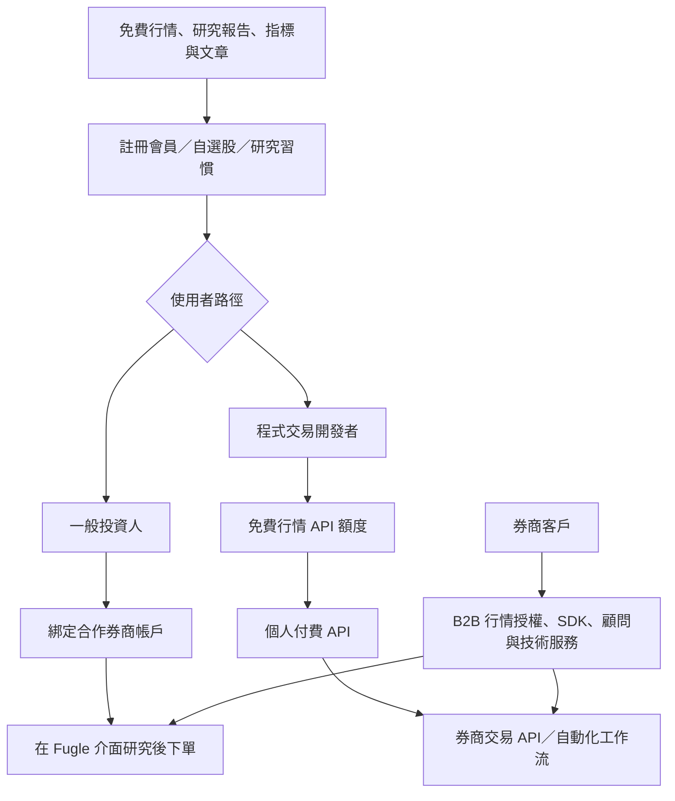
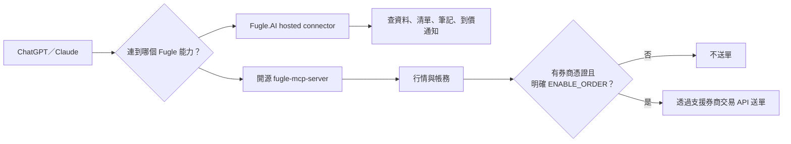

# Research: Fugle 如何讓資訊一路走到交易

> 研究日期：2026-09-17；系列：免費內容如何替別的生意獲客，order 4。

## ELI5

想像一家店先免費借你看地圖和路況，再讓你把常走的路存起來。當你真的要出發，它不是自己開車載你，而是把介面接到有執照的運輸公司；進階使用者還能付費拿即時資料 API，自己寫導航程式。Fugle 的價值不是「文章旁邊放下單按鈕」這麼簡單，而是把研究介面、會員設定、券商帳戶與 API 工作流接在一起。券商才是證券帳戶與交易執行方；公開資料支持 Fugle 收資訊服務費與 API 費，沒有足夠證據稱它逐筆抽交易佣金。

## 邊界、選案與偏誤

- 母群：以免費資訊或工具吸引投資人，再由訂閱、交易或 B2B 服務變現的台灣財經產品。
- Fugle 代表「資訊／研究工具 → 券商帳戶綁定 → 下單，以及行情／交易 API」；與 BigGo Finance 的內容訂閱漏斗互補。
- 偏誤：公開材料偏產品文件、客服與公司受訪，缺合約、分潤、毛利、轉換率與當前各合作的完整契約。券商名稱也隨整併與合作終止而漂移，文章必須標日期與產品面（App/Web 或交易 API）。

## 子問題

1. 免費資訊／研究入口是什麼，如何進入會員與自選工作流？
2. App/Web 內下單由誰執行，帳戶與資產屬於誰？
3. Fugle 可證的收入來源是訂閱、資訊服務費、B2B 授權還是交易佣金？
4. 玉山合作終止與元富／台新等合作如何揭露漏斗的依賴性？
5. 行情 API、交易 API、Fugle.AI 與開源 MCP 各自做什麼？
6. AI、金融法規、憑證、個資與錯單風險有哪些紅線？

## 先講結論

Fugle 的漏斗不是單一路徑，而是三條相連的生意：

1. B2C 研究介面吸引並留住一般投資人，再以合作券商帳戶把研究接到下單；
2. 個人開發者由免費行情額度進入每月 API 訂閱；
3. 券商以 B2B 方式採購行情／交易技術、授權與顧問能力。

最有力的商業證據不是「下單很多」，而是 2025 年公司受訪稱，玉山 App/Web 合作中斷後，以資訊服務費維生的 Fugle 營收衰退超過 50%、App 活躍用戶減少三分之二。這是公司向媒體揭露、未經審計，但它清楚顯示交易整合是 activation／retention 與 B2B 收入的關鍵；不等於 Fugle 每筆抽佣。

## 三條漏斗

這張圖呈現產品與客戶路徑，不代表每個免費使用者都會開戶，也不代表所有 API 訂閱者會交易。

## 免費入口與付費層

### B2C 研究／資訊

- Fugle 官方公告把 App/Web 的日常用途描述為投資研究、看行情與閱讀研究報告；券商合作結束時，這些功能仍持續。
- 合作券商帳戶綁定可解鎖即時行情與研究權益；2026 年客服頁以台新證券為例，說明在 Fugle 內登入、綁定與下單。
- 這不是「Fugle 自己開券商帳戶」。官方玉山終止公告明說兩家公司獨立，資產與帳務由玉山處理；合作終止後，用戶改到玉山入口操作。

### 個人行情 API（2026-09-17 官方快照）

| 方案 | 價格 | 代表能力 |
|---|---:|---|
| 基本用戶 | 註冊會員免費 | 台股 WebSocket 5 subscriptions／1 connection；日內 60/min；歷史 60/min |
| 開發者 | NT$1,499/月 | 300 subscriptions／2 connections；日內與快照 600/min；期權與部分進階資料 |
| 進階用戶 | NT$2,999/月 | 2,000 subscriptions／2 connections；日內與快照 2,000/min |
| 企業 | 洽談 | 專屬 API server、無上限 connections 等客製方案 |

限制：精確個人價格目前只有官方一手完整頁；寫稿前需要同期獨立來源，否則只描述 freemium → paid API 的結構。

### B2B 與交易整合

- AWS 的 Fugle 客戶案例稱，券商可用 B2B 模式集中採購大量行情授權給程式交易客戶；Fugle 也提供交易 SDK、文件、sample code 與 onboarding。
- 2025《數位時代》專訪稱 Fugle「以資訊服務費維生」，並將自己定位為與券商共同經營數位客戶的產品／顧問夥伴，不只是一次性 SI。
- 公開資料沒有逐筆分潤比例、最低保證、開戶 bounty、交易佣金分成或各券商合約。文章應寫「資訊服務費／B2B 技術服務」，不能寫「靠券商佣金」或「交易越多 Fugle 抽越多」。

## 合作關係與時間線：不要把歷史名單當現況

| 日期 | 可證事件 | 對漏斗的意義 |
|---|---|---|
| 2017／2019 | 公司受訪稱與玉山自 2017 合作、2019 App/Web 服務上線 | 研究與交易第一次形成一站式路徑 |
| 2024-12-31 19:00 | Fugle 官方公告：玉山在 Fugle App/Web 的下單與帳務功能終止；兩公司獨立 | 交易出口可被合作方抽走，研究資料不等於券商帳戶所有權 |
| 2025-05-14 | 公司受訪稱與元富 App 下單整合上線，改走非排他、多券商策略 | 降低單一券商依賴，但當時只是策略與首家新整合 |
| 2026-04 | 官方客服已提供既有台新帳號在 Fugle 直接下單說明 | 目前 App/Web 至少有台新路徑 |
| 2026-09 文件面 | Developer Docs 搜尋索引仍列富邦、台新、玉山；開源 MCP README 設定列 `taishin|fubon`；客服仍有元富分類 | 不同表面（App/Web、API、歷史文件）名單不一致，逐一按產品與日期核對 |

高風險提醒：Developer Docs 合作券商頁的文字抽取只有通用敘述，券商名稱藏在圖片／索引；而官方公告已證明玉山 App/Web 整合終止、但交易 API 當時不受異業合作影響。這不是單純「文件過時」，而是產品線可能不同。文章不可列一張無日期的「現行合作券商總表」。

## 依賴性案例：玉山合作中斷

2025《數位時代》專訪（Yahoo 與 Meet 副本均可全文讀取）引述公司：

- Fugle 擁有 30 萬名用戶；
- 玉山整合中斷四個多月後，Fugle 營收衰退超過 50%，App 活躍用戶數減少三分之二；
- 報導以證交所月報觀察玉山數位分公司月成交金額：2024-12 為 94.4 億元、2025-04 為 75.2 億元、前一年同期 111.5 億元；
- Fugle 表示收入是資訊服務費，並轉向 3–5 家券商的小型聯盟構想。

這些是高風險數字：Yahoo 與 Meet 是同一《數位時代》報導的轉載，不算兩個獨立來源；使用者數、營收降幅與活躍降幅來自公司受訪，未經審計。證交所月報數字在本輪未回官方月報逐格覆核。最安全的文章寫法是描述「公司向媒體表示中斷造成重大營收與活躍衝擊」，不要放精確百分比，除非再補獨立一手財務／流量證據。

## AI 與 MCP：是兩個不同邊界

### Fugle.AI 官網可證能力

- 在 ChatGPT／Claude 連接 Fugle；
- 查台股資料；
- 管理追蹤清單；
- 記錄投資筆記；
- 設定到價通知；
- 各 AI 平台的使用條件另計，Claude 可能需要 Pro 方案。

官網沒有在本輪可讀文字中宣稱下單。因此 Fugle.AI 最適合被描述為「把研究與個人工作流帶進對話入口」，不是「在 ChatGPT 一句話交易」。

### 開源 `fugle-mcp-server` 可證能力

- 官方 GitHub repo 支持即時行情、帳務／庫存與交易相關工具；
- 需本地券商帳密、憑證與 account 設定；README 顯示 broker SDK 類型；
- 設定有 `ENABLE_ORDER`，交易能力需明確開啟。

不能把 hosted Fugle.AI 與開源 trading MCP 的能力混成同一產品承諾。

## 護城河與切換成本

| 資產／工作流 | 誰控制 | 切換時會發生什麼 |
|---|---|---|
| 研究介面、自選、筆記、指標 | Fugle／使用者帳號 | 是否完整匯出未在本輪證實；可能需重建設定 |
| 證券帳戶、庫存、交割與帳務 | 合作券商 | 玉山案例證明合作中斷不會搬走資產，但 Fugle 內入口可消失；跨券商需開戶／匯撥 |
| 行情 API 程式碼與策略 | 開發者 + Fugle API contract | SDK、rate limit、資料欄位與 broker adapter 會造成工程切換成本 |
| 交易憑證與風險同意 | 券商／投資人 | 不能由內容平台任意搬移；需按券商與監管流程 |
| B2B 低延遲基礎設施 | Fugle + 券商 + 雲／IDC | 穩定度、機房鄰近、授權與支援形成較深切換成本 |

真正的護城河不是免費文章，而是研究設定、行情資料、API 整合、券商合作與客服／顧問流程的組合。玉山案例同時證明這種護城河也是平台風險：關鍵合作斷掉時，留存與收入會一起受創。

## AI 影響

### 機會

- 自然語言降低查行情、維護清單、記筆記與設通知的操作成本，讓「資訊 → 行動」更短。
- LLM 輔助寫程式降低 API onboarding 門檻，可能擴大程式交易開發者母群；《數位時代》也把生成式 AI 列為客群擴大的背景，但這是公司看法，不是因果證明。
- MCP 把 Fugle 從單一 App 入口變成可嵌入多個 AI client 的能力層。

### 威脅

- 自然語言的模糊性與模型幻覺，在行情查詢還可人工複核，在送單時可能變成真實資金損失。
- 把券商帳密、憑證、身分證資訊放進本地 MCP 設定，會提高 secret handling、惡意 prompt／工具呼叫與本機供應鏈風險。
- AI 讓行情查詢 UI 商品化；若第三方模型直接回答而不回 Fugle，品牌入口可能被稀釋。
- 金融資料授權、即時性與來源仍是硬邊界；LLM 不能把延遲行情變成即時行情，也不能替代適合度、風險揭露與券商控制。

## 文章紅線

- 不寫 Fugle「靠券商交易佣金」；目前只可證資訊服務費、個人 API 訂閱、B2B 授權／技術與顧問服務。
- 不把 Fugle 稱為券商；證券帳戶、資產、帳務與實際交易由合作券商處理。
- 不列無日期的現行券商總表；App/Web、交易 API、歷史合作是不同表面。
- 不說玉山合作完全終止所有 API；官方公告當時明確說 App/Web 下單／帳務終止，而交易 API 不受異業合作影響，後續合約變化另行通知。
- 不把 30 萬用戶、營收 -50%、活躍 -2/3、成交金額或 API 成長寫成獨立審計數字；需第二獨立來源含一手。
- 不把 Fugle.AI 官網能力寫成可下單；交易是另一個開源 MCP／券商憑證／`ENABLE_ORDER` 路徑。
- 不鼓勵把券商密碼、身分證、憑證貼進聊天；設定 secrets 必須留在受控環境。
- 不暗示 AI 分析就是投資建議、保證報酬或降低投資風險。
- 精確 API 價格標 2026-09-17 且在寫稿前補第二來源；否則省略。

## 圖表構想

1. **主 Mermaid：** 三條漏斗（一般投資人、個人開發者、券商 B2B）匯入交易與 API 工作流。
2. **所有權圖：** 研究資料在 Fugle、資產帳務在券商、策略在使用者、行情授權在資料供應鏈，解釋為何「資訊到交易」不是一家全包。
3. **合作中斷時間線：** 玉山 App/Web 終止 → 四個月空窗 → 元富整合 → 2026 台新入口；每節點標資料日期，避免名單漂移。
4. **MCP 安全決策圖：** read-only 預設 → 是否有憑證 → 是否明確開啟 order → 人工確認／風控，不能畫成一句話直接下單的炫技圖。
5. **比較表：** Free research、個人 API、券商整合、B2B license，各自付費者、任務、收入證據與未知項。

## 事實交叉表

| Claim | 一手來源 | 第二來源 | 狀態 |
|---|---|---|---|
| 玉山與 Fugle 為獨立公司；2024-12-31 App/Web 下單與帳務終止 | Fugle 官方公告 | 2025《數位時代》專訪全文 | ✅ |
| 2025-05-14 元富 App 下單整合上線 | 公司主管受訪／《數位時代》 | Fugle 客服元富頁與活動頁存在，但本輪部分全文抓取失敗 | ✅ 方向，精確日期主要靠單一專訪 |
| 2026 已可用台新帳號在 Fugle 下單 | Fugle 官方客服搜尋結果與綁定全文 | Developer Docs 索引列台新 | ✅；仍須與 API partner list 分開 |
| Fugle 收資訊服務費，玉山中斷後營收 -50%、活躍 -2/3 | 公司受訪／《數位時代》 | Yahoo、Meet 為同稿轉載，不獨立 | ⚠️ 公司自報、未審計；高風險數字未達雙來源 |
| 個人行情 API 免費／NT$1,499／NT$2,999 | 官方 pricing 全文 | 未找到同期獨立來源 | ⚠️ 單一官方；文章精確價格未達雙來源 |
| 券商可 B2B 集中採購行情授權 | AWS 客戶案例引述 Fugle | 《數位時代》描述 API 與券商服務 | ✅ 商業結構；合約金額未知 |
| Fugle 每筆交易抽佣 | 無 | 無 | ❌ 不可寫 |
| hosted Fugle.AI 可下單 | 官網只列查詢／清單／筆記／通知 | 無 | ❌ 不可把開源 trading MCP 能力挪過來 |

## 來源清單與讀取完整度

| URL | 角色／支持 claim | 完整度 | 訪問日 |
|---|---|---|---|
| https://developer.fugle.tw/docs/pricing/ | 官方；個人行情 API 方案、企業方案 | ✅ 全文，1,609 chars | 2026-09-17 |
| https://developer.fugle.tw/ | 官方開發者入口 | ✅ 全文，1,324 chars；首頁文字少 | 2026-09-17 |
| https://developer.fugle.tw/docs/trading/brokerage_partner/ | 官方合作券商頁 | 🟡 全文文字 595 chars，但券商 logo／名稱未被正文抽出；搜尋索引另顯示名稱 | 2026-09-17 |
| https://support.fugle.tw/fugle-member-account/fugle-guidance/15335/ | 官方；玉山合作終止、帳戶／資產／API 邊界 | ✅ 全文，4,164 chars | 2026-09-17 |
| https://support.fugle.tw/fugle-guidance-2/6739/ | 官方；合作券商帳戶綁定，以台新為例 | ✅ 全文，809 chars | 2026-09-17 |
| https://support.fugle.tw/cooperate/5850/ | 官方；既有台新帳號可在 Fugle 下單 | 🟡 Groundlane search 摘要；未另取全文 | 2026-09-17 |
| https://support.fugle.tw/cooperate/masterlink/19721/ | 官方；元富開戶／合作說明 | 🟡 Groundlane fetch 整體失敗；僅 search 摘要 | 2026-09-17 |
| https://www.fugle.ai/ | 官方；hosted AI connector 能力 | ✅ 全文，393 chars | 2026-09-17 |
| https://github.com/fugle-dev/fugle-mcp-server | 官方 GitHub；行情、帳務、交易、憑證與 `ENABLE_ORDER` | ✅ 全文，3,643 chars | 2026-09-17 |
| https://www.bnext.com.tw/article/82066/quant-trading-fugle | 獨立媒體；API、客群、券商合作、公司自報成長 | ✅ 全文，2,906 chars | 2026-09-17 |
| https://tw.news.yahoo.com/%E7%8D%A8%E5%AE%B6%E5%B0%88%E8%A8%AA-%E5%AF%8C%E6%9E%9C%E5%88%86%E6%89%8B%E7%8E%89%E5%B1%B1100-%E5%A4%A9-%E6%94%9C%E6%89%8B%E5%85%83%E5%AF%8C%E8%AD%89%E5%88%B8%E7%B5%84%E9%9A%8A-%E7%82%BA%E4%BD%95%E8%BD%89%E5%9E%8B%E5%A4%9A%E5%88%B8%E5%95%86%E6%95%B8%E4%BD%8D%E5%B9%B3%E5%8F%B0-101448858.html | 《數位時代》Yahoo 全文；玉山衝擊、元富、多券商策略、資訊服務費 | ✅ 全文，15,216 chars | 2026-09-17 |
| https://meet.bnext.com.tw/articles/view/52336 | 同一《數位時代》稿的授權副本 | ✅ 全文，3,369 chars；**不算獨立第二來源** | 2026-09-17 |
| https://aws.amazon.com/tw/events/taiwan/interviews/aws-outposts-cht-fugle/ | AWS 商業案例；B2B 授權、SDK、低延遲基礎設施 | ✅ 全文，3,397 chars；供應商案例非 audit | 2026-09-17 |
| https://www.fugle.tw/ | 官方主站 | 🔴 Groundlane bounded fetch 整體失敗；不靠此頁下具體結論 | 2026-09-17 |

## 待解問題

- 2026-09-17 App/Web 與各交易 API 的精確現行券商矩陣，以及台新／元富整併後品牌與 SDK 遷移狀態。
- 券商支付 Fugle 的合約結構：固定資訊服務費、授權量、開戶獎勵或其他變動費；目前不得猜分潤。
- 研究功能、自選、筆記是否能匯出；這決定 B2C 真實切換成本。
- API 價格的同期第二來源；公司自報營收／活躍降幅的獨立一手或財務證據。
- hosted Fugle.AI 的 authentication、資料保留、工具 permissions 與 prompt-injection 防護文件。
