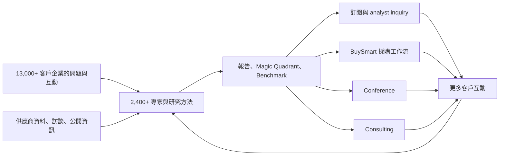
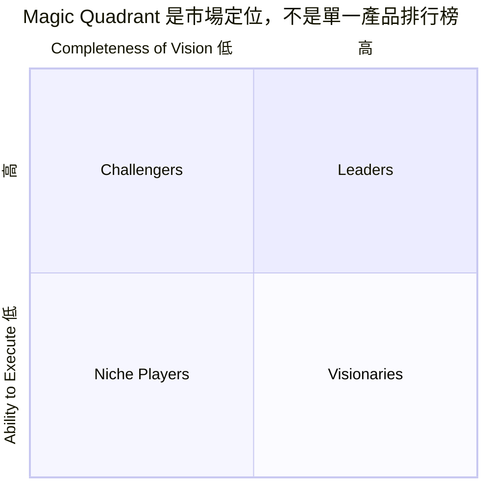
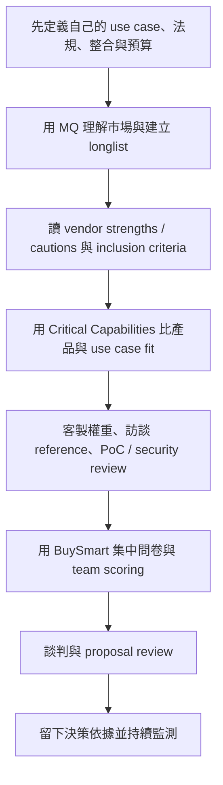
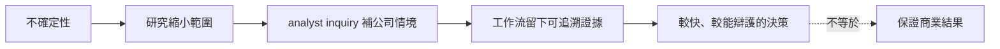
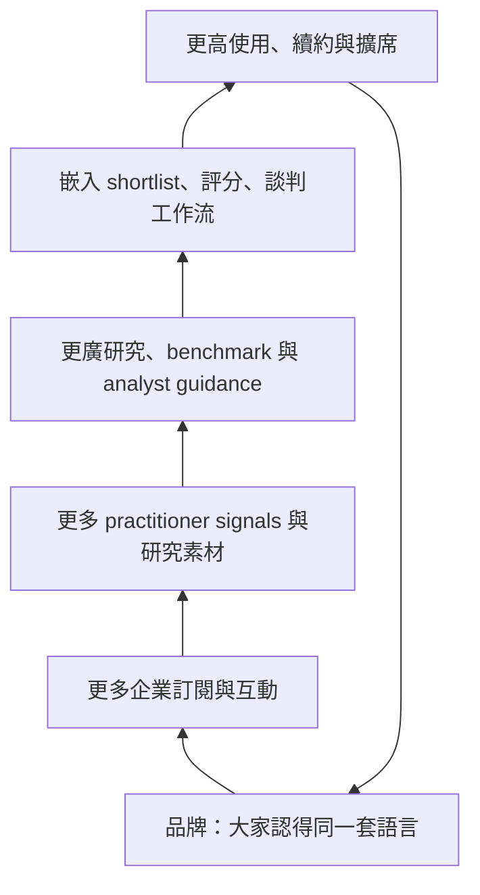

# Gartner 研究 dossier：企業為什麼買「決策保險」

研究日期：2026-09-16（Asia/Taipei）
研究路徑：本 session 完整 callable inventory 未掛載 Groundlane；依 repo fallback 規則改用 Exa `web_search` / `web_fetch`。以下是公開網頁研究，**不是 Groundlane 路徑驗證**。
建議文章定位：B2B 產業情報子系列中的「內容如何從報告升級成決策工作流」。

## 一句話結論

Gartner 賣的不是「哪家廠商最好」這個答案，而是一套能讓高風險企業決策更快、較可辯護的共同語言：市場地圖縮小候選名單，方法論解釋評分，分析師 inquiry 補情境，benchmark 與工具把研究放進工作流程。這像保險，但不是保證決策正確；它降低的是資訊搜尋、內部對齊與「事後說不清為什麼這樣選」的成本。

## ELI5：像帶大人去逛一座巨大玩具城

公司要買一套核心軟體，通常不是小朋友拿零用錢買玩具，而是幾十個大人要花幾百萬、用五年，選錯還會一起挨罵。

Gartner 像一位逛過很多次玩具城的嚮導：

1. 先畫地圖，告訴你有哪些店、各自大概擅長什麼。
2. 給一張檢查表，提醒你不要只看最亮的招牌。
3. 讓你打電話問：「我們家空間很小，這個真的適合嗎？」
4. 幫你把候選、需求、評分與談價資料放進同一個流程。

真正買到的不是「嚮導永遠不會錯」，而是少走冤枉路、讓一群大人使用同一張地圖，最後能向老闆解釋選擇。這就是本文所稱的「決策保險」：**降低決策過程的風險，不承保結果。**

## 商業模式：一份研究，多次收費與反覆使用

關鍵不是「寫完一份報告就賣掉」，而是把同一組研究資產封裝成訂閱、專家諮詢、工具、活動與顧問服務，再從使用過程得到新的問題與訊號。2025 年 10-K 稱 Gartner 與逾 13,000 家企業保持接觸、擁有逾 2,400 名 business/technology experts，當年有逾 510,000 次直接客戶互動；這些互動既是服務，也是下一輪研究的輸入。[S1]

### 2025 年可核對的規模訊號

| 指標 | 2025 數值 | 解讀 | 證據 |
|---|---:|---|---|
| 全公司營收 | US$6.5B | 已是大型資訊服務公司，不是小型出版商 | S2 |
| Insights 訂閱型產品占總營收 | 約 78% | recurring insights 是經濟核心 | S1 |
| 年末 contract value | US$5.2B | 已簽約年化價值形成可預測基礎 | S2 |
| GTS / GBS contract value | US$3.9B / US$1.2B | 科技買方與供應商仍是主體，但非 IT 職能也已成規模 | S2 |
| Insights 客戶留存率 | 85%（2024：84%） | 高留存支持「決策基礎設施」說法，但仍有 15% 流失 | S1 |
| 多年期合約占比 | 77% | switching cost 與收入可見度較高 | S1 |
| Q4 Insights contribution margin | 77% | 可重複販售研究的邊際經濟優於 Q4 Conferences 51%、Consulting 27% | S2；注意僅是單季 |

不要把 US$6.5B 或淨利變化直接歸因於 Magic Quadrant、AI 或某個單一產品。可證明的是產品組合與財務結構；因果證據不足時不寫股價故事。

## 產品結構：Research/Insights、Sales 與工作流如何接起來

Gartner 2025 年把原本叫 Research 的報告分部改名 Business and Technology Insights。這不是只有換名：官方描述的訂閱包含 published content、data、benchmarks，以及直接接觸專家；最低合約期通常為 12 個月。[S1]

| 層次 | 客戶拿到什麼 | Gartner 如何變現 | 在決策中的功能 |
|---|---|---|---|
| Business & Technology Insights | 報告、資料、benchmark、工具、analyst / advisor access | 年約、多年約、按使用者或 team entitlement | 建立共同語言與持續 advisory |
| GTS（Global Technology Sales） | 面向 technology users 與 providers 的產品 | 直銷、續約、擴席 | 核心科技市場與供應商關係 |
| GBS（Global Business Sales） | HR、供應鏈、財務、行銷等職能洞察 | 直銷、跨職能擴張 | 從 CIO 延伸到全企業 buying centers |
| BuySmart | 市場/供應商 profiles、需求自訂、shortlist、team scoring、vendor questionnaire、proposal review | entitlement 內的採購工具與 expert review；公開頁未列獨立定價 | 把內容嵌進採購流程，增加日常使用與黏著 |
| Conferences | 分析師內容、同儕交流、1:1 meetings、供應商接觸 | 票券、展位與 sponsorship | 建立品牌、社群與 leads |
| Consulting | 客製分析、benchmark、cost / sourcing optimization | project fee | 將洞察落到特定專案；但較不 recurring |

「Research 與 Sales」不是互斥：分析師生產、解釋研究；GTS/GBS 把訂閱賣進 buying center 並擴席。公司明載 growth strategy 包含鎖定高潛力關係、packaging、campaigning、cross-selling 與 pricing。[S1] 這表示護城河不只是內容，還包括大規模直銷與續約機器。

## Magic Quadrant 到底評什麼、怎麼用

官方方法頁把 Magic Quadrant 定義為某個市場的競爭定位圖，兩軸是 **Ability to Execute** 與 **Completeness of Vision**，四象限是 Leaders、Challengers、Visionaries、Niche Players。[S3]

### 採購中的正確用法

官方自己提醒：Leader 不一定是最佳選擇，Challenger 或 Niche Player 可能更符合特定需求；interactive MQ 可調整 criteria 權重。[S3] Critical Capabilities 則是 companion research，以 capability 與 use case 評分補足市場定位圖，官方建議兩者一起看。[S4]

因此文章不要寫「進 Leader 就是最好」。較精確的是：MQ 適合縮小市場與提出問題；產品 fit 仍需 Critical Capabilities、reference checks、PoC、資安/法遵與商務評估。

## 為什麼像「決策保險」

企業真正害怕的通常有三層：

| 風險 | 單看網路文章的困難 | Gartner 型服務的作用 | 仍不能保證什麼 |
|---|---|---|---|
| 資訊風險 | 市場太大、供應商都說自己最好 | 市場 taxonomy、criteria、benchmark、專家問答 | 研究一定完整或無偏差 |
| 協調風險 | IT、財務、資安、使用部門標準不同 | 共同框架、team scoring、decision artifacts | 利害關係人一定同意 |
| 責任風險 | 事後難交代當初怎麼選 | 可追溯 shortlist、評分與外部專家依據 | 選錯時免責、產品一定成功 |

這個 framing 是分析性比喻，不是 Gartner 的保險產品聲明。最安全的表述是「降低搜尋、協調與可辯護性成本」。

## 可查到的 pricing：證明是高價 B2B 產品，不代表所有客戶成交價

Gartner 官網通常要求聯絡業務。公開政府合約提供較透明的 price ceiling / schedule：

| 公開價例（年費，美元） | 2024 NYS/GSA 對應價 | 2025 Florida 公部門 schedule | 注意 |
|---|---:|---:|---|
| Guided Individual Access | 141,271 single / 128,352 multi | 150,822 single（search extract） | 名稱/entitlement 需逐版比對 |
| Self-Directed Individual Access | 80,877 single / 73,481 multi | 85,932 single | 公部門 price list，不是全球一般成交均價 |
| Guided Team Leader / member 類 | 128,352 | 137,083（指定 roles） | team 結構與 role 可改版 |
| Advisor Member | 43,911（extended team） | 46,352 | 必須核對 license context |
| Strategic Advisory remote session | — | 12,917 | 只向已有 research subscription 的客戶提供 |

來源為 New York OGS 2024 price list [S7] 與 Florida 2025 schedule [S8]。可安全寫「公開公部門價目顯示，部分單席/主管方案年費達約 US$80k–150k，另有團隊與 advisory 選項」；不可把任一列當成 Gartner 全體平均 ARPU，也不可把不同 license context 的價目直接相比成漲幅。

## 護城河：不是那張四格圖，而是四層疊加

1. **品牌與決策慣性**：採購者、董事會與供應商已理解 MQ 語言；共同標準本身會自我強化。
2. **分析師與互動資料**：2,400+ experts、每年 510,000+ direct client interactions，形成難以單靠公開網頁複製的問題庫與 context。[S1]
3. **銷售與續約分配能力**：GTS/GBS 的直銷、跨職能擴席與 77% 多年約把研究變成 recurring contract。[S1]
4. **嵌入工作流**：BuySmart 把 market profile、shortlist、問卷、team scoring 與 proposal review 串起來。[S5]

需避免宣稱這是純粹資料 network effect。客戶互動是否直接進入特定 MQ、如何去識別、權重多少，公開來源未完整揭露；較保守寫「規模帶來 feedback loop 與 coverage advantage」。

## GenAI / AI 搜尋：最大的威脅不是摘要，而是繞過入口

### 風險面

- 通用 LLM 能快速摘要公開市場資訊，壓縮「找資料、寫通用 overview」的價值。
- AI-native research / review 平台可能從自然語言問答直接進入 shortlist，繞過傳統 report navigation。
- 若客戶將 proprietary 文件接進自家 RAG，部分低階 inquiry 可能內製。
- 生成式答案的即時性會讓年度/週期性象限看起來慢；研究若不能更新到 workflow，品牌不足以保護使用頻率。
- Gartner 10-K 自己把「跟上 AI 技術發展與法規」及競爭列為風險，但這只是風險揭露，不是已發生的損失證明。[S1/S2]

### 防守與機會

- 2025 Q3 Gartner 完成 AskGartner 全球 licensed users beta；後續 management 表示已向 100% licensed users rollout、含在 base package，並聲稱它提高內容使用與 engagement。[S9/S10]
- Gartner 的可防守資產不是公開文字本身，而是 proprietary research、專家 judgment、client interaction context、benchmarks、entitlements 與採購 workflow。
- 官方 management 說「客戶明確以 AI 取代 Gartner」在交易追蹤中非常少，這是**公司自述**，應標註而非當中立驗證。[S10]
- AskGartner 不加價的策略可能先保 retention/usage，而不是立刻創造新收入；目前沒有公開證據可把 2025 growth 或股價變化歸因於它。

### 可寫的平衡判斷

AI 會商品化「找出那份報告、摘要那份報告」，但也可能提升 proprietary corpus 的使用率。真正的壓力測試是：當客戶能從別的介面取得類似答案時，是否仍願意為 analyst accountability、benchmark、非公開互動訊號與採購流程付高價。

## 批評、利益衝突與方法限制

### 1. 同時服務買方與被評供應商

Gartner 官方承認 technology providers 會購買 Gartner services，也會購買 conference exhibit space；其回應是多數收入來自 end users，並以 analyst stock/board restrictions、provider guidelines 與 Office of the Ombuds 維護獨立性。[S6] 這證明存在商業關係，也證明有治理機制；**兩者都不能單獨證明有偏或無偏**。

### 2. ZL Technologies 訴訟不能寫成「法院認證 Gartner 客觀」

ZL 指控其被列為 Niche Player、方法不透明且商業關係造成偏誤。2010 年聯邦地院 dismiss，之後第九巡迴法院維持；核心法律判斷是 MQ placement 屬主觀、定性、不可證真偽的 protected opinion，而不是客觀產品性能事實。[S11/S12]

安全寫法：

- 「ZL 提出利益衝突與方法透明度質疑，但案件被駁回。」
- 「法院認定象限位置是受保護的意見。」

錯誤寫法：

- 「法院證明 MQ 沒有偏誤。」（法院沒有做這個實證判斷。）
- 「Gartner 敗訴／被判 pay-to-play。」（相反，claims 被 dismiss。）
- 「ZL 的指控就是事實。」（必須標為 allegations。）

### 3. inclusion 與 criteria 會排除「產品很好但規模小」的供應商

MQ 評的是市場執行力與 vision，不是純產品 bench test。銷售、marketing、viability、geographic strategy 等可以是合理的企業風險指標，也會結構性不利於小型創新者。這不是必然錯誤，而是採購者必須知道它回答「能否長期服務企業市場」多於「誰的單一功能最強」。

### 4. 年度圖像會被過度簡化

四象限很容易被投影片截圖變成 winner/loser 排行，丟掉市場定義、inclusion criteria、strengths/cautions、日期與 use case。官方明確提醒 Leader 不一定最適合。[S3]

### 5. analyst judgment 與未完全公開的資料

一致方法不等於可重現實驗。法院材料顯示評分由大量訪談、survey、vendor references 與定性 criteria 形成；外部讀者通常無法重做完整 placement。[S11] 因此 MQ 更像專家綜合判斷，不是財報指標或產品測速榜。

## 失敗反例：何時買了 Gartner 仍可能選錯

| 失敗情境 | 為什麼「決策保險」失效 | 補救 |
|---|---|---|
| 把 Leader 當唯一 shortlist | 把市場位置誤當自己 use case fit | 納入 Niche/Challenger，使用 Critical Capabilities 與 PoC |
| 用過期 MQ 買快速變化產品 | 年度 snapshot 落後版本、定價或市場重組 | 驗證 publication/cutoff date 與最新 release |
| 忽略在地法規與 integration | 全球評估未必涵蓋台灣資料落地、中文、既有系統 | 在地 legal/security review、reference call |
| 只有主管帳號、團隊不使用 | 高價訂閱變成「保心安」而非工作流 | 設 inquiry cadence、採購模板、decision log |
| analyst 說法取代實測 | judgement 無法驗證 latency、migration、TCO | PoC、benchmark、exit plan |
| 供應商為了象限優化 marketing | 評量成為目標後，指標可能被 gaming | 分開評產品證據、客戶 references 與市場能力 |
| 組織拿 Gartner 當卸責章 | 有外部 logo 但沒有真正 owner | 明確記錄假設、反方證據與決策責任 |

## 建議文章敘事弧線

1. 開場：一張 US$100k 級訂閱憑什麼比新聞值錢？
2. ELI5：買的不是答案，是讓幾十個人用同一張地圖。
3. 拆解收入與產品：Insights → inquiry → BuySmart → Conferences/Consulting。
4. 用一個軟體採購案例走過 MQ 與 Critical Capabilities。
5. 解釋四層護城河：品牌、互動資料、直銷續約、工作流。
6. 正面處理質疑：供應商付費、ZL 案、主觀方法與小公司偏差。
7. AI 壓力測試：摘要會免費，但 decision accountability 是否免費？
8. 結尾：決策保險降低過程風險，不替你承擔結果。

## 可直接採用的比較表

| 模式 | 賣的核心單位 | 客戶為何續約 | 最大弱點 |
|---|---|---|---|
| 新聞訂閱 | 新消息與獨家 | 持續知道發生什麼 | 不一定能落到具體決策 |
| 資料庫 | 結構化 records / metrics | 工作中反覆查詢 | 資料不會自動形成判斷 |
| Gartner 型 advisory | 研究 + expert access + framework + workflow | mission-critical priorities 持續變化 | 高價、主觀、可能被過度當權威 |
| 顧問專案 | 客製答案與執行協助 | 新專案重新購買 | 不 recurring、成本與交付人力高 |
| 通用 GenAI | 快速綜合與問答 | 低摩擦、低邊際成本 | provenance、非公開資料、accountability 不足 |

## 事實使用守則

- 財務以 FY2025 10-K / Q4 2025 results 為準，標示 fiscal year；不要混用 Q4 margin 與全年 margin。
- 「決策保險」是本文 framing，不是 Gartner 官方措辭。
- 公開政府價目是 schedule / ceiling / contract pricing，不是所有客戶成交均價。
- 公司對 AskGartner usage、AI substitution 的說法標為 management claim。
- Magic Quadrant 不等於產品排行榜；一定同時帶官方「Leader 不一定最適合」提醒。
- 利益衝突須同時呈現商業關係、官方 safeguards、批評與法院結果。
- 不把 revenue、contract value、淨利或股價變化歸因於 AI/MQ，除非另有可檢驗因果證據。

## 來源台帳（逐頁 URL / claim / 完整度 / 日期）

| ID | URL | 支持的 claim | 類型 / 完整度 | 頁面日期或資料期 |
|---|---|---|---|---|
| S1 | https://investor.gartner.com/static-files/ba7bf87c-2680-4780-a345-8679d232b8a6 | segments；13,000+ enterprises；2,400+ experts；510,000+ interactions；12 個月最低期、77% multi-year；78% revenue；85% retention；GTS/GBS；risks | 一手 10-K；高；Exa full fetch + targeted search extract | filed 2026-02-12，FY ended 2025-12-31 |
| S2 | https://investor.gartner.com/news-releases/news-release-details/gartner-reports-fourth-quarter-2025-financial-results | FY revenue US$6.5B、CV US$5.2B、GTS/GBS CV、Q4 segment revenue/margin、AI risk language | 一手 IR release；高；full fetch | 2026-02-03 |
| S3 | https://www.gartner.com/en/research/methodologies/magic-quadrants-research | MQ axes、四象限、Leader not always best、interactive weighting | 一手 methodology page；高；search + fetch | 無頁面日期；accessed 2026-09-16 |
| S4 | https://www.gartner.com/en/research/methodologies/research-methodologies-gartner-critical-capabilities | Critical Capabilities 為 MQ companion、capability/use-case scoring、annual refresh | 一手 methodology page；高；search + fetch | 無頁面日期；accessed 2026-09-16 |
| S5 | https://www.gartner.com.au/en/products/buysmart | market/vendor profiles、custom requirements、shortlist、team scoring、questionnaire、proposal review | 一手 product page；高；search + fetch | 無頁面日期；accessed 2026-09-16 |
| S6 | https://www.gartner.com/en/research/methodologies/independence-and-objectivity | analyst restrictions、provider/customer relationships、Ombuds、官方 independence position | 一手 governance page；高；search + fetch | 無頁面日期；accessed 2026-09-16 |
| S7 | https://online.ogs.ny.gov/purchase/prices/7300122601pl_gartner.pdf | 2024 NYS/GSA RAS pricing、license context | 一手政府 price schedule；高，但 PDF 表格抽取可能錯位，引用前回看原表 | effective 2024-05-13 |
| S8 | https://dms-media.ccplatform.net/content/download/169292/1232619/2024-02%20Florida%2081141902-18-ACS%20Exhibit%20C_Pricing.pdf | 2025 Florida public-sector RAS pricing、strategic advisory restrictions | 一手政府合約 exhibit；中高；search extract，部分表格 OCR 錯位，文章宜只用明確列 | effective 2025-02-01 to 2026-01-31 orders |
| S9 | https://investor.gartner.com/news-releases/news-release-details/gartner-reports-third-quarter-2025-financial-results | AskGartner global licensed user beta completion | 一手 IR release；高 | 2025-11-04 |
| S10 | https://investor.gartner.com/static-files/aad41d64-9dcf-4df7-857e-29eb4b661c7d | proprietary dataset framing、AskGartner rollout/usage/retention claims、AI substitution management claim | 一手 earnings transcript；中高；management assertions, not independent validation | 2025 earnings call transcript，頁面 extract 未顯示精確會議日期，引用前核對封面 |
| S11 | https://case-law.vlex.com/vid/zl-technologies-inc-v-894873613 | ZL allegations、district court dismissal、MQ as opinion、criteria / data discussion | 法院意見鏡像；高（法律結果），指控不得當成事實 | 2010-05-03 |
| S12 | https://law.justia.com/cases/federal/appellate-courts/ca9/10-15635/10-15635-2011-09-16.html | 第九巡迴維持 dismissal、MQ placement 不是可證真偽客觀產品事實 | appellate opinion 鏡像；高；由搜索結果取得，文章引用前可再 fetch | 2011-09-16 |
| S13 | https://www.infoworld.com/article/2271919/can-you-trust-gartner-s-magic-quadrant-or-other-analysts-reports.html | 業界影響、利益衝突與透明度批評、ZL 主張 | 二手分析；中；full fetch；作者也揭露母公司擁有 Gartner 競爭者 IDC | 2009-10-22（後加 lawsuit update） |

## 高風險 claim 的雙來源配對

| claim | 一手 | 第二來源 | 判斷 |
|---|---|---|---|
| Gartner 收入核心是 recurring Insights，而非單篇報告 | S1 | S2 | 可寫；S1 提供 78% 與訂閱合約，S2 提供 CV 與 segment economics |
| MQ 不應等同「Leader = 最佳產品」 | S3 | S4 | 可寫；兩個官方方法頁分別界定市場定位與 use-case product fit |
| 公開價格顯示部分方案為數萬至逾十萬美元/年 | S7 | S8 | 可寫價格範圍；不可寫全體平均、不可直接算漲價幅度 |
| Gartner 與被評供應商有商業關係，存在需治理的 perceived conflict | S6 | S13（批評） | 可寫「關係存在、批評存在、官方有 safeguards」；不可斷言 pay-to-play |
| ZL 案被駁回，法院視 MQ placement 為 opinion | S11 | S12 | 可寫；不要誤推成法院證明無偏誤 |
| AI 既是替代風險也被 Gartner 包裝成檢索入口 | S1/S2 | S9/S10 | 可寫產品與風險；usage/retention 僅為 management claim，無獨立成效證據 |

## 尚未證明／不要寫死

- 「Gartner 客戶一定因 MQ 減少採購失敗」：未找到公開 causal study。
- 「上 Leader 會使供應商營收增加 X%」：影響常被主張，未找到足以控制 selection bias 的可靠數據。
- 「供應商付錢就能買到象限位置」：有指控與 perceived conflict，沒有本次研究可支持的裁判或實證結論。
- 「AskGartner 已提高留存率」：management 說 usage/engagement 應有助 retention，尚非已驗證因果成效。
- 「2025 revenue / 股價變化由 AI 造成」：證據不足。
- 「所有 Gartner 訂閱都超過 US$100k」：公開價目中有較低價角色/附加項，且 private negotiated pricing 未知。
