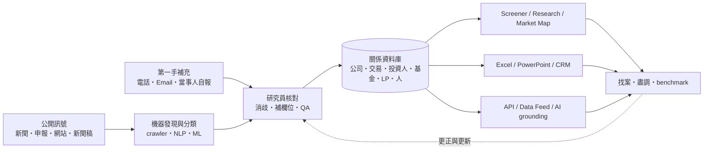
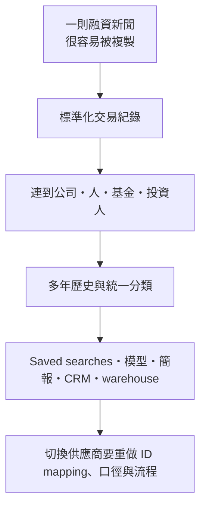
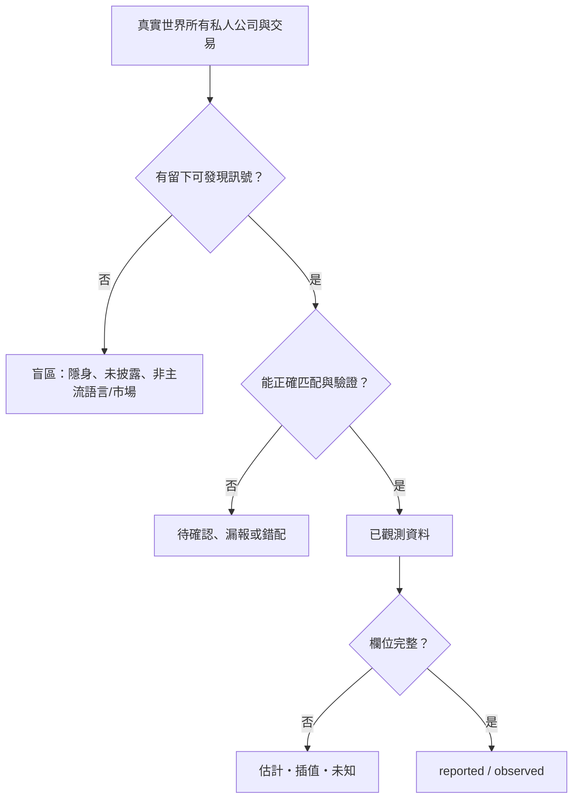
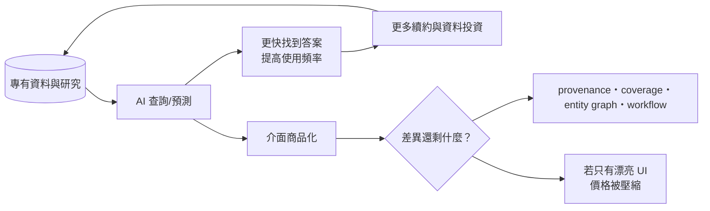

# PitchBook 研究 dossier：把不透明的私人市場做成工作流資料庫

- 研究日：2026-09-16
- 用途：B2B 產業情報子系列文章素材，不是文章草稿
- 研究方法：Groundlane `web_search` 找候選頁，`web_fetch` 逐頁讀取。PitchBook 官網多數頁面需 Groundlane browser challenge fallback；成功頁均記錄為完整、未截斷。SEC 頁面被 403 阻擋，未拿來承擔結論。

## 子問題

1. PitchBook 如何發現、蒐集、驗證並持續更新私人市場資料？
2. 誰付費，資料嵌入哪些高價值工作任務？
3. 產品與定價方式如何把資料變成訂閱、平台和直接資料收入？
4. Morningstar 為何收購 PitchBook，這門生意的財務規模與品質如何？
5. 資料網路效果、工作流與切換成本從哪裡來？
6. AI/ML 是產品加值、資料生產工具，還是替代威脅？
7. 哪些盲區、估計、延遲與選擇偏誤不能被「完整資料」的行銷語言遮住？

## 一句 ELI5

PitchBook 像是替私人市場做一本「會自己更新、還附關係圖的工商電話簿」：機器先從新聞、申報與網站撿線索，研究員再打電話、寄信、核對與補欄位；客戶付費不是為了讀一篇文章，而是為了少漏掉一家公司、少找錯一個人、少用一份過時比較表。

## 核心結論

1. **賣的不是新聞，而是被清洗並互相連結的實體資料。** 公司、交易、投資人、基金、LP、人員與服務商不是分開的文章，而是可篩選、追蹤、比較、匯出與串入內部系統的關係網。
2. **生產方式是 machine-first、human-verified，但不是「真相機器」。** 官方流程承認資料來自公開來源與當事人自報；ML/NLP 負責找與整理，專業團隊確認、補充與持續更新。這降低搜尋成本，不消除來源本身的遲報、漏報、錯報與策略性披露。
3. **付費理由是任務價值，不是單篇內容價值。** Deal sourcing、due diligence、benchmarking、fundraising、asset allocation、portfolio monitoring、business development 都可能直接影響數百萬美元決策，資料若能縮短工作時間或降低漏案風險，年度合約就有預算位置。
4. **護城河在歷史資料、關係結構與工作流嵌入的乘積。** 單筆融資新聞能被搜尋引擎抄走；多年實體消歧、歷史版本、基金績效口徑、動態清單、Excel/PowerPoint/CRM/API/Data Feed 才難搬。
5. **財務證據顯示它已不是小眾媒體。** 2016 年被收購時，PitchBook 過去 12 個月營收為 3,110 萬美元；2025 年 Morningstar 揭露 PitchBook 分部營收 6.718 億美元、調整後營業利益 2.101 億美元、調整後營業利益率 31.3%。但 2025 年營收增速降至 8.6%，企業客群尤其小型、用途較少的公司持續疲弱。
6. **AI 同時放大與威脅這門生意。** Navigator、Exit Predictor、Valuation Estimates 讓同一資料庫產生更多答案；Direct Data 又可替企業 AI 提供 grounding。反面是自然語言介面降低傳統 screener 的差異化，通用 LLM、客戶自建資料棧或競爭者若取得足夠資料，也會把 UI 價值壓縮到資料授權本身。

## 私人市場資料如何蒐集、驗證、產品化

### 官方可證的資料流水線

PitchBook 官方研究流程頁把資料來源分兩類：

- **Secondary research**：新聞、新聞稿等公開來源；搜尋摘要另明確列出監管申報、網站與其他公共來源，並稱使用超過 700 萬個 web crawlers。這個 crawler 數字本輪只有搜尋摘要，文章若要用必須標「官方搜尋摘要」或乾脆省略。
- **Primary research / Survey**：直接打電話或寄信給被追蹤實體相關人員，以補公開資料沒有的資訊。

高階流程為：發現提及某實體的來源 → 確認符合追蹤範圍 → 深入研究並建立 profile → 只要仍在範圍內就持續修訂。PitchBook 表示每一階段都有 QA，Data Operations 與 Product 團隊共同改進 ML/NLP 收集工具。

追蹤的實體包括：公司、投資人、有限合夥人（LP）、服務商、管理職人員與基金。關鍵不是「每一筆都獨立正確」，而是將跨來源提及消歧成同一實體，再把實體間的交易、投資與任職關係接起來。

### 從資料到可賣產品的四層

| 層 | 做什麼 | 客戶拿到什麼 | 不能誤解成什麼 |
|---|---|---|---|
| 原始訊號 | 爬公開頁、讀申報/新聞/新聞稿、直接訪談 | 候選事件與欄位 | 全市場完整母體 |
| 驗證與標準化 | 實體消歧、分類、補欄位、交叉檢查、QA | 可比較的公司/交易/基金 profiles | 所有數字都經審計 |
| 關係與時間 | 串公司、交易、投資人、LP、人員、服務商；持續更新 | 歷史軌跡與關係網 | 即時且無遲報 |
| 工作流產品 | screener、dynamic lists、Market Maps、研究報告、Excel/PowerPoint、CRM、API/Data Feed、AI | 找案、盡調、benchmark、簡報、監控與內部模型 | 只是一個內容網站 |

### 方法學揭露本身就是可信度產品

PitchBook 報告方法頁清楚承認並處理以下問題：

- 私人交易會延遲揭露，因此最近四季的 deal count 會依過去 24 個月在初次發布後四季內的增量估算；報告同時呈現原始與估計值。
- 某些 PE/M&A 未披露交易額會用多變量迴歸或估計矩陣外推；不同資料集可能一個含估計、一個只含已蒐集值，因此數字可能不一致。
- 基金報酬主要源自個別 LP 報告；同一基金不同 LP 會因費用折扣、承諾時間與共同投資而不同。缺失期間約 10% 會用直線插值（頁面所述當時口徑），分類也會隨新資料改變。
- VC deal count 同樣會隨 Data Operations 後續找到遲來交易而回修歷史數字。

這些不是小註腳，而是文章的重要反高潮：PitchBook 的價值不在「把不確定性消滅」，而在**把不確定性用一致方法記帳**。

## 誰付費，以及他們買的是哪個 job-to-be-done

PitchBook 官方列出的客群含 PE、VC、資產管理者、LP、投資銀行、信用市場參與者、企業與專業服務商；Morningstar 2024/2025 分部說明顯示核心成長來自 investor 與 advisor 客群（含 VC、PE、investment banks），企業客群尤其用途少的小公司較疲弱。

| 付款者 | 典型任務 | 願意付錢的原因 | 最容易流失的情境 |
|---|---|---|---|
| VC / PE | 找標的、看融資史與同業、找共同投資人、初步盡調 | 漏掉一個好案或錯估 comparables 的成本高 | 小基金交易少、只偶爾查公司 |
| 投資銀行 / 顧問 | 建 buyer/target list、precedent transactions、pitch deck、找聯絡人 | 壓縮 analyst 蒐集與簡報時間 | 已有 Capital IQ / FactSet 等整合棧且私人市場需求弱 |
| LP / 資產配置者 | 找 manager、比較基金績效、資產配置與曝險 | 私募基金報告分散，統一口徑難做 | 自有 GP 報告與顧問資料已足夠 |
| Corporate development / strategy | M&A sourcing、競品/市場地圖、策略夥伴 | 公司與交易關係可直接生成候選清單 | 用途單一、續約時難證明 ROI；2025 官方即指出此客群疲弱 |
| Credit investor | 私募信貸、槓桿貸款與高收益債資料/研究 | 交易結構與借款人資料需連動 | 只需要單一資產類別，可改買專門產品 |
| Data / quant / AI team | API、Data Feed、warehouse、CRM enrich、模型 grounding | 省去自行收集、消歧、更新與授權治理 | 能以較低成本建內部資料或找到可替代 feed |

## 產品與定價：能證的範圍

### 產品形態

- **PitchBook Platform**：搜尋、screeners、profiles、research、Market Maps、Analyst Workspaces、dynamic/static lists。
- **附屬工作流**：Mobile、Excel 與 PowerPoint plugins、Chrome extension；官方 pricing 頁稱這些隨完整平台提供。
- **Direct Data**：on-demand API 與定期 Data Feed；Feed 可用 `.dat`、`.csv`、Parquet 或 database tables，涵蓋 companies/deals/investors/funds。
- **CRM Integration**：官方 pricing 頁列為可能的 premium offering。
- **AI/ML**：Navigator、VC Exit Predictor、Valuation Estimates；另有 AI-powered data extraction/portfolio tracking（Lumonic 連結在 use-cases 頁）。

### 定價能寫與不能寫的界線

官方不公開固定牌價。能寫的是：

- 需聯絡業務取得個人化 quote。
- 價格依 seats、firm type 與 premium offerings（如 Direct Data、CRM Integration）而異。
- 2023 Morningstar 投資人答覆稱平台定價為 all-inclusive、每年檢視價格，會在新增價值最多處漲價；enterprise license 結構使「營收 ÷ user count」不能直接當單席價格，且 Direct Data 收入不計入 platform licensed users。
- Direct Data 官方說 API 可按需取資料、只為需要的資料付費，但沒有公開單價。

**不要寫第三方常見的「每年 US$X–Y」價格區間。** 本輪沒有可核對的一手合約或公開價目，且 enterprise 席次、資料 feed 與附加模組會使比較失真。

## Morningstar 收購與可查財務

### 收購（高風險數字，雙來源）

2016-10-14 PitchBook/Morningstar 官方新聞稿與其同步刊登的 PR Newswire 全文一致：Morningstar 當時已持有約 20%，預計支付約 1.8 億美元收購餘下權益（subject to working-capital adjustments），整體估值 2.25 億美元；PitchBook 保留品牌與由創辦人 John Gabbert 領導。當時 PitchBook 過去 12 個月至 2016-06-30 的營收是 3,110 萬美元、客戶超過 1,800 家、員工超過 300 人。GeekWire 當日報導獨立轉述同一交易與營收，但核心數字顯然源自新聞稿，因此是交叉確認發布內容，不算完全獨立原始證據。

### 分部財務

| 年度 | PitchBook 營收 | YoY | 調整後營業利益 | 調整後營業利益率 | 官方訊號 |
|---|---:|---:|---:|---:|---|
| 2024 | US$618.4m | 12.0%（organic 12.1%） | US$186.4m | 30.1% | licensed users 125,491（10-K 搜尋摘要）；年收入續約率約 107%，低於 2023 的 112% |
| 2025 | US$671.8m | 8.6%（organic 8.5%） | US$210.1m | 31.3% | direct data 小而成長快；corporate 尤其小型客戶疲弱；Q4 licensed users 近乎持平 |

來源為 Morningstar FY2024/FY2025 earnings releases。2024 user 與 renewal 數據來自 SEC 10-K 搜尋摘要，Groundlane 對 SEC 全文收到 403，因此若文章要保守，財務表可只用已完整讀取的 earnings release 數字；不要把 licensed user 當付費客戶公司數。

從 2016 TTM 的 US$31.1m 到 2025 的 US$671.8m，名目營收約為 21.6 倍。這是跨九年端點比值，不是同口徑 CAGR，也可能包含產品擴張、LCD 遷移與 Morningstar 資源，文章應避免寫成純有機成長神話。

## 資料網路效果、工作流與切換成本

### 不是傳統「使用者越多，產品自然越好」

PitchBook 有資料飛輪，但外部網路效果需要謹慎描述：

1. 更多來源與直接回報 → 發現更多實體/交易。
2. 更多已辨識實體 → 更容易將新新聞、申報與人員匹配到既有 profile。
3. 關係圖更完整 → screener、benchmark、Market Map 與模型更有用。
4. 客戶在工作中更常用 → 可能提交更正、更新 profile 或接受 primary research，回補資料。
5. 更多收入 → 投入 crawler、研究員、QA、方法學與全球覆蓋。

第 4 點是合理機制，但官方公開頁沒有量化「客戶回饋帶來多少資料」，必須標為推論，不能稱已證實的強網路效果。

### 真正的切換成本

- **查詢資產**：saved searches、dynamic/static lists、screen criteria 與 alert habits。
- **輸出資產**：Excel models、PowerPoint templates、Market Maps、研究報告引用。
- **內部整合**：CRM enrichment、API endpoint、Data Feed schema、warehouse tables、entity IDs。
- **組織共同語言**：投資團隊用同一公司/基金/交易 ID、分類與 benchmark 口徑討論。
- **歷史可比性**：換供應商後，分類、估計規則與回修歷史不一致，時間序列可能斷裂。

Morningstar 2023 投資人答覆直接把 companies、deals、investors、funds、LPs、people、service providers 的 interconnectivity 視為客戶價值；2025 direct data 成長也支持「資料離開網頁、進入內部系統」是更深的黏著層。但「因此客戶無法離開」仍是推論；官方同時揭露 corporate churn，證明弱用途客戶仍會走。

## AI / ML：功能、優勢與威脅

### 已推出且可證的功能

| 功能 | AI 做什麼 | 底層資料/限制 | 商業意義 |
|---|---|---|---|
| 資料生產 ML/NLP | 從大量來源整理訊號、濾掉無關內容，協助 research ops | 最終仍需研究團隊確認；來源可能公開或自報 | 降低每筆資料收集成本，擴大覆蓋 |
| Navigator | 自然語言問答、摘要、找趨勢、生成 company/deal screeners，連回 PitchBook 原始來源 | 官方稱 AI+HI，價值依賴自家 data/research | 把複雜 screener 變成聊天入口，提升 adoption |
| VC Exit Predictor | 依公司、交易與投資人特徵預測 IPO/M&A/no exit 與 opportunity score | 僅納入過去六年至少兩輪 VC、目前仍受 VC backing 的公司；官方稱 12,000 公司測試準確率 75%，但未見外部重現 | 將歷史資料包成決策訊號，不只賣 records |
| Valuation Estimates | ML 結合私募/公開市場、capital structure、comparables、員工成長與公司年齡，每日更新估值 | 2026 首發覆蓋逾 15,000 家 VC-backed companies；是模型 signal，不是交易成交價或審計估值 | 進入 portfolio monitoring、風險、定價與流動性規劃 |
| Direct Data for AI | API/feed 作企業模型 grounding source | 品質仍受底層 coverage 與 licensing 約束 | 從人類 UI 席次擴張到機器用量/資料授權 |

### 威脅與反論

- **介面商品化**：自然語言能取代部分 screener 教學與 UI 優勢；競爭最後回到資料品質、來源權利與 entity graph。
- **客戶自建**：大型基金、銀行或顧問可把公開申報、專有 deal flow 與多家 feeds 放入自家 lakehouse/LLM，降低單一平台依賴。Morningstar 風險揭露也列出 vendor consolidation 與客戶用 in-house products/services 替代的可能。
- **模型放大資料錯誤**：單一錯誤 record 在聊天回答、valuation 或 exit probability 中看起來更確定；可追溯來源與人工覆核比漂亮答案更重要。
- **訓練/授權競爭**：PitchBook 可向 LLM 提供 grounding，但若 Essential connector、公開報告或其他供應商已足以回答一般問題，高價席次只能靠專業深度與 workflow 證明價值。
- **反向優勢**：通用 LLM 並沒有自動取得合法、即時、標準化私人資料；AI 越普及，乾淨且有 provenance 的封閉資料反而更能收授權費。

## 失敗、限制與資料盲區

### 1. 公開與自報資料的結構性盲區

PitchBook 自己說研究基於公開與自報資料。隱身、未募資、未發新聞稿、沒有監管申報或刻意不披露的公司/交易，天生更難被看見。這造成 survivorship、visibility、geography、institutional-financing bias：被專業投資人投過、較常發英文新聞、監管透明度較高的市場較易進庫。

### 2. 延遲與回修

近期季度永遠較不完整，deal count 會在後續四季補進；若只截取某日快照，會把「尚未被發現」誤當活動下降。文章應教讀者區分 reported 與 estimated，並記錄資料抓取日。

### 3. 估計不是觀測

未披露 deal value、late reporting count、基金缺失期間與每日 private-company valuation 都可能由模型、插值或外推補齊。PitchBook 方法頁有揭露，但下游使用者匯出後可能丟掉旗標。任何圖表都應分色：reported / estimated / interpolated。

### 4. 定義會改，供應商間不完全可比

基金分類、交易納入、stage、地理與 exit 定義都有自家規則，且會調整。PitchBook 自己也說新基金與分類改動會改變 vintage 統計。不同資料商數字不同，不一定是某一家錯，可能是 universe 與方法不同。

### 5. 學術研究指出 coverage 可能有地域偏差

2015 年比較商業 PE datasets 的工作論文搜尋摘要指出，PitchBook 在北美外 coverage 較小，較不能代表北美外整體趨勢；2020 Journal of Business Ethics 論文則轉述既有研究：北美 coverage 與其他 PE databases 類似、區域外有所差異。本輪前者 PDF 被 Groundlane 以原始二進位回傳，後者正文抽取被參考文獻擠壓且截斷，因此這項只能寫成「較早研究曾指出」，不能外推到 2026 現況。

### 6. 使用權與匯出限制也是產品限制

Stanford 商學院圖書館 2026 guide 顯示 academic access 每日只能匯出 10 Excel rows、每月 24 rows，並警告不得 scraping/用 browser plugins 或 LLM 收集資料。這是該校 academic license 條款，不代表商業 enterprise 合約都一樣；但它說明「能看」不等於「能批次帶走」，資料可攜性取決於合約與 Direct Data。

### 7. 已知商業逆風

2025 年 PitchBook 營收增速由 2024 的 12.0% 放緩到 8.6%；Q4 licensed users 大致持平，官方點名 corporate segment 尤其小型、limited-use-case firms 的 churn/疲弱。這反證「資料庫越大就自動續約」：若產品沒有高頻、高價值任務，切換成本不夠。

## 高風險事實交叉表

| 事實 | 來源 1 | 來源 2 | 狀態 |
|---|---|---|---|
| 2016 Morningstar 已持約 20%，付約 US$180m 買其餘股權，估值 US$225m | PitchBook/Morningstar 官方新聞稿全文 | PR Newswire 同步全文；GeekWire 當日報導 | ✅ 兩個全文頁，但後兩者核心資料源自官方公告 |
| 2016 TTM revenue US$31.1m、客戶逾 1,800 | 官方新聞稿全文 | PR Newswire 全文、GeekWire 報導 | ✅ 同上，非兩套獨立帳簿 |
| 2024 PitchBook revenue US$618.4m、adjusted operating margin 30.1% | Morningstar FY2024 earnings release 全文 | FY2025 release 比較欄重列 2024 | ✅ 兩份不同期官方財務發布 |
| 2025 PitchBook revenue US$671.8m、adjusted operating income US$210.1m、margin 31.3% | Morningstar FY2025 earnings release敘述 | 同頁 supplemental segment table | ✅ 同一權威一手內交叉；未另取 10-K 全文 |
| 私人交易存在遲報，最近四季 deal count 使用估計並後續回修 | PitchBook methodology 全文（PE/M&A） | 同頁 VC methodology 獨立段落 | ✅ 同一官方方法頁、多資產類別一致；屬方法事實 |
| Exit Predictor 75% accurate on 12,000-company test | PitchBook help 全文 | 無外部重現或技術 paper | ⚠️ 僅官方自評，文章必須標明測試口徑與來源 |
| 北美外 coverage 歷史上較弱 | 2015 comparative paper 搜尋摘要 | 2020 peer-reviewed article 的相關敘述/摘要 | ⚠️ 年代久、全文讀取不完整，不可當現況定論 |

## 推論（不得冒充官方事實）

| 推論 | 依據 | 可能錯在哪 |
|---|---|---|
| PitchBook 的護城河主要是 entity graph + history + workflow，不是文章 | 官方強調 interconnected datasets；產品含 saved lists、plugins、CRM、API/feed；direct data 成長 | 競爭者可能同樣具備，未比較實際重疊率與品質 |
| Direct Data 的 revenue quality 可能高於單純 seats | 嵌入 warehouse/CRM/AI，替換需改 schema 與 downstream models | 合約可能按量、客戶也能平行接多家 feed；沒有 retention 分產品資料 |
| AI 會壓縮 UI 溢價但提高資料授權價值 | Navigator 把查詢聊天化；PitchBook 推 AI grounding/API | 通用模型若用公開資料達到「夠好」，整體價格也可能被壓低 |
| Corporate weakness 是 low-frequency use case 的訊號 | 2024/2025 官方反覆點名小型企業、用途有限 | 也可能是宏觀預算、銷售執行或方案設計，不能只歸因頻率 |
| 方法學透明度本身是 B2B 信任產品 | 官方詳列估計、插值、定義與回修 | 公開方法不等於資料逐筆可稽核，仍需 provenance/flags |

## ELI5 與圖表構想

### ELI5 1：拼一張全班座位表

老師只拿到零散線索：一張活動照片、一份點名表、幾個同學自己填的資料。機器先猜「照片裡的 Amy 是否就是點名表的 Amy」，研究員再核對。最後不只知道 Amy 是誰，還知道她坐誰旁邊、加入哪個社團、何時轉班。PitchBook 的價值就是把「一堆線索」變成「能查關係的座位表」。

### ELI5 2：氣象預報，不是監視器

私人交易不像股票逐筆公開，更像看不到全部天空的氣象站。最近一季的暴雨通報還沒收齊，所以 PitchBook 會根據過去遲報模式估計；幾季後再修正。讀者看到的不是全知監視器，而是有方法、有回修紀錄的預報。

### Mermaid 1：資料煉油廠（主圖）

圖說必須加：回饋箭頭是合理推論，官方沒有公開量化貢獻。

### Mermaid 2：從「一則新聞」到切換成本

### Mermaid 3：資料盲區漏斗

### Mermaid 4：AI 的雙面刃

### 比較表構想：不是「誰資料最多」，而是買哪一層

| 選項 | 適合任務 | 優勢 | 盲點/成本 |
|---|---|---|---|
| Google/新聞搜尋 | 查單一已公開事件 | 免費、即時 | 無統一 entity、歷史口徑與批次比較 |
| Crunchbase 類開放/廣泛資料庫 | startup discovery、輕量 BD | 易用、較低進入成本 | 深度、基金/LP/交易與方法可能不足；文章需另研後才具名比較 |
| PitchBook | 專業 deal/fund workflow、benchmark、機器整合 | 關係資料、歷史、研究、plugins/API/feed | 高價、合約限制、私人資料仍有盲區/估計 |
| 自建 data stack | 有專有 deal flow 的大型機構 | 可合併內部真實資料、客製口徑 | 收集、消歧、維護、授權與人力昂貴 |

## 建議文章骨架

1. 冷開場：兩位 analyst 都看到同一則融資新聞，為何一家銀行仍願意買資料庫？
2. ELI5「全班座位表」：新聞不是產品，連起來的關係才是。
3. 資料煉油廠 Mermaid：crawler/ML → research/QA → entity graph → workflows。
4. 誰付錢：用 job-to-be-done 表串 sourcing、diligence、benchmark、fundraising。
5. Morningstar 收購：2016 US$31.1m TTM / US$225m valuation → 2025 US$671.8m revenue、31.3% adjusted margin。
6. 切換成本：saved searches 到 API/feed，不用空泛寫「network effects」。
7. AI 雙面刃：Navigator/Exit Predictor/Valuation Estimates/grounding；同時壓縮 UI。
8. 反高潮：估計、插值、遲報、地理與可見性偏誤；它賣的是一致處理不確定性，不是全知。
9. 結尾判斷：PitchBook 已從「賣內容」走到「賣決策工作流的資料底座」。

## 來源清單與逐頁 evidence log

訪問日均為 2026-09-16。

| URL / 頁名 | 來源角色 | 可支持主張 | 讀取完整度 / Groundlane 證據 | 日期 |
|---|---|---|---|---|
| [PitchBook research process](https://pitchbook.com/help/pitchbook-research-process) | A 官方一手 | secondary/primary research、profile lifecycle、QA、ML/NLP、追蹤實體 | ✅ 全文；status 200；browser/local；`truncated:false`；challenge fallback | 頁面未標發布日 |
| [Research-process landing](https://pitchbook.com/research-process) | A 官方一手 | crawler/ML/100 processes 等候選主張 | 🔴 fetch challenge 失敗；只看搜尋摘要，不承擔核心結論 | 未標 |
| [PitchBook Report Methodologies](https://pitchbook.com/news/pitchbook-report-methodologies) | A 官方一手 | fund returns來源、插值、deal count/value estimates、定義與回修 | ✅ 全文；status 200；browser/local；`truncated:false` | 未標 |
| [Use cases](https://pitchbook.com/use-cases) | A 官方一手 | market intelligence、sourcing、execution、networking、diligence、fundraising、benchmark、BD、allocation、portfolio | ✅ 全文；status 200；browser/local；`truncated:false` | 未標 |
| [Pricing](https://pitchbook.com/pricing) | A 官方一手 | quote-based、seat/firm type/premium offerings、bundled apps/plugins、datasets | ✅ 全文；status 200；browser/local；`truncated:false` | 未標 |
| [Direct Data](https://pitchbook.com/products/direct-access-data) | A 官方一手 | API、feeds、formats、warehouse/CRM/AI grounding、按需資料 | ✅ 全文；status 200；browser/local；`truncated:false` | 未標 |
| [Morningstar investor Q&A: pricing philosophy / revenue per license](https://shareholders.morningstar.com/investor-resources/investor-qa/qa-details/2023/PitchBook-has-a-much-lower-revenue-per-license-compared-to-many-similar-peer-products--How-do-you-plan-to-charge-for-the-value-you-provide-as-the-leader-in-private-company-data-Would-you-consider-10-02-2023/default.aspx) | A 官方一手 | enterprise license variability、Direct Data 不在 user counts、annual pricing review、all-inclusive、interconnected data | ✅ 全文；status 200；http/direct；`truncated:false` | 2023-10-02 |
| [Navigator](https://pitchbook.com/products/navigator) | A 官方一手 | natural-language search、answers linked to sources、trend discovery、screeners、AI+HI | ✅ 全文；status 200；browser/local；`truncated:false` | 搜尋結果標 2025-10-29；頁面無清楚發布日 |
| [VC Exit Predictor](https://pitchbook.com/help/understanding-vc-exit-predictor) | A 官方一手 | eligibility、features、outputs、12k test/75% claim | ✅ 全文；status 200；browser/local；`truncated:false`；準確率僅自評 | 未標 |
| [Valuation Estimates launch](https://newsroom.morningstar.com/news/news-details/2026/PitchBook-Introduces-the-First-Daily-Valuation-Model-for-VC-Backed-Companies-2026-4N_6EX26f2/default.aspx) | A 官方一手 | >15k coverage、daily update、inputs、workflows、future plans | ✅ 全文；status 200；http/direct；`truncated:false` | 2026-02-11（搜尋結果） |
| [2016 acquisition announcement](https://pitchbook.com/media/press-releases/morningstar-to-acquire-pitchbook-data) | A 官方一手 | 20%/US$180m/US$225m、TTM revenue、clients、staff、strategic rationale | ✅ 全文；status 200；browser/local；`truncated:false` | 2016-10-14 |
| [PR Newswire acquisition release](https://www.prnewswire.com/news-releases/morningstar-to-acquire-pitchbook-data-agreement-will-combine-leading-providers-of-public-and-private-company-research-300345025.html) | B 同步發布的一手稿 | 收購與當時財務/客戶數交叉 | ✅ 全文；status 200；http/direct；`truncated:false` | 2016-10-14（頁面 metadata；搜尋顯示日期錯置） |
| [GeekWire acquisition report](https://www.geekwire.com/2016/morningstar-agrees-buy-remaining-stake-venture-capital-data-provider-pitchbook-180-million/) | C 高品質二手 | 收購、當時競爭與客戶背景 | ✅ 全文；status 200；http/direct；`truncated:false` | 2016-10-14 |
| [Morningstar FY2024 results](https://newsroom.morningstar.com/news/news-details/2025/Morningstar-Inc--Reports-Fourth-Quarter-Full-Year-2024-Financial-Results/default.aspx) | A 官方財務發布 | 2024 PitchBook revenue/profit/margin、licensed-user growth、client segment signals | 🟡 內容主體與 segment/supplemental 表已讀，但工具輸出標 `truncated:true`；所用段落在截斷前完整出現 | 2025-02-26 |
| [Morningstar FY2025 results](https://newsroom.morningstar.com/news/news-details/2026/Morningstar-Inc--Reports-Fourth-Quarter-Full-Year-2025-Financial-Results/default.aspx) | A 官方財務發布 | 2025 PitchBook revenue/profit/margin、direct data、corporate softness、Q4 users | ✅ 全文；status 200；http/direct；`truncated:false` | 2026-02-12 |
| [Morningstar 2024 10-K on SEC](https://www.sec.gov/Archives/edgar/data/1289419/000128941925000041/morn-20241231.htm) | A 法定申報 | licensed users、renewal rate、segment description | 🔴 Groundlane fetch status 403；只保留搜尋摘要，文章不宜依賴 | filed 2025 |
| [Stanford GSB PitchBook guide](https://libguides.stanford.edu/pitchbook) | C 機構使用指南 | screener/list/Market Map workflows、academic export limits、anti-scraping terms | ✅ 全文；status 200；http/direct；`truncated:false` | 頁面/搜尋標 2026-07-11 |
| [NBER: Venture Capital Data—Opportunities and Challenges](https://www.nber.org/papers/w22500) | A/B 學術一手 landing | 論文身份與 DOI；selection-bias 候選來源 | 🟡 landing 全文只有 citation；未讀 paper 全文，不能承擔細節 | 2016 |
| [What Do Different Commercial Data Sets Tell Us About Private Equity Performance? PDF](https://www.kenaninstitute.unc.edu/wp-content/uploads/2017/03/PERC_datasets_12-5-2015.pdf) | B 學術 working paper | datasets coverage 差異、北美外歷史偏差 | 🔴 Groundlane 回原始 PDF bytes，未成功解析；只看搜尋摘要 | 2015 working paper |
| [Information Asymmetries in Private Equity](https://link.springer.com/article/10.1007/s10551-020-04558-6) | A peer-reviewed article | PitchBook sample、既有 coverage 研究轉述 | 🟡 metadata/abstract與大量 references 已讀，但抽取正文不完整且 `truncated:true` | 2020-06-27 |
| [Old PitchBook valuation-estimate critique](https://pitchbook.com/blog/how-accurate-are-estimated-private-company-valuations) | A 官方歷史文章 | 2016 曾認為簡化估值模型不足的候選對照 | 🔴 browser challenge 失敗；只看搜尋摘要，不在結論中使用 | 2016-01-27 |

## 待解問題 / 寫作前最後檢查

- 若要使用 125,491 licensed users、107% revenue renewal rate，需另取得 2024 10-K 可讀全文或 Q4 shareholder letter；目前只有搜尋摘要。
- 若要宣稱現況仍有北美外 coverage 劣勢，需找 2024–2026 的獨立資料集比較；2015/2020 證據太舊。
- Exit Predictor 的 75% 不是可直接比較的 accuracy：需知道 class balance、holdout 時間、precision/recall、是否避免 look-ahead bias。沒有技術文件就只作官方產品主張。
- 2026 Valuation Estimates 與 2016「estimated valuations 不具意義」可能形成好故事，但舊頁未成功全文抓取；除非補齊，勿寫「PitchBook 自打臉」。
- 「100,000 clients worldwide」在 2026 Valuation Estimates 新聞稿可能把 clients/professionals 混用，且與 licensed users/公司客戶概念不一致，本文不採用。
- 文章比較 Crunchbase/Preqin/CB Insights 前，需要各自獨立 dossier；本檔比較表只使用類型，不下未研究的勝負判斷。
