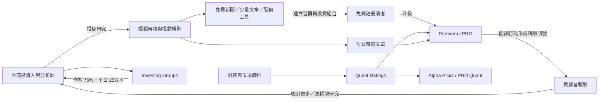
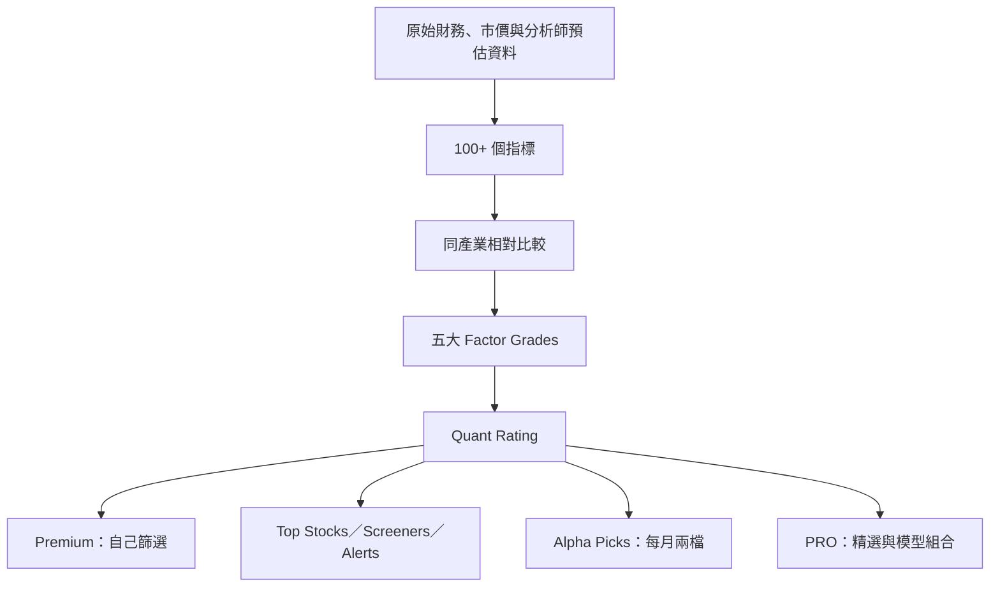
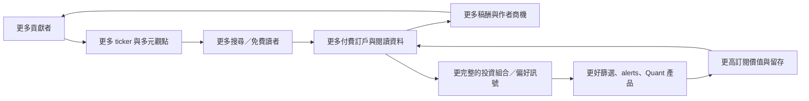

# Research: Seeking Alpha——把群眾觀點變成訂閱、資料產品與雙邊市場

- 研究日期：2026-09-16（Asia/Taipei）
- 研究用途：「內容販售商業模式拆解」之 B2B／投資情報子系列文章材料
- 工具路徑：Groundlane `web_search`（主要由 Brave、You、Keenable、Parallel provider 回傳候選）→ Groundlane `web_fetch` 讀取全文。未使用平台 Web、Playwright、legacy fetch 或其他 fallback。
- 研究邊界：Seeking Alpha 是私人公司，沒有可核對的公開財報；本 note 不把第三方營收估值當公司實績。

## 子問題

1. Seeking Alpha 如何吸引、篩選並支付大量外部貢獻者？
2. 免費帳號、Premium、PRO、Alpha Picks、Investing Groups 分別賣什麼，對應哪些客群？
3. Quant Ratings 如何把文章平台升級成可重複使用的資料／決策產品？
4. 內容供給、讀者、訂閱收入與作者誘因如何形成雙邊飛輪？
5. 群眾研究的品質、利益衝突與假名作者風險如何治理？
6. AI 對它是成本工具、產品功能，還是會侵蝕內容差異化的風險？

## 一句話結論

Seeking Alpha 不是單純「付費文章網站」：它先以外部投資人供稿取得廣覆蓋，再用編輯、揭露與社群回饋治理品質，接著把同一批受眾向上銷售全文訂閱、Quant Ratings、精選投資組合與作者經營的私密社群。真正較難被複製的，不是單篇文章，而是「大量觀點＋讀者行為＋市場資料＋可比較評級」疊成的決策介面。

## 可直接供文章使用的 ELI5 解釋

把 Seeking Alpha 想成一座「投資人的夜市」：

- 攤商（貢獻者）帶來各自的股票研究，不必全由平台聘為員工。
- 市場管理員（編輯）決定哪些攤能進場，要求標示自己是否持股、禁止收公司錢偷偷叫賣。
- 免費訪客先看新聞、股價與少量試吃；認真研究的人買 Premium。
- 不想自己逛完整個夜市的人，買 PRO 或 Alpha Picks，付錢讓平台先篩過。
- 喜歡某位攤商的人，可加入其 Investing Group；平台提供收款、曝光與社群空間並抽成。
- Quant Ratings 像每個攤位旁統一格式的「營養標示」：把不同股票用相同指標比較，降低讀者逐篇消化文章的成本。

### 建議 Mermaid：商業模式總圖

＊75/25 來自 2017 年官方條款，頁面仍在線，但未找到獨立來源證明 2026 年實際結算仍完全相同，文章中須加日期限定。

## 1. 貢獻者供給、編輯與支付機制

### 供給從哪裡來

- 官方 About 頁把平台定位為「投資人提供給投資人的研究」，與傳統研究機構聘僱固定分析師相對。投稿先由專業編輯依品質與合規標準決定是否刊登。
- 官方稱歷年有 18,000+ 位分析者貢獻；現行 About 頁另稱每月 5,000+ 篇分析、每季覆蓋 8,000–10,000 個 ticker。這些是公司自報的規模數字，未找到同期間獨立稽核。
- 投稿計畫對所有人開放；exclusive 文章可獲支付，non-exclusive 可同步發在其他平台但不獲支付。
- exclusive 的交換條件很強：Seeking Alpha 是線上與線下唯一出版者；作者僅能在別處放最多 250 字、且不超過全文三分之一的摘要並回鏈，不能放圖表；連翻譯版也被條款視為衍生作品而受限制。

### 平台怎麼付一般文章

現行 Article Payments 官方頁列出兩層：

1. **稀缺覆蓋固定獎金**：近 30 天少於兩篇、符合市值與瀏覽門檻的 undercovered ticker 為 US$45，最久未覆蓋可到 US$65；符合條件的首次美股覆蓋可為 US$85；IPO 首次覆蓋另為 US$65。頁面標示部分資格於 2025-07-14 更新。
2. **付費讀者消費分潤**：平台每月設總預算，再為每位 Premium／PRO 訂戶分配一個「預算」，依該訂戶當月閱讀各作者文章的比例分配。官方只說「越多不重複付費訂戶閱讀，賺得越多」，沒有公開每次閱讀單價。

這不是單純按 pageview 付費。它把作者誘因從「吸引所有免費點擊」改為「讓付費訂戶真的讀」，同時用 undercovered bonus 補足長尾股票的供給缺口。

付款細節：月底結算，累積滿 US$100 才支付，通常在月底後 30 個工作日內；未領收益 12 個月後失效。這些均為官方制度說明，未找到獨立薪資資料可驗證作者實收分布。

### Investing Groups 的作者分潤

- 2017-12-31 更新的官方 Contributor Terms 寫明：Marketplace Premium Authors 自訂年價，平台取已收訂閱收入 25%，作者得 75%，按月依訂期攤銷；未使用月份退款也套用同一比例。
- 作者保有其 premium publication 內容著作權；但 Seeking Alpha 表明不審查、編輯或策展 Premium Authors 在訂戶社群內發布的內容。
- 這造成兩層治理：公開分析文章有平台編輯；作者私域社群的內容責任更偏向作者本人。

### 建議比較表：三種供給合約

| 供給形式 | 是否可在別處全文發表 | 平台是否編輯 | 作者收入 | 平台得到什麼 |
|---|---:|---:|---|---|
| Exclusive 公開分析 | 否 | 是 | 固定稀缺獎金＋付費訂戶閱讀分配 | 獨家內容、SEO／訂閱轉換材料 |
| Non-exclusive 公開分析 | 是 | 是 | 無 | 免費增加覆蓋與討論 |
| Investing Group 私域內容 | 依服務條款 | 官方條款稱不策展 | 2017 條款為訂閱淨收 75% | 2017 條款為 25% 平台費、留存與網路效應 |

## 2. 免費與訂閱產品、客群與定價

### 產品梯子

| 層級 | ELI5：替使用者省下什麼 | 官方列出的核心內容 | 主要客群 | 可核價格（2026-09-16 查詢） |
|---|---|---|---|---|
| Basic | 免費看市場在發生什麼 | breaking news、即時股價、portfolio／watchlist／alerts、每月一篇 Premium 試讀 | 偶爾查行情、尚未付費者 | 免費 |
| Premium | 不必被文章牆與資料牆切斷 | 全部分析文、Quant Ratings、Top Stocks、同步／客製投資組合、Health Check、alerts、screeners、AI summaries／assistant | 主動研究的個人投資人 | 官方 renewal 頁：US$299/年；訂閱搜尋結果亦顯示新客 US$4.95 首月後 US$299/年 |
| PRO | 不想在大量研究裡自己篩選 | Premium 基礎上由 PRO 編輯選出的頂尖分析、idea generation、精選／較稀缺研究 | 管理較大部位、時間成本較高的專業或重度投資人 | 官方 landing-page 搜尋結果：US$99 首月後 US$2,400/年；主頁動態內容未成功完整抽取，刊文前宜再核 |
| Alpha Picks | 不想自己研究，直接收到固定節奏候選 | 量化系統每月兩檔選股，rating 轉 Sell 時通知 | 偏好「答案」而非研究工具的個人投資人 | **官方衝突**：價格更新頁寫 US$399/年；bundle help 頁以 US$499/年計算 |
| Investing Groups | 想跟著特定作者與同好長期互動 | 特定策略／領域的私密內容、直接聯絡、社群 chat；Basic 方案可每週 1–2 個 picks | 信任特定作者或策略的利基族群 | 各作者自訂；不宜寫單一統一價 |

### 價格衝突（文章必須保留）

- `premium-subscription-price-update`：Premium renewal US$299/年。
- `alpha-picks-subscription-price-update`：Alpha Picks renewal US$399/年。
- `how-does-the-bundle-work`：bundle 首年 US$718，並稱 Premium US$299＋Alpha Picks US$499＝US$798。

三頁都是官方且目前可讀，因此不能把 Alpha Picks 寫成單一「現價」。較安全寫法是：「官方頁面在查詢日同時出現 US$399 與 US$499 的續訂／拆售口徑；實際結帳價依使用者方案與結帳頁為準。」

### 收入與公司財務

- 沒有可靠公開財報可證 Seeking Alpha 的營收、訂戶數或各產品收入占比。
- 2021 年 Talking Biz News 轉述 CEO David Jackson：公司將停止第三方廣告；他稱廣告由 2019 年底約 70% 收入降至當時約 25%，訂閱 ARR 於 2020 年成長 169%、2021 年成長逾 80%，且公司可只靠訂閱保持獲利。這是具名 CEO 說法的二手轉述，不等於經審計財報，且不應外推為 2026 結構。
- Growjo、ZoomInfo、LeadIQ 等估算彼此差異巨大，方法也不透明，本 note 不採用其營收數字。

## 3. Quant Ratings 與資料產品

### 它把什麼變簡單

一篇文章只能回答「某位作者怎麼看某檔股票」。Quant Ratings 試圖回答另一個問題：「如果所有股票都用同一把尺，這檔相對同業排在哪裡？」

官方方法頁說明：

- 每檔股票使用 100+ metrics，與同 sector 股票比較。
- 聚合成 Value、Growth、Profitability、Momentum、EPS Revisions 五項 factor grades（A+ 到 F）。
- 再加權成 1.0–5.0 與 Strong Sell／Sell／Hold／Buy／Strong Buy。
- Ratings 每日開盤前更新；歷史頁顯示 rating 與因子變化。
- 官方稱市場資料來自 S&P Capital IQ／Compustat，回測工具為 S&P 的 ClariFi。
- 2018 年收購 CressCap Investment Research，創辦人 Steven Cress 加入負責 quant strategies；這是由內容平台向資料模型產品跨出的能力取得。

### 產品化階梯

商業上的關鍵不是「多一個分數」，而是同一套計算能在 symbol page、screener、portfolio warning、Top Stocks、Alpha Picks、PRO 反覆販售。文章是一次性閱讀，rating 是可嵌入工作流程的基礎設施。

### 回測限制

官方 Quant Sell 頁自己列出重要限制：回測／模擬不是可直接投資產品；假設等權、每日再平衡、無交易成本；歷史績效不保證未來。官方稱已盡力處理 survivorship、restatement、split、look-ahead biases 並月度稽核，但完整模型權重與可重現資料未公開。文章不能把官方 backtest 當獨立驗證，也不應使用「證明一定有效」。

## 4. 雙邊市場飛輪

### 建議 Mermaid：兩個互相咬合的飛輪

可寫成三層護城河：

1. **供給廣度**：外部作者讓平台能覆蓋傳統 sell-side 不願覆蓋的長尾 ticker；稀缺稿酬直接修補供給缺口。
2. **需求聚合**：大量讀者讓作者能取得曝光、稿酬與付費社群客戶，降低作者自建獲客漏斗的成本。
3. **資料回饋**：付費讀者實際閱讀、watchlist 與 portfolio 使用，讓平台知道哪些題材與工具有價值；但官方沒有公開這些行為資料如何進入推薦或模型，這部分只能標 `[推論]`。

## 5. 品質治理、失敗與限制

### 官方治理機制

- 公開分析須經編輯審核；事實、數字與引言要連到來源。
- 作者必須揭露目前持有或計畫建立的文中證券部位；與公司／基金的 business relationship 也必須揭露。
- 第三方付費研究或付費 coverage 禁止；違反者可能失去投稿資格。
- 假名作者可對外匿名，但平台稱會驗證真實姓名與聯絡資料，且同樣要求持倉揭露。
- microcap、biotech、short idea 有額外規則；指控會計或管理層不當的 short idea，須先給公司至少 24 小時回應並在文中呈現回應或未回應。
- 公開分析禁止用 AI 產生、改寫或潤飾文字；抄襲處分由停權六個月至永久禁稿。

### 已知失敗案例：揭露規則不等於真實揭露

- SEC 2017 press-release 搜尋結果稱，監管機關對 27 個個人／實體採取行動，涉及在投資研究網站把有償股票宣傳包裝成獨立分析；Groundlane 抓 SEC 原頁時遇到 403 rate threshold，因此僅讀到搜尋摘要，列為 🟡。
- Seeking Alpha 自己針對該事件的文章搜尋摘要承認 SEC 所引許多文章曾刊在 Seeking Alpha，並稱採零容忍、永久禁稿與向 SEC 報告；全文遭 403／captcha，列為 🟡。
- Bloomberg 的搜尋摘要也報導 SEC 指控 conflicted articles 出現在 Seeking Alpha 與其他網站；未抓全文，僅作候選二手來源。

安全結論：**平台可以要求揭露，卻無法只靠作者勾選表單保證沒有隱藏報酬。** 這個事件支持討論群眾供稿的結構性治理成本，但不能寫成 Seeking Alpha 本身被 SEC 判定違法；目前材料未證明該公司被法院或 SEC 判負責。

### 其他限制

- **品質變異**：群眾研究的優點是觀點與覆蓋廣，代價是作者能力、方法與利益不同。編輯把關只能篩掉明顯不合格，不能保證投資結論正確。
- **匿名與問責取捨**：假名能保護批評者、增加研究供給，也提高讀者判斷作者背景與利益關係的成本。
- **作者誘因偏移**：付費訂戶閱讀分配比純點擊好，但仍可能鼓勵熱門 ticker、強烈標題或高頻產出；undercovered bonus 只是局部修正。
- **模型不透明**：Quant 公開因子類別與資料來源，但沒有足夠細節讓外部完整重建權重與回測。
- **同站資訊漂移**：價格頁彼此衝突、2017 Marketplace 條款仍在線，說明文章必須標查詢日，不能把所有官方頁都視為同步更新的單一真相。
- **非投資顧問**：官方反覆聲明內容與工具僅供資訊用途，平台不是 broker、US investment adviser 或 investment bank；作者亦可能沒有專業執照。

## 6. AI：機會、矛盾與風險

### 已經在做什麼

- 官方禁止外部作者在 analysis articles 使用 AI 產生、改寫或潤飾文字，理由可理解為守住 human-only 內容差異化。
- 同時，平台自己使用 machine learning 與商業 LLM 產生 Virtual Analyst／summary reports；官方明示這些報告沒有編輯策展或覆核，可能有錯，準確性、完整性與時效性不保證。
- Premium 產品頁搜尋結果也列出 AI-powered research assistant、AI Summary Reports 與 Earnings Calls Insights。

這不是單純矛盾，而是「原創判斷」與「壓縮／介面」的分工：人類作者提供難以標準化的投資 thesis，平台用 AI 把大量材料變得更易檢索與掃讀。但若摘要足以取代原文，作者價值與閱讀分潤可能被平台自己的 AI 介面稀釋。

### 主要 AI 風險

1. **內容商品化**：通用 LLM 能總結財報、earnings calls 與公開文章，降低「資訊整理」本身的付費意願。
2. **零點擊／獲客風險**：AI 搜尋若直接回答，免費文章帶來的新讀者可能下降；Seeking Alpha 擁有直接帳號、alerts、newsletter 與 app，緩衝比純 SEO 媒體強，但流量依賴程度未公開。
3. **作者供給被壓價**：AI 可大量生成看似合理的股票稿，增加審核成本；全面禁 AI 是品質定位，也是供應鏈驗證成本。
4. **平台內部替代**：AI summaries 可能讓訂戶不再打開作者全文，若稿酬依「閱讀文章」分配，作者與平台的產品目標可能不完全一致。這是 `[推論]`，官方未公開 AI 摘要如何計入作者報酬。
5. **錯誤責任**：官方承認 AI 報告未經編輯且可能出錯；在投資場景，錯誤的時間敏感資訊風險高於一般內容摘要。
6. **資料權利與授權成本**：Quant 依賴 S&P 授權資料；AI 功能同時涉及第三方資料、作者內容與模型供應商，權利鏈更複雜。現有公開材料不足以判斷模型是否／如何訓練於作者內容。

### AI 時代較耐打的資產

| 資產 | 通用 AI 是否容易取代 | 原因 |
|---|---:|---|
| 公開財報摘要 | 高 | 原始資料公開且結構化 |
| 單篇泛用股票觀點 | 中高 | 供給多、易被摘要 |
| 有身份／績效紀錄的作者關係 | 中低 | 信任與長期 track record 難即時生成 |
| 讀者投資組合、alerts、workflow | 低 | 是持續使用狀態，不只是文字 |
| 統一計算的 Quant history／screeners | 中低 | 需要授權資料、方法與歷史維護 |
| Investing Group 社群 | 中低 | 互動、責任與同儕網路不是一次回答 |

## 事實交叉表

| 高風險事實 | 來源 1 | 來源 2 | 狀態／文章寫法 |
|---|---|---|---|
| 一般文章稿酬按 Premium／PRO 訂戶閱讀分配 | Article Payments 官方全文 | Premium Partnership 官方全文亦指向付款與追蹤制度，但未重述公式 | ⚠️ 同一公司來源，非獨立驗證；可寫「官方制度頁稱」 |
| Investing Groups 作者 75%、平台 25% | 2017 Contributor Terms 官方全文 | 未取得現行結帳／作者對帳獨立證據 | ⚠️ 加「2017 年條款頁」限定，不寫成已核實 2026 實收 |
| Premium US$299/年 | 官方 price-update 全文 | 官方 bundle help 全文也用 US$299 | ✅ 兩個官方頁一致；仍可能因地區／促銷不同 |
| Alpha Picks 現價 | 官方 price-update：US$399 | 官方 bundle help：US$499 | ❌ conflict；保留兩種口徑，建議以當下 checkout 為準 |
| PRO US$2,400/年 | 官方 landing page 的 Groundlane 搜尋內容 | StockAnalysis、TraderHQ 二手頁同報 US$2,400 | ✅／⚠️ 至少一手＋獨立二手一致，但官方主頁未完整 fetch；刊文前再核 checkout |
| 付費宣傳曾混入投資網站且多篇出現在 Seeking Alpha | SEC 搜尋摘要（官方監管來源） | Seeking Alpha 回應摘要、Bloomberg 摘要 | ✅ 事件方向有一手＋獨立來源；全文抓取受阻，細節措辭需保守 |
| Seeking Alpha 被 SEC／法院判定為該事件違法 | 無 | 無 | ⚠️ 不可宣稱；現有證據只涉及文章與作者／宣傳方 |
| 每月 5,000+ 分析、每季 8,000–10,000 ticker、20M visitors | About Seeking Alpha 官方全文 | 未找到同期間獨立稽核 | ⚠️ 寫成「公司自稱」，不要當審計數字 |
| Quant 用 100+ metrics、五因子、每日更新 | Quant help 官方全文 | Quant Sell 官方全文 | ✅ 官方產品機制可由兩頁互證；演算法權重仍不公開 |
| Quant 資料來自 S&P CapIQ／Compustat、回測用 ClariFi | Quant Sell 官方全文 | market-data help 搜尋結果支持使用 S&P 授權資料 | ✅／⚠️ 均為官方說法；外部授權合約未見 |
| 公司目前營收／獲利 | 第三方估算彼此差異大 | 無公開財報 | ⚠️ 不可驗證，不寫數字 |
| 2021 年轉向無第三方廣告、訂閱高速成長 | Talking Biz News 具名轉述 CEO | 當前 About 頁產品結構以訂閱為主、未列廣告產品（弱證據） | ⚠️ 可當歷史轉折，不可外推 2026 收入占比 |

## 我的推論（與事實分開）

| 推論 | 依據 | 可能錯在哪 |
|---|---|---|
| Seeking Alpha 的核心不是媒體，而是把群眾研究轉成投資 workflow | 文章、ratings、screeners、portfolio alerts、picks 疊在同一訂閱產品 | 各功能使用率與收入貢獻未公開，文章本身仍可能是主要轉換來源 |
| 付費讀者消費分潤比 CPM 更能對齊訂閱價值 | 官方付款公式以 paid-subscriber consumption 分配 | 沒有作者收入分布與留存資料，可能仍獎勵熱門題材 |
| undercovered bonus 是平台主動治理供給缺口 | 獎金依 ticker 稀缺度與期限上升 | 也可能只是低成本填補內容庫，未證明改善讀者價值 |
| Quant 是最可重複販售的資產 | 同一 rating 出現在 Premium、screeners、alerts、Alpha Picks、PRO | 模型可能易被競爭者複製；真正差異也許是品牌與分銷 |
| 禁作者 AI、平台自用 AI 是刻意分層 | human-only 投稿政策＋官方 AI reports | 未找到管理層明說此策略，可能只是不同團隊政策尚未完全一致 |
| AI 摘要可能與作者閱讀分潤衝突 | 稿酬依文章閱讀、平台推出 AI 摘要 | 不知道摘要曝光是否計入稿酬或反而提升原文閱讀 |

## 來源清單與每頁支持的 claim

### A 級：官方一手，已讀全文

1. [About Seeking Alpha](https://about.seekingalpha.com/) — 群眾供稿流程、編輯與社群回饋、產品組合、5,000+ 月文章／8,000–10,000 季 ticker 等自報規模、20M visitors／2.6M newsletter 與 RTA subscribers 自報值；訪問日 2026-09-16。
2. [Article Payments](https://about.seekingalpha.com/article-payments) — 稀缺覆蓋固定獎金、付費訂戶消費分配、支付門檻與期限；訪問日 2026-09-16。
3. [Premium Partnership Program](https://about.seekingalpha.com/premium-partnership-program) — exclusive／non-exclusive 差異、250 字摘要限制、編輯選稿、支付渠道；訪問日 2026-09-16。
4. [Contributor Partnership Program T&C](https://about.seekingalpha.com/contributor-partnership-program-tc) — 2017 條款、exclusive license、Marketplace 25/75 分潤、作者著作權、私域內容不由平台策展；訪問日 2026-09-16。
5. [Summary of Editorial Policies](https://about.seekingalpha.com/summary-editorial-policies) — AI 禁令、持倉／商業關係揭露、禁止 paid promotion、來源、抄襲與 short idea 規則；訪問日 2026-09-16。
6. [Policy on pseudonymous contributors](https://about.seekingalpha.com/policy-on-pseudonymous-analysts) — 假名允許原因、平台驗證真名／聯絡資料、同等揭露要求；訪問日 2026-09-16。
7. [Types of subscriptions](https://help.seekingalpha.com/basic/what-are-the-various-types-of-subscription-services-available-on-seeking-alpha) — Premium、PRO、Investing Groups、Alpha Picks 的官方功能定位；訪問日 2026-09-16。
8. [Premium Subscription Price Update](https://about.seekingalpha.com/premium-subscription-price-update) — Premium renewal US$299/年；訪問日 2026-09-16。
9. [Alpha Picks Subscription Price Update](https://about.seekingalpha.com/alpha-picks-subscription-price-update) — Alpha Picks renewal US$399/年；訪問日 2026-09-16。
10. [How does the bundle work?](https://help.seekingalpha.com/how-does-the-bundle-work) — bundle US$718、拆售口徑 Premium US$299＋Alpha Picks US$499；訪問日 2026-09-16。
11. [What Are Quant Ratings?](https://help.seekingalpha.com/premium/what-are-quant-ratings-and-how-do-i-use-them) — 100+ metrics、五因子、sector-relative grades、1–5 rating 與歷史頁；訪問日 2026-09-16。
12. [Quant Sell Ratings](https://about.seekingalpha.com/quant-sell-ratings) — CressCap 收購、資料來源、回測設定與偏誤處理、每日更新、Premium gating；訪問日 2026-09-16。
13. [Does Seeking Alpha Use AI to Generate Summary Reports?](https://help.seekingalpha.com/does-seeking-alpha-use-ai-to-generate-these-reports) — 使用 ML／商業 LLM、未經編輯審核、可能有錯；訪問日 2026-09-16。
14. [Contributor invitation requirements](https://help.seekingalpha.com/contributors/do-i-need-to-be-invited-to-become-an-exclusive-author-are-there-any-additional-requirements) — 計畫對所有人開放、exclusive 與相同編輯標準；訪問日 2026-09-16。

### B／C 級：獨立或二手材料

15. [SEC press release 2017-79](https://www.sec.gov/newsroom/press-releases/2017-79) — stock-promotion 執法事件；Groundlane search 讀到摘要，但 fetch 回 403 rate threshold，取用層級：🟡。
16. [Seeking Alpha responds to SEC stock-promotion action](https://seekingalpha.com/article/4061813-seeking-alpha-applauds-secs-actions-to-stomp-out-stock-promotion) — 平台承認多篇涉案文章曾刊於本站、描述零容忍政策；search 摘要可讀，fetch 遭 captcha，取用層級：🟡。
17. [Bloomberg: Scammers Used SeekingAlpha for Bogus Stock Promotions](https://www.bloomberg.com/news/articles/2017-04-10/scammers-used-seekingalpha-for-bogus-stock-promotions-sec-says) — 獨立二手交叉來源；僅搜尋摘要，取用層級：🟡。
18. [Talking Biz News: Seeking Alpha to end third-party ads](https://talkingbiznews.com/they-talk-biz-news/seeking-alpha-to-end-third-party-ads-on-site) — 2021 CEO 具名說法之二手轉述，支持從廣告轉訂閱的歷史轉折；僅搜尋完整內容回傳，未另 fetch，取用層級：🟡。
19. [Guo & Jame, Quantitative Analysis and the Value of Social Media Investment Research](https://doi.org/10.2139/ssrn.4540580) — 候選學術外部驗證；PDF fetch 回傳二進位且截斷，未可靠讀全文，因此本 note 不引用其結果，取用層級：🔴。

## 讀取完整度盤點

| 來源群 | 程度 | 阻礙／備註 |
|---|---|---|
| Seeking Alpha About／help／terms／policy（上列 1–14） | ✅ 全文 | `subscriptions` 主頁為 JS 空文件，但其功能／價格由其他官方 help、price-update 頁補足 |
| SEC 2017-79 | 🟡 搜尋摘要 | Groundlane fetch 收到 SEC 403 rate threshold |
| Seeking Alpha SEC 回應文 | 🟡 搜尋摘要 | Groundlane browser fetch 遭 captcha，無可抽正文 |
| Bloomberg 執法報導 | 🟡 搜尋摘要 | 未讀付費牆全文 |
| Talking Biz News 2021 | 🟡 搜尋回傳內容 | 足以定位 CEO 說法，但刊文引用前宜再全文抓取 |
| Guo & Jame 論文 | 🔴 未可靠讀 | PDF 被當二進位輸出且截斷；不能引用研究結論 |

## 建議文章骨架

### 開場：這不是「很多人寫股票文」而已

用夜市比喻說明：作者不是員工、平台不是單一研究室；它賣的是把大量分散判斷變得可找、可比、可付費。

### 第一幕：先解決供給

- 投稿開放＋exclusive 稿酬。
- 付費讀者消費分潤，不是純免費 pageview。
- undercovered bonus 像叫計程車的尖峰加價：沒人覆蓋的 ticker，提高單價拉供給。
- Mermaid：作者 → 編輯 → 免費曝光／付費閱讀 → 稿酬。

### 第二幕：把同一個讀者往上帶

- Basic 是入口，Premium 賣完整研究與工具，PRO 賣篩選，Alpha Picks 賣答案，Investing Groups 賣作者關係。
- 表格比較「省資訊、選擇、時間、信任」哪一種成本。
- 明示官方 Alpha Picks 價格衝突，不裝作有唯一答案。

### 第三幕：Quant 讓媒體變軟體

- 文章是不同老師的作文；Quant 是全班統一考卷。
- 100+ metrics → 五因子 → rating → screener／alert／picks。
- Mermaid 展示一次計算、多次商品化。

### 第四幕：飛輪與治理成本

- 越多作者 → 越多覆蓋 → 越多讀者 → 越多訂閱與作者收入。
- 但假名、持倉、paid promotion 與熱門題材誘因都使治理不可省。
- 用 2017 執法事件說明「有揭露規則」不等於「所有人誠實揭露」。

### 第五幕：AI 是加速器，也是內部競爭者

- 人類 analysis 禁 AI；平台 AI summary 明示可能有錯。
- 文章結尾不要只問「AI 會不會取代作者」，而問：「當平台替讀者讀完文章，作者的閱讀與分潤怎麼算？」
- 對比容易被取代的摘要與較耐打的 workflow、track record、community、proprietary ratings。

### 取捨總結

Seeking Alpha 用群眾供稿降低固定研究人事成本並擴大長尾覆蓋，再把付費集中在「降低投資決策成本」的工具與篩選層。優點是廣、快、多元；代價是品質不均、利益衝突治理、模型不可重現與作者／平台誘因可能分叉。

## 待解問題／刊文前最後核對

- [ ] 直接打開 PRO checkout，確認台灣／美國顯示價格與 renewal 口徑；目前 US$2,400 主要來自官方 landing-page 搜尋內容。
- [ ] 直接打開 Alpha Picks checkout，釐清 US$399 與 US$499 是否分別為既有訂戶、現價或不同 cohort。
- [ ] 找到 Investing Groups 現行作者條款或後台公開說明，確認 2017 的 75/25 是否仍適用。
- [ ] 用可解析 PDF 的合法來源讀完 Guo & Jame 論文，若要寫「群眾研究／quant 訊號具有預測力」，記錄樣本期、識別策略與限制。
- [ ] 若文章要寫 2021 廣告轉訂閱，補抓 Talking Biz News 全文或 CEO 原始公告；不可把 2021 比例當 2026 現況。
- [ ] 不使用任何第三方「估算營收」填補私人公司財務空白。
