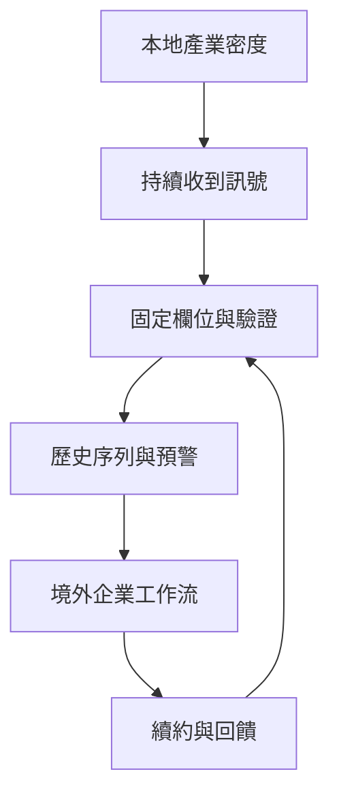
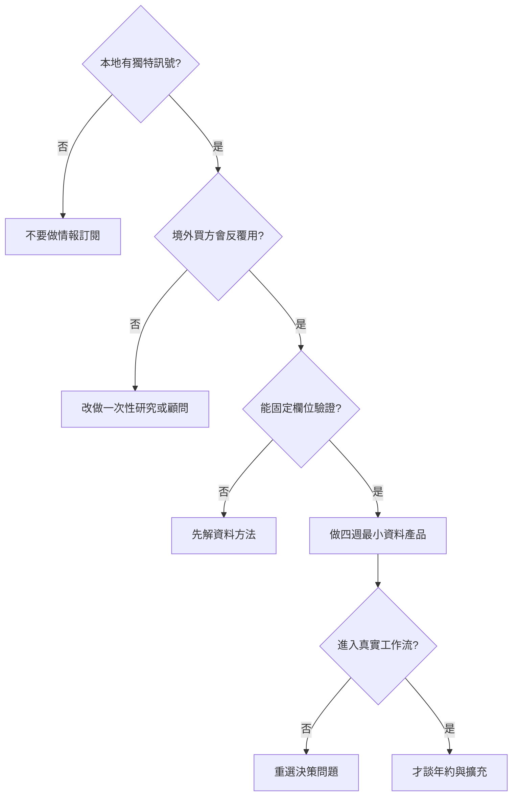

# Research dossier：台灣能不能再長出一家垂直產業情報公司

- 查詢日：2026-09-16（Asia/Taipei）
- 工具：Groundlane `web_search` 找候選，`web_fetch` 讀全文；未使用 fallback。
- 母群定義：從台灣出發，利用本地產業密度、資料或專業網路，把持續更新的情報賣給企業，並有能力服務境外客戶。排除純消費新聞、一次性顧問專案、只供政府內部使用的研究，以及沒有持續資料產品的內容網站。

## 一句話結論

台灣不是只能再複製一家 DIGITIMES；真正可複製的是「在全球供應鏈的一個高密度節點，把零碎訊號變成可持續追蹤的欄位，再嵌進企業決策」。TrendForce 證明台灣公司能把記憶體價格、產能與供需追蹤賣到全球；但 MIC、IEK 與免費公開資料也代表新進者不能只賣一般趨勢摘要。下一家公司必須同時找到本地觀測優勢、境外付費者、可重複資料結構與低成本驗證機制。

## 先用 ELI5 說清楚

把產業想成一條很長的夜市。遊客看到的是攤位今天賣什麼；每天送貨、收租、修電和補貨的人，知道哪一區突然缺料、哪種設備開始排隊、哪個攤商準備擴店。

台灣在半導體、電子代工與部分製造業裡，不只是夜市遊客，而是很多後台工作集中發生的地方。情報公司的機會不是把大家看得到的菜單重寫一次，而是把後台每天出現的訊號做成固定欄位，讓遠方的供應商、投資人和採購團隊可以比較、預警與決策。

## 母群掃描：不是只有 DIGITIMES

| 類型 | 代表 | 可驗證的產品形態 | 商業含義 | 邊界 |
|---|---|---|---|---|
| 私營、全球科技情報 | TrendForce | 價格趨勢、產能調查、研究報告、顧問服務 | 台灣供應鏈資料可賣給全球企業 | 官網規模與客戶占比為公司自報 |
| 私營、新聞＋研究 | DIGITIMES | 新聞、研究頻道、資料庫、企業方案 | 人際採集可延伸成多種產品 | 已由前篇深入，不在本篇重講 |
| 法人／政策型情報 | 工研院 IEK | 模組會員、報告、產銷圖表、互動諮詢、到府簡報、研討會、客製專案 | 新進者面對的不只是媒體，也有公共研究機構 | `web_fetch` 本輪 timeout；產品形態來自 Groundlane 搜尋結果，發文前需再次全文抓取 |
| 法人／ICT 研究 | 資策會 MIC | ICT 產業觀測、研究與顧問 | 一般 ICT 趨勢已有成熟供給 | 官網站點本輪回傳 WAF error；不可引用搜尋摘要當 Confirmed |
| 廣泛市場研究 | 台灣趨勢研究 | 多產業公開分析、調查與研究服務 | 本地產業資料供給不只科技業 | 英文站公開內容較舊，不能當現行規模證據 |
| 公開產業鏈資料 | 櫃買中心產業價值鏈平台 | 公司自填的產業鏈資料 | 免費資料降低基礎目錄的收費空間 | 官網明示公司資料由公司自行輸入，平台不替真實性背書 |

### 偏誤與缺口

- 公開證據偏向仍在營運且有英文官網的成功者；倒閉、轉型或從未跨境的研究公司較難留下資料。
- 台灣許多情報能力存在法人、協會與政府計畫內，不一定以獨立公司的損益表呈現。
- 私營公司的營收、續約率與企業合約通常不公開，因此不能用會員數或單篇售價反推生意規模。
- 本篇應把 TrendForce 當主要正例、IEK/MIC 當競爭環境，不宣稱它們的治理與商業目標相同。

## TrendForce：第二個已經存在的答案

### 從交易平台到價格情報

[TrendForce 官方 About 頁](https://www.trendforce.com.tw/about)稱，創辦人林啓東在 2000 年先建立 DRAMeXchange B2B 平台，從記憶體研究出發；後續擴張到顯示器、LED、綠能、通訊、汽車與 AI，並在 2015 年併入拓墣研究團隊。

這個起點很重要。DRAM 價格與供需有高頻、可比較、會直接改變採購決策的特性。它比「科技趨勢很重要」更接近企業每天要解的問題，也比較容易長成資料序列。

### 情報怎麼被做出來

同一份官方頁把研究方法拆成三步：

1. 與全球 OEM、ODM 與各產業主要製造商合作蒐集資料。
2. 以供應鏈與產能調查為基礎，整合原始研究與次級研究。
3. 做歷史價格追蹤、供需分析與綜合預測。

這三步正好區分「資訊位置」與「產品能力」。人在產業裡只代表有機會收到訊號；能不能用固定定義蒐集、跨期比較並讓客戶反覆查詢，才決定它是不是情報產品。

### 全球收入必要性

TrendForce 官網自報：超過六成客戶屬全球前 500 大企業，客戶地區分布為亞太 47%、北美 28%、歐洲 15%、其他區域 10%，並有台北、深圳、矽谷、紐約與東京據點。這些數字沒有獨立稽核資料可交叉驗證，文章只能標成公司自報。

即便如此，地區結構支持一個較窄的產品設計判斷：如果情報優勢來自台灣供應鏈，付費市場不必也不應只限台灣。真正需要這些訊號的人分散在全球品牌、設備商、材料商與投資機構。

## 為什麼「再做一個產業新聞站」不夠

台灣已有三層免費或低門檻替代品：

1. 媒體與公司新聞稿提供事件快訊。
2. 櫃買中心、政府與協會提供公司／產業基礎資料。
3. MIC、IEK 等法人長期提供研究、會員與顧問服務。

因此，新進者如果只整理公開資訊，客戶很難理解為何要另付一筆年費。可收費的增量比較可能落在：更早的原始訊號、更一致的長期資料、跨公司可比欄位、可放進採購／風險／業務流程的預警，以及公開資料沒有的驗證。

## 哪些垂直領域比較有機會

以下是篩選條件，不是已證實的創業名單：

| 條件 | 為什麼影響付費 | 反例 |
|---|---|---|
| 台灣是全球供應鏈的重要節點 | 本地接觸能產生境外客戶拿不到的訊號 | 只在台灣消費的小型服務業，境外需求弱 |
| 變化頻率足以促成續約 | 客戶需要持續監測，不是買完一份報告就結束 | 十年才改一次的市場結構 |
| 決策錯誤代價高 | 訂閱費相對採購、庫存、法遵或投資損失很小 | 一般興趣內容 |
| 可以建立一致欄位 | 訊號能累積成歷史序列與比較工具 | 每案完全客製、無法重用 |
| 合法且可驗證地取得資料 | 產品不依賴未授權抓取或單一匿名來源 | 來源權利不清、無法追溯 |
| 買方分散在全球 | 不受台灣本地企業數量限制 | 只能向單一政府標案出售 |

依這些條件，值得研究而非直接斷言的方向包括先進封裝與設備交期、AI 伺服器零組件、工業能源／水資源、精密製造供應風險，以及特定醫材製造鏈。每個方向仍要重新驗證資料權利、買方預算與既有競爭者。

## 台灣的結構性優勢與限制

### 優勢：產業密度提供觀測面

美國商務部的 [Taiwan semiconductor market overview](https://www.trade.gov/country-commercial-guides/taiwan-semiconductors-including-chip-design-ai)稱，台灣占全球晶圓代工營收六成以上、先進製程製造九成以上；頁面並列出設計、晶圓代工、封裝、設備與人才等相連子領域。這是外部政府為企業撰寫的市場指南，可作為台灣半導體產業密度的第二來源；精確比例仍應標日期與來源。

### 限制一：政府與法人供給壓低基礎資訊價格

IEK 與 MIC 不只是內容網站，也提供會員、顧問、簡報、研討會與政策研究。新的私營產品不能把免費或補助研究重新包裝就期待高價；它需要在速度、顆粒、介面或工作流上有明確增量。

### 限制二：本地市場不是可靠的天花板

TrendForce 的公司自報客戶分布顯示，境外客戶是主要市場。這不是「台灣沒有企業願意付費」的證據，而是提醒產品應從第一天就處理英文、跨區定義、資料時區與國際銷售。只服務本地讀者，容易把高價 B2B 情報做成低價內容訂閱。

### 限制三：接近供應鏈不等於可以任意使用資料

公司自填資料、匿名訪談、客戶操作資料與公開資料的權利不同。櫃買中心產業價值鏈平台在首頁明示，公司面資料由各公司輸入，錯誤或遺漏由公司負責。新情報產品需要保留來源與驗證層級，不能把「平台上有」誤寫成平台已查證。

## 一個可執行的驗證順序

創業者不用先雇十位分析師。可以先做四週的窄驗證：

1. 選一個會重複發生的企業決策，例如設備交期、材料價格或供應商風險。
2. 訪談十位境外買方，問他們現在用什麼資料、哪一步最慢、一次判斷錯誤的代價。
3. 只建立五到十個固定欄位，連續四週更新，記錄每個欄位的來源與信心。
4. 不先賣「完整報告」，而是讓兩個設計夥伴把資料放進真實週會或採購流程。
5. 測量它是否減少查找時間、提早發現變化，或改變一個可指出的決策。

## 寫作紅線

- 不寫「DIGITIMES 是台灣唯一的全球 B2B 情報產品」；TrendForce 已是直接反例。
- 不把 TrendForce 官網的客戶占比、員工數或全球 500 大客戶比例寫成獨立稽核事實；標為公司自報。
- 不把 IEK/MIC 說成私營競爭者；它們是法人／政策研究體系，商業目標與資金結構不同。
- 不用搜尋摘要確認 IEK 會員功能；本輪全文 fetch timeout，發文前需重試或刪除精確功能描述。
- 不把半導體的成功外推到所有產業。每一個新垂直仍要通過「本地訊號、反覆需求、固定欄位、合法資料、境外買方」五道門。
- 不宣稱列出的方向已具市場規模或客戶付費證據；它們是套用篩選條件後的研究假說。

## 來源與讀取完整度

| 來源 | 讀取 | 可支持 claim |
|---|---|---|
| [TrendForce About](https://www.trendforce.com.tw/about) | Groundlane 全文，未截斷 | 創辦／併購自述、研究領域、研究方法、全球據點、公司自報客戶分布 |
| [US ITA Taiwan semiconductor guide](https://www.trade.gov/country-commercial-guides/taiwan-semiconductors-including-chip-design-ai) | Groundlane 全文，未截斷 | 半導體產業密度、價值鏈與出口市場背景；精確數字帶日期 |
| [Taiwan Trend Research English site](https://www.twtrend.com/en/) | Groundlane 全文，未截斷 | 廣泛產業研究存在；公開英文內容樣本較舊 |
| [TPEx Industry Chain Information Platform](https://ic.tpex.org.tw/) | Groundlane 全文，內容很短 | 公司面資料由公司輸入、錯誤由公司負責的 disclaimer |
| [IEK membership services](https://ieknet.iek.org.tw/services/) | Groundlane search 找到；fetch timeout | 只作待驗證線索，不作 Confirmed 來源 |
| [MIC](https://mic.iii.org.tw/) | fetch 回 WAF error | 不作正文精確主張來源 |

## 發文前補強

1. 重試 IEK 會員服務全文；若仍失敗，只寫「IEK/MIC 是既有法人研究供給」並連首頁，不列功能細節。
2. 搜尋 TrendForce 以外的獨立來源，至少交叉確認成立年份、DRAMeXchange 起點與國際客戶定位；找不到就維持「官方自述」。
3. 若正文保留美國商務部的 60%／90% 數字，再找台灣官方或產業協會第二來源；否則改成不帶精確比例的「全球關鍵節點」。
4. 對五個機會方向至少各找一個買方問題的官方／業界證據；沒有就把方向收進「待驗證假說」表格。
