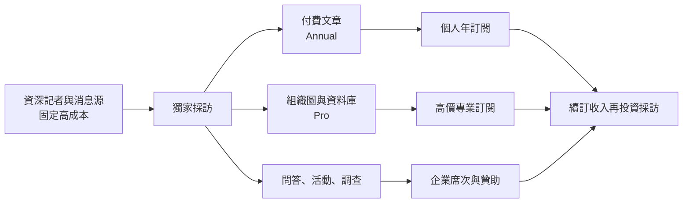
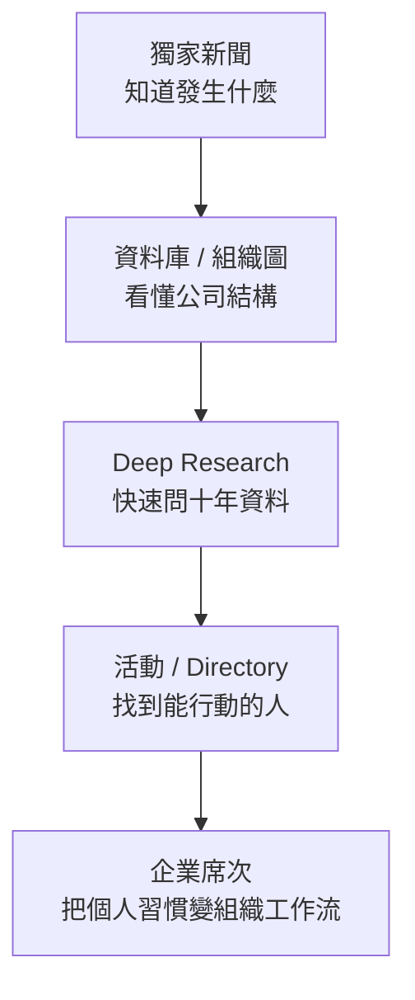
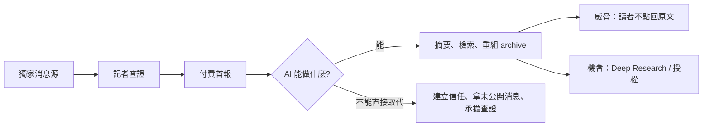

# Research dossier: The Information 如何把獨家採訪賣成高價訂閱

- 查詢日期：2026-09-16（Asia/Taipei）
- 用途：供「B2B 產業情報公司」子系列文章撰寫；不是文章草稿
- 工具揭露：先檢查完整 callable inventory，未發現 Groundlane `web_search`／`web_fetch`／`web_extract`。依本任務明確允許的 fallback 規則，改用 Exa MCP 的 web search 與 web fetch。本文沒有把 fallback 結果冒充 Groundlane 驗證，也未使用 `stealth_fetch`、`WebFetch`、`web-fetch`、`fetch_page` 或 Playwright。

## 一句話結論

The Information 不是把「很多新聞」鎖進付費牆，而是把少量、能影響高價決策的獨家情報賣給科技與金融專業人士；再把採訪過程累積的公司結構、資料庫、記者問答、活動與同業人脈重新包裝，逐步提高每位客戶的價值。

最適合文章的 ELI5 比喻：**一般科技媒體像免費氣象預報；The Information 像船長付費買的海圖。** 海圖不必每天很多頁，只要能提早指出暗礁，一次避險就可能抵過多年訂閱費。

## 研究子問題

1. 誰創辦、誰擁有，是否接受外部資本？
2. 付費牆、定價與實際客群如何設計？
3. 高成本獨家採訪如何轉成可持續的單位經濟？
4. 除了文章，會員還買到哪些資料、社群、活動與企業功能？
5. 訂戶、營收、成長與獲利有哪些可驗證，哪些只是公司自述？
6. 護城河在哪裡，AI 搜尋又會拆掉哪一層？
7. 哪些反例與限制會讓這個模式失效？

## 可直接用於文章的事實底稿

### 1. 創辦、所有權與資本

- The Information 於 2013 年底由前《華爾街日報》記者 Jessica Lessin 創辦。官方 About 頁稱創辦理念是做「別處找不到的、深度採訪的科技產業文章」。[S1]
- 官方 About 頁明確表示：沒有創投或企業股東，由 Lessin 持有。[S1]
- Vanity Fair 2023 再次報導 Lessin 維持全資持有、沒有出售計畫；創辦資金來自她自己的錢，Lessin 先前稱金額「低於 100 萬美元」。這是獨立媒體報導加上創辦人自述，並非經審計財務揭露。[S9]
- Nieman Lab 2021 亦稱 Lessin 完全持有一家當時有獲利的公司。[S8]
- 法律營運主體是 Lessin Media Company，見 2025-07-03 更新的官方 Terms。[S4]

**可下的結論：**「創辦人控制、無 VC／企業股東」有官方與獨立來源交叉支持。
**不可下的結論：**不能寫成「完全沒有任何債務或其他非股權融資」；公開來源沒有資產負債表。

### 2. 付費牆、價格與客戶

截至查詢日，官方 Help Center 與訂閱頁顯示：[S2][S5]

| 方案 | 首期公開價 | 續訂／牌價 | 主要內容 | 注意事項 |
|---|---:|---:|---|---|
| Annual | US$399／年 | US$499／年 | 全部新聞、8+ 電子報、charts/data library、TITV、App、音訊、社群工具、活動權益 | 首期價與續訂價不同，文章需寫清楚 |
| Pro | US$749／年 | US$999／年 | Annual 全部內容，加 Deep Research、公司組織圖、專有資料庫、調查與 Pro 活動 | 官方頁內同時出現「60+／70+ 組織圖」與「12／19 資料庫」兩組文案，疑似頁面區塊更新不同步；不要硬寫單一精確數字 |
| Young Professional | US$225／年 | 前兩年 225，之後 399 | 文章、briefings、電子報、活動 | 僅限 30 歲以下 |
| Group／Corporate | 未公開，依人數報價 | 未公開 | 席次折扣、彈性換人、單一帳單與續訂日、專責支援 | 企業採購降低報銷與帳號管理摩擦 [S3] |

- 2013 上線時價格為每月 US$39 或每年 US$399，Lessin 明說目標是「習慣為能幫助工作決策的資訊付費」的專業人士，而非大眾讀者。[S7]
- 官方 corporate 頁把價值主張寫成：提早掌握科技產業重大事件，以及透過 Directory／Org Charts 找客戶、合作夥伴與人才。[S3]
- 2022 Axios 報導，個人訂閱約占公司總營收 85%；另有 enterprise subscriptions 與較小的品牌合作／活動贊助業務。數字來自 Lessin 對 Axios 的說法，非審計數字。[S12]
- 企業帳號不是單純折扣：統一帳務、可換使用者、可擴席，讓「某個人喜歡讀」變成「組織可以採購」。[S3]

**ELI5：**賣的不是一把報紙，而是三種保險：個人避免漏掉大消息、主管避免做錯決策、公司避免每位員工各自買帳號。

### 3. 獨家採訪的成本模型

#### 已查證的成本訊號

- Lessin 2016 表示 60% 預算投入 editorial；當時全公司 19 人，灣區有 12 名科技線記者。[S11]
- 2022 年公司逾 50 人，約三分之二在 newsroom。[S10]
- 2023 年公司 65 名全職員工。[S9]
- 2026 年官方 VC／startups 記者職缺年薪區間為 US$120,000–200,000，另加 bonus 與 benefits；工作要求持續養消息源、搶融資與基金績效等獨家、寫深度人物與趨勢，並參與 org charts 等產品。[S6]
- 2021 Digiday 報導公司一年內增聘 22 人，並引述 Lessin：「投資新聞工作就是投資這門生意。」[S14]

以上不能推算完整 newsroom 成本，但足以證明這是人力密集、資深採訪導向的模式，不是靠低成本內容量取勝。

#### 收入邏輯（事實與推論分開）

1. 記者長期經營高價值 beat 與消息源，產出市場上少見的 scoop。[事實：S1、S6、S11]
2. 一次 scoop 若能影響投資、招募、競爭策略或風險判斷，對目標讀者的價值可遠高於 US$399。[推論；2016 Investor 方案與客戶說法提供方向性支持：S11]
3. 高價年訂閱把收入從「每次閱讀」變成「持續保有情報管道」，降低對單篇流量的依賴。[推論]
4. 採訪副產品可再包裝成 briefings、conference calls、org charts、databases、surveys、Deep Research，而不必每次從零取得資料。[事實：S2、S11、S13；「較低邊際成本」為推論]
5. 企業席次與 Pro 把同一情報資產賣給願付更高價格的決策者。[事實：S2、S3、S13]

2016 年舊 Investor 方案是一個極端例子：每年 US$10,000，提供記者尚未成文、但對投資人有價值的集體 briefing／conference call；Lessin 說它利用記者日常已累積的資訊，不必改變 newsroom 的主要工作方式。[S11] 此方案不是現行 Pro，文章必須標為歷史案例，不能當成 2026 現況。

圖說建議：同一次採訪不是只賣成一篇文章；它會累積成多個可重複交付的情報產品。注意這是商業模型的綜合推論，不是公司公布的成本會計圖。

### 4. 會員與附加產品

- **Annual 基礎層：**完整新聞、briefings、8+ 電子報、charts/data library、TITV 日播、App、文章音訊、community networking tools、活動折扣／免費資格。[S2]
- **Pro 資料層：**Deep Research（以逾十年報導、組織圖與資料為 grounding）、記者建立的專有資料庫、公司組織圖、Pro 報告／調查與專屬活動。[S2][S13]
- **企業層：**人數折扣、單一帳單、統一續訂日、彈性換席與擴席；Directory／Org Charts 也被定位成找客戶、夥伴與人才的工具。[S3]
- **社群層：**2022 年推出可選擇公開的個人檔案、directory、私訊與類 Reddit feed。Lessin 當時說主要目的先是增加訂閱價值，不是直接營收；未來可能延伸工作版或贊助討論。[S12]
- **事件層：**官方 events 頁把活動從小型晚宴到大型 summit 定位為競爭情報與人脈場景；Axios 2023 指出事件贊助是公司擴張中的非訂閱收入來源。[S13][S15]
- **內容授權：**官方 corporate 頁公開招攬長期內容授權合作，但沒有公開客戶、價格或營收占比。[S3]

圖說建議：產品階梯從「閱讀」一路走到「研究、連結、採購」。越靠後，越難被一篇免費摘要完整替代。

### 5. 成長、訂戶與獲利：證據強度

The Information 是私人公司，不公開經審計財報；幾乎所有營收與獲利數字都來自創辦人自述或匿名知情人士。文章應寫「據 Lessin 表示／據媒體引述知情人士」，不要寫成已審計事實。

| 時點 | 公開說法 | 證據性質 | 可否當成確定事實 |
|---|---|---|---|
| 2016 | cash-flow positive／profitable、訂戶年增逾一倍 [S11] | 創辦人受訪自述，Nieman/Poynter 原文 | 可寫「Lessin 當時表示」，不可寫經審計 |
| 2018 | 逾 90% 營收來自訂閱；subscriber LTV 遠高於 US$1,000；多數年繳且 churn negligible [S16] | Lessin 在 Digiday podcast 自述；沒有分母或 cohort | 方向性可用，精確性不可獨立驗證 |
| 2020 | 2016 達獲利；預期 2020 年營收達 US$20m [S17] | NYT 引述 Lessin；預測值不是實績 | 只能寫預期，不能寫已達成 |
| 2022 | 約 45,000 付費訂戶 [S18] | Business Insider 引述兩名知情人士，公司拒評 | 估計值；高風險，需保留 attribution |
| 2022 | 個人訂閱營收年增逾 35%，占總營收約 85%；付費訂戶「well into tens of thousands」[S12] | Lessin 對 Axios 自述 | 可交叉支持 BI 的量級，不能把兩者當獨立官方確認 |
| 2022 | 360,000 active readers；營收年增 35% [S10] | Lessin 自述；active readers 混合付費、免費電子報與贈閱 | 絕不能當成付費訂戶數 |
| 2023 | 475,000 active readers、營收年增 30%、預期該年獲利 [S9] | Lessin 自述 | 不能證明已完成年度實績；也顯示「2016 profitable」不代表每年都獲利 |
| 2026 | 700,000 active readers、financially healthy、plenty of capital [S6] | 官方招募文案，沒有 paid/free 拆分 | 行銷式自述；不可等同 70 萬訂戶或現金餘額 |

**最重要的資料衛生：**active readers ≠ paid subscribers。2022、2023、2026 的 active reader 數都包含免費電子報等非付費使用者。

### 6. 護城河

| 護城河 | 為何有效 | 脆弱點 |
|---|---|---|
| 消息源網路與 beat 記憶 | scoop 依賴記者多年信任，不能即時複製 | 明星記者離職會帶走部分關係；2022 曾被問及人才流失 [S10] |
| 高價值、窄受眾 | 一次好情報即可抵多年訂閱，無需大流量 | TAM 小，且經濟下行時預算會被重新審視 |
| 品牌作為「被跟進的首報者」 | 大媒體跟進可免費擴散品牌並帶來轉換 [S1][S11] | 跟進報導可能讓非訂戶稍後免費取得核心事實 |
| 年訂閱與企業席次 | 經常性收入；企業帳務降低採購摩擦 | 高價、續訂促銷差異可能造成流失；公開 churn 只有舊自述 |
| 資料庫、組織圖、十年 archive | 報導沉澱成可查詢的結構化資產 | 資料更新昂貴；第三方資料供應商也能競爭 |
| 高品質會員網路 | 讀者本身成為評論、人脈與交易價值 | 冷啟動完成後仍需治理；功能不等於實際活躍度 |
| 創辦人控制 | 不必迎合 VC 退出期限，能長期投資 beat | key-person risk；治理與財務透明度低於上市公司 |

### 7. AI 搜尋：風險與反擊

#### 可驗證事實

- 2025 Terms 禁止用服務開發軟體，包括訓練 machine-learning／AI program；也禁止 scraping、繞過存取限制及未授權商業化內容。[S4]
- 現行 Pro 已把 AI 變成付費功能：Deep Research 的賣點是以 The Information 逾十年的報導、組織圖與資料作 grounding。[S2][S13]
- 官方 corporate 頁公開提供 content licensing 洽談。[S3]
- 本輪搜尋未找到 The Information 自己宣布與 OpenAI、Perplexity、Anthropic 等簽署 AI 內容授權，也未找到它因 AI scraping 提告的可靠公開證據。這是「未找到」，不是證明「沒有」。

#### 推論（文章需明標）

1. **摘要替代風險較低但非零。** 真正價值在最早取得且可信的未公開消息；AI 摘要能轉述已發表內容，卻不能自行養消息源。可是若答案引擎快速重述 scoop，讀者可能只取核心事實、不進站訂閱。
2. **品牌歸因風險。** 過去「大媒體跟進 The Information」同時是免費行銷；AI 若把來源壓成一句 citation，品牌曝光與轉換路徑可能更弱。
3. **archive 反而更值錢。** 可信、專有且長期累積的報導可變成垂直 AI 的 grounding corpus；Deep Research 正是在把內容庫產品化，而非只防守爬蟲。
4. **資料更新成本仍在人類。** AI 可以改善檢索與重組，不能自動保證私募估值、組織匯報線與未公開交易最新且正確；記者查證仍是成本中心，也是差異化來源。
5. **授權有選項價值但尚無實績證據。** 官網有一般內容授權入口，不代表已有 AI 授權營收。

### 8. 限制與反例

- **不是所有垂直領域都有足夠高的決策價值。** 科技融資、併購、AI 基礎設施與高階人事異動能影響大量資本；一般興趣內容未必能支撐 US$399–999。
- **「兩篇好文／天」要求每篇都接近不可替代。** 2016 Lessin 描述核心產出約每天兩篇獨家。[S11] 若獨家密度下降，高價會放大失望。
- **私人公司不透明。** 沒有經審計訂戶、ARR、gross margin、CAC、retention 或 cohort；外界無法驗證「健康」到什麼程度。
- **歷年獲利說法並不連續。** 2016 說已獲利，2023 又說「預期今年獲利」，可能是中間擴張投資、口徑不同或曾虧損；公開材料不足以判定。文章不應把 2016 的一句話延伸成「十年持續獲利」。
- **訂閱並非唯一營收。** 早期「無廣告」的品牌敘事後來加入事件、電子報、調查、podcast 贊助與 brand partnerships；這不是矛盾，但應寫成從純訂閱向以訂閱為核心的混合模式演化。[S13][S14]
- **社群功能的使用效果未知。** 公開資料證明功能推出，不證明 directory、forum 或私訊有高活躍或能降低 churn。
- **高薪採訪與全球布局提高固定成本。** 在訂戶放緩、科技業縮編或 scoop 週期不利時，成本不會像流量一起下降。
- **個人關係既是資產也是風險。** Vanity Fair 提及外界質疑 Lessin 與受訪科技領袖過近；Lessin 的回應是能在私人往來後仍編輯嚴格報導。[S9] 文章可把它作為「接近消息源 vs. 編輯獨立」的張力，而非斷言利益衝突。

## 高風險事實交叉表

| Claim | 一手／第一來源 | 獨立來源 | 判定 |
|---|---|---|---|
| 2013 創辦、Lessin 全資持有、無 VC／企業股東 | 官方 About [S1] | Nieman 2021 [S8]；Vanity Fair 2023 [S9] | ✅ 所有權主張有交叉支持；仍無財報可驗債務 |
| Annual／Pro 公開價與續訂價 | 官方 Help Center [S5] | 官方 checkout [S2] | ✅ 截至 2026-09-16；促銷會變，發文前應重查 |
| 2022 約 45,000 付費訂戶 | 無公司確認；公司拒評 | BI 兩名匿名知情人士 [S18]；Axios 同期僅稱 well into tens of thousands [S12] | ⚠️ 量級互相相容，但不是雙重獨立確認 |
| 2016 已獲利 | Lessin 對 Nieman/Poynter 自述 [S11] | NYT 2020 回述同一公司說法 [S17] | ⚠️ 多家刊載但根源仍是創辦人自述 |
| 2023 年營收成長 30%、預期獲利 | Lessin 自述 | Vanity Fair [S9] | ⚠️ 單一自述；沒有年度結算證據 |
| 2026 有 700,000 active readers | 官方職缺文案 [S6] | 本輪未找到獨立同期來源 | ⚠️ 單一官方行銷口徑；且不是付費訂戶 |
| 高採訪成本 | 官方職缺薪資 120k–200k+ [S6] | 2016 60% 預算 editorial [S11]；2022 約 2/3 人員在 newsroom [S10] | ✅ 能證明模式人力密集；不能精算總成本 |
| Pro 把採訪資產變成 data products | 官方 Pro／subscribe [S2][S13] | Axios 2023 訪談 [S15] | ✅ 產品存在與設計目的有交叉支持 |
| 已有 AI 內容授權交易 | 無 | 無 | 🔴 不可驗證；不要寫 |

## 建議文章敘事骨架

1. **開場案例：**2023 年 OpenAI 董事會風暴，五天內刊出 17 篇獨家、被其他媒體數百次跟進。[S9] 用這個案例問：「為什麼有人願意每年付 399 美元讀一個小型 newsroom？」
2. **ELI5 核心：**不是買新聞數量，是買「比別人早知道、而且敢拿來做決策」。用海圖比喻。
3. **第一層生意：**窄而高價的讀者 × 少而不可替代的 scoop × 年訂閱。
4. **成本真相：**消息源需要多年累積；用薪資、60% editorial budget、newsroom 人數證明不是廉價內容工廠。
5. **第二層生意：**同一採訪資產如何長成 org charts、databases、briefings、events、community、enterprise seats。
6. **護城河：**不是 paywall 本身，而是消息源 → 首報品牌 → 專業讀者 → 再投資記者的循環。
7. **別被大數字騙：**active readers 不是付費訂戶；私人公司的營收／獲利缺乏審計。
8. **AI 轉折：**AI 可以摘要首報，但不能自己走進會議室養消息源；The Information 同時用 Terms 防守、用 Deep Research 把 archive 變產品。
9. **結尾取捨：**此模式不是「媒體都該收費」，而是「當情報能改變昂貴決策，少數高價客戶可能勝過大量免費流量」。

## 建議圖表（避免裝飾性 Mermaid）

1. **採訪資產飛輪**：記者／消息源 → scoop → 訂閱 → 再投資。用於解釋核心單位經濟。
2. **一份採訪、多次包裝**：文章 → org chart/database → Deep Research → event/community → enterprise。用於解釋 Pro 與企業層。
3. **價格階梯表**：Young Professional／Annual／Pro／Group；表比流程圖更適合精確價格。
4. **AI 能與不能決策樹**：摘要／檢索可自動化，消息源／查證難自動化。用於避免空泛「AI 取代媒體」。
5. **證據透明度表**：paid subscribers、active readers、revenue、profitability 的證據強弱。這張表對文章可信度比再一張概念圖更重要。

## 來源清單與逐頁 claim map

### 一手／官方

- **[S1] [The Team / About Us](https://www.theinformation.com/about)** — 官方；全文；訪問日 2026-09-16。支持：2013 年底創辦、深度獨家定位、Lessin 自有、沒有 VC／企業 owners、以記者與 reporting 競爭。
- **[S2] [Subscribe](https://www.theinformation.com/subscribe)** — 官方；全文；訪問日 2026-09-16。支持：Annual／Pro／Young Professional 首期與續訂價、Annual 權益、Pro 的 Deep Research／資料庫／組織圖／調查、活動與 App。
- **[S3] [Corporate Subscriptions & Team Plans](https://www.theinformation.com/corporate)** — 官方；全文；訪問日 2026-09-16。支持：團體折扣、彈性席次、統一帳務、Directory／Org Charts、教育方案、內容授權入口。
- **[S4] [Terms of Service](https://www.theinformation.com/terms)** — 官方；全文（取用與 AI 相關條款）；最後更新 2025-07-03；訪問日 2026-09-16。支持：營運法人、禁止 scraping／繞存取控制／用服務訓練 ML 或 AI。
- **[S5] [Individual Subscriptions – Help Center](https://theinformation.zendesk.com/hc/en-us/articles/218741157-Individual-Subscriptions)** — 官方；全文；訪問日 2026-09-16。支持：Annual 399→499、Pro 749→999、團體方案入口。
- **[S6] [Reporter, Venture Capital and Startups](https://ats.rippling.com/theinformation-jobs/jobs/81bbc2d7-c04b-42bd-b3c6-829c0544c5a0)** — 官方職缺；全文；訪問日 2026-09-16。支持：記者工作內容、三間 newsroom、120k–200k+bonus+benefits、700k active readers 與「financially healthy」自述。
- **[S13] [The Information Pro](https://www.theinformation.com/pro)** — 官方；全文；訪問日 2026-09-16。支持：資料工具源自 newsroom 需求、AI answers grounding、AI 公司／資料中心／晶片資料庫、65+ org charts、活動與調查。

### 高品質獨立來源／含創辦人訪談

- **[S7] [Digiday: Why a new tech news site spurns ads for subscriptions](https://digiday.com/media/will-readers-pay-to-read-the-information/)** — 二手媒體＋創辦人訪談；全文；2013-12-05；訪問日 2026-09-16。支持：初始定價、bootstrap、無廣告理由、專業客群定位。
- **[S8] [Nieman Lab: Jessica Lessin built a newsroom she wanted to work in](https://www.niemanlab.org/2021/02/the-informations-jessica-lessin-built-a-newsroom-she-wanted-to-work-in-and-coaches-other-journalists-turned-founders-on-doing-the-same/)** — 高品質二手＋訪談；全文；2021-02-01；訪問日 2026-09-16。支持：離開 WSJ、完全持有、當時 profitable、訂閱優先。
- **[S9] [Vanity Fair: How The Information Has Survived a Decade](https://www.vanityfair.com/news/2023/12/the-information-jessica-lessin)** — 高品質二手＋多方採訪；全文；2023-12-05；訪問日 2026-09-16。支持：OpenAI 17 篇獨家案例、475k active readers、65 FTE、30% growth／預期獲利自述、全資持有、創辦資金低於 1m、自有關係風險。
- **[S10] [Vanity Fair: The Next Phase of The Information](https://www.vanityfair.com/news/2022/08/the-next-phase-of-the-information-jessica-lessin)** — 高品質二手＋創辦人訪談；全文；2022-08-11；訪問日 2026-09-16。支持：360k active readers、35% revenue growth、50+ headcount／約三分之二 newsroom、無投資人、B2B 與 brand partnerships 擴張。
- **[S11] [Nieman Lab: scaling an already-expensive subscription product](https://www.niemanlab.org/2016/10/the-informations-jessica-lessin-on-how-shes-scaling-an-already-expensive-subscription-product/)** — 高品質二手＋創辦人訪談；全文；2016-10-26；訪問日 2026-09-16。支持：當時獲利、19 人／12 灣區記者、兩篇獨家／日、舊 Investor 10k 方案、briefings、community、events、採訪副產品再包裝。
- **[S12] [Axios: launching social network for subscribers](https://www.axios.com/2022/07/12/exclusive-the-information-launching-social-network-for-subscribers)** — 高品質二手＋創辦人訪談；全文；2022-07-12；訪問日 2026-09-16。支持：profiles／directory／forum／DM、well into tens of thousands paid、consumer subscriptions 約 85% revenue、企業訂閱與 sponsorship。
- **[S14] [Digiday: staffs up to reach hundreds of thousands](https://digiday.com/media/the-information-staffs-up-in-a-push-to-reach-hundreds-of-thousands-of-subscribers/)** — 高品質二手＋創辦人訪談；全文；2021-05-19；訪問日 2026-09-16。支持：一年增聘 22 人、29 editorial／13 business、新聞投資等於 business 投資、存在 sponsorship 與 B2B products。
- **[S15] [Axios: launches Pro subscription](https://www.axios.com/2023/02/22/the-information-launches-new-pro-subscription)** — 高品質二手＋創辦人訪談；全文；2023-02-22；訪問日 2026-09-16。支持：Pro 初始定價 999、org charts／databases／surveys／newsletter、約 60 員工、訂閱為主、活動贊助擴張。定價僅作歷史比較，現況以 S2/S5 為準。
- **[S16] [Digiday: five years of subscription journalism](https://digiday.com/media/the-informations-jessica-lessin-on-five-years-of-subscription-journalism/)** — 二手 podcast 摘要＋創辦人訪談；全文文字；2018-08-07；訪問日 2026-09-16。支持：90%+ subscription revenue、LTV way north of 1k、年繳與 churn 自述、轉換靠不可替代原創。
- **[S17] [New York Times: Maybe Information Actually Doesn't Want to Be Free](https://www.nytimes.com/2020/02/07/business/media/the-information-jessica-lessin.html)** — 高品質二手；🟡 部分讀取（preview/paywall）；2020-02-07；訪問日 2026-09-16。支持範圍限搜尋／預覽可見內容：Lessin 稱 2016 獲利、預期 2020 sales 20m。不可宣稱讀完全文。
- **[S18] [Business Insider: The Information Plots Its Next Phase of Expansion](https://www.businessinsider.com/the-information-plots-next-phase-of-expansion-2022-9)** — 高品質二手；🟡 搜尋摘要／付費牆；2022-09-09；訪問日 2026-09-16。支持範圍限：約 45k paid（兩名知情人士）、約 400 年費、公司拒評。不可用作無保留確定數字。

## 讀取完整度盤點

| 來源 | 程度 | 阻礙／處置 |
|---|---|---|
| S1–S16（除另註） | ✅ 全文或完整公開頁面 | Exa fallback fetch；動態頁仍以查詢日快照為限 |
| S17 NYT | 🟡 預覽／可見部分 | paywall；只保留 preview 明示 claim |
| S18 Business Insider | 🟡 搜尋摘要 | paywall；精確 paid subscriber 數維持 attribution 與不確定標記 |
| 公司財報、ARR、CAC、留存 cohort | 🔴 無公開文件 | 私人公司未公開；不得反推 |
| AI 授權交易／AI scraping 訴訟 | 🔴 本輪未找到可靠公開證據 | 只記錄「未找到」，不得斷言不存在 |

## 發文前必須重查

1. 官方 `/subscribe` 與 Help Center：促銷、續訂價、Pro 資料庫／org chart 數量會變。
2. 官方 About／jobs：active readers 與 team size 可能更新。
3. 是否新增 AI licensing deal、publisher program 或訴訟。
4. 若文章要使用「45,000 paid」：最好另取得 BI 全文或新的獨立同期來源；否則保留「據 BI 引述兩名知情人士估計」。
5. 不把任何 active readers 數字寫成 paid subscribers。

## 不可驗證與禁寫句

- 「The Information 目前有 70 萬付費訂戶」— 錯；官方只說 active readers。
- 「公司十年來一直獲利」— 無證據；公開說法只覆蓋少數時點且 2023 用的是預期語氣。
- 「2020 年營收達到 2,000 萬美元」— 公開來源只是 Lessin 的預測。
- 「The Information 已和 OpenAI／Perplexity 簽授權」— 本輪未找到可靠證據。
- 「AI 無法威脅它」— 過度推論；AI 仍可能替代閱讀、削弱導流與品牌歸因。
- 「完全沒有廣告」— 歷史上核心網站無傳統 display ads，但後來有活動、電子報、調查、podcast sponsorship 與 brand partnerships。
