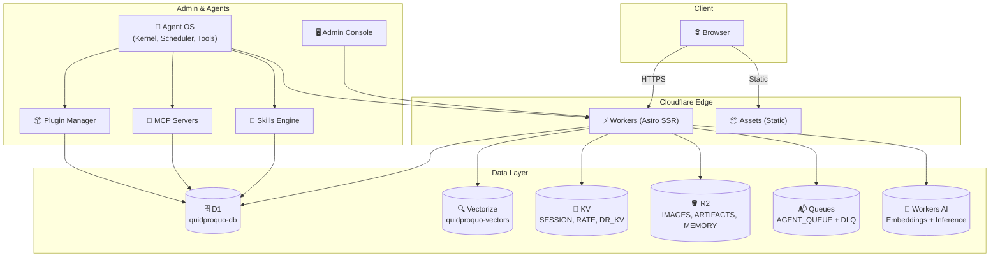
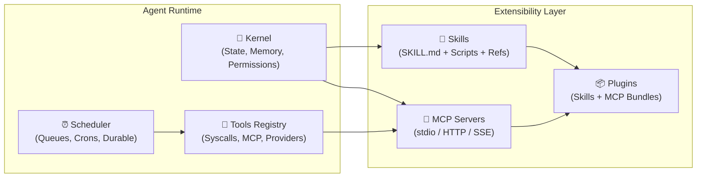

<div align="center">

# quidproquo

**A bilingual personal blog with a built-in AI content engine.**

[](https://github.com/vincentxuu/quidproquo/actions/workflows/deploy.yml)


[Quick start](#quick-start) · [Features](#features-at-a-glance) · [Architecture](#architecture) · [Deploy](#deploy-to-cloudflare) · [Agent Ecosystem](#agent-ecosystem) · [Docs](#documentation)

[English](README.md) · [繁體中文](README.zh-TW.md)

</div>

---

## Overview

quidproquo is the source of [quidproquo.cc](https://quidproquo.cc), a personal blog built with **Astro (SSR)** on **Cloudflare Workers**. Articles are written in Markdown, served bilingually (`zh-TW` default, `en`), and backed by a retrieval layer: posts are chunked into D1 and Vectorize to power semantic search, related posts, and a chat endpoint.

> [!IMPORTANT]
> This is a personal project under active development. The D1 schema, API routes, and content pipelines may change without notice. It is not intended as a general-purpose blogging framework.

---

## Tech Stack

| Layer | Technology |
|-------|------------|
| **Framework** | Astro 5 (SSR), TypeScript, React (islands) |
| **Runtime** | Cloudflare Workers (Node.js compat) |
| **Database** | D1 (SQLite) — posts, chunks, glossary, skills, MCP, plugins |
| **Vector Search** | Vectorize (768-dim embeddings via Workers AI) |
| **AI/ML** | Workers AI (embeddings, inference), LangChain adapters |
| **Queue/Async** | Cloudflare Queues (agent runs, digests, DLQ) |
| **Storage** | R2 (images, artifacts), KV (sessions, rate limit, deep-research) |
| **Auth** | Session cookies (KV-backed), admin-only routes |
| **Quality** | oxlint, custom check scripts, `pnpm verify` gate |
| **Testing** | Vitest, Playwright (browser) |
| **i18n** | `zh-TW` (default) + `en`, language-parity checks |

---

## Features at a Glance

| Area | What it does | Where it lives |
|------|--------------|----------------|
| **Bilingual blog** | Markdown/MDX posts with categories, tags, series, RSS, sitemap, OG image generation | `src/content/posts/`, `src/pages/` |
| **RAG search & chat** | Post chunks embedded into Vectorize; semantic search, related posts, chat API | `src/pages/api/search.ts`, `src/pages/api/chat.ts` |
| **Deep research** | Multi-step research workflow with evidence tracking and queued agent runs | `src/pages/api/deep-research.ts`, `flows/` |
| **Content pipelines** | Crawlers, YouTube-to-post, translation, daily digest routines | `src/lib/crawl/`, `scripts/`, `docs/yt-to-post-pipeline.md` |
| **Agent ecosystem** | Skills, MCP Servers, Plugins management with D1 persistence and admin UI | `src/lib/agent-skills/`, `src/pages/admin/agent-ecosystem.astro` |
| **Admin console** | Session-authenticated admin UI for jobs, providers, policies, skills | `src/pages/admin/` |
| **Quality gates** | Lint + post-reference, terminology, language-parity, glossary, link checks | `scripts/check-*.mjs`, `pnpm verify` |

Search and chat work without external SaaS beyond model providers configured via `LLM_PROVIDER`; embeddings and inference use Workers AI and LangChain adapters.

---

## Architecture



### Data Flow

```text
┌─────────────┐     ┌──────────────┐     ┌─────────────┐
│   Author    │────▶│  Markdown    │────▶│  Content    │
│  (Markdown) │     │  + Frontmatter│    │  Config     │
└─────────────┘     └──────────────┘     └──────┬──────┘
                                                │
                                                ▼
┌─────────────┐     ┌──────────────┐     ┌─────────────┐
│   D1 Sync   │◀────│  Validation  │◀────│  Type-check │
│ (scripts/)  │     │ (checks)     │     │ (Astro)     │
└──────┬──────┘     └──────────────┘     └─────────────┘
       │
       ▼
┌─────────────────────────────────────────────────────┐
│                    D1 Database                       │
│  posts • post_chunks • doc_chunks • user_skills     │
│  mcp_servers • plugins • glossary_terms • stats     │
└─────────────────────────────────────────────────────┘
       │                         │
       ▼                         ▼
┌─────────────────┐      ┌─────────────────┐
│  Vectorize      │      │  SSR Queries    │
│  (Embeddings)   │      │  (Live Data)    │
└────────┬────────┘      └────────┬────────┘
         │                        │
         ▼                        ▼
┌─────────────────────────────────────────────────────┐
│              API Layer (Workers)                     │
│  /api/search • /api/chat • /api/deep-research       │
│  /api/skills • /api/mcp-servers • /api/plugins      │
└─────────────────────────────────────────────────────┘
```

---

## Quick Start

**Requirements:** Node.js 22+, pnpm 10, Git. Playwright only for browser tests.

```bash
git clone https://github.com/vincentxuu/quidproquo.git
cd quidproquo
pnpm install
```

### Development

```bash
pnpm dev                 # Start dev server at http://localhost:4321
pnpm sync                # Sync content to local D1
pnpm sync:prod           # Sync to production D1
```

### Everyday Commands

| Command | Purpose |
|---------|---------|
| `pnpm build` | Production build to `./dist/` (cron entry, OG images) |
| `pnpm preview` | Preview production build locally |
| `pnpm lint` | oxlint static analysis |
| `pnpm test` | Vitest test suite |
| `pnpm verify` | **Full pre-commit gate** (lint, refs, quality, glossary, parity, skills-sync, progress) |
| `pnpm check:lang-parity` | Verify `zh-TW`/`en` content parity |
| `pnpm eval:rag` | Run RAG baseline evaluation |
| `pnpm session:start` | Show latest commit, `progress.txt`, run lint |

---

## Deploy to Cloudflare

Deployment is automated via GitHub Actions: pushes to `main` run lint, verify, build, and deploy to production.

**Required secret:** `CLOUDFLARE_API_TOKEN` (see [`.github/workflows/deploy.yml`](.github/workflows/deploy.yml)).

### Manual Deploy

```bash
pnpm exec wrangler login
pnpm run deploy
```

`pnpm run deploy` builds first, then deploys with generated `dist/server/wrangler.json`. Scheduled jobs (cron triggers for crawlers, digests, retention) are defined in [`wrangler.jsonc`](wrangler.jsonc).

### Cloudflare Resources

| Binding | Type | Purpose |
|---------|------|---------|
| `ASSETS` | Assets | Static asset serving |
| `SESSION` | KV | Session storage |
| `RATE` | KV | Rate limiting |
| `DEEP_RESEARCH_KV` | KV | Deep-research state |
| `DB` | D1 | Posts, chunks, glossary, **skills, MCP servers, plugins** (`quidproquo-db`) |
| `VECTORIZE_INDEX` | Vectorize | Embedding search (`quidproquo-vectors`, 768-dim) |
| `AI` | Workers AI | Embeddings (`@cf/baai/bge-base-en-v1.5`) and inference |
| `R2_IMAGES` | R2 | Image storage |
| `R2_AGENT_MEMORY` | R2 | Agent memory offload |
| `R2_AGENT_ARTIFACT` | R2 | Agent artifacts |
| `AGENT_QUEUE` | Queues | Queued agent runs (with DLQ) |

### Database Migrations

Located in [`migrations/`](migrations/). Core tables:

| Table | Purpose |
|-------|---------|
| `posts` | Articles (bilingual, categories, tags, series) |
| `post_chunks` | RAG chunks from posts (embedded) |
| `doc_chunks` | Chunks from crawled external documents |
| `user_skills` | User-defined agent skills (SKILL.md) |
| `mcp_servers` | MCP Server configurations (stdio/http/sse) |
| `plugins` | Installed plugin packages (skills + MCP bundles) |
| `glossary_terms` | Terminology definitions |
| `glossary_lookup_stats` | Search analytics for glossary |

---

## Why quidproquo?

- **Content as data** — Every post is plain Markdown synced into D1; search, recommendations, analytics all query one source of truth.
- **RAG-native** — Retrieval is not bolted on: chunking, embedding, evaluation (`pnpm eval:rag`), trace retention are first-class.
- **Bilingual by construction** — Language-parity and Traditional-Chinese terminology checks keep editions consistent.
- **Quality gates before publish** — References, series order, glossary coverage, external links verified in CI.
- **One platform** — Compute, storage, search indexes, queues, AI all run inside Cloudflare Workers.
- **Agent-extensible** — Built-in Skills/MCP/Plugins system for composing agent workflows.

---

## Agent Ecosystem

The project includes a built-in agent extensibility system with three layers:

### Component Architecture



### Components

| Component | Purpose | Storage | API |
|-----------|---------|---------|-----|
| **Skills** | Reusable workflow definitions (SKILL.md format) for agents | Project: `.agents/skills/` (git)<br>User: D1 `user_skills` | `GET/POST/PUT/DELETE /api/skills`<br>`GET /api/skills/export`<br>`POST /api/skills/import` |
| **MCP Servers** | External tool providers via Model Context Protocol (GitHub, Notion, Slack, custom) | D1 `mcp_servers` | `GET/POST/PUT/DELETE /api/mcp-servers`<br>`PATCH /api/mcp-servers/:name` (toggle) |
| **Plugins** | Distributable packages bundling skills + MCP servers | D1 `plugins` | `GET/POST/PUT/DELETE /api/plugins` |

### Key Design Decisions

- **Dual-source skills**: Project skills (`.agents/skills/`, version-controlled) + User skills (D1, runtime-editable) merged at execution time
- **SKILL.md standard**: Follows [agentskills.io](https://agentskills.io) format (frontmatter + sections: When to use, Instructions, Scripts, References, Assets)
- **MCP agnostic**: Supports `stdio` (local), `http`, `sse` (remote) transports
- **Plugin as package**: Plugin = manifest + skills[] + mcp_servers[]; install/uninstall/upgrade via API
- **Compatibility layer**: Exposes `SUPPORTED_AGENT_SKILLS` for existing deep-research pipelines

### Admin UI

Visit `/admin/agent-ecosystem` (auth required):
- **Three tabs**: Skills / MCP Servers / Plugins
- Search, filter by source/status
- Modal editors for create/update
- Import/export JSON (skills)
- One-click enable/disable MCP servers

### Authoring Skills

See [`docs/skill-package-development-guide.md`](docs/skill-package-development-guide.md) for:
- SKILL.md frontmatter schema
- Section structure (When to use, Instructions, Scripts, References, Assets)
- Testing and validation
- Publishing as plugin

---

## Project Status

- **Live**: [quidproquo.cc](https://quidproquo.cc) (auto-deploy from `main`)
- **Implemented**:
  - Bilingual SSR blog with categories, tags, series, RSS, sitemap
  - RAG search, chat, related posts
  - Deep-research workflow (planner→research→writer→critic)
  - Agent queue console with evidence tracking
  - Content QA suite (references, terminology, parity, glossary, links)
  - RAG evaluation harness (`pnpm eval:rag`)
  - **Agent Skills/MCP/Plugins ecosystem**
- **In progress**: Agent flow/policy/artifact expansion, glossary analytics, publishing automation — see [`docs/TODO.md`](docs/TODO.md) and [`docs/content-pipeline-roadmap.md`](docs/content-pipeline-roadmap.md)

---

## Environment Variables

Configure via `wrangler.jsonc` `[vars]` or Cloudflare dashboard:

| Variable | Required | Default | Description |
|----------|----------|---------|-------------|
| `LLM_PROVIDER` | Yes | `groq` | `openai` \| `anthropic` \| `gemini` \| `groq` \| `openrouter` |
| `AGENT_OS_ENABLED` | No | `true` | Enable Agent OS kernel |
| `AGENT_OS_PLANNER` | No | `false` | Enable planner agent |
| `AGENT_OS_RESEARCH` | No | `false` | Enable research agent |
| `AGENT_OS_WRITER` | No | `false` | Enable writer agent |
| `AGENT_OS_CRITIC` | No | `true` | Enable critic agent |
| `AGENT_PROVIDERS_ENABLED` | No | `true` | Enable provider router |
| `AGENT_PROVIDERS_LLM_*` | No | `false` | Per-provider toggles |
| `AGENT_PROVIDERS_SEARCH_*` | No | `false` | Search provider toggles (tavily, exa, jina) |
| `ADMIN_PASSWORD` | Yes* | — | Admin console password (bcrypt hash in KV) |
| `CRAWL_SECRET` | No | — | Secret for crawler webhooks |

*Required for admin access.

---

## Documentation

- [AI agent content system](docs/ai-agent-content-system.md)
- [Operating charter](docs/governance/operating-charter.md)
- [Content pipeline roadmap](docs/content-pipeline-roadmap.md)
- [Translation pipeline](docs/translation-pipeline.md)
- [YT-to-post pipeline](docs/yt-to-post-pipeline.md)
- [RAG trace retention policy](docs/rag-trace-retention-policy.md)
- [Skill package development guide](docs/skill-package-development-guide.md)
- [Architecture decisions](docs/adr/)

---

## Contributing and Support

This is a personal project, so there is no formal contribution process. Bug reports and suggestions are welcome via [GitHub Issues](https://github.com/vincentxuu/quidproquo/issues).

---

## License

MIT — see [`LICENSE`](LICENSE) (or add one if missing).