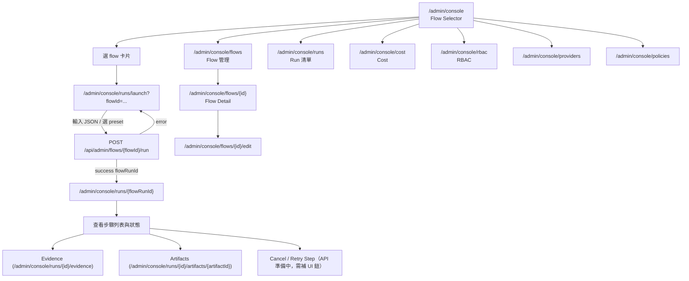

# Agent Console — Operational Runbook

> 這份文件同步到目前實作版：
> - 主要開關：`AGENT_CONSOLE_ENABLED=true`。
> - 可選頁面旗標：`AGENT_CONSOLE_RBAC`、`AGENT_CONSOLE_COST_DASHBOARD`、`AGENT_CONSOLE_FLOW_EDITOR`。
>   未設定時會沿用 `AGENT_CONSOLE_ENABLED` 的既有行為，不會額外關閉管理頁。

## 操作流程圖



## UI 覆蓋核對

依新規劃需求，以下頁面已可用：

- 已有 UI（可直接點開）：
  - `/admin/console`（Flow selector）
  - `/admin/console/runs/launch?flowId=`（啟動頁）
  - `/admin/console/runs/{id}`（Run timeline）
  - `/admin/console/flows`、`/admin/console/flows/{id}`、`/admin/console/flows/{id}/edit`
  - `/admin/console/providers`、`/admin/console/policies`
  - `/admin/console/rbac`、`/admin/console/rbac/users/{id}`、`/admin/console/rbac/roles/{id}`
  - `/admin/console/runs/{id}/evidence`、`/admin/console/runs/{id}/artifacts/{artifactId}`
  - `/admin/console/cost`（走查已對齊）
- 有 API 但未完整接上對應 UI 鈕或互動面：
  - Run timeline 的 Cancel、重試 step、SSE live 更新（目前頁面是 SSR 清單，不是即時流）
  - Flow selector 的「欄位化輸入表單」目前仍為 JSON 手動輸入
  - Artifact 的「Approve / Reject / Export」目前仍為只讀檢視（缺少操作按鈕）
  - Evidence 的「搜尋、衝突 resolve」目前未完整提供
- 規格路徑偏差需補齊：
  - 規格寫的是 `/admin/console/dashboard`，目前是 `/admin/console/cost`，已新增相容導向。

## Launch a Flow

1. Navigate to `/admin/console` and select a flow from the card list.
2. Click "Launch" → the launcher page at `/admin/console/runs/launch?flowId=<id>` opens.
3. Optionally select a preset (quick / deep / custom). The preset summary panel appears when `?presetId=<id>` is appended, showing provider routing, retry policy, and budget overrides.
4. Submit → creates a flow run via `POST /api/admin/flows/<id>/run`.

## Cancel a Run

```bash
curl -X POST https://quidproquo.cc/api/admin/flows/<flowId>/runs/<runId>/cancel \
  -b "session=<cookie>"
```

Or use the Cancel button in the Run Timeline page.

## Approve / Reject an Action

When a run pauses at a `human_approval` step:
1. Open `/admin/console/runs/<runId>` — the timeline shows a "Pending Approval" banner.
2. Click Approve or Reject.
3. Or via API:
```bash
curl -X POST .../api/admin/agents/approvals/<approvalId>/approve -b "session=<cookie>"
```

## Retry a Failed Step

From the Run Timeline page, click "Retry" on any failed step. This calls:
```bash
POST /api/admin/flows/<flowId>/runs/<runId>/retry-step { "stepId": "<step>" }
```

## Edit a Flow (YAML vs Visual)

- **YAML mode**: edit `flows/<id>.yaml` directly and redeploy.
- **Visual mode**: open `/admin/console/flows/<id>/edit`。若設定 `AGENT_CONSOLE_FLOW_EDITOR=false` 可關閉此入口檢查。

## Add a New User / Assign Roles

Requires `AGENT_CONSOLE_RBAC=true`. Use:
```sql
INSERT INTO console_user_roles (user_id, role, granted_by) VALUES (?, 'admin', ?);
```

## Read the Cost Dashboard

Navigate to `/admin/console/cost` (requires `AGENT_CONSOLE_COST_DASHBOARD=true`).
Key query:
```sql
SELECT agent_id, sum(cost_usd) total, avg(cost_usd) avg_cost
FROM agent_tool_calls WHERE created_at > unixepoch()-86400*7 GROUP BY agent_id;
```

## Backfill Cost Rollups

```bash
curl -X POST .../api/admin/console/cost/backfill?days=90 -b "session=<cookie>"
```

## Diagnose a Slow Page

1. Check Cloudflare Workers analytics for D1 query latency.
2. Run `EXPLAIN QUERY PLAN` on slow queries via `wrangler d1 execute`.
3. Add indexes if missing (see migration notes).
