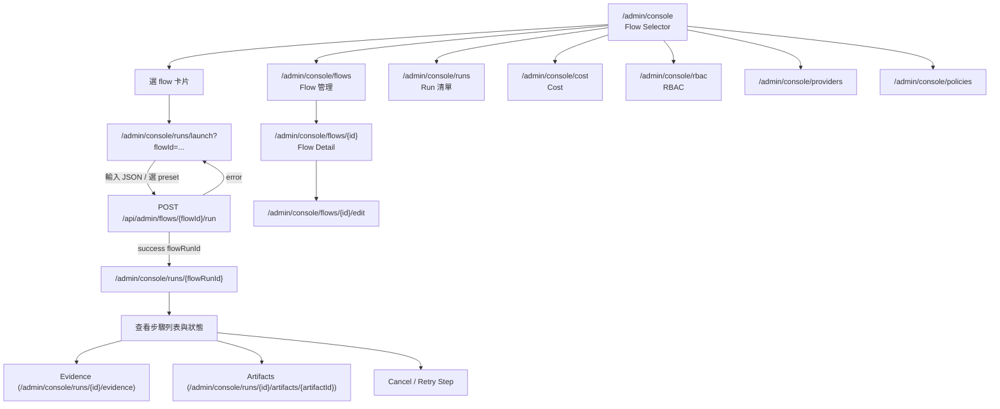

# Agent Console — Operational Runbook

> 這份文件同步到目前實作版：
> - 主要開關：`AGENT_CONSOLE_ENABLED=true`。
> - 可選頁面旗標：`AGENT_CONSOLE_RBAC`、`AGENT_CONSOLE_COST_DASHBOARD`、`AGENT_CONSOLE_FLOW_EDITOR`。
>   未設定時會沿用 `AGENT_CONSOLE_ENABLED` 的既有行為，不會額外關閉管理頁。

## 操作流程圖



## UI 覆蓋核對

依新規劃需求，以下頁面已可用：

- 已有 UI（可直接點開）：
  - `/admin/console`（Flow selector）
  - `/admin/console/runs/launch?flowId=`（啟動頁）
  - `/admin/console/runs/{id}`（Run timeline）
  - `/admin/console/flows`、`/admin/console/flows/{id}`、`/admin/console/flows/{id}/edit`
  - `/admin/console/providers`、`/admin/console/policies`
  - `/admin/console/rbac`、`/admin/console/rbac/users/{id}`、`/admin/console/rbac/roles/{id}`
  - `/admin/console/runs/{id}/evidence`、`/admin/console/runs/{id}/artifacts/{artifactId}`
  - `/admin/console/cost`（走查已對齊）
- 已有操作面（本機 Playwright focused suite 覆蓋）：
  - Run timeline：Cancel running/paused run、Retry failed/cancelled latest step attempt、SSE live step status update
  - Runs list：row-level Cancel
  - Artifact list/detail：Quick export、Approve / Reject、export history retry
  - Evidence：pending conflict CTA、single resolve、selected bulk dismiss
  - Cost：manual backfill preview、submit、failure history、repeat range
  - RBAC：create/edit/delete users and roles、role membership、permission add/edit/delete、permission presets、disable/re-enable user
- 尚可改善但不阻塞目前操作面：
  - Flow selector 的「欄位化輸入表單」目前仍以 JSON/manual schema-driven input 為主
  - Production/staging rollout、24h observe、dogfood log、archive gate 尚未完成，不能以本機測試假裝完成
- RBAC rollout 注意事項：
  - 權限矩陣已有本機單元測試覆蓋：RBAC flag bypass、wildcard grant、resource-specific grant、disabled user deny、wrong action deny。
  - 正式 flip `AGENT_CONSOLE_RBAC=true` 前仍需在 staging/prod 確認現有 admin session 都已 backfill 到 `admin` role。
- 規格路徑偏差需補齊：
  - 規格寫的是 `/admin/console/dashboard`，目前是 `/admin/console/cost`，已新增相容導向。

## Launch a Flow

1. Navigate to `/admin/console` and select a flow from the card list.
2. Click "Launch" → the launcher page at `/admin/console/runs/launch?flowId=<id>` opens.
3. Optionally select a preset (quick / deep / custom). The preset summary panel appears when `?presetId=<id>` is appended, showing provider routing, retry policy, and budget overrides.
4. Submit → creates a flow run via `POST /api/admin/flows/<id>/run`.

## Cancel a Run

Use either:

- Run Timeline: open `/admin/console/runs/<runId>` and click `取消執行`.
- Runs list: open `/admin/console/runs`, find the running row, and click the row-level cancel button.

API path used by the console:

```bash
curl -X POST https://quidproquo.cc/api/admin/console/runs/<runId>/cancel \
  -b "session=<cookie>"
```

## Approve / Reject an Action

When a run pauses at a `human_approval` step:
1. Open `/admin/console/runs/<runId>` — the timeline shows a "Pending Approval" banner.
2. Click Approve or Reject.
3. Or via API:
```bash
curl -X POST .../api/admin/agents/approvals/<approvalId>/approve -b "session=<cookie>"
```

## Retry a Failed Step

From the Run Timeline page, click `重試步驟` on the latest failed or cancelled step attempt. The button is hidden for superseded attempts and terminal runs. This calls:

```bash
POST /api/admin/console/runs/<runId>/steps/<stepRunId>/retry
```

## Edit a Flow (YAML vs Visual)

- **YAML mode**: edit `flows/<id>.yaml` directly and redeploy.
- **Visual mode**: open `/admin/console/flows/<id>/edit`。若設定 `AGENT_CONSOLE_FLOW_EDITOR=false` 可關閉此入口檢查。

## Add a New User / Assign Roles

Requires `AGENT_CONSOLE_RBAC=true`.

- Open `/admin/console/rbac?tab=users` to create users and assign initial roles.
- Open `/admin/console/rbac/users/<userId>` to edit email, assign/unassign roles, disable, re-enable, or delete a user.
- Open `/admin/console/rbac/roles/<roleId>` to edit role details, assign users, add/edit/delete permissions, or apply permission presets.

## Read the Cost Dashboard

Navigate to `/admin/console/cost` (requires `AGENT_CONSOLE_COST_DASHBOARD=true`).
Key query:
```sql
SELECT agent_id, sum(cost_usd) total, avg(cost_usd) avg_cost
FROM agent_tool_calls WHERE created_at > unixepoch()-86400*7 GROUP BY agent_id;
```

## Backfill Cost Rollups

Use `/admin/console/cost` and the Manual Backfill panel. Preset buttons fill common ranges; submit writes a status summary and a local history row. Failed history rows expose `重跑` to restore the exact range.

```bash
curl -X POST https://quidproquo.cc/api/admin/console/cost/backfill \
  -H "content-type: application/json" \
  -b "session=<cookie>" \
  --data '{"fromDay": 19700, "toDay": 19706}'
```

`fromDay` and `toDay` are UTC epoch-day integers.

## Resolve Evidence Conflicts

- Overview: `/admin/console/evidence` shows runs with pending conflicts and links directly to `/admin/console/runs/<runId>/evidence#conflicts`.
- Run detail: use the conflicts rail to accept the left claim, accept the right claim, mark as policy-resolved, or dismiss.
- For repeated low-value conflicts, select multiple cards and use the selected bulk action.

## Export / Review Artifacts

- Artifact list: use the row quick export action for the latest version.
- Artifact detail: `/admin/console/runs/<runId>/artifacts/<artifactId>` supports Approve / Reject, destination export, export history, and retry on failed exports.
- Failed export rows keep their destination so retry does not require re-selecting the target manually.

## Diagnose a Slow Page

1. Check Cloudflare Workers analytics for D1 query latency.
2. Run `EXPLAIN QUERY PLAN` on slow queries via `wrangler d1 execute`.
3. Add indexes if missing (see migration notes).
