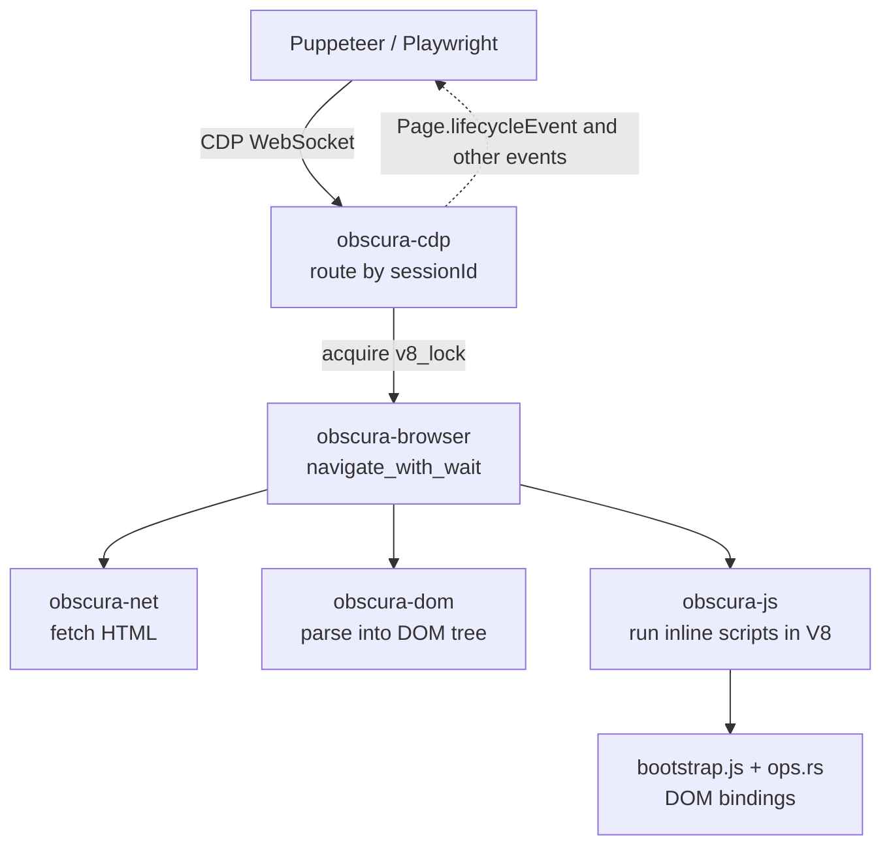

> 🌏 [中文版](/posts/ai/2026-09-28-obscura-rust-headless-browser)

The usual way to put an agent on the web is to start headless Chrome and drive it with [Puppeteer](https://pptr.dev/) or [Playwright](https://playwright.dev/). It works, but each Chrome process easily takes 200 MB of memory, so a hundred concurrent agents need a machine of their own. [Obscura](https://github.com/h4ckf0r0day/obscura) takes a different route: instead of wrapping Chrome, it is a browser engine written from scratch in Rust. It embeds V8 to run JavaScript and exposes the Chrome DevTools Protocol (CDP), so existing Puppeteer and Playwright scripts connect by changing one endpoint.

In its August 2026 [engineering post on Kitesurf](https://blog.cloudflare.com/kitesurf/), Cloudflare wrote that the first prototype of its own agent browser was a port of Obscura to Workers. The site's [September 13 daily report](/en/posts/daily/2026-09-13-ai-agent-daily-en) mentioned only its MCP server in a single line. This post covers the rest: how it is built, how to use it, how to read its numbers, and where it should not be trusted yet.

The short version: Obscura suits high-volume agent work that mostly extracts text and DOM. It does not suit work that needs pixel-exact rendering or the full Web API surface. It is an independent engine that is still changing fast, not a replacement for Chromium.

## What it is: a new engine, not a wrapper

Most "browser tools for agents" put an interface on top of Chromium. [Browser Use](/en/posts/ai/2026-08-21-browser-use-complete-guide-en) is an agent task loop, [Browserbase](/en/posts/ai/2026-08-22-browserbase-browser-infrastructure-en) is hosted Chrome infrastructure, and [Playwright MCP](https://github.com/microsoft/playwright-mcp) wraps Playwright as MCP tools. Underneath, all of them still run real Chrome.

Obscura replaces that layer. It implements its own DOM tree, HTML parsing, networking, cookies, and CSS layout and paint. Only the JavaScript engine comes from outside: V8, through [deno_core](https://github.com/denoland/deno_core). The project describes itself in one line:

> Obscura is a headless browser engine written in Rust, built for web scraping and AI agent automation.

It is licensed under Apache-2.0. The README says the team is building a hosted Obscura Cloud and promises the open-source engine will have "No feature gating, ever."

## Architecture: nine crates, one V8 isolate

According to the [Architecture overview](https://github.com/h4ckf0r0day/obscura/blob/main/docs/Architecture-overview.md), the workspace is split into nine crates by layer, and cross-crate calls go through the layer above rather than sideways:

| crate | Responsibility |
|---|---|
| `obscura-cli` | Entry point: `fetch`, `serve`, `scrape`, `mcp` |
| `obscura-cdp` | CDP WebSocket server and domain handlers |
| `obscura-browser` | Page, navigation, lifecycle events |
| `obscura-js` | V8 runtime, `bootstrap.js` and Rust ops |
| `obscura-dom` | DOM tree |
| `obscura-net` | HTTP client, stealth client, cookies, robots, tracker blocklist |
| `obscura-render` | CSS cascade, layout, text shaping, CPU paint |
| `obscura-mcp` | MCP server |
| `obscura` | Embeddable Rust library API |

Here is the path a Puppeteer `page.goto()` takes:



Two design decisions matter, because they set both Obscura's performance profile and its limits:

- **All pages in a process share one V8 isolate.** V8 is single-threaded, so all JS work takes a global lock first. That keeps memory low. The cost is that JS inside one process runs serially; for parallelism you start more worker processes (`--workers`, `scrape --concurrency`).
- **One page cannot take the process down.** Tokio timeouts cannot interrupt synchronous V8 execution, so a watchdog on a separate thread terminates the isolate when a script overruns its budget. Panics in DOM ops are caught and degrade to a null result. The default budget for the whole script phase is 30 seconds, tunable with `OBSCURA_SCRIPT_DEADLINE_MS`.

On the JS side, globals such as `document`, `window` and `fetch` are shims in `bootstrap.js` that call into Rust ops. That also explains the gaps in Web API coverage: every API is added by hand. The docs say, for example, that Web Workers are emulated inside the page runtime rather than running as separate isolates or threads.

## Three interfaces: CLI, CDP, MCP

Official releases ship executables for Linux, macOS and Windows, plus a Docker image (distroless, non-root). No Chrome or Node.js is needed.

**CLI: fetch one page or a batch**

```bash
# Get the title
obscura fetch https://example.com --eval "document.title"

# Wait for JS to settle, then output Markdown
obscura fetch https://example.com --wait-until networkidle0 --dump markdown

# Scrape with 25 parallel workers
obscura scrape url1 url2 url3 --concurrency 25 \
  --eval "document.querySelector('h1').textContent" --format json
```

`--dump` supports `html`, `text`, `links`, `markdown`, `assets` (every sub-resource the page would fetch) and `original` (the raw response body).

**CDP: plug in existing Puppeteer and Playwright scripts**

```bash
obscura serve --port 9222
```

```javascript
import puppeteer from 'puppeteer-core';

const browser = await puppeteer.connect({
  browserWSEndpoint: 'ws://127.0.0.1:9222/devtools/browser',
});
const page = await browser.newPage();
await page.goto('https://news.ycombinator.com');
```

With Playwright, use `chromium.connectOverCDP()`. This is not the full CDP: the [CDP table in the README](https://github.com/h4ckf0r0day/obscura#cdp-api) lists a subset of methods across Target, Page, Runtime, DOM, Network, Fetch, Input and other domains, plus its own `LP.getMarkdown`. A script that calls a method outside that list will fail.

**MCP: hand it straight to an agent**

```bash
claude mcp add obscura /path/to/obscura mcp
```

The MCP server keeps one live browser session, and tools act on the current page instead of taking a URL each call. The source registers 37 `browser_*` tools covering navigation, snapshots, Markdown extraction, form detection and filling, cookies and storage, and tab management. The [MCP docs](https://github.com/h4ckf0r0day/obscura/blob/main/docs/Use-the-MCP-server.md) warn that element references in a snapshot go stale after navigation, scrolling or a framework rerender, so take a fresh snapshot before each action.

## How to read the performance numbers

The comparison table at the top of the README looks great: 30 MB of memory against Chrome's 200+ MB, and 85 ms page loads against about 500 ms. Three things to know before reading them.

**First, they are all self-reported.** The full suite lives in [obscura-benchmark](https://github.com/h4ckf0r0day/obscura-benchmark), with methods and raw results public and rerunnable, which is to its credit. No independent third-party rerun has turned up so far.

**Second, they compare cold processes.** The benchmark repo states that the baseline starts a fresh Chrome process per page, and acknowledges that this is Chrome's worst case: production setups usually reuse one browser across tabs.

**Third, it does not win everything on real sites.** On 98 live public pages, the same report found that Obscura rendered 94 and Chrome 85, with median memory of about 64 MB against 201 MB. But median latency was 5.2 seconds against Chrome's 2.1, and Obscura is slower on heavy client-rendered SPAs.

On conformance, the full run on 2026-09-11 passed 83.3% of the core [WPT](https://github.com/web-platform-tests/wpt) subtests. "Core" is a scope the project defines itself (the DOM, HTML, URL and fetch areas that scraping relies on), which excludes layout, media and hardware tests. Counting everything, the rate is 67.6%.

For an outside reference, there are Cloudflare's measurements in the Kitesurf post. Kitesurf was inspired by Obscura but is a different engine, so its numbers do not transfer directly. They do show the typical trade-off of this design: 3–7x less CPU and memory than Chromium, but about 1.7x slower wall time, because a warm JIT beats a cold software renderer.

## Stealth mode: what it covers and what it doesn't

Built-in anti-detection is Obscura's other selling point. It requires a `-stealth` release build (or compiling with `--features stealth`) plus the `--stealth` flag at runtime. It does three things:

- Swaps the HTTP client for [wreq](https://github.com/0x676e67/wreq), so the TLS ClientHello, ALPN and cipher order look like real Chrome and match the User-Agent
- Masks common automation tells such as `navigator.webdriver` and the output of `Function.prototype.toString()`
- Ships a tracker blocklist of 3,520 domains, so analytics, ad and fingerprinting scripts never load

The [stealth docs](https://github.com/h4ckf0r0day/obscura/blob/main/docs/Configure-stealth-and-proxies.md) also list what it does not handle: Cloudflare interactive challenges, DataDome and Akamai active challenges, CAPTCHAs, and IP-based rate limiting.

Two points for readers to weigh:

- **The docs contradict each other.** The README says fingerprints are randomized per session, while the stealth docs say a single stable profile is the default and rotation is opt-in, because "one IP cycling through different identities is itself a signal." For actual behavior, go by the latter.
- **Every sponsor is a proxy vendor.** All four sponsors on the README are residential or mobile proxy services, complete with discount codes. That says nothing about the code, but it does mean the project's commercial incentives point toward getting past blocks, which is worth factoring in.

Getting past a site's bot protection can violate its terms of service. Obscura offers `--obey-robots` to respect robots.txt, but it is off by default; whether to turn it on, and which sites to fetch, is on the user. The site's post on [handing authenticated sites to agents](/en/posts/ai/2026-08-22-authenticated-web-agent-safety-en) covers permission boundaries in more depth.

## Security boundaries

Obscura runs untrusted page JavaScript in its own process. It adds several layers of protection:

- **Private networks are blocked by default.** Page content cannot reach loopback, RFC 1918 or link-local addresses, and this SSRF check also runs at DNS resolution time. Testing a local dev server requires an explicit `--allow-private-network`.
- **The MCP HTTP transport binds 127.0.0.1 by default.** Binding any other interface requires an `OBSCURA_MCP_TOKEN` of at least 32 bytes, or the server refuses to start.
- **The Docker image does not run as root** and has no shell or package manager.

But [SECURITY.md](https://github.com/h4ckf0r0day/obscura/blob/main/SECURITY.md) is explicit that these in-process measures "do not claim to contain a hostile page that achieves native code execution through a V8 exploit." To run untrusted sites at scale, put it in a container or VM with restricted egress, just as you would headless Chrome.

## Compared with the alternatives

| | Obscura | [Lightpanda](https://github.com/lightpanda-io/browser) | headless Chrome + Playwright | [Browserbase](/en/posts/ai/2026-08-22-browserbase-browser-infrastructure-en) |
|---|---|---|---|---|
| Engine | Custom (Rust) + V8 | Custom (Zig) + V8 | Chromium | Hosted Chromium |
| Deployment | Single binary / Docker | Single binary / Docker | Install Chrome yourself | Cloud API |
| Interfaces | CDP, MCP, CLI | CDP, WebDriver BiDi, MCP, CLI | CDP / Playwright protocol | CDP, SDK |
| Screenshots / PDF | Yes (own CSS layout and paint) | Yes, but the README calls it a text-only rendering | Full | Full |
| Web compatibility | Most, gaps in the long tail | Most, gaps in the long tail | Most complete | Most complete |
| Resource use | Lowest tier | Lowest tier | High | Not on your machine |

Lightpanda is the closest rival: also written from scratch, also embedding V8, also speaking CDP, and also shipping an MCP server, with a [README](https://github.com/lightpanda-io/browser#benchmarks) that claims about 16x less memory than Chromium. The main differences are the language (Rust versus Zig), Obscura's TLS-fingerprint-level stealth, and Obscura's own CSS layout and painter, which draws real screenshots. Lightpanda adds WebDriver BiDi and a built-in agent mode. Both projects publish only their own benchmarks, so run each against your own URL list before comparing.

## Where it fits and where it doesn't

**Good fit:**

- High-volume extraction of text, links and Markdown for LLMs, mostly from content pages
- Many concurrent agent sessions on one machine, where memory is the bottleneck
- Adding a local browser to an MCP client such as Claude Code or Cursor without installing Chrome
- Trying a cheaper engine under existing Puppeteer or Playwright scripts

**Poor fit:**

- Screenshots that must match real Chrome exactly, such as visual regression tests
- Sites that depend on video playback, WebGL (`getContext('webgl')` currently returns null) or complex Web Workers
- Scripts that call CDP methods it has not implemented
- Targets behind Cloudflare interactive challenges or CAPTCHAs, which stealth does not handle anyway

## Something to try tonight

If you already have a Puppeteer scraper, the cheapest test is this: download a release binary, run `obscura serve --port 9222`, change `puppeteer.launch()` to `puppeteer.connect({ browserWSEndpoint: 'ws://127.0.0.1:9222/devtools/browser' })`, then run it over twenty URLs you normally fetch and compare output and memory. Gaps tend to show up first on heavy SPAs and obscure Web APIs.

## Overall

Obscura's core trade-off is clear: give up Chromium's full compatibility and pixel accuracy in exchange for a browser that needs tens of megabytes per process and no Chrome install. Most agent tasks need DOM and text, not a perfect picture, so the trade-off is reasonable. That is also why Cloudflare used it as Kitesurf's starting point.

The risks are just as clear: it is an independent engine still merging fixes daily, its performance numbers are self-reported, its stealth docs contradict each other, and its sponsors are proxy vendors. Treat it as an engine to try under certain workloads, not as a drop-in replacement for Chrome.

## References

- [Obscura — GitHub](https://github.com/h4ckf0r0day/obscura)
- [Obscura: Architecture overview](https://github.com/h4ckf0r0day/obscura/blob/main/docs/Architecture-overview.md)
- [Obscura: Use the MCP server](https://github.com/h4ckf0r0day/obscura/blob/main/docs/Use-the-MCP-server.md)
- [Obscura: Configure stealth and proxies](https://github.com/h4ckf0r0day/obscura/blob/main/docs/Configure-stealth-and-proxies.md)
- [Obscura: SECURITY.md](https://github.com/h4ckf0r0day/obscura/blob/main/SECURITY.md)
- [obscura-benchmark — GitHub](https://github.com/h4ckf0r0day/obscura-benchmark)
- [Introducing Kitesurf — Cloudflare Blog](https://blog.cloudflare.com/kitesurf/)
- [Lightpanda — GitHub](https://github.com/lightpanda-io/browser)
- [Playwright MCP — GitHub](https://github.com/microsoft/playwright-mcp)
- [deno_core — GitHub](https://github.com/denoland/deno_core)
- [wreq — GitHub](https://github.com/0x676e67/wreq)
- [web-platform-tests — GitHub](https://github.com/web-platform-tests/wpt)
- [Puppeteer](https://pptr.dev/)
- [Playwright](https://playwright.dev/)
- [Browser Use Complete Guide: The Agent Loop Behind Browser Automation](/en/posts/ai/2026-08-21-browser-use-complete-guide-en)
- [Browserbase: Turning Agent Browsers into Operable Infrastructure](/en/posts/ai/2026-08-22-browserbase-browser-infrastructure-en)
- [Giving an Agent Access to Logged-In Websites: Sessions, Permissions, and Automation Boundaries](/en/posts/ai/2026-08-22-authenticated-web-agent-safety-en)
- [AI Daily — 2026-09-13](/en/posts/daily/2026-09-13-ai-agent-daily-en)
