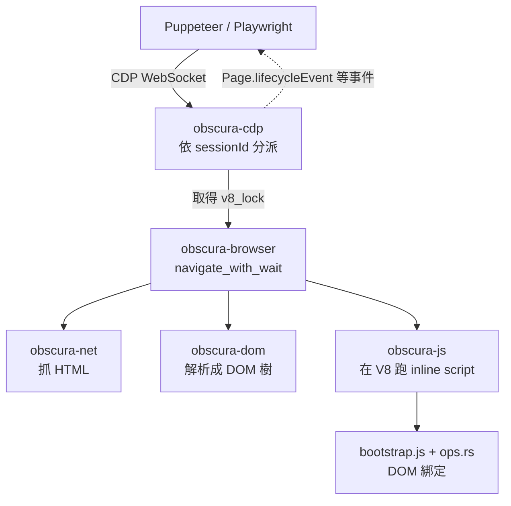

> 🌏 [English version](/en/posts/ai/2026-09-28-obscura-rust-headless-browser-en)

讓 agent 上網，最常見的做法是開一個 headless Chrome，再用 [Puppeteer](https://pptr.dev/) 或 [Playwright](https://playwright.dev/) 去操作它。這條路很穩，但每個 Chrome 行程動輒吃掉兩百 MB 記憶體，同時開一百個 agent 就是一台機器的事。[Obscura](https://github.com/h4ckf0r0day/obscura) 走另一條路：不包 Chrome，而是用 Rust 從頭寫一個瀏覽器引擎，內嵌 V8 跑 JavaScript，對外講 Chrome DevTools Protocol（CDP），讓現有的 Puppeteer／Playwright 腳本改一行連線位址就能接上。

Cloudflare 在 2026 年 8 月的 [Kitesurf 工程文章](https://blog.cloudflare.com/kitesurf/)裡寫到，他們自己的 agent 瀏覽器最早的原型，就是拿 Obscura 移植到 Workers 上做出來的。站內 [9 月 13 日的日報](/posts/daily/2026-09-13-ai-agent-daily)只用一句話帶過它的 MCP server，這篇補上完整的拆解：它怎麼組成、怎麼用、數字該怎麼讀、哪些地方還不能信任。

先講結論：Obscura 適合大量、以擷取文字與 DOM 為主的 agent 工作，不適合需要像素級正確或完整 Web API 的場景。它是一個還在快速變動的獨立引擎，不是 Chromium 的替代品。

## 它是什麼：重寫引擎，不是包一層

多數「給 agent 用的瀏覽器工具」其實是 Chromium 外面加一層介面：[Browser Use](/posts/ai/2026-08-21-browser-use-complete-guide) 是 agent 任務迴圈、[Browserbase](/posts/ai/2026-08-22-browserbase-browser-infrastructure) 是託管的 Chrome 基礎設施、[Playwright MCP](https://github.com/microsoft/playwright-mcp) 是把 Playwright 包成 MCP 工具。底下跑的都還是真正的 Chrome。

Obscura 把底層換掉了。它自己實作 DOM 樹、HTML 解析、網路層、cookie、CSS 排版與繪製，只有 JavaScript 引擎直接用 V8（透過 [deno_core](https://github.com/denoland/deno_core)）。官方的一句話定位是：

> Obscura is a headless browser engine written in Rust, built for web scraping and AI agent automation.

授權是 Apache-2.0。README 提到團隊在做託管版 Obscura Cloud，但承諾開源引擎「No feature gating, ever」。

## 架構：九個 crate、一個 V8 isolate

依 [Architecture overview](https://github.com/h4ckf0r0day/obscura/blob/main/docs/Architecture-overview.md)，整個 workspace 按層拆成九個 crate，跨層呼叫只能往上一層走：

| crate | 負責 |
|---|---|
| `obscura-cli` | 指令入口：`fetch`、`serve`、`scrape`、`mcp` |
| `obscura-cdp` | CDP WebSocket server 與各 domain 的處理 |
| `obscura-browser` | Page、導航、生命週期事件 |
| `obscura-js` | V8 runtime、`bootstrap.js` 與 Rust ops |
| `obscura-dom` | DOM 樹 |
| `obscura-net` | HTTP client、stealth client、cookie、robots、tracker 黑名單 |
| `obscura-render` | CSS cascade、排版、文字排印、CPU 繪製 |
| `obscura-mcp` | MCP server |
| `obscura` | 可嵌入的 Rust library API |

一個 Puppeteer 的 `page.goto()` 進來，走的路是這樣：



有兩個設計決定值得知道，因為它們直接決定了 Obscura 的效能特性與限制：

- **同一個行程裡的所有頁面共用一個 V8 isolate**。V8 是單執行緒的，所以所有 JS 工作都要先搶一把全域鎖。好處是記憶體很省；代價是單一行程裡的 JS 是序列化執行，想要平行就得開多個 worker 行程（`--workers`、`scrape --concurrency`）。
- **一個頁面不能拖垮整個行程**。V8 的同步執行沒辦法被 tokio 的 timeout 打斷，所以它另開一條執行緒當 watchdog，腳本超過預算就直接終止 isolate；DOM op 的 panic 會被接住、降級成回傳 null。預設整段腳本執行上限是 30 秒，可用 `OBSCURA_SCRIPT_DEADLINE_MS` 調。

JS 這一側的 `document`、`window`、`fetch` 等全域物件，都是 `bootstrap.js` 裡的 shim，實際動作再呼叫 Rust op。這也說明了為什麼它的 Web API 覆蓋會有缺口：每一個 API 都是手工補上去的。例如文件就寫明，Web Worker 是在同一個頁面 runtime 裡模擬的，不是獨立的 isolate 或執行緒。

## 三種用法：CLI、CDP、MCP

官方 release 提供 Linux、macOS、Windows 的執行檔，也有 Docker image（跑在 distroless、非 root）。不需要 Chrome 或 Node.js。

**CLI：一次抓一頁或一批頁**

```bash
# 取標題
obscura fetch https://example.com --eval "document.title"

# 等 JS 跑完再輸出成 Markdown
obscura fetch https://example.com --wait-until networkidle0 --dump markdown

# 25 個 worker 平行抓
obscura scrape url1 url2 url3 --concurrency 25 \
  --eval "document.querySelector('h1').textContent" --format json
```

`--dump` 支援 `html`、`text`、`links`、`markdown`、`assets`（列出頁面會抓的所有子資源）與 `original`（原始回應內容）。

**CDP：接現有的 Puppeteer／Playwright 腳本**

```bash
obscura serve --port 9222
```

```javascript
import puppeteer from 'puppeteer-core';

const browser = await puppeteer.connect({
  browserWSEndpoint: 'ws://127.0.0.1:9222/devtools/browser',
});
const page = await browser.newPage();
await page.goto('https://news.ycombinator.com');
```

Playwright 則是 `chromium.connectOverCDP()`。要注意這不是完整的 CDP：[README 的 CDP 表](https://github.com/h4ckf0r0day/obscura#cdp-api)列出它實作了 Target、Page、Runtime、DOM、Network、Fetch、Input 等 domain 的部分方法，另外加了自己的 `LP.getMarkdown`。腳本若用到清單外的方法，就會失敗。

**MCP：直接給 agent 用**

```bash
claude mcp add obscura /path/to/obscura mcp
```

MCP server 維持一個持續存在的瀏覽器 session，工具作用在「目前這一頁」，而不是每次都傳 URL。原始碼裡共註冊 37 個 `browser_*` 工具，涵蓋導航、快照、Markdown 擷取、表單偵測與填寫、cookie／storage、分頁管理。[MCP 文件](https://github.com/h4ckf0r0day/obscura/blob/main/docs/Use-the-MCP-server.md)特別提醒：快照裡的元素 reference 在導航、捲動或前端框架重新渲染後就會失效，每次行動前要重新拿快照。

## 效能數字怎麼讀

README 首頁的對照表寫得很漂亮：記憶體 30 MB 對 Chrome 的 200+ MB、頁面載入 85 ms 對約 500 ms。讀這些數字要先知道三件事。

**第一，全部是自家測的。**完整測試集放在 [obscura-benchmark](https://github.com/h4ckf0r0day/obscura-benchmark)，方法與原始結果都公開、可以自己重跑，這點值得肯定；但目前查不到第三方的獨立複測。

**第二，比的是冷啟動行程。**benchmark repo 自己寫明，對照組是「每頁開一個新的 Chrome 行程」，也承認這是 Chrome 的最壞情況，正式環境通常會重複使用同一個 browser、開多個分頁。

**第三，真實網站上不是每項都贏。**同一份報告在 98 個真實公開頁面上測得：Obscura 渲染成功 94 頁、Chrome 85 頁，記憶體中位數約 64 MB 對 201 MB；但延遲中位數是 5.2 秒對 Chrome 的 2.1 秒，重度前端渲染的 SPA 上 Obscura 比較慢。

標準一致性方面，2026-09-11 那次完整測試的 [WPT](https://github.com/web-platform-tests/wpt) 核心子測試通過率是 83.3%。這個「核心」是它自己定義的範圍（DOM／HTML／URL／fetch 這類擷取會用到的部分），把排版、媒體、硬體相關的測試排除在外；全部算進去是 67.6%。

可以拿來對照的外部數字，是 Cloudflare 在 Kitesurf 文章裡的量測。Kitesurf 雖然是從 Obscura 啟發、但已經是另一套引擎，數字不能直接套用；它呈現的是同一類設計的典型取捨：CPU 與記憶體比 Chromium 省 3–7 倍，但實際等待時間反而慢約 1.7 倍，因為熱機的 JIT 贏過冷啟動的軟體繪製。

## Stealth 模式：能擋什麼、不能擋什麼

Obscura 的另一個賣點是內建反偵測。要用 stealth 必須下載 `-stealth` 版本的執行檔（或自己加 `--features stealth` 編譯），再在執行時加上 `--stealth`。它做的事情是：

- 把 HTTP client 換成 [wreq](https://github.com/0x676e67/wreq)，讓 TLS ClientHello、ALPN、cipher 順序看起來像真的 Chrome，跟 User-Agent 對得上
- 修掉常見的自動化痕跡，例如 `navigator.webdriver`、`Function.prototype.toString()` 的輸出
- 內建 3,520 個網域的 tracker 黑名單，直接不載入分析、廣告與指紋腳本

[Stealth 文件](https://github.com/h4ckf0r0day/obscura/blob/main/docs/Configure-stealth-and-proxies.md)也老實列出擋不住的東西：Cloudflare 的互動式驗證、DataDome 與 Akamai 的主動挑戰、CAPTCHA，以及 IP 層級的流量限制。

有兩點讀者自己要判斷：

- **文件前後不一致**。README 寫的是「每個 session 隨機化指紋」，但 stealth 文件寫的是預設只用一組固定 profile、輪換要手動開，理由是「同一個 IP 一直換身分本身就是訊號」。以程式行為為準，應該看後者。
- **贊助商都是代理 IP 商**。README 首頁的四個贊助商全部是住宅／行動代理服務，還附了折扣碼。這不影響程式本身，但代表專案的商業誘因偏向「繞過封鎖」這個方向，評估時要放進考量。

繞過網站的機器人防護，可能違反對方的服務條款。Obscura 提供 `--obey-robots` 讓你遵守 robots.txt，但預設是關的；要不要開、要抓哪些站，是使用者自己的責任。站內的[需要登入的網站怎麼交給 Agent](/posts/ai/2026-08-22-authenticated-web-agent-safety)有談到更完整的權限邊界。

## 安全邊界

Obscura 在自己的行程裡執行不受信任網頁的 JavaScript。它做了幾層防護：

- **預設封鎖私有網段**：網頁內容打不到 loopback、RFC 1918、link-local 位址，這層 SSRF 防護在 DNS 解析時也會檢查。要測本機開發伺服器得明確加上 `--allow-private-network`。
- **MCP 的 HTTP 模式預設只綁 127.0.0.1**。要綁到其他介面，必須設定至少 32 bytes 的 `OBSCURA_MCP_TOKEN`，不然會直接拒絕啟動。
- **Docker image 不以 root 執行**，也沒有 shell 與套件管理工具。

但 [SECURITY.md](https://github.com/h4ckf0r0day/obscura/blob/main/SECURITY.md) 講得很清楚，這些行程內的防護「不宣稱能擋住透過 V8 漏洞取得原生程式碼執行的惡意網頁」。如果要大量跑不受信任的網站，還是要放進容器或 VM，並限制對外網路，跟跑 headless Chrome 一樣。

## 跟替代方案比

| | Obscura | [Lightpanda](https://github.com/lightpanda-io/browser) | headless Chrome + Playwright | [Browserbase](/posts/ai/2026-08-22-browserbase-browser-infrastructure) |
|---|---|---|---|---|
| 引擎 | 自寫（Rust）＋ V8 | 自寫（Zig）＋ V8 | Chromium | 託管的 Chromium |
| 部署 | 單一執行檔／Docker | 單一執行檔／Docker | 自己裝 Chrome | 雲端 API |
| 對外介面 | CDP、MCP、CLI | CDP、WebDriver BiDi、MCP、CLI | CDP／Playwright 協定 | CDP、SDK |
| 截圖／PDF | 有（自寫 CSS 排版與繪製） | 有，但 README 註明是文字版的渲染 | 完整 | 完整 |
| 網頁相容性 | 大部分，長尾會缺 | 大部分，長尾會缺 | 最完整 | 最完整 |
| 資源用量 | 最低一檔 | 最低一檔 | 高 | 不在你的機器上 |

Lightpanda 是最接近的對手：同樣從頭寫、同樣內嵌 V8、同樣講 CDP，也同樣內建 MCP server，[README](https://github.com/lightpanda-io/browser#benchmarks) 主打記憶體比 Chromium 少約 16 倍。兩者的差別主要在語言（Rust 對 Zig）、Obscura 內建 TLS 指紋層級的 stealth，以及 Obscura 有自己的 CSS 排版與繪製器，截圖是真的把頁面畫出來；Lightpanda 則多了 WebDriver BiDi 與內建的 agent 模式。兩邊的 benchmark 都是自家測的，互相比較前最好用自己的網址清單各跑一次。

## 適合與不適合

**適合**：

- 大量擷取文字、連結、Markdown 給 LLM 用，網頁以內容頁為主
- 一台機器上要同時開很多 agent session，記憶體是瓶頸
- 想在 Claude Code、Cursor 這類 MCP client 裡快速加一個本機瀏覽器，不想裝 Chrome
- 已經有 Puppeteer／Playwright 腳本，想低成本試試看換引擎

**不適合**：

- 需要截圖跟真實 Chrome 一模一樣，例如視覺回歸測試
- 網站依賴影片播放、WebGL（目前 `getContext('webgl')` 直接回傳 null）、複雜的 Web Worker
- 腳本用到它沒實作的 CDP 方法
- 目標網站有 Cloudflare 互動驗證或 CAPTCHA，stealth 本來就不處理

## 今晚就能做的事

如果你已經有一支 Puppeteer 爬蟲，最省事的驗證方式是：下載 release 執行檔、跑 `obscura serve --port 9222`，把 `puppeteer.launch()` 改成 `puppeteer.connect({ browserWSEndpoint: 'ws://127.0.0.1:9222/devtools/browser' })`，拿你平常抓的二十個網址各跑一次，比較輸出內容和記憶體用量。有缺的地方，通常會先出現在重度 SPA 與冷門的 Web API 上。

## 整體來說

Obscura 的核心取捨很清楚：放棄 Chromium 的完整相容與像素精準，換到一個行程只要幾十 MB、不用裝 Chrome 的瀏覽器。對 agent 來說，多數任務要的是 DOM 與文字，而不是完美的畫面，這個取捨是合理的；Cloudflare 會拿它當 Kitesurf 的起點，也是看中同一件事。

它的風險同樣清楚：這是一個還在每天合併修正的獨立引擎，效能數字都是自家測的，stealth 的說明前後不一致，商業贊助偏向代理 IP。把它當成「某些工作負載可以換上去試的引擎」，而不是「Chrome 的直接替代品」，會是比較安全的定位。

## 參考資料

- [Obscura — GitHub](https://github.com/h4ckf0r0day/obscura)
- [Obscura：Architecture overview](https://github.com/h4ckf0r0day/obscura/blob/main/docs/Architecture-overview.md)
- [Obscura：Use the MCP server](https://github.com/h4ckf0r0day/obscura/blob/main/docs/Use-the-MCP-server.md)
- [Obscura：Configure stealth and proxies](https://github.com/h4ckf0r0day/obscura/blob/main/docs/Configure-stealth-and-proxies.md)
- [Obscura：SECURITY.md](https://github.com/h4ckf0r0day/obscura/blob/main/SECURITY.md)
- [obscura-benchmark — GitHub](https://github.com/h4ckf0r0day/obscura-benchmark)
- [Introducing Kitesurf — Cloudflare Blog](https://blog.cloudflare.com/kitesurf/)
- [Lightpanda — GitHub](https://github.com/lightpanda-io/browser)
- [Playwright MCP — GitHub](https://github.com/microsoft/playwright-mcp)
- [deno_core — GitHub](https://github.com/denoland/deno_core)
- [wreq — GitHub](https://github.com/0x676e67/wreq)
- [web-platform-tests — GitHub](https://github.com/web-platform-tests/wpt)
- [Puppeteer](https://pptr.dev/)
- [Playwright](https://playwright.dev/)
- [Browser Use 完整介紹：讓 AI Agent 操作瀏覽器的任務迴圈](/posts/ai/2026-08-21-browser-use-complete-guide)
- [Browserbase：把 Agent 的瀏覽器拆成可營運的基礎設施](/posts/ai/2026-08-22-browserbase-browser-infrastructure)
- [需要登入的網站怎麼交給 Agent：Session、權限與自動化邊界](/posts/ai/2026-08-22-authenticated-web-agent-safety)
- [AI 日報 — 2026-09-13](/posts/daily/2026-09-13-ai-agent-daily)
