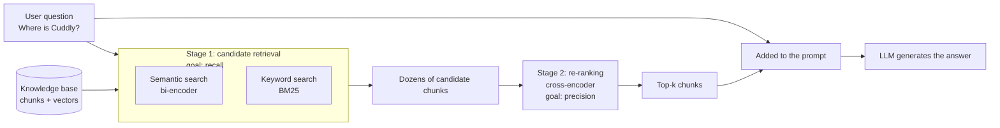
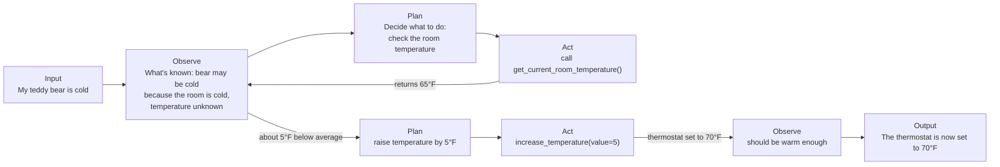

> 🌏 [中文版](/posts/ai/2026-09-29-cme295-agentic-llms)

**Video status: Videos included.** [Source details](#course-video-sources)

This post covers Lecture 7 of Stanford [CME295](/posts/ai/2026-09-29-stanford-cme295-transformers-llms-en), "Agentic LLMs," from the 2025 edition (November 14, 2025). The main source is the [151-page slide deck](https://cme295.stanford.edu/slides/fall25-cme295-lecture7.pdf); the recording is on [YouTube](https://www.youtube.com/watch?v=h-7S6HNq0Vg) (1h49m). Everything here comes from what is written on the slides; nothing said only out loud in class is included.

The previous lecture on [reasoning models](/posts/ai/2026-09-29-cme295-llm-reasoning-en) tackled the first LLM weakness, limited reasoning. This lecture's opening slide lists the rest: knowledge is static, the model cannot perform actions, and it is hard to evaluate. The first two are today's topic; the last is left for [Lecture 8](/posts/ai/2026-09-29-cme295-llm-evaluation-en). The three fixes stack on top of each other:

| Weakness | This lecture's fix | In one line |
|---|---|---|
| Knowledge limited to pretraining data | RAG | Look it up in a knowledge base before answering |
| Can't take actions | Tool calling | The model writes a function call; a backend runs it |
| One call isn't enough | Agents (ReAct) | Chain lookups and calls into a loop until the task is done |

The lecture keeps Lecture 1's teddy bear. "Where is Cuddly?", "Find a bear near me!", and "My teddy bear is cold." map to the three parts.

## Course video sources

The videos below come from Stanford Online’s official CME295 Autumn 2025 playlist; on 2026-10-10 the lecture title and video ID were checked live against the playlist and match.

```youtube
url: https://www.youtube.com/watch?v=h-7S6HNq0Vg
title: Stanford CME295 Transformers & LLMs | Autumn 2025 | Lecture 7 - Agentic LLMs
```

Original videos: [Stanford CME295 Transformers & LLMs | Autumn 2025 | Lecture 7 - Agentic LLMs](https://www.youtube.com/watch?v=h-7S6HNq0Vg)

Content check: verified against the video transcript (2026-10-10): sampled the beginning, middle and end of the transcript, searched keywords, and compared against the chapter list in the video description (not a word-by-word comparison). The video is Autumn 2025 Lecture 7, Agentic LLMs (page date 2025-11-14, length 1:49:22, matching the post's "1 hour 49 minutes"). Its chapters are RAG (SBERT/bi-encoders, BM25, HyDE and contextual retrieval, prompt caching, cross-encoder re-ranking, NDCG/MRR), tool calling, tool selection, MCP, ReAct agents, and safety, consistent with the post's sections. The post cites only the slides and does not relay spoken remarks, so there were no spoken claims to check.

Course and recording entries:

- [Official course / lecture source](https://cme295.stanford.edu/syllabus/2025/)
- [CME295 Autumn 2025 playlist (Stanford Online, 9 videos)](https://www.youtube.com/playlist?list=PLoROMvodv4rOCXd21gf0CF4xr35yINeOy)

Checked: 2026-10-10.

## RAG: look it up before answering

### Why not just put everything in the prompt

The slides give four reasons:

- **Knowledge has a cutoff**: the model only knows what was in its pretraining data; the slide shows the knowledge-cutoff line from the GPT-5 model card
- **Context is finite**: past a certain size, the data doesn't fit
- **Models get distracted by irrelevant information**: citing the [Needle in a Haystack](https://github.com/gkamradt/LLMTest_NeedleInAHaystack) pressure tests, which hide one key fact in a pile of unrelated text and check whether the model finds it
- **Pricing is per token**: the more you stuff in, the more every call costs

So even with a big context window, picking the relevant pieces first is still the better deal. That trade-off is exactly what final exam question III.9 asks about.

### Retrieve, Augment, Generate

The name RAG comes from [Lewis et al. (2020)](https://arxiv.org/abs/2005.11401). The slides split it into three steps: **retrieve** relevant documents from the knowledge base, **augment** the prompt with what was retrieved, and let the LLM **generate** the answer. Almost all of the lecture's time goes to the first step.

Before you can retrieve anything you need a knowledge base, built in three moves:

1. **Collect**: gather the documents
2. **Divide**: split them into chunks
3. **Embed**: turn each chunk into a vector

The slides name three hyperparameters to tune: embedding size, chunk size, and overlap between chunks.

### Two-stage retrieval



**Stage 1: candidate retrieval, cast a wide net.** The goal is recall: don't miss anything relevant. The slides list three methods:

- **Semantic search**: encode the query and each chunk into vectors separately and compare them. This setup is a bi-encoder; the example is [Sentence-BERT](https://arxiv.org/abs/1908.10084). Chunk vectors can be computed ahead of time, so lookup is fast
- **Keyword matching**: a classic algorithm like BM25 that compares the literal words
- **Hybrid**: combine both scores

The slide's example query is "Where is Cuddly?", and the candidate chunks include "he was in a cuddly mood." It contains the word *cuddly* but has nothing to do with the bear named Cuddly, which is the kind of distinction retrieval has to get right.

Stage 1 has two add-ons:

- **[HyDE](https://arxiv.org/abs/2212.10496)**: queries are short questions and documents are statements, so their embeddings don't look alike to begin with. HyDE first has an LLM write a fake answer ("Cuddly is in…") and searches with that fake document instead, narrowing the gap
- **[Contextual Retrieval](https://www.anthropic.com/news/contextual-retrieval)**: proposed by Anthropic in 2024. A chunk read on its own often lacks its surrounding context, so you give an LLM the whole document plus the chunk, ask it for a sentence or two situating the chunk within the document, and prepend that before embedding. The slide reproduces Anthropic's prompt verbatim and notes that since the whole document is sent over and over, prompt caching keeps the cost down. In Anthropic's own experiments, contextual embeddings plus contextual BM25 cut the top-20 retrieval failure rate by 49%, and adding re-ranking cut it by 67% (these figures are from Anthropic's post, not the slides)

**Stage 2: re-ranking, keep only the best.** Now the goal is precision. With only a few dozen candidates left, you can afford a more expensive cross-encoder: concatenate the query and a chunk, feed them through a single encoder, and read off a relevance score. Because every pair is recomputed, it can't run over the whole knowledge base. The slide shows a re-ranker turning the order d, b, a, c into a, b, c, d, and recommends [SBERT's Cross-Encoders page](https://sbert.net/examples/cross_encoder/applications/README.html) as further reading.

### How do you know retrieval is working

You check how many of the top-k chunks are actually relevant. The slides list four metrics: NDCG@k, RR@k, Recall@k, and Precision@k.

<details>
<summary>Definitions of the four metrics</summary>

```
Precision@k = relevant items in top k / k
Recall@k    = relevant items in top k / total relevant chunks
RR@k        = 1 / (rank of the first relevant chunk)     0 if none in top k

DCG@k  = Σ_{i=1..k} rel_i / log2(i + 1)
NDCG@k = DCG@k / IDCG@k                                  IDCG@k = DCG@k of a perfect ranking
```

- Precision and Recall only care whether something was retrieved, not where it ranked
- RR only cares how high the first relevant result sits
- NDCG discounts lower positions more heavily, then divides by the perfect-ranking score so it falls between 0 and 1

</details>

This site has a whole series on RAG variants; start with [The Complete Guide to RAG System Patterns](/posts/ai/2026-03-14-rag-patterns-complete-guide-en). Implementation details for Contextual Retrieval are in [this post](/posts/ai/2026-03-12-contextual-retrieval-en).

## Tool calling: the model writes a function call

RAG suits unstructured text. When the data lives in a table, it's more natural to write a `get_data(id, field)` function and let the model call it. The slides quote [IBM's definition](https://www.ibm.com/think/topics/tool-calling): tool calling "allows autonomous systems to complete complex tasks by dynamically accessing and [may act] upon external resources."

Given "Find a bear near me!", a plain LLM can only say it doesn't know which bears are nearby. With tools, the slides show a complete `find_teddy_bear(location)`: it calls an external API for the closest bear, computes the distance with geopy, and returns a name, distance, and mood. The slide marks three properties of a good tool: a descriptive, well-documented API; (optionally) some backend call; and it returns some information.

### Three steps, and the model isn't the one executing

1. **The LLM finds the arguments**: after reading the function description and the user's message, it outputs "call `find_teddy_bear()` with `location = (37.42, -122.17)`"
2. **The backend executes**: the function is actually called by the backend, which gets back `{"name": "Teddy", …}`
3. **The LLM draws a conclusion from the result**: it reads the return value and writes the answer for the user

From start to finish the model only produces text; the system runs the function on its behalf. Final exam question III.4 tests exactly this.

### How to teach a model to use tools

- **Method 1: training.** Build SFT data with two kinds of targets: "tool prediction" (given the function API and the request, output the right call and arguments) and "response generation" (given the conversation so far plus the tool's return value, output the final answer). The slides show several examples, such as the same tool with "Find a bear in Paris!" needing Paris coordinates
- **Method 2: prompting.** Put the function API in the prompt along with a detailed explanation of how to use it. How do you write that explanation? One way the slides suggest: use SFT pairs as an evaluation set and have a powerful reasoning model write it for you

Common tools fall into three groups: **information** (web or database search, weather and stock trackers, codebases), **computation** (a calculator, code execution, often Python), and **action** (sending emails or messages and other in-computer actions).

### Many tools, new problems

A real assistant has many tools; the slide draws six: find a bear, hug a bear, check a bear's mood, send a gift, schedule a playdate, send a message. The challenges follow:

- More tools means worse performance
- Context length is finite, so listing them all doesn't scale
- Every tool needs a definition written by someone, which is a lot of work

The fix for the first is **tool selection**: a router first picks the few tools likely to matter for this request and only those APIs go to the LLM. The slides cite a [2024 technical disclosure by Robert et al.](https://www.tdcommons.org/dpubs_series/7521/) aimed at cutting latency and improving performance at the same time.

The fix for the third is standardization. The slide shows three LLMs each wired to three tools, every connection written separately. [MCP (Model Context Protocol)](https://www.anthropic.com/news/model-context-protocol), introduced by Anthropic in 2024, lets tools and data connect to any LLM the same way. Per the [MCP architecture docs](https://modelcontextprotocol.io/docs/learn/architecture), there are three roles:

- **MCP host**: the application the user works in, such as Claude Desktop
- **MCP client**: the component inside the host that holds a connection to one server
- **MCP server**: exposes three kinds of things: tools, prompts, and resources

The slide's example asks Claude Desktop to "Recommend a new poetry book to my teddy bear," with a book-provider MCP server offering a "find title" tool (`find_title`) and a "recommend by taste" tool, backed by a personal collection and a top-books list. This site's [MCP explainer](/posts/ai/2026-03-22-mcp-model-context-protocol-en) goes deeper into the protocol.

## Agents: chaining calls into a loop

The slides define an agent as: "An agent is a system that autonomously pursues goals and completes tasks on a user's behalf." The key words are *autonomously* and *on a user's behalf*.

Three diagrams line them up: a traditional LLM goes question in, answer out; a reasoning model adds a reasoning chain in the middle; an agent has the LLM issue calls, get results, hand them back to the LLM, and repeat several rounds before answering.

### ReAct: observe, plan, act

[ReAct](https://arxiv.org/abs/2210.03629) (Reason + Act) is the framework Yao et al. proposed in 2022. The slides draw it as a three-stage loop and walk through "My teddy bear is cold. Please do something.":



What each stage does:

- **Observe**: synthesize the results of previous actions and explicitly state what is currently known, including the model's own knowledge. The slides call this the reasoning-heavy step for figuring out what is needed
- **Plan**: detail which tasks need to be done and which tools to call
- **Act**: perform an action through an API, or look something up in a document database

The input doesn't have to come from a user. The slides give two kinds: a manually entered question, or an external event such as a metric crossing a threshold.

Wrap the whole loop up and, from the outside, it's a "thermostat agent." A home might also have an occupancy agent, an energy-management agent, and an air-quality agent. How do they talk to each other?

### A2A: a protocol between agents

Google's [Agent2Agent (A2A)](https://developers.googleblog.com/en/a2a-a-new-era-of-agent-interoperability/), announced in 2025, addresses that. MCP connects LLMs to tools; A2A connects agents to agents. Following the [A2A specification](https://a2a-protocol.org/latest/specification/), the slides break a thermostat agent into three parts:

| Component | Contents |
|---|---|
| `AgentSkill` | Each capability's id, description, and examples, e.g. "maintain comfort," "warm up the house to 70°F when I'm back," "save energy overnight" |
| `AgentCard` | The agent's business card: name, url, version, and its skills |
| `AgentExecutor` | The code that actually runs: `execute()` and `cancel()` |

This site's [protocol-layer comparison](/posts/ai/2026-08-10-mcp-a2a-skills-protocol-layer-en) puts MCP, A2A, and Skills side by side.

### If it can act, it can do damage

The last section of the slides is about safety. Acting in the real world means potential real-world harm; the example is data exfiltration, citing [ToolSword](https://arxiv.org/abs/2402.10753)'s analysis of safety issues across three stages of tool use. Remediations come in three kinds: training steps (for example [Chen et al.'s tool use alignment, 2024](https://aclanthology.org/2024.emnlp-main.82/)), inference-time safeguards, and benchmarks such as [Agent-SafetyBench](https://arxiv.org/abs/2412.14470).

The slides also include "just yesterday in the news": Anthropic's [report](https://www.anthropic.com/news/disrupting-AI-espionage) from November 13, 2025 on an AI-orchestrated cyber espionage campaign. According to the report, the attackers used Claude Code as an automated tool against roughly thirty targets, with AI performing 80–90% of the campaign and humans stepping in only at a few critical decision points.

### Six closing thoughts

- Hallucination is a (big) problem
- Reasoning abilities are a bottleneck: finetuning helps, but it's hard
- Evaluation is challenging
- Start simple, then iterate and progressively scale up
- Start with capable models, optimize on size later
- Transparency and observability help with user trust and debuggability

The final slide is "Bonus: AI agents in your daily life," with the line "Personal favorite use case: coding!"

## Back to the models you use

When you hit search in ChatGPT or let Claude Code edit a file, the same three steps happen: the model outputs a structured tool call, an outside program actually runs it, the result is pasted back into the conversation, and the model reads it and decides what to do next. The model doesn't run code itself or connect to the internet; its job is deciding which tool to call and with what arguments.

That's why the quality of tool descriptions directly determines whether an agent calls the wrong tool. Final exam question III.7 asks what to do when an agent hallucinates a tool that doesn't exist, which is exactly this cause and effect. For what the loop looks like as engineering inside a real coding agent, see [Learning Agent Design from Mature Coding Agents (2): The Shape of the Agent Loop](/posts/ai/2026-08-25-coding-agent-agent-loop-shapes-en).

## What changed in the 2026 edition

This is the lecture that changed the most in the whole course. The 2026 slides aren't out yet (Lecture 6 is scheduled for November 6, 2026), so the comparison below is based only on the topic lists in the two [syllabi](https://cme295.stanford.edu/syllabus/) and the 2025 slides:

| | 2025 Lecture 7 "Agentic LLMs" | 2026 Lecture 6 "AI Agents" |
|---|---|---|
| Syllabus topics | Retrieval-augmented generation | Tool calling |
| | Advanced RAG techniques | MCP |
| | Function calling | Memory, retrieval |
| | Agents | Context compaction |
| | ReAct framework | Harness optimization |
| | | Coding agents |
| | | Skills, plugins |
| Title | "Agentic LLMs": LLMs with agent abilities | "AI Agents": the agent itself is the subject |

A few things that are easy to misread from the syllabus alone:

- **MCP isn't new.** The 2025 syllabus didn't list it, but the 2025 slides already have a section each on MCP and A2A. The 2026 syllabus just promotes MCP to its own topic
- **RAG shrank.** 2025 had two RAG topics (basic and advanced), home to HyDE, Contextual Retrieval, re-ranking, and NDCG; 2026 has a single "Memory, retrieval" item, shared with memory. The 2026 Lecture 1 acronym list already drops RAG (see the [Lecture 1 guide](/posts/ai/2026-09-29-cme295-transformer-en))
- **ReAct is gone from the syllabus.** That doesn't mean the loop isn't taught, but the syllabus no longer uses a paper name as a topic
- **What's genuinely new is the harness layer**: context compaction, harness optimization, coding agents, skills and plugins. The 2026 Lecture 1 slide "Difference with last year's edition" also lists AI Agents as one of three things new this year

Read the 2025 "Tools summary" slide again and the problems these new topics target are already written there: "finite context length: not scalable," "more tools = decrease performance," "many tools to define, lots of work." The 2025 answers were a router for tool selection and MCP for standardization; the closing advice ("start simple," "observability helps with debuggability") and the coding use case on the last slide also foreshadow the 2026 harness and coding-agent topics. That mapping is my own reading of the two sources; how the 2026 lecture actually connects them can only be confirmed once its slides are released. Post 12 in this series will cover 2026 Lecture 6 once the video is up.

A preview of these four new topics, written before the 2026 lecture, is in [order 12](/posts/ai/2026-09-29-cme295-ai-agents-en) of this series and will be updated once the video is up.

## Self-check

These questions are adapted from Part III, "Agentic LLMs," of the [2025 final exam](https://cme295.stanford.edu/exams/fall25-cme295-final.pdf); answers are in the [solutions PDF](https://cme295.stanford.edu/exams/fall25-cme295-final-solutions.pdf):

1. What does "contextual retrieval" mean in RAG? (Q2)
2. What kind of loop is the ReAct framework in the context of agents? (Q3)
3. After an LLM outputs a function call, who typically executes it? (Q4)
4. When an agent hallucinates a tool that doesn't exist, what's a common remedy? (Q7)
5. Why might you still use RAG with a 1M-token context window? Name one challenge specific to RAG systems. (Q9)
6. Describe the three steps of a tool execution loop from the LLM's perspective. What happens if the tool returns an error? (Q10)

## Going deeper

- A research-oriented breakdown of RAG and agent components: [CS224N Lecture 10: Six Components of RAG and Language Agents](/posts/ai/2026-08-22-cs224n-rag-language-agents-en)
- The full landscape of RAG generations and variants: [The Complete Guide to RAG System Patterns](/posts/ai/2026-03-14-rag-patterns-complete-guide-en)
- The chunk-contextualizing technique from the slides: [Contextual Retrieval](/posts/ai/2026-03-12-contextual-retrieval-en)
- How the agent loop is built in real coding agents: [Learning Agent Design from Mature Coding Agents (2): The Shape of the Agent Loop](/posts/ai/2026-08-25-coding-agent-agent-loop-shapes-en)

## Update Log

- 2026-10-10: Added explicit video status and checked recording sources and access notes.
- 2026-10-10: Rechecked video status. Checked live against the Stanford Online CME295 Autumn 2025 playlist; lecture and video ID match, so the status is now videos included.
- 2026-10-10: Checked the video content against its transcript. The video is 2025 Lecture 7, Agentic LLMs; topic, date and length all match the post, so nothing needed correcting.

## References

- [CME 295 2025 syllabus](https://cme295.stanford.edu/syllabus/2025/)
- [CME 295 2026 syllabus](https://cme295.stanford.edu/syllabus/)
- [2025 Lecture 7 slides (PDF)](https://cme295.stanford.edu/slides/fall25-cme295-lecture7.pdf)
- [2025 Lecture 7 recording](https://www.youtube.com/watch?v=h-7S6HNq0Vg)
- [2025 final exam](https://cme295.stanford.edu/exams/fall25-cme295-final.pdf) / [solutions](https://cme295.stanford.edu/exams/fall25-cme295-final-solutions.pdf)
- [Lewis et al., Retrieval-Augmented Generation for Knowledge-Intensive NLP Tasks (2020)](https://arxiv.org/abs/2005.11401)
- [Reimers & Gurevych, Sentence-BERT (2019)](https://arxiv.org/abs/1908.10084)
- [Gao et al., Precise Zero-Shot Dense Retrieval without Relevance Labels (HyDE, 2022)](https://arxiv.org/abs/2212.10496)
- [Anthropic, Introducing Contextual Retrieval (2024)](https://www.anthropic.com/news/contextual-retrieval)
- [SBERT.net, Cross-Encoders](https://sbert.net/examples/cross_encoder/applications/README.html)
- [Kamradt, Needle in a Haystack - Pressure Testing LLMs](https://github.com/gkamradt/LLMTest_NeedleInAHaystack)
- [IBM, What is tool calling?](https://www.ibm.com/think/topics/tool-calling)
- [Robert et al., Automatic Tool Selection to Reduce Large Language Model Latency (2024)](https://www.tdcommons.org/dpubs_series/7521/)
- [Anthropic, Introducing the Model Context Protocol (2024)](https://www.anthropic.com/news/model-context-protocol)
- [MCP Architecture overview](https://modelcontextprotocol.io/docs/learn/architecture)
- [Yao et al., ReAct: Synergizing Reasoning and Acting in Language Models (2022)](https://arxiv.org/abs/2210.03629)
- [Google, Announcing the Agent2Agent Protocol (A2A) (2025)](https://developers.googleblog.com/en/a2a-a-new-era-of-agent-interoperability/)
- [A2A Protocol Specification](https://a2a-protocol.org/latest/specification/)
- [Ye et al., ToolSword (2024)](https://arxiv.org/abs/2402.10753)
- [Chen et al., Towards Tool Use Alignment of Large Language Models (EMNLP 2024)](https://aclanthology.org/2024.emnlp-main.82/)
- [Zhang et al., Agent-SafetyBench (2024)](https://arxiv.org/abs/2412.14470)
- [Anthropic, Disrupting the first reported AI-orchestrated cyber espionage campaign (2025)](https://www.anthropic.com/news/disrupting-AI-espionage)
- [Reading Stanford CME295 (series overview)](/posts/ai/2026-09-29-stanford-cme295-transformers-llms-en)
