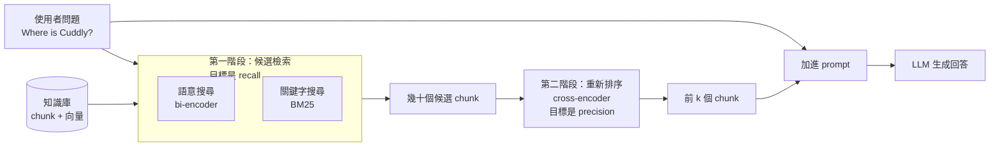
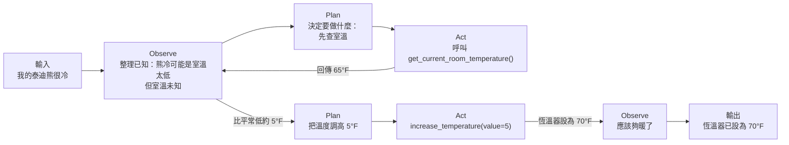

> 🌏 [English version](/posts/ai/2026-09-29-cme295-agentic-llms-en)

本篇對應 Stanford [CME295](/posts/ai/2026-09-29-stanford-cme295-transformers-llms) 2025 版第 7 講「Agentic LLMs」（2025 年 11 月 14 日）。主要來源是 [151 頁投影片](https://cme295.stanford.edu/slides/fall25-cme295-lecture7.pdf)，錄影在 [YouTube](https://www.youtube.com/watch?v=h-7S6HNq0Vg)（1 小時 49 分）。本文只根據投影片上的文字與圖寫，課堂口頭補充沒有收進來。

上一講的[推理模型](/posts/ai/2026-09-29-cme295-llm-reasoning)處理了 LLM 的第一個弱點：推理能力有限。這一講的開場投影片把剩下的弱點列出來：知識是靜態的、不能執行動作、很難評估。前兩個是今天的主題，最後一個留給[第 8 講](/posts/ai/2026-09-29-cme295-llm-evaluation)。三個解法剛好一層疊一層：

| 弱點 | 本講的解法 | 一句話 |
|---|---|---|
| 知識停在預訓練資料 | RAG | 回答前先去知識庫查 |
| 不能動手做事 | tool calling | 模型寫出函式呼叫，後端去執行 |
| 一次呼叫不夠 | agent（ReAct） | 把查資料和呼叫串成迴圈，直到任務完成 |

整講延續第 1 講的泰迪熊：「Where is Cuddly?」「Find a bear near me!」「My teddy bear is cold.」三個問題分別對應三塊。

## RAG：回答之前先查資料

### 為什麼不能把所有資料都塞進 prompt

投影片列了四個動機：

- **知識有截止日**：模型只知道預訓練資料裡的東西，投影片放了 GPT-5 model card 上的知識截止日期截圖
- **context 有上限**：資料量一大就放不下
- **模型會被無關資訊分心**：引用 [Needle in a Haystack](https://github.com/gkamradt/LLMTest_NeedleInAHaystack) 壓力測試，把一句關鍵資訊藏在大量無關文字裡，看模型找不找得到
- **按 token 計費**：塞越多，每次呼叫越貴

所以就算 context window 夠大，挑出相關的幾段再給模型，仍然比整包丟進去划算。這個取捨也是期末考第 III.9 題在問的。

### Retrieve、Augment、Generate

RAG 這個名字來自 [Lewis 等人 2020 年的論文](https://arxiv.org/abs/2005.11401)。投影片把流程拆成三步：從知識庫**檢索**相關文件，把檢索到的內容**加進** prompt，再讓 LLM **生成**回答。這一講的篇幅幾乎都花在第一步。

檢索之前要先有知識庫，做法是三個動作：

1. **Collect**：收集文件
2. **Divide**：切成 chunk
3. **Embed**：每個 chunk 轉成一個向量

投影片點名三個要調的超參數：embedding 維度、chunk 大小、chunk 之間的重疊長度。

### 兩階段檢索



**第一階段：候選檢索，寧可多撈。** 目標是 recall，不要漏掉相關的片段。投影片列三種方法：

- **語意搜尋**：問題和 chunk 各自用 encoder 轉成向量，比相似度。這種架構叫 bi-encoder，例子是 [Sentence-BERT](https://arxiv.org/abs/1908.10084)。chunk 的向量可以事先算好，所以查得快
- **關鍵字比對**：用 BM25 這類傳統演算法，比的是字面
- **混合**：兩者分數合起來

投影片的例子是問「Where is Cuddly?」，候選片段裡混了一句「he was in a cuddly mood」。字面上有 cuddly，講的卻不是那隻叫 Cuddly 的熊，檢索要能分辨這種差別。

第一階段還有兩個加強招式：

- **[HyDE](https://arxiv.org/abs/2212.10496)**：問題是短問句，文件是陳述句，兩種文字的向量本來就不太像。HyDE 先讓 LLM 寫一段假的答案（「Cuddly is in…」），拿這段假文件去搜，縮小兩邊的落差
- **[Contextual Retrieval](https://www.anthropic.com/news/contextual-retrieval)**：Anthropic 2024 年提出。每個 chunk 單獨看常常少了前後文，於是把整份文件和 chunk 一起丟給 LLM，請它寫一兩句「這段在整份文件的哪個位置、講什麼」，接在 chunk 前面再做 embedding。投影片把 Anthropic 的 prompt 原文放了上去，並提醒整份文件會重複送很多次，可以用 prompt caching 壓低成本。Anthropic 原文的實驗是：加上 contextual embedding 與 contextual BM25 後，前 20 個 chunk 的檢索失敗率降了 49%，再加上 re-ranking 降了 67%（這組數字來自 Anthropic 文章，投影片沒有列）

**第二階段：重新排序，只留最準的。** 目標換成 precision。候選只剩幾十個，就可以用比較貴的 cross-encoder：把問題和 chunk 接在一起丟進同一個 encoder，直接輸出相關分數。每一對都要重算，所以沒辦法用在整個知識庫上。投影片的圖是 re-ranker 把 d、b、a、c 的順序重新排成 a、b、c、d。延伸閱讀投影片推薦 [SBERT 的 Cross-Encoders 說明](https://sbert.net/examples/cross_encoder/applications/README.html)。

### 怎麼知道檢索做得好

評估方式是看排名前 k 個 chunk 裡有多少真的相關。投影片列了四個指標：NDCG@k、RR@k、Recall@k、Precision@k。

<details>
<summary>四個指標的定義</summary>

```
Precision@k = 前 k 個裡相關的數量 / k
Recall@k    = 前 k 個裡相關的數量 / 所有相關 chunk 的數量
RR@k        = 1 / (第一個相關 chunk 的排名)      若前 k 個都不相關則為 0

DCG@k  = Σ_{i=1..k} rel_i / log2(i + 1)
NDCG@k = DCG@k / IDCG@k                          IDCG@k = 排名完美時的 DCG@k
```

- Precision 和 Recall 只看有沒有撈到，不管排第幾
- RR 只在乎第一個相關結果排多前面
- NDCG 越後面的位置折扣越重，再除以完美排名的分數，落在 0 到 1 之間

</details>

RAG 的各種變體在站上有一整個系列，從 [RAG 系統模式完整指南](/posts/ai/2026-03-14-rag-patterns-complete-guide)開始讀；Contextual Retrieval 的實作細節在[這篇](/posts/ai/2026-03-12-contextual-retrieval)。

## Tool calling：讓模型寫出函式呼叫

RAG 適合非結構化的文字。如果資料在一張表裡，更自然的做法是寫一個 `get_data(id, field)` 函式，讓模型去呼叫。投影片引用 [IBM 的定義](https://www.ibm.com/think/topics/tool-calling)：tool calling 讓自主系統能「動態存取外部資源，並對其採取行動」，完成複雜任務。

「Find a bear near me!」這句話，一般 LLM 只能回答「不知道你附近有哪些熊」。接上工具後，投影片給了一支完整的 `find_teddy_bear(location)`：呼叫外部 API 找最近的熊，用 geopy 算距離，回傳名字、距離、心情。投影片標出一個好工具的三個條件：有描述清楚、文件完整的 API；（可選）背後會打某個後端；回傳一些資訊。

### 三個步驟，執行的不是模型

1. **LLM 找出參數**：看完函式說明和使用者的話，輸出「用 `location = (37.42, -122.17)` 呼叫 `find_teddy_bear()`」
2. **後端執行**：真正呼叫函式的是 backend，拿到 `{"name": "Teddy", …}`
3. **LLM 根據結果下結論**：把回傳值讀進來，寫成給使用者的回答

模型本身從頭到尾只產生文字，函式是系統替它跑的。期末考第 III.4 題就在考這件事。

### 怎麼教模型用工具

- **方法 1：訓練**。準備 SFT 資料，分兩種目標：「工具預測」（看到函式 API 和問題，輸出正確的呼叫與參數）和「回應生成」（把目前為止的對話加上工具回傳值，輸出最後的回答）。投影片畫了多組例子，例如同一個工具換成「Find a bear in Paris!」就該帶巴黎的座標
- **方法 2：prompting**。在 prompt 裡放函式 API 加上詳細的使用說明。那說明要怎麼寫？投影片給的一個做法是：拿 SFT 資料當評估集，請一個能力強的推理模型幫你寫

常見的工具分三類：**資訊**（網路或資料庫搜尋、天氣股價、codebase）、**計算**（計算機、執行程式碼，常見是 Python）、**行動**（寄信、發訊息、其他電腦上的操作）。

### 工具一多就出問題

實務上一個助理會有很多工具，投影片畫了找熊、抱熊、查熊心情、送禮、約玩伴、傳訊息六個。挑戰也跟著來：

- 工具越多，表現越差
- context 長度有限，全部塞進去不能擴展
- 每個工具都要人寫定義，工作量大

第一個問題的解法是 **tool selection**：先用一個 router 從工具清單裡挑出這次可能用到的幾個，只把它們的 API 給 LLM。投影片引用 [Robert 等人 2024 年的技術揭露](https://www.tdcommons.org/dpubs_series/7521/)，目標是同時降低延遲、提升表現。

第三個問題的解法是標準化。投影片的圖是三個 LLM 各自對接三個工具，每條線都要各寫一次。[MCP（Model Context Protocol）](https://www.anthropic.com/news/model-context-protocol)是 Anthropic 2024 年提出的協定，讓工具和資料用同一種方式接上任何 LLM。依 [MCP 架構文件](https://modelcontextprotocol.io/docs/learn/architecture)，角色分三個：

- **MCP host**：使用者操作的應用程式，例如 Claude Desktop
- **MCP client**：host 裡負責跟某個 server 連線的元件
- **MCP server**：對外提供三種東西，tools、prompts、resources

投影片的例子是在 Claude Desktop 請它「幫我的泰迪熊推薦一本新詩集」，由一個書籍 MCP server 提供「找書名」和「依口味推薦」兩類工具（其中一個叫 `find_title`），背後分別連著個人藏書和熱門書單。站上的 [MCP 介紹](/posts/ai/2026-03-22-mcp-model-context-protocol)有更完整的協定細節。

## Agent：把呼叫串成迴圈

投影片對 agent 的定義是：「An agent is a system that autonomously pursues goals and completes tasks on a user's behalf.」重點在「自主」和「替使用者完成任務」。

用三張圖對照：傳統 LLM 是問題進、答案出；推理模型在中間多了一段推理鏈；agent 則是 LLM 發出呼叫、拿到結果、再交給 LLM，重複好幾輪才給答案。

### ReAct：觀察、規劃、行動

[ReAct](https://arxiv.org/abs/2210.03629)（Reason + Act）是 Yao 等人 2022 年提出的框架。投影片把它畫成三個階段的迴圈，用「My teddy bear is cold. Please do something.」走一遍：



三個階段各自的工作：

- **Observe**：把先前的行動結果整理起來，明確寫出目前已知什麼（包括模型本身的知識）。投影片說這是推理最重的一步，要想清楚還缺什麼
- **Plan**：寫出要完成哪些任務、要呼叫哪些工具
- **Act**：透過 API 執行動作，或到文件資料庫裡查資料

輸入不一定來自使用者。投影片舉了兩種：手動輸入的問題，以及外部事件，例如某個指標超過門檻時自動觸發。

把這整圈包起來，對外看就是一個「恆溫器 agent」。家裡還可以有人員偵測 agent、能源管理 agent、空氣品質 agent。它們之間怎麼溝通？

### A2A：agent 之間的協定

Google 2025 年發表的 [Agent2Agent（A2A）](https://developers.googleblog.com/en/a2a-a-new-era-of-agent-interoperability/)處理的就是這件事。MCP 管 LLM 接工具，A2A 管 agent 接 agent。投影片依 [A2A 規格](https://a2a-protocol.org/latest/specification/)把一個恆溫器 agent 拆成三個部分：

| 元件 | 內容 |
|---|---|
| `AgentSkill` | 每項能力的 id、描述、範例，例如「維持舒適溫度」「回家前先把家裡調到 70°F」「夜間省電」 |
| `AgentCard` | agent 的名片：名稱、url、版本、擁有哪些 skills |
| `AgentExecutor` | 實際執行的程式：`execute()` 和 `cancel()` |

站上的[協定層比較](/posts/ai/2026-08-10-mcp-a2a-skills-protocol-layer)把 MCP、A2A 和 Skills 放在一起對照。

### 會動手，就會闖禍

投影片最後一節講安全。能在真實世界動手，就可能造成真實傷害，例子是資料外洩，引用 [ToolSword](https://arxiv.org/abs/2402.10753) 對工具使用三個階段的安全問題分析。補救方式有三類：訓練階段（例如 [Chen 等人 2024 年的工具使用對齊](https://aclanthology.org/2024.emnlp-main.82/)）、推論時的防護、以及 [Agent-SafetyBench](https://arxiv.org/abs/2412.14470) 這類基準測試。

投影片還放了一則「昨天的新聞」：Anthropic 在 2025 年 11 月 13 日發表的[報告](https://www.anthropic.com/news/disrupting-AI-espionage)，揭露一次由 AI 主導的網路間諜行動。依報告內容，攻擊者把 Claude Code 當成自動化工具，對大約 30 個目標發動入侵，整個行動有 80% 到 90% 由 AI 執行，人只在少數關鍵決策點介入。

### 結語投影片的六點

- 幻覺是（很大的）問題
- 推理能力是瓶頸：微調有幫助，但很難
- 評估很困難
- 先從簡單的做起，再逐步擴大
- 先用能力強的模型，之後再最佳化模型大小
- 透明與可觀察性有助於使用者信任和除錯

最後一頁是「Bonus：日常生活裡的 AI agent」，投影片寫著「Personal favorite use case: coding!」。

## 連回你用的模型

你在 ChatGPT 按下搜尋、或讓 Claude Code 改檔案時，發生的事跟這一講的三步驟一樣：模型輸出一段結構化的工具呼叫，外面的程式真的去執行，再把結果貼回對話，模型讀完決定下一步。模型不會自己跑程式，也不會真的連上網路；它只負責決定「呼叫誰、帶什麼參數」。

所以工具描述寫得好不好，直接決定 agent 會不會叫錯工具。期末考第 III.7 題問「agent 幻想出一個不存在的工具怎麼辦」，考的正是這條因果。coding agent 的迴圈在工程上長什麼樣，可以看站上[跟成熟 coding agent 學設計（2）：Agent loop 的形狀](/posts/ai/2026-08-25-coding-agent-agent-loop-shapes)。

## 2026 版改了什麼

這是整個系列改最多的一講。2026 版投影片尚未釋出（第 6 講排在 2026 年 11 月 6 日），以下只能比對兩版[課表](https://cme295.stanford.edu/syllabus/)的主題清單和 2025 版投影片：

| | 2025 第 7 講「Agentic LLMs」 | 2026 第 6 講「AI Agents」 |
|---|---|---|
| 課表主題 | Retrieval-augmented generation | Tool calling |
| | Advanced RAG techniques | MCP |
| | Function calling | Memory, retrieval |
| | Agents | Context compaction |
| | ReAct framework | Harness optimization |
| | | Coding agents |
| | | Skills, plugins |
| 講名 | 「Agentic LLMs」：LLM 加上 agent 能力 | 「AI Agents」：agent 本身就是主角 |

幾個讀課表時容易看錯的地方：

- **MCP 不是新內容**。2025 版課表沒列，但 2025 版投影片已經有 MCP 和 A2A 各一節。2026 版只是把 MCP 升格成課表上的獨立主題
- **RAG 被壓縮了**。2025 版有兩個 RAG 主題（基礎和進階），HyDE、Contextual Retrieval、re-ranking、NDCG 都在這裡；2026 版只剩「Memory, retrieval」一項，而且跟記憶並列。第 1 講的縮寫表也已經拿掉 RAG（見[第 1 講導讀](/posts/ai/2026-09-29-cme295-transformer)）
- **ReAct 從課表消失**。這不代表迴圈不教了，但課表不再用論文名稱當主題
- **真正新增的是 harness 那一層**：context compaction、harness optimization、coding agents、skills 與 plugins。2026 版第 1 講投影片「Difference with last year's edition」也把 AI Agents 列為今年三項新內容之一

對照 2025 版投影片的「Tools summary」，可以看到新主題要解的問題當時已經寫在上面：「context 長度有限，不能擴展」「工具越多表現越差」「每個工具都要寫定義，工作量大」。2025 版給的解法是 router 挑工具和 MCP 標準化；結語的「先從簡單的做起」「可觀察性有助於除錯」、以及最後一頁的 coding 用例，也看得到 2026 版 harness 與 coding agent 主題的影子。這是我根據兩份材料做的對照，2026 版課堂實際怎麼接這些問題，要等投影片釋出才能確認。本系列第 12 篇會在影片上架後專門寫 2026 版第 6 講。

這四個新主題的課前預寫版在本系列 [order 12](/posts/ai/2026-09-29-cme295-ai-agents)，2026 版影片上架後會對照更新。

## 自我檢測

以下題目改寫自 [2025 期末考](https://cme295.stanford.edu/exams/fall25-cme295-final.pdf)第 III 大題「Agentic LLMs」，答案在[解答 PDF](https://cme295.stanford.edu/exams/fall25-cme295-final-solutions.pdf)：

1. RAG 裡的「contextual retrieval」指的是什麼做法？（第 2 題）
2. ReAct 框架在 agent 裡是什麼樣的迴圈？（第 3 題）
3. LLM 輸出一個函式呼叫之後，通常是誰去執行它？（第 4 題）
4. agent 幻想出一個不存在的工具時，常見的補救方式是什麼？（第 7 題）
5. 就算模型有 100 萬 token 的 context window，為什麼還可能選擇 RAG？再舉一個 RAG 系統特有的挑戰。（第 9 題）
6. 從 LLM 的角度描述工具執行迴圈的三個步驟；如果工具回傳錯誤，會發生什麼事？（第 10 題）

## 想深入

- 從研究角度看 RAG 和 agent 的元件拆解：[CS224N 第 10 講：RAG 與 Language Agents 的六個元件](/posts/ai/2026-08-22-cs224n-rag-language-agents)
- RAG 各世代與變體的全景：[RAG 系統模式完整指南](/posts/ai/2026-03-14-rag-patterns-complete-guide)
- 投影片提到的 chunk 上下文化：[Contextual Retrieval：幫每個 Chunk 加上「這段在說什麼」](/posts/ai/2026-03-12-contextual-retrieval)
- agent 迴圈在真實 coding agent 裡怎麼實作：[跟成熟 coding agent 學設計（2）：Agent loop 的形狀](/posts/ai/2026-08-25-coding-agent-agent-loop-shapes)

## 參考資料

- [CME 295 2025 版課表](https://cme295.stanford.edu/syllabus/2025/)
- [CME 295 2026 版課表](https://cme295.stanford.edu/syllabus/)
- [2025 版第 7 講投影片（PDF）](https://cme295.stanford.edu/slides/fall25-cme295-lecture7.pdf)
- [2025 版第 7 講錄影](https://www.youtube.com/watch?v=h-7S6HNq0Vg)
- [2025 期末考](https://cme295.stanford.edu/exams/fall25-cme295-final.pdf)／[解答](https://cme295.stanford.edu/exams/fall25-cme295-final-solutions.pdf)
- [Lewis et al., Retrieval-Augmented Generation for Knowledge-Intensive NLP Tasks (2020)](https://arxiv.org/abs/2005.11401)
- [Reimers & Gurevych, Sentence-BERT (2019)](https://arxiv.org/abs/1908.10084)
- [Gao et al., Precise Zero-Shot Dense Retrieval without Relevance Labels (HyDE, 2022)](https://arxiv.org/abs/2212.10496)
- [Anthropic, Introducing Contextual Retrieval (2024)](https://www.anthropic.com/news/contextual-retrieval)
- [SBERT.net, Cross-Encoders](https://sbert.net/examples/cross_encoder/applications/README.html)
- [Kamradt, Needle in a Haystack - Pressure Testing LLMs](https://github.com/gkamradt/LLMTest_NeedleInAHaystack)
- [IBM, What is tool calling?](https://www.ibm.com/think/topics/tool-calling)
- [Robert et al., Automatic Tool Selection to Reduce Large Language Model Latency (2024)](https://www.tdcommons.org/dpubs_series/7521/)
- [Anthropic, Introducing the Model Context Protocol (2024)](https://www.anthropic.com/news/model-context-protocol)
- [MCP Architecture overview](https://modelcontextprotocol.io/docs/learn/architecture)
- [Yao et al., ReAct: Synergizing Reasoning and Acting in Language Models (2022)](https://arxiv.org/abs/2210.03629)
- [Google, Announcing the Agent2Agent Protocol (A2A) (2025)](https://developers.googleblog.com/en/a2a-a-new-era-of-agent-interoperability/)
- [A2A Protocol Specification](https://a2a-protocol.org/latest/specification/)
- [Ye et al., ToolSword (2024)](https://arxiv.org/abs/2402.10753)
- [Chen et al., Towards Tool Use Alignment of Large Language Models (EMNLP 2024)](https://aclanthology.org/2024.emnlp-main.82/)
- [Zhang et al., Agent-SafetyBench (2024)](https://arxiv.org/abs/2412.14470)
- [Anthropic, Disrupting the first reported AI-orchestrated cyber espionage campaign (2025)](https://www.anthropic.com/news/disrupting-AI-espionage)
- [Stanford CME295 導讀（本系列總覽）](/posts/ai/2026-09-29-stanford-cme295-transformers-llms)
