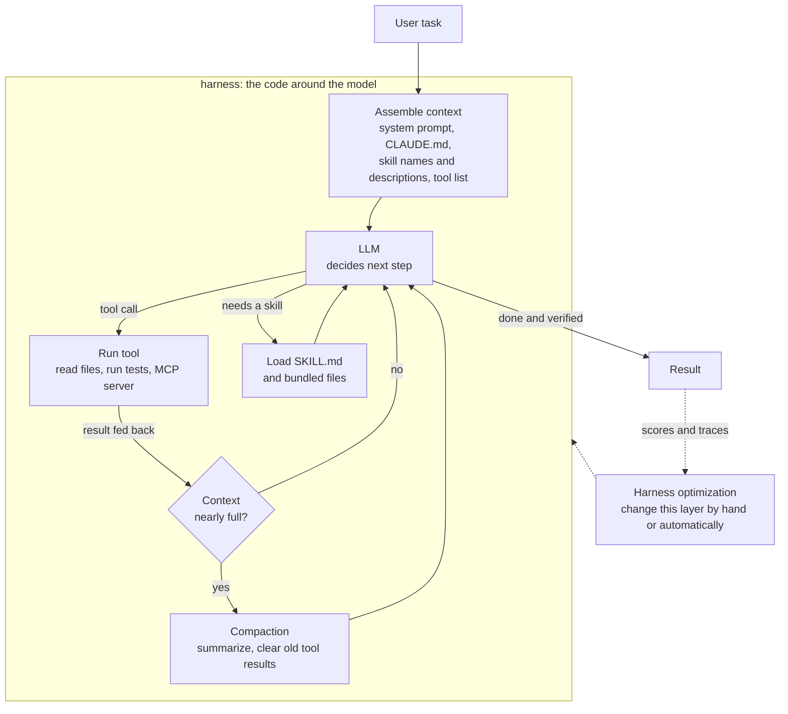

> 🌏 [中文版](/posts/ai/2026-09-29-cme295-ai-agents)

**Video status: Official entry or recording index only.** [Source details](#course-video-sources)

> **Pre-lecture edition**: written on September 29, 2026. Lecture 6 of the 2026 edition (November 6, 2026) has not happened yet. This post is based on the topic list in the 2026 syllabus, material already covered in the 2025 slides, and primary sources. It will be revised against the video and slides once they are published.

This post covers Lecture 6, "AI Agents", of the 2026 edition of Stanford [CME295](/posts/ai/2026-09-29-stanford-cme295-transformers-llms-en). The lecture has not been given, so there are no slides to quote. The only source that speaks for the 2026 course is the seven-line topic list on the [syllabus](https://cme295.stanford.edu/syllabus/). Everything else comes from the 2025 Lecture 7 [slides](https://cme295.stanford.edu/slides/fall25-cme295-lecture7.pdf), engineering posts from Anthropic and OpenAI, the [MCP specification](https://modelcontextprotocol.io/specification/versioning), and papers. Each section says which is which.

Why write it early? Slide 6 of the 2026 Lecture 1 [deck](https://cme295.stanford.edu/slides/fall26-cme295-lecture1.pdf), "Difference with last year's edition", lists three new items for this year, and AI Agents is one of them. The timeline in the same deck ends on a box labeled "Agentic era!" holding four coding agents: Claude Code, Cursor, Codex and Antigravity. A course about Transformers now puts coding agents at the end of its timeline, and that is a signal worth reading.

## Course video sources

Official course and existing recording entries are linked below. A single public video matching this article has not been verified for embedding.

Course and recording entries:

- [Official course / lecture source](https://cme295.stanford.edu/syllabus/2025/)

## Where this lecture sits in the 2026 syllabus

Lecture 6 comes after Lecture 5, "LLM systems" (KV cache, speculative decoding), and before Lecture 7, "LLM evaluation" (which lists agent evaluation). The seven topics on the syllabus:

| Syllabus topic | Covered in 2025? | How this post handles it |
|---|---|---|
| Tool calling | Yes, 2025 Lecture 7 | Bridge only; details in [order 7](/posts/ai/2026-09-29-cme295-agentic-llms-en) |
| MCP | Yes, a section in the 2025 slides (not on the syllabus) | Bridge, plus what changed in the 2026 spec |
| Memory, retrieval | Retrieval yes (two RAG topics); memory no | Add agent memory and just-in-time retrieval |
| Context compaction | No | **New, expanded** |
| Harness optimization | No | **New, expanded** |
| Coding agents | Only the closing slide: "Personal favorite use case: coding!" | **New, expanded** |
| Skills, plugins | No | **New, expanded** |

The seven lines read as one thread. Models learned to call tools (tool calling, MCP), then ran out of context (memory, compaction), so people started improving the code wrapped around the model (the harness). Coding agents are the most mature instance, and skills and plugins are the newest way to extend them. The rest of the post follows that order.



## Bridge: tool calling, MCP, retrieval

### Tool calling and MCP: covered in 2025, and the spec has moved since

The three steps of tool calling (the model writes the call, the backend runs it, the model reads the result), the two ways to teach it (SFT and prompting), tool selection, and MCP's host, client and server roles are all in [order 7](/posts/ai/2026-09-29-cme295-agentic-llms-en), based on the 2025 slides. No need to repeat them.

What is worth adding is the "Tools summary" slide (slide 105) from 2025, which listed three challenges: more tools lowers performance, finite context length does not scale, and every tool has to be defined by hand. A year later the industry has new answers to each, and they line up with the second half of the 2026 syllabus:

- **Tool definitions don't fit in context**: by default Claude Code now puts only MCP tool names in context and loads full schemas on demand through tool search (per the [Claude Code context window docs](https://code.claude.com/docs/en/context-window), checked 2026-09-29). It is the same direction as the router in the 2025 slides, except the model does the searching
- **MCP went stateless**: MCP versions are dates, and the current version as of 2026-09-29 is [2026-07-28](https://modelcontextprotocol.io/specification/2026-07-28/changelog). The biggest change from the previous 2025-11-25 revision is removing the `initialize` handshake and protocol-level sessions; every request carries its own version and client capabilities, and servers must implement a new `server/discover`
- **Friendlier to prompt caching**: the same changelog says servers "SHOULD return tools from `tools/list` in a deterministic order" to improve client-side caching and LLM prompt cache hit rates. The order of a tool list affects your bill, which comes up again under compaction

### Memory and retrieval: from pre-computed to just-in-time

Retrieval in 2025 meant RAG: chunk the documents, embed them, and pull the most relevant chunks into the prompt when a question arrives (see [order 7](/posts/ai/2026-09-29-cme295-agentic-llms-en)). The 2026 syllabus puts retrieval on the same line as memory, and the pairing makes sense. For an agent that runs many turns, "look up an external document" and "look up something I wrote down earlier" are the same action.

Anthropic's [Effective context engineering for AI agents](https://www.anthropic.com/engineering/effective-context-engineering-for-ai-agents) (September 29, 2025) describes a shift. Many applications retrieve with embeddings before inference; more teams are adding "just in time" strategies, where the agent keeps lightweight references such as file paths, stored queries and links, and loads content with tools only when needed. The example is Claude Code: CLAUDE.md goes into context up front, and everything else is found with glob and grep when needed, which avoids maintaining an index.

Memory is moving toward files too. The same post lists structured note-taking (the agent periodically writes notes outside the context window and reads them back later) as one of three techniques for long tasks. The [memory tool](https://claude.com/blog/context-management) Anthropic launched on the Claude Developer Platform the same day is a file-based memory directory whose storage the developer controls. The site's [agent memory engineering series](/posts/ai/2026-09-19-agent-memory-taxonomy-en) maps out the design space in full.

## New topic 1: Context compaction

### Scenario

You ask a coding agent to fix a bug. It reads a dozen files and runs the tests three times, each producing a thousand lines of output. Half an hour in, most of the context window is gone. Keep going and either the request exceeds the limit and fails, or it still fits but the model starts ignoring constraints you gave it early on.

### Intuition: fitting is not the same as remembering

The obvious move is to wait for bigger context windows. Anthropic's post says no. It cites Chroma's [context rot](https://www.trychroma.com/research/context-rot) research: as tokens in context increase, the model's ability to recall information accurately decreases, and "this characteristic emerges across all models". The explanation goes back to Lecture 1's attention: n tokens have n² pairwise relationships, and as length grows the model's attention is spread thin. Context should be treated as a finite resource with diminishing returns.

This extends 2025 final exam question III.9, which asks why you might use RAG even with a 1M-token context window. Compaction answers the other half of that question: even without retrieval, the conversation itself fills up the context.

### Mechanism: three approaches, light to heavy

Anthropic groups long-task context strategies into three: compaction, structured note-taking, and sub-agents. Compaction itself ranges from light to heavy:

1. **Clear old tool results.** The post calls this "one of the safest lightest touch forms of compaction": once a tool was called long ago, the agent doesn't need the raw output again. Context editing on the Claude Developer Platform automatically clears stale tool calls and results as the limit approaches
2. **Summarize and restart.** Hand the conversation to the model for a summary, then continue in a new context built from it. Anthropic describes Claude Code keeping architectural decisions, unresolved bugs and implementation details, discarding redundant tool output, and adding the five most recently accessed files (as described in September 2025; the implementation may have changed)
3. **Compress to an opaque representation.** In [Unrolling the Codex agent loop](https://openai.com/index/unrolling-the-codex-agent-loop/) (January 23, 2026), OpenAI describes a `/responses/compact` endpoint in the Responses API. It returns a list of items that can replace the previous input, including a `type=compaction` item with opaque `encrypted_content` that preserves the model's "latent understanding" of the original conversation. Codex calls it automatically once `auto_compact_limit` is exceeded

<details>
<summary>Skeleton of a compaction loop (illustrative)</summary>

```
loop:
    response = model(context)
    if response has a tool call:
        result = run_tool(response.call)
        context.append(response, result)
    else:
        return response

    if tokens(context) > threshold:                # e.g. some fraction of the window
        # step 1: cheapest, clear old tool results first
        context = drop_old_tool_results(context, keep_last=k)
        if tokens(context) > threshold:
            # step 2: ask the model for a summary and restart from it
            summary = model("Summarize: keep decisions, open issues, next steps", context)
            context = [system_prompt, project_instructions, summary, recently_used_files]
```

The advice for tuning the summary prompt comes from the same Anthropic post: first maximize recall so nothing needed is lost, then iterate on precision to cut the excess. Whatever a summary drops is gone for good, and its importance often only shows up later.

</details>

Compaction has two costs that are easy to miss. The summary itself costs a model call. And a summary rewrites the front of the context; prompt caching depends on an identical prefix, so after each compaction the cache has to build up again from that point. The link between KV cache and inference cost is in [order 10](/posts/ai/2026-09-29-cme295-llm-systems-en).

Compaction is not a cure-all either. Anthropic's [Effective harnesses for long-running agents](https://www.anthropic.com/engineering/effective-harnesses-for-long-running-agents) (November 26, 2025) says plainly that "compaction isn't sufficient": for work spanning many context windows, passing everything through summaries loses things. That leads to the next topic.

### Back to the model you use

Typing `/compact` in Claude Code, or watching Codex compact automatically, is approach 2 or 3 above. One practical detail: per the [Claude Code docs](https://code.claude.com/docs/en/context-window) (checked 2026-09-29), the skill listing loaded at startup is not re-injected after `/compact`; only skills you actually invoked are preserved. If an agent "forgets" a skill after compaction, this may be why. The site has a [comparison of seven answers](/posts/ai/2026-08-21-context-full-seven-answers-en) coding agents give to a full context window.

## New topic 2: Harness optimization

### What a harness is

The [Claude Code docs](https://code.claude.com/docs/en/how-claude-code-works) give a clean definition. The agentic loop has two components, models that reason and tools that act; Claude Code is the layer around the model that provides the tools and manages the context the model sees, and "This surrounding layer is what the term agentic harness refers to."

In the mermaid diagram above, everything except the LLM box is harness: assembling context, running tools, deciding when to compact and when to stop. The same model in a different harness can perform very differently, which makes the harness something to optimize.

### Tuning by hand: work backward from failures

Most harnesses today are tuned by people fixing failure cases one by one. Two first-hand reports:

- **Anthropic's long-running coding agent** ([post](https://www.anthropic.com/engineering/effective-harnesses-for-long-running-agents)). Three failure modes: trying to one-shot the whole app and running out of context midway; a later session seeing progress and declaring the job done; marking features complete without testing. The fix splits the work across two agents. The initializer agent in the first session sets up an `init.sh`, a `claude-progress.txt` progress file, a full feature list and an initial git commit. The coding agent in each later session does one feature at a time, leaves structured updates, and only counts a feature as done after testing it end to end with browser automation, as a user would
- **OpenAI's harness engineering** ([post](https://openai.com/index/harness-engineering/), February 11, 2026). A team used Codex for five months to build an internal product of roughly a million lines, with no hand-written code. Early progress was slower than expected because "the environment was underspecified", and the engineers' main job became enabling the agents to do useful work. One concrete practice: keep AGENTS.md to about 100 lines as a map: "instead of treating AGENTS.md as the encyclopedia, we treat it as the table of contents"

What the two share: neither changed the model. They changed the files, processes and checks around it.

### Tuning automatically: Meta-Harness

The syllabus says harness *optimization*, which suggests an outer loop that searches automatically. A representative primary source for that direction is Stanford's [Meta-Harness](https://arxiv.org/abs/2603.28052) (March 30, 2026, first author Yoonho Lee). There is no public information linking this paper to the CME295 lecture; it is presented here as one research approach to the topic.

The paper's framing: a harness is "the code that determines what information to store, retrieve, and present to the model", still mostly written by hand, and existing text optimizers "compress feedback too aggressively" for this setting. Its approach uses an agent as the proposer, which reads the source code, scores and execution traces of every prior candidate harness through a filesystem, then proposes new harness code.

<details>
<summary>Meta-Harness outer loop (illustrative, based on the abstract)</summary>

```
archive = [initial harness]               # each candidate: source, score, execution traces
for round in 1..N:
    # the proposer is itself a coding agent browsing the archive via the filesystem
    new_code = proposer_agent(read_access=archive)
    score, traces = evaluate(new_code, task_set)
    archive.add(new_code, score, traces)
return highest-scoring harness in archive
```

The difference from prompt optimizers is the resolution of feedback: the proposer sees full traces, not a single score or a one-line summary. That matches the lesson from compaction: compress too hard and you can't get it back.

</details>

Results from the abstract: on online text classification it beats a state-of-the-art context management system by 7.7 points while using 4x fewer context tokens; on TerminalBench-2, an agentic coding benchmark, the discovered harnesses surpass the best hand-engineered baselines. These numbers come from the abstract; the experimental conditions are in the full paper. The site's [Same Name, Different Layer](/posts/ai/2026-08-26-meta-harness-layers-en) separates this "optimization loop" sense of meta-harness from the control-plane sense used for governing multiple agents.

### Back to the model you use

Your CLAUDE.md, AGENTS.md, hooks and custom slash commands are hand-tuning the harness. How do you know a change helped? You need a fixed task set you can re-run and score, which is exactly the agent evaluation item on the next lecture of the 2026 syllabus (Lecture 7), and the 2025 version of that topic is in [order 8](/posts/ai/2026-09-29-cme295-llm-evaluation-en).

## New topic 3: Coding agents

### Why coding

The last slide of the 2025 closing section says "Personal favorite use case: coding!" A year later coding agents are a syllabus item of their own. One way to see why is through the old agent problems: the 2025 closing slides list "hallucination is a (big) problem" and "evaluation is challenging", and programming has built-in answers to both. Code can be run, tests can check it, and deciding whether the result is right needs less human judgment.

### Mechanism: gather, act, verify

The [Claude Code docs](https://code.claude.com/docs/en/how-claude-code-works) describe the agentic loop as three blended phases: gather context, take action, verify results, repeated until the task is done, with the user able to interrupt at any point. Built-in tools fall into five categories: file operations, search, execution (shell, tests, git), web, and code intelligence.

Compared with ReAct's Observe, Plan, Act in [order 7](/posts/ai/2026-09-29-cme295-agentic-llms-en), the addition is an explicit **verify** phase. The third failure mode in Anthropic's long-running agent, marking features done without testing, is what happens when that phase is missing.

Coding agents are also where the earlier topics meet:

| Earlier topic | What it looks like in a coding agent |
|---|---|
| retrieval | No index; glob and grep find files just in time |
| memory | CLAUDE.md, AGENTS.md, progress files, git history |
| compaction | `/compact`, automatic compaction |
| harness optimization | project rules, hooks, verification gates, subagent delegation |

### Back to the model you use

The four tools on the 2026 Lecture 1 timeline: [Claude Code](https://code.claude.com/docs/en/overview), [Cursor](https://cursor.com/), [Codex](https://openai.com/codex/) and [Antigravity](https://antigravity.google/). They use different models, yet their loops look alike; the differences are mostly in the harness: how they find files, edit files, isolate execution, and compact. The site's [How Claude Code Works](/posts/tech/deep-dive/2026-08-26-claude-code-how-it-works-en) walks through one of them end to end.

## New topic 4: Skills and plugins

### Scenario

You want the agent to learn your company's PDF form workflow, internal API conventions, or publishing rules. Put it all in the system prompt and you pay those tokens every turn, though most turns don't need them. Build an MCP server and it's too heavy; much of this knowledge is just "follow these steps" plus a script or two.

### Intuition: an onboarding manual you open when needed

Anthropic's [Equipping agents for the real world with Agent Skills](https://www.anthropic.com/engineering/equipping-agents-for-the-real-world-with-agent-skills) (October 16, 2025) compares a skill to an onboarding guide for a new hire: a folder with a `SKILL.md`, optionally bundling other documents and scripts. On December 18, 2025, Anthropic published the format as an [open standard](https://agentskills.io/).

### Mechanism: three levels of progressive disclosure

1. **Level 1**: at startup, only each skill's `name` and `description` (the YAML frontmatter of `SKILL.md`) go into the system prompt
2. **Level 2**: when the model decides a skill is relevant, it reads the full `SKILL.md` into context
3. **Level 3 and beyond**: other files referenced from `SKILL.md` are read only as needed; bundled scripts can be executed without their contents entering context

<details>
<summary>Why progressive disclosure scales (illustrative arithmetic)</summary>

```
Suppose n skills are installed, each with a description of about d tokens
and full content of about D tokens (D much larger than d)

Everything in the system prompt:  cost per turn ≈ n × D
Progressive disclosure:           cost per turn ≈ n × d  +  (k skills used this time) × D

With n = 50, d = 100, D = 5,000, k = 1 (hypothetical numbers)
  everything: 250,000 tokens      progressive: 5,000 + 5,000 = 10,000 tokens
```

This addresses the second challenge on the 2025 "Tools summary" slide: finite context length means capabilities don't scale. The cost is an extra "should I load this?" decision; a poorly written description means the skill never triggers.

</details>

The post also flags security: skills carry instructions and code, so a malicious skill could direct the agent to exfiltrate data. Install from trusted sources only, and read the bundled files before using one.

### Plugins: packaging and distribution

The [Claude Code docs](https://code.claude.com/docs/en/plugins) define a plugin as a directory that can hold skills, subagent definitions, hooks and MCP servers, named by a `.claude-plugin/plugin.json` manifest and usually installed from a marketplace. The docs' rule of thumb: each of these components works on its own; reach for a plugin when you want to package several as one unit, share them with a team, or publish versioned releases. They also warn that an enabled plugin is part of every session, and the names and descriptions of its skills and agents occupy context on every turn.

How the three divide the work:

| | MCP | Skill | Plugin |
|---|---|---|---|
| What it gives the agent | Callable tools and data | Procedures and knowledge (may bundle scripts) | A package of the first two plus hooks and subagents |
| Where it lives | A separate process or remote server | The agent's filesystem | A folder installed from a marketplace |
| Context cost | Tool definitions (can be deferred) | Only name and description by default | Depends on contents |

### Back to the model you use

When you type `/some-skill` in Claude Code, or the model decides on its own to read a `SKILL.md`, that is level 2 of disclosure. The site has a [breakdown](/posts/ai/2026-08-25-coding-agent-hooks-skills-plugins-en) of how mature coding agents layer hooks, skills and plugins.

## Where the 2025 edition covered this

| 2026 syllabus topic | 2025 counterpart | Status |
|---|---|---|
| Tool calling | Lecture 7 function calling section, including the three steps and two teaching methods | Covered; see [order 7](/posts/ai/2026-09-29-cme295-agentic-llms-en) |
| MCP | Lecture 7 MCP section (from slide 111), not on the 2025 syllabus | Covered; the 2026 spec is now stateless, and whether that makes it in awaits the slides |
| Memory, retrieval | Lecture 7 RAG and advanced RAG | Retrieval covered; agent memory is new |
| Context compaction | Lecture 7 slide 14 lists "Limited context size" as a RAG motivation; "Tools summary" lists "Finite context length" | Problem raised; compaction as a solution is new |
| Harness optimization | Closing slides: "start simple", "observability helps debuggability" | New |
| Coding agents | Last slide: "Personal favorite use case: coding!" | New |
| Skills, plugins | None; A2A's `AgentSkill` in the 2025 slides is a different concept | New |

Two more notes. ReAct and A2A from 2025 are not on the 2026 syllabus, but a syllabus lists topics and doesn't rule out mentions in class. The 2025 agent safety material (ToolSword, Agent-SafetyBench, the AI-orchestrated espionage report) also has no matching line on the 2026 syllabus.

## Self-check

The first three are adapted from Part III, "Agentic LLMs", of the [2025 final exam](https://cme295.stanford.edu/exams/fall25-cme295-final.pdf), with answers in the [solutions PDF](https://cme295.stanford.edu/exams/fall25-cme295-final-solutions.pdf). The last three are **written by this site** for the new 2026 topics and have no official answers.

1. MCP aims to standardize the connection between which two sides? (Question III.5)
2. What is the key difference between a standard chatbot and an agent? (Question III.6)
3. Why might you use RAG even with a 1M-token context window? (Question III.9, also used in post 7; the second half is this site's extension) Which of those reasons also explain why compaction is needed?
4. (Written by this site) Compaction comes in three forms: clearing old tool results, summarizing and restarting, and compressing to an opaque representation. Why is clearing tool results considered the safest? What does summarizing and restarting do to the prompt cache?
5. (Written by this site) An agent has 40 skills installed, and only one is relevant to the task. Under the three levels of progressive disclosure, what is in context this turn? If a skill never triggers, which field would you check first?
6. (Written by this site) Meta-Harness says existing text optimizers "compress feedback too aggressively." What information does it give the proposer to avoid this, and what does that idea have in common with the trade-off in compaction?

## Going deeper

- How coding agents disagree on a full context: [Seven Answers to a Full Context Window, and No Consensus](/posts/ai/2026-08-21-context-full-seven-answers-en)
- The design space of memory systems: [Four Types of Memory and Six Design Axes](/posts/ai/2026-09-19-agent-memory-taxonomy-en)
- Layers of "harness" and Stanford's Meta-Harness: [Same Name, Different Layer](/posts/ai/2026-08-26-meta-harness-layers-en)
- One coding agent's full loop: [How Claude Code Works](/posts/tech/deep-dive/2026-08-26-claude-code-how-it-works-en)
- Learning coding agent design from source code: [Learning Agent Design from Mature Coding Agents: Series Overview](/posts/ai/2026-08-25-coding-agent-design-series-overview-en)
- Layering skills and plugins: [Hooks, Skills, Plugins](/posts/ai/2026-08-25-coding-agent-hooks-skills-plugins-en)

## Update plan

Once the video and slides for 2026 Lecture 6 are published (the syllabus date is November 6, 2026), this post will be revised against these questions:

- Which examples and papers each of the four new topics uses, and whether the teddy bear scenario carries over
- Whether "harness optimization" means hand-tuning, automated search (such as Meta-Harness), or both
- Whether the MCP section reflects the stateless changes in the 2026-07-28 spec
- How "memory" is defined: file-based notes, vector memory, or in-context working memory
- Whether ReAct, A2A and agent safety from 2025 are still in the slides
- Replace the pre-lecture notice with an actual source note and remove any speculation the slides contradict

## Update Log

- 2026-10-10: Added explicit video status and checked recording sources and access notes.

## References

- [CME 295 2026 syllabus](https://cme295.stanford.edu/syllabus/)
- [CME 295 2025 syllabus](https://cme295.stanford.edu/syllabus/2025/)
- [2026 Lecture 1 slides (PDF)](https://cme295.stanford.edu/slides/fall26-cme295-lecture1.pdf)
- [2025 Lecture 7 slides (PDF)](https://cme295.stanford.edu/slides/fall25-cme295-lecture7.pdf)
- [2025 final exam](https://cme295.stanford.edu/exams/fall25-cme295-final.pdf) / [solutions](https://cme295.stanford.edu/exams/fall25-cme295-final-solutions.pdf)
- [Anthropic, Effective context engineering for AI agents (2025-09-29)](https://www.anthropic.com/engineering/effective-context-engineering-for-ai-agents)
- [Anthropic, Managing context on the Claude Developer Platform (2025-09-29)](https://claude.com/blog/context-management)
- [Anthropic, Equipping agents for the real world with Agent Skills (2025-10-16)](https://www.anthropic.com/engineering/equipping-agents-for-the-real-world-with-agent-skills)
- [Anthropic, Effective harnesses for long-running agents (2025-11-26)](https://www.anthropic.com/engineering/effective-harnesses-for-long-running-agents)
- [Agent Skills open standard](https://agentskills.io/)
- [Chroma, Context Rot](https://www.trychroma.com/research/context-rot)
- [OpenAI, Unrolling the Codex agent loop (2026-01-23)](https://openai.com/index/unrolling-the-codex-agent-loop/)
- [OpenAI, Harness engineering: leveraging Codex in an agent-first world (2026-02-11)](https://openai.com/index/harness-engineering/)
- [Lee et al., Meta-Harness: End-to-End Optimization of Model Harnesses (2026)](https://arxiv.org/abs/2603.28052)
- [MCP versioning](https://modelcontextprotocol.io/specification/versioning) / [2026-07-28 changelog](https://modelcontextprotocol.io/specification/2026-07-28/changelog) (checked 2026-09-29)
- [Claude Code docs: How Claude Code works](https://code.claude.com/docs/en/how-claude-code-works) (checked 2026-09-29)
- [Claude Code docs: Explore the context window](https://code.claude.com/docs/en/context-window) (checked 2026-09-29)
- [Claude Code docs: Plugins overview](https://code.claude.com/docs/en/plugins) (checked 2026-09-29)
- [Reading Stanford CME295 (series overview)](/posts/ai/2026-09-29-stanford-cme295-transformers-llms-en)
