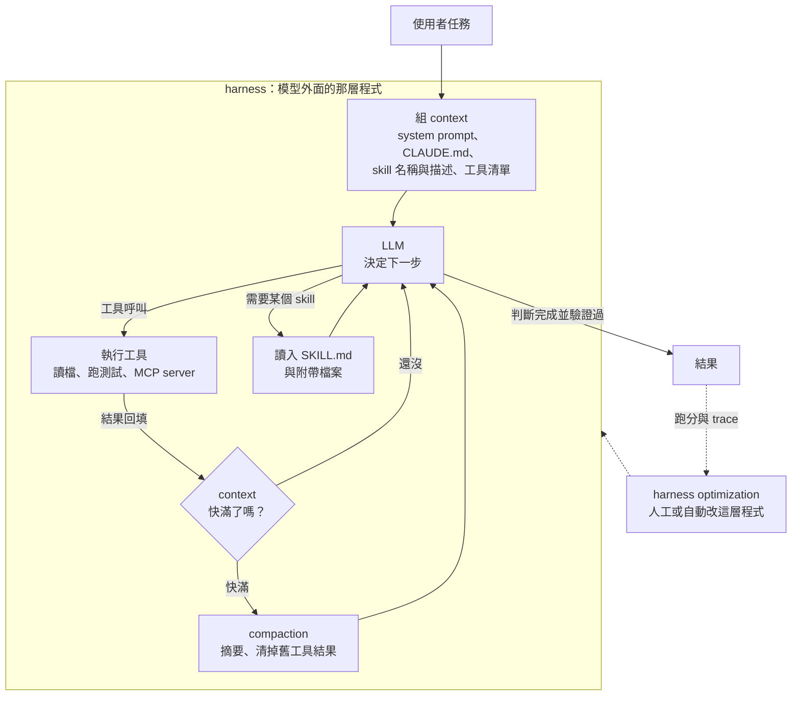

> 🌏 [English version](/posts/ai/2026-09-29-cme295-ai-agents-en)

**影片狀態：僅附官方入口或錄影清單。** [影片來源與說明](#課程影片來源)

> **課前預寫版**：本篇寫於 2026 年 9 月 29 日，2026 版第 6 講（2026 年 11 月 6 日）尚未開課。內容根據 2026 課表的主題清單、2025 版投影片中已講過的部分，以及原始論文整理；影片與投影片上架後會對照更新。

本篇對應 Stanford [CME295](/posts/ai/2026-09-29-stanford-cme295-transformers-llms) 2026 版第 6 講「AI Agents」。這一講還沒上，所以沒有投影片可以引。能代表 2026 課程的只有[課表](https://cme295.stanford.edu/syllabus/)上的七行主題；其餘內容來自 2025 版第 7 講[投影片](https://cme295.stanford.edu/slides/fall25-cme295-lecture7.pdf)，以及 Anthropic、OpenAI 的工程文章、[MCP 規格](https://modelcontextprotocol.io/specification/versioning)和論文。哪段出自哪裡，文中會標明。

先講為什麼這講值得先寫。2026 版第 1 講[投影片](https://cme295.stanford.edu/slides/fall26-cme295-lecture1.pdf)第 6 頁「Difference with last year's edition」列了三項今年的新內容，AI Agents 是其中之一。同一份投影片的時間軸最後一格叫「Agentic era!」，放的是 Claude Code、Cursor、Codex、Antigravity 四個 coding agent。一門講 Transformer 的課，把 coding agent 當成時間軸的終點，這件事本身就是訊號。

## 課程影片來源

下方提供官方課程與既有錄影入口。尚未核對到可直接嵌入、且對應本文範圍的單支公開影片。

課程與錄影入口：

- [官方課程／講次來源](https://cme295.stanford.edu/syllabus/2025/)

## 這一講在 2026 課表的位置

第 6 講排在第 5 講「LLM systems」（KV cache、speculative decoding）之後、第 7 講「LLM evaluation」（其中一項是 agent evaluation）之前。課表列的七個主題：

| 課表主題 | 2025 版有沒有講 | 本篇怎麼處理 |
|---|---|---|
| Tool calling | 有，2025 第 7 講 | 只做銜接，細節連回 [order 7](/posts/ai/2026-09-29-cme295-agentic-llms) |
| MCP | 有，2025 投影片有一節（課表沒列） | 銜接，補 2026 年規格的變化 |
| Memory, retrieval | retrieval 有（RAG 兩個主題）；memory 沒有 | 補 agent 記憶與「即時檢索」 |
| Context compaction | 沒有 | **新主題，展開** |
| Harness optimization | 沒有 | **新主題，展開** |
| Coding agents | 只在結語頁出現「Personal favorite use case: coding!」 | **新主題，展開** |
| Skills, plugins | 沒有 | **新主題，展開** |

七行可以讀成一條線。模型會叫工具了（tool calling、MCP），接著發現 context 裝不下（memory、compaction），於是開始改包在模型外面的那層程式（harness）。最成熟的實例是 coding agent，最新的擴充方式是 skills 和 plugins。下面依這個順序走。



## 銜接：tool calling、MCP、retrieval

### Tool calling 與 MCP：2025 已講，2026 年規格又動了

tool calling 的三步驟（模型寫出呼叫、後端執行、模型讀結果）、SFT 與 prompting 兩種教法、tool selection，以及 MCP 的 host、client、server 三個角色，[order 7](/posts/ai/2026-09-29-cme295-agentic-llms) 都依 2025 投影片寫過了，這裡不重寫。

值得補的是 2025 投影片「Tools summary」那頁（第 105 頁）列的三個挑戰：工具越多表現越差、context 長度有限不能擴展、每個工具都要寫定義。一年後，這三個問題在業界各有新的處理方式，剛好對上 2026 課表後半的主題：

- **context 裝不下工具定義**：Claude Code 目前預設只把 MCP 工具的名稱放進 context，完整 schema 等任務需要時再用 tool search 載入（依 [Claude Code 的 context window 文件](https://code.claude.com/docs/en/context-window)，2026-09-29 查詢）。這跟 2025 投影片的 router 挑工具是同一個方向，只是改成讓模型自己搜
- **MCP 本身變成無狀態**：MCP 用日期當版本號，2026-09-29 查詢時的現行版本是 [2026-07-28](https://modelcontextprotocol.io/specification/2026-07-28/changelog)。相對上一版 2025-11-25，最大的改動是拿掉 `initialize` 握手與協定層的 session，每個請求自己帶版本與 client 能力，另外新增 server 必須實作的 `server/discover`
- **對 prompt cache 友善**：同一份變更紀錄寫著 server「SHOULD return tools from `tools/list` in a deterministic order」，理由是提高 client 端快取與 LLM prompt cache 命中率。工具清單的順序會影響帳單，這一點下面講 compaction 時還會碰到

### Memory 與 retrieval：從預先檢索到即時檢索

2025 版的 retrieval 是 RAG：先把文件切塊、做 embedding，問題進來時撈最相關的幾段塞進 prompt（見 [order 7](/posts/ai/2026-09-29-cme295-agentic-llms)）。2026 課表把 retrieval 跟 memory 放在同一行，這個並列有它的道理：對一個會跑很多輪的 agent 來說，「找外部文件」和「找自己之前記下的東西」是同一個動作。

Anthropic 在 [Effective context engineering for AI agents](https://www.anthropic.com/engineering/effective-context-engineering-for-ai-agents)（2025 年 9 月 29 日）描述了一個轉向。很多應用在推論前先用 embedding 檢索；越來越多團隊在這之外加上「just in time」策略。agent 手上只留輕量的指標，例如檔案路徑、查詢、網址，需要時才用工具把內容載進來。文中舉的例子是 Claude Code：CLAUDE.md 一開始就放進 context，其餘靠 glob、grep 在需要時找檔案，省掉維護索引的麻煩。

記憶的做法也往「寫成檔案」靠攏。同一篇文章把 structured note-taking（agent 定期把筆記寫到 context 外面，之後再讀回來）列為長任務的三招之一；Anthropic 同日在 Claude Developer Platform 推出的 [memory tool](https://claude.com/blog/context-management) 就是一個檔案式的記憶目錄，由開發者自己管儲存。站上的 [AI Agent 記憶工程系列](/posts/ai/2026-09-19-agent-memory-taxonomy)有記憶系統設計空間的完整拆解。

## 新主題一：Context compaction

### 場景

請一個 coding agent 修一個 bug。它讀了十幾個檔案、跑了三次測試、每次輸出上千行，對話才進行半小時，context window 已經用掉大半。再跑下去，要嘛超過上限直接失敗，要嘛還塞得下，但模型開始忽略早先交代過的限制。

### 直覺：塞得下不等於記得住

直覺上會想「等 context window 再變大就好」。Anthropic 那篇文章的回答是否定的：它引用 Chroma 的 [context rot](https://www.trychroma.com/research/context-rot) 研究，說 context 裡的 token 越多，模型準確找回資訊的能力越差，而且「this characteristic emerges across all models」。文中給的解釋回到第 1 講的 attention：n 個 token 之間有 n² 組兩兩關係，長度一拉長，模型的注意力就被攤薄。所以 context 要當成有限、邊際效益遞減的資源來管。

這也是 2025 期末考第 III.9 題的延伸：題目問「模型有 100 萬 token 的 context 為什麼還要 RAG」，compaction 回答的是同一個問題的另一半，就算不做檢索，對話本身也會把 context 撐滿。

### 機制：三種做法，由輕到重

Anthropic 把長任務的 context 對策分成三類：compaction、structured note-taking、sub-agent。compaction 內部又有輕重之分：

1. **清掉舊的工具結果**。文章說這是「one of the safest lightest touch forms of compaction」：工具很早以前就呼叫過了，agent 不需要再看一次原始輸出。Claude Developer Platform 的 context editing 功能就是在接近上限時自動清掉過時的工具呼叫與結果
2. **摘要後重開**。把整段對話交給模型摘要，用摘要開一個新的 context 繼續。Anthropic 描述 Claude Code 的做法是保留架構決策、未解決的 bug、實作細節，丟掉重複的工具輸出，再加上最近存取的五個檔案（這是 2025 年 9 月文章的描述，實作可能已經改過）
3. **壓成不透明的表示**。OpenAI 在 [Unrolling the Codex agent loop](https://openai.com/index/unrolling-the-codex-agent-loop/)（2026 年 1 月 23 日）寫到，Responses API 有一個 `/responses/compact` 端點，回傳一串可以取代原本輸入的項目，其中有一個 `type=compaction` 項目，內容是加密的 `encrypted_content`，用來保留模型對原對話的「latent understanding」。Codex 在超過 `auto_compact_limit` 時自動呼叫它

<details>
<summary>一個 compaction 迴圈的骨架（示意）</summary>

```
loop:
    response = model(context)
    if response 有工具呼叫:
        result = run_tool(response.call)
        context.append(response, result)
    else:
        return response

    if tokens(context) > 門檻:                     # 例如 context window 的某個比例
        # 第一步：最便宜，先清掉舊的工具結果
        context = drop_old_tool_results(context, keep_last=k)
        if tokens(context) > 門檻:
            # 第二步：請模型寫摘要，用摘要重開
            summary = model("摘要這段對話：保留決策、未解的問題、下一步", context)
            context = [system_prompt, 專案說明檔, summary, 最近用過的檔案]
```

調摘要 prompt 的建議來自 Anthropic 同一篇文章：先求 recall，確定該留的都留了，再慢慢拿掉多餘的內容提升 precision。摘要丟掉的東西不會再回來，重要性往往要到後面才看得出來。

</details>

compaction 有兩個常被忽略的成本。第一，摘要本身要花一次模型呼叫。第二，摘要會改寫 context 的前段，prompt cache 靠的是前綴完全相同，壓縮一次，快取就得從壓縮點重新累積。KV cache 與推論成本的關係在 [order 10](/posts/ai/2026-09-29-cme295-llm-systems) 會講。

compaction 也不是萬靈丹。Anthropic 在 [Effective harnesses for long-running agents](https://www.anthropic.com/engineering/effective-harnesses-for-long-running-agents)（2025 年 11 月 26 日）直接寫「compaction isn't sufficient」，因為跨很多個 context window 的任務，光靠摘要傳承會掉東西，這就接到下一個主題。

### 連回你用的模型

在 Claude Code 打 `/compact`、或看到 Codex 自動壓縮時，發生的就是上面第 2、3 種。一個實用的觀察：依 [Claude Code 文件](https://code.claude.com/docs/en/context-window)（2026-09-29 查詢），啟動時載入的 skill 清單在 `/compact` 之後不會重新注入，只有已經用過的 skill 會保留。壓縮後 agent「忘了」某個 skill，原因可能在這裡。各家 coding agent 對 context 滿了的七種對策，站上有一篇[專文比較](/posts/ai/2026-08-21-context-full-seven-answers)。

## 新主題二：Harness optimization

### 什麼是 harness

[Claude Code 文件](https://code.claude.com/docs/en/how-claude-code-works)給了一個乾淨的定義：agentic loop 由兩個元件組成，負責推理的模型和負責行動的工具；Claude Code 是模型外面那層，提供工具、管理模型看到的 context，「This surrounding layer is what the term agentic harness refers to」。

換句話說，上面那張 mermaid 圖裡除了 LLM 那個方塊，其他都是 harness：組 context、執行工具、決定何時壓縮、何時停。同一個模型換一個 harness，表現可以差很多，所以 harness 變成可以最佳化的對象。

### 手工調：從失敗模式反推

目前多數 harness 是人對著失敗案例一條條改出來的。兩篇一手報告：

- **Anthropic 的長時間 coding agent**（[原文](https://www.anthropic.com/engineering/effective-harnesses-for-long-running-agents)）。觀察到的失敗有三種：想一次做完整個 app，做到一半 context 用完；後來的 session 看到已經有進度，就宣布完成；功能沒測就標成完成。對策是拆成兩種 agent：第一個 session 的 initializer agent 建好 `init.sh`、`claude-progress.txt` 進度檔、完整的功能清單和第一個 git commit；之後每個 session 的 coding agent 一次只做一個功能，留下結構化紀錄，並用瀏覽器自動化工具像使用者一樣測過才算完成
- **OpenAI 的 harness engineering**（[原文](https://openai.com/index/harness-engineering/)，2026 年 2 月 11 日）。一個團隊用 Codex 五個月做出約一百萬行程式碼的內部產品，人不手寫程式。文章說進度一開始比預期慢，原因是「the environment was underspecified」，工程師的主要工作變成讓 agent 能做事。其中一條具體做法是把 AGENTS.md 控制在約 100 行，當目錄而非百科：「instead of treating AGENTS.md as the encyclopedia, we treat it as the table of contents」

兩篇的共同點：改的都不是模型，是模型周圍的檔案、流程與檢查。

### 自動調：Meta-Harness

課表用的詞是 harness *optimization*。「最佳化」暗示可以有一個外層迴圈自動搜尋，這方向目前有代表性的一手來源是 Stanford 的 [Meta-Harness](https://arxiv.org/abs/2603.28052)（2026 年 3 月 30 日，第一作者 Yoonho Lee）。這篇論文與 CME295 課程的關係沒有公開資訊，以下只是這個主題的一種研究做法。

論文的問題設定：harness 是「決定要存什麼、檢索什麼、呈現什麼給模型」的程式碼，至今大多手寫；現有的文字最佳化方法把回饋壓得太狠（「compress feedback too aggressively」），不適合這個場景。它的做法是讓一個 agent 當提案者，透過檔案系統讀取過去所有候選 harness 的原始碼、分數與執行 trace，再提出新的 harness 程式碼。

<details>
<summary>Meta-Harness 外層迴圈（依摘要整理的示意）</summary>

```
archive = [初始 harness]                 # 每個候選：原始碼、分數、執行 trace
for 回合 in 1..N:
    # 提案者本身是 coding agent，用檔案系統翻閱 archive 裡的所有紀錄
    new_code = proposer_agent(read_access=archive)
    score, traces = evaluate(new_code, 任務集)
    archive.add(new_code, score, traces)
return archive 裡分數最高的 harness
```

與 prompt 最佳化方法的差別在回饋的「解析度」：提案者看得到完整 trace，不是一個分數或一句摘要。這跟上一節 compaction 的教訓方向一致，資訊壓太狠，後面就救不回來。

</details>

摘要裡的結果：線上文字分類比一個頂尖的 context 管理系統高 7.7 分，context token 用量少 4 倍；在 coding agent 的 TerminalBench-2 上，找到的 harness 超過最好的人工設計基準。這些數字都來自論文摘要，實驗條件要看全文。站上[同名不同層](/posts/ai/2026-08-26-meta-harness-layers)那篇把這個「優化迴圈」意義的 meta-harness，跟治理多個 agent 的控制面區分開來。

### 連回你用的模型

你寫的 CLAUDE.md、AGENTS.md、hooks、自訂 slash command，都是在手工調 harness。怎麼知道改了有沒有變好？需要一組固定任務反覆跑分，這正是 2026 課表下一講（第 7 講）列的 agent evaluation，也是 2025 版內容在 [order 8](/posts/ai/2026-09-29-cme295-llm-evaluation) 的主題。

## 新主題三：Coding agents

### 為什麼是 coding

2025 版結語投影片最後一頁寫著「Personal favorite use case: coding!」，一年後 coding agent 變成課表上的獨立主題。原因可以從 agent 的老問題去看：2025 結語列的「幻覺是大問題」「評估很困難」，在寫程式這個領域有現成的解法，程式可以跑、測試可以驗，結果對不對比較不需要人判斷。

### 機制：蒐集、行動、驗證

[Claude Code 文件](https://code.claude.com/docs/en/how-claude-code-works)把 agentic loop 描述成三個會交錯的階段：gather context、take action、verify results，重複到任務完成，使用者可以隨時打斷。內建工具分五類：檔案操作、搜尋、執行（shell、測試、git）、網路、code intelligence。

拿這個跟 [order 7](/posts/ai/2026-09-29-cme295-agentic-llms) 的 ReAct（Observe、Plan、Act）對照，多出來的是明確的**驗證**階段。前面 Anthropic 長時間 agent 的第三種失敗「功能沒測就標成完成」，就是驗證階段缺席的後果。

coding agent 也是前面三個主題的交會點：

| 前面的主題 | 在 coding agent 裡的樣子 |
|---|---|
| retrieval | 不建索引，用 glob、grep 即時找檔案 |
| memory | CLAUDE.md、AGENTS.md、進度檔、git 歷史 |
| compaction | `/compact`、自動壓縮 |
| harness optimization | 專案規則、hooks、驗證閘門、subagent 分工 |

### 連回你用的模型

2026 版第 1 講投影片時間軸列的四個工具：[Claude Code](https://code.claude.com/docs/en/overview)、[Cursor](https://cursor.com/)、[Codex](https://openai.com/codex/)、[Antigravity](https://antigravity.google/)。它們用的模型不同，迴圈的形狀卻很像，差異多半在 harness：怎麼找檔案、怎麼改檔案、怎麼隔離執行、怎麼壓縮。站上 [Claude Code 怎麼運作](/posts/tech/deep-dive/2026-08-26-claude-code-how-it-works)拆了其中一家的完整迴圈。

## 新主題四：Skills 與 plugins

### 場景

你想讓 agent 學會公司的 PDF 表單流程、內部 API 慣例、發文規範。全寫進 system prompt，每一輪都要付這些 token，而且大部分時候用不到。做成 MCP server，又太重，很多知識只是「照這個步驟做」的文字加一兩支腳本。

### 直覺：像新人手冊，需要時才翻

Anthropic 在 [Equipping agents for the real world with Agent Skills](https://www.anthropic.com/engineering/equipping-agents-for-the-real-world-with-agent-skills)（2025 年 10 月 16 日）把 skill 比成新進員工的 onboarding 手冊：一個資料夾，裡面有 `SKILL.md`，可以附帶其他文件和腳本。2025 年 12 月 18 日，Anthropic 把格式公開成[開放標準](https://agentskills.io/)。

### 機制：三層漸進揭露

1. **第一層**：啟動時只把每個 skill 的 `name` 與 `description`（`SKILL.md` 的 YAML frontmatter）放進 system prompt
2. **第二層**：模型判斷相關，才把整份 `SKILL.md` 讀進 context
3. **第三層以上**：`SKILL.md` 引用的其他檔案，需要時再讀；附帶的腳本可以直接執行，腳本內容不必進 context

<details>
<summary>為什麼漸進揭露能擴展（示意算式）</summary>

```
設裝了 n 個 skill，每個的描述約 d tokens、完整內容約 D tokens（D 遠大於 d）

全部塞進 system prompt：   每輪成本 ≈ n × D
漸進揭露：                 每輪成本 ≈ n × d  +  (這次用到的 k 個) × D

n = 50、d = 100、D = 5,000、k = 1 時（數字為假設）
  全塞：250,000 tokens      漸進揭露：5,000 + 5,000 = 10,000 tokens
```

這解的正是 2025 投影片「Tools summary」的第二個挑戰：context 長度有限，工具（能力）一多就不能擴展。代價是多了一次「要不要載入」的判斷，description 寫不好，skill 就不會被觸發。

</details>

文章也提醒安全面：skill 帶著指令和程式碼，惡意 skill 可能引導 agent 外洩資料，建議只裝可信來源，裝之前讀過裡面的檔案。

### Plugin：打包與發佈

[Claude Code 文件](https://code.claude.com/docs/en/plugins)把 plugin 定義成一個資料夾，裡面可以有 skills、subagent 定義、hooks、MCP servers，靠 `.claude-plugin/plugin.json` manifest 命名，通常從 marketplace 安裝。文件的判斷準則是：這些元件都能單獨使用，要把好幾個打包成一個單位、分享給團隊或發佈版本時，才需要 plugin。文件也提醒，啟用的 plugin 會出現在每一個 session，skill 與 agent 的名稱描述每一輪都佔 context。

三者的分工可以這樣看：

| | MCP | Skill | Plugin |
|---|---|---|---|
| 給 agent 什麼 | 可呼叫的工具與資料 | 做事的步驟與知識（可附腳本） | 前兩者加 hooks、subagent 的封裝 |
| 住在哪 | 另一個程序或遠端伺服器 | agent 的檔案系統 | 從 marketplace 安裝的資料夾 |
| context 成本 | 工具定義（可延遲載入） | 平時只有名稱與描述 | 看裡面裝了什麼 |

### 連回你用的模型

你在 Claude Code 打 `/某個 skill`，或模型自己決定去讀某個 `SKILL.md`，就是第二層揭露。hooks、skills、plugins 在成熟 coding agent 裡怎麼分三層，站上有[專文拆解](/posts/ai/2026-08-25-coding-agent-hooks-skills-plugins)。

## 2025 版在哪裡講過

| 2026 課表主題 | 2025 版對應 | 狀態 |
|---|---|---|
| Tool calling | 第 7 講 function calling 整節，含三步驟、兩種教法 | 已涵蓋，見 [order 7](/posts/ai/2026-09-29-cme295-agentic-llms) |
| MCP | 第 7 講投影片 MCP 一節（第 111 頁起），2025 課表沒列 | 已涵蓋；2026 規格已改成無狀態，是否納入要等投影片 |
| Memory, retrieval | 第 7 講 RAG 與 advanced RAG | retrieval 已涵蓋；agent 記憶是新的 |
| Context compaction | 第 7 講第 14 頁 RAG 動機列了「Limited context size」；「Tools summary」列了「Finite context length」 | 問題已提出，compaction 這個解法是新的 |
| Harness optimization | 結語頁「先從簡單的做起」「可觀察性有助除錯」 | 新主題 |
| Coding agents | 最後一頁「Personal favorite use case: coding!」 | 新主題 |
| Skills, plugins | 無；2025 投影片的 A2A `AgentSkill` 是另一個概念 | 新主題 |

另外兩件事：2025 版的 ReAct 與 A2A 不在 2026 課表上，但課表只列主題，不代表課堂不提。2025 版的 agent 安全段落（ToolSword、Agent-SafetyBench、AI 主導的網路間諜報告）在 2026 課表上也沒有對應的行。

## 自我檢測

前三題改寫自 [2025 期末考](https://cme295.stanford.edu/exams/fall25-cme295-final.pdf)第 III 大題「Agentic LLMs」，答案在[解答 PDF](https://cme295.stanford.edu/exams/fall25-cme295-final-solutions.pdf)；後三題是**本站自擬**，針對 2026 新主題，沒有官方解答。

1. MCP 要標準化的是哪兩端之間的連線？（第 III.5 題）
2. 一般聊天機器人和 agent 的關鍵差別是什麼？（第 III.6 題）
3. 模型就算有 100 萬 token 的 context window，為什麼還可能選擇 RAG？（第 III.9 題，第 7 篇也用過；後半為本站延伸）這題的理由，有哪些也適用於「為什麼需要 compaction」？
4. （本站自擬）compaction 的三種做法：清掉舊工具結果、摘要重開、壓成不透明表示。為什麼清掉工具結果被認為最安全？摘要重開會對 prompt cache 造成什麼影響？
5. （本站自擬）一個 agent 裝了 40 個 skill，但只有 1 個跟這次任務有關。依漸進揭露的三層，這一輪 context 裡會有哪些內容？如果某個 skill 從來沒被觸發，你會先檢查哪個欄位？
6. （本站自擬）Meta-Harness 認為現有文字最佳化方法「compress feedback too aggressively」。它給提案者什麼樣的資訊來避免這個問題？這個想法跟 compaction 的取捨有什麼共通之處？

## 想深入

- context 滿了的各家對策與分歧：[Context 滿了怎麼辦：七種答案，沒有一種是共識](/posts/ai/2026-08-21-context-full-seven-answers)
- 記憶系統的設計空間：[四種記憶與六個設計軸](/posts/ai/2026-09-19-agent-memory-taxonomy)
- harness 的不同層次與 Stanford Meta-Harness：[同名不同層：meta-harness、ACP、HarnessAgent 與 Flue](/posts/ai/2026-08-26-meta-harness-layers)
- 一個 coding agent 的完整迴圈：[Claude Code 怎麼運作](/posts/tech/deep-dive/2026-08-26-claude-code-how-it-works)
- 從原始碼學 coding agent 設計：[跟成熟 coding agent 學設計：系列總覽](/posts/ai/2026-08-25-coding-agent-design-series-overview)
- skills 與 plugins 的分層：[Hooks／Skills／Plugins：成熟 coding agent 的三層擴展機制](/posts/ai/2026-08-25-coding-agent-hooks-skills-plugins)

## 更新計畫

2026 版第 6 講的影片與投影片上架後（課表日期 2026 年 11 月 6 日），會對照以下幾點改寫本篇：

- 四個新主題各自用了哪些例子與論文，是否沿用泰迪熊情境
- 「Harness optimization」指的是手工調整、自動搜尋（如 Meta-Harness），還是兩者都講
- MCP 一節有沒有納入 2026-07-28 規格的無狀態改動
- 「Memory」怎麼定義：檔案式筆記、向量記憶，還是 context 內的工作記憶
- 2025 版的 ReAct、A2A、agent 安全是否還在投影片裡
- 把「課前預寫版」提示換成實際來源說明，刪掉被投影片推翻的推測

## 更新紀錄

- 2026-10-10：標註影片狀態，核對錄影來源與取得方式。

## 參考資料

- [CME 295 2026 版課表](https://cme295.stanford.edu/syllabus/)
- [CME 295 2025 版課表](https://cme295.stanford.edu/syllabus/2025/)
- [2026 版第 1 講投影片（PDF）](https://cme295.stanford.edu/slides/fall26-cme295-lecture1.pdf)
- [2025 版第 7 講投影片（PDF）](https://cme295.stanford.edu/slides/fall25-cme295-lecture7.pdf)
- [2025 期末考](https://cme295.stanford.edu/exams/fall25-cme295-final.pdf)／[解答](https://cme295.stanford.edu/exams/fall25-cme295-final-solutions.pdf)
- [Anthropic, Effective context engineering for AI agents (2025-09-29)](https://www.anthropic.com/engineering/effective-context-engineering-for-ai-agents)
- [Anthropic, Managing context on the Claude Developer Platform (2025-09-29)](https://claude.com/blog/context-management)
- [Anthropic, Equipping agents for the real world with Agent Skills (2025-10-16)](https://www.anthropic.com/engineering/equipping-agents-for-the-real-world-with-agent-skills)
- [Anthropic, Effective harnesses for long-running agents (2025-11-26)](https://www.anthropic.com/engineering/effective-harnesses-for-long-running-agents)
- [Agent Skills 開放標準](https://agentskills.io/)
- [Chroma, Context Rot](https://www.trychroma.com/research/context-rot)
- [OpenAI, Unrolling the Codex agent loop (2026-01-23)](https://openai.com/index/unrolling-the-codex-agent-loop/)
- [OpenAI, Harness engineering: leveraging Codex in an agent-first world (2026-02-11)](https://openai.com/index/harness-engineering/)
- [Lee et al., Meta-Harness: End-to-End Optimization of Model Harnesses (2026)](https://arxiv.org/abs/2603.28052)
- [MCP 版本說明](https://modelcontextprotocol.io/specification/versioning)／[2026-07-28 版變更紀錄](https://modelcontextprotocol.io/specification/2026-07-28/changelog)（2026-09-29 查詢）
- [Claude Code docs: How Claude Code works](https://code.claude.com/docs/en/how-claude-code-works)（2026-09-29 查詢）
- [Claude Code docs: Explore the context window](https://code.claude.com/docs/en/context-window)（2026-09-29 查詢）
- [Claude Code docs: Plugins overview](https://code.claude.com/docs/en/plugins)（2026-09-29 查詢）
- [Stanford CME295 導讀（本系列總覽）](/posts/ai/2026-09-29-stanford-cme295-transformers-llms)
