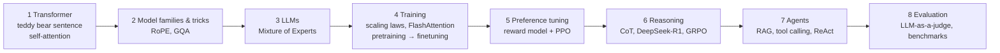
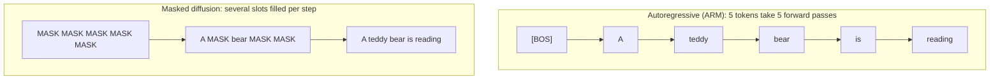

> 🌏 [中文版](/posts/ai/2026-09-29-cme295-current-trends)

This post covers Lecture 9, "Current trends," of the 2025 edition of Stanford [CME295](/posts/ai/2026-09-29-stanford-cme295-transformers-llms-en) (December 5, 2025). The main source is the [128-slide deck](https://cme295.stanford.edu/slides/fall25-cme295-lecture9.pdf); the recording is on [YouTube](https://www.youtube.com/watch?v=Q86qzJ1K1Ss) (1:51:31). Everything here is based on what is written or drawn on the slides, not on what was said in class.

The first eight lectures took a sentence all the way to a model that reasons, uses tools, and can be graded. The last lecture pushes outward in two directions. First, can a Transformer look at pictures? Second, does an LLM really have to write left to right, one token at a time? The agenda has four parts: Recap, Beyond Transformer-based LLMs, Diffusion LLMs, and Closing thoughts.

This lecture is not on the exam, and it is the most scattered of the nine. This post follows two threads in depth, the Vision Transformer and diffusion LLMs, and skims the rest. The math of diffusion is left for a separate post once the 2026 edition's dedicated lecture is out.

## Course video sources

The videos below are the recordings linked for the topics covered in this article.

```youtube
url: https://www.youtube.com/watch?v=Q86qzJ1K1Ss
title: 2025 Lecture 9 recording
```

Original videos: [2025 Lecture 9 recording](https://www.youtube.com/watch?v=Q86qzJ1K1Ss)

Course and recording entries:

- [Official course / lecture source](https://cme295.stanford.edu/syllabus/2025/)

## The whole quarter in eight pictures

The recap is efficient: each lecture keeps one figure or keyword, stacked into a timeline. Read in order, it doubles as the table of contents for this series:



| Lecture | What the recap slide keeps | In this series |
|---|---|---|
| 1 | The sentence "A cute teddy bear is reading.", [Attention Is All You Need](https://arxiv.org/abs/1706.03762) | [From tokens to Transformer](/posts/ai/2026-09-29-cme295-transformer-en) |
| 2 | RoPE, MHA/MQA/GQA | [Transformer families and tricks](/posts/ai/2026-09-29-cme295-transformer-tricks-en) |
| 3 | An MoE gate routing input to several FFN experts | [What turns a Transformer into an LLM](/posts/ai/2026-09-29-cme295-large-language-models-en) |
| 4 | Kaplan and Chinchilla scaling laws, the SRAM/HBM memory hierarchy, the pretraining → finetuning → preference tuning pipeline | [LLM training](/posts/ai/2026-09-29-cme295-llm-training-en) |
| 5 | Bradley-Terry paired comparisons, RLHF's "frozen reward model, trained LLM", PPO's "maximize reward without drifting too far from the base model" | [Preference tuning](/posts/ai/2026-09-29-cme295-preference-tuning-en) |
| 6 | Chain-of-thought, DeepSeek-R1, the GRPO vs. PPO diagram | [LLM reasoning](/posts/ai/2026-09-29-cme295-llm-reasoning-en) |
| 7 | RAG, tool calling, the ReAct-style agent loop | [Agentic LLMs](/posts/ai/2026-09-29-cme295-agentic-llms-en) |
| 8 | LLM-as-a-judge: prompt → response → criteria → rationale → score, plus four kinds of benchmark | [LLM evaluation](/posts/ai/2026-09-29-cme295-llm-evaluation-en) |

The Lecture 8 benchmark table is worth a second look. It splits "is the model good?" into four directions, each with a representative dataset: knowledge (MMLU), reasoning (AIME, PIQA), coding (SWE-bench, which the slide notes also works as a proxy for tool use), and safety (HarmBench).

If any cell in that table leaves you unable to say what problem it solves, go back to that post before reading on.

## Thread one: treat an image like a sentence

### Why point a Transformer at images

The slide asks it plainly: "Can we use Transformers for other things?" It gives two reasons. Transformers have weaker inductive biases than CNNs, which assume nearby pixels are more related. That makes them more general. Attention only cares about how a set of vectors relate to each other; it does not care whether those vectors are words or pieces of a picture.

Then the slides do something blunt: they take the original Transformer diagram, cross out the entire decoder half, keep the encoder, and put a projection layer on top that outputs class probabilities. That is a Transformer for image classification.

### ViT: cut the image into patches and call them tokens

The [Vision Transformer (ViT)](https://arxiv.org/abs/2010.11929) paper's title describes the method: "An Image is Worth 16x16 Words." The image is cut into small squares (patches), and each one is treated as a word. In the abstract's words, reliance on CNNs is not necessary, and "a pure transformer applied directly to sequences of image patches can perform very well on image classification tasks."

The slides walk a teddy bear photo through the whole pipeline, the same way Lecture 1 walked one sentence through:

1. **Cut**: the photo is split into nine patches, each P × P with C color channels
2. **Flatten and project**: each patch becomes a vector of length P·P·C, then a linear layer maps it to a D-dimensional embedding
3. **Prepend `[CLS]`**: a special token goes at the front of the sequence; it corresponds to no patch
4. **Add position embeddings**: as with text, attention cannot see order, so the model is told where each patch came from, giving position-aware embeddings
5. **Run the encoder**: all patches attend to each other, producing encoded embeddings
6. **Classify**: take only the output at the `[CLS]` position, pass it through an FFN, and predict the class "teddy bear"

<details>
<summary>Shape tracking: from an image to a sequence</summary>

```
input image           H × W × C
cut into N patches    N × (P × P × C)      N = (H / P) × (W / P)
linear projection     N × D
prepend [CLS]         (N + 1) × D
add position emb.     (N + 1) × D
Encoder × L           (N + 1) × D
[CLS] → FFN           number of classes
```

In the slides' example N = 9 (a 3 × 3 grid). The "16x16 words" in the ViT title means P = 16 pixels.

</details>

The `[CLS]` trick already appeared with BERT in Lecture 2: reserve a position that stands for nothing in particular, let it gather information from the whole sequence through attention, and classify from its output. ViT carries BERT's encoder-only recipe straight over to images.

### VLMs: letting an LLM see

Classification only outputs a label. The everyday case is uploading a photo, asking "How cute is this teddy bear?", and getting back "Very cute!" Models that do this are called VLMs (Vision Language Models). The slides show two ways to build one:

| Approach | How images get in | Paper cited on the slide |
|---|---|---|
| Method 1: reuse a decoder-only model | The image becomes a sequence of vectors, concatenated with the question's tokens and fed to a "typical" LLM | [Visual Instruction Tuning (LLaVA)](https://arxiv.org/abs/2304.08485) |
| Method 2: add cross-attention layers | Image vectors stay out of the main sequence; the decoder looks them up through cross-attention | [The Llama 3 Herd of Models](https://arxiv.org/abs/2407.21783) |

Method 2's cross-attention is the same layer from Lecture 1's translation model, where the decoder queried the encoder; the thing being queried is now an image instead of an English sentence. Method 1 is the least work, since the LLM barely changes, but the image eats into the context's token budget. The slides do not compare the two. For the trade-offs around resolution and token budgets, [CS336 Lecture 17 on multimodal models](/posts/ai/2026-08-22-cs336-multimodal-alignment-en) is more complete, and [CS224N Lecture 17](/posts/ai/2026-08-22-cs224n-multimodality-en) maps out other routes such as early fusion.

The wrap-up slide for this part lists three big uses of Transformers today: text generation (this course), vision understanding (ViT), and image generation (Diffusion Transformer, MM-DiT, and others), plus recommendation, speech, and more.

## Thread two: does an LLM have to write left to right?

### The autoregressive bottleneck

The slides replay Lecture 1's sentence, step by step: feed `[BOS]`, get "A"; feed "[BOS] A", get "teddy"; and so on. This paradigm is called AutoRegressive Modeling (ARM).

The problem is on the same slide: "Inference-time generation is not parallelizable (although training is)." During training the full answer is already known, so Lecture 1's causal mask lets every position be computed at once. At inference time the next word does not exist yet, so you have to wait for the previous one. A sentence of n tokens takes n forward passes.

### People are already shipping this

The slides show four 2025 news screenshots to make the point that this is more than an academic question:

- On May 20, Google showed [Gemini Diffusion](https://deepmind.google/models/gemini-diffusion/), an experimental text diffusion model, at I/O
- On July 31, ByteDance released [Seed Diffusion Preview](https://seed.bytedance.com/en/seed_diffusion)
- On November 6, the startup [Inception](https://www.inceptionlabs.ai/) [announced a $50 million seed round](https://techcrunch.com/2025/11/06/inception-raises-50-million-to-build-diffusion-models-for-code-and-text/) to build diffusion models for code and text; its website's tagline reads "The Fastest LLMs Ever Built"

### Start with diffusion for images

Diffusion began as an image generation method. The slides give three intuitions: noise is easy to sample, the transformation from noise to image can be learned, and the math is well defined. They quote Michelangelo: the sculpture is already complete inside the marble block, and he only has to chisel away the excess.

The goal is to learn a transformation from noise to the data distribution. Following [DDPM](https://arxiv.org/abs/2006.11239), there are two steps:

1. **Forward process**: add noise to an image step by step until it is pure noise
2. **Reverse process**: train a model to remove the noise step by step

To generate, start from random noise and denoise repeatedly. For the derivation of image diffusion, see this site's posts on [CS229 Chapter 14](/posts/ai/2026-08-22-stanford-cs229-2026-notes-chapter-14-diffusion-models-en) and [CMU 11-785 Lecture 23](/posts/ai/2026-08-22-cmu-11785-23-diffusion-en).

### Moving to text: noise becomes [MASK]

You cannot add a little noise to text; tokens are discrete. The slides make the translation on a single page: "noise" for images corresponds to `MASK` for text.

1. **Forward process**: each token is replaced by `MASK` with some probability. "A teddy bear is reading" might become "A MASK bear is MASK", and eventually everything is masked
2. **Reverse process**: the model learns to fill each `MASK` back in with the original word

This is a **Masked Diffusion Model (MDM)**. Generation starts from five `MASK` tokens and predicts several positions at each step. The slide's key line: "Decoding done in fewer forward passes!"



<details>
<summary>Training and sampling, using LLaDA from the reading list</summary>

The slides give no equations, only three suggested readings: [SEDD](https://arxiv.org/abs/2310.16834), [MDLM](https://arxiv.org/abs/2406.07524), and [LLaDA](https://arxiv.org/abs/2502.09992). The following is a simplified version based on the LLaDA paper:

```
Training (for each sentence x0):
  t ~ Uniform[0, 1]
  xt = x0 with each token independently replaced by [MASK] with probability t
  loss = -(1/t) × Σ_{masked positions i} log pθ(x0[i] | xt)
         (cross-entropy on masked positions only)

Sampling (an answer of length L):
  r = [MASK] × L                      # t = 1, fully masked
  for t stepping down from 1 to 0:
      predict every [MASK] position at once
      re-mask the least confident predictions   # low-confidence remasking
  return r
```

LLaDA's mask predictor is an ordinary Transformer, except that it **does not use a causal mask**, since every position may look at the whole sequence. That is what lets it predict several positions at once.

</details>

### How the slides assess it

The "Discussion" slide lists two advantages: roughly 10x the output tokens per second of an ARM (the slide gives no source for this figure), and a better fit for some tasks. It also lists two challenges: performance still lags, and the techniques built up around ARMs have to be adapted before they carry over.

That is as far as the slides go; the rest belongs to the dedicated post.

## Other trends the slides skim

**Modalities borrowing from each other.** Text borrowed diffusion from images (LLaDA); images borrowed the Transformer from text ([DiT](https://arxiv.org/abs/2212.09748)). Input representations trade too: the slides cite [DeepSeek-OCR](https://arxiv.org/abs/2510.18234), subtitled "Contexts Optical Compression," which uses images to compress text context. Lecture 2's RoPE has also been adapted for images, for example the Multimodal Scalable RoPE in [Qwen-Image](https://arxiv.org/abs/2508.02324).

**Foundational research has not converged.** The slides list design choices that still vary across papers: optimizer (AdamW, or MuonClip as used by [Kimi K2](https://arxiv.org/abs/2507.20534)), normalization, MHA/MQA/GQA, activation functions, MoE or not, number of layers. Another question is "fuel": will there be enough high-quality data in the future? The slides cite [The Curse of Recursion](https://arxiv.org/abs/2305.17493), which argues that training models on model-generated data makes them gradually forget the original distribution. The slides then ask outright: is the Transformer really the best architecture?

**From "best" to "best value."** Using an April 2025 LLM Arena performance-vs-cost Pareto chart, the slides suggest attention is shifting from peak performance to the quality/cost trade-off.

**Hardware built for attention.** GPUs are optimized for matrix multiplication, but attention constantly reads and writes the KV cache, and moving memory dominates the cost. The slides present [an analog in-memory computing architecture by Leroux et al. (2025)](https://arxiv.org/abs/2409.19315) that stores the KV cache in dedicated cells and computes with analog signals. The slides report up to roughly 100x lower latency and roughly 70,000x lower energy than an H100. The paper's abstract is more measured: attention latency and energy drop by "up to two and five orders of magnitude," at GPT-2-level model scale.

## Closing thoughts: applications and open problems

The slides sort applications into four time horizons:

- **Today**: coding (including text-to-query), general conversational assistants, creativity, learning
- **Tomorrow**: democratization of existing agents, with [Google Workspace Studio](https://workspace.google.com/blog/product-announcements/introducing-google-workspace-studio-agents-for-everyday-work) (December 3, 2025) as the example
- **Near term**: browser-level LLMs, with OpenAI's [ChatGPT Atlas](https://openai.com/index/introducing-chatgpt-atlas/) (October 21, 2025) as the example, and perhaps OS-level LLMs further out
- **Long term**: truly autonomous agents with vast responsibilities. The slide adds "Impossible?" and "Actually useful customer service (finally?)"

Five open problems are listed: fixed weights with no continual learning, hallucinations, personalization, interpretability, and safety.

A final slide lists ways to keep up: arXiv's Computation and Language category; NeurIPS, ICML, ICLR, ACL, and EMNLP; authors' GitHub repos; Hugging Face trending papers; and researchers' YouTube channels and lab blogs. The slides also point to the course's [VIP Cheatsheet](https://github.com/afshinea/stanford-cme-295-transformers-large-language-models), available in many languages including Chinese.

## Back to the models you use

When you upload a screenshot to a chat interface and ask about it, a VLM is doing the work. Most commercial models do not disclose how they wire images in, but open models show both routes: LLaVA-style models take Method 1 and concatenate image vectors into the LLM; the Llama 3 paper takes Method 2 with added cross-attention layers. Under Method 1, the image's vectors sit directly in the context, which is one reason high-resolution images cost so many tokens.

Diffusion LLMs are still some way from everyday use: the Gemini Diffusion and Seed Diffusion on the slides are both labeled experimental or preview. What they target is inference speed. A Lecture 7 agent generates a lot of tokens per task, and under an autoregressive model each token waits for the previous one; that is where the speed ceiling sits.

## What changed in the 2026 edition

The 2026 slides have not been released yet, so this compares only the topic lists on the [2026 syllabus](https://cme295.stanford.edu/syllabus/):

- **Diffusion LLMs become Lecture 8** (November 20, 2026), with subtopics continuous diffusion, discrete diffusion, masked diffusion, training, and inference. In 2025 this section ran about 28 slides and stopped at the intuition behind masked diffusion; 2026 brings in both continuous and discrete diffusion and treats training and inference separately.
- **Lecture 9 is renamed "Trending topics"** (December 4, 2026), with subtopics narrowed to Recap, Multimodality, and Closing thoughts. The 2025 ViT and VLM material will likely grow into a full multimodality section, but that can only be confirmed once the slides are out.
- **Knock-on effect**: 2025's Lecture 8, "LLM evaluation," moves up to Lecture 7 in 2026 to make room for diffusion.

The full derivation of continuous and discrete diffusion is in [order 13](/posts/ai/2026-09-29-cme295-diffusion-llms-en) of this series, currently a preview written before the 2026 lecture, to be updated once it is published.

## Self-check

Lecture 9 is not covered by the [2025 final exam](https://cme295.stanford.edu/exams/fall25-cme295-final.pdf). The four questions below are **review questions written by this site**, not official exam questions:

1. How does a ViT turn an H × W × C image into a sequence a Transformer can take? Why does it classify from the `[CLS]` output alone, and which Lecture 2 model uses the same design?
2. Of the two ways to build a VLM, which one makes the image take up the LLM's context length? Which layer of the Lecture 1 Transformer does the other one borrow?
3. Why can an autoregressive LLM parallelize training but not inference? Which Lecture 1 mechanism does a masked diffusion model drop so it can predict several positions at once?
4. Pick one of the five open problems from the closing slides (continual learning, hallucinations, personalization, interpretability, safety) and explain which of the first eight lectures it relates to most.

## Going deeper

- Full trade-offs of multimodality: [CS336 Lecture 17 on multimodal models](/posts/ai/2026-08-22-cs336-multimodal-alignment-en), [CS224N Lecture 17: Multimodality](/posts/ai/2026-08-22-cs224n-multimodality-en)
- Where multimodal models actually stand in 2026: [H1 2026 multimodal model landscape](/posts/ai/2026-08-18-multimodal-models-2026-landscape-en)
- The math of image diffusion: [CS229 Chapter 14: diffusion models](/posts/ai/2026-08-22-stanford-cs229-2026-notes-chapter-14-diffusion-models-en), [CMU 11-785 Lecture 23](/posts/ai/2026-08-22-cmu-11785-23-diffusion-en)
- Why inference cost is bound by memory: [CS336 Lecture 10: LLM inference](/posts/ai/2026-08-22-cs336-inference-en)
- Back to the start: [series overview](/posts/ai/2026-09-29-stanford-cme295-transformers-llms-en)

## Update Log

- 2026-10-10: Added course video sources and recording access notes.

## References

- [CME 295 2025 syllabus](https://cme295.stanford.edu/syllabus/2025/)
- [CME 295 2026 syllabus](https://cme295.stanford.edu/syllabus/)
- [2025 Lecture 9 slides (PDF)](https://cme295.stanford.edu/slides/fall25-cme295-lecture9.pdf)
- [2025 Lecture 9 recording](https://www.youtube.com/watch?v=Q86qzJ1K1Ss)
- [CME 295 VIP Cheatsheet (GitHub)](https://github.com/afshinea/stanford-cme-295-transformers-large-language-models)
- [Vaswani et al., Attention Is All You Need (2017)](https://arxiv.org/abs/1706.03762)
- [Dosovitskiy et al., An Image is Worth 16x16 Words (2020)](https://arxiv.org/abs/2010.11929)
- [Liu et al., Visual Instruction Tuning (2023)](https://arxiv.org/abs/2304.08485)
- [Llama Team, The Llama 3 Herd of Models (2024)](https://arxiv.org/abs/2407.21783)
- [Ho et al., Denoising Diffusion Probabilistic Models (2020)](https://arxiv.org/abs/2006.11239)
- [Lou et al., Discrete Diffusion Modeling by Estimating the Ratios of the Data Distribution (2023)](https://arxiv.org/abs/2310.16834)
- [Sahoo et al., Simple and Effective Masked Diffusion Language Models (2024)](https://arxiv.org/abs/2406.07524)
- [Nie et al., Large Language Diffusion Models (2025)](https://arxiv.org/abs/2502.09992)
- [Peebles & Xie, Scalable Diffusion Models with Transformers (2022)](https://arxiv.org/abs/2212.09748)
- [Wei et al., DeepSeek-OCR: Contexts Optical Compression (2025)](https://arxiv.org/abs/2510.18234)
- [Wu et al., Qwen-Image Technical Report (2025)](https://arxiv.org/abs/2508.02324)
- [Kimi Team, Kimi K2: Open Agentic Intelligence (2025)](https://arxiv.org/abs/2507.20534)
- [Shumailov et al., The Curse of Recursion (2023)](https://arxiv.org/abs/2305.17493)
- [Leroux et al., Analog In-Memory Computing Attention Mechanism for Fast and Energy-Efficient LLMs (2025)](https://arxiv.org/abs/2409.19315)
- [Google DeepMind, Gemini Diffusion](https://deepmind.google/models/gemini-diffusion/)
- [ByteDance Seed, Seed Diffusion Preview](https://seed.bytedance.com/en/seed_diffusion)
- [TechCrunch, Inception raises $50 million to build diffusion models for code and text (2025-11-06)](https://techcrunch.com/2025/11/06/inception-raises-50-million-to-build-diffusion-models-for-code-and-text/)
- [Google Workspace, Introducing Google Workspace Studio](https://workspace.google.com/blog/product-announcements/introducing-google-workspace-studio-agents-for-everyday-work)
- [OpenAI, Introducing ChatGPT Atlas](https://openai.com/index/introducing-chatgpt-atlas/)
