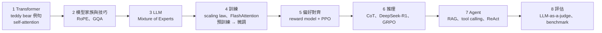
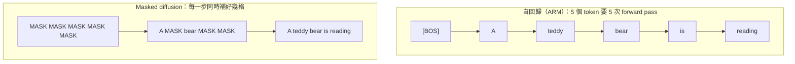

> 🌏 [English version](/posts/ai/2026-09-29-cme295-current-trends-en)

**影片狀態：已附影片；播放未逐支確認。** [影片來源與說明](#課程影片來源)

本篇對應 Stanford [CME295](/posts/ai/2026-09-29-stanford-cme295-transformers-llms) 2025 版第 9 講「Current trends」（2025 年 12 月 5 日）。主要來源是 [128 頁投影片](https://cme295.stanford.edu/slides/fall25-cme295-lecture9.pdf)，錄影在 [YouTube](https://www.youtube.com/watch?v=Q86qzJ1K1Ss)（1:51:31）。本文只根據投影片上的文字與圖寫，沒有轉述課堂口頭內容。

前八講一路把「一句話怎麼變成一個會推理、會用工具、還能被評分的模型」講完了。最後一講往外推了兩步。第一，Transformer 能不能拿來看圖？第二，LLM 一定要從左到右一個字一個字寫嗎？投影片的議程分成四塊：Recap、Beyond Transformer-based LLMs、Diffusion LLMs、Closing thoughts。

這堂課不在考試範圍，內容也最雜。本篇只挑兩條主線細講，Vision Transformer 與 diffusion LLM，其餘趨勢快速帶過。diffusion 的數學細節，會留到 2026 版新開的整講上架後再寫。

## 課程影片來源

下列影片連結已列於本文對應講次的來源。

```youtube
url: https://www.youtube.com/watch?v=Q86qzJ1K1Ss
title: 2025 版第 9 講錄影
```

原始影片：[2025 版第 9 講錄影](https://www.youtube.com/watch?v=Q86qzJ1K1Ss)

課程與錄影入口：

- [官方課程／講次來源](https://cme295.stanford.edu/syllabus/2025/)

## 八張圖複習一整學期

投影片的回顧很有效率：每一講只留一張圖或一個關鍵字，依序堆成一條時間軸。照著它排，就是本系列前八篇的目錄：



| 講 | 回顧投影片留下的重點 | 本系列 |
|---|---|---|
| 1 | 同一句「A cute teddy bear is reading.」、[Attention Is All You Need](https://arxiv.org/abs/1706.03762) | [從切字到 Transformer](/posts/ai/2026-09-29-cme295-transformer) |
| 2 | RoPE、MHA/MQA/GQA | [Transformer 家族與技巧](/posts/ai/2026-09-29-cme295-transformer-tricks) |
| 3 | MoE 的 gating 把輸入分給多個 FFN 專家 | [什麼讓 Transformer 變成 LLM](/posts/ai/2026-09-29-cme295-large-language-models) |
| 4 | Kaplan 與 Chinchilla 的 scaling law、SRAM 與 HBM 的記憶體階層、預訓練 → 微調 → 偏好調整三階段 | [LLM 訓練](/posts/ai/2026-09-29-cme295-llm-training) |
| 5 | Bradley-Terry 成對比較、RLHF 的「凍結 reward model、訓練 LLM」、PPO 的「拿高分但別偏離原模型太遠」 | [偏好對齊](/posts/ai/2026-09-29-cme295-preference-tuning) |
| 6 | Chain-of-thought、DeepSeek-R1、GRPO 與 PPO 的對照圖 | [LLM 推理](/posts/ai/2026-09-29-cme295-llm-reasoning) |
| 7 | RAG、tool calling、ReAct 式 agent 迴圈 | [Agentic LLM](/posts/ai/2026-09-29-cme295-agentic-llms) |
| 8 | LLM-as-a-judge 的 prompt → 回應 → 準則 → 理由 → 分數，以及四類 benchmark | [LLM 評估](/posts/ai/2026-09-29-cme295-llm-evaluation) |

第 8 講那張 benchmark 表值得再看一次。它把「模型好不好」拆成四個方向，各配一個代表資料集：知識（MMLU）、推理（AIME、PIQA）、寫程式（SWE-bench，投影片註明它也可當工具使用能力的代理指標）、安全（HarmBench）。

如果這張表裡有哪一格你說不出它在解決什麼問題，就回去讀那一篇，再往下看。

## 主線一：把一張圖當成一句話

### 為什麼想拿 Transformer 看圖

投影片問得很直接：「Can we use Transformers for other things?」它列的理由有兩個。第一，Transformer 的 inductive bias 比較弱，不像 CNN 預設「相鄰像素比較相關」。第二，因此它更通用。attention 本身只在乎「一組向量彼此之間的關係」，這組向量是字還是圖片的一塊，它並不在意。

接著投影片做了一件很乾脆的事：把原始 Transformer 架構圖的 decoder 那半邊整個打叉，只留 encoder，最上面接一個投影層輸出「各類別的機率」。這就是影像分類版的 Transformer。

### ViT：把圖切成 patch，當成 token

[Vision Transformer（ViT）](https://arxiv.org/abs/2010.11929)的論文標題就是它的做法：「An Image is Worth 16x16 Words」。一張圖被切成許多小方塊（patch），每塊當成一個「字」。論文摘要的說法是，不需要依賴 CNN，「a pure transformer applied directly to sequences of image patches can perform very well on image classification tasks」。

投影片用一張泰迪熊照片走完整個流程，跟第 1 講用同一句例句的做法一樣：

1. **切塊**：照片切成九個 patch，每塊大小是 P × P，有 C 個色彩通道
2. **攤平再投影**：每塊攤平成長度 P·P·C 的向量，經過一個線性層變成 D 維 embedding
3. **加上 `[CLS]`**：序列最前面放一個特殊 token，它本身不對應任何 patch
4. **加位置 embedding**：跟文字一樣，attention 看不出順序，所以要告訴模型每塊來自圖的哪個位置，得到 position-aware embedding
5. **過 encoder**：所有 patch 互相做 self-attention，得到 encoded embeddings
6. **分類**：只取 `[CLS]` 位置的輸出，接一個 FFN，預測類別「teddy bear」

<details>
<summary>形狀追蹤：一張圖變成一個序列</summary>

```
輸入圖片            H × W × C
切成 N 個 patch     N × (P × P × C)      N = (H / P) × (W / P)
線性投影            N × D
前面接 [CLS]        (N + 1) × D
加位置 embedding    (N + 1) × D
Encoder × L         (N + 1) × D
取 [CLS] → FFN      類別數
```

投影片的例子是 N = 9（3 × 3 格）。ViT 論文的「16x16 words」指 P = 16 像素。

</details>

`[CLS]` 的設計在第 2 講的 BERT 就出現過：放一個不代表任何具體內容的位置，讓它透過 attention 蒐集整個序列的資訊，最後拿它的輸出做分類。ViT 等於把 BERT 那套 encoder-only 的做法直接搬到圖片上。

### VLM：讓 LLM 看得到圖

分類只能輸出標籤。真正常用的情境是丟一張照片問「How cute is this teddy bear?」，模型回「Very cute!」。這類模型叫 VLM（Vision Language Model）。投影片列了兩種接法：

| 做法 | 怎麼接 | 投影片引用 |
|---|---|---|
| 方法 1：沿用 decoder-only | 圖片先變成一串向量，跟問題的 token 串在一起，餵給一個「typical」LLM | [Visual Instruction Tuning（LLaVA）](https://arxiv.org/abs/2304.08485) |
| 方法 2：加 cross-attention 層 | 圖片向量不進主序列，decoder 透過 cross-attention 去查圖片 | [The Llama 3 Herd of Models](https://arxiv.org/abs/2407.21783) |

方法 2 的 cross-attention，就是第 1 講翻譯模型裡 decoder 去查 encoder 的那一層，只是被查的對象從英文句子換成了圖片。方法 1 最省事，LLM 幾乎不用改，代價是圖片會吃掉 context 裡的 token 數。投影片沒有比較兩者優劣。想看解析度、token 預算這些取捨，[CS336 Lecture 17：多模態模型](/posts/ai/2026-08-22-cs336-multimodal-alignment)整理得比較完整，[CS224N 第 17 講](/posts/ai/2026-08-22-cs224n-multimodality)則有 early-fusion 等另外幾條路線的閱讀地圖。

這一段的結論頁列出 Transformer 目前的三個大用途：文字生成（這門課本身）、影像理解（ViT）、影像生成（Diffusion Transformer、MM-DiT 等），另外還有推薦系統、語音等。

## 主線二：LLM 一定要從左寫到右嗎

### 自回歸的瓶頸

投影片先用第 1 講的例句逐格示範今天的 LLM 怎麼生成：輸入 `[BOS]`，吐出「A」；再把「[BOS] A」餵回去，吐出「teddy」；以此類推。這種範式叫 AutoRegressive Modeling（ARM）。

問題寫在同一頁上：「Inference-time generation is not parallelizable (although training is)」。訓練時整句答案都在手上，靠第 1 講的 causal mask 可以一次算完所有位置；推論時下一個字還不存在，只能等前一個字生出來。句子多長，就得跑幾次 forward pass。

### 已經有人在做了

投影片放了四則 2025 年的新聞截圖，說明這不只是學術題目：

- Google 在 5 月 20 日的 I/O 展示了 [Gemini Diffusion](https://deepmind.google/models/gemini-diffusion/)，一個實驗性的文字 diffusion 模型
- ByteDance 在 7 月 31 日發表 [Seed Diffusion Preview](https://seed.bytedance.com/en/seed_diffusion)
- 新創 [Inception](https://www.inceptionlabs.ai/) 在 11 月 6 日[宣布募得 5,000 萬美元種子輪](https://techcrunch.com/2025/11/06/inception-raises-50-million-to-build-diffusion-models-for-code-and-text/)，做程式碼與文字的 diffusion 模型；官網標語是「The Fastest LLMs Ever Built」

### 先從圖片的 diffusion 講起

diffusion 原本是影像生成的方法。投影片給的直覺有三點：雜訊很容易取樣、從雜訊到圖片的轉換可以學、而且數學上定義清楚。它引了米開朗基羅的一句話當比喻：雕像早就在大理石裡，他只是把多餘的部分鑿掉。

目標是學一個「從雜訊到資料分布」的轉換。依 [DDPM](https://arxiv.org/abs/2006.11239) 的做法分兩步：

1. **forward process**：對一張圖一步步加雜訊，直到變成純雜訊
2. **reverse process**：訓練模型學會把雜訊一步步去掉

生成時從一團隨機雜訊出發，重複去噪，就得到一張新圖。圖片 diffusion 的推導，站上 [CS229 第 14 章](/posts/ai/2026-08-22-stanford-cs229-2026-notes-chapter-14-diffusion-models)與 [CMU 11-785 第 23 講](/posts/ai/2026-08-22-cmu-11785-23-diffusion)都寫過。

### 搬到文字：雜訊換成 [MASK]

文字不能加一點點雜訊，token 是離散的。投影片的轉換寫在一頁上：影像的「雜訊」，對應到文字的 `MASK`。

1. **forward process**：每個 token 以某個機率被換成 `MASK`。「A teddy bear is reading」可能變成「A MASK bear is MASK」，再往下就全部遮住
2. **reverse process**：模型學會把 `MASK` 填回原本的字

這類模型叫 **MDM（Masked Diffusion Model）**。生成時從五個 `MASK` 出發，每一步同時預測好幾個位置，投影片的重點句是「Decoding done in fewer forward passes!」



<details>
<summary>訓練與取樣：以投影片推薦的 LLaDA 為例</summary>

投影片沒有列公式，只推薦三篇延伸閱讀：[SEDD](https://arxiv.org/abs/2310.16834)、[MDLM](https://arxiv.org/abs/2406.07524)、[LLaDA](https://arxiv.org/abs/2502.09992)。以下依 LLaDA 論文整理，是簡化版：

```
訓練（每一筆句子 x0）：
  t ~ Uniform[0, 1]
  xt = 把 x0 的每個 token 各自以機率 t 換成 [MASK]
  loss = -(1/t) × Σ_{被遮住的位置 i} log pθ(x0[i] | xt)
         （只對被遮住的位置算 cross-entropy）

取樣（生成長度 L 的回答）：
  r = [MASK] × L                      # t = 1，全遮
  for t 從 1 逐步降到 0：
      一次預測所有 [MASK] 位置
      把其中信心最低的一部分重新遮回去   # low-confidence remasking
  回傳 r
```

LLaDA 的 mask predictor 就是一般的 Transformer，差別是**不用 causal mask**，因為每個位置都可以看整句。這也是它能一次預測多個位置的原因。

</details>

### 投影片怎麼評它

投影片的「Discussion」頁列了兩個優點：輸出速度約是 ARM 的 10 倍（tokens per second，投影片沒有註明這個數字的來源），以及某些任務本來就比較適合這種生成方式。挑戰也列了兩個：效能還追不上，以及 ARM 上累積的各種技巧要重新改寫才能套用。

目前能確定的只有這些，其餘留給專講的那篇。

## 其他趨勢：投影片快速帶過的幾件事

**模態之間互借點子。** 文字借了影像的 diffusion（LLaDA）；影像借了文字的 Transformer（[DiT](https://arxiv.org/abs/2212.09748)）。輸入表示也在互借，投影片舉 [DeepSeek-OCR](https://arxiv.org/abs/2510.18234)，標題寫的是「Contexts Optical Compression」，用影像來壓縮文字 context。第 2 講的 RoPE 也被改造給影像用，例子是 [Qwen-Image](https://arxiv.org/abs/2508.02324) 的 Multimodal Scalable RoPE。

**基礎研究還沒收斂。** 投影片列了各家論文仍然選法不一的設計：優化器（AdamW 或 [Kimi K2](https://arxiv.org/abs/2507.20534) 用的 MuonClip）、正規化、MHA/MQA/GQA、activation function、要不要 MoE、層數。另一個問題是「燃料」：未來還有沒有夠多高品質資料？投影片引了 [The Curse of Recursion](https://arxiv.org/abs/2305.17493)，這篇論文指出用模型生成的資料訓練模型，會讓模型逐漸遺忘原始分布。最後投影片自問：Transformer 真的是最好的架構嗎？

**從「最強」轉向「最划算」。** 投影片用一張 2025 年 4 月的 LLM Arena 效能對成本 Pareto 圖，說明關注點正在從最佳表現移向品質與成本的取捨。

**替 attention 設計專用硬體。** GPU 為矩陣乘法最佳化，但 attention 要頻繁讀寫 KV cache，搬資料的成本才是大宗。投影片介紹 [Leroux 等人 2025 年的類比記憶體內運算架構](https://arxiv.org/abs/2409.19315)：把 KV cache 存在專用記憶單元裡，用類比訊號直接算。投影片寫的結果是相對 H100 最多約 100 倍延遲、約 70,000 倍能耗的節省。論文摘要的說法比較保守，是 attention 的延遲與能耗分別降低「up to two and five orders of magnitude」，而且模型規模是 GPT-2 等級。

## 結語：應用與待解的問題

投影片把應用分成四個時間尺度：

- **現在**：寫程式（含 text-to-query）、一般對話助理、創作、學習
- **明天**：既有 agent 普及化，例子是 [Google Workspace Studio](https://workspace.google.com/blog/product-announcements/introducing-google-workspace-studio-agents-for-everyday-work)（2025 年 12 月 3 日）
- **近期**：瀏覽器層級的 LLM，例子是 OpenAI 在 2025 年 10 月 21 日推出的 [ChatGPT Atlas](https://openai.com/index/introducing-chatgpt-atlas/)；再往後可能是作業系統層級
- **長期**：真正自主、承擔大量責任的 agent。投影片在這一格還寫了「Impossible?」，以及「Actually useful customer service (finally?)」。

仍待解決的問題列了五個：權重固定、無法持續學習；幻覺；個人化；可解釋性；安全。

結尾有一頁列出跟上進度的管道：arXiv 的 Computation and Language 分類、NeurIPS／ICML／ICLR／ACL／EMNLP、論文作者的 GitHub、Hugging Face 的 trending papers，以及研究者的 YouTube 頻道與各家實驗室部落格。投影片也附上課程的 [VIP Cheatsheet](https://github.com/afshinea/stanford-cme-295-transformers-large-language-models)，有多國語言版本（含中文），可以課後查閱。

## 連回你用的模型

你在聊天介面上傳一張截圖問問題，背後就是一個 VLM。各家商用模型的內部接法大多沒有公開，但開源模型可以看到這兩條路：LLaVA 一類走方法 1，把影像向量直接串進 LLM；Llama 3 論文則採方法 2，另外加 cross-attention 層。在方法 1 的架構下，圖片切出來的向量直接佔用 context，這也是高解析度圖片特別耗 token 的原因之一。

diffusion LLM 目前離日常使用還有距離：投影片上的 Gemini Diffusion 與 Seed Diffusion 都標明是實驗性或 preview。它瞄準的是推論速度。第 7 講的 agent 一次任務要生成大量 token，在自回歸架構下每個 token 都要等前一個，速度上限就卡在這裡。

## 2026 版改了什麼

2026 版投影片尚未釋出，以下只根據 [2026 課表](https://cme295.stanford.edu/syllabus/)的主題清單比對：

- **Diffusion LLM 獨立成第 8 講**（2026 年 11 月 20 日）：子題是 continuous diffusion、discrete diffusion、masked diffusion、training、inference。2025 版這一段約 28 頁投影片，只講到 masked diffusion 的直覺；2026 版把連續與離散兩種 diffusion 都拉進來，還分開講訓練與推論。
- **第 9 講改名「Trending topics」**（2026 年 12 月 4 日）：子題縮成 Recap、Multimodality、Closing thoughts。2025 版的 ViT 與 VLM 很可能擴充成完整的多模態段落，但實際內容要等投影片出來才能確認。
- **連帶的影響**：2025 版第 8 講「LLM evaluation」在 2026 版前移到第 7 講，讓出位置給 diffusion。

連續／離散 diffusion 的完整推導在本系列 [order 13](/posts/ai/2026-09-29-cme295-diffusion-llms)，目前是 2026 版那一講開課前的預寫版，上架後會再對照更新。

## 自我檢測

第 9 講不在 [2025 期末考](https://cme295.stanford.edu/exams/fall25-cme295-final.pdf)範圍，以下四題是**本站自擬的回顧題**，不是官方考題：

1. ViT 怎麼把一張 H × W × C 的圖變成 Transformer 能吃的序列？最後為什麼只拿 `[CLS]` 位置的輸出做分類？這個設計跟第 2 講的哪個模型一樣？
2. VLM 的兩種接法，哪一種會讓圖片佔用 LLM 的 context 長度？另一種借用了第 1 講 Transformer 裡的哪一層？
3. 自回歸 LLM 為什麼「訓練可以平行、推論不行」？masked diffusion model 為了能一次預測多個位置，拿掉了第 1 講的哪個機制？
4. 課程結尾列的五個待解問題（持續學習、幻覺、個人化、可解釋性、安全），挑一個，說明它跟前八講的哪一講最有關。

## 想深入

- 多模態的完整取捨：[CS336 Lecture 17：多模態模型](/posts/ai/2026-08-22-cs336-multimodal-alignment)、[CS224N 第 17 講：Multimodality](/posts/ai/2026-08-22-cs224n-multimodality)
- 2026 年的多模態模型實況：[2026 上半年多模態模型盤點](/posts/ai/2026-08-18-multimodal-models-2026-landscape)
- 影像 diffusion 的數學：[CS229 第 14 章：擴散模型](/posts/ai/2026-08-22-stanford-cs229-2026-notes-chapter-14-diffusion-models)、[CMU 11-785 第 23 講](/posts/ai/2026-08-22-cmu-11785-23-diffusion)
- 推論成本為什麼卡在記憶體：[CS336 Lecture 10：LLM 推論](/posts/ai/2026-08-22-cs336-inference)
- 回到起點：[本系列總覽](/posts/ai/2026-09-29-stanford-cme295-transformers-llms)

## 更新紀錄

- 2026-10-10：標註影片狀態，核對錄影來源與取得方式。

## 參考資料

- [CME 295 2025 版課表](https://cme295.stanford.edu/syllabus/2025/)
- [CME 295 2026 版課表](https://cme295.stanford.edu/syllabus/)
- [2025 版第 9 講投影片（PDF）](https://cme295.stanford.edu/slides/fall25-cme295-lecture9.pdf)
- [2025 版第 9 講錄影](https://www.youtube.com/watch?v=Q86qzJ1K1Ss)
- [CME 295 VIP Cheatsheet（GitHub）](https://github.com/afshinea/stanford-cme-295-transformers-large-language-models)
- [Vaswani et al., Attention Is All You Need (2017)](https://arxiv.org/abs/1706.03762)
- [Dosovitskiy et al., An Image is Worth 16x16 Words (2020)](https://arxiv.org/abs/2010.11929)
- [Liu et al., Visual Instruction Tuning (2023)](https://arxiv.org/abs/2304.08485)
- [Llama Team, The Llama 3 Herd of Models (2024)](https://arxiv.org/abs/2407.21783)
- [Ho et al., Denoising Diffusion Probabilistic Models (2020)](https://arxiv.org/abs/2006.11239)
- [Lou et al., Discrete Diffusion Modeling by Estimating the Ratios of the Data Distribution (2023)](https://arxiv.org/abs/2310.16834)
- [Sahoo et al., Simple and Effective Masked Diffusion Language Models (2024)](https://arxiv.org/abs/2406.07524)
- [Nie et al., Large Language Diffusion Models (2025)](https://arxiv.org/abs/2502.09992)
- [Peebles & Xie, Scalable Diffusion Models with Transformers (2022)](https://arxiv.org/abs/2212.09748)
- [Wei et al., DeepSeek-OCR: Contexts Optical Compression (2025)](https://arxiv.org/abs/2510.18234)
- [Wu et al., Qwen-Image Technical Report (2025)](https://arxiv.org/abs/2508.02324)
- [Kimi Team, Kimi K2: Open Agentic Intelligence (2025)](https://arxiv.org/abs/2507.20534)
- [Shumailov et al., The Curse of Recursion (2023)](https://arxiv.org/abs/2305.17493)
- [Leroux et al., Analog In-Memory Computing Attention Mechanism for Fast and Energy-Efficient LLMs (2025)](https://arxiv.org/abs/2409.19315)
- [Google DeepMind, Gemini Diffusion](https://deepmind.google/models/gemini-diffusion/)
- [ByteDance Seed, Seed Diffusion Preview](https://seed.bytedance.com/en/seed_diffusion)
- [TechCrunch, Inception raises $50 million to build diffusion models for code and text (2025-11-06)](https://techcrunch.com/2025/11/06/inception-raises-50-million-to-build-diffusion-models-for-code-and-text/)
- [Google Workspace, Introducing Google Workspace Studio](https://workspace.google.com/blog/product-announcements/introducing-google-workspace-studio-agents-for-everyday-work)
- [OpenAI, Introducing ChatGPT Atlas](https://openai.com/index/introducing-chatgpt-atlas/)
