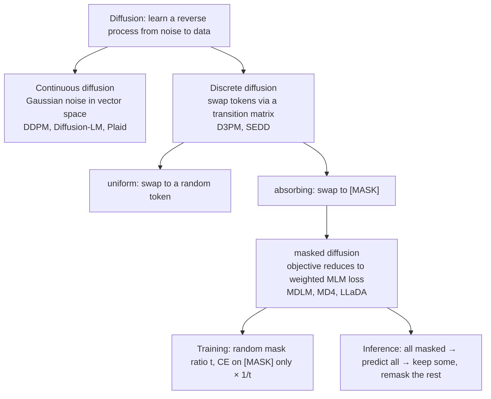
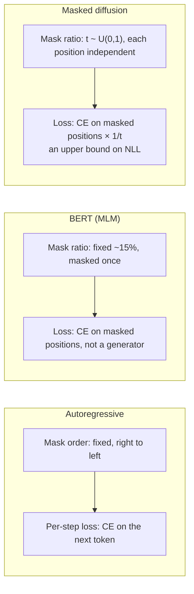
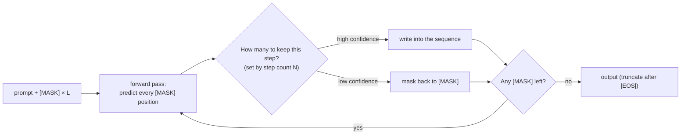

> 🌏 [中文版](/posts/ai/2026-09-29-cme295-diffusion-llms)

> **Written before the lecture**: this post was written on September 29, 2026. Lecture 8 of the 2026 edition (November 20, 2026) has not happened yet. The content is based on the topic list in the 2026 syllabus, the parts already covered in the 2025 slides, and the original papers. It will be checked against the video and slides once they are released.

The 2026 edition of Stanford [CME295](/posts/ai/2026-09-29-stanford-cme295-transformers-llms-en) devotes all of Lecture 8 to "Diffusion LLMs." The [2026 syllabus](https://cme295.stanford.edu/syllabus/) lists five subtopics: continuous diffusion, discrete diffusion, masked diffusion, training, and inference. The "Difference with last year's edition" slide in the 2026 [Lecture 1 deck](https://cme295.stanford.edu/slides/fall26-cme295-lecture1.pdf) also names Diffusion LLMs as one of three new additions.

The 2025 edition covered this topic in about 28 slides at the end of its last lecture, and [order 9](/posts/ai/2026-09-29-cme295-current-trends-en) of this series already walked through that introduction: why autoregressive (ARM) inference cannot be parallelized, the forward/reverse intuition of image diffusion, replacing noise with `[MASK]` for text, and simplified LLaDA pseudocode for training and sampling. This post does not repeat any of that.

Instead it picks up the three questions order 9 left open:

1. What actually separates continuous, discrete and masked diffusion, the three items on the syllabus? Why did text end up almost entirely on the masked branch?
2. Why is the masked diffusion objective "cross-entropy on masked positions only, multiplied by 1/t"?
3. Where does the speed of "filling several positions at once" come from, and what does it cost?

The 2026 slides and recording are not out yet. Anything marked "2025 slides" below comes from pages 71–98 of the [2025 Lecture 9 deck](https://cme295.stanford.edu/slides/fall25-cme295-lecture9.pdf). Everything else comes from the original papers and official pages, and does not represent how the 2026 lecture will present it.

## Course video sources

Official course and existing recording entries are linked below. A single public video matching this article has not been verified for embedding.

Course and recording entries:

- [Official course / lecture source](https://cme295.stanford.edu/syllabus/2025/)

## Start with a contradiction: where does 10x come from

The "Discussion" slide in the 2025 deck says diffusion LLMs produce roughly 10x the output tokens per second of an ARM. Yet the [LLaDA](https://arxiv.org/abs/2502.09992) paper recommended on the same slides sets the number of sampling steps equal to the generation length in its main experiments, for a fair comparison. That means **one token is unmasked per step**. Run that way, it takes exactly as many forward passes as an autoregressive model, and LLaDA has no KV cache on top of that.

Both statements are true. The "speed" of a diffusion LLM is a dial: fewer steps means filling more positions per step, and quality drops. To understand the trade-off you need to take apart, in order, how the three kinds of diffusion differ, the training objective, and the inference algorithm. Those happen to be the five subtopics on the syllabus.



## Syllabus topic 1: Continuous diffusion

### Intuition: turn tokens into vectors, then add noise the way images do

Continuous diffusion is the image-generation recipe. [DDPM](https://arxiv.org/abs/2006.11239) (Ho et al., 2020) adds Gaussian noise to an image over many steps until it is pure noise; at each step the model learns what the noise in the image looks like, and generation starts from random noise and subtracts it step by step. The paper uses T = 1000 steps. The derivation is covered on this site in [CS229 Chapter 14](/posts/ai/2026-08-22-stanford-cs229-2026-notes-chapter-14-diffusion-models-en) and [CMU 11-785 Lecture 23](/posts/ai/2026-08-22-cmu-11785-23-diffusion-en).

The trouble with text is that tokens are discrete. "Add a little noise to teddy" means nothing. The most direct fix is to map each token to an embedding vector, run diffusion in vector space, and "round" each vector back to the nearest word at the end. [Diffusion-LM](https://arxiv.org/abs/2205.14217) (Li et al., 2022) does exactly this: it adds an embedding step and a rounding step around standard diffusion, and trains the embeddings end to end with the model.

<details>
<summary>Mechanism: DDPM noising and objective, plus the two extra steps for text</summary>

```
DDPM (images)
  forward: q(x_t | x_{t-1}) = N( √(1-β_t) · x_{t-1},  β_t · I )
  jump to any step: x_t = √(ᾱ_t) · x_0 + √(1-ᾱ_t) · ε,   ε ~ N(0, I)
                    ᾱ_t = Π_{s≤t} (1 - β_s)
  training (simplified): L_simple = E_{t, x_0, ε} || ε − ε_θ(x_t, t) ||²
  paper setting: T = 1000, β increases linearly from 1e-4 to 0.02

Diffusion-LM (text)
  embedding: w (a token sequence) → x_0 = EMB(w), EMB is trainable
  noise and denoise x_0 as in DDPM
  rounding: x_0 → at each position argmax p_θ(w_i | x_0,i) to recover the nearest word
```

</details>

### Why it did not become the mainstream route for text

Diffusion-LM's selling point is control: the intermediate variables are continuous, so you can take gradients on them and steer fine-grained properties such as syntactic structure. Speed and quality suffer. The paper's appendix says sampling runs 2000 steps, and even at 200 steps decoding is still 7x slower than an autoregressive LM.

The gap survives scaling. [Plaid](https://arxiv.org/abs/2305.18619) (Gulrajani & Hashimoto, 2023) focuses on likelihood training and scaling laws for continuous diffusion language models. Its Plaid 1B beats GPT-2 124M on likelihood, but the paper's own estimate is that Plaid needs roughly 64x the compute to match an autoregressive model, regardless of scale. LLaDA's related-work section cites this figure as an example of why continuous approaches are hard to scale.

**Back to the models you use**: among today's well-known diffusion LLMs whose public technical documents describe the method, most take the discrete route below. Continuous diffusion has not disappeared from text, but it is a research line, not a product line.

## Syllabus topic 2: Discrete diffusion

### Intuition: swap tokens directly in the vocabulary

Discrete diffusion skips the vector space and defines "adding noise" directly on the vocabulary: at each step, each token has some probability of being replaced by something else. What it becomes is set by a transition matrix Q. [D3PM](https://arxiv.org/abs/2107.03006) (Austin et al., 2021) laid out this framework and compared several matrices:

| Transition | What a token turns into | What you get at the end |
|---|---|---|
| uniform | any word in the vocabulary, uniformly | a string of random words |
| absorbing | stays the same or becomes `[MASK]`, and never comes back | all `[MASK]` |
| discretized Gaussian | a numerically nearby state (for pixels) | uniform distribution |
| nearest neighbor | a word close in embedding space | uniform distribution |

On the character-level text8 dataset, D3PM found the absorbing (`[MASK]`) model was "by far the best performing model." Nearest-neighbor diffusion, based on embedding similarity, barely beat uniform; on LM1B its log-likelihood was even worse than uniform. The authors read this as a sign that word-embedding similarity is not necessarily the right notion of "distance" for diffusion.

D3PM also shows how two familiar models fit inside this framework, which helps place diffusion within the LLM family:

- **BERT is a one-step diffusion model**: in a single step, replace some tokens with `[MASK]` and some with random tokens, and the ELBO reduces to BERT's denoising objective
- **Autoregressive models are also discrete diffusion models**: if the forward process deterministically masks one token per step starting from the end, the loss at each step is the autoregressive cross-entropy

So the three differ in how they mask, over how many steps, and whether the order is fixed or random. Autoregression always masks right to left (and generates left to right); masked diffusion masks each position independently and at random.

<details>
<summary>Mechanism: D3PM transition matrices</summary>

```
x is a one-hot row vector, K is the vocabulary size
forward: q(x_t | x_{t-1}) = Cat( x_t ; p = x_{t-1} · Q_t )
jump to step t: q(x_t | x_0) = Cat( x_t ; p = x_0 · Q̄_t ),  Q̄_t = Q_1 Q_2 … Q_t

uniform:   Q_t = (1 − β_t) · I + (β_t / K) · 1 1ᵀ
absorbing: Q_t = (1 − β_t) · I + β_t · 1 e_mᵀ      e_m is the one-hot for [MASK]

training: variational bound L_vb, plus an auxiliary cross-entropy term in D3PM (L_λ = L_vb + λ·CE)
```

</details>

### SEDD: carrying score matching into discrete space

Continuous diffusion rests on a mature theory: learn the score of the data distribution (the gradient of the log probability). Discrete spaces have no gradient. [SEDD](https://arxiv.org/abs/2310.16834) (Lou et al., 2023, the first reading suggested on the 2025 slides) learns probability ratios instead: for the current sequence x, how many times more likely is another sequence y, i.e. p(y)/p(x). The paper calls this set of ratios the concrete score and designs a loss called score entropy to learn it.

The abstract lists three results. At comparable size, SEDD reduces perplexity by 25–75% over existing language diffusion models and outperforms GPT-2. It generates faithful text without annealing tricks like temperature scaling. And it can trade quality for compute, reaching similar quality with 32x fewer network evaluations. The paper implements both uniform and absorbing variants; the absorbing one has better perplexity on every dataset reported.

<details>
<summary>Mechanism: score entropy</summary>

```
learn a network s_θ(x)_y ≈ p(y) / p(x)        (y differs from x in one position)

L_SE = E_{x~p} Σ_{y≠x} w_xy · [ s_θ(x)_y − (p(y)/p(x)) · log s_θ(x)_y + K( p(y)/p(x) ) ]
       K(a) = a · (log a − 1), which keeps L_SE ≥ 0

training uses a tractable denoising version (DSE) that does not need the true p.
```

</details>

**Back to the models you use**: Inception's [Mercury technical report](https://arxiv.org/abs/2506.17298) states that its method extends SEDD, the Lou et al. paper.

## Syllabus topic 3: Masked diffusion

### Intuition: once the absorbing state wins, the math simplifies a lot

Since the `[MASK]` absorbing state kept winning on text, two groups independently simplified its math in 2024: [MDLM](https://arxiv.org/abs/2406.07524) (Sahoo et al., 2024, the second suggested reading on the 2025 slides) and [MD4](https://arxiv.org/abs/2406.04329) (Shi et al., 2024). They reach the same conclusion: the continuous-time ELBO of masked diffusion reduces to **a weighted average of masked language modeling losses across mask ratios**. In MD4's abstract, it is "a simple weighted integral of cross-entropy losses."

MDLM's simplification rests on two constraints that are intuitively sensible, which the paper calls the SUBS parameterization:

- **Zero masking probabilities**: when the model predicts the original token, it never predicts `[MASK]`, because clean data contains no `[MASK]`
- **Carry-over unmasking**: positions that are no longer `[MASK]` are copied through unchanged

With these two in place, many terms in the ELBO become zero, and what is left is the log probability of recovering the original token at masked positions. MDLM's experiments show this objective has lower variance. On LM1B it improves the perplexity bound by 17% over SEDD at the same training budget and comes within 14% of the autoregressive baseline.

The second constraint has a cost that comes back in the inference section: once a position is filled, it is never changed again.

<details>
<summary>Mechanism: MDLM's continuous-time NELBO and how it relates to the LLaDA loss</summary>

```
α_t: probability that a token is still unmasked at time t; α_0 = 1, α_1 = 0, monotonically decreasing
z_t: partially masked sequence; x: original sequence; m: [MASK]

MDLM (Eq. 10 in the paper):
  L_NELBO = E_q ∫_0^1  α'_t / (1 − α_t) · log < x_θ(z_t, t), x >  dt
  only positions where z_t is [MASK] contribute (carry-over zeroes out the rest)

With a linear schedule α_t = 1 − t  →  α'_t = −1, 1 − α_t = t
  L = E_t [ (1/t) · Σ_{masked positions i} −log p_θ( x_i | z_t ) ]

This is the form of Eq. (3) in the LLaDA paper; MDLM also notes the objective is insensitive to the choice of noise schedule.
```

</details>

### How it differs from BERT

The masked diffusion loss looks almost identical to [BERT](https://arxiv.org/abs/1810.04805)'s MLM loss. There are two differences. First, BERT masks a fixed ratio of about 15%; masked diffusion draws the mask ratio t at random between 0 and 1 for every example. The model therefore sees everything from "almost fully masked" to "almost unmasked," which is what lets it generate a whole sentence starting from all `[MASK]`. The LLaDA paper stresses that this matters a lot at scale. Second, the 1/t weight makes the loss an upper bound on negative log-likelihood, so masked diffusion is a generative model with a likelihood and can be compared to autoregressive models on perplexity.



## Syllabus topic 4: Training

### LLaDA: masked diffusion at 8B

[LLaDA](https://arxiv.org/abs/2502.09992) (Nie et al., 2025, the third suggested reading on the 2025 slides) shows the approach scales with the usual LLM recipe. Its mask predictor is a plain Transformer; the only architectural change is dropping the causal mask so every position can see the whole sequence.

- **Pretraining**: 2.3 trillion tokens, sequence length 4096, 0.13 million H800 GPU hours. The paper says this is similar to an autoregressive model of the same scale and data size
- **Variable length**: 1% of pretraining sequences get a length drawn uniformly from [1, 4096], so the model sees different lengths
- **SFT**: 4.5 million prompt–response pairs. The prompt is never masked; only the response is. Short responses are padded with `|EOS|` to equal length, and those `|EOS|` tokens are masked and included in the loss, so the model learns to decide its own response length

The paper's abstract says LLaDA 8B is competitive with LLaMA3 8B at in-context learning. Its most cited result is the reversal curse: given a line of a poem, produce the next line (forward) or the previous line (reversal). GPT-4o scores 82.7 forward and only 34.3 reversal; LLaDA 8B Instruct scores 51.8 and 45.6. LLaDA is weaker forward and stronger in reverse, and the gap between the two directions is much smaller. The paper's explanation is that it treats all positions uniformly, without a left-to-right inductive bias.

<details>
<summary>Mechanism: LLaDA pretraining and SFT losses</summary>

```
Pretraining (Eq. 3 in the paper):
  t ~ U[0, 1]
  x_t: each token of x_0 is replaced by [MASK] independently with probability t
  L(θ) = − E_{t, x_0, x_t} [ (1/t) · Σ_{i=1}^{L} 1[x_t^i = M] · log p_θ( x_0^i | x_t ) ]
  and  − E[ log p_θ(x_0) ] ≤ L(θ)        (Eq. 4)

SFT:
  (p_0, r_0) is a prompt and a response
  mask only r_0 to get r_t; p_0 stays intact
  L = − E [ (1/t) · Σ_{i ∈ response} 1[r_t^i = M] · log p_θ( r_0^i | p_0, r_t ) ]
```

</details>

### Harder training, more flexible inference

[Kim et al. (2025)](https://arxiv.org/abs/2502.06768), an [ICML 2025 Outstanding Paper](https://kempnerinstitute.harvard.edu/news/kempner-institute-researchers-win-outstanding-paper-award-at-icml-2025/), states the trade-off clearly. An autoregressive model only has to learn one kind of subproblem: predict the next token from the prefix. A masked diffusion model has to learn an exponentially large family of infilling problems, "any positions masked, recover them," and some of those are computationally hard. In return, it can decode in any order at inference time and solve the easy positions first. The site's [2025 AI conference topics roundup](/posts/ai/2026-08-24-ai-conference-2025-topics-en) also covers this paper.

**Back to the models you use**: the Mercury technical report says further fine-tuning, RLHF and DPO all carry over, with the "key change" being to replace the autoregressive loss with a denoising diffusion loss. LLaDA's limitations section notes that it has not yet been aligned with reinforcement learning. How to do RL on diffusion LLMs is still a research question; PPO and GRPO on autoregressive models are covered in [order 11](/posts/ai/2026-09-29-cme295-rl-with-llms-en) of this series.

## Syllabus topic 5: Inference

### The basic sampling loop

To generate a response of length L, LLaDA:

1. Appends L `[MASK]` tokens to the prompt (the length is a hyperparameter; anything after `|EOS|` is discarded)
2. Runs the whole sequence through the model at each step and **predicts every `[MASK]` position at once**
3. Masks some of the predictions back to `[MASK]`, in the proportion the forward process dictates, and keeps the rest
4. Repeats until nothing is masked. The total number of steps N is also a hyperparameter



### Dial one: which predictions to mask back

In theory, step 3 should pick at random which predictions to mask back, so that the reverse process matches the forward one. LLaDA actually uses **low-confidence remasking**: mask back the predictions the model is least sure about and keep the most confident ones. The ablation in the appendix shows a large gap: on GSM8K, random remasking scores 21.3 and low-confidence remasking scores 70.0.

Kim et al. see the same effect on Sudoku, more dramatically. A pretrained masked diffusion model decoding in the usual random order solves under 7% of puzzles; choosing the next cell by confidence raises that to about 90%, beating autoregressive models with 7x as many parameters that were explicitly trained on the right decoding order.

A terminology trap: LLaDA's remasking only chooses among the tokens predicted in the current step. Tokens already kept are never touched again (this is MDLM's carry-over unmasking). [ReMDM](https://arxiv.org/abs/2503.00307) (Wang et al., 2025) points out that this is exactly masked diffusion's weakness: once a token is generated, it cannot be fixed even if it is wrong. Its sampler lets already-decoded tokens be masked again, so more steps means more chances to correct, which gives masked diffusion a form of inference-time compute scaling.

### Dial two: how many positions per step

The ratio of step count N to generation length L sets how many tokens get decoded per step. LLaDA's appendix measures this on an A100: for 256 output tokens, 256, 128, 64 and 32 steps correspond to 1, 2, 4 and 8 tokens per forward pass. On GSM8K and Math, at comparable quality, LLaDA 8B Base reaches 1.5x and 1.8x the throughput of LLaMA3 8B Base, even though LLaMA3 uses a KV cache and LLaDA uses no inference optimizations at all. On MBPP, LLaDA falls behind.

Why can't you keep speeding up? [Fast-dLLM](https://arxiv.org/abs/2505.22618) (Wu et al., 2025) gives an example: "The list of poker hands that consist of two English words are: _ _." Valid answers include high card, two pair, full house. When the model fills both blanks in one step, it samples each blank **independently**, so it can produce "high house," which does not exist. This is the conditional independence assumption: the more positions you fill per step, the more of the dependency between them you throw away.

<details>
<summary>Mechanism: why parallel decoding goes wrong</summary>

```
Unmasking positions i and j in one step, masked diffusion actually samples from
    p(x_i | x_t) · p(x_j | x_t)
but the true joint distribution is
    p(x_i, x_j | x_t) = p(x_i | x_t) · p(x_j | x_i, x_t)

The two are equal only when x_i and x_j are independent given x_t.
Decoding one token per step (N = L) avoids the problem, but gives no speedup.
```

</details>

Fast-dLLM's fix is not to fix the number of tokens per step at all. It sets a **confidence threshold** instead: whichever positions exceed it in this step get decoded, and the rest wait. Combined with an **approximate KV cache** designed for bidirectional attention (generate block by block and reuse the cache across blocks; the variant that also caches the suffix is called DualCache), it reaches up to 27.6x throughput on LLaDA and Dream. That multiplier is relative to **vanilla LLaDA**, not to an autoregressive model.

### Dial three: whether to go left to right in blocks

Pure diffusion has two engineering headaches: the output length has to be fixed in advance, and every step recomputes attention over the whole sequence, so there is no KV cache the way autoregression has one (order 9 noted this follows from dropping the causal mask).

[Block Diffusion](https://arxiv.org/abs/2503.09573) (Arriola et al., 2025) compromises: blocks are generated left to right, and positions within a block are filled in parallel by diffusion. This allows arbitrary-length output and a KV cache over completed blocks. MDLM also has a similar semi-autoregressive sampler. LLaDA can switch to this kind of sampling without retraining. On GSM8K, LLaDA Instruct with semi-autoregressive sampling and block length 32 scores 77.5, above pure diffusion's 69.4. The paper attributes this to the heavy `|EOS|` padding in its SFT data: under pure diffusion sampling the most confident predictions are often trailing `|EOS|` tokens, which ends generation too early.

The three dials side by side, with one related choice added as the last row: whether already-filled tokens can be changed again (ReMDM):

| Dial | Turned toward "fast" | Cost |
|---|---|---|
| Positions per step | fewer steps, more per step | conditional independence produces inconsistent combinations |
| Which positions | pick by confidence, use a threshold | drifts from the theoretical sampling distribution; the threshold needs tuning |
| Blocks or not | blocks enable KV cache and variable length | partly back to left-to-right order |
| Can filled tokens change | no edits saves steps | early mistakes stick; ReMDM allows edits at the cost of more steps |

**Back to the models you use**: this is the same bottleneck that speculative decoding in [order 10](/posts/ai/2026-09-29-cme295-llm-systems-en) attacks: an autoregressive model produces one token per forward pass. Speculative decoding keeps the autoregressive model and has a small model guess several tokens to verify at once; a diffusion LLM replaces the generation procedure itself. For why inference is bound by memory bandwidth, [CS336 Lecture 10](/posts/ai/2026-08-22-cs336-inference-en) works through the arithmetic.

## Back to the models you use: what industry has published

Only officially published information is listed here, checked on 2026-09-29.

- **Google [Gemini Diffusion](https://deepmind.google/models/gemini-diffusion/)**: the official page still calls it an "experimental demo." It lists an average sampling speed of 1,479 tokens per second excluding overhead, with 0.84 seconds of overhead. The stated features are generating whole blocks of tokens at once and correcting errors during generation (iterative refinement). The benchmark table compares it with Gemini 2.0 Flash-Lite and the results go both ways: 23.3% vs 20.0% on AIME 2025, but 40.4% vs 56.5% on GPQA Diamond. Google has not said which kind of diffusion it uses.
- **Inception Mercury**: the June 2025 [technical report](https://arxiv.org/abs/2506.17298) says the models are Transformers, the method extends SEDD, and serving uses a proprietary inference engine. In independent tests by Artificial Analysis, Mercury Coder Mini and Small ran at 1,109 and 737 tokens per second on H100s. The latest model on the site is [Mercury 2.5](https://www.inceptionlabs.ai/blog/introducing-mercury-2-5): Inception states 1,107 tokens per second, a 260K context, and pricing of $0.20 per million input tokens and $0.75 per million output tokens (with a limited launch discount), and claims it is the largest diffusion language model trained to date. The announcement does not disclose parameter count or method details.
- **ByteDance [Seed Diffusion Preview](https://arxiv.org/abs/2508.02193)**: the abstract describes a discrete-state diffusion model running at 2,146 tokens per second on H20 GPUs, evaluated mainly on code.
- **Open weights**: the LLaDA line continued with LLaDA-MoE and LLaDA 2.x, summarized in the site's [Ant Group Ling model family](/posts/tech/2026-09-19-ai-model-family-ling-en) post; another common point of comparison is [Dream 7B](https://arxiv.org/abs/2508.15487).

Two things to keep in mind when reading these numbers. First, high tokens per second does not mean answer quality keeps up; the Gemini Diffusion table shows it trailing a small model of the same generation on reasoning and multilingual benchmarks. Second, speeds measured on different hardware and batch settings are not directly comparable. The deployments Inception itself highlights are search agents, voice agents, and auxiliary calls inside coding agents (such as context compaction): jobs that make many calls per task and need each one to be fast. That is a vendor claim, but it matches the trade-off table above: diffusion speed pays off most where quality demands are not extreme and latency matters a lot.

## Where the 2025 edition covered this

| 2025 Lecture 9 slides | Content | This series |
|---|---|---|
| ~pp. 71–81 | Autoregressive token-by-token generation, "Inference-time generation is not parallelizable (although training is)" | [order 9](/posts/ai/2026-09-29-cme295-current-trends-en) |
| ~p. 82 | Four 2025 news items: Gemini Diffusion, Inception funding, Inception website, Seed Diffusion | order 9; this post updates to official information as of 2026-09-29 |
| ~pp. 83–89 | Intuition for image diffusion (the sculpture analogy), DDPM forward/reverse | order 9; this post adds the formulas |
| ~pp. 90–96 | Noise becomes `MASK`, MDM, "Decoding done in fewer forward passes!", suggested readings SEDD/MDLM/LLaDA | order 9; this post adds the SEDD and MDLM mechanisms |
| ~pp. 97–98 | Discussion: ~10x tokens/s, better suited for some tasks; challenges are performance and porting ARM techniques | the "Inference" section here unpacks where 10x comes from and what it costs |

What the 2026 syllabus lists that the 2025 slides never touched:

- **Continuous diffusion** as a route for text (2025 used it only to explain images)
- **Discrete diffusion** as a general framework (transition matrices, uniform vs absorbing)
- **Training** and **Inference** as separate subtopics. The 2025 slides had no formulas and did not discuss remasking strategies or the steps-vs-quality trade-off

How the 2026 lecture actually presents these, and with which examples, will only be known once the slides are out.

## Self-check

Lecture 8 is new in the 2026 edition, and neither the [2025 midterm](https://cme295.stanford.edu/exams/fall25-cme295-midterm.pdf) nor the [final](https://cme295.stanford.edu/exams/fall25-cme295-final.pdf) has matching questions. The five questions below are **written by this site**, not official exam questions:

1. Which two steps does continuous diffusion add around standard diffusion to work on text? Roughly how large is the compute gap to autoregressive models, according to the Plaid paper?
2. In D3PM, what does the sequence become at the end of noising under the uniform and the absorbing transition matrices? Why can BERT be called a "one-step diffusion model"?
3. What two constraints make up MDLM's SUBS parameterization? Which one means a filled token can never be changed?
4. Both the LLaDA loss and BERT's MLM loss compute cross-entropy only on `[MASK]` positions. What are the two differences, and why do they let LLaDA generate a whole passage from a fully masked sequence?
5. A diffusion LLM unmasks 8 tokens per step. What can go wrong? Name two mitigations and the cost of each.

## Going deeper

- Work through the probabilistic derivation of diffusion: [CS229 Chapter 14: Diffusion Models](/posts/ai/2026-08-22-stanford-cs229-2026-notes-chapter-14-diffusion-models-en), [CMU 11-785 Lecture 23](/posts/ai/2026-08-22-cmu-11785-23-diffusion-en), [MIT 6.S191 generative modeling](/posts/ai/2026-08-22-mit-6s191-l04-generative-modeling-en)
- Run it yourself: the [MDLM](https://s-sahoo.com/mdlm) and [Block Diffusion](https://m-arriola.com/bd3lms) project pages include code and tutorials; the [LLaDA project page](https://ml-gsai.github.io/LLaDA-demo/) links weights and sampling code
- Another answer to the same bottleneck: [order 10: LLM systems](/posts/ai/2026-09-29-cme295-llm-systems-en), [CS336 Lecture 10: LLM inference](/posts/ai/2026-08-22-cs336-inference-en)
- This series' introductory treatment: [order 9: Lecture 9, Current trends](/posts/ai/2026-09-29-cme295-current-trends-en); back to the [series overview](/posts/ai/2026-09-29-stanford-cme295-transformers-llms-en)

## Update plan

Once the November 20, 2026 video and slides are released, this post will be checked against the following:

- Which papers and examples the lecture uses for the five subtopics, and how they differ from the choices here
- Whether the slides derive the training objective, and whether they follow SEDD, MDLM or LLaDA notation
- Which sampling strategies the inference part covers, and whether it mentions KV caching and block generation
- Whether the 2025 slides' "~10x tokens/s" gets an updated figure or a cited source
- If the final exam (December 9, 2026) is released and covers this lecture, replace the self-check with questions adapted from the official exam

## Update Log

- 2026-10-10: Added course video sources and recording access notes.

## References

- [CME 295 2026 syllabus](https://cme295.stanford.edu/syllabus/)
- [CME 295 2025 syllabus](https://cme295.stanford.edu/syllabus/2025/)
- [2026 Lecture 1 slides (PDF)](https://cme295.stanford.edu/slides/fall26-cme295-lecture1.pdf)
- [2025 Lecture 9 slides (PDF)](https://cme295.stanford.edu/slides/fall25-cme295-lecture9.pdf)
- [Ho et al., Denoising Diffusion Probabilistic Models (2020)](https://arxiv.org/abs/2006.11239)
- [Li et al., Diffusion-LM Improves Controllable Text Generation (2022)](https://arxiv.org/abs/2205.14217)
- [Gulrajani & Hashimoto, Likelihood-Based Diffusion Language Models (2023)](https://arxiv.org/abs/2305.18619)
- [Austin et al., Structured Denoising Diffusion Models in Discrete State-Spaces (2021)](https://arxiv.org/abs/2107.03006)
- [Lou et al., Discrete Diffusion Modeling by Estimating the Ratios of the Data Distribution (2023)](https://arxiv.org/abs/2310.16834)
- [Sahoo et al., Simple and Effective Masked Diffusion Language Models (2024)](https://arxiv.org/abs/2406.07524)
- [Shi et al., Simplified and Generalized Masked Diffusion for Discrete Data (2024)](https://arxiv.org/abs/2406.04329)
- [Devlin et al., BERT: Pre-training of Deep Bidirectional Transformers for Language Understanding (2018)](https://arxiv.org/abs/1810.04805)
- [Nie et al., Large Language Diffusion Models (2025)](https://arxiv.org/abs/2502.09992)
- [Kim et al., Train for the Worst, Plan for the Best: Understanding Token Ordering in Masked Diffusions (2025)](https://arxiv.org/abs/2502.06768)
- [Wang et al., Remasking Discrete Diffusion Models with Inference-Time Scaling (2025)](https://arxiv.org/abs/2503.00307)
- [Wu et al., Fast-dLLM: Training-free Acceleration of Diffusion LLM by Enabling KV Cache and Parallel Decoding (2025)](https://arxiv.org/abs/2505.22618)
- [Arriola et al., Block Diffusion: Interpolating Between Autoregressive and Diffusion Language Models (2025)](https://arxiv.org/abs/2503.09573)
- [Inception Labs, Mercury: Ultra-Fast Language Models Based on Diffusion (2025)](https://arxiv.org/abs/2506.17298)
- [Inception, Introducing Mercury 2.5 (checked 2026-09-29)](https://www.inceptionlabs.ai/blog/introducing-mercury-2-5)
- [Google DeepMind, Gemini Diffusion (checked 2026-09-29)](https://deepmind.google/models/gemini-diffusion/)
- [Song et al., Seed Diffusion: A Large-Scale Diffusion Language Model with High-Speed Inference (2025)](https://arxiv.org/abs/2508.02193)
- [Ye et al., Dream 7B: Diffusion Large Language Models (2025)](https://arxiv.org/abs/2508.15487)
