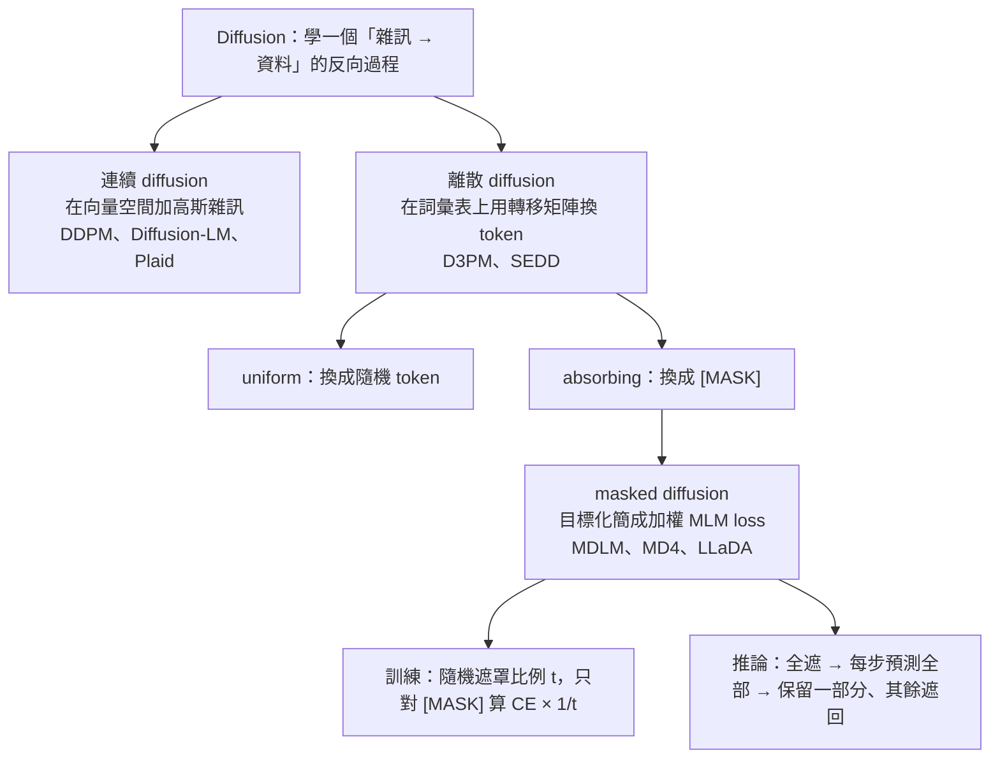
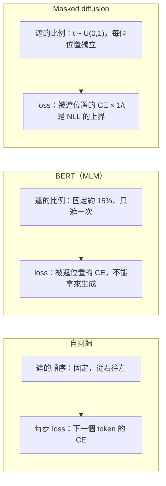
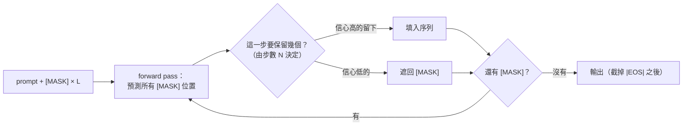

> 🌏 [English version](/posts/ai/2026-09-29-cme295-diffusion-llms-en)

> **課前預寫版**：本篇寫於 2026 年 9 月 29 日，2026 版第 8 講（2026 年 11 月 20 日）尚未開課。內容根據 2026 課表的主題清單、2025 版投影片中已講過的部分，以及原始論文整理；影片與投影片上架後會對照更新。

Stanford [CME295](/posts/ai/2026-09-29-stanford-cme295-transformers-llms) 2026 版在第 8 講放了一整堂「Diffusion LLMs」。[2026 課表](https://cme295.stanford.edu/syllabus/)列的子題有五個：continuous diffusion、discrete diffusion、masked diffusion、training、inference。2026 第 1 講[投影片](https://cme295.stanford.edu/slides/fall26-cme295-lecture1.pdf)裡「Difference with last year's edition」那一頁，也把 Diffusion LLMs 列為三項新內容之一。

2025 版只在最後一講用約 28 頁投影片帶過這個主題，本系列 [order 9](/posts/ai/2026-09-29-cme295-current-trends) 已經寫過那段入門。內容包括：自回歸（ARM）推論為什麼不能平行、影像 diffusion 的 forward／reverse 直覺、文字把雜訊換成 `[MASK]`，以及 LLaDA 的簡化訓練與取樣虛擬碼。這些本篇不重寫。

本篇接著回答 order 9 留下的三個問題：

1. 課表上的 continuous、discrete、masked diffusion 到底差在哪？為什麼文字最後幾乎都選了 masked？
2. masked diffusion 的訓練目標為什麼長成「只對被遮住的位置算 cross-entropy，再乘上 1/t」？
3. 「一次填好幾格」的速度是怎麼來的，又要付出什麼？

2026 版投影片與錄影都還沒釋出。以下凡是標「2025 投影片」的內容來自 [2025 版第 9 講投影片](https://cme295.stanford.edu/slides/fall25-cme295-lecture9.pdf)第 71–98 頁；其餘來自原始論文與官方頁面，不代表 2026 版課堂的講法。

## 先看一個矛盾：10 倍速度從哪裡來

2025 投影片的「Discussion」頁寫著 diffusion LLM 的輸出速度約是 ARM 的 10 倍（tokens per second）。可是投影片推薦的 [LLaDA](https://arxiv.org/abs/2502.09992) 論文，主要實驗為了公平比較，把取樣步數設成跟生成長度一樣，也就是**每一步只解開一個 token**。這樣跑，forward pass 的次數跟自回歸一模一樣，而且 LLaDA 還沒有 KV cache。

兩件事都對。diffusion LLM 的「快」是一個可以調的旋鈕：步數少，每步就得同時填更多格，品質跟著掉。要理解這個取捨，得先把三種 diffusion 的差別、訓練目標、推論演算法依序拆開。這正好是課表的五個子題。



## 課表主題一：Continuous diffusion

### 直覺：先把字變成向量，再照影像的方法加雜訊

連續 diffusion 就是影像生成用的那一套。[DDPM](https://arxiv.org/abs/2006.11239)（Ho et al., 2020）對一張圖分很多步加上高斯雜訊，最後變成純雜訊；模型學的是每一步「這張圖裡的雜訊長什麼樣」，生成時從隨機雜訊出發，一步步扣掉。論文設定走 T = 1000 步。這部分的推導，站上 [CS229 第 14 章](/posts/ai/2026-08-22-stanford-cs229-2026-notes-chapter-14-diffusion-models)與 [CMU 11-785 第 23 講](/posts/ai/2026-08-22-cmu-11785-23-diffusion)都寫過。

文字的麻煩在於 token 是離散的，「在 teddy 上加一點點雜訊」沒有意義。最直接的辦法是先把每個 token 變成 embedding 向量，在向量空間做 diffusion，最後再把向量「取整」回最近的字。[Diffusion-LM](https://arxiv.org/abs/2205.14217)（Li et al., 2022）就是這樣做：在標準 diffusion 前後各加一個 embedding 步驟與 rounding 步驟，embedding 跟模型一起端到端訓練。

<details>
<summary>機制：DDPM 的加噪與訓練目標，以及搬到文字時多出來的兩步</summary>

```
DDPM（影像）
  forward：q(x_t | x_{t-1}) = N( √(1-β_t) · x_{t-1},  β_t · I )
  任一步可直接取樣：x_t = √(ᾱ_t) · x_0 + √(1-ᾱ_t) · ε,   ε ~ N(0, I)
                    ᾱ_t = Π_{s≤t} (1 - β_s)
  訓練（簡化版）：L_simple = E_{t, x_0, ε} || ε − ε_θ(x_t, t) ||²
  論文設定：T = 1000，β 從 1e-4 線性增加到 0.02

Diffusion-LM（文字）
  embedding：w（一串 token）→ x_0 = EMB(w)，EMB 可訓練
  中間照 DDPM 在 x_0 上加噪、去噪
  rounding：x_0 → 每個位置 argmax p_θ(w_i | x_0,i) 取回最近的字
```

</details>

### 為什麼它沒有成為文字的主流

Diffusion-LM 的賣點是可控生成：中間變數是連續的，可以直接對它做梯度，控制句法結構等細粒度屬性。速度與品質卻吃虧。論文附錄寫明取樣要走 2000 步，即使降到 200 步，解碼仍比自回歸模型慢 7 倍。

規模化之後差距還在。[Plaid](https://arxiv.org/abs/2305.18619)（Gulrajani & Hashimoto, 2023）專門為連續 diffusion 語言模型做 likelihood 訓練與 scaling law。訓練出的 Plaid 1B 在 likelihood 上贏過 GPT-2 124M，但論文自己的估計是：不論規模，Plaid 要約 64 倍的算力才追得上自回歸模型。LLaDA 論文的 related work 也引了這個數字，當作連續路線難以擴展的例子。

**連回你用的模型**：目前檯面上叫得出名字的 diffusion LLM，公開技術文件寫得出方法的，大多走下面的離散路線。連續 diffusion 在文字上沒有消失，但它是研究線，不是產品線。

## 課表主題二：Discrete diffusion

### 直覺：直接在詞彙表上換字

離散 diffusion 不經過向量空間，直接在詞彙表上定義「加雜訊」：每一步，每個 token 有一定機率被換成別的東西。換成什麼，由一個轉移矩陣 Q 決定。[D3PM](https://arxiv.org/abs/2107.03006)（Austin et al., 2021）把這個框架整理出來，並比較了幾種矩陣：

| 轉移方式 | token 會變成什麼 | 加到最後的樣子 |
|---|---|---|
| uniform | 均勻換成詞彙表裡任何一個字 | 一串隨機字 |
| absorbing（吸收態） | 要嘛不變，要嘛變成 `[MASK]`，變了就不再變回來 | 全部是 `[MASK]` |
| discretized Gaussian | 換成數值上相近的狀態（用在像素） | 均勻分布 |
| nearest neighbor | 換成 embedding 空間裡相近的字 | 均勻分布 |

D3PM 在 character-level 的 text8 上實驗，吸收態（`[MASK]`）「by far the best performing model」。用 embedding 相近度定義的 nearest neighbor 反而幾乎沒贏 uniform；到了 LM1B，它的 log-likelihood 甚至比 uniform 還差。作者的解讀是，word embedding 的相似度不一定是 diffusion 該用的「距離」。

D3PM 還點出兩個把舊模型收進這個框架的觀察，很適合拿來理解 diffusion 在 LLM 家族裡的位置：

- **BERT 是一步的 diffusion**：一步內把部分 token 換成 `[MASK]`、部分換成隨機字，ELBO 就化簡成 BERT 的 denoising 目標
- **自回歸模型也是一種離散 diffusion**：如果 forward process 是「從句尾開始，每步確定地遮掉一個 token」，每一步的 loss 就是自回歸的 cross-entropy

所以三者差別在「怎麼遮、遮幾步、遮的順序固定還是隨機」。自回歸固定從右往左遮（生成時從左往右填）；masked diffusion 每個位置獨立、隨機遮。

<details>
<summary>機制：D3PM 的轉移矩陣</summary>

```
x 是 one-hot 列向量，K 是詞彙量
forward：q(x_t | x_{t-1}) = Cat( x_t ; p = x_{t-1} · Q_t )
直接跳到第 t 步：q(x_t | x_0) = Cat( x_t ; p = x_0 · Q̄_t ),  Q̄_t = Q_1 Q_2 … Q_t

uniform：   Q_t = (1 − β_t) · I + (β_t / K) · 1 1ᵀ
absorbing： Q_t = (1 − β_t) · I + β_t · 1 e_mᵀ      e_m 是 [MASK] 的 one-hot

訓練：變分下界 L_vb，D3PM 另外加一項輔助 cross-entropy（L_λ = L_vb + λ·CE）
```

</details>

### SEDD：把 score matching 搬到離散空間

連續 diffusion 背後有一套成熟的理論：學資料分布的 score（log 機率的梯度）。離散空間沒有梯度。[SEDD](https://arxiv.org/abs/2310.16834)（Lou et al., 2023，2025 投影片推薦的第一篇）改學「機率比」：對目前這串字 x，換成另一串 y 的機率是 x 的幾倍，也就是 p(y)/p(x)。論文把這組比值叫 concrete score，並設計了一個叫 score entropy 的 loss 來學它。

摘要列了三個結果。同樣規模下，SEDD 的 perplexity 比既有的語言 diffusion 降低 25–75%，並且贏過 GPT-2。它不用 temperature 之類的退火技巧就能生成像樣的文字。它也能拿品質換算力，用少 32 倍的網路評估次數得到相近的品質。論文同時實作了 uniform 與 absorbing 兩版，absorbing 版的 perplexity 在各資料集上都比較好。

<details>
<summary>機制：score entropy</summary>

```
學一個網路 s_θ(x)_y ≈ p(y) / p(x)        （y 是跟 x 只差一個位置的序列）

L_SE = E_{x~p} Σ_{y≠x} w_xy · [ s_θ(x)_y − (p(y)/p(x)) · log s_θ(x)_y + K( p(y)/p(x) ) ]
       K(a) = a · (log a − 1)，確保 L_SE ≥ 0

實際訓練用的是可計算的 denoising 版本（DSE），不需要知道真正的 p。
```

</details>

**連回你用的模型**：Inception 的 [Mercury 技術報告](https://arxiv.org/abs/2506.17298)寫明，他們的方法「extend」的就是 SEDD，也就是 Lou et al. 那篇。

## 課表主題三：Masked diffusion

### 直覺：吸收態勝出之後，數學可以大幅化簡

既然 `[MASK]` 吸收態在文字上一直最好，2024 年有兩組人各自把它的數學徹底化簡：[MDLM](https://arxiv.org/abs/2406.07524)（Sahoo et al., 2024，2025 投影片推薦的第二篇）與 [MD4](https://arxiv.org/abs/2406.04329)（Shi et al., 2024）。兩篇的結論一致：masked diffusion 的連續時間 ELBO，化簡完就是**各種遮罩比例下的 masked language modeling loss 加權平均**。MD4 的摘要原話是「a simple weighted integral of cross-entropy losses」。

MDLM 的化簡靠兩個直覺上很合理的限制，論文把它們合稱 SUBS 參數化：

- **Zero masking probabilities**：模型輸出「原本的字」時，永遠不會輸出 `[MASK]`，因為乾淨的資料裡沒有 `[MASK]`
- **Carry-over unmasking**：已經不是 `[MASK]` 的位置，模型直接照抄，不再改動

加上這兩條，ELBO 裡一大堆項會變成 0，剩下的只有「被遮住的位置猜對原字的 log 機率」。MDLM 的實驗顯示這樣算出來的訓練目標變異數比較小；它在 LM1B 上比同訓練量的 SEDD 在 perplexity 上界改善 17%，離自回歸基準剩 14% 的差距。

第二條限制有個代價，後面推論那段會再遇到：一個位置一旦被填上，就不會再被改。

<details>
<summary>機制：MDLM 的連續時間 NELBO，以及它跟 LLaDA loss 的關係</summary>

```
α_t：時間 t 時一個 token「還沒被遮」的機率，α_0 = 1、α_1 = 0，單調遞減
z_t：遮了一部分的序列；x：原始序列；m：[MASK]

MDLM（論文式 10）：
  L_NELBO = E_q ∫_0^1  α'_t / (1 − α_t) · log < x_θ(z_t, t), x >  dt
  只有 z_t 在該位置是 [MASK] 時才有貢獻（carry-over 讓其餘位置的項為 0）

取線性 schedule：α_t = 1 − t  →  α'_t = −1，1 − α_t = t
  L = E_t [ (1/t) · Σ_{被遮的位置 i} −log p_θ( x_i | z_t ) ]

這就是 LLaDA 論文式 (3) 的形式；MDLM 也指出這個目標對 noise schedule 的選擇不敏感。
```

</details>

### 跟 BERT 差在哪

看起來 masked diffusion 的 loss 跟 [BERT](https://arxiv.org/abs/1810.04805) 的 MLM 幾乎一樣，差別有兩點。第一，BERT 固定遮大約 15%；masked diffusion 的遮罩比例 t 每筆資料都從 0 到 1 隨機抽。所以模型見過「幾乎全遮」到「幾乎沒遮」的所有情境，才能從全 `[MASK]` 一路生成出整句。LLaDA 論文特別強調這點在規模化時影響很大。第二，1/t 的權重讓這個 loss 成為負 log-likelihood 的上界，masked diffusion 因此是一個有 likelihood 的生成模型，可以用 perplexity 跟自回歸模型比。



## 課表主題四：Training

### LLaDA：把 masked diffusion 推到 8B

[LLaDA](https://arxiv.org/abs/2502.09992)（Nie et al., 2025，2025 投影片推薦的第三篇）證明這套方法可以照一般 LLM 的配方放大。它的 mask predictor 就是一個 Transformer，唯一的架構差別是拿掉 causal mask，每個位置都能看整句。

- **預訓練**：2.3 兆 tokens，序列長度 4096，花了 0.13 百萬 H800 GPU 小時。論文說這跟同規模、同資料量的自回歸模型相近
- **變長資料**：預訓練時有 1% 的資料長度從 [1, 4096] 均勻抽，讓模型見過不同長度
- **SFT**：450 萬組 prompt–response。prompt 永遠不遮，只遮 response；短的回答後面補 `|EOS|` 對齊長度，而且 `|EOS|` 也會被遮、被算進 loss，模型因此學會自己決定回答長度

論文摘要說 LLaDA 8B 在 in-context learning 上可以跟 LLaMA3 8B 競爭。論文最常被引用的結果是「reversal curse」：給一句詩要模型接下一句（forward）或接上一句（reversal）。GPT-4o 在 forward 拿 82.7、reversal 只有 34.3；LLaDA 8B Instruct 分別是 51.8 與 45.6。LLaDA 順向比較弱，逆向比較強，兩個方向差距也小很多。論文的解釋是它對每個位置一視同仁，沒有「從左到右」的歸納偏誤。

<details>
<summary>機制：LLaDA 預訓練與 SFT 的 loss</summary>

```
預訓練（論文式 3）：
  t ~ U[0, 1]
  x_t：x_0 每個 token 各自以機率 t 換成 [MASK]
  L(θ) = − E_{t, x_0, x_t} [ (1/t) · Σ_{i=1}^{L} 1[x_t^i = M] · log p_θ( x_0^i | x_t ) ]
  並且  − E[ log p_θ(x_0) ] ≤ L(θ)        （論文式 4）

SFT：
  (p_0, r_0) 是一組 prompt 與 response
  只對 r_0 加遮罩得到 r_t，p_0 保持完整
  L = − E [ (1/t) · Σ_{i ∈ response} 1[r_t^i = M] · log p_θ( r_0^i | p_0, r_t ) ]
```

</details>

### 訓練比較難，換來推論比較彈性

[Kim et al.（2025）](https://arxiv.org/abs/2502.06768)這篇 [ICML 2025 Outstanding Paper](https://kempnerinstitute.harvard.edu/news/kempner-institute-researchers-win-outstanding-paper-award-at-icml-2025/) 把取捨說得很清楚：自回歸模型只要學「給前文猜下一個字」這一種子問題；masked diffusion 要學的是指數多種「任意位置被遮、猜回來」的填空題，其中有些在計算上很難。換來的好處是推論時可以用任意順序解碼，可以挑簡單的先解。站上 [2025 年 AI 頂會主題整理](/posts/ai/2026-08-24-ai-conference-2025-topics)也收了這篇。

**連回你用的模型**：Mercury 技術報告說，後續的 fine-tuning、RLHF、DPO 等階段都能照做，「key change」只是把自回歸 loss 換成 denoising diffusion loss。LLaDA 論文則在限制段落寫明，它還沒有做 RL 對齊。diffusion LLM 怎麼做 RL，目前仍是研究題目；自回歸模型上的 PPO、GRPO 見本系列 [order 11](/posts/ai/2026-09-29-cme295-rl-with-llms)。

## 課表主題五：Inference

### 最基本的取樣迴圈

生成一段長度 L 的回答，LLaDA 的作法是：

1. 把 prompt 接上 L 個 `[MASK]`（生成長度是超參數，後面多出來的 `|EOS|` 之後丟掉）
2. 每一步把整串送進模型，**一次預測所有 `[MASK]` 位置**
3. 依照 forward process 的比例，把其中一部分預測遮回 `[MASK]`，其餘保留
4. 重複到沒有 `[MASK]` 為止。總步數 N 也是超參數



### 第一個旋鈕：遮回去哪些

照理論，第 3 步要「隨機」挑哪些遮回去，才跟 forward process 對得上。LLaDA 實際用的是 **low-confidence remasking**：把模型最沒把握的那些預測遮回去，留下最有把握的。論文附錄的消融實驗差距很大：GSM8K 上隨機 remasking 是 21.3，low-confidence 是 70.0。

Kim et al. 在數獨上看到同樣的現象，而且更極端：預訓練好的 masked diffusion 模型用一般的隨機順序解數獨，準確率不到 7%；改成依信心挑下一格，拉到約 90%，還贏過參數多 7 倍、而且用正確解題順序訓練過的自回歸模型。

注意名詞陷阱：LLaDA 的 remasking 只在「這一步剛預測出來的」token 裡挑，已經保留的 token 不會再動（對應 MDLM 的 carry-over unmasking）。[ReMDM](https://arxiv.org/abs/2503.00307)（Wang et al., 2025）指出這正是 masked diffusion 的弱點：一個 token 生成之後，即使錯了也改不回來。它提出一種取樣器，讓已經填好的 token 也能被重新遮住，於是多給步數就能繼續修正，等於替 masked diffusion 加上一種推論時的 compute scaling。

### 第二個旋鈕：一次填幾格

步數 N 與生成長度 L 的比值，決定每步平均填幾個 token。LLaDA 附錄在 A100 上測過：輸出 256 個 token，步數設 256、128、64、32，分別對應每次 forward pass 解 1、2、4、8 個 token。在 GSM8K 與 Math 上，LLaDA 8B Base 在品質相當時，throughput 是 LLaMA3 8B Base 的 1.5 倍與 1.8 倍，而且 LLaMA3 有開 KV cache、LLaDA 什麼推論優化都沒做。但在 MBPP 上，LLaDA 就落後了。

為什麼不能無限加速？[Fast-dLLM](https://arxiv.org/abs/2505.22618)（Wu et al., 2025）用一個例子說明：「由兩個英文字組成的撲克牌型有：_ _」。答案可能是 high card、two pair、full house。模型一次填兩格時，是對每一格**各自**抽樣，兩格之間互相獨立，於是可能抽出「high house」這種不存在的組合。這就是條件獨立假設：一次填越多格，格與格之間的相依性就丟越多。

<details>
<summary>機制：平行解碼為什麼會出錯</summary>

```
一步同時解開位置 i 和 j，masked diffusion 實際上是從
    p(x_i | x_t) · p(x_j | x_t)
抽樣，但真正的聯合分布是
    p(x_i, x_j | x_t) = p(x_i | x_t) · p(x_j | x_i, x_t)

兩者只有在 x_i、x_j 給定 x_t 後彼此獨立時才相等。
每步解 1 個 token（N = L）時沒有這個問題，但也沒有加速。
```

</details>

Fast-dLLM 的解法是不固定每步解幾格，改設一個**信心門檻**：這一步有哪些位置的信心超過門檻，就解哪些，其餘留到下一步。再加上一個針對雙向 attention 設計的**近似 KV cache**（按區塊生成，區塊之間重用 cache，連後綴也快取的版本叫 DualCache），它在 LLaDA 與 Dream 上最多拿到 27.6 倍的 throughput 提升。這個倍數的比較對象是**原版 LLaDA**，不是自回歸模型。

### 第三個旋鈕：要不要從左到右分區塊

純 diffusion 有兩個工程上的麻煩：輸出長度要先固定，而且每一步都要重算整串的 attention，沒辦法像自回歸那樣用 KV cache（order 9 提過，這是因為拿掉了 causal mask）。

[Block Diffusion](https://arxiv.org/abs/2503.09573)（Arriola et al., 2025）的做法是折衷：區塊與區塊之間從左到右，區塊內部用 diffusion 平行填。這樣可以生成任意長度，也可以對已完成的區塊用 KV cache。MDLM 論文也有類似的半自回歸取樣。LLaDA 不用重新訓練就能改用這種取樣；它的 Instruct 版在 GSM8K 上，區塊長度 32 的半自回歸取樣拿到 77.5，高於純 diffusion 的 69.4。論文的解釋是 SFT 資料補了大量 `|EOS|`，純 diffusion 取樣時信心最高的常常是句尾的 `|EOS|`，導致太早結束。

把三個旋鈕放在一起看，最後一列再加上一個相關的選擇：已經填好的 token 能不能再改（ReMDM）：

| 旋鈕 | 往「快」調 | 代價 |
|---|---|---|
| 每步解幾格 | 步數少、每步多填 | 條件獨立造成不一致的組合 |
| 挑哪些格 | 依信心挑、設門檻 | 偏離理論上的取樣分布；門檻要調 |
| 分不分區塊 | 分區塊才能用 KV cache、才能不定長 | 退回部分的左到右順序 |
| 已填的能不能改 | 不能改最省步數 | 早期錯誤會一路留著；ReMDM 允許改，但要多花步數 |

**連回你用的模型**：這跟 [order 10](/posts/ai/2026-09-29-cme295-llm-systems) 的 speculative decoding 在解同一個瓶頸：自回歸每次 forward pass 只產出一個 token。speculative decoding 保留自回歸模型、用小模型猜幾個再一起驗證；diffusion LLM 則直接換掉生成方式。推論為什麼卡在記憶體頻寬，[CS336 Lecture 10](/posts/ai/2026-08-22-cs336-inference) 有完整的算術。

## 連回你用的模型：產業界公開了什麼

以下只列官方公開的資訊，查詢日期 2026-09-29。

- **Google [Gemini Diffusion](https://deepmind.google/models/gemini-diffusion/)**：官方頁面仍標示為「experimental demo」。頁面寫的平均取樣速度是每秒 1,479 個 token（不含 overhead），overhead 0.84 秒。官方列的特點是一次生成整塊 token、生成過程中會修正錯誤（iterative refinement）。基準表對照的是 Gemini 2.0 Flash-Lite，互有勝負：AIME 2025 是 23.3% 對 20.0%，GPQA Diamond 是 40.4% 對 56.5%。Google 沒有公開它用哪一種 diffusion。
- **Inception Mercury**：2025 年 6 月的[技術報告](https://arxiv.org/abs/2506.17298)寫明模型是 Transformer、方法延伸自 SEDD、用專屬的推論引擎。依 Artificial Analysis 的獨立測試，Mercury Coder Mini 與 Small 在 H100 上分別是每秒 1,109 與 737 個 token。目前官網最新的是 [Mercury 2.5](https://www.inceptionlabs.ai/blog/introducing-mercury-2-5)：官方寫每秒 1,107 個 token、260K context、定價每百萬 token 輸入 0.20 美元、輸出 0.75 美元（發表時另有限時折扣），並自稱是目前訓練過最大的 diffusion 語言模型。發表文沒有公開參數量與方法細節。
- **ByteDance [Seed Diffusion Preview](https://arxiv.org/abs/2508.02193)**：論文摘要寫明是離散狀態 diffusion，在 H20 GPU 上每秒 2,146 個 token，評測集中在程式碼。
- **開源權重**：LLaDA 系列之後有 LLaDA-MoE 與 LLaDA 2.x，站上 [螞蟻 Ling 模型家族](/posts/tech/2026-09-19-ai-model-family-ling)有整理；另一個常被拿來比較的是 [Dream 7B](https://arxiv.org/abs/2508.15487)。

讀這些數字時要記得兩件事。第一，tokens per second 高不代表回答品質跟得上，Gemini Diffusion 的表就顯示它在推理與多語言上落後同代的小模型。第二，不同硬體、不同 batch 設定的速度不能直接比。Inception 自己舉的落地情境是搜尋 agent、語音 agent、coding agent 的輔助呼叫（例如 context compaction），都是「一次任務要叫很多次、每次都要快」的工作。這是廠商說法，但跟上面的取捨表一致：品質要求沒那麼極端、延遲很敏感的地方，diffusion 的速度最划算。

## 2025 版在哪裡講過

| 2025 第 9 講投影片 | 內容 | 本系列 |
|---|---|---|
| 約第 71–81 頁 | 自回歸逐字生成，「Inference-time generation is not parallelizable (although training is)」 | [order 9](/posts/ai/2026-09-29-cme295-current-trends) |
| 約第 82 頁 | 四則 2025 新聞：Gemini Diffusion、Inception 募資、Inception 官網、Seed Diffusion | order 9；本篇更新到 2026-09-29 的官方資訊 |
| 約第 83–89 頁 | 影像 diffusion 的直覺（雕塑比喻）、DDPM 的 forward／reverse | order 9；本篇補上公式 |
| 約第 90–96 頁 | 雜訊換成 `MASK`、MDM、「Decoding done in fewer forward passes!」、推薦 SEDD／MDLM／LLaDA | order 9；本篇補上 SEDD、MDLM 的機制 |
| 約第 97–98 頁 | Discussion：約 10 倍 tokens/s、某些任務更適合；挑戰是效能與 ARM 技巧的移植 | 本篇「推論」一節拆解 10 倍的來源與代價 |

2026 課表上、2025 投影片完全沒碰到的部分：

- **Continuous diffusion** 作為文字的一條路線（2025 只用它解釋影像）
- **Discrete diffusion** 作為一般框架（轉移矩陣、uniform 與 absorbing 的比較）
- **Training** 與 **Inference** 各自成為子題。2025 投影片沒有列任何公式，也沒有談 remasking 策略、步數與品質的取捨

2026 版實際怎麼講、用哪些例子，要等投影片出來才知道。

## 自我檢測

第 8 講是 2026 版新增的一講，[2025 期中考](https://cme295.stanford.edu/exams/fall25-cme295-midterm.pdf)與[期末考](https://cme295.stanford.edu/exams/fall25-cme295-final.pdf)都沒有對應題目。以下五題是**本站自擬**，不是官方考題：

1. 連續 diffusion 用在文字上，要在標準 diffusion 前後多加哪兩個步驟？Plaid 論文估計它跟自回歸模型之間的算力差距大約是幾倍？
2. D3PM 的 uniform 與 absorbing 兩種轉移矩陣，加雜訊到最後分別會變成什麼？為什麼說 BERT 是「一步的 diffusion」？
3. MDLM 的 SUBS 參數化包含哪兩個限制？其中哪一個讓「已經填上的 token 不能再改」？
4. LLaDA 的 loss 跟 BERT 的 MLM 都只對 `[MASK]` 算 cross-entropy，兩者差在哪兩點？為什麼這兩點讓 LLaDA 能從全遮的序列生成整段文字？
5. 一個 diffusion LLM 每步同時解開 8 個 token，可能出現什麼問題？舉出兩種緩解方法，並說明各自的代價。

## 想深入

- 從頭把 diffusion 的機率推導走一遍：[CS229 第 14 章：擴散模型](/posts/ai/2026-08-22-stanford-cs229-2026-notes-chapter-14-diffusion-models)、[CMU 11-785 第 23 講](/posts/ai/2026-08-22-cmu-11785-23-diffusion)、[MIT 6.S191 生成模型](/posts/ai/2026-08-22-mit-6s191-l04-generative-modeling)
- 想親手跑：[MDLM](https://s-sahoo.com/mdlm) 與 [Block Diffusion](https://m-arriola.com/bd3lms) 的專案頁都附程式碼與教學；[LLaDA 專案頁](https://ml-gsai.github.io/LLaDA-demo/)有權重與取樣程式
- 同一個瓶頸的另一種解法：[order 10：LLM systems](/posts/ai/2026-09-29-cme295-llm-systems)、[CS336 Lecture 10：LLM 推論](/posts/ai/2026-08-22-cs336-inference)
- 本系列的入門段落：[order 9：第 9 講 Current trends](/posts/ai/2026-09-29-cme295-current-trends)；回到[系列總覽](/posts/ai/2026-09-29-stanford-cme295-transformers-llms)

## 更新計畫

2026 年 11 月 20 日的影片與投影片上架後，會對照以下幾點更新本篇：

- 課表的五個子題實際用了哪些論文、哪些例子，跟本篇的選擇差在哪
- 投影片有沒有列訓練目標的推導，用的是 SEDD、MDLM 還是 LLaDA 的寫法
- 推論那段講了哪些取樣策略、有沒有提到 KV cache 與區塊生成
- 2025 投影片的「約 10 倍 tokens/s」有沒有更新數字或註明來源
- 期末考（2026 年 12 月 9 日）若釋出並涵蓋本講，把「自我檢測」換成改寫自官方考題的版本

## 參考資料

- [CME 295 2026 版課表](https://cme295.stanford.edu/syllabus/)
- [CME 295 2025 版課表](https://cme295.stanford.edu/syllabus/2025/)
- [2026 版第 1 講投影片（PDF）](https://cme295.stanford.edu/slides/fall26-cme295-lecture1.pdf)
- [2025 版第 9 講投影片（PDF）](https://cme295.stanford.edu/slides/fall25-cme295-lecture9.pdf)
- [Ho et al., Denoising Diffusion Probabilistic Models (2020)](https://arxiv.org/abs/2006.11239)
- [Li et al., Diffusion-LM Improves Controllable Text Generation (2022)](https://arxiv.org/abs/2205.14217)
- [Gulrajani & Hashimoto, Likelihood-Based Diffusion Language Models (2023)](https://arxiv.org/abs/2305.18619)
- [Austin et al., Structured Denoising Diffusion Models in Discrete State-Spaces (2021)](https://arxiv.org/abs/2107.03006)
- [Lou et al., Discrete Diffusion Modeling by Estimating the Ratios of the Data Distribution (2023)](https://arxiv.org/abs/2310.16834)
- [Sahoo et al., Simple and Effective Masked Diffusion Language Models (2024)](https://arxiv.org/abs/2406.07524)
- [Shi et al., Simplified and Generalized Masked Diffusion for Discrete Data (2024)](https://arxiv.org/abs/2406.04329)
- [Devlin et al., BERT: Pre-training of Deep Bidirectional Transformers for Language Understanding (2018)](https://arxiv.org/abs/1810.04805)
- [Nie et al., Large Language Diffusion Models (2025)](https://arxiv.org/abs/2502.09992)
- [Kim et al., Train for the Worst, Plan for the Best: Understanding Token Ordering in Masked Diffusions (2025)](https://arxiv.org/abs/2502.06768)
- [Wang et al., Remasking Discrete Diffusion Models with Inference-Time Scaling (2025)](https://arxiv.org/abs/2503.00307)
- [Wu et al., Fast-dLLM: Training-free Acceleration of Diffusion LLM by Enabling KV Cache and Parallel Decoding (2025)](https://arxiv.org/abs/2505.22618)
- [Arriola et al., Block Diffusion: Interpolating Between Autoregressive and Diffusion Language Models (2025)](https://arxiv.org/abs/2503.09573)
- [Inception Labs, Mercury: Ultra-Fast Language Models Based on Diffusion (2025)](https://arxiv.org/abs/2506.17298)
- [Inception, Introducing Mercury 2.5（2026-09-29 查詢）](https://www.inceptionlabs.ai/blog/introducing-mercury-2-5)
- [Google DeepMind, Gemini Diffusion（2026-09-29 查詢）](https://deepmind.google/models/gemini-diffusion/)
- [Song et al., Seed Diffusion: A Large-Scale Diffusion Language Model with High-Speed Inference (2025)](https://arxiv.org/abs/2508.02193)
- [Ye et al., Dream 7B: Diffusion Large Language Models (2025)](https://arxiv.org/abs/2508.15487)
