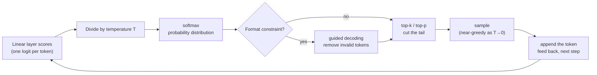

> 🌏 [中文版](/posts/ai/2026-09-29-cme295-large-language-models)

This post covers Lecture 3, "Large Language Models," of the 2025 edition of Stanford's [CME295](/posts/ai/2026-09-29-stanford-cme295-transformers-llms-en) (October 10, 2025). The main source is the [125-slide deck](https://cme295.stanford.edu/slides/fall25-cme295-lecture3.pdf); the [recording](https://www.youtube.com/watch?v=Q5baLehv5So) runs 1 hour 48 minutes. Everything here comes from the text and figures on the slides. Anything said only out loud in class is not included.

If you have called any LLM API, you have probably seen `temperature` and `top_p` in the parameter list, and maybe an option for forcing JSON output. Where each of those fields intervenes in the model's work is the core of this lecture.

The slides are organized into five parts: LLM overview, MoE-based LLMs, Response generation, Prompting strategies, and Inference optimizations. This post centers on the middle three, which are the knobs you can turn while the model is generating. MoE gets the intuition only, and the final part on inference speedups gets a map, with links to fuller posts on this site for the details.

## Course video sources

The videos below are the recordings linked for the topics covered in this article.

```youtube
url: https://www.youtube.com/watch?v=Q5baLehv5So
title: 2025 Lecture 3 recording
```

Original videos: [2025 Lecture 3 recording](https://www.youtube.com/watch?v=Q5baLehv5So)

Course and recording entries:

- [Official course / lecture source](https://cme295.stanford.edu/syllabus/2025/)

## What counts as an LLM

The slides open with a definition: a language model is a statistical or machine learning model that "assigns probabilities to sequences of tokens." The "Large" rests on three things:

- Model size: billions of parameters or more
- Training data: hundreds of billions of tokens or more
- Compute: in the slides' words, "a lot of GPUs"

Architecturally, an LLM in this course means a decoder-only Transformer, with GPT, LLaMA, Gemma, DeepSeek, Mistral, and Qwen listed as examples. The previous lecture ([Lecture 2](/posts/ai/2026-09-29-cme295-transformer-tricks-en)) split Transformers into encoder-decoder (T5), encoder-only (BERT), and decoder-only (GPT). This lecture only deals with the third kind.

## MoE: a huge model, but each token only walks a small part of it

The starting point on the slides is one observation: "Not all weights are useful in the forward pass." For any particular input, a giant model may not need every weight. So why not run only part of it each time?

The recipe is to split one big network into n "experts," E1 through En, and put a gating network G in front to decide which to use:

- **Dense MoE**: every expert runs, and the output is a weighted average of all of them. Nothing is saved.
- **Sparse MoE**: G picks a few experts via top-k, only those run, and their outputs are averaged. This is the version that saves compute, from [Shazeer et al. (2017)](https://arxiv.org/abs/1701.06538).

Inside a Transformer, the part that gets replaced is each layer's feed-forward network (FFNN). The slides flag it in bold: "Routing done for each token!" In a single sentence, "teddy" and "reading" can go to different experts.

The best-known problem in training MoE is **routing collapse**. The gating network finds one expert slightly better and keeps choosing it. The other experts get no training signal and fall further behind, which is a vicious circle. The slides cite the fix from [Switch Transformers](https://arxiv.org/abs/2101.03961): an auxiliary loss that forces the other experts to be "part of the game" too.

<details>
<summary>Formula: the Switch Transformers auxiliary loss</summary>

```
loss = α · N · Σ_{i=1..N} f_i · P_i
```

- `N`: number of experts
- `f_i`: fraction of tokens actually routed to expert i
- `P_i`: average routing probability the gate gives expert i
- `α`: weight of this loss term

Intuition: if an expert both receives many tokens (large f_i) and gets high probability (large P_i), the product is large and so is the loss. The term is smallest when load is spread evenly.

</details>

What do the experts actually learn? The slides show a figure from the [Mixtral](https://arxiv.org/abs/2401.04088) paper that colors each token of a Python snippet by the expert it was routed to. The paper's own conclusion is that experts do not split by topic, but the router does "exhibit some structured syntactic behavior." Python's `self`, for instance, often goes to the same expert. So the division of labor looks syntactic, not like a "math expert" and a "code expert."

The full set of MoE trade-offs (load-balancing variants, communication cost, why nearly every 2026 frontier model uses it) is covered in two posts on this site: [CS336 Lecture 4](/posts/ai/2026-08-22-cs336-attention-moe-en) and [Why MoE Wins](/posts/ai/2026-08-26-moe-architecture-why-it-wins-en).

## Knob 1: how the next token is chosen

At every step an LLM outputs a probability distribution over the vocabulary. You pick one token from it, append it, and feed the sequence back in. The slides walk through three ideas in turn:

| Strategy | What it does | Limitations listed on the slides |
|---|---|---|
| greedy decoding | take the highest-probability token each step | output not optimal, natural, or diverse |
| beam search | keep the k most likely paths until `[EOS]` | extra computation; lacks diversity and creativity |
| sampling | draw from the probability distribution | you still have to decide which candidates to draw from |

Two common ways of truncating the candidates for sampling:

- **top-k**: sample only among the k most probable tokens; the slide example uses k = 4
- **top-p**: sort tokens by probability, take the smallest set whose cumulative probability is ≥ p, and sample from it; the slide example uses p = 90%. The method comes from [Holtzman et al.'s nucleus sampling paper](https://arxiv.org/abs/1904.09751)

The difference shows up when the distribution is very peaked or very flat. When the model is confident, the top two or three tokens already cover 90%, and top-p keeps only those. When it is unsure, top-p lets in many more candidates. top-k keeps exactly k no matter what the distribution looks like.

## Knob 2: temperature reshapes the distribution

Where do the probabilities come from? The decoder's final linear layer produces a score for every token, then softmax turns the scores into probabilities. Temperature sits inside that softmax: each score is divided by T first.

<details>
<summary>Formula: softmax with temperature</summary>

```
P_adj(w_{t+1} = w_i | C) = exp(x_i / T) / Σ_{j=1..n} exp(x_j / T)
```

- `x_i`: the score (logit) for token i
- `C`: the context so far
- `T`: temperature; T = 1 is the plain softmax

</details>

The slides show the effect with two bar charts. With a small T, almost all the probability lands on one token (`kind` in the example), which is close to greedy. With a large T, every candidate is about equally likely and the output turns random. So temperature controls how willing the model is to pick an unlikely word, and top-k/top-p control how unlikely a word can be before it is ruled out entirely. The two are usually used together.

The slides add a suggested reading here: Thinking Machines' [Defeating Nondeterminism in LLM Inference](https://thinkingmachines.ai/blog/defeating-nondeterminism-in-llm-inference/). It tackles why the same prompt, run twice on an inference service with temperature set to 0, can still give different results.

## Knob 3: guided decoding bans invalid tokens outright

If you want JSON and only write "answer in JSON" in the prompt, the model may still add a friendly opening line or drop a bracket. The slide example asks for a description of "my 33-year-old teddy bear who likes reading" as `{"first_name": "teddy", "last_name": "bear", "age": 33, "hobby": "reading"}`.

Guided decoding only allows "valid" next tokens at each step. The first token can only be `{`, then only a key string, and after a key only `:`. Every other token is made impossible, so sampling can never land on it. This is the idea behind the "structured output" features in vendor APIs.



## Knob 4: context length, and fitting is not the same as reading well

The slides give three synonyms for how much input a model reads at once: context length, context size, and window size. They give no concrete numbers, only that the order of magnitude depends on input type and model. Beside that, in red: "Beware of \"context rot\"!", citing Chroma's [Context Rot](https://www.trychroma.com/research/context-rot) study, which found that performance drops as input grows even when the task itself does not get harder.

This site has a post that collects long-context failures and how different tools respond to them: [Seven Answers to a Full Context Window](/posts/ai/2026-08-21-context-full-seven-answers-en).

## Knob 5: prompting changes the output without touching weights

The first four knobs act on decoding. This part changes the input instead. The slides first break a prompt into four parts, using a bedtime story for a tired teddy bear:

| Part | Example |
|---|---|
| Context | My teddy bear had a long day and needs a bedtime story |
| Instructions | Generate a bedtime story that takes place in a specific location |
| Input | Location: Country of teddy bears |
| Constraints | The story needs to be suitable for teddy bears that are tired |

Then three techniques, each with its cost spelled out on the slides:

**In-context learning (ICL).** From the [GPT-3 paper](https://arxiv.org/abs/2005.14165). Zero-shot means asking without examples, so performance depends entirely on the model. Few-shot means putting a few input/output examples in the prompt, which typically works better. The cost is the effort of writing examples and a longer prompt, which raises compute cost and latency.

**Chain of thought (CoT).** From [Wei et al. (2022)](https://arxiv.org/abs/2201.11903), built on the idea that "explaining reasoning helps in improving performance." The slide example first shows a worked question: "The bear was born in 2020. It is therefore 4." Then it asks how old the bear will be next year, and the model follows the pattern, reasoning before answering: "It will be one year older than its age this year, which was 4. Hence, it will be 5." The upside is interpretability, since you can see how the model got there. The downside is that the extra tokens add cost and latency.

**Self-consistency.** From [Wang et al. (2022)](https://arxiv.org/abs/2203.11171): sample several reasoning paths for the same question and aggregate the answers. In the slide example, two of three paths get 5 and one wrongly gets 4, so the majority answer is 5. It ties straight back to Knob 1: you only get different paths if you sample, not if you decode greedily. The cost scales with the number of paths, and the slides frame it as a "trade-off between performance and added cost."

## The last part: a map for making generation faster

This part is not in the 2025 syllabus topic list, but it takes up roughly the last 40 slides, and Part III of the midterm asks four questions about it. The slides split inference speedups into exact optimizations that do not change the output and approximations, and cover six techniques:

| Technique | What it fixes | Source |
|---|---|---|
| KV cache | each new token has to attend to all previous tokens, so store the keys and values already computed and reuse them | — |
| MQA / GQA | several query heads share one set of key/value heads, shrinking the KV cache | [MQA](https://arxiv.org/abs/1911.02150), [GQA](https://arxiv.org/abs/2305.13245) |
| PagedAttention | storing the KV cache contiguously wastes lots of memory, so store it in non-contiguous pages | [Kwon et al., 2023](https://arxiv.org/abs/2309.06180) |
| latent attention | cache a compressed low-dimensional representation instead of full K and V | [DeepSeek-V2](https://arxiv.org/abs/2405.04434) |
| speculative decoding | a small draft model guesses several tokens and the big target model verifies them in one pass | [Chen et al., 2023](https://arxiv.org/abs/2302.01318) |
| multi-token prediction | train several heads to predict the next k tokens at once, so draft and target are the same model | [Gloeckle et al., 2024](https://arxiv.org/abs/2404.19737) |

<details>
<summary>The acceptance rule in speculative decoding</summary>

For position i, the draft model gives distribution P_i and the target model gives Q_i. Check each drafted token in order:

```
If Q_i(token) >= P_i(token): accept
Otherwise: accept with probability Q_i(token) / P_i(token),
           reject with probability 1 - Q_i(token) / P_i(token)
On rejection: resample one token from [Q_i - P_i]+ (normalized), then stop this round
```

[Chen et al.](https://arxiv.org/abs/2302.01318) prove that this rule makes the final output distribution identical to sampling from the target model alone. The draft model only affects speed, not the result.

</details>

MQA/GQA already came up in [Lecture 2](/posts/ai/2026-09-29-cme295-transformer-tricks-en); here they return from the angle of the KV cache being too large. For the full picture of inference optimization, see [CS336 Lecture 10](/posts/ai/2026-08-22-cs336-inference-en) and the [vLLM deep dive](/posts/ai/2026-03-14-vllm-inference-engine-en) that covers PagedAttention.

## Back to the models you use

Mapping this lecture onto everyday API use:

- **You need stable, reproducible output** (field extraction, classification, code): lower the temperature. When the format must be fixed, use the API's structured output feature. It is more reliable than writing "please output JSON" in the prompt, because it blocks invalid tokens at decoding time.
- **You want varied output** (brainstorming, copywriting): raise the temperature and pair it with top-p to cut off the very-low-probability tail, so you don't sample something completely off-topic.
- **The model gets reasoning questions wrong**: try few-shot plus chain of thought first. When accuracy matters more than cost, add self-consistency and take the majority over several samples.
- **You stuffed in a long document and answers got worse**: that may be context rot. Instead of pasting the whole document, retrieve the relevant passages first, which is where [Lecture 7](/posts/ai/2026-09-29-cme295-agentic-llms-en) on RAG starts.

MoE and inference speedups are things the model provider does for you. What you notice is the result: faster responses and lower inference cost.

## What changed in 2026

So far only the 2026 Lecture 1 slides are out. The lecture that absorbs this one is scheduled for October 2. The comparison below is based only on the topic lists in the [2026 syllabus](https://cme295.stanford.edu/syllabus/):

- **This lecture is folded into 2026 Lecture 2, "Large Language Models."** Its topic list is Transformer model families, LLM definition and architecture, Mixture of experts, MHA/MQA/GQA, RoPE and variants, context length, temperature, and sampling strategies. In effect, 2025 Lecture 2 and the first half of 2025 Lecture 3 become one lecture.
- **Prompting, in-context learning, chain of thought, and self-consistency disappear from the syllabus.** No 2026 lecture lists them.
- **Inference speedups move into a whole new lecture.** 2026 Lecture 5, "LLM systems," lists inference optimizations, KV caching, speculative decoding, and Flash Attention, so the last part of this 2025 lecture will likely be expanded there; see the preview in [order 10](/posts/ai/2026-09-29-cme295-llm-systems-en) of this series.
- Guided decoding does not appear in the 2026 syllabus either. The syllabus only lists broad topics, so it is impossible to tell whether it was cut or folded under sampling.

## Self-check

These questions are adapted from Part III of the [2025 midterm](https://cme295.stanford.edu/exams/fall25-cme295-midterm.pdf). Answers are in the [solutions PDF](https://cme295.stanford.edu/exams/fall25-cme295-midterm-solutions.pdf):

1. In a sparse MoE, how does routing decide which experts each token uses? (Q2)
2. How does speculative decoding speed up generation? What do the draft and target models each do? (Q4)
3. How is the candidate set in top-p sampling chosen, and how does it differ from top-k? (Q7)
4. Raising the temperature during decoding makes the distribution sharper or flatter? (Q8)
5. What is routing collapse? Name one standard mitigation. (Q9)
6. Compare greedy/beam search with top-k/top-p sampling on diversity, quality, and compute. (Q10)

## Going deeper

- Full MoE and attention-variant trade-offs: [CS336 Lecture 4: Attention Has Alternatives, and MoE Does Not Scale for Free](/posts/ai/2026-08-22-cs336-attention-moe-en)
- Why frontier models moved to MoE: [Why MoE Wins](/posts/ai/2026-08-26-moe-architecture-why-it-wins-en)
- Another take on decoding strategies: [CS224N Lecture 12: Decoding, DeepSeek-R1, and Reasoning Training](/posts/ai/2026-08-22-cs224n-reasoning-one-en)
- Where in-context learning comes from: [CS224N Lecture 7: Pretraining, Subwords, and In-Context Learning](/posts/ai/2026-08-22-cs224n-pretraining-en)
- Inference optimization: [CS336 Lecture 10](/posts/ai/2026-08-22-cs336-inference-en)
- Next in this series: [Lecture 4: LLM training](/posts/ai/2026-09-29-cme295-llm-training-en); training chain of thought into the model itself comes in [Lecture 6: LLM reasoning](/posts/ai/2026-09-29-cme295-llm-reasoning-en)

## Update Log

- 2026-10-10: Added course video sources and recording access notes.

## References

- [CME 295 2025 syllabus](https://cme295.stanford.edu/syllabus/2025/)
- [CME 295 2026 syllabus](https://cme295.stanford.edu/syllabus/)
- [2025 Lecture 3 slides (PDF)](https://cme295.stanford.edu/slides/fall25-cme295-lecture3.pdf)
- [2025 Lecture 3 recording](https://www.youtube.com/watch?v=Q5baLehv5So)
- [2025 midterm](https://cme295.stanford.edu/exams/fall25-cme295-midterm.pdf) / [solutions](https://cme295.stanford.edu/exams/fall25-cme295-midterm-solutions.pdf)
- [Shazeer et al., Outrageously Large Neural Networks: The Sparsely-Gated Mixture-of-Experts Layer (2017)](https://arxiv.org/abs/1701.06538)
- [Fedus et al., Switch Transformers (2021)](https://arxiv.org/abs/2101.03961)
- [Jiang et al., Mixtral of Experts (2024)](https://arxiv.org/abs/2401.04088)
- [Holtzman et al., The Curious Case of Neural Text Degeneration (2019)](https://arxiv.org/abs/1904.09751)
- [He, Defeating Nondeterminism in LLM Inference (Thinking Machines, 2025)](https://thinkingmachines.ai/blog/defeating-nondeterminism-in-llm-inference/)
- [Hong et al., Context Rot (Chroma, 2025)](https://www.trychroma.com/research/context-rot)
- [Brown et al., Language Models are Few-Shot Learners (2020)](https://arxiv.org/abs/2005.14165)
- [Wei et al., Chain-of-Thought Prompting Elicits Reasoning in Large Language Models (2022)](https://arxiv.org/abs/2201.11903)
- [Wang et al., Self-Consistency Improves Chain of Thought Reasoning in Language Models (2022)](https://arxiv.org/abs/2203.11171)
- [Shazeer, Fast Transformer Decoding: One Write-Head is All You Need (2019)](https://arxiv.org/abs/1911.02150)
- [Ainslie et al., GQA (2023)](https://arxiv.org/abs/2305.13245)
- [Kwon et al., Efficient Memory Management for LLM Serving with PagedAttention (2023)](https://arxiv.org/abs/2309.06180)
- [DeepSeek-AI, DeepSeek-V2 (2024)](https://arxiv.org/abs/2405.04434)
- [Chen et al., Accelerating Large Language Model Decoding with Speculative Sampling (2023)](https://arxiv.org/abs/2302.01318)
- [Gloeckle et al., Better & Faster Large Language Models via Multi-token Prediction (2024)](https://arxiv.org/abs/2404.19737)
- [Reading Stanford CME295 (series overview)](/posts/ai/2026-09-29-stanford-cme295-transformers-llms-en)
