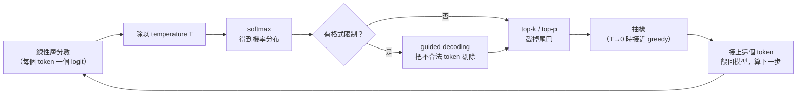

> 🌏 [English version](/posts/ai/2026-09-29-cme295-large-language-models-en)

**影片狀態：已附影片；播放未逐支確認。** [影片來源與說明](#課程影片來源)

本篇對應 Stanford [CME295](/posts/ai/2026-09-29-stanford-cme295-transformers-llms) 2025 版第 3 講「Large Language Models」（2025 年 10 月 10 日）。主要來源是 [125 頁投影片](https://cme295.stanford.edu/slides/fall25-cme295-lecture3.pdf)，[錄影](https://www.youtube.com/watch?v=Q5baLehv5So)長 1 小時 48 分。本文只根據投影片上的文字與圖寫，課堂口述的補充沒有收進來。

你呼叫任何一家 LLM API，參數欄位裡大概都看過 `temperature`、`top_p`，可能還有要求輸出 JSON 的選項。這些欄位各自在模型的哪一步動手腳，就是這一講的主體。

投影片的目錄分成五段：LLM overview、MoE-based LLMs、Response generation、Prompting strategies、Inference optimizations。本文的重心放在中間三段，也就是「模型生成時你能轉的旋鈕」。MoE 只講直覺，最後一段推論加速只畫地圖，細節都連到站上更完整的篇章。

## 課程影片來源

下列影片連結已列於本文對應講次的來源。

```youtube
url: https://www.youtube.com/watch?v=Q5baLehv5So
title: 2025 版第 3 講錄影
```

原始影片：[2025 版第 3 講錄影](https://www.youtube.com/watch?v=Q5baLehv5So)

課程與錄影入口：

- [官方課程／講次來源](https://cme295.stanford.edu/syllabus/2025/)

## 什麼東西算 LLM

投影片先引一句定義：語言模型是「assigns probabilities to sequences of tokens」的統計或機器學習模型。LLM 的「Large」落在三件事上：

- 模型大小：數十億參數以上
- 訓練資料：數千億 token 以上
- 算力：投影片原文是「a lot of GPUs」

架構上，這門課說的 LLM 就是 decoder-only 的 Transformer，例子列了 GPT 系列、LLaMA、Gemma、DeepSeek、Mistral、Qwen。上一講（[第 2 講](/posts/ai/2026-09-29-cme295-transformer-tricks)）把 Transformer 分成 encoder-decoder（T5）、encoder-only（BERT）、decoder-only（GPT）三類，這一講接著只談第三類。

## MoE：模型很大，但每個 token 只走一小段

投影片的出發點是一句觀察：「Not all weights are useful in the forward pass」。一個巨大的模型，處理某個輸入時不見得每個權重都派得上用場，那能不能每次只跑其中一部分？

做法是把一個大網路拆成 n 個「專家」E1 到 En，前面放一個 gating 網路 G 決定要用誰：

- **Dense MoE**：所有專家都算，輸出是全部專家輸出的加權平均。沒省到計算。
- **Sparse MoE**：G 用 top-k 挑出幾個專家，只算這幾個，再加權平均。這才是省計算的版本，出自 [Shazeer 等人 2017 年的論文](https://arxiv.org/abs/1701.06538)。

放進 Transformer 時，被換掉的是每層的前饋網路（FFNN）。投影片特別標出「Routing done for each token!」：同一句話裡，「teddy」和「reading」可能被送到不同專家。

訓練 MoE 最常見的麻煩叫 **routing collapse**：gating 網路發現某個專家比較好用，就一直選它。其他專家拿不到訓練訊號，越來越沒用，形成惡性循環。投影片引 [Switch Transformers](https://arxiv.org/abs/2101.03961) 的解法，加一項 auxiliary loss，把其他專家「拉回場上」。

<details>
<summary>公式：Switch Transformers 的 auxiliary loss</summary>

```
loss = α · N · Σ_{i=1..N} f_i · P_i
```

- `N`：專家數
- `f_i`：實際被分到專家 i 的 token 比例
- `P_i`：gating 網路給專家 i 的平均機率
- `α`：這項 loss 的權重

直覺：如果某個專家同時拿到很多 token（f_i 大）又被給很高機率（P_i 大），乘積就大，loss 就高。全部專家平均分攤時這項最小。

</details>

專家到底學到什麼？投影片放了 [Mixtral](https://arxiv.org/abs/2401.04088) 論文的圖，把一段 Python 程式碼的每個 token 依被分到的專家上色。論文自己的結論是看不出專家依主題分工，但 router「exhibit some structured syntactic behavior」，例如 Python 的 `self` 常被送到同一個專家。換句話說，專家分工比較像語法層面的，不是「數學專家」「程式專家」這種分法。

MoE 的完整取捨（負載平衡的各種做法、通訊成本、為什麼 2026 年的前沿模型幾乎都用它）站上已經有兩篇：[CS336 Lecture 4](/posts/ai/2026-08-22-cs336-attention-moe) 和 [MoE 為什麼贏](/posts/ai/2026-08-26-moe-architecture-why-it-wins)。

## 旋鈕一：下一個 token 怎麼挑

LLM 每一步都輸出詞彙表上的一個機率分布，接下來要從分布裡挑一個 token 接上去，再餵回模型。投影片依序給了三個想法：

| 策略 | 做法 | 投影片列的限制 |
|---|---|---|
| greedy decoding | 每步挑機率最高的 token | 輸出不一定最好、不自然、缺乏多樣性 |
| beam search | 同時保留 k 條整體機率最高的路徑，走到 `[EOS]` 為止 | 要多算；缺乏多樣性與創意 |
| sampling | 依機率分布抽樣 | 需要決定「從哪些候選裡抽」 |

sampling 又分兩種常見的截斷方式：

- **top-k**：只在機率前 k 名裡抽，投影片的例子是 k = 4
- **top-p**：把 token 依機率排好，取累積機率 ≥ p 的最小集合，在裡面抽，投影片的例子是 p = 90%。這個方法來自 [Holtzman 等人的 nucleus sampling 論文](https://arxiv.org/abs/1904.09751)

兩者的差別在分布很尖或很平的時候最明顯。模型很有把握時，前兩三個 token 就佔了 90%，top-p 只會留下這幾個；模型沒把握時，top-p 會放進更多候選。top-k 不管分布長怎樣，永遠是 k 個。

## 旋鈕二：temperature 改的是分布的形狀

機率是從哪來的？是 decoder 最後的線性層吐出每個詞的分數，再經過 softmax。temperature 就插在 softmax 裡：每個分數先除以 T，再做 softmax。

<details>
<summary>公式：加上 temperature 的 softmax</summary>

```
P_adj(w_{t+1} = w_i | C) = exp(x_i / T) / Σ_{j=1..n} exp(x_j / T)
```

- `x_i`：第 i 個 token 的分數（logit）
- `C`：目前為止的上下文
- `T`：temperature。T = 1 就是原本的 softmax

</details>

投影片用兩張長條圖說明效果。T 很小時，幾乎全部機率集中在一個 token（例子裡是 `kind`），接近 greedy。T 很大時，每個候選的機率差不多高，輸出變得隨機。所以 temperature 管的是「敢不敢選冷門的字」，top-k／top-p 管的是「冷門到什麼程度就直接不考慮」，兩者常一起用。

投影片在這裡附了延伸閱讀：Thinking Machines 的 [Defeating Nondeterminism in LLM Inference](https://thinkingmachines.ai/blog/defeating-nondeterminism-in-llm-inference/)。它處理的問題是：就算把 temperature 設成 0，同一個 prompt 在推論服務上跑兩次，結果還是可能不一樣。

## 旋鈕三：guided decoding，直接禁止不合法的 token

如果你要模型輸出 JSON，只在 prompt 裡寫「請用 JSON 格式」，模型還是可能多吐一句開場白，或少一個括號。投影片的例子是：請模型把「我那隻 33 歲、喜歡閱讀的泰迪熊」寫成 `{"first_name": "teddy", "last_name": "bear", "age": 33, "hobby": "reading"}`。

guided decoding 的做法是在每一步只允許「合法」的下一個 token。第一個 token 只能是 `{`，接著只能是 key 的字串，key 後面只能是 `:`。其他 token 的機率直接被設成不可能，所以抽樣永遠抽不到。這是各家 API「structured output」功能背後的概念。



## 旋鈕四：context length，放得進去不代表讀得好

模型一次能讀的輸入長度，投影片列了三個同義詞：context length、context size、window size。它沒有給具體數字，只寫量級取決於輸入類型和模型。旁邊用紅字標了一句「Beware of "context rot"!」，引的是 Chroma 的 [Context Rot](https://www.trychroma.com/research/context-rot) 研究：輸入越長，模型表現會往下掉，即使任務本身沒有變難。

站上有一篇專門整理長 context 失效和各家應對方式的文章：[Context 滿了怎麼辦：七種答案](/posts/ai/2026-08-21-context-full-seven-answers)。

## 旋鈕五：prompting，不動權重也能改變輸出

前面四個旋鈕都在解碼端，這一段換成改輸入。投影片先拆出一個 prompt 的四個部分，例子是替累了一天的泰迪熊寫床邊故事：

| 部分 | 例子 |
|---|---|
| Context | 我的泰迪熊今天很累，需要一個床邊故事 |
| Instructions | 寫一個發生在特定地點的床邊故事 |
| Input | 地點：泰迪熊之國 |
| Constraints | 內容要適合很累的泰迪熊 |

接著是三種手法，每一種投影片都附了代價：

**In-context learning（ICL）**。來自 [GPT-3 論文](https://arxiv.org/abs/2005.14165)。zero-shot 是直接問、不給範例，效果完全看模型本身的能力；few-shot 是在 prompt 裡放幾組輸入輸出範例，通常效果較好。代價是要花力氣準備範例、prompt 變長，計算成本和延遲都跟著上升。

**Chain of thought（CoT）**。來自 [Wei 等人 2022 年的論文](https://arxiv.org/abs/2201.11903)，想法是「Explaining reasoning helps in improving performance」。投影片的例子是先放一題示範：「熊 2020 年出生，所以現在 4 歲。」接著問「明年幾歲」，模型就會照著先寫推理再下結論：「明年會比今年大一歲，今年 4 歲，所以是 5 歲。」好處是可解讀，看得到模型怎麼想的；代價是多出來的 token 會增加成本和延遲。

**Self-consistency**。來自 [Wang 等人 2022 年的論文](https://arxiv.org/abs/2203.11171)，想法是對同一題抽樣多條推理路徑，再彙整答案。投影片的例子裡，三條路徑有兩條算出 5 歲，一條算錯成 4 歲，取多數得到 5。它跟旋鈕一直接相關：只有用 sampling、不用 greedy，才抽得出不同的路徑。代價是成本乘上路徑數，投影片的結論是「performance 和 added cost 之間的取捨」。

## 最後一段：讓生成變快的地圖

這一段不在 2025 課表的主題清單上，但投影片最後約 40 頁都在講它，期中考第 III 大題也出了 4 題。投影片把推論加速分成「不改結果的精確優化」和「近似」兩類，列了六個技巧：

| 技巧 | 解決什麼 | 出處 |
|---|---|---|
| KV cache | 每生成一個新 token 都要跟之前所有 token 做 attention，把之前算過的 key 和 value 存起來重用 | — |
| MQA / GQA | 多個 query head 共用同一組 key/value head，KV cache 變小 | [MQA](https://arxiv.org/abs/1911.02150)、[GQA](https://arxiv.org/abs/2305.13245) |
| PagedAttention | KV cache 放在連續記憶體會浪費很多空間，改成分頁、不連續存放 | [Kwon et al., 2023](https://arxiv.org/abs/2309.06180) |
| latent attention | 快取壓縮過的低維表示，不存完整的 K 和 V | [DeepSeek-V2](https://arxiv.org/abs/2405.04434) |
| speculative decoding | 小的 draft 模型先猜好幾個 token，大的 target 模型一次驗證 | [Chen et al., 2023](https://arxiv.org/abs/2302.01318) |
| multi-token prediction | 訓練多個預測頭，一次預測後面 k 個 token，draft 和 target 是同一個模型 | [Gloeckle et al., 2024](https://arxiv.org/abs/2404.19737) |

<details>
<summary>speculative decoding 的接受規則</summary>

draft 模型對第 i 個位置給出分布 P_i，target 模型給出 Q_i。對 draft 猜的每個 token 依序檢查：

```
若 Q_i(token) >= P_i(token)：接受
否則：以機率 Q_i(token) / P_i(token) 接受，
      以機率 1 - Q_i(token) / P_i(token) 拒絕
拒絕時：從 [Q_i - P_i]+（正規化後）重新抽一個 token，然後結束這一輪
```

[Chen 等人的論文](https://arxiv.org/abs/2302.01318)證明，這個規則讓最後輸出的分布跟只用 target 模型抽樣一樣，draft 模型只影響速度，不影響結果。

</details>

MQA/GQA 在 [第 2 講](/posts/ai/2026-09-29-cme295-transformer-tricks)已經出現過一次，這裡是從「KV cache 太大」的角度再講一遍。整套推論優化的細節，站上有 [CS336 Lecture 10](/posts/ai/2026-08-22-cs336-inference) 和介紹 PagedAttention 的 [vLLM 深入介紹](/posts/ai/2026-03-14-vllm-inference-engine)。

## 連回你用的模型

把這一講對回日常用 API 的經驗：

- **要穩定、可重現的輸出**（抽取欄位、分類、寫程式）：temperature 調低。要固定格式時，用 API 的 structured output 功能，比在 prompt 裡寫「請輸出 JSON」可靠，因為它在解碼端直接擋掉不合法的 token。
- **要多樣的輸出**（發想、寫文案）：temperature 調高，搭配 top-p 截掉機率極低的尾巴，避免抽到完全無關的字。
- **模型答錯推理題**：先試 few-shot 加 chain of thought；準確度比成本重要時，再用 self-consistency 抽多次取多數。
- **塞了很長的文件但答案變差**：可能是 context rot。與其把整份文件塞進去，不如先檢索出相關段落，這是[第 7 講](/posts/ai/2026-09-29-cme295-agentic-llms) RAG 的出發點。

至於 MoE 和推論加速，那是模型供應商替你做掉的事。你感受到的是結果：回應更快、推論成本更低。

## 2026 版改了什麼

2026 版目前只釋出第 1 講的投影片，對應本講的第 2 講排在 10 月 2 日上課，以下只根據 [2026 課表](https://cme295.stanford.edu/syllabus/)的主題清單比對：

- **這一講被併進 2026 版第 2 講「Large Language Models」**。那一講的清單是 Transformer model families、LLM definition and architecture、Mixture of experts、MHA/MQA/GQA、RoPE、context length、temperature、sampling strategies。也就是說，2025 的第 2 講和第 3 講前半合成一講。
- **prompting、in-context learning、chain of thought、self-consistency 從課表消失**。2026 版沒有任何一講的主題清單列出它們。
- **推論加速搬到新的一整講**。2026 版第 5 講「LLM systems」列了 inference optimizations、KV caching、speculative decoding、Flash Attention 等，2025 版這講最後一段的內容應該會在那裡展開，課前預寫版見本系列 [order 10](/posts/ai/2026-09-29-cme295-llm-systems)。
- guided decoding 在 2026 課表上沒有出現，但課表只列大主題，無法判斷它是被刪掉還是併在 sampling 底下講。

## 自我檢測

以下題目改寫自 [2025 期中考](https://cme295.stanford.edu/exams/fall25-cme295-midterm.pdf)第 III 大題，答案在[解答 PDF](https://cme295.stanford.edu/exams/fall25-cme295-midterm-solutions.pdf)：

1. sparse MoE 的 routing 是怎麼決定每個 token 要用哪些專家的？（第 2 題）
2. speculative decoding 靠什麼加速生成？draft 模型和 target 模型各做什麼？（第 4 題）
3. top-p sampling 的候選集合怎麼決定？跟 top-k 差在哪？（第 7 題）
4. 解碼時把 temperature 調高，分布會變尖還是變平？（第 8 題）
5. 什麼是 routing collapse？舉一個常見的緩解方法。（第 9 題）
6. 比較 greedy／beam search 與 top-k／top-p sampling 的多樣性、品質、計算量。（第 10 題）

## 想深入

- MoE 與 attention 變體的完整取捨：[CS336 Lecture 4：Attention 不只一種，MoE 也不是免費擴大模型](/posts/ai/2026-08-22-cs336-attention-moe)
- 為什麼前沿模型都改用 MoE：[MoE 為什麼贏](/posts/ai/2026-08-26-moe-architecture-why-it-wins)
- 解碼策略的另一種講法：[CS224N 第 12 講：Decoding、DeepSeek-R1 與推理訓練](/posts/ai/2026-08-22-cs224n-reasoning-one)
- in-context learning 從哪裡來：[CS224N 第 7 講：預訓練、subword 與 in-context learning](/posts/ai/2026-08-22-cs224n-pretraining)
- 推論優化：[CS336 Lecture 10](/posts/ai/2026-08-22-cs336-inference)
- 本系列下一講：[第 4 講：LLM 訓練](/posts/ai/2026-09-29-cme295-llm-training)；把 chain of thought 訓練進模型裡的做法在[第 6 講：LLM 推理](/posts/ai/2026-09-29-cme295-llm-reasoning)

## 更新紀錄

- 2026-10-10：標註影片狀態，核對錄影來源與取得方式。

## 參考資料

- [CME 295 2025 版課表](https://cme295.stanford.edu/syllabus/2025/)
- [CME 295 2026 版課表](https://cme295.stanford.edu/syllabus/)
- [2025 版第 3 講投影片（PDF）](https://cme295.stanford.edu/slides/fall25-cme295-lecture3.pdf)
- [2025 版第 3 講錄影](https://www.youtube.com/watch?v=Q5baLehv5So)
- [2025 期中考](https://cme295.stanford.edu/exams/fall25-cme295-midterm.pdf)／[解答](https://cme295.stanford.edu/exams/fall25-cme295-midterm-solutions.pdf)
- [Shazeer et al., Outrageously Large Neural Networks: The Sparsely-Gated Mixture-of-Experts Layer (2017)](https://arxiv.org/abs/1701.06538)
- [Fedus et al., Switch Transformers (2021)](https://arxiv.org/abs/2101.03961)
- [Jiang et al., Mixtral of Experts (2024)](https://arxiv.org/abs/2401.04088)
- [Holtzman et al., The Curious Case of Neural Text Degeneration (2019)](https://arxiv.org/abs/1904.09751)
- [He, Defeating Nondeterminism in LLM Inference (Thinking Machines, 2025)](https://thinkingmachines.ai/blog/defeating-nondeterminism-in-llm-inference/)
- [Hong et al., Context Rot (Chroma, 2025)](https://www.trychroma.com/research/context-rot)
- [Brown et al., Language Models are Few-Shot Learners (2020)](https://arxiv.org/abs/2005.14165)
- [Wei et al., Chain-of-Thought Prompting Elicits Reasoning in Large Language Models (2022)](https://arxiv.org/abs/2201.11903)
- [Wang et al., Self-Consistency Improves Chain of Thought Reasoning in Language Models (2022)](https://arxiv.org/abs/2203.11171)
- [Shazeer, Fast Transformer Decoding: One Write-Head is All You Need (2019)](https://arxiv.org/abs/1911.02150)
- [Ainslie et al., GQA (2023)](https://arxiv.org/abs/2305.13245)
- [Kwon et al., Efficient Memory Management for LLM Serving with PagedAttention (2023)](https://arxiv.org/abs/2309.06180)
- [DeepSeek-AI, DeepSeek-V2 (2024)](https://arxiv.org/abs/2405.04434)
- [Chen et al., Accelerating Large Language Model Decoding with Speculative Sampling (2023)](https://arxiv.org/abs/2302.01318)
- [Gloeckle et al., Better & Faster Large Language Models via Multi-token Prediction (2024)](https://arxiv.org/abs/2404.19737)
- [Stanford CME295 導讀（本系列總覽）](/posts/ai/2026-09-29-stanford-cme295-transformers-llms)
