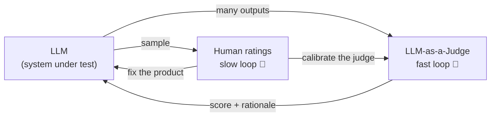
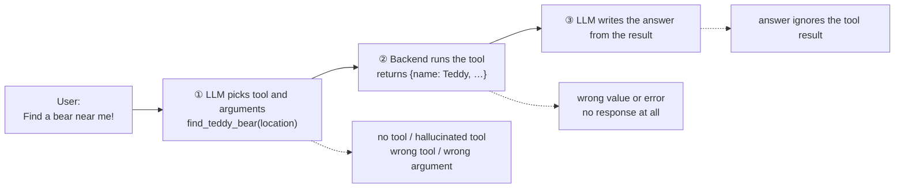

> 🌏 [中文版](/posts/ai/2026-09-29-cme295-llm-evaluation)

**Video status: Videos included; playback has not been rechecked individually.** [Source details](#course-video-sources)

This post covers Lecture 8, "LLM evaluation," of the 2025 edition of Stanford [CME295](/posts/ai/2026-09-29-stanford-cme295-transformers-llms-en) (November 21, 2025). The main source is the [170-page slide deck](https://cme295.stanford.edu/slides/fall25-cme295-lecture8.pdf); the recording is on [YouTube](https://www.youtube.com/watch?v=8fNP4N46RRo). Everything below is based on what is on the slides.

You change one line of a system prompt and want to know whether answers got better. The model produces free-form text, so there is no answer key. Ask a colleague to rate them? Two people may score the same response differently, and rating a hundred examples takes a day. That is the question this lecture answers: how do you evaluate LLM output, and how far can each method be trusted?

The slides first scope the word. "Evaluation" can mean **output quality** (instruction following, coherence, factuality) or **system performance** (latency, pricing, reliability). This lecture is about the former.

## Course video sources

The videos below are the recordings linked for the topics covered in this article.

```youtube
url: https://www.youtube.com/watch?v=8fNP4N46RRo
title: 2025 Lecture 8 recording
```

Original videos: [2025 Lecture 8 recording](https://www.youtube.com/watch?v=8fNP4N46RRo)

Course and recording entries:

- [Official course / lecture source](https://cme295.stanford.edu/syllabus/2025/)

## Human rating: closest to the truth, with three problems

The slides call human rating "closest to truth," then list three limitations:

1. **Subjectivity**: asked "What birthday gift should I get?", the model answers "A teddy bear is almost always a sweet gift." Is that useful? Two raters may disagree.
2. **Slow**
3. **Expensive**

Subjectivity can be measured. Two raters might agree purely by luck. [Cohen's kappa](https://en.wikipedia.org/wiki/Cohen%27s_kappa) asks: "How much better is our agreement than what we'd expect just by chance, given how the raters actually use the categories?" The slides also mention the multi-rater variants Fleiss' kappa and Krippendorff's alpha.

<details>
<summary>Formula: Cohen's kappa</summary>

```
κ = (p_o − p_e) / (1 − p_e)
```

- `p_o`: observed proportion of agreement
- `p_e`: agreement expected by chance, given how often each rater uses each category
- κ = 1 is perfect agreement; κ ≈ 0 is no better than chance

</details>

## Rule-based metrics: write the answer once, compare automatically

The first labor-saving idea: have humans write reference answers once, then compare every model output against them. The slides list three classic metrics:

| Metric | Full name | Originally for |
|---|---|---|
| [BLEU](https://aclanthology.org/P02-1040/) | BiLingual Evaluation Understudy | Machine translation |
| [ROUGE](https://aclanthology.org/W04-1013/) | Recall-Oriented Understudy for Gisting Evaluation | Summarization; variants include ROUGE-N and ROUGE-L |
| [METEOR](https://aclanthology.org/W05-0909/) | Metric for Evaluation of Translation with Explicit ORdering | Machine translation |

The slides show the problem with three sentences: "A plush teddy bear can comfort a child during bedtime." "Soft stuffed bears often help kids feel safe as they fall asleep." "Many youngsters rest more easily at night when they cuddle a gentle toy companion." They mean nearly the same thing but share almost no words, so an overlap metric scores them low. The slides list three drawbacks: no credit for stylistic variation, weak correlation with human ratings, and the fact that you **still need human-written references**.

## LLM-as-a-Judge: let another model grade

[Zheng et al. (2023)](https://arxiv.org/abs/2306.05685), the MT-Bench and Chatbot Arena paper, popularized the idea: ask an LLM to score the response against a criterion. The slide's example prompt is a few lines long:

```
Evaluate how relevant the model's answer is to the user's prompt.
Prompt: {prompt}
Model Response: {model_response}
Return:
- Rationale (1–2 sentences)
- Score: 1 if mostly relevant, 0 if mostly irrelevant.
```

The judge takes "user prompt + model response + criterion" and returns "rationale + score." To make the output machine-readable, the slides recommend the structured-output feature each provider offers: define the output shape as a class (`rationale: str`, `score: Literal[0, 1]`), then pass it in the API call. The technique first appeared in [Lecture 3](/posts/ai/2026-09-29-cme295-large-language-models-en).

Compared with the previous two methods, the slides list two benefits: **no reference or label needed**, and **interpretability through rationales**. There are two ways to ask the judge:

- **Pointwise**: show one response and ask for a score (e.g., "Very good")
- **Pairwise**: show two responses and ask "Which is better, A or B?"

## Three biases, each with a remedy

The judge is a model, so it has a model's preferences. The slides name three:

| Bias | Symptom | Remedy on the slides |
|---|---|---|
| Position bias | Swap A and B and the judge's pick follows the position, not the content | Evaluate both orders and average, or tweak position embeddings |
| Verbosity bias | Given a short correct answer and a long unhelpful one, the judge picks the long one | Explicit guidelines, few-shot examples, and/or a penalty on output length |
| Self-enhancement bias | Given a perfect human-written answer and one it generated itself, the judge picks its own | Don't use the same model as both contestant and judge |

Combining the biases with other lessons, the slides give six best practices:

1. Crisp guidelines
2. A binary scale (pass/fail) rather than something granular like 1–10
3. Write the rationale before outputting the score
4. Mitigate the biases above
5. Calibrate with human judgments
6. Low temperature for reproducibility

Rule 3 works for the same reason [chain-of-thought](/posts/ai/2026-09-29-cme295-large-language-models-en) does: reason first, conclude second. Rule 5 shows that the judge does not replace human rating; it moves human rating to a slower outer loop:



## Factuality: split a passage into individual facts

Which dimensions should a judge cover? The slides group them into **task performance** (usefulness, factuality, relevance) and **alignment** (tone, style, safety). Factuality is the hard one, because a passage is often partly right.

The slide's example: "Teddy bears, first created in the 1920s, were named after President Theodore Roosevelt after he proudly wanted to shoot a captured bear on a hunting trip." A single score can't express "partially correct." The approach from [Wei et al.'s long-form factuality paper (2024)](https://arxiv.org/abs/2403.18802) is to decompose the passage into standalone facts and check each one:

| Decomposed fact | Verdict on the slide | Weight |
|---|---|---|
| Teddy bears were first created in the 1920s | ✗ | 0.3 |
| Teddy bears were named after President Theodore Roosevelt | ✓ | 0.4 |
| Roosevelt was on a hunting trip where a bear was captured | ✓ | 0.2 |
| Roosevelt proudly wanted to shoot the captured bear | ✗ | 0.1 |

Summing the weights of the correct facts gives a score of 0.6.

<details>
<summary>Formula: weighted fact score</summary>

```
score = Σ_{i=1..n} α_i × score_i
```

- `α_i`: importance weight of fact i
- `score_i`: 1 if fact i is correct, 0 otherwise
- Slide example: 0.4 + 0.2 = 0.60

</details>

## When an agent fails, which step failed?

Grading a single answer is simple enough. The agents from [Lecture 7](/posts/ai/2026-09-29-cme295-agentic-llms-en) run many loops of [ReAct](https://arxiv.org/abs/2210.03629)'s act → observe → plan cycle. The slides break one tool call into three steps, using "Find a bear near me!" as the example, and each step has its own failure modes:



| Step | Symptom | Cause → remedy on the slides |
|---|---|---|
| ① Tool prediction | Replies "Sorry, I don't know where I can find one" | Tool router error → retrain the router; model doesn't know the tool → SFT, or improve the prompt for that API |
| | Calls a nonexistent `find_bear()` | Model too weak → upgrade; illogical API naming → revamp the API; unclear instructions → iterate on top-level instructions |
| | Uses `send_message()` to ask a local business instead | Model chose the wrong tool |
| | Passes `location = (0, 0)` | Argument can't be inferred → add a helper tool and/or make sure the context carries the information |
| ② Tool call | Returns a wrong value or a `ValueError` | Fix the tool implementation |
| | Returns nothing; the final answer is often hallucinated | Always return something, even an empty JSON; emit meaningful tool outputs |
| ③ Response generation | Tool found Teddy, model says "Didn't find any bear!" | Weak grounding → upgrade the synthesizing LLM; tool output floods the context → trim what the backend returns; output hard to interpret → make the output format descriptive |

The slides' takeaway sorts the causes into two groups. **Modeling**: weak reasoning or grounding, too much in the context window, tool modeling that isn't right. **Tool**: the tool itself has a problem, or its output isn't interpretable. The closing line: debugging these takes "special care and patience."

## Benchmarks: each score is one angle

The final section surveys common benchmarks, with an eye to what each measures and how it is scored:

| Axis | Example | Size and format (per the slides) | Scoring |
|---|---|---|---|
| Knowledge | [MMLU](https://arxiv.org/abs/2009.03300) | 4-way multiple choice over 57 tasks | Match the choice |
| Math reasoning | [AIME](https://maa.org/maa-invitational-competitions/) | ~30 problems, 3-digit answers | Match the answer |
| Common-sense reasoning | [PIQA](https://arxiv.org/abs/1911.11641) | ~20,000 everyday physics situations, 2-way choice | Match the choice |
| Coding | [SWE-bench](https://arxiv.org/abs/2310.06770) | 2,294 real GitHub issues from 12 Python repos | Generated PR passes all tests |
| Safety | [HarmBench](https://arxiv.org/abs/2402.04249) | 510 harmful behaviors (400 text, 110 multimodal) | Attack success rate (ASR), judged by a classifier |
| Agents | [τ-bench](https://arxiv.org/abs/2406.12045) | Airline and retail domains, ~10 tools each, 50 and 115 tasks | Reward and pass^k |

The slides describe SWE-bench as a "proxy for tool use abilities," and they label the scoring method clearly: the other five use a hardcoded match, while HarmBench relies on a classifier.

The pass^k metric used by τ-bench deserves its own look. It asks: if you run the same task k times, what is the probability that **every** run succeeds? The pass@k from [Lecture 6](/posts/ai/2026-09-29-cme295-llm-reasoning-en) asks whether **at least one** succeeds. pass@k suits settings where checking is easy and you can retry, such as running tests and keeping the code that passes. pass^k suits a customer-service agent that has to get it right every time.

<details>
<summary>Formulas: pass^k and pass@k</summary>

Run a task n times, with c successes:

```
pass^k = C(c, k) / C(n, k)          # all k draws succeed (slides, τ-bench)
pass@k = 1 − C(n−c, k) / C(n, k)    # at least one of k draws succeeds (Chen et al., 2021)
```

As k grows, pass^k falls and pass@k rises. The two numbers can be far apart.

</details>

Once you have a pile of scores, the slides suggest three ways to read them:

- **Read the profile, not a single rank**: a benchmark is a projection onto one axis, and different models are good at different things. The slides use the [Gemini 3 launch post](https://blog.google/products/gemini/gemini-3/) (published three days before the lecture) as an example, grouping its results into reasoning, coding, tool use, and knowledge.
- **Read the Pareto frontier**: quality vs. cost/latency, quality vs. safety, quality vs. context length. You are choosing a trade-off, not a champion.
- **Beware of data contamination**: clues to the test may already be in the training set. The slides list three precautions: put an identifiable canary string in benchmark files (as [BIG-bench](https://github.com/google/BIG-bench/blob/main/docs/doc.md) does), use a blocklist when the model has tools, and evaluate on newer test versions.

The slides end with Goodhart's law: "When a measure becomes a target, it ceases to be a good measure." The lesson they draw is not to over-index on benchmarks, to complement them with organic signals like [Chatbot Arena](https://lmarena.ai/), and to "just try a few models out yourself."

## Back to the models you use

Almost everything in this lecture carries straight into production work:

- The "evaluators" you configure in [Langfuse](/posts/ai/2026-03-26-langfuse-llm-observability-guide-en), [LangSmith](/posts/ai/2026-08-22-langsmith-observability-evaluation-en), or [Braintrust](/posts/ai/2026-08-22-braintrust-llm-evaluation-en) are LLM-as-a-Judge. The six best practices make a ready checklist: is the judge using a binary score? Does it write the rationale first? Is it the same model and version as the one being graded?
- For pairwise comparisons, always run both orders. With only one order, what you see may be position bias.
- When an agent fails, locate the step (①, ② or ③) before deciding whether to change the prompt, the tool, or the model. Many "the model is dumb" problems turn out to be a tool that returned nothing, or returned too much.
- When reading the benchmark table in a model launch post, ask three things: which axis does this score measure? Is it pass@1 or multiple samples? Is the test set recent enough?

## What changes in 2026

The 2026 slides haven't been released yet, so this comparison is based on the two syllabi only. The topic list for 2026 Lecture 7, "LLM evaluation," is: LLM-as-a-judge overview, best practices and benefits, biases and pitfalls, **agent evaluation**, and **benchmarks**. The first three match the 2025 syllabus exactly; the last two are new to the list.

The 2025 slides, however, already include agent tool-call failure modes, τ-bench, and a full benchmark section; the 2025 syllabus simply didn't list them. So the 2026 change may be promoting those two parts to named topics and expanding them, rather than adding them from scratch. The actual content will be clear once the 2026 slides go up (the lecture is scheduled for November 13, 2026). The 2026 agents lecture also expands to MCP, context compaction, harness optimization and coding agents, and agent evaluation may be revised to match.

## Self-check

These questions are adapted from Section IV, "LLM evaluation," of the [2025 final exam](https://cme295.stanford.edu/exams/fall25-cme295-final.pdf). Answers are in the [solutions PDF](https://cme295.stanford.edu/exams/fall25-cme295-final-solutions.pdf):

1. Why are n-gram metrics like BLEU and ROUGE a poor fit for open-ended chat LLMs? (Q8)
2. What is a "pairwise" evaluation, and how does it differ from pointwise? (Q4)
3. What does "position bias" in LLM-as-a-Judge refer to? (Q5)
4. Define "verbosity bias," and propose one concrete method to mitigate any LLM-judge bias. (Q9)
5. How is pass@k defined, and how does it differ from τ-bench's pass^k? (extends Q6)
6. What does SWE-bench evaluate? How do static benchmarks (like MMLU) differ from dynamic leaderboards (like Chatbot Arena)? (Q10)

## Going deeper

- Another take on the same topic, with more on benchmark lifecycles and contamination audits: [CS224N Lecture 11: Why Benchmarks and LLM Evaluation Expire](/posts/ai/2026-08-22-cs224n-benchmark-evaluation-en)
- From perplexity to agent and safety evaluation: [CS336 Lecture 12](/posts/ai/2026-08-22-cs336-evaluation-en)
- The practical side, with golden sets, blind judging and statistical tests: [How to rigorously compare an agent before and after a change](/posts/ai/2026-06-04-agent-change-rigorous-evaluation-en)
- Turning every agent tool call into a traceable span: [Agent observability: from OTel traces to catching hallucinations, tool misuse and infinite loops](/posts/ai/2026-06-04-agent-observability-failure-detection-en)

## Update Log

- 2026-10-10: Added explicit video status and checked recording sources and access notes.

## References

- [CME 295 2025 syllabus](https://cme295.stanford.edu/syllabus/2025/) / [2026 syllabus](https://cme295.stanford.edu/syllabus/)
- [2025 Lecture 8 slides (PDF)](https://cme295.stanford.edu/slides/fall25-cme295-lecture8.pdf)
- [2025 Lecture 8 recording](https://www.youtube.com/watch?v=8fNP4N46RRo)
- [2025 final exam](https://cme295.stanford.edu/exams/fall25-cme295-final.pdf) / [solutions](https://cme295.stanford.edu/exams/fall25-cme295-final-solutions.pdf)
- [Zheng et al., Judging LLM-as-a-Judge with MT-Bench and Chatbot Arena (2023)](https://arxiv.org/abs/2306.05685)
- [Cohen's kappa (Wikipedia)](https://en.wikipedia.org/wiki/Cohen%27s_kappa)
- [Papineni et al., BLEU (2002)](https://aclanthology.org/P02-1040/)
- [Lin, ROUGE (2004)](https://aclanthology.org/W04-1013/)
- [Banerjee & Lavie, METEOR (2005)](https://aclanthology.org/W05-0909/)
- [Wei et al., Long-form factuality in large language models (2024)](https://arxiv.org/abs/2403.18802)
- [Yao et al., ReAct (2022)](https://arxiv.org/abs/2210.03629)
- [Hendrycks et al., Measuring Massive Multitask Language Understanding (2020)](https://arxiv.org/abs/2009.03300)
- [MAA Invitational Competitions (AIME)](https://maa.org/maa-invitational-competitions/)
- [Bisk et al., PIQA (2019)](https://arxiv.org/abs/1911.11641)
- [Jimenez et al., SWE-bench (2023)](https://arxiv.org/abs/2310.06770)
- [Mazeika et al., HarmBench (2024)](https://arxiv.org/abs/2402.04249)
- [Yao et al., τ-bench (2024)](https://arxiv.org/abs/2406.12045)
- [Chen et al., Evaluating Large Language Models Trained on Code (2021)](https://arxiv.org/abs/2107.03374)
- [Google, Gemini 3 launch post (2025)](https://blog.google/products/gemini/gemini-3/)
- [BIG-bench docs (canary string)](https://github.com/google/BIG-bench/blob/main/docs/doc.md)
- [LMArena (Chatbot Arena)](https://lmarena.ai/)
- [Reading Stanford CME295 (series overview)](/posts/ai/2026-09-29-stanford-cme295-transformers-llms-en)
