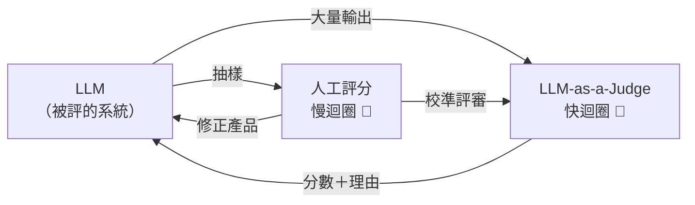
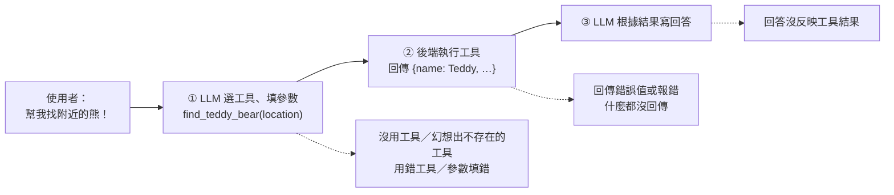

> 🌏 [English version](/posts/ai/2026-09-29-cme295-llm-evaluation-en)

本篇對應 Stanford [CME295](/posts/ai/2026-09-29-stanford-cme295-transformers-llms) 2025 版第 8 講「LLM evaluation」（2025 年 11 月 21 日）。主要來源是 [170 頁投影片](https://cme295.stanford.edu/slides/fall25-cme295-lecture8.pdf)，錄影在 [YouTube](https://www.youtube.com/watch?v=8fNP4N46RRo)；本文只根據投影片上的內容寫。

你改了一行 system prompt，想知道回答有沒有變好。模型吐出來的是自由文字，沒有標準答案可以對。找同事來評？兩個人對同一句話的打分不一定一樣，而且評一百題要一整天。這一講回答的就是這個問題：LLM 的輸出要怎麼評，哪些評法可以信到什麼程度。

投影片先界定範圍：「評估」可以指**輸出品質**（有沒有照指示、連貫、正確），也可以指**系統表現**（延遲、價格、可靠度）。這一講只談前者。

## 課程影片來源

下列影片連結已列於本文對應講次的來源。

```youtube
url: https://www.youtube.com/watch?v=8fNP4N46RRo
title: 2025 版第 8 講錄影
```

原始影片：[2025 版第 8 講錄影](https://www.youtube.com/watch?v=8fNP4N46RRo)

課程與錄影入口：

- [官方課程／講次來源](https://cme295.stanford.edu/syllabus/2025/)

## 人工評分：最接近真相，但有三個問題

人工評分被投影片稱為「closest to truth」，但它有三個限制：

1. **主觀**：問「生日禮物該送什麼？」，模型回「泰迪熊幾乎都不會錯」。這算有用嗎？兩位評分者可能給出不同答案。
2. **慢**
3. **貴**

主觀性可以量化。兩個人剛好給一樣的分數，有可能只是運氣。[Cohen's kappa](https://en.wikipedia.org/wiki/Cohen%27s_kappa) 問的是：「我們的一致程度，比純靠運氣會達到的一致程度好多少？」投影片也列了多人版本 Fleiss' kappa 與 Krippendorff's alpha。

<details>
<summary>公式：Cohen's kappa</summary>

```
κ = (p_o − p_e) / (1 − p_e)
```

- `p_o`：實際觀察到的一致比例（observed）
- `p_e`：依兩人各自使用各分類的頻率，純靠運氣會一致的比例（expected）
- κ = 1 完全一致；κ ≈ 0 跟亂猜差不多

</details>

## 規則式指標：寫一次答案，之後自動比對

省人力的第一個想法是：請人寫一次參考答案，之後都拿模型輸出去跟它比。投影片列了三個經典指標：

| 指標 | 全名 | 原本用在 |
|---|---|---|
| [BLEU](https://aclanthology.org/P02-1040/) | BiLingual Evaluation Understudy | 機器翻譯 |
| [ROUGE](https://aclanthology.org/W04-1013/) | Recall-Oriented Understudy for Gisting Evaluation | 摘要，有 ROUGE-N、ROUGE-L 等變體 |
| [METEOR](https://aclanthology.org/W05-0909/) | Metric for Evaluation of Translation with Explicit ORdering | 機器翻譯 |

投影片用三句話說明它們的問題：「絨毛泰迪熊能在睡前安撫孩子」「柔軟的填充熊常幫孩子安心入睡」「很多小朋友晚上抱著溫和的玩偶夥伴比較好睡」。三句意思幾乎一樣，用字卻幾乎不重疊，逐字比對的指標會給低分。投影片列的缺點有三個：不考慮換句話說、跟人工評分的相關性不高，而且**仍然需要人寫參考答案**。

## LLM-as-a-Judge：請另一個模型當評審

[Zheng 等人 2023 年的論文](https://arxiv.org/abs/2306.05685)（MT-Bench 與 Chatbot Arena）讓這個做法普及：直接請一個 LLM 依照評分標準打分。投影片的範例 prompt 只有幾行：

```
Evaluate how relevant the model's answer is to the user's prompt.
Prompt: {prompt}
Model Response: {model_response}
Return:
- Rationale (1–2 sentences)
- Score: 1 if mostly relevant, 0 if mostly irrelevant.
```

評審的輸入是「使用者的問題＋模型回答＋評分標準」，輸出是「理由＋分數」。為了讓程式能讀取結果，投影片建議用各家 API 的 structured output：先用一個類別定義輸出格式（`rationale: str`、`score: Literal[0, 1]`），再在呼叫時當參數傳進去。這個做法在[第 3 講](/posts/ai/2026-09-29-cme295-large-language-models)已經出現過。

比起前兩種方法，投影片列了兩個好處：**不需要參考答案**，以及**理由讓分數可以解讀**。評審有兩種問法：

- **Pointwise**：只給一個回答，請評審打分（例如「很好」）
- **Pairwise**：給兩個回答，問「A 和 B 哪個比較好？」

## 三種偏誤，各有補救

評審本身也是模型，會有模型的偏好。投影片列了三種：

| 偏誤 | 症狀 | 投影片給的補救 |
|---|---|---|
| 位置偏誤（position bias） | 把 A、B 對調，評審的選擇跟著換位置，而不是跟著內容 | 兩種順序都評一次再平均，或調整 position embedding |
| 冗長偏誤（verbosity bias） | 一個簡短正確、一個冗長又沒幫助，評審選了長的 | 寫清楚評分準則、給 few-shot 範例、對輸出長度加懲罰 |
| 自我偏好（self-enhancement bias） | 人寫的完美答案對上評審自己生成的答案，評審選了自己的 | 不要用同一個模型當選手兼評審 |

把偏誤和其他經驗合起來，投影片整理出六條實務原則：

1. 評分準則寫得清楚具體
2. 用二元分數（通過／不通過），不要用 1–10 這種細刻度
3. 先寫理由，再給分數
4. 處理上面列的偏誤
5. 用人工評分校準評審
6. 溫度調低，讓結果可重現

第 3 條跟 [chain-of-thought](/posts/ai/2026-09-29-cme295-large-language-models) 的道理一樣：先推理再下結論。第 5 條說明評審沒有取代人工評分，只是把它移到比較慢的外圈：



## 事實性：把一段話拆成一條條事實

評審要看哪些面向？投影片分兩組：**任務表現**（有用、事實正確、相關）與**對齊**（語氣、風格、安全）。其中事實性最麻煩，因為一段話常常半對半錯。

投影片的例句是：「泰迪熊在 1920 年代首次出現，以老羅斯福總統命名，因為他在一次打獵時很得意地想射殺一隻被抓住的熊。」整句打一個分數無法表達「部分正確」。[Wei 等人 2024 年的 long-form factuality](https://arxiv.org/abs/2403.18802) 的思路是先把段落拆成獨立事實，再逐條檢查：

| 拆出來的事實 | 投影片判定 | 權重 |
|---|---|---|
| 泰迪熊在 1920 年代首次出現 | ✗ | 0.3 |
| 泰迪熊以老羅斯福命名 | ✓ | 0.4 |
| 老羅斯福在打獵時遇到一隻被抓的熊 | ✓ | 0.2 |
| 老羅斯福很得意地想射殺那隻熊 | ✗ | 0.1 |

把正確事實的權重加起來，得分 0.6。

<details>
<summary>公式：加權事實分數</summary>

```
score = Σ_{i=1..n} α_i × score_i
```

- `α_i`：第 i 條事實的重要性權重
- `score_i`：第 i 條事實對為 1、錯為 0
- 投影片例子：0.4 + 0.2 = 0.60

</details>

## Agent 出錯時，錯在哪一段

評一次問答還算單純，[第 7 講](/posts/ai/2026-09-29-cme295-agentic-llms)的 agent 卻會在 [ReAct](https://arxiv.org/abs/2210.03629) 的「行動 → 觀察 → 規劃」迴圈裡跑很多圈。投影片把單次工具呼叫拆成三步，用「幫我找附近的熊！」當例子，每一步各有自己的失敗方式：



| 階段 | 症狀 | 投影片列的原因 → 補救 |
|---|---|---|
| ① 工具預測 | 直接回「不知道哪裡有」 | tool router 出錯 → 重新訓練 router；模型不會用這個工具 → SFT 或改寫該 API 的說明 |
| | 呼叫不存在的 `find_bear()` | 模型太弱 → 換模型；API 命名不合邏輯 → 重新設計 API；指示不清 → 改寫上層指示 |
| | 改用 `send_message()` 去問店家 | 模型選錯工具 |
| | `location = (0, 0)` | 參數無法從對話推得 → 加一個輔助工具，或確保 context 帶著需要的資訊 |
| ② 工具執行 | 回傳錯的值或 `ValueError` | 修工具本身 |
| | 什麼都沒回傳，最後回答常常是編的 | 就算沒結果也要回傳東西（例如空 JSON），工具輸出要有意義 |
| ③ 回答生成 | 工具找到 Teddy，模型卻說「沒找到熊」 | grounding 能力不足 → 換負責彙整的模型；工具回傳太多、塞爆 context → 裁剪後端回傳；輸出格式看不懂 → 把輸出格式寫得更具描述性 |

投影片的結論把問題歸成兩類。**模型端**：推理與 grounding 不夠、context 塞太多、工具建模不對。**工具端**：工具本身有 bug、輸出難以解讀。最後一句提醒，debug 這類問題需要「special care and patience」。

## Benchmark：每個分數只照到一個角度

最後一段整理常見 benchmark，重點是它們各自量什麼、怎麼判分：

| 面向 | 代表 | 規模與形式（依投影片） | 判分方式 |
|---|---|---|---|
| 知識 | [MMLU](https://arxiv.org/abs/2009.03300) | 57 個科目的四選一 | 比對選項 |
| 數學推理 | [AIME](https://maa.org/maa-invitational-competitions/) | 約 30 題，答案是 3 位數 | 比對答案 |
| 常識推理 | [PIQA](https://arxiv.org/abs/1911.11641) | 約 2 萬題日常物理情境，二選一 | 比對選項 |
| 程式 | [SWE-bench](https://arxiv.org/abs/2310.06770) | 來自 12 個 Python repo 的 2,294 個真實 GitHub issue | 產生的 PR 通過所有測試 |
| 安全 | [HarmBench](https://arxiv.org/abs/2402.04249) | 510 種有害行為（400 文字、110 多模態） | 用分類器算攻擊成功率（ASR） |
| Agent | [τ-bench](https://arxiv.org/abs/2406.12045) | 航空與零售兩個領域，各約 10 個工具，分別 50 與 115 個任務 | reward 與 pass^k |

投影片把 SWE-bench 描述成「tool use 能力的代理指標」，判分方式也標得很清楚：其他五個都是直接比對答案，只有 HarmBench 要靠分類器判斷。

τ-bench 用的 pass^k 值得單獨看。它問的是：同一題跑 k 次，**每一次**都成功的機率。[第 6 講](/posts/ai/2026-09-29-cme295-llm-reasoning)的 pass@k 問的是**至少一次**成功。pass@k 適合「驗證很容易、可以多試幾次」的情境，例如跑測試挑出通過的程式碼；pass^k 適合客服 agent 這種每次都得做對的情境。

<details>
<summary>公式：pass^k 與 pass@k</summary>

同一題跑 n 次，其中 c 次成功：

```
pass^k = C(c, k) / C(n, k)          # 抽 k 次全部成功（投影片，τ-bench）
pass@k = 1 − C(n−c, k) / C(n, k)    # 抽 k 次至少一次成功（Chen et al., 2021）
```

k 越大，pass^k 越低、pass@k 越高。兩個數字可以差很遠。

</details>

拿到一堆分數之後，投影片給了三個讀法：

- **看 profile，不看單一名次**：benchmark 只是某個軸上的投影，不同模型擅長不同事。投影片以 [Gemini 3 發表文](https://blog.google/products/gemini/gemini-3/)（課前 3 天）為例，把它的成績歸到推理、程式、工具使用、知識四類。
- **看 Pareto 前緣**：品質對上成本或延遲、品質對上安全、品質對上 context 長度，選的是取捨，不是冠軍。
- **小心資料污染**：題目線索可能早就在訓練資料裡。投影片列了三種預防：在 benchmark 檔案放可識別的 canary 字串（[BIG-bench](https://github.com/google/BIG-bench/blob/main/docs/doc.md) 的做法）、模型可以用工具時，用 blocklist 擋掉題目來源、改用新版本測試。

投影片最後引了 Goodhart 定律：「When a measure becomes a target, it ceases to be a good measure.」它給的結論是不要過度看重 benchmark，要搭配像 [Chatbot Arena](https://lmarena.ai/) 這樣的真人偏好排名，以及「自己試幾個模型」。

## 連回你用的模型

這一講的工具幾乎都能直接搬進產品：

- 你在 [Langfuse](/posts/ai/2026-03-26-langfuse-llm-observability-guide)、[LangSmith](/posts/ai/2026-08-22-langsmith-observability-evaluation)、[Braintrust](/posts/ai/2026-08-22-braintrust-llm-evaluation) 裡設定的「evaluator」，本質上就是這裡的 LLM-as-a-Judge。投影片的六條原則可以直接當檢查表：評審是不是用二元分數？是不是先寫理由？有沒有跟被評的模型用同一家的同一版？
- pairwise 比較一定要把 A、B 對調各跑一次。只跑一個順序，看到的可能是位置偏誤。
- agent 出錯時，先判斷是①②③哪一段，再決定要改 prompt、改工具、還是換模型。很多「模型很笨」的問題，其實是工具沒回傳東西，或回傳太多。
- 看模型發表文的 benchmark 表格時，先問三件事：這個分數量的是哪個面向？是 pass@1 還是多次取樣？測試集夠新嗎？

## 2026 版改了什麼

2026 版投影片尚未釋出，以下只根據兩版課表比對。2026 版第 7 講「LLM evaluation」的主題清單是：LLM-as-a-judge overview、best practices and benefits、biases and pitfalls、**agent evaluation**、**benchmarks**。前三項跟 2025 版課表完全相同，多出後兩項。

不過 2025 版投影片其實已經有 agent 工具呼叫的失敗模式、τ-bench 和整段 benchmark，只是 2025 課表沒列出來。所以 2026 版的差別可能是把這兩段正式升格、講得更完整，而不是從零新增。實際內容要等 2026 投影片上架（課表日期 2026 年 11 月 13 日）才能確認。另外，2026 版把 agent 那一講擴充成 MCP、context compaction、harness、coding agents 等主題，agent evaluation 可能也會跟著這些新題材調整。

## 自我檢測

以下題目改寫自 [2025 期末考](https://cme295.stanford.edu/exams/fall25-cme295-final.pdf)第 IV 大題「LLM evaluation」，答案在[解答 PDF](https://cme295.stanford.edu/exams/fall25-cme295-final-solutions.pdf)：

1. 為什麼 BLEU、ROUGE 這類 n-gram 指標不適合評估開放式聊天 LLM？（第 8 題）
2. 「pairwise」評估是什麼意思？跟 pointwise 差在哪？（第 4 題）
3. LLM-as-a-Judge 的「位置偏誤」指的是什麼現象？（第 5 題）
4. 定義「冗長偏誤」，並提出一個具體方法，減輕任一種 LLM 評審偏誤。（第 9 題）
5. pass@k 的定義是什麼？它跟 τ-bench 用的 pass^k 有什麼不同？（第 6 題延伸）
6. SWE-bench 評的是什麼？靜態 benchmark（如 MMLU）和動態排行榜（如 Chatbot Arena）差在哪？（第 10 題）

## 想深入

- 同一主題的另一種講法，更深入 benchmark 生命週期與污染稽核：[CS224N 第 11 講：Benchmark 與 LLM 評估為什麼會過期](/posts/ai/2026-08-22-cs224n-benchmark-evaluation)
- 從 perplexity 一路談到 agent 與安全評測：[CS336 Lecture 12：沒有一個真正的 LLM 評分](/posts/ai/2026-08-22-cs336-evaluation)
- 實作面：golden set、盲評、統計檢定怎麼做：[調整 agent 之後，怎麼嚴謹比較前後差異](/posts/ai/2026-06-04-agent-change-rigorous-evaluation)
- 把 agent 的每個 tool call 變成可追蹤的 span：[Agent 可觀測性：從 OTel Trace 到抓出幻覺、工具誤用與無限迴圈](/posts/ai/2026-06-04-agent-observability-failure-detection)

## 更新紀錄

- 2026-10-10：補上課程影片來源與錄影取得方式。

## 參考資料

- [CME 295 2025 版課表](https://cme295.stanford.edu/syllabus/2025/)／[2026 版課表](https://cme295.stanford.edu/syllabus/)
- [2025 版第 8 講投影片（PDF）](https://cme295.stanford.edu/slides/fall25-cme295-lecture8.pdf)
- [2025 版第 8 講錄影](https://www.youtube.com/watch?v=8fNP4N46RRo)
- [2025 期末考](https://cme295.stanford.edu/exams/fall25-cme295-final.pdf)／[解答](https://cme295.stanford.edu/exams/fall25-cme295-final-solutions.pdf)
- [Zheng et al., Judging LLM-as-a-Judge with MT-Bench and Chatbot Arena (2023)](https://arxiv.org/abs/2306.05685)
- [Cohen's kappa（Wikipedia）](https://en.wikipedia.org/wiki/Cohen%27s_kappa)
- [Papineni et al., BLEU (2002)](https://aclanthology.org/P02-1040/)
- [Lin, ROUGE (2004)](https://aclanthology.org/W04-1013/)
- [Banerjee & Lavie, METEOR (2005)](https://aclanthology.org/W05-0909/)
- [Wei et al., Long-form factuality in large language models (2024)](https://arxiv.org/abs/2403.18802)
- [Yao et al., ReAct (2022)](https://arxiv.org/abs/2210.03629)
- [Hendrycks et al., Measuring Massive Multitask Language Understanding (2020)](https://arxiv.org/abs/2009.03300)
- [MAA Invitational Competitions（AIME）](https://maa.org/maa-invitational-competitions/)
- [Bisk et al., PIQA (2019)](https://arxiv.org/abs/1911.11641)
- [Jimenez et al., SWE-bench (2023)](https://arxiv.org/abs/2310.06770)
- [Mazeika et al., HarmBench (2024)](https://arxiv.org/abs/2402.04249)
- [Yao et al., τ-bench (2024)](https://arxiv.org/abs/2406.12045)
- [Chen et al., Evaluating Large Language Models Trained on Code (2021)](https://arxiv.org/abs/2107.03374)
- [Google, Gemini 3 發表文 (2025)](https://blog.google/products/gemini/gemini-3/)
- [BIG-bench 文件（canary 字串）](https://github.com/google/BIG-bench/blob/main/docs/doc.md)
- [LMArena（Chatbot Arena）](https://lmarena.ai/)
- [Stanford CME295 導讀（本系列總覽）](/posts/ai/2026-09-29-stanford-cme295-transformers-llms)
