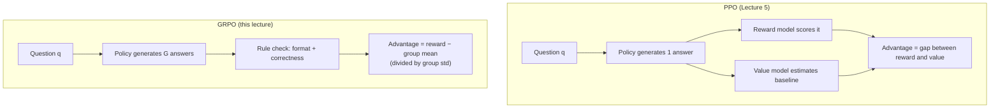
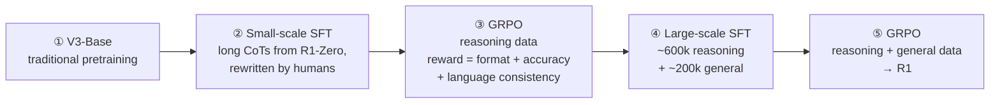

> 🌏 [中文版](/posts/ai/2026-09-29-cme295-llm-reasoning)

This post covers Lecture 6 of the 2025 edition of Stanford [CME295](/posts/ai/2026-09-29-stanford-cme295-transformers-llms-en), "LLM reasoning" (November 7, 2025). The main source is the [148-slide deck](https://cme295.stanford.edu/slides/fall25-cme295-lecture6.pdf); the recording is [here](https://www.youtube.com/watch?v=k5Fh-UgTuCo). Everything below comes from the slides; where the slides don't say something, I cite the source paper instead.

The slides draw the boundary of "reasoning" with two questions. "What is the course code of Stanford's Transformers & LLMs class?" is not reasoning: you either remember it or you don't. "The bear was born in 2020. How old is this bear now?" is, because you have to work out what year it is and then subtract. The slides' tentative definition is one line: reasoning = ability to solve a problem.

The previous lecture ([Lecture 5: preference tuning](/posts/ai/2026-09-29-cme295-preference-tuning-en)) used [PPO](https://arxiv.org/abs/1707.06347) to make models say what people want to hear. This one asks whether the same RL toolkit can teach a model to think before it answers.

## Course video sources

The videos below are the recordings linked for the topics covered in this article.

```youtube
url: https://www.youtube.com/watch?v=k5Fh-UgTuCo
title: 2025 Lecture 6 recording
```

Original videos: [2025 Lecture 6 recording](https://www.youtube.com/watch?v=k5Fh-UgTuCo)

Course and recording entries:

- [Official course / lecture source](https://cme295.stanford.edu/syllabus/2025/)

## Step 1: write the reasoning, then the answer

The core idea comes from [Chain-of-Thought](https://arxiv.org/abs/2201.11903) (Wei et al., 2022): show "explain first, then answer" in the prompt's examples, and the model follows suit. The slides ask how old the bear will be next year. With a bare-answer example the model gets it wrong; with a worked example it writes "one year older than this year, which was 4, so 5."

Reasoning models take CoT to a much larger scale. The slides put the two modes side by side:

- **Until now**: question → LLM → answer
- **New paradigm**: question → LLM → reasoning chain → answer, where output = reasoning + answer

A timeline shows the trend, listing each lab's first public reasoning model:

| Date | Model |
|---|---|
| 2024-09-12 | OpenAI o1-preview |
| 2024-12-19 | Gemini 2.0 Flash Thinking |
| 2025-01-20 | DeepSeek R1 |
| 2025-02-19 | Grok 3 Beta |
| 2025-02-24 | Claude 3.7 Sonnet |
| 2025-06-10 | Magistral |

How do you spot a reasoning model? The slides show a ChatGPT 5 Thinking conversation: what you see is a "thought summary," and the full chain of thought is usually hidden. They also show the OpenAI pricing page and Anthropic and Google developer docs (captured November 4, 2025), which all say the same thing: reasoning tokens are invisible but billed as output tokens. Anthropic's wording is the bluntest: you pay for the full thinking tokens, not the summary, so the billed output count won't match what you see.

## Step 2: measure on problems a machine can grade

Reasoning benchmarks share one trait: the answer can be checked automatically.

| Type | How it's verified | Benchmarks on the slides |
|---|---|---|
| Coding | Run test cases; correct only if all pass | HumanEval, CodeForces, SWE-bench |
| Math | Compare the final answer with the ground truth | AIME, GSM8K |

The metrics differ from ordinary benchmarks too. The slides list three:

- **pass@k**: the probability that at least one of k attempts succeeds, from the Codex paper [Evaluating Large Language Models Trained on Code](https://arxiv.org/abs/2107.03374). Use it when checking is cheap and you can afford latency, e.g. run the tests and keep whichever version passes
- **pass@1**: a single generation, for when the user gets exactly one answer
- **cons@k**: "consensus at k," majority vote over k answers compared with the ground truth, used in the [DeepSeek-R1 paper](https://arxiv.org/abs/2501.12948)

<details>
<summary>Formula: the unbiased pass@k estimator</summary>

```
Draw n samples per problem (n ≥ k), c of them correct:

pass@k = E_problems [ 1 − C(n−c, k) / C(n, k) ]

C(n−c, k) / C(n, k) = probability that k samples drawn from n are all wrong
```

Drawing exactly k samples and checking "any correct?" has high variance, so Chen et al. draw n and estimate with binomial coefficients. For k = 1 this reduces to c / n.

</details>

## Step 3: learn reasoning with RL, because answers can be verified

The goal is to get the model to reason before answering, what the slides call "test-time scaling": spend more compute at inference to get a better answer. The slides give three reasons to reach for RL instead of SFT:

1. Reasoning chains are hard to write from scratch; hand-made SFT data is impractical
2. We don't want to cap the model at human-written reasoning
3. There's a natural verifiable reward: "did it solve the problem?" is yes or no

The reward has just two terms, both rule-based:

- **Format reward**: is the reasoning wrapped in `<think>` `</think>`?
- **Accuracy reward**: does the code pass every test, does the math answer match?

The slides include DeepSeek-R1-Zero's AIME accuracy curve during training. Per the [DeepSeek-R1 paper](https://arxiv.org/abs/2501.12948), pass@1 rose from 15.6% to 71.0%, and 86.7% with majority voting. The paper also reports an "aha moment": an intermediate checkpoint stops to write "Wait" and re-examines its initial approach. That slide isn't in the deck, but the 2025 final asks about it.

### Controlling how long the model thinks

The slides flag a problem: not all prompts are equal. Overthinking an easy question wastes tokens; underthinking a hard one gets it wrong. Four directions:

- **Dynamic budget**: adjust the thinking budget per prompt (no paper cited on the slide)
- **Context awareness**: tell the model its token budget; see [Token-Budget-Aware LLM Reasoning](https://arxiv.org/abs/2412.18547)
- **Budget forcing**: the [s1](https://arxiv.org/abs/2501.19393) approach, forcibly ending the thinking or appending "Wait" when the model tries to stop so it keeps going
- **"Continuous" thoughts**: reason in hidden-state space instead of text tokens; see [Coconut](https://arxiv.org/abs/2412.06769)

## Step 4: GRPO uses the group's average as the baseline

The most common RL algorithm for reasoning is GRPO (Group Relative Policy Optimization), from [DeepSeekMath](https://arxiv.org/abs/2402.03300). The slides write its objective in two blocks:

```
L(θ) = maximize advantages  +  don't deviate too much from the old / base model
```

That's the same shape as Lecture 5's PPO. The difference is how the advantage is computed. The advantage is "how much better this answer is than usual," and PPO trains a separate value model to estimate "usual." GRPO is blunter: sample a group of G answers to the same question, and each answer's advantage is its reward minus the group average. The slide annotates this with "Big difference compared to PPO!"

Intuitively, if the whole group is right or the whole group is wrong, every advantage is 0 and the model learns nothing from that question. When the group is mixed, the correct answers get pushed up and the wrong ones pushed down. "Usual" is read straight off the other answers to the same question, so there's no second network as large as the policy to maintain.



The slides compare the two objectives:

- **Same**: both use the new/old policy probability ratio, both clip it
- **Different**: where the KL penalty goes, and how the advantage is estimated

<details>
<summary>Formula: GRPO and PPO objectives (from DeepSeekMath)</summary>

```
GRPO:
J(θ) = E[ q ~ P(Q), {o_i}_{i=1..G} ~ π_old(O|q) ]
       (1/G) Σ_i (1/|o_i|) Σ_t {
           min( r_{i,t} · Â_{i,t},  clip(r_{i,t}, 1−ε, 1+ε) · Â_{i,t} )
         − β · D_KL[ π_θ || π_ref ]
       }

r_{i,t} = π_θ(o_{i,t} | q, o_{i,<t}) / π_old(o_{i,t} | q, o_{i,<t})

Â_{i,t} = ( R(q, o_i) − mean(R(q,o_1..o_G)) ) / std(R(q,o_1..o_G))

PPO:
J(θ) = E[ q ~ P(Q), o ~ π_old(O|q) ]
       (1/|o|) Σ_t min( r_t · A_t,  clip(r_t, 1−ε, 1+ε) · A_t )
```

- GRPO puts the KL term directly in the loss; PPO usually folds a KL penalty into each token's reward
- PPO's A_t comes from a value model; GRPO's  comes from within-group comparison, and every token of an answer shares the same value
- The full derivation from policy gradient to GRPO is left for this series' guide to the 2026 Lecture 4, "[RL with LLMs](/posts/ai/2026-09-29-cme295-rl-with-llms-en)"

</details>

## Step 5: why outputs keep getting longer

Under GRPO training, response length keeps growing. The slides trace the cause to the `1/|o_i|` in the objective: each answer's loss is divided by its own length before averaging.

That backfires when the advantage is negative (a wrong answer). A short wrong answer spreads its penalty over few tokens, so each token gets hit hard. A long wrong answer dilutes the penalty, so each token barely feels it. The model learns that if it's going to be wrong, being wrong at length hurts less. The slide labels this cell "Bad incentive!"

The fix is to equalize each token's contribution. The slides list two approaches:

- [DAPO](https://arxiv.org/abs/2503.14476) (Yu et al., 2025)
- [Dr. GRPO](https://arxiv.org/abs/2503.20783) (Liu et al., 2025)

Two more adjustments get a mention. One is a **difficulty bias**: dividing the advantage by the group's standard deviation upweights questions that are too easy or too hard (low std), discussed in the Dr. GRPO paper. The other is **encouraging diversity**, citing DAPO.

## Step 6: the full DeepSeek-R1 recipe

The lecture closes by assembling every piece with DeepSeek's models. The starting point is the base model from [DeepSeek-V3](https://arxiv.org/abs/2412.19437) (V3-Base: MoE, about 671B total parameters, about 37B active per token).

**R1-Zero is the proof of concept**: take V3-Base, skip SFT entirely, and run GRPO on reasoning data. The prompt template asks for reasoning inside `<think>` and the answer inside `<answer>`. The upside is reasoning ability without any SFT; the downside is reasoning chains with formatting and readability problems.

**R1 is the full pipeline**, five steps:



- Step 2 is what the final exam calls the **cold start**: a small amount of high-quality reasoning data stabilizes the format so RL doesn't learn unreadable chains
- Step 4's ~600k reasoning samples come from "R1 so far," filtered by rejection sampling using rules plus V3 as a judge; the ~200k general samples mostly reuse V3's SFT data
- In step 5, reasoning data keeps the format + accuracy reward; general data mostly reuses V3's RL data with a helpfulness + harmlessness reward

The slides include the R1 paper's results table alongside Claude-3.5-Sonnet-1022, GPT-4o-0513, OpenAI o1-mini, and o1-1217.

### Distillation: hand the reasoning traces to a small model

The distillation in [Lecture 2](/posts/ai/2026-09-29-cme295-transformer-tricks-en) trains a small model to match a large model's next-token distribution. Here it's simpler: R1 generates full responses, and a smaller model does SFT directly on those reasoning traces, producing the R1-Distill family.

The last comparison is the one to remember. Same base, Qwen-32B: running R1-Zero-style RL on it gives 47.0 pass@1 on AIME 2024; SFT on R1's traces gives 72.6. The slide calls this a "good" use of compute. The big model explores its way to good reasoning with RL; the small model only has to imitate.

## Back to the models you use

The "thinking" mode you switch on in ChatGPT, Claude, or Gemini is this lecture's output: reasoning first, then the answer. What you see is usually a thought summary; the full chain stays server-side but is still billed as output tokens.

Two practical calls you can take away:

- **Pick the metric from the use case**: can your product verify answers automatically? If so (say, by running tests), sample several and keep one that passes, and track pass@k. If the user gets exactly one answer, track pass@1
- **Don't turn on long thinking for easy prompts**: "not all prompts are equal." Match the reasoning budget to difficulty; reasoning tokens are invisible but billed, so overthinking shows up directly on the invoice

The next lecture ([Lecture 7: agentic LLMs](/posts/ai/2026-09-29-cme295-agentic-llms-en)) takes on the vanilla LLM's other two weaknesses: static knowledge and no ability to act.

## What changed in 2026

Only Lecture 1's 2026 slides are out so far, so this compares against the topic lists on the [2026 syllabus](https://cme295.stanford.edu/syllabus/):

- **RL gets its own lecture**: 2026 Lecture 4, "Reinforcement learning with LLMs," runs through mathematical conventions, reward design, policy gradients, limitations, preference tuning with PPO (RLHF), reasoning with GRPO (RLVR), and on-policy distillation. The 2025 edition split PPO and GRPO across Lectures 5 and 6 with intuition only; 2026 appears to build up from policy gradients
- **Reasoning folds into the training lecture**: 2026 Lecture 3, "LLM training," lists Reasoning as one item, next to on-policy distillation and "distillation to smaller models." The R1-Distill material at the end of this lecture will likely land there in 2026
- **A new term, on-policy distillation**: absent in 2025, it appears in both 2026 Lectures 3 and 4. Going by the name, the student model gets teacher guidance on its own generated trajectories, rather than imitating trajectories the teacher generated as R1-Distill does; the details will have to wait for the 2026 slides

## Self-check

These are paraphrased from Part II, "LLM reasoning," of the [2025 final exam](https://cme295.stanford.edu/exams/fall25-cme295-final.pdf); answers are in the [solutions PDF](https://cme295.stanford.edu/exams/fall25-cme295-final-solutions.pdf):

1. What happened to DeepSeek R1-Zero's output length during RL training? (Q3)
2. What is the main difference between GRPO and PPO? (Q4)
3. Which of these is a "verifiable reward": a human politeness rating, whether code passes unit tests, perplexity on the pretraining corpus, or output token count? (Q5)
4. Why is a small "cold start" SFT often run before reasoning RL? (Q7)
5. In GRPO, how is the advantage computed for output i in a group of G? What computation does this save compared with standard PPO? (Q9)
6. Define test-time scaling, and name two methods from class for controlling or increasing the thinking budget at inference. (Q10)

## Go deeper

- The math of GRPO and why it isn't a free PPO: [CS336 Lecture 16: RLVR](/posts/ai/2026-08-22-cs336-rlvr-en)
- Another course's take on DeepSeek-R1: [CS224N Lecture 12: decoding, DeepSeek-R1, and reasoning training](/posts/ai/2026-08-22-cs224n-reasoning-one-en)
- The inference side of test-time scaling: [CS224N Lecture 13: speculative decoding and test-time scaling](/posts/ai/2026-08-22-cs224n-reasoning-two-en)
- RL foundations, policy gradient and actor-critic: [Berkeley CS285 L5–10](/posts/learning/2026-08-22-berkeley-cs285-policy-value-methods-en)
- PPO and DPO from the previous lecture: [CME295 Lecture 5](/posts/ai/2026-09-29-cme295-preference-tuning-en)

## Update Log

- 2026-10-10: Added course video sources and recording access notes.

## References

- [CME 295 2025 syllabus](https://cme295.stanford.edu/syllabus/2025/)
- [CME 295 2026 syllabus](https://cme295.stanford.edu/syllabus/)
- [2025 Lecture 6 slides (PDF)](https://cme295.stanford.edu/slides/fall25-cme295-lecture6.pdf)
- [2025 Lecture 6 recording](https://www.youtube.com/watch?v=k5Fh-UgTuCo)
- [2025 final exam](https://cme295.stanford.edu/exams/fall25-cme295-final.pdf) / [solutions](https://cme295.stanford.edu/exams/fall25-cme295-final-solutions.pdf)
- [Wei et al., Chain-of-Thought Prompting Elicits Reasoning in Large Language Models (2022)](https://arxiv.org/abs/2201.11903)
- [Chen et al., Evaluating Large Language Models Trained on Code (2021)](https://arxiv.org/abs/2107.03374)
- [DeepSeek-AI, DeepSeek-R1: Incentivizing Reasoning Capability in LLMs via Reinforcement Learning (2025)](https://arxiv.org/abs/2501.12948)
- [Shao et al., DeepSeekMath (2024)](https://arxiv.org/abs/2402.03300)
- [Schulman et al., Proximal Policy Optimization Algorithms (2017)](https://arxiv.org/abs/1707.06347)
- [Han et al., Token-Budget-Aware LLM Reasoning (2024)](https://arxiv.org/abs/2412.18547)
- [Muennighoff et al., s1: Simple test-time scaling (2025)](https://arxiv.org/abs/2501.19393)
- [Hao et al., Training Large Language Models to Reason in a Continuous Latent Space (2024)](https://arxiv.org/abs/2412.06769)
- [Yu et al., DAPO (2025)](https://arxiv.org/abs/2503.14476)
- [Liu et al., Understanding R1-Zero-Like Training: A Critical Perspective (2025)](https://arxiv.org/abs/2503.20783)
- [DeepSeek-AI, DeepSeek-V3 Technical Report (2024)](https://arxiv.org/abs/2412.19437)
- [Reading Stanford CME295 (series overview)](/posts/ai/2026-09-29-stanford-cme295-transformers-llms-en)
