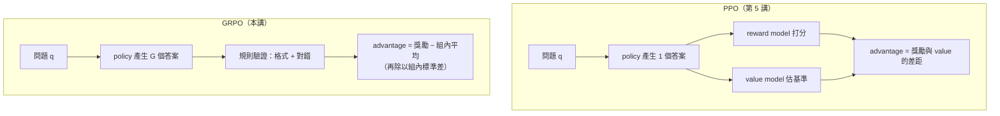
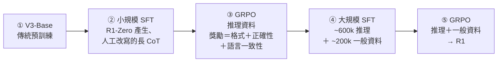

> 🌏 [English version](/posts/ai/2026-09-29-cme295-llm-reasoning-en)

**影片狀態：已附影片。** [影片來源與說明](#課程影片來源)

本篇對應 Stanford [CME295](/posts/ai/2026-09-29-stanford-cme295-transformers-llms) 2025 版第 6 講「LLM reasoning」（2025 年 11 月 7 日）。主要來源是 [148 頁投影片](https://cme295.stanford.edu/slides/fall25-cme295-lecture6.pdf)，錄影在[這裡](https://www.youtube.com/watch?v=k5Fh-UgTuCo)。本文只根據投影片寫，投影片沒寫的部分會標出來源論文。

投影片用兩個問題劃出「推理」的邊界。「Stanford 的 Transformer 與 LLM 課程代碼是什麼？」不算推理，記得就答得出來。「這隻熊 2020 年出生，今年幾歲？」才算，因為要先想到「現在是哪一年」，再做一次減法。投影片對推理的暫定定義只有一句：reasoning = ability to solve a problem。

前一講（[第 5 講：偏好對齊](/posts/ai/2026-09-29-cme295-preference-tuning)）用 [PPO](https://arxiv.org/abs/1707.06347) 讓模型說人想聽的話。這一講接著問：同一套 RL 工具，能不能讓模型學會「先想再答」？

## 課程影片來源

下列影片取自 Stanford Online 的 CME295 Autumn 2025 官方播放清單；2026-10-10 已即時對照播放清單的講次標題與影片 ID，兩者相符。

```youtube
url: https://www.youtube.com/watch?v=k5Fh-UgTuCo
title: Stanford CME295 Transformers & LLMs | Autumn 2025 | Lecture 6 - LLM Reasoning
```

原始影片：[Stanford CME295 Transformers & LLMs | Autumn 2025 | Lecture 6 - LLM Reasoning](https://www.youtube.com/watch?v=k5Fh-UgTuCo)

內容核對：已依字幕核對（2026-10-10）：抽樣讀取字幕的前／中／後段並以關鍵字搜尋，另對照頁面描述的章節表（非逐字比對）。確認影片是 Autumn 2025 第 6 講 LLM Reasoning（頁面日期 2025-11-07，長 1:47:10）；章節是 reasoning models、benchmarks、pass@k、用 RL 擴展、GRPO、GRPO 與 PPO 比較、length bias、DAPO／Dr. GRPO、DeepSeek R1 配方，與本文主題一致。本文只引投影片，沒有轉述課堂口述。

課程與錄影入口：

- [官方課程／講次來源](https://cme295.stanford.edu/syllabus/2025/)
- [CME295 Autumn 2025 播放清單（Stanford Online，9 支）](https://www.youtube.com/playlist?list=PLoROMvodv4rOCXd21gf0CF4xr35yINeOy)

查核日期：2026-10-10。

## 第一步：先寫推理，再寫答案

核心想法來自 [Chain-of-Thought](https://arxiv.org/abs/2201.11903)（Wei et al., 2022）：在 prompt 的範例裡示範「先解釋、再作答」，模型就會跟著先寫推理步驟。投影片的例子是問熊明年幾歲，直接給答案的範例會讓模型算錯，示範過推理的範例則讓模型寫出「比今年大一歲，今年 4 歲，所以是 5 歲」。

reasoning model 的想法是把 CoT 做到更大規模。投影片把兩種模式並排：

- **以前**：問題 → LLM → 答案
- **新做法**：問題 → LLM → 推理鏈 → 答案，輸出 = reasoning + answer

投影片用一條時間軸說明這波潮流，每家各列第一個公開的推理模型：

| 日期 | 模型 |
|---|---|
| 2024-09-12 | OpenAI o1-preview |
| 2024-12-19 | Gemini 2.0 Flash Thinking |
| 2025-01-20 | DeepSeek R1 |
| 2025-02-19 | Grok 3 Beta |
| 2025-02-24 | Claude 3.7 Sonnet |
| 2025-06-10 | Magistral |

怎麼看出一個模型是 reasoning model？投影片截了 ChatGPT 5 Thinking 的對話畫面：畫面上看到的是「thought summary」，完整的推理鏈通常藏起來。另外截了 OpenAI 定價頁與 Anthropic、Google 的開發者文件（2025 年 11 月 4 日），三家講的是同一件事：推理 token 雖然看不到，一樣按輸出 token 計費。Anthropic 的文件寫得最直白，計費的是完整的 thinking token，不是你看到的摘要，所以帳單上的輸出 token 數會跟畫面上的對不起來。

## 第二步：用「可以自動判對錯」的題目來量

推理類的評測題組有個共同點：答案能自動驗證。

| 類型 | 驗證方式 | 投影片舉的 benchmark |
|---|---|---|
| 程式 | 跑測試案例，全部通過才算對 | HumanEval、CodeForces、SWE-bench |
| 數學 | 最後答案跟標準答案比對 | AIME、GSM8K |

指標也跟一般 benchmark 不同。投影片列了三個：

- **pass@k**：試 k 次、至少一次成功的機率，來自 Codex 論文 [Evaluating Large Language Models Trained on Code](https://arxiv.org/abs/2107.03374)。適合「檢查很便宜、可以多等一下」的場景，例如寫程式時跑測試挑出能過的那一版
- **pass@1**：只看單次生成，適合只給使用者一個答案的場景
- **cons@k**：「consensus at k」，k 個答案多數決後再跟標準答案比，[DeepSeek-R1 論文](https://arxiv.org/abs/2501.12948)用過這個指標

<details>
<summary>公式：pass@k 的不偏估計</summary>

```
每題抽 n 個樣本（n ≥ k），其中 c 個正確：

pass@k = E_題目 [ 1 − C(n−c, k) / C(n, k) ]

C(n−c, k) / C(n, k) = 從 n 個裡抽 k 個、全部都錯的機率
```

直接抽 k 個算「有沒有對」的變異數很大，所以 Chen et al. 多抽 n 個再用組合數估計。k = 1 時化簡成 c / n。

</details>

## 第三步：推理靠 RL 學，因為答案可以驗證

目標是讓模型學會回答前先推理，也就是投影片說的「test-time scaling」：推論時多花算力，換更好的答案。投影片列了三個理由，說明為什麼選 RL 而不是 SFT：

1. 推理鏈很難從頭手寫，靠人工做 SFT 資料不切實際
2. 不想讓模型的推理方式被限制在人類寫得出來的範圍
3. 有天然的可驗證獎勵：「有沒有解出來」只有是或否

獎勵只有兩項，兩項都能用規則算：

- **格式獎勵**：推理有沒有放在 `<think>` `</think>` 之間
- **正確性獎勵**：程式有沒有通過所有測試、數學答案是否等於標準答案

投影片附了 DeepSeek-R1-Zero 訓練時的 AIME 準確率曲線。依 [DeepSeek-R1 論文](https://arxiv.org/abs/2501.12948)，pass@1 從 15.6% 升到 71.0%，多數決後達 86.7%。論文還記錄了一個「aha moment」：訓練中途的模型會自己停下來寫「Wait」，回頭重新檢查一開始的解法。投影片沒有這張，但 2025 期末考問了。

### 推論時怎麼控制「想多久」

投影片點出一個問題：not all prompts are equal。簡單的題目想太久浪費 token，難題想太短又會錯。列了四個方向：

- **dynamic budget**：依題目調整思考預算（投影片未附論文）
- **context awareness**：讓模型知道自己的 token 預算，見 [Token-Budget-Aware LLM Reasoning](https://arxiv.org/abs/2412.18547)
- **budget forcing**：[s1](https://arxiv.org/abs/2501.19393) 的做法，推論時強制結束思考，或在模型想停下時補上「Wait」逼它多想
- **「連續」思考**：推理不寫成文字 token，改在隱藏向量空間進行，見 [Coconut](https://arxiv.org/abs/2412.06769)

## 第四步：GRPO，用同組答案的平均分當基準

推理 RL 最常用的演算法是 GRPO（Group Relative Policy Optimization），出自 [DeepSeekMath](https://arxiv.org/abs/2402.03300)。投影片把它的目標寫成兩塊：

```
L(θ) = 最大化 advantage  +  不要離舊模型／基礎模型太遠
```

這個形狀跟第 5 講的 PPO 一樣。差別在 advantage 怎麼算。advantage 是「這個答案比平常水準好多少」，PPO 要另外訓練一個 value model 來估「平常水準」。GRPO 的做法很直接：同一題抽一組 G 個答案，每個答案的獎勵減掉整組平均，就是它的 advantage。投影片在這裡標了一句：「Big difference compared to PPO!」

直覺上，整組都答對或都答錯的題目，advantage 全是 0，模型學不到東西；有對有錯的題目，答對的那幾個被往上推，答錯的被往下壓。「平常水準」直接從同一題的其他答案看出來，不用再養一個跟 policy 一樣大的網路。



投影片對照了兩者的目標函數：

- **相同**：都用新舊 policy 的機率比值（ratio），都做 clipping
- **不同**：KL penalty 的位置，以及 advantage 的估法

<details>
<summary>公式：GRPO 與 PPO 的目標函數（出自 DeepSeekMath）</summary>

```
GRPO：
J(θ) = E[ q ~ P(Q), {o_i}_{i=1..G} ~ π_old(O|q) ]
       (1/G) Σ_i (1/|o_i|) Σ_t {
           min( r_{i,t} · Â_{i,t},  clip(r_{i,t}, 1−ε, 1+ε) · Â_{i,t} )
         − β · D_KL[ π_θ || π_ref ]
       }

r_{i,t} = π_θ(o_{i,t} | q, o_{i,<t}) / π_old(o_{i,t} | q, o_{i,<t})

Â_{i,t} = ( R(q, o_i) − mean(R(q,o_1..o_G)) ) / std(R(q,o_1..o_G))

PPO：
J(θ) = E[ q ~ P(Q), o ~ π_old(O|q) ]
       (1/|o|) Σ_t min( r_t · A_t,  clip(r_t, 1−ε, 1+ε) · A_t )
```

- GRPO 把 KL 直接放進 loss；PPO 通常把 KL 懲罰算進每個 token 的獎勵
- PPO 的 A_t 由 value model 估計；GRPO 的 Â 來自組內比較，同一個答案的每個 token 共用同一個值
- policy gradient 從頭推到 GRPO 的完整數學，留給本系列 2026 版第 4 講「[RL with LLMs](/posts/ai/2026-09-29-cme295-rl-with-llms)」的導讀

</details>

## 第五步：輸出為什麼越訓越長

用 GRPO 訓練時，回答長度會一路變長。投影片把原因指向目標函數裡的 `1/|o_i|`：每個答案的 loss 先除以自己的長度再平均。

這在 advantage 小於 0（答錯）時會出問題。短的錯答案，每個 token 分到的懲罰大；長的錯答案，懲罰被攤薄，每個 token 只挨一點。模型因此學到：反正要錯，寫長一點比較不痛。投影片把這格標成「Bad incentive!」。

修正方向是讓每個 token 的貢獻一樣大，投影片列了兩個做法：

- [DAPO](https://arxiv.org/abs/2503.14476)（Yu et al., 2025）
- [Dr. GRPO](https://arxiv.org/abs/2503.20783)（Liu et al., 2025）

投影片也提到另外兩個調整。一個是**難度偏差**：advantage 除以組內標準差，會讓太簡單或太難（標準差小）的題目權重被放大，Dr. GRPO 論文討論了這點。另一個是**鼓勵多樣性**，引 DAPO。

## 第六步：DeepSeek-R1 的完整配方

投影片最後用 DeepSeek 的模型把全部零件串起來。起點是 [DeepSeek-V3](https://arxiv.org/abs/2412.19437) 的 base model（V3-Base，MoE 架構，總參數約 671B、每個 token 啟用約 37B）。

**R1-Zero 是概念驗證**：V3-Base 不做任何 SFT，直接用 GRPO 跑推理資料。prompt 模板要求模型把推理放在 `<think>` 裡、答案放在 `<answer>` 裡。好處是不靠 SFT 也長出推理能力；缺點是推理鏈的格式和可讀性都有問題。

**R1 是完整流程**，一共五步：



- 第 2 步就是期末考說的 **cold start**：先用少量高品質推理資料穩住格式，RL 才不會學出難讀的推理鏈
- 第 4 步的 ~600k 推理樣本來自「目前為止的 R1」，用規則和 V3 當評審做 rejection sampling；~200k 一般資料大多沿用 V3 的 SFT 資料
- 第 5 步推理資料的獎勵仍是格式＋正確性；一般資料大多沿用 V3 的 RL 資料，獎勵改成 helpfulness＋harmlessness

投影片附了 R1 論文的成績表，跟 Claude-3.5-Sonnet-1022、GPT-4o-0513、OpenAI o1-mini 和 o1-1217 並列。

### 蒸餾：把推理軌跡交給小模型

[第 2 講](/posts/ai/2026-09-29-cme295-transformer-tricks)的蒸餾是讓小模型去對齊大模型「下一個 token 的機率分布」。這裡的蒸餾更簡單：讓 R1 生成完整回答，小模型直接拿這些推理軌跡做 SFT，得到 R1-Distill 系列。

投影片最後一頁的比較最值得記：同樣是 Qwen-32B，直接跑 R1-Zero 式的 RL，AIME 2024 pass@1 是 47.0；拿 R1 的軌跡做 SFT，是 72.6。投影片的結論是：這是對算力「好」的用法。大模型用 RL 探索出推理方式，小模型只要模仿就好。

## 連回你用的模型

你在 ChatGPT、Claude、Gemini 裡打開的「思考」模式，就是這一講的產物：輸出先是一段推理，再是答案。你看到的通常只是 thought summary，完整推理鏈留在後端，但照樣按輸出 token 計費。

兩個實務判斷可以直接帶走：

- **選指標前先想場景**：你的產品能自動驗證答案嗎？能的話（例如跑測試），多抽幾次挑能過的，看 pass@k；只能給使用者一個答案，就看 pass@1
- **簡單題不要開長思考**：投影片說「not all prompts are equal」，推理預算應該跟題目難度走；推理 token 看不到卻照樣計費，想太久的成本會直接反映在帳單上

下一講（[第 7 講：Agentic LLM](/posts/ai/2026-09-29-cme295-agentic-llms)）處理 vanilla LLM 的另外兩個弱點：知識是靜態的、不能執行動作。

## 2026 版改了什麼

2026 版目前只上架第 1、2 講的投影片與錄影（2026-10-10 查看；第 3 講投影片已上、錄影未上），以下只能對照 [2026 課表](https://cme295.stanford.edu/syllabus/)的主題清單：

- **RL 獨立成一整講**：2026 第 4 講「Reinforcement learning with LLMs」依序是數學記號、reward design、policy gradient、限制、用 PPO 做偏好對齊（RLHF）、用 GRPO 做推理（RLVR）、on-policy distillation。2025 版把 PPO 和 GRPO 拆在第 5、6 兩講，各自只給直覺；2026 版看起來會從 policy gradient 一路推上來
- **推理併進訓練講**：2026 第 3 講「LLM training」把 Reasoning 列成其中一項，旁邊是 on-policy distillation 和「distillation to smaller models」。本講最後那段 R1-Distill，在 2026 版應該會落在這一講
- **新名詞 on-policy distillation**：2025 版沒有，2026 版在第 3、4 講都出現。從名稱看，是讓學生模型在自己生成的軌跡上接受老師指導，跟 R1-Distill「直接模仿老師生成的軌跡」不同；細節要等 2026 投影片

## 自我檢測

以下題目改寫自 [2025 期末考](https://cme295.stanford.edu/exams/fall25-cme295-final.pdf)第 II 大題「LLM reasoning」，答案在[解答 PDF](https://cme295.stanford.edu/exams/fall25-cme295-final-solutions.pdf)：

1. DeepSeek R1-Zero 在 RL 訓練過程中，輸出長度出現了什麼變化？（第 3 題）
2. GRPO 跟 PPO 最主要的差別是什麼？（第 4 題）
3. 下列哪一種算「可驗證獎勵」：禮貌程度的人工評分、程式是否通過單元測試、預訓練語料的 perplexity、輸出的 token 數？（第 5 題）
4. 為什麼推理 RL 之前常先做一小段「cold start」SFT？（第 7 題）
5. 在 GRPO 裡，一組 G 個輸出中的第 i 個，advantage 怎麼算？跟標準 PPO 比，這樣做省下了什麼計算？（第 9 題）
6. 什麼是 test-time scaling？舉出兩種課堂上提過、用來控制或增加推論時思考預算的方法。（第 10 題）

## 想深入

- GRPO 的數學與它不是「免費 PPO」的原因：[CS336 Lecture 16：RLVR](/posts/ai/2026-08-22-cs336-rlvr)
- 另一門課怎麼講 DeepSeek-R1：[CS224N 第 12 講：Decoding、DeepSeek-R1 與推理訓練](/posts/ai/2026-08-22-cs224n-reasoning-one)
- test-time scaling 的推論端：[CS224N 第 13 講：Speculative Decoding 與 Test-Time Scaling](/posts/ai/2026-08-22-cs224n-reasoning-two)
- policy gradient、actor-critic 的 RL 基礎：[Berkeley CS285 L5–10](/posts/learning/2026-08-22-berkeley-cs285-policy-value-methods)
- 前一講的 PPO 與 DPO：[CME295 第 5 講](/posts/ai/2026-09-29-cme295-preference-tuning)

## 更新紀錄

- 2026-10-10：標註影片狀態，核對錄影來源與取得方式。
- 2026-10-10：重查影片狀態。即時對照 Stanford Online 的 CME295 Autumn 2025 播放清單，講次與影片 ID 相符，狀態改為已附影片。
- 2026-10-10：修正過時的上架說法，2026 版已上架第 1、2 講。
- 2026-10-10：依字幕核對影片內容。影片是 2025 第 6 講，主題與日期皆與本文相符，沒有需修正之處。

## 參考資料

- [CME 295 2025 版課表](https://cme295.stanford.edu/syllabus/2025/)
- [CME 295 2026 版課表](https://cme295.stanford.edu/syllabus/)
- [2025 版第 6 講投影片（PDF）](https://cme295.stanford.edu/slides/fall25-cme295-lecture6.pdf)
- [2025 版第 6 講錄影](https://www.youtube.com/watch?v=k5Fh-UgTuCo)
- [2025 期末考](https://cme295.stanford.edu/exams/fall25-cme295-final.pdf)／[解答](https://cme295.stanford.edu/exams/fall25-cme295-final-solutions.pdf)
- [Wei et al., Chain-of-Thought Prompting Elicits Reasoning in Large Language Models (2022)](https://arxiv.org/abs/2201.11903)
- [Chen et al., Evaluating Large Language Models Trained on Code (2021)](https://arxiv.org/abs/2107.03374)
- [DeepSeek-AI, DeepSeek-R1: Incentivizing Reasoning Capability in LLMs via Reinforcement Learning (2025)](https://arxiv.org/abs/2501.12948)
- [Shao et al., DeepSeekMath (2024)](https://arxiv.org/abs/2402.03300)
- [Schulman et al., Proximal Policy Optimization Algorithms (2017)](https://arxiv.org/abs/1707.06347)
- [Han et al., Token-Budget-Aware LLM Reasoning (2024)](https://arxiv.org/abs/2412.18547)
- [Muennighoff et al., s1: Simple test-time scaling (2025)](https://arxiv.org/abs/2501.19393)
- [Hao et al., Training Large Language Models to Reason in a Continuous Latent Space (2024)](https://arxiv.org/abs/2412.06769)
- [Yu et al., DAPO (2025)](https://arxiv.org/abs/2503.14476)
- [Liu et al., Understanding R1-Zero-Like Training: A Critical Perspective (2025)](https://arxiv.org/abs/2503.20783)
- [DeepSeek-AI, DeepSeek-V3 Technical Report (2024)](https://arxiv.org/abs/2412.19437)
- [Stanford CME295 導讀（本系列總覽）](/posts/ai/2026-09-29-stanford-cme295-transformers-llms)
