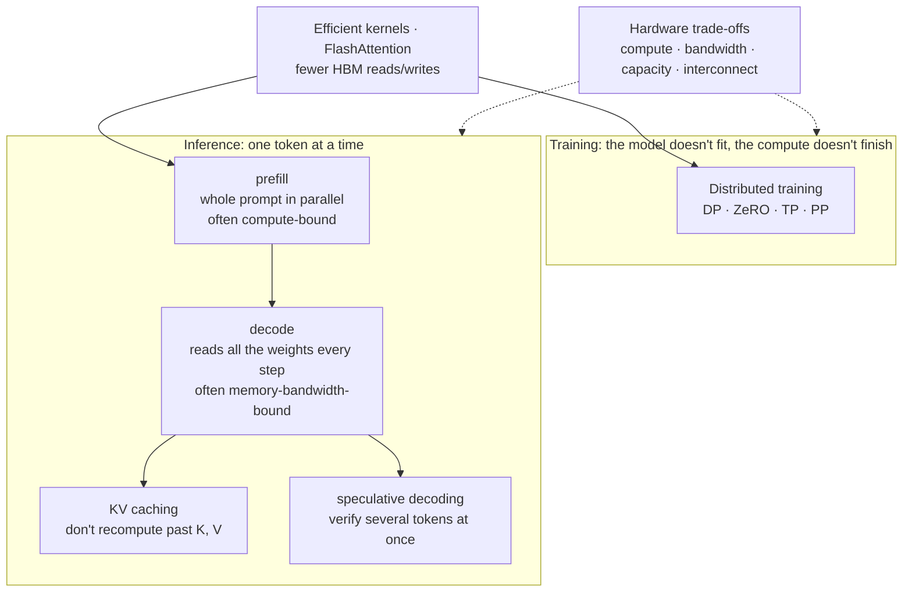

> 🌏 [中文版](/posts/ai/2026-09-29-cme295-llm-systems)

**Video status: Related supplementary video included; the original lecture recording has not been verified.** [Source details](#course-video-sources)

> **Pre-lecture edition**: This post was written on September 29, 2026, before Lecture 5 of the 2026 edition (October 30, 2026) has taken place. It is based on the topic list in the 2026 syllabus, the parts already covered in the 2025 slides, and the original papers. It will be revised against the video and slides once they are posted.

This post covers Lecture 5, "LLM systems," of the 2026 edition of Stanford's [CME295](/posts/ai/2026-09-29-stanford-cme295-transformers-llms-en). The lecture did not exist in 2025. Its material was spread across the last ~40 slides of the 2025 [Lecture 3 deck](https://cme295.stanford.edu/slides/fall25-cme295-lecture3.pdf) (inference speedups) and ~50 slides in the middle of the [Lecture 4 deck](https://cme295.stanford.edu/slides/fall25-cme295-lecture4.pdf) (training optimizations). Our guides to [Lecture 3](/posts/ai/2026-09-29-cme295-large-language-models-en) and [Lecture 4](/posts/ai/2026-09-29-cme295-llm-training-en) each drew a map of these topics and deferred the details to this post.

If you have used any LLM chat interface, you know the pattern: you send a question, wait a moment for the first word, and then words stream out at a steady pace. Those two waits are different kinds of work with different bottlenecks. The topic list for this lecture looks scattered, running from multi-GPU training to hardware choices, but most of it reduces to one idea: **moving data around a GPU often costs more than the computation itself**.

## Course video sources

This article is a pre-written guide to CME295 2026 Lecture 5 (LLM systems, October 30). The official 2026 syllabus, read on 2026-10-10, still marks that lecture "Coming soon", so the original lecture recording is not yet available. The two videos below are the public 2025 Lecture 3 and Lecture 4 recordings, included only as background; they are not the 2026 Lecture 5 recording.

```youtube
url: https://www.youtube.com/watch?v=Q5baLehv5So
title: Stanford CME295 Transformers & LLMs | Autumn 2025 | Lecture 3 - Tranformers & Large Language Models
```

```youtube
url: https://www.youtube.com/watch?v=VlA_jt_3Qc4
title: Stanford CME295 Transformers & LLMs | Autumn 2025 | Lecture 4 - LLM Training
```

Original videos: [Stanford CME295 Transformers & LLMs | Autumn 2025 | Lecture 3 - Tranformers & Large Language Models](https://www.youtube.com/watch?v=Q5baLehv5So), [Stanford CME295 Transformers & LLMs | Autumn 2025 | Lecture 4 - LLM Training](https://www.youtube.com/watch?v=VlA_jt_3Qc4)

Course and recording entries:

- [Official course / lecture source](https://cme295.stanford.edu/syllabus/2025/)
- [CME295 Autumn 2025 playlist (Stanford Online, 9 videos)](https://www.youtube.com/playlist?list=PLoROMvodv4rOCXd21gf0CF4xr35yINeOy)

Checked: 2026-10-10.

## Where this lecture sits in the 2026 syllabus

The [2026 syllabus](https://cme295.stanford.edu/syllabus/) schedules Lecture 5 for October 30, right after the October 23 midterm and before Lecture 6 on AI Agents. It lists exactly seven topics:

1. Distributed training
2. Inference optimizations
3. KV caching
4. Speculative decoding
5. Efficient kernels
6. Flash Attention
7. Hardware trade-offs

Two clarifications up front. First, quantization and mixed precision were covered in the 2025 Lecture 4, but the 2026 syllabus does not list them under Lecture 5, so this post does not treat them as part of it. Second, MHA/MQA/GQA are listed under Lecture 2 in 2026, so here they only appear as a way to shrink the KV cache.

The sections below follow the syllabus order. Each one says which content comes from the 2025 slides and which comes from papers or other courses.



## First, one ledger: compute fast, or move data fast

This section is the key to everything that follows. The 2025 slides don't frame it this way; it's the framework used in [CS336 Lecture 2](/posts/ai/2026-08-22-cs336-resource-accounting-en) and [CS336 Lecture 10](/posts/ai/2026-08-22-cs336-inference-en), which I borrow to tie the lecture together.

A GPU has two key specs: how many operations it can do per second, and how much data it can move from memory per second. According to [NVIDIA's H100 spec page](https://www.nvidia.com/en-us/data-center/h100/) (checked 2026-09-29), the H100 SXM lists 1,979 TFLOPS of BF16 compute. That figure is footnoted "with sparsity"; dense matrices get roughly half, about 989 TFLOPS. Memory bandwidth is 3.35 TB/s. Divide one by the other and you get about **295**: the GPU has to do around 295 operations for every byte it moves before compute becomes the limit.

That ratio is a threshold on **arithmetic intensity**. Work below it leaves the GPU waiting for data with its compute idle; only work above it is truly compute-bound.

<details>
<summary>Math: why the GPU mostly waits during token-by-token generation</summary>

```
H100 threshold ≈ 989e12 FLOP/s ÷ 3.35e12 byte/s ≈ 295 FLOP/byte

Decoding one token (batch = 1, BF16 weights):
  each parameter: read 2 bytes, do 1 multiply + 1 add = 2 FLOP
  arithmetic intensity ≈ 2 FLOP / 2 byte = 1 FLOP/byte

With batch = B, one read of the weights is shared by B requests:
  arithmetic intensity ≈ B FLOP/byte
```

This is a rough estimate that counts weights only and ignores KV cache reads; it is not a number from the slides. The conclusion: when a single user is generating token by token, arithmetic intensity is far below 295, and memory bandwidth is the bottleneck.

</details>

Keep this ledger in mind. Every topic below answers one of three questions: does the data fit? Can it be moved fast enough? Can we do more work per move?

## Distributed training: how to split when one GPU isn't enough

**2025 source**: Lecture 4 slides, pp. 32–44.

The [Lecture 4 guide](/posts/ai/2026-09-29-cme295-llm-training-en) already listed what a training step has to store: parameters, activations, gradients, and Adam's two optimizer states. The [ZeRO paper](https://arxiv.org/abs/1910.02054) turns that into numbers: with mixed-precision Adam, each parameter needs 16 bytes. That's 2 for FP16 parameters, 2 for gradients, and 12 for the FP32 parameter copy plus two moment estimates. The paper's example is a 7.5B-parameter model, whose "model states" alone take about 120 GB before counting activations. That doesn't fit on an 80GB H100.

The 2025 slides split the solutions into two routes:

| Approach | What gets split | Slide highlights | Cost |
|---|---|---|---|
| Data parallelism (DP) | The data; every GPU holds the full model | Divide the batch across GPUs | Every GPU stores a full copy, the most memory-wasteful option |
| DP + ZeRO | The redundant copies | ZeRO-1 shards optimizer state; ZeRO-2 adds gradients; ZeRO-3 adds parameters | The more you shard, the more data moves between GPUs |
| Model parallelism | The computation itself | Slides list five kinds: TP, PP, SP, CP, EP | Every layer or stage must talk to other GPUs |

<details>
<summary>Math: how much each GPU stores under ZeRO</summary>

ZeRO paper notation: Ψ is the parameter count, N_d the data-parallel degree, and K = 12 the optimizer-state multiplier for mixed-precision Adam.

```
Plain data parallelism:       2Ψ + 2Ψ + 12Ψ        = 16Ψ bytes
ZeRO-1 (shard optimizer):     2Ψ + 2Ψ + 12Ψ / N_d
ZeRO-2 (+ shard gradients):   2Ψ + 14Ψ / N_d
ZeRO-3 (+ shard parameters):  16Ψ / N_d
```

Plugging in the paper's example (Ψ = 7.5B, N_d = 64): plain data parallelism needs 120 GB per GPU; ZeRO-3 brings it down to about 1.9 GB. I computed these from the paper's formulas; the paper's Figure 1 uses the same parameters.

</details>

PyTorch's built-in [FSDP](https://arxiv.org/abs/2304.11277) (Fully Sharded Data Parallel) takes the same fully sharded route as ZeRO-3. Its paper reports performance comparable to plain data parallelism while supporting much larger models.

For model parallelism, the slides give only the names and one suggested reading, Hugging Face's [Ultra-Scale Playbook](https://huggingface.co/spaces/nanotron/ultrascale-playbook). The two most common forms:

- **Tensor parallelism (TP)**: split the matrix multiplications inside a layer across GPUs, as in [Megatron-LM](https://arxiv.org/abs/1909.08053). Every layer exchanges results, so communication is very frequent.
- **Pipeline parallelism (PP)**: put different layers on different GPUs and let data flow through like an assembly line, as in [GPipe](https://arxiv.org/abs/1811.06965). Less communication, but at the start and end of the pipeline some GPUs sit idle waiting.

For how these are built from communication primitives like all-reduce and all-gather, see [CS336 Lecture 7](/posts/ai/2026-08-22-cs336-parallelism-mechanics-en); for how to combine them into 3D parallelism that respects network topology, see [CS336 Lecture 8](/posts/ai/2026-08-22-cs336-parallelism-strategies-en).

## Inference optimizations: prefill and decode are two different jobs

**2025 source**: Lecture 3 slides, pp. 86–89 and p. 124 (the classification framework). The slides don't use the terms prefill/decode; those come from the inference-systems literature.

Back to the opening experience. When you send a prompt, the model first reads the whole thing and computes keys and values at every position. This is **prefill**. All prompt tokens are known, so the work parallelizes, the matrices are large, arithmetic intensity is high, and the GPU's compute is well used. Most of your wait for the first word (TTFT, time to first token) is spent here.

Then comes **decode**: each step produces one token, and the next step can't start until it's done. Every step reads the entire set of weights from HBM to compute a single token. As the ledger showed, arithmetic intensity here is about 1, so the GPU spends most of its time waiting for data. How fast words stream out depends on this phase.

The 2025 slides split inference optimizations into two broad classes, and the final slide maps each technique back:

| Class | Subclass | Representative technique |
|---|---|---|
| "Exact" efficiency (output unchanged) | Avoid redundancies | KV cache |
| | Memory management | PagedAttention |
| | Reformulate the math | Speculative decoding |
| Approximations (may change output) | Architectural changes | GQA |
| | Embedding representations | Latent attention |
| | Token prediction | Multi-token prediction |

One cell deserves attention: the slides place speculative decoding in the "exact" class. It really doesn't change the output distribution, only the order of computation; more on that below.

Another technique the slides don't mention but nearly every inference engine uses is **continuous batching**. Decode's arithmetic intensity is proportional to batch size, so packing more requests together pays off. The catch is that requests have different lengths, and the traditional approach waits for a whole batch to finish before starting the next. [Orca](https://www.usenix.org/conference/osdi22/presentation/yu) (OSDI 2022) schedules at the granularity of a single step instead: as soon as one request finishes, a new one joins at the next step.

## KV caching: trading memory for recomputation

**2025 source**: Lecture 3 slides, pp. 91–115.

The slides walk through "a cute teddy bear is reading" one word at a time. To produce the 6th token, the model attends to the previous 5 and needs their keys and values; to produce the 7th, it needs them again. Those old K and V never change, so the slide's idea is "Keep keys and values in a cache": compute once, store, and read back afterward.

This is a classic memory-for-compute trade. The price is that the KV cache grows with the conversation, and every concurrent request has its own copy.

<details>
<summary>Math: how big the KV cache is</summary>

```
KV cache bytes = 2 × layers × KV heads × head dimension
                 × sequence length × batch × bytes per value
(the leading 2 = one copy each for K and V)
```

Using the 8B configuration from Table 3 of the [Llama 3 paper](https://arxiv.org/abs/2407.21783) (32 layers, 32 query heads, 8 KV heads, model dimension 4,096, so 128 dimensions per head) in BF16 (2 bytes):

```
Per token:   2 × 32 × 8 × 128 × 2 = 131,072 bytes = 128 KiB
8,192 tokens: 128 KiB × 8,192 = 1 GiB (single request)
```

Without GQA, with 32 KV heads to match the query heads, the same length would need 4 GiB. These are my calculations from the paper's configuration, not numbers from the slides.

</details>

A larger KV cache means fewer concurrent requests per GPU, smaller batches, and even lower decode arithmetic intensity. The 2025 slides list three ways to shrink or manage it:

- **Store fewer heads (GQA/MQA)**: several query heads share one set of K and V. [MQA](https://arxiv.org/abs/1911.02150) shares a single set across all heads; [GQA](https://arxiv.org/abs/2305.13245) shares within groups. Llama 3 pairs 32 query heads with 8 KV heads, cutting the KV cache to a quarter. The 2026 syllabus puts this in Lecture 2, which our [Lecture 2 guide](/posts/ai/2026-09-29-cme295-transformer-tricks-en) covers.
- **Store a compressed version (latent attention)**: [DeepSeek-V2](https://arxiv.org/abs/2405.04434)'s Multi-head Latent Attention stores a low-dimensional latent vector instead of full K and V, reconstructing them when needed. The paper reports that, compared with DeepSeek 67B, it reduces the KV cache by 93.3% and raises maximum generation throughput to 5.76 times.
- **Manage memory better (PagedAttention)**: the [vLLM paper](https://arxiv.org/abs/2309.06180) measured that existing systems, which reserve one contiguous chunk per request, use only 20.4% to 38.2% of KV cache memory for actual token states; the rest is lost to fragmentation and over-reservation. PagedAttention borrows paging from operating systems, splitting the KV cache into fixed-size blocks that need not be contiguous, which limits waste to at most one block per request. The paper reports 2–4× higher throughput than the systems of the time.

PagedAttention has a side benefit: requests that share a prefix (for example, the same system prompt) can share the same blocks. For vLLM's implementation, see our [vLLM deep dive](/posts/ai/2026-03-14-vllm-inference-engine-en).

## Speculative decoding: use the idle GPU to guess ahead

**2025 source**: Lecture 3 slides, pp. 116–122. The full acceptance rule is in the [Lecture 3 guide](/posts/ai/2026-09-29-cme295-large-language-models-en) and isn't repeated here.

During decode the GPU's compute is mostly idle, so can we make it do more per step? The observation in [Chen et al.](https://arxiv.org/abs/2302.01318) is that having the large model *verify* several tokens at once takes about as long as having it *generate* one. Both require reading the weights, and reading the weights is the dominant cost.

So the procedure is:

1. A small draft model quickly guesses the next k tokens
2. The large target model computes probabilities for all k positions in one parallel pass
3. The acceptance rule checks the guesses left to right, accepts up to the first rejection, and resamples one token at that position

The slides' example has the draft model continue "[BOS] my teddy bear" with "is cute and smart," which the target model verifies in one pass. The acceptance rule is designed so that, as [Leviathan et al.](https://arxiv.org/abs/2211.17192) and Chen et al. each prove, the final output distribution is identical to sampling from the large model alone. That's why the slides file it under "exact."

<details>
<summary>Math: how many tokens one round produces</summary>

Leviathan et al. assume each guess is accepted with a roughly constant probability α, with γ guesses per round:

```
Expected tokens per round = (1 − α^(γ+1)) / (1 − α)
```

For example, α = 0.8 and γ = 4 give (1 − 0.8⁵) / 0.2 ≈ 3.4 tokens for a single run of the large model. Higher α and a cheaper draft mean more speedup; with low α, extra guesses are wasted.

</details>

Reported speedups: 2–3× on T5-XXL in Leviathan et al., and 2–2.5× on the 70B-parameter Chinchilla in Chen et al.

The slides end with a variant, **multi-token prediction (MTP)**: instead of maintaining a separate draft model, train several prediction heads on the same model to predict multiple upcoming tokens, so draft and target are the same model. [Gloeckle et al.](https://arxiv.org/abs/2404.19737) report that models trained with 4-token prediction run up to 3× faster at inference. The same line of thinking includes [Medusa](https://arxiv.org/abs/2401.10774) (extra decoding heads) and [EAGLE](https://arxiv.org/abs/2401.15077) (prediction at the feature level); EAGLE reports a 2.7–3.5× latency speedup on LLaMA2-Chat 70B.

It isn't always worth it. [vLLM's speculative decoding docs](https://docs.vllm.ai/en/latest/features/speculative_decoding/) (checked 2026-09-29) state up front that it is meant to "reduce inter-token latency under medium-to-low QPS, memory-bound workloads." Under heavy traffic, batches are already large and the GPU is already busy computing, so the extra guesses compete for compute.

## Efficient kernels: fusing several steps into one

**2025 source**: none as a standalone section. The 2025 edition covered the same principle only within FlashAttention; this is a newly listed topic in 2026. What follows is based on [CS336 Lecture 5](/posts/ai/2026-08-22-cs336-gpu-tpu-en), [CS336 Lecture 6](/posts/ai/2026-08-22-cs336-kernels-triton-en), and official docs.

On a GPU, a **kernel** is a function launched for the GPU to execute. If you write `y = gelu(x @ W + b)` in PyTorch, the most direct execution is three kernels: the matmul writes its result to HBM, the add reads it back and writes again, and GeLU reads and writes once more. Of those three round trips, only the first read and the last write are actually necessary.

**Kernel fusion** merges those steps into one kernel so intermediate results stay in fast on-chip memory instead of going back to HBM. For low-intensity elementwise operations (adds, activations, normalization, softmax), this is usually the biggest source of speedup.

Writing fused kernels used to require CUDA C++. There are easier routes now:

- [Triton](https://triton-lang.org/main/index.html) lets you write GPU kernels in Python syntax; the second official tutorial is a [fused softmax](https://triton-lang.org/main/getting-started/tutorials/02-fused-softmax.html)
- PyTorch's `torch.compile` generates fused kernels automatically. In the [TorchInductor docs](https://docs.pytorch.org/docs/main/user_guide/torch_compiler/torch.compiler_inductor_profiling.html), generated kernels carry names like `triton_poi_fused_cat_155`, which says on its face that it's a fused Triton kernel

The most common trap in kernel work is optimizing before measuring. That is exactly the key point of CS336 Lecture 6: measure first, then use a profiler to find where the time actually goes.

## FlashAttention: kernel optimization applied to attention

**2025 source**: Lecture 4 slides, pp. 45–71. The [Lecture 4 guide](/posts/ai/2026-09-29-cme295-llm-training-en) already quoted the paper's numbers (more FLOPs, but HBM reads/writes drop from 40.3 GB to 4.4 GB and runtime from 41.7 ms to 7.3 ms). This section fills in the mechanism.

The slides draw the problem with standard attention step by step: load Q and K from HBM, compute the score matrix S, **write S to HBM**; read S back, compute the softmax P, **write P to HBM**; read P and V, compute the output O. S and P are both sequence-length × sequence-length matrices, so for long sequences these round trips dominate.

[FlashAttention](https://arxiv.org/abs/2205.14135) rests on two ideas, each given a slide:

1. **Tiling**: split Q, K, V into blocks, move one block at a time into SRAM, compute that block's output there, and write it back. S and P never touch HBM.
2. **Recompute in the backward pass**: normally S and P are stored for the backward pass. FlashAttention doesn't store them; it recomputes them with the same tiling. The slide puts it as "Sometimes, it is better to recompute instead of storing."

Tiling has a catch: softmax needs the row's maximum and sum before it can normalize, but you only see one block at a time. Slide 62 says "No need to compute the full S = QKᵀ before applying softmax" and shows the softmax of a full row as per-block softmaxes each multiplied by a coefficient α. The technique is often called online softmax: with each new block, update the running maximum and sum, and rescale what has been accumulated so far.

<details>
<summary>Math: accumulating softmax block by block</summary>

For one row of Q, process the j-th block of K and V in order. Keep three quantities: running max m, exponential sum ℓ, and unnormalized output O.

```
S_j   = Q · K_jᵀ                          # scores for this block
m_new = max(m, rowmax(S_j))
ℓ_new = e^(m − m_new) · ℓ + rowsum(e^(S_j − m_new))
O_new = e^(m − m_new) · O + e^(S_j − m_new) · V_j

After all blocks: output = O / ℓ
```

The factor `e^(m − m_new)` rescales the old accumulation to the new maximum. The result is identical to computing the whole row at once, not an approximation.

</details>

Two later versions push the same idea closer to the hardware:

| Version | What changed | Reported results |
|---|---|---|
| [FlashAttention-2](https://arxiv.org/abs/2307.08691) (2023) | Better work partitioning across thread blocks and warps; fewer non-matmul FLOPs | About 2× faster than v1; 50–73% of theoretical peak on A100 |
| [FlashAttention-3](https://arxiv.org/abs/2407.08608) (2024) | Uses H100 asynchrony to overlap data movement and compute; FP8 support | 1.5–2.0× faster than v2 on H100; up to 740 TFLOPS in FP16 (about 75% utilization) |

The FlashAttention-3 paper notes that v2 reached only 35% utilization on the H100. The same algorithm has to be rewritten for each hardware generation, which leads straight into the last topic.

## Hardware trade-offs: there is no free speedup

**2025 source**: Lecture 4 slides, pp. 36–37 (limited H100 memory) and pp. 72–77 (number formats and "lower precision → faster processing"). "Hardware trade-offs" as a topic is new in the 2026 syllabus; the summary below draws on the sections above and official specs.

Lay out every technique so far and each one trades one resource for another:

| Technique | Saves | Costs |
|---|---|---|
| KV cache | Recomputing past tokens | Memory, growing with conversation length |
| GQA / latent attention | KV cache memory | Architecture changes, retraining or uptraining, possible quality loss |
| Larger batches | Weight reads amortized over more requests; higher throughput | Longer wait per user |
| Speculative decoding | Decode latency | Compute and memory for a draft model; can slow down under heavy load |
| FlashAttention recomputation | HBM traffic and memory | Some extra FLOPs |
| ZeRO-3 / tensor parallelism | Per-GPU memory | GPU-to-GPU communication |

The last row ties directly to hardware specs. GPUs inside one machine connect over NVLink, listed at 900 GB/s on the H100 spec page; across machines or over PCIe Gen5 it's 128 GB/s. That's why the most communication-heavy form, tensor parallelism, usually stays within a single machine, while pipeline or data parallelism spans machines.

Choosing hardware means looking at more than one number:

- **Compute (FLOPS)**: how fast prefill and training run
- **Memory bandwidth**: how fast decode runs
- **Memory capacity**: whether the model and KV cache fit, and how many requests can be served at once
- **Interconnect bandwidth**: whether splitting across GPUs pays off

Slide 77 of the 2025 deck also says "Lower precision → Faster processing," the starting point for quantization and mixed precision. The 2026 syllabus doesn't list quantization; whether it shows up under "hardware trade-offs" won't be known until the slides are out.

## Connecting back to the models you use

- **Using an API**: a long prompt delays the first word; that's prefill. How fast words stream is decode. They are optimized differently, so when comparing inference services, look at time to first token and output tokens per second separately.
- **Self-hosting**: estimate the KV cache first. Plug your model's configuration, expected context length, and concurrency into the formula above, and you'll often find the KV cache, not the weights, is what limits you. vLLM manages it with PagedAttention; our [vLLM self-hosting decision](/posts/ai/2026-08-21-vllm-self-host-decision-en) works out how GPU utilization drives cost per million tokens.
- **Considering speculative decoding**: look at your traffic first. It works well at low traffic when single-user latency matters; at high traffic it may not help.
- **Training or fine-tuning**: if the model doesn't fit, try ZeRO/FSDP first, which needs no model code changes; move to tensor or pipeline parallelism only if it still doesn't fit.

## Where the 2025 edition covered this

The 2026 Lecture 5 slides have not been released. Here is how the seven 2026 syllabus topics map onto 2025 slide pages:

| 2026 syllabus topic | 2025 source | Status |
|---|---|---|
| Distributed training | Lecture 4 pp. 32–44 (memory bottleneck, DP, ZeRO-1/2/3, names of TP/PP/SP/CP/EP) | Covered in 2025; model parallelism named only |
| Inference optimizations | Lecture 3 pp. 86–89, p. 124 (exact vs. approximate framework) | Framework covered in 2025; prefill/decode and continuous batching not on the slides |
| KV caching | Lecture 3 pp. 91–101 (KV cache), pp. 102–106 (GQA), pp. 107–108 (PagedAttention), pp. 109–115 (latent attention) | Covered in 2025 |
| Speculative decoding | Lecture 3 pp. 116–122 (including acceptance rule and MTP) | Covered in 2025 |
| Efficient kernels | None | **New in 2026** |
| Flash Attention | Lecture 4 pp. 45–71 (HBM/SRAM, tiling, recomputation, results) | Covered in 2025 |
| Hardware trade-offs | Scattered mentions in Lecture 4 pp. 36–37, 72–77 | **New as a standalone topic in 2026** |

Conversely, the number formats and mixed-precision training on 2025 Lecture 4 pp. 72–81, and the quantization used by QLoRA, do not appear on the 2026 Lecture 5 list.

## Self-check

Questions 1, 2, 3, and 6 are adapted from Parts III and IV of the [2025 midterm](https://cme295.stanford.edu/exams/fall25-cme295-midterm.pdf); answers are in the [solutions PDF](https://cme295.stanford.edu/exams/fall25-cme295-midterm-solutions.pdf). The 2026 midterm is on October 23, before this lecture. Going by the 2025 split (midterm on Lectures 1–4, final on Lectures 5–8), this lecture would fall under the December 9 final; the course hasn't announced the scope.

1. What is the KV cache for at inference time, and what cost does it save? (Question III.5)
2. Compared with MHA, what is the main way MQA/GQA reduce latency? (Question III.6)
3. What problem is PagedAttention mainly trying to solve? (Question III.3)
4. (My own question) When the draft model in speculative decoding guesses wrong, why is the final output distribution still the same as using the target model alone? How does the speedup change as the draft's acceptance rate drops?
5. (My own question) What extra state does each of ZeRO-1, ZeRO-2, and ZeRO-3 shard? What do you pay for sharding more?
6. Explain the core idea of FlashAttention and give one concrete benefit observed in practice. (Question IV.10)
7. (My own question) Using this post's KV cache formula, compute the KV cache size for Llama 3 8B at 32K context with 4 concurrent requests in BF16. Then explain why decode's arithmetic intensity is roughly equal to the batch size, and what that implies for whether to enable speculative decoding.

## Going deeper

- Counting FLOPs, memory, and rooflines yourself: [CS336 Lecture 2](/posts/ai/2026-08-22-cs336-resource-accounting-en)
- GPU memory hierarchy and the principles behind FlashAttention: [CS336 Lecture 5](/posts/ai/2026-08-22-cs336-gpu-tpu-en)
- Writing Triton kernels: [CS336 Lecture 6](/posts/ai/2026-08-22-cs336-kernels-triton-en)
- Communication primitives and the three parallelisms: [CS336 Lecture 7](/posts/ai/2026-08-22-cs336-parallelism-mechanics-en), [CS336 Lecture 8](/posts/ai/2026-08-22-cs336-parallelism-strategies-en)
- The full inference ledger (prefill/decode, quantization, continuous batching): [CS336 Lecture 10](/posts/ai/2026-08-22-cs336-inference-en)
- Get a feel for TTFT and speculative decoding with sliders: [Learn Inference, an interactive inference-engineering site](/posts/ai/2026-09-29-learn-inference-interactive-guide-en)
- How PagedAttention became a product: [vLLM deep dive](/posts/ai/2026-03-14-vllm-inference-engine-en)
- The other new 2026 lectures in this batch: [RL with LLMs](/posts/ai/2026-09-29-cme295-rl-with-llms-en), [AI Agents](/posts/ai/2026-09-29-cme295-ai-agents-en), [Diffusion LLMs](/posts/ai/2026-09-29-cme295-diffusion-llms-en)

## Update plan

Once the slides and video go up on October 30, this post will be revised against the following:

- What each of the seven topics actually covered, and how it differs from this reconstruction from 2025 slides and papers
- Whether "efficient kernels" means kernel fusion and Triton, or something else
- Whether "hardware trade-offs" folds in quantization and number formats
- Whether GQA, latent attention, and PagedAttention are taught here or stay in Lecture 2
- Replacing the "Where the 2025 edition covered this" table with 2026 slide pages, and updating the self-check from the 2026 final

## Update Log

- 2026-10-10: Added explicit video status and checked recording sources and access notes.
- 2026-10-10: Rechecked video status. The 2026 Lecture 5 recording is not yet published, so the 2025 Lecture 3 and 4 videos previously marked as included are now labelled related supplementary videos, and their titles were corrected.

## References

- [CME 295 2026 syllabus](https://cme295.stanford.edu/syllabus/) (checked 2026-09-29)
- [CME 295 2025 syllabus](https://cme295.stanford.edu/syllabus/2025/)
- [2025 Lecture 3 slides (PDF)](https://cme295.stanford.edu/slides/fall25-cme295-lecture3.pdf) / [recording](https://www.youtube.com/watch?v=Q5baLehv5So)
- [2025 Lecture 4 slides (PDF)](https://cme295.stanford.edu/slides/fall25-cme295-lecture4.pdf) / [recording](https://www.youtube.com/watch?v=VlA_jt_3Qc4)
- [2025 midterm](https://cme295.stanford.edu/exams/fall25-cme295-midterm.pdf) / [solutions](https://cme295.stanford.edu/exams/fall25-cme295-midterm-solutions.pdf)
- [NVIDIA H100 Tensor Core GPU specs](https://www.nvidia.com/en-us/data-center/h100/) (checked 2026-09-29)
- [Rajbhandari et al., ZeRO: Memory Optimizations Toward Training Trillion Parameter Models (2019)](https://arxiv.org/abs/1910.02054)
- [Zhao et al., PyTorch FSDP: Experiences on Scaling Fully Sharded Data Parallel (2023)](https://arxiv.org/abs/2304.11277)
- [Shoeybi et al., Megatron-LM (2019)](https://arxiv.org/abs/1909.08053)
- [Huang et al., GPipe (2018)](https://arxiv.org/abs/1811.06965)
- [Hugging Face, The Ultra-Scale Playbook (2025)](https://huggingface.co/spaces/nanotron/ultrascale-playbook)
- [Yu et al., Orca: A Distributed Serving System for Transformer-Based Generative Models (OSDI 2022)](https://www.usenix.org/conference/osdi22/presentation/yu)
- [Llama Team, The Llama 3 Herd of Models (2024)](https://arxiv.org/abs/2407.21783)
- [Shazeer, Fast Transformer Decoding: One Write-Head is All You Need (2019)](https://arxiv.org/abs/1911.02150)
- [Ainslie et al., GQA (2023)](https://arxiv.org/abs/2305.13245)
- [DeepSeek-AI, DeepSeek-V2 (2024)](https://arxiv.org/abs/2405.04434)
- [Kwon et al., Efficient Memory Management for LLM Serving with PagedAttention (2023)](https://arxiv.org/abs/2309.06180)
- [Leviathan et al., Fast Inference from Transformers via Speculative Decoding (2022)](https://arxiv.org/abs/2211.17192)
- [Chen et al., Accelerating Large Language Model Decoding with Speculative Sampling (2023)](https://arxiv.org/abs/2302.01318)
- [Gloeckle et al., Better & Faster Large Language Models via Multi-token Prediction (2024)](https://arxiv.org/abs/2404.19737)
- [Cai et al., Medusa (2024)](https://arxiv.org/abs/2401.10774)
- [Li et al., EAGLE (2024)](https://arxiv.org/abs/2401.15077)
- [vLLM docs: Speculative Decoding](https://docs.vllm.ai/en/latest/features/speculative_decoding/) (checked 2026-09-29)
- [Triton documentation](https://triton-lang.org/main/index.html) / [Fused Softmax tutorial](https://triton-lang.org/main/getting-started/tutorials/02-fused-softmax.html)
- [PyTorch docs: TorchInductor GPU Profiling](https://docs.pytorch.org/docs/main/user_guide/torch_compiler/torch.compiler_inductor_profiling.html)
- [Dao et al., FlashAttention (2022)](https://arxiv.org/abs/2205.14135)
- [Dao, FlashAttention-2 (2023)](https://arxiv.org/abs/2307.08691)
- [Shah et al., FlashAttention-3 (2024)](https://arxiv.org/abs/2407.08608)
- [Reading Stanford CME295 (series overview)](/posts/ai/2026-09-29-stanford-cme295-transformers-llms-en)
