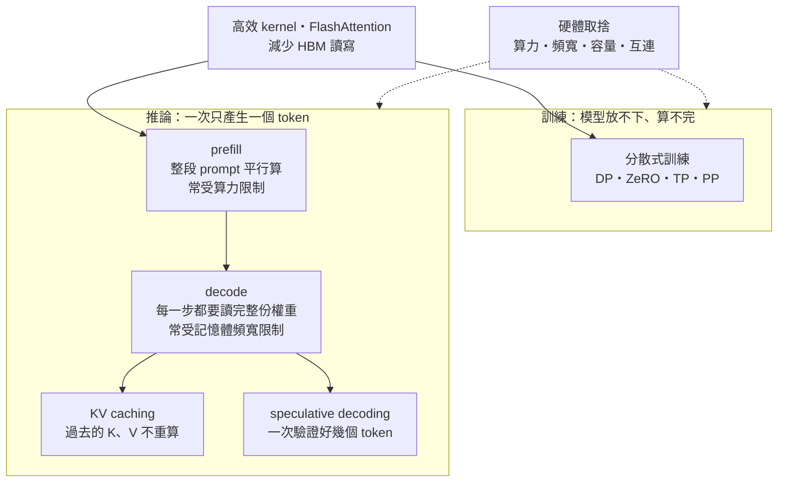

> 🌏 [English version](/posts/ai/2026-09-29-cme295-llm-systems-en)

**影片狀態：已附影片；播放未逐支確認。** [影片來源與說明](#課程影片來源)

> **課前預寫版**：本篇寫於 2026 年 9 月 29 日，2026 版第 5 講（2026 年 10 月 30 日）尚未開課。內容根據 2026 課表的主題清單、2025 版投影片中已講過的部分，以及原始論文整理；影片與投影片上架後會對照更新。

本篇對應 Stanford [CME295](/posts/ai/2026-09-29-stanford-cme295-transformers-llms) 2026 版第 5 講「LLM systems」。這一講在 2025 版不存在，它的內容散在 2025 版[第 3 講投影片](https://cme295.stanford.edu/slides/fall25-cme295-lecture3.pdf)最後約 40 頁（推論加速）和[第 4 講投影片](https://cme295.stanford.edu/slides/fall25-cme295-lecture4.pdf)中段約 50 頁（訓練最佳化）。本系列的[第 3 講導讀](/posts/ai/2026-09-29-cme295-large-language-models)和[第 4 講導讀](/posts/ai/2026-09-29-cme295-llm-training)各畫過一張地圖，並說細節留到這一篇。

你用過任何 LLM 聊天介面，大概都有這個經驗：送出問題後要等一下，第一個字才出現；之後字就一個一個穩定地流出來。這兩段等待其實是兩種不同的工作，瓶頸也不一樣。這一講的主題清單看起來很雜，從多 GPU 訓練一路到硬體選型，但大多可以收斂成同一個問題：**資料在 GPU 裡搬來搬去的成本，常常比計算本身還貴**。

## 課程影片來源

下列影片連結已列於本文對應講次的來源。

```youtube
url: https://www.youtube.com/watch?v=Q5baLehv5So
title: 錄影
```

```youtube
url: https://www.youtube.com/watch?v=VlA_jt_3Qc4
title: 錄影
```

原始影片：[錄影](https://www.youtube.com/watch?v=Q5baLehv5So)、[錄影](https://www.youtube.com/watch?v=VlA_jt_3Qc4)

課程與錄影入口：

- [官方課程／講次來源](https://cme295.stanford.edu/syllabus/2025/)

## 這一講在 2026 課表的位置

[2026 課表](https://cme295.stanford.edu/syllabus/)把第 5 講排在 10 月 30 日，就在 10 月 23 日期中考之後、第 6 講 AI Agents 之前。課表列出的主題只有這 7 項：

1. Distributed training（分散式訓練）
2. Inference optimizations（推論最佳化）
3. KV caching
4. Speculative decoding
5. Efficient kernels（高效 kernel）
6. Flash Attention
7. Hardware trade-offs（硬體取捨）

有兩件事要先講清楚。第一，quantization（量化）和 mixed precision（混合精度）在 2025 版第 4 講有講，但 2026 課表的第 5 講沒有列，本篇不把它們當成這講的內容。第二，MHA／MQA／GQA 在 2026 課表是列在第 2 講，所以本篇只從「KV cache 變小」的角度帶過。

以下依課表順序一個一個講。每一節會標明哪些內容出自 2025 版投影片、哪些是論文或其他課程的講法。



## 先記住一本帳：算得快，還是搬得快

這一節是理解後面每個主題的鑰匙。2025 版投影片沒有這樣講，這是 [CS336 第 2 講](/posts/ai/2026-08-22-cs336-resource-accounting)和 [CS336 第 10 講](/posts/ai/2026-08-22-cs336-inference)用的框架，我拿來串起整講。

GPU 有兩個關鍵規格：每秒能做幾次運算，以及每秒能從記憶體搬多少資料。依 [NVIDIA H100 規格頁](https://www.nvidia.com/en-us/data-center/h100/)（2026-09-29 查詢），H100 SXM 的 BF16 算力標 1,979 TFLOPS。這個數字註明是「with sparsity」，一般稠密矩陣大約是一半，約 989 TFLOPS。記憶體頻寬則是 3.35 TB/s。兩者相除，大約是 **295**：每搬 1 byte，要做約 295 次運算，算力才會吃滿。

這個比值叫 **arithmetic intensity**（算術強度）的門檻。工作的算術強度低於它，GPU 就是在等資料，算力閒著；高於它，才是真的在算。

<details>
<summary>算式：為什麼逐字生成時 GPU 大多在等資料</summary>

```
H100 門檻 ≈ 989e12 FLOP/s ÷ 3.35e12 byte/s ≈ 295 FLOP/byte

decode 一個 token（batch = 1，BF16 權重）：
  每個參數讀 2 byte，做 1 次乘法 + 1 次加法 = 2 FLOP
  算術強度 ≈ 2 FLOP / 2 byte = 1 FLOP/byte

batch = B 時，同一份權重讀一次給 B 個請求共用：
  算術強度 ≈ B FLOP/byte
```

這是忽略 KV cache 讀取、只看權重的粗略估算，不是投影片上的數字。結論是：單一使用者逐字生成時，算術強度遠低於 295，瓶頸在記憶體頻寬。

</details>

把這本帳帶著，後面每個主題都在回答其中一個問題：資料放不放得下？資料搬得夠不夠快？搬一次能不能多做點事？

## 分散式訓練：一張 GPU 放不下時怎麼切

**2025 版出處**：第 4 講投影片第 32–44 頁。

[第 4 講導讀](/posts/ai/2026-09-29-cme295-llm-training)已經算過訓練一步要存哪些東西：參數、activations、梯度、Adam 的兩份優化器狀態。[ZeRO 論文](https://arxiv.org/abs/1910.02054)把它換成數字：用混合精度加 Adam 訓練時，每個參數要 16 bytes。其中 FP16 參數 2、梯度 2，FP32 參數副本加兩份動量共 12。論文舉的例子是 75 億參數，光這些「model states」就要約 120 GB，還沒算 activations，一張 80GB 的 H100 放不下。

2025 版投影片把解法分成兩條路：

| 做法 | 切什麼 | 投影片重點 | 代價 |
|---|---|---|---|
| 資料平行（DP） | 切資料，每張卡放完整模型 | batch 分給多張 GPU | 每張卡都存一整份，最浪費記憶體 |
| DP + ZeRO | 把重複的東西切開 | ZeRO-1 切優化器狀態、ZeRO-2 再切梯度、ZeRO-3 連參數也切 | 切得越多，要在卡之間傳的資料越多 |
| 模型平行 | 切計算本身 | 投影片列了 TP、PP、SP、CP、EP 五種 | 每一層或每一段都要跟別張卡溝通 |

<details>
<summary>算式：ZeRO 每張卡要存多少</summary>

ZeRO 論文的記號：Ψ 是參數量，N_d 是資料平行的卡數，混合精度 Adam 的優化器倍數 K = 12。

```
一般資料平行：   2Ψ + 2Ψ + 12Ψ        = 16Ψ bytes
ZeRO-1（切優化器）：2Ψ + 2Ψ + 12Ψ / N_d
ZeRO-2（再切梯度）：2Ψ + 14Ψ / N_d
ZeRO-3（再切參數）：16Ψ / N_d
```

代入論文的例子（Ψ = 75 億、N_d = 64）：一般資料平行每張卡要 120 GB，ZeRO-3 降到約 1.9 GB。這是我照論文公式算的，論文的圖 1 用的是同一組參數。

</details>

PyTorch 內建的 [FSDP](https://arxiv.org/abs/2304.11277)（Fully Sharded Data Parallel）走的是跟 ZeRO-3 一樣的完整切分路線，論文的說法是效能可以跟一般資料平行相當，同時能訓練大得多的模型。

模型平行那一列，投影片只列了名字和一篇推薦讀物（Hugging Face 的 [Ultra-Scale Playbook](https://huggingface.co/spaces/nanotron/ultrascale-playbook)）。最常見的兩種是：

- **張量平行（TP）**：把一層裡的矩陣乘法切給多張卡，代表作是 [Megatron-LM](https://arxiv.org/abs/1909.08053)。每一層都要交換結果，通訊非常頻繁。
- **管線平行（PP）**：把不同層放在不同卡上，資料像生產線一樣流過去，代表作是 [GPipe](https://arxiv.org/abs/1811.06965)。通訊少，但生產線頭尾會有卡在空等。

這些做法怎麼用 all-reduce、all-gather 等通訊原語組出來，[CS336 第 7 講](/posts/ai/2026-08-22-cs336-parallelism-mechanics)有完整推導；怎麼依機房的網路拓撲組合成 3D 平行，看 [CS336 第 8 講](/posts/ai/2026-08-22-cs336-parallelism-strategies)。

## 推論最佳化：prefill 和 decode 是兩種工作

**2025 版出處**：第 3 講投影片第 86–89 頁與第 124 頁（分類框架）。prefill／decode 的說法投影片沒有用，出自推論系統的文獻。

回到開頭的經驗。你送出 prompt 後，模型要先把整段 prompt 讀過一遍，算出每個位置的 key 和 value，這一步叫 **prefill**。prompt 裡的 token 都已知，可以平行算，矩陣很大，算術強度高，GPU 算力用得滿。你等第一個字出現的時間（TTFT，time to first token）主要花在這裡。

接著是 **decode**：每一步只產生一個 token，產生完才能算下一個。每一步都得把整份權重從 HBM 讀一遍，卻只對一個 token 做運算。上一節的帳算過，這時算術強度大約只有 1，GPU 多數時間在等資料。你看到字一個一個流出來的速度，取決於這一段。

2025 版投影片把推論最佳化分成兩大類，最後一頁再把每個技巧對回去：

| 類別 | 子類 | 代表技巧 |
|---|---|---|
| 「精確」的效率提升（結果不變） | 避免重複計算 | KV cache |
| | 記憶體管理 | PagedAttention |
| | 改寫數學 | speculative decoding |
| 近似（可能影響結果） | 改架構 | GQA |
| | 改表示法 | latent attention |
| | 改 token 預測方式 | multi-token prediction |

這張表有一格值得注意：投影片把 speculative decoding 放在「精確」那一類。它確實不改變輸出分布，只改變計算順序，後面會解釋為什麼。

另一個投影片沒提、但幾乎所有推論引擎都在用的手法是 **continuous batching**。decode 的算術強度跟 batch 大小成正比，把更多請求湊在一起算最划算；問題是每個請求長度不同，傳統做法要等一整批都結束才能換下一批。[Orca](https://www.usenix.org/conference/osdi22/presentation/yu)（OSDI 2022）提出以「每一步」為單位排程：某個請求一結束，下一步就把新請求補進來。

## KV caching：用記憶體換掉重算

**2025 版出處**：第 3 講投影片第 91–115 頁。

投影片用「a cute teddy bear is reading」一個字一個字示範：產生第 6 個 token 時，它要跟前 5 個 token 做 attention，需要它們的 key 和 value；產生第 7 個時又要一次。這些舊 token 的 K、V 不會變，所以投影片的想法是「Keep keys and values in a cache」，算過就存起來，之後直接從快取讀。

這是典型的拿記憶體換計算。代價是 KV cache 會隨對話變長而長大，而且每個同時服務的請求各有一份。

<details>
<summary>算式：KV cache 有多大</summary>

```
KV cache bytes = 2 × 層數 × KV head 數 × 每個 head 的維度
                 × 序列長度 × batch × 每個數值的 bytes
（開頭的 2 = K 和 V 各一份）
```

代入 [Llama 3 論文](https://arxiv.org/abs/2407.21783)表 3 的 8B 設定（32 層、32 個 query head、8 個 KV head、模型維度 4,096，所以每個 head 128 維），用 BF16（2 bytes）：

```
每個 token：2 × 32 × 8 × 128 × 2 = 131,072 bytes = 128 KiB
8,192 個 token：128 KiB × 8,192 = 1 GiB（單一請求）
```

如果不用 GQA、KV head 跟 query head 一樣是 32 個，同樣長度要 4 GiB。這些是我依論文設定算的，不是投影片數字。

</details>

KV cache 大了，一張卡能同時服務的請求就少，batch 小，decode 的算術強度就更低。2025 版投影片列了三條縮小或管好它的路：

- **少存幾組 head（GQA／MQA）**：多個 query head 共用同一組 K、V。[MQA](https://arxiv.org/abs/1911.02150) 全部共用一組，[GQA](https://arxiv.org/abs/2305.13245) 分組共用。Llama 3 用 32 個 query head 配 8 個 KV head，KV cache 直接變成四分之一。這部分 2026 課表放在第 2 講，[第 2 講導讀](/posts/ai/2026-09-29-cme295-transformer-tricks)有講。
- **存壓縮過的版本（latent attention）**：[DeepSeek-V2](https://arxiv.org/abs/2405.04434) 的 Multi-head Latent Attention 不存完整的 K、V，只存一個低維的 latent 向量，需要時再還原。論文說跟自家 DeepSeek 67B 比，KV cache 少了 93.3%，最大生成吞吐量提升到 5.76 倍。
- **管好記憶體（PagedAttention）**：[vLLM 論文](https://arxiv.org/abs/2309.06180)量測發現，既有系統替每個請求預留一整塊連續空間，實際存 token 狀態的只佔 20.4% 到 38.2%，其餘都被碎片和預留吃掉。PagedAttention 借用作業系統的分頁概念，把 KV cache 切成固定大小的區塊、不必連續存放，浪費壓到最多一個區塊。論文報告吞吐量比當時的系統高 2 到 4 倍。

PagedAttention 還有一個附帶好處：多個請求如果有相同的開頭（例如同一段 system prompt），可以共用同一批區塊。vLLM 的實作細節在站上的 [vLLM 深入介紹](/posts/ai/2026-03-14-vllm-inference-engine)。

## Speculative decoding：趁 GPU 閒著，多猜幾個字

**2025 版出處**：第 3 講投影片第 116–122 頁。接受規則的完整版在[第 3 講導讀](/posts/ai/2026-09-29-cme295-large-language-models)，這裡不重寫。

decode 時 GPU 算力大多閒著。那能不能讓它一次多做點事？[Chen 等人](https://arxiv.org/abs/2302.01318)的觀察是：讓大模型一次「驗證」幾個 token，花的時間跟讓它「產生」一個 token 差不多。因為兩者都要把權重讀一遍，而讀權重才是主要成本。

所以做法是：

1. 小的 draft 模型先快速猜出後面 k 個 token
2. 大的 target 模型一次平行算出這 k 個位置的機率
3. 依接受規則從左到右檢查，接受到第一個被拒絕的位置為止，並在那個位置重新抽一個 token

投影片的例子是 draft 模型接在「[BOS] my teddy bear」後面猜「is cute and smart」，target 模型一次驗證。接受規則經過設計，[Leviathan 等人](https://arxiv.org/abs/2211.17192)和 Chen 等人各自證明：最後的輸出分布跟只用大模型抽樣一模一樣。這就是投影片把它歸在「精確」那一類的原因。

<details>
<summary>算式：一輪能產生幾個 token</summary>

Leviathan 等人假設每個猜測被接受的機率大致固定為 α，每輪猜 γ 個 token：

```
每輪期望產生的 token 數 = (1 − α^(γ+1)) / (1 − α)
```

例如 α = 0.8、γ = 4：(1 − 0.8⁵) / 0.2 ≈ 3.4 個 token，而大模型只跑了一次。α 越高、draft 越便宜，加速越多；α 低的時候猜再多也是白猜。

</details>

論文報告的加速：Leviathan 等人在 T5-XXL 上 2 到 3 倍，Chen 等人在 700 億參數的 Chinchilla 上 2 到 2.5 倍。

投影片最後介紹了一個變體 **multi-token prediction（MTP）**：與其另外養一個 draft 模型，不如在同一個模型上訓練多個預測頭，一次預測後面好幾個 token，draft 和 target 就是同一個模型。[Gloeckle 等人](https://arxiv.org/abs/2404.19737)說用 4-token 預測訓練的模型，推論最多快 3 倍。同一條思路還有 [Medusa](https://arxiv.org/abs/2401.10774)（加額外的解碼頭）和 [EAGLE](https://arxiv.org/abs/2401.15077)（在特徵層做預測），EAGLE 在 LLaMA2-Chat 70B 上報告 2.7 到 3.5 倍的延遲加速。

它不是永遠划算。[vLLM 的 speculative decoding 文件](https://docs.vllm.ai/en/latest/features/speculative_decoding/)（2026-09-29 查詢）開頭就寫明，它用來「reduce inter-token latency under medium-to-low QPS, memory-bound workloads」。請求量大的時候 batch 已經很大，GPU 本來就在全力計算，多出來的猜測反而佔用算力。

## 高效 kernel：把好幾步融成一步

**2025 版出處**：沒有獨立段落。2025 版只在 FlashAttention 那段講過同樣的原理，這是 2026 課表新列出的主題。以下根據 [CS336 第 5 講](/posts/ai/2026-08-22-cs336-gpu-tpu)、[CS336 第 6 講](/posts/ai/2026-08-22-cs336-kernels-triton)與官方文件。

在 GPU 上，一個 **kernel** 就是一次交給 GPU 執行的函式。PyTorch 寫 `y = gelu(x @ W + b)`，最直接的執行方式是三個 kernel：矩陣乘法算完寫回 HBM，加法讀出來、算完再寫回，GeLU 再讀一次、再寫一次。三趟來回裡，真正必要的只有第一次讀和最後一次寫。

**kernel fusion** 就是把這幾步合成一個 kernel，中間結果留在晶片內的快速記憶體，不回 HBM。對算術強度低的逐元素運算（加法、activation、normalization、softmax），這通常是最大的加速來源。

寫 fused kernel 以前要用 CUDA C++，現在有比較容易的路：

- [Triton](https://triton-lang.org/main/index.html) 讓你用 Python 語法寫 GPU kernel，官方教學的第二個範例就是 [fused softmax](https://triton-lang.org/main/getting-started/tutorials/02-fused-softmax.html)
- PyTorch 的 `torch.compile` 會自動產生 fused kernel。[TorchInductor 的文件](https://docs.pytorch.org/docs/main/user_guide/torch_compiler/torch.compiler_inductor_profiling.html)裡，產生的 kernel 名稱像 `triton_poi_fused_cat_155`，名字本身就說明它是一個融合過的 Triton kernel

寫 kernel 最容易踩的坑是沒量就改。CS336 第 6 講的重點正是先量測、再用 profiler 看，找出時間真正花在哪。

## FlashAttention：把 kernel 最佳化用在 attention 上

**2025 版出處**：第 4 講投影片第 45–71 頁。[第 4 講導讀](/posts/ai/2026-09-29-cme295-llm-training)已經引過論文的數據（運算量變多，但 HBM 讀寫從 40.3 GB 降到 4.4 GB，時間從 41.7 ms 降到 7.3 ms），這裡補機制。

標準 attention 的問題，投影片一步一步畫出來：從 HBM 讀 Q、K，算出分數矩陣 S，**把 S 寫回 HBM**；再讀 S，算 softmax 得到 P，**把 P 寫回 HBM**；再讀 P 和 V，算出輸出 O。S 和 P 都是「序列長度 × 序列長度」的大矩陣，序列一長，這幾趟來回就是主要成本。

[FlashAttention](https://arxiv.org/abs/2205.14135) 的兩個想法，投影片各給了一頁：

1. **Tiling**：把 Q、K、V 切成小塊，一次搬一塊進 SRAM，在 SRAM 裡算完這塊的輸出再寫回。S 和 P 從頭到尾不進 HBM。
2. **反向傳播時重算**：一般做法會把 S、P 存起來給反向傳播用；FlashAttention 不存，反向時用同樣的 tiling 再算一次。投影片的評語是「Sometimes, it is better to recompute instead of storing」。

tiling 有個難處：softmax 要先知道整列的最大值和總和才能正規化，但一次只看得到一塊。投影片第 62 頁的說法是「No need to compute the full S = QKᵀ before applying softmax」，並畫出整列的 softmax 可以拆成每一塊各自的 softmax 乘上一個係數 α。論文裡的做法常被稱為 online softmax：每看到新的一塊，就更新目前的最大值和總和，並把之前累積的結果重新縮放。

<details>
<summary>算式：online softmax 怎麼逐塊累積</summary>

對 Q 的某一列，依序處理 K、V 的第 j 塊。維護三個量：目前最大值 m、指數和 ℓ、未正規化的輸出 O。

```
S_j   = Q · K_jᵀ                          # 這一塊的分數
m_new = max(m, rowmax(S_j))
ℓ_new = e^(m − m_new) · ℓ + rowsum(e^(S_j − m_new))
O_new = e^(m − m_new) · O + e^(S_j − m_new) · V_j

全部塊處理完：輸出 = O / ℓ
```

`e^(m − m_new)` 這個因子負責把舊的累積值換算到新的最大值基準上。結果跟一次算整列完全相同，不是近似。

</details>

FlashAttention 後來出了兩版，都是在同一個想法上更貼近硬體：

| 版本 | 改了什麼 | 論文報告的結果 |
|---|---|---|
| [FlashAttention-2](https://arxiv.org/abs/2307.08691)（2023） | 重新分配 thread block 與 warp 之間的工作，減少非矩陣乘法運算 | 比第一版快約 2 倍，在 A100 上達到理論峰值的 50–73% |
| [FlashAttention-3](https://arxiv.org/abs/2407.08608)（2024） | 利用 H100 的非同步執行讓搬資料與計算重疊，支援 FP8 | 在 H100 上比第二版快 1.5–2.0 倍，FP16 最高 740 TFLOPS（約 75% 使用率） |

FlashAttention-3 論文提到，第二版在 H100 上只用到 35% 的算力。同一個演算法換一代硬體就要重寫一次，這正好帶到下一個主題。

## 硬體取捨：沒有免費的加速

**2025 版出處**：第 4 講投影片第 36–37 頁（H100 記憶體有限）、第 72–77 頁（數值格式與「精度越低、算得越快」）。「hardware trade-offs」這個主題名稱是 2026 課表新列的，以下的整理來自前面幾節和官方規格。

把前面每個手法攤開，會發現每一個都在拿一種資源換另一種：

| 手法 | 省下什麼 | 付出什麼 |
|---|---|---|
| KV cache | 重算過去 token 的計算 | 記憶體，而且隨對話長度成長 |
| GQA／latent attention | KV cache 記憶體 | 架構要改、需要重新訓練或 uptrain，可能影響品質 |
| 加大 batch | 權重讀取成本被更多請求分攤，吞吐量上升 | 每個使用者等更久 |
| speculative decoding | decode 的等待時間 | 多跑一個 draft 模型的計算與記憶體；負載高時可能變慢 |
| FlashAttention 的重算 | HBM 讀寫與記憶體 | 多做一些運算 |
| ZeRO-3／張量平行 | 每張卡的記憶體 | 卡與卡之間的通訊 |

最後一列跟硬體規格直接相關。同一台機器內的 GPU 用 NVLink 相連，H100 規格頁寫 900 GB/s；跨機器或走 PCIe Gen5 只有 128 GB/s。所以通訊最頻繁的張量平行通常只放在同一台機器內，跨機器改用通訊較少的管線平行或資料平行。

選硬體時要看的也不只一個數字：

- **算力（FLOPS）**：決定 prefill 和訓練有多快
- **記憶體頻寬**：決定 decode 有多快
- **記憶體容量**：決定模型和 KV cache 放不放得下、能同時服務多少請求
- **互連頻寬**：決定能不能有效切到多張卡上

2025 版投影片第 77 頁還有一句「Lower precision → Faster processing」，這是量化和混合精度的出發點。2026 課表沒有列出量化，它會不會出現在「hardware trade-offs」底下，要等投影片釋出才知道。

## 連回你用的模型

- **用 API 時**：長 prompt 讓第一個字出現得比較慢，那是 prefill；字流出來的速度是 decode。兩者的最佳化方向不同，所以比較推論服務時，首字延遲（TTFT）和每秒輸出 token 數要分開看。
- **自架模型時**：先估 KV cache。用上面的算式代入你的模型設定、預期的 context 長度和同時連線數，常常會發現卡住你的是 KV cache，不是模型權重。vLLM 用 PagedAttention 管這件事，站上的 [vLLM 自架決策](/posts/ai/2026-08-21-vllm-self-host-decision)算過 GPU 使用率怎麼影響每百萬 token 的成本。
- **考慮開 speculative decoding 時**：先看你的流量。低流量、重視單一使用者延遲時效果好；高流量時可能沒幫助。
- **訓練或微調時**：模型放不下，先試 ZeRO／FSDP，不用改模型程式；還是放不下才考慮張量平行或管線平行。

## 2025 版在哪裡講過

2026 版第 5 講的投影片尚未釋出。以下是 2026 課表的 7 個主題對照 2025 版投影片的頁碼：

| 2026 課表主題 | 2025 版出處 | 狀態 |
|---|---|---|
| Distributed training | 第 4 講 p.32–44（記憶體瓶頸、DP、ZeRO-1/2/3、TP/PP/SP/CP/EP 名稱） | 2025 已講，模型平行只列名稱 |
| Inference optimizations | 第 3 講 p.86–89、p.124（精確／近似兩類的分類框架） | 2025 已講框架；prefill／decode、continuous batching 投影片沒有 |
| KV caching | 第 3 講 p.91–101（KV cache）、p.102–106（GQA）、p.107–108（PagedAttention）、p.109–115（latent attention） | 2025 已講 |
| Speculative decoding | 第 3 講 p.116–122（含接受規則與 MTP） | 2025 已講 |
| Efficient kernels | 無 | **2026 新增** |
| Flash Attention | 第 4 講 p.45–71（HBM／SRAM、tiling、重算、結果） | 2025 已講 |
| Hardware trade-offs | 第 4 講 p.36–37、p.72–77 零星提到 | **2026 新增為獨立主題** |

反過來看，2025 版第 4 講 p.72–81 的數值格式、混合精度訓練，以及 QLoRA 用到的量化，都沒有出現在 2026 第 5 講的清單上。

## 自我檢測

第 1、2、3、6 題改寫自 [2025 期中考](https://cme295.stanford.edu/exams/fall25-cme295-midterm.pdf)第 III、IV 大題，答案在[解答 PDF](https://cme295.stanford.edu/exams/fall25-cme295-midterm-solutions.pdf)。2026 版期中考在 10 月 23 日，比這一講早；照 2025 期中考第 1–4 講、期末考第 5–8 講的分法推測，這講會落在 12 月 9 日的期末考範圍，課程尚未公布。

1. 推論時 KV cache 的用途是什麼？它省下的是什麼成本？（第 III.5 題）
2. 跟 MHA 比，MQA／GQA 主要靠什麼降低延遲？（第 III.6 題）
3. PagedAttention 主要想解決什麼問題？（第 III.3 題）
4. （自擬）speculative decoding 的 draft 模型猜錯時，為什麼最後的輸出分布仍然跟只用 target 模型一樣？draft 的接受率下降時，加速效果會怎樣變化？
5. （自擬）ZeRO-1、ZeRO-2、ZeRO-3 各多切開了哪一種狀態？切得越多，換來的代價是什麼？
6. 說明 FlashAttention 的核心想法，並舉一個實際觀察到的好處。（第 IV.10 題）
7. （自擬）用本篇的 KV cache 算式，算出 Llama 3 8B 在 32K context、同時 4 個請求、BF16 下的 KV cache 大小。再說明 decode 的算術強度為什麼大約等於 batch size，以及這對「要不要開 speculative decoding」有什麼影響。

## 想深入

- 自己算 FLOPs、記憶體與 roofline：[CS336 第 2 講](/posts/ai/2026-08-22-cs336-resource-accounting)
- GPU 的記憶體階層與 FlashAttention 的原理：[CS336 第 5 講](/posts/ai/2026-08-22-cs336-gpu-tpu)
- 動手寫 Triton kernel：[CS336 第 6 講](/posts/ai/2026-08-22-cs336-kernels-triton)
- 通訊原語與三種平行：[CS336 第 7 講](/posts/ai/2026-08-22-cs336-parallelism-mechanics)、[CS336 第 8 講](/posts/ai/2026-08-22-cs336-parallelism-strategies)
- prefill／decode、量化、continuous batching 的完整推論帳：[CS336 第 10 講](/posts/ai/2026-08-22-cs336-inference)
- 用滑桿感受 TTFT 與 speculative decoding：[Learn Inference 互動版推論工程網站介紹](/posts/ai/2026-09-29-learn-inference-interactive-guide)
- PagedAttention 怎麼變成產品：[vLLM 深入介紹](/posts/ai/2026-03-14-vllm-inference-engine)
- 同批的 2026 新講：[RL with LLMs](/posts/ai/2026-09-29-cme295-rl-with-llms)、[AI Agents](/posts/ai/2026-09-29-cme295-ai-agents)、[Diffusion LLMs](/posts/ai/2026-09-29-cme295-diffusion-llms)

## 更新計畫

10 月 30 日投影片與影片上架後，會對照以下幾點改寫本篇：

- 7 個主題實際各講了什麼，跟本篇依 2025 投影片與論文的整理差在哪
- 「efficient kernels」是講 kernel fusion、Triton，還是別的內容
- 「hardware trade-offs」有沒有收進量化與數值格式
- GQA、latent attention、PagedAttention 是放在這一講，還是留在第 2 講
- 用 2026 版投影片的頁碼取代「2025 版在哪裡講過」那張表，並依 2026 期末考更新自我檢測

## 更新紀錄

- 2026-10-10：標註影片狀態，核對錄影來源與取得方式。

## 參考資料

- [CME 295 2026 版課表](https://cme295.stanford.edu/syllabus/)（2026-09-29 查詢）
- [CME 295 2025 版課表](https://cme295.stanford.edu/syllabus/2025/)
- [2025 版第 3 講投影片（PDF）](https://cme295.stanford.edu/slides/fall25-cme295-lecture3.pdf)／[錄影](https://www.youtube.com/watch?v=Q5baLehv5So)
- [2025 版第 4 講投影片（PDF）](https://cme295.stanford.edu/slides/fall25-cme295-lecture4.pdf)／[錄影](https://www.youtube.com/watch?v=VlA_jt_3Qc4)
- [2025 期中考](https://cme295.stanford.edu/exams/fall25-cme295-midterm.pdf)／[解答](https://cme295.stanford.edu/exams/fall25-cme295-midterm-solutions.pdf)
- [NVIDIA H100 Tensor Core GPU 規格](https://www.nvidia.com/en-us/data-center/h100/)（2026-09-29 查詢）
- [Rajbhandari et al., ZeRO: Memory Optimizations Toward Training Trillion Parameter Models (2019)](https://arxiv.org/abs/1910.02054)
- [Zhao et al., PyTorch FSDP: Experiences on Scaling Fully Sharded Data Parallel (2023)](https://arxiv.org/abs/2304.11277)
- [Shoeybi et al., Megatron-LM (2019)](https://arxiv.org/abs/1909.08053)
- [Huang et al., GPipe (2018)](https://arxiv.org/abs/1811.06965)
- [Hugging Face, The Ultra-Scale Playbook (2025)](https://huggingface.co/spaces/nanotron/ultrascale-playbook)
- [Yu et al., Orca: A Distributed Serving System for Transformer-Based Generative Models (OSDI 2022)](https://www.usenix.org/conference/osdi22/presentation/yu)
- [Llama Team, The Llama 3 Herd of Models (2024)](https://arxiv.org/abs/2407.21783)
- [Shazeer, Fast Transformer Decoding: One Write-Head is All You Need (2019)](https://arxiv.org/abs/1911.02150)
- [Ainslie et al., GQA (2023)](https://arxiv.org/abs/2305.13245)
- [DeepSeek-AI, DeepSeek-V2 (2024)](https://arxiv.org/abs/2405.04434)
- [Kwon et al., Efficient Memory Management for LLM Serving with PagedAttention (2023)](https://arxiv.org/abs/2309.06180)
- [Leviathan et al., Fast Inference from Transformers via Speculative Decoding (2022)](https://arxiv.org/abs/2211.17192)
- [Chen et al., Accelerating Large Language Model Decoding with Speculative Sampling (2023)](https://arxiv.org/abs/2302.01318)
- [Gloeckle et al., Better & Faster Large Language Models via Multi-token Prediction (2024)](https://arxiv.org/abs/2404.19737)
- [Cai et al., Medusa (2024)](https://arxiv.org/abs/2401.10774)
- [Li et al., EAGLE (2024)](https://arxiv.org/abs/2401.15077)
- [vLLM 文件：Speculative Decoding](https://docs.vllm.ai/en/latest/features/speculative_decoding/)（2026-09-29 查詢）
- [Triton 官方文件](https://triton-lang.org/main/index.html)／[Fused Softmax 教學](https://triton-lang.org/main/getting-started/tutorials/02-fused-softmax.html)
- [PyTorch 文件：TorchInductor GPU Profiling](https://docs.pytorch.org/docs/main/user_guide/torch_compiler/torch.compiler_inductor_profiling.html)
- [Dao et al., FlashAttention (2022)](https://arxiv.org/abs/2205.14135)
- [Dao, FlashAttention-2 (2023)](https://arxiv.org/abs/2307.08691)
- [Shah et al., FlashAttention-3 (2024)](https://arxiv.org/abs/2407.08608)
- [Stanford CME295 導讀（本系列總覽）](/posts/ai/2026-09-29-stanford-cme295-transformers-llms)
