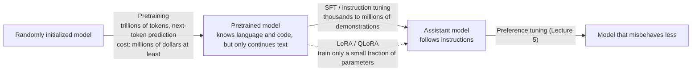

> 🌏 [中文版](/posts/ai/2026-09-29-cme295-llm-training)

**Video status: Videos included.** [Source details](#course-video-sources)

This post covers Lecture 4, "LLM training," of the 2025 edition of Stanford's [CME295](/posts/ai/2026-09-29-stanford-cme295-transformers-llms-en) (October 17, 2025). The main source is the [128-page slide deck](https://cme295.stanford.edu/slides/fall25-cme295-lecture4.pdf); the [recording](https://www.youtube.com/watch?v=VlA_jt_3Qc4) is there to watch alongside. Everything below is based only on the text and figures on the slides, not on anything said out loud in class.

The first three lectures answered "what does an LLM look like?" Lecture 4 asks a different question: how does that machine go from random weights to an assistant that answers questions? The slides give a two-part answer. First **pretraining**, which teaches the model the patterns of language and code. Then **finetuning**, which teaches it to do what it's told. The two stages differ in cost by several orders of magnitude, and most of the lecture is about where the money and memory go and how to save them.

## Course video sources

The videos below come from Stanford Online’s official CME295 Autumn 2025 playlist; on 2026-10-10 the lecture title and video ID were checked live against the playlist and match.

```youtube
url: https://www.youtube.com/watch?v=VlA_jt_3Qc4
title: Stanford CME295 Transformers & LLMs | Autumn 2025 | Lecture 4 - LLM Training
```

Original videos: [Stanford CME295 Transformers & LLMs | Autumn 2025 | Lecture 4 - LLM Training](https://www.youtube.com/watch?v=VlA_jt_3Qc4)

Content check: verified against the video transcript (2026-10-10): sampled the beginning, middle and end of the transcript, searched keywords, and compared against the chapter list in the video description (not a word-by-word comparison). The video is Autumn 2025 Lecture 4, LLM Training (page date 2025-10-17, length 1:47:27). Its chapters are pretraining, FLOPs, scaling laws and Chinchilla, ZeRO, model parallelism, Flash Attention, quantization, mixed precision, SFT, instruction tuning, LoRA and QLoRA, consistent with the post's topic. The post cites only the slides and does not relay spoken remarks.

Course and recording entries:

- [Official course / lecture source](https://cme295.stanford.edu/syllabus/2025/)
- [CME295 Autumn 2025 playlist (Stanford Online, 9 videos)](https://www.youtube.com/playlist?list=PLoROMvodv4rOCXd21gf0CF4xr35yINeOy)

Checked: 2026-10-10.

## Start with a counterexample: a pretrained model only continues text

The slides open with a question: "Can I put my teddy bear in the washer?"

A model that has only been pretrained replies: "Teddy bears are often made of materials like polyester and cotton, with plastic eyes and sometimes small accessories." Nothing in it is wrong. It is simply continuing with the kind of text a web page might contain, and never answers the question.

A model that has been instruction tuned replies: "No, it might get damaged. Try hand washing instead."

The gap between those two answers is the two stages of this lecture.



The two-stage recipe is itself a paradigm shift. The slides contrast three approaches. Traditional machine learning trains a model from scratch for every task: one for spam detection, one for sentiment extraction, one for translation. Transfer learning reuses part of a trained model. LLM training first trains a model to understand language, then tunes it for the end task.

## Stage one: pretraining

### Objective and data

The pretraining objective is simple: **predict the next token**. Given "[BOS] A teddy bear is", guess the next word.

The goal is to learn "patterns of language and code," so the data mixes web-scraped text (the slides name [Common Crawl](https://commoncrawl.org/) and Wikipedia) with code (GitHub, Stack Overflow), across many languages. The scale is **trillions of tokens**:

| Model | Pretraining tokens |
|---|---|
| [GPT-3](https://arxiv.org/abs/2005.14165) (2020) | 300 billion |
| [Llama 3](https://arxiv.org/abs/2407.21783) (2024) | 15 trillion |

### Measuring scale in FLOPs

The slides separate two terms that often get mixed up. **FLOPs** is the total amount of computation (how many floating-point operations were done); **FLOPS** or FLOP/s is how many can be done per second. The first is the training bill, the second is hardware speed. In orders of magnitude, training a small neural network takes about 10⁷ FLOPs, a large RNN about 10¹⁴, an LLM about 10²⁵. On the hardware side, a smartphone does about 10¹² FLOPS, a computer about 10¹⁴, a supercomputer about 10¹⁸.

### Scaling laws: bigger models are more sample-efficient

The slides take two findings from [Kaplan et al.'s scaling-law paper](https://arxiv.org/abs/2001.08361):

- **Scaling**: test loss falls as a power law in compute, dataset size, and parameter count, each a straight line on log-log axes
- **Sample efficiency**: larger models reach lower loss with the same number of tokens, so bigger models learn faster

Then comes the [Chinchilla law](https://arxiv.org/abs/2203.15556). The slides reproduce the paper's table of "compute-optimal" training tokens for different model sizes:

| Parameters | Optimal training tokens |
|---|---|
| 1 billion | 20.2 billion |
| 67 billion | 1.5 trillion |
| 175 billion | 3.7 trillion |

Reading off the table, that's roughly 20 tokens per parameter. Put it next to the earlier table: GPT-3 has 175 billion parameters but was trained on only 300 billion tokens, less than a tenth of what Chinchilla recommends. Later models shifted toward more data and not-too-large models. For the derivation and how to extrapolate from small experiments, [CS336 Lecture 9](/posts/ai/2026-08-22-cs336-scaling-laws-foundations-en) goes further.

### What pretraining costs

The slides sort the challenges into two groups:

- **Cost**: at least millions of dollars, lots of time, lots of electricity
- **Learned knowledge**: there's a "knowledge cutoff" (the slides include a screenshot of the cutoff date on an OpenAI model page). Learned knowledge is hard to edit. And there's what the slides put in quotes as "plagiarism," meaning the model may reproduce its training data

## The pretraining bill: memory runs out first

Why is pretraining so expensive? The slides start by listing what one training step has to store:

| Stage | What gets stored | Size depends on |
|---|---|---|
| Initialization | Model parameters | Billions to hundreds of billions |
| Forward pass | Activations (needed to compute the loss) | Model size, batch size, context length |
| Backward pass | Gradients | Same count as the parameters |
| Weight update | Optimizer state | Adam keeps two extra values per parameter |

<details>
<summary>Formula: why Adam eats memory</summary>

```
θ_{t+1} ← θ_t − α · m_t / (√v_t + ε)

m_{t+1} ← β₁ m_t + (1 − β₁) ∇L(θ_t)        # moving average of the gradient
v_{t+1} ← β₂ v_t + (1 − β₂) (∇L(θ_t))²     # moving average of the squared gradient
```

m and v are each as large as the parameters, so the optimizer state alone is twice the parameter count. The slides suggest the original [Adam](https://arxiv.org/abs/1412.6980) and [AdamW](https://arxiv.org/abs/1711.05101) papers as further reading.

</details>

The problem is that a single GPU has only tens of GB of memory. The slides use the [NVIDIA H100](https://www.nvidia.com/en-us/data-center/h100/) spec sheet as the example, boxing the GPU memory row (80GB and 94GB variants). A model with hundreds of billions of parameters can't even fit its parameters, let alone gradients and optimizer state.

## Saving memory and time: a map

The lecture then spends roughly half its slides on training optimizations. In the 2026 edition these topics were pulled out into their own lecture, "LLM systems" (covered in [order 10](/posts/ai/2026-09-29-cme295-llm-systems-en) of this series), and the site already has in-depth CS336 posts on them, so here you get only the map, with each cell stating what problem it solves:

| Technique | Problem it solves | What the slides emphasize | Go deeper |
|---|---|---|---|
| Data parallelism | Too much data for one device | Split the batch across GPUs; each holds the full model | [CS336 Lecture 7](/posts/ai/2026-08-22-cs336-parallelism-mechanics-en) |
| [ZeRO](https://arxiv.org/abs/1910.02054) | Every GPU stores the same things, which is wasteful | ZeRO-1 shards optimizer state; ZeRO-2 adds gradients; ZeRO-3 adds parameters | [CS336 Lecture 8](/posts/ai/2026-08-22-cs336-parallelism-strategies-en) |
| Model parallelism | The model itself doesn't fit on one GPU | Split computation across devices: tensor (TP), pipeline (PP), sequence (SP), context (CP), expert (EP) parallelism | The slides recommend Hugging Face's [Ultra-Scale Playbook](https://huggingface.co/spaces/nanotron/ultrascale-playbook) |
| [FlashAttention](https://arxiv.org/abs/2205.14135) | Attention keeps shuttling data between slow HBM and fast SRAM | Tile blocks into SRAM, compute, then write back; in the backward pass, recompute rather than store the big matrix; the result is exact, not an approximation | [CS336 Lecture 5](/posts/ai/2026-08-22-cs336-gpu-tpu-en) |
| [Mixed precision training](https://arxiv.org/abs/1710.03740) | FP32 is slow and takes space | Activations in the forward pass and gradients in the backward pass in low precision; weight updates keep high precision | [CS336 Lecture 2](/posts/ai/2026-08-22-cs336-resource-accounting-en) |

The FlashAttention row is worth a second look because it's counterintuitive. The slides quote a set of numbers from the original paper: FlashAttention actually does more computation (75.2 vs 66.6 GFLOPs), but HBM reads/writes drop from 40.3 GB to 4.4 GB and runtime drops from 41.7 ms to 7.3 ms. On a GPU the bottleneck is often moving data, not computing. In the slides' own words: "More FLOPs, but less runtime!!"

The mixed-precision row requires knowing how floats are laid out. The slides list the bit split for each format:

| Format | Exponent bits | Mantissa bits |
|---|---|---|
| FP32 | 8 | 23 |
| FP16 | 5 | 10 |
| BF16 | 8 | 7 |

BF16 keeps the same exponent range as FP32 and gives up precision. The slides' takeaway is that lower precision means faster processing on the GPU.

Inference-side optimizations (KV cache, speculative decoding, and so on) came up in earlier lectures and are outside this one; for those, see [CS336 Lecture 10](/posts/ai/2026-08-22-cs336-inference-en).

## Stage two: SFT, or "graduating" the model into an assistant

### How it works

SFT (Supervised FineTuning) changes model behavior by tuning its weights:

1. Collect input/desired-output pairs, the SFT data
2. Train with the same next-token objective, except now **conditioned on the input**, so the model learns only how to produce the output

When the data is instruction/response pairs, this is called **instruction tuning**, and the slides cite the [FLAN paper](https://arxiv.org/abs/2109.01652). Examples include a short story about a teddy bear who likes poetry, three things a teddy bear might do on a rainy day, a poem, and an explanation of why a teddy bear is a great friend.

### Data

The data can be human-written or synthetic. The slides list four kinds: assistant dialogs, synthetic instructions, math/reasoning/code, and safety alignment. The scale runs from thousands to millions of examples:

| Model | SFT examples (per the slides' table) |
|---|---|
| GPT-3 family | 13 thousand |
| Llama 3 | 10 million |

Compared with trillions of pretraining tokens, SFT is several orders of magnitude smaller, which is why many more teams can afford it.

### What makes it hard

The slides list five challenges: it needs **very high-quality** data, it's sensitive to the prompt distribution, generalization, it's **hard to evaluate**, and it's still computationally expensive.

The slides expand on evaluation along two lines:

- **Benchmarks**: MMLU for general knowledge, ARC-Challenge for basic reasoning, GSM8K for math, HumanEval for code. The slides note that to compare across models, it's recommended to train on the test task first, citing [Dominguez-Olmedo et al.](https://arxiv.org/abs/2407.07890): whether a model was trained on the test task confounds evaluation
- **"Real-life" feel**: sites like Chatbot Arena (now [LMArena](https://lmarena.ai/leaderboard)) let users vote in A/B tests between two anonymous models' answers. The upside is that it puts a number on "vibes." The problems include a cold start from unequal exposure of models, being easy to rig, users being unable to judge things like factuality, non-representative personal preferences, and penalizing safety refusals

The slides conclude: "evaluation is a hard problem in itself!" Order 8 of this series, [on evaluation](/posts/ai/2026-09-29-cme295-llm-evaluation-en), is devoted to it.

There's one more step after SFT. The final lifecycle diagram in the slides reads: initialization → pretraining → SFT → **preference tuning**, which makes the model "not misbehave as much"; together these are called alignment. That's the topic of [Lecture 5](/posts/ai/2026-09-29-cme295-preference-tuning-en).

## LoRA: finetuning without big GPUs

### Intuition

SFT updates all of the model's weights, and the slides say it plainly: "not everyone has big GPUs." [LoRA](https://arxiv.org/abs/2106.09685) (Low-Rank Adaptation) freezes the original weight matrix W₀ and trains only a correction, expressed as the product of two thin matrices.

The slides mention three benefits:

- Only a small fraction of parameters are trained, with performance similar to full finetuning
- **Swapping matrices means swapping tasks**: keep one W₀, attach the spam-detection B and A to do spam detection, swap in the sentiment B and A to do sentiment extraction, with no need to store several full models
- Related methods include prefix tuning and adapters

<details>
<summary>Formula: how much the low-rank decomposition saves</summary>

```
W = W₀ + B · A

W₀ : d × k, frozen
B  : d × r, trained
A  : r × k, trained
r  ≪ min(d, k)
```

A worked example (these numbers are not from the slides): a 4096 × 4096 matrix has about 16.77 million parameters. With r = 8, B and A together have only 4096×8 + 8×4096 = 65,536, about 0.4%.

</details>

### Which layers to apply it to

This is one of the newer parts of the deck. The original LoRA paper experimented only on attention weight matrices; the slides cite Thinking Machines' 2025 post [LoRA Without Regret](https://thinkingmachines.ai/blog/lora/) for today's guidance: apply it to both attention and the feed-forward layers (FFN), with **the feed-forward layer as the most important location**.

The same source is cited for two training differences, which the slides label as empirical:

- LoRA needs a **higher learning rate** than full finetuning
- LoRA does worse than full finetuning at **large batch sizes** (the post says "in some scenarios," and raising the rank doesn't fix it)

The site has a separate write-up of LoRA Without Regret: [CS224N Lecture 18 materials notes](/posts/ai/2026-08-22-cs224n-tinker-lora-en).

### QLoRA: shrinking the frozen weights too

LoRA saves on gradients and optimizer state, but the frozen W₀ still has to sit in memory in full. [QLoRA](https://arxiv.org/abs/2305.14314) **quantizes** the frozen weights for storage:

- **Storage**: frozen weights in 4-bit; LoRA's B and A in full precision
- **Computation**: dequantized to higher precision when used
- **NF4**: ordinary INT8 quantization splits the value range uniformly; NF4 (4-bit NormalFloat) splits by the quantiles of a normal distribution, which wastes less because neural network weights are roughly normally distributed
- **Double quantization**: quantization needs stored "quantization constants," and QLoRA quantizes those constants a second time

The slides cite the paper's LLaMA 65B results: about 16x VRAM savings during finetuning, with double quantization saving an extra ~6%.

## Connecting back to the models you use

The model you use in a chat interface today has almost certainly gone through every box in that diagram: pretraining, SFT, then preference tuning. When it tells you its knowledge stops at a certain date, that's the edge of its pretraining data. When it follows your requested format, that's SFT at work.

If you're finetuning yourself, the lecture has three practical takeaways:

1. **Decide whether you're changing behavior or knowledge.** SFT is good at changing behavior (format, tone, following instructions); the slides list "hard to edit knowledge" as a pretraining challenge.
2. **Update your LoRA defaults.** If your config attaches LoRA only to attention, follow LoRA Without Regret: add the FFN layers and re-sweep with a higher learning rate.
3. **Evaluation is harder than training.** Winning on benchmarks doesn't mean the model feels good in real use, and Arena scores have their own biases. Look at both.

## What changed in 2026

Apart from Lecture 1, the 2026 slides haven't been released yet, so the following compares only the topic lists on the [2026 syllabus](https://cme295.stanford.edu/syllabus/):

- **The training lecture grows into a full post-training pipeline**: 2026 Lecture 3, "LLM training" (October 9), lists pretraining, SFT, and LoRA, then pulls in preference tuning (RLHF, DPO) and reasoning, which 2025 covered in Lectures 5 and 6, and adds on-policy distillation and "distillation to smaller models."
- **Systems optimization becomes its own lecture**: 2026 Lecture 5, "LLM systems" (October 30), lists distributed training, inference optimizations, KV caching, speculative decoding, efficient kernels, Flash Attention, and hardware trade-offs. This lecture's data parallelism, ZeRO, and FlashAttention will likely move there; see [order 10](/posts/ai/2026-09-29-cme295-llm-systems-en) of this series.
- **Quantization doesn't appear on the 2026 syllabus**: neither lecture's topic list names quantization, mixed precision, or QLoRA. They may be folded into "hardware trade-offs" or the LoRA section; that can only be confirmed once the slides are out.

## Self-check

These questions are adapted from Part IV, "LLM training," of the [2025 midterm](https://cme295.stanford.edu/exams/fall25-cme295-midterm.pdf); answers are in the [solutions PDF](https://cme295.stanford.edu/exams/fall25-cme295-midterm-solutions.pdf):

1. What best describes SFT? How does it differ from training a reward model or running PPO? (Q3)
2. In mixed-precision training as practiced, what is kept in low precision and what in high precision? (Q5)
3. What does FlashAttention mainly optimize? Is it exact or approximate? (Q6)
4. Which ZeRO variant shards optimizer state, gradients, and parameters across devices? (Q7)
5. In QLoRA, what format stores the frozen weights? What precision do the LoRA matrices and matrix multiplications use? (Q8)
6. Compared with a pretrained model, what does instruction tuning try to achieve? Name two practical challenges discussed in lecture. (Q9)

## Going deeper

- Another take on pretraining: [CS224N Lecture 7: Pretraining, subwords, and in-context learning](/posts/ai/2026-08-22-cs224n-pretraining-en)
- LoRA and other parameter-efficient methods: [CS224N Lecture 9: Prompting, LoRA, and parameter-efficient finetuning](/posts/ai/2026-08-22-cs224n-efficient-adaptation-en)
- Counting FLOPs and memory yourself: [CS336 Lecture 2](/posts/ai/2026-08-22-cs336-resource-accounting-en)
- Why GPUs are bottlenecked on data movement: [CS336 Lecture 5](/posts/ai/2026-08-22-cs336-gpu-tpu-en)
- ZeRO, FSDP, and 3D parallelism: [CS336 Lecture 8](/posts/ai/2026-08-22-cs336-parallelism-strategies-en)
- RLHF after SFT: [CS336 Lecture 15](/posts/ai/2026-08-22-cs336-sft-rlhf-en), and [Lecture 5](/posts/ai/2026-09-29-cme295-preference-tuning-en) of this series

## Update Log

- 2026-10-10: Added explicit video status and checked recording sources and access notes.
- 2026-10-10: Rechecked video status. Checked live against the Stanford Online CME295 Autumn 2025 playlist; lecture and video ID match, so the status is now videos included.
- 2026-10-10: Checked the video content against its transcript. The video is 2025 Lecture 4; topic and date match the post, so nothing needed correcting.

## References

- [CME 295 2025 syllabus](https://cme295.stanford.edu/syllabus/2025/)
- [CME 295 2026 syllabus](https://cme295.stanford.edu/syllabus/)
- [2025 Lecture 4 slides (PDF)](https://cme295.stanford.edu/slides/fall25-cme295-lecture4.pdf)
- [2025 Lecture 4 recording](https://www.youtube.com/watch?v=VlA_jt_3Qc4)
- [2025 midterm](https://cme295.stanford.edu/exams/fall25-cme295-midterm.pdf) / [solutions](https://cme295.stanford.edu/exams/fall25-cme295-midterm-solutions.pdf)
- [Brown et al., Language Models are Few-Shot Learners (2020)](https://arxiv.org/abs/2005.14165)
- [Llama Team, The Llama 3 Herd of Models (2024)](https://arxiv.org/abs/2407.21783)
- [Kaplan et al., Scaling Laws for Neural Language Models (2020)](https://arxiv.org/abs/2001.08361)
- [Hoffmann et al., Training Compute-Optimal Large Language Models (2022)](https://arxiv.org/abs/2203.15556)
- [Kingma & Ba, Adam (2014)](https://arxiv.org/abs/1412.6980)
- [Loshchilov & Hutter, Decoupled Weight Decay Regularization (2017)](https://arxiv.org/abs/1711.05101)
- [NVIDIA H100 Tensor Core GPU](https://www.nvidia.com/en-us/data-center/h100/)
- [Rajbhandari et al., ZeRO (2019)](https://arxiv.org/abs/1910.02054)
- [Hugging Face, The Ultra-Scale Playbook (2025)](https://huggingface.co/spaces/nanotron/ultrascale-playbook)
- [Dao et al., FlashAttention (2022)](https://arxiv.org/abs/2205.14135)
- [Micikevicius et al., Mixed Precision Training (2017)](https://arxiv.org/abs/1710.03740)
- [Wei et al., Finetuned Language Models Are Zero-Shot Learners (2021)](https://arxiv.org/abs/2109.01652)
- [Dominguez-Olmedo et al., Training on the Test Task Confounds Evaluation and Emergence (2024)](https://arxiv.org/abs/2407.07890)
- [LMArena Leaderboard](https://lmarena.ai/leaderboard)
- [Hu et al., LoRA: Low-Rank Adaptation of Large Language Models (2021)](https://arxiv.org/abs/2106.09685)
- [Schulman et al., LoRA Without Regret (Thinking Machines, 2025)](https://thinkingmachines.ai/blog/lora/)
- [Dettmers et al., QLoRA: Efficient Finetuning of Quantized LLMs (2023)](https://arxiv.org/abs/2305.14314)
- [Reading Stanford CME295 (series overview)](/posts/ai/2026-09-29-stanford-cme295-transformers-llms-en)
