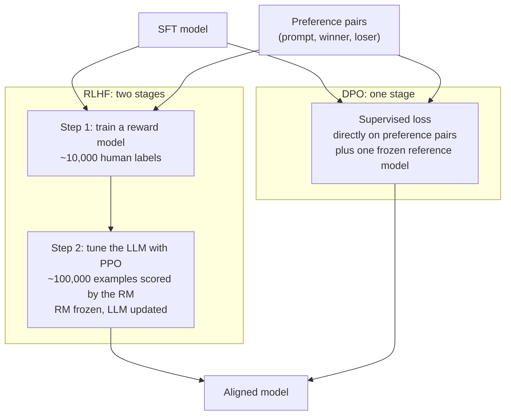

> 🌏 [中文版](/posts/ai/2026-09-29-cme295-preference-tuning)

**Video status: Videos included.** [Source details](#course-video-sources)

This post covers Lecture 5, "LLM tuning," of the 2025 edition of Stanford's [CME295](/posts/ai/2026-09-29-stanford-cme295-transformers-llms-en) (October 31, 2025). The main source is the [111-page slide deck](https://cme295.stanford.edu/slides/fall25-cme295-lecture5.pdf); the [recording](https://www.youtube.com/watch?v=PmW_TMQ3l0I) runs 1 hour 47 minutes if you want to follow along.

Every model in the first four lectures learned the same way: here is the right answer, copy it. This lecture switches to a different kind of training signal. It is the steepest step in the series, a jump from supervised learning straight into reinforcement learning, so we spend one section on why the jump is necessary before getting to any equations.

## Course video sources

The videos below come from Stanford Online’s official CME295 Autumn 2025 playlist; on 2026-10-10 the lecture title and video ID were checked live against the playlist and match.

```youtube
url: https://www.youtube.com/watch?v=PmW_TMQ3l0I
title: Stanford CME295 Transformers & LLMs | Autumn 2025 | Lecture 5 - LLM tuning
```

Original videos: [Stanford CME295 Transformers & LLMs | Autumn 2025 | Lecture 5 - LLM tuning](https://www.youtube.com/watch?v=PmW_TMQ3l0I)

Course and recording entries:

- [Official course / lecture source](https://cme295.stanford.edu/syllabus/2025/)
- [CME295 Autumn 2025 playlist (Stanford Online, 9 videos)](https://www.youtube.com/playlist?list=PLoROMvodv4rOCXd21gf0CF4xr35yINeOy)

Checked: 2026-10-10.

## Why SFT isn't enough

The slides open with a recap of the pipeline: pretraining gives a model "basic knowledge" of language, code, and so on; finetuning (SFT) tunes it for specific tasks; and this lecture's topic, preference tuning, makes it "align with (human) preferences."

Then comes a scenario. A user asks: "Suggest a new activity I could do with my teddy bear." The SFT model replies: "I'd suggest you do not spend much time with your teddy bear at all."

The grammar is fine and the tone is polite enough, but it is clearly not what the user wanted. The problem is that SFT has no lever for this. The SFT loss only pushes up the probability of good answers; it has no mechanism for pushing down a bad one like this. In the slides' words, the model may misbehave, and we need to "inject negative signals."

The approach is to collect **preference pairs**: one prompt, two responses, and a label saying which is better. Put the answer above next to "Of course! Teddy bears not only make awesome companions for a delightful sleep... How about you both watch a movie together?" and the second one wins.

The slides give three reasons for going this route instead of adding more SFT data:

- **Comparing is easier than generating**: asking a labeler whether A is better than B is much easier than asking them to write A from scratch
- **SFT is sensitive to data distribution**: it is easy to "mess up"
- **SFT doesn't scale well**: data quality matters a lot and good data is hard to get

The slides add a caveat: a misbehaving model can also be a wake-up call to go check the quality of your SFT data.

## What preference data looks like

An observation is a (prompt, response) pair. The slides show three ways to label them:

| Format | What gets labeled | Example |
|---|---|---|
| pointwise | one score per observation | Obs 1 = 0.4, Obs 2 = 0.9 |
| pairwise | two at a time | Obs 1 < Obs 2, Obs 1 > Obs 3 |
| listwise | a full ranking | Obs 2 first, Obs 1 second... |

The rest of the lecture uses pairwise data. The recipe has two steps:

1. **Generate two responses for the same prompt.** Prompts can come from logs or a reference distribution. Responses can be sampled from the SFT model with temperature above 0 (so the same prompt yields different outputs), or come from synthetic data or rewrites.
2. **Label which one is better.** Use human ratings, or proxies such as LLM-as-a-judge, BLEU, or ROUGE. The scale can be binary (better or worse) or more nuanced.

## Treating the LLM as a reinforcement learning agent

With preference data in hand, the next question is how to use it to tune the model. The slides map the LLM onto the standard RL setup:

- **state**: the input so far
- **action**: the next token
- **policy**: the probability of the next token, which is the LLM itself
- **reward**: human preference

The goal becomes: adjust the policy so what it produces matches human preferences. That is [RLHF](https://arxiv.org/abs/2203.02155) (Reinforcement Learning from Human Feedback). The slides cite OpenAI's InstructGPT paper (Ouyang et al., 2022) and split it into two steps:



## RLHF step 1: train a reward model

The reward model's job is to tell good from bad: given a prompt and a response, output a score. Feed it the two teddy bear answers, and "watch a movie together" should score high while "don't spend time with it" should score low.

How does it learn scores from comparisons like "A is better than B"? The slides use the [Bradley-Terry model](https://www.jstor.org/stable/2334029) from 1952: assume each response has a score, and the probability that A beats B depends on the **difference** between their scores. The bigger the gap, the closer that probability gets to 1; equal scores mean a coin flip. Training pushes the winner's score above the loser's.

The specs from the slides:

- **Data**: on the order of 10,000 observations (O(10,000)), labeled by human raters. The slides point out that this is where the "HF" in RLHF comes from
- **Model**: a pretrained LLM with a classification head in place of the next-token output layer; or an encoder-only model like BERT, projecting a score from the [CLS] position
- For evaluating reward models, the slides cite [RewardBench](https://arxiv.org/abs/2403.13787)

<details>
<summary>Formulas: Bradley-Terry and the reward model loss</summary>

```
p(y_i > y_j) = exp(r_i) / (exp(r_i) + exp(r_j)) = σ(r_i − r_j)

σ(x) = 1 / (1 + exp(−x))

L(θ) = −E[ log σ( r(x, ŷ_w) − r(x, ŷ_l) ) ]
```

- `r_i`, `r_j`: reward scores of the two responses
- `ŷ_w`: the winning response; `ŷ_l`: the losing response
- Passing the score difference through a sigmoid gives the probability that the winner really is better; the loss is its negative log, which makes this a binary classification problem

</details>

## RLHF step 2: change the weights with reinforcement learning

Step 2 freezes the reward model and uses it as a grader while the LLM trains: the LLM produces a response to a prompt, the reward model scores it, and RL updates the LLM's weights to penalize bad answers and promote good ones.

The specs from the slides:

- **Data**: on the order of 100,000 examples (O(100,000)), labeled by reward model scores, so no more humans needed
- **Model**: initialized at the SFT model
- **Objective**: maximize reward while **not deviating too far from the base model**

That second condition matters. The slides say it is there to avoid **reward hacking** and training instability. A reward model is only an approximation of human preference. A model that chases the score alone will quickly find its loopholes and produce answers that score high and read badly. So the objective adds a penalty: KL divergence measures how far the current model has drifted from the original SFT model, and the further it goes, the more it pays.

### PPO: the common choice

The slides name [PPO](https://arxiv.org/abs/1707.06347) (Proximal Policy Optimization, Schulman et al., 2017) as the most common RL algorithm here, with three details:

**One: PPO actually maximizes advantages, not rewards.** An advantage is roughly "reward minus a baseline." A score of 0.5 is a good result on a prompt that usually gets 0.2, and a regression on one that usually gets 0.9. The baseline comes from another model, the value function. The slides list its properties: it works at the token level; it estimates what the reward would be if you keep following the policy; it is trained jointly with the policy, with the reward as its label. For how to compute advantages, the slides suggest reading about [GAE](https://arxiv.org/abs/1506.02438) (Schulman et al., 2015).

**Two: the PPO-Clip variant.** Clip the probability ratio between the new and old policy to a small range so no single update changes too much.

**Three: the PPO-KL Penalty variant.** Instead of clipping the ratio, directly penalize the difference between the new and old policy distributions. The slides note that the original PPO paper computes this KL against the previous iteration's policy, while today it is usually computed against ref, the base model.

<details>
<summary>Formulas: the RLHF objective, PPO-Clip, PPO-KL Penalty</summary>

The RLHF objective (written on the slides as a loss to minimize):

```
L(θ) = −[ r(x, ŷ) − λ · KL( π_θ(ŷ|x) ‖ π_ref(ŷ|x) ) ]
```

- `r(x, ŷ)`: the reward model's score, to be maximized
- `KL(...)`: how far the current policy π_θ is from the base model π_ref; keep it small
- The 2025 final exam writes the coefficient as β; same meaning

PPO swaps the reward for an advantage:

```
Advantage ≈ Reward − Baseline      (baseline estimated by the value function)
```

PPO-Clip:

```
L^CLIP(θ) = Ê_t[ min( r_t(θ) · Â_t,  clip(r_t(θ), 1−ε, 1+ε) · Â_t ) ]

r_t(θ) = π_θ(a_t | s_t) / π_θ_old(a_t | s_t)
```

- Here `r_t(θ)` is the **probability ratio between new and old policy**, not a reward. The slides flag this notation as confusing
- `L^CLIP` is an objective to **maximize**, not a loss, despite the L
- When the advantage is positive, pushing the ratio past 1+ε earns nothing extra; when it is negative, pushing the ratio below 1−ε adds no further penalty

PPO-KL Penalty:

```
L^KLPEN(θ) = Ê_t[ (π_θ(a_t|s_t) / π_θ_old(a_t|s_t)) · Â_t − β · KL[ π_θ_old(·|s_t), π_θ(·|s_t) ] ]
```

- `θ_old`: the model from the previous RL iteration; `ref`: the base model

</details>

## PPO's bill, and a way out that skips RL

The slides are blunt about PPO's limitation: it **needs 4 models** at once, namely the policy being trained, the value function, the reward model, and the base model for the KL term. Then they ask: "Is it worth it?"

Alternative RL algorithms include REINFORCE, [GRPO](https://arxiv.org/abs/2402.03300) (from the DeepSeekMath paper), and many more. GRPO gets its own treatment in [Lecture 6](/posts/ai/2026-09-29-cme295-llm-reasoning-en).

Even with a different algorithm, the RL route shares a list of challenges. The slides give six:

- You have to train a reward model first, so it's a two-stage process
- Lots of hyperparameters to tune
- Training instability
- Hard to find a metric for monitoring training
- Completions need to be diverse
- "Not abundantly clear why preference tuning absolutely needs RL"

That last point is the turn of the whole lecture. Before getting to DPO, the slides show a fallback that involves no training at all: **Best-of-N (BoN)**. Have the SFT model generate several responses to one prompt, score them with the reward model, and keep the best. The slides' example has three responses: "watch a movie together" scores 0.8, "don't spend time with it" scores −2, and "take your teddy bear on a picnic in your backyard" scores 0.2. The first one wins.

BoN skips RL, but every inference now means generating N responses and scoring them, so the cost moves to inference time.

## DPO: turning preference pairs directly into a supervised loss

The slides motivate [DPO](https://arxiv.org/abs/2305.18290) (Direct Preference Optimization, Rafailov et al., 2023) with three points: RL has all the limitations above, BoN is costly at inference time, so "why don't we train in a supervised fashion?"

The DPO loss looks a lot like the reward model's Bradley-Terry loss. The difference is that the "score" is replaced by something specific: **how much more likely the model makes a response compared with the reference model** (as a log ratio, scaled by β). Training pushes this ratio up for the winning response and down for the losing one.

The benefits the slides list:

- No need to train a separate reward model; there is no `r(x, y)` in the formula at all
- Operates directly on preference data
- Same form as Bradley-Terry, just with a special kind of reward

Where does that special reward come from? The slides derive it from the PPO objective in five steps. The intuition goes like this. The KL-regularized RLHF objective has an optimal policy you can write in closed form. Rearrange that expression and the reward can be written as the probability ratio between the optimal policy and the reference model. Plug it back into Bradley-Terry and the reward model disappears. The DPO paper's subtitle, "Your Language Model is Secretly a Reward Model," is saying exactly this.

<details>
<summary>Formulas: the DPO loss and the five-step derivation</summary>

```
L_DPO(π_θ; π_ref) = −E_(x, y_w, y_l)~D [ log σ( β·log(π_θ(y_w|x) / π_ref(y_w|x))
                                              − β·log(π_θ(y_l|x) / π_ref(y_l|x)) ) ]
```

Treat `β·log(π_θ(y|x) / π_ref(y|x))` as `r_θ(x, y)` and it becomes:

```
L_DPO = −E[ log σ( r_θ(x, y_w) − r_θ(x, y_l) ) ]
```

The same shape as the reward model loss.

The five steps (slide headings):

1. Start from the PPO objective: maximize reward minus β times KL(π ‖ π_ref)
2. Derive the optimal policy. The DPO paper gives
   `π*(y|x) = (1 / Z(x)) · π_ref(y|x) · exp( r(x, y) / β )`, where Z(x) is a normalizing constant
3. Identify a "reward" term by rearranging:
   `r*(x, y) = β·log( π*(y|x) / π_ref(y|x) ) + β·log Z(x)`
4. Write the Bradley-Terry formulation for this reward. The winner and loser share the same x, so `β·log Z(x)` cancels out
5. Replace π* with π_θ to "infer" the DPO loss above

</details>

### PPO or DPO?

| | PPO-based RLHF | DPO |
|---|---|---|
| Training | multi-stage | supervised learning |
| Extra models | reward model, value model, base model | base model only |
| Performance | no consensus; varies by task and is sensitive to implementation | same |

For the performance row, the slides cite [Xu et al., 2024](https://arxiv.org/abs/2404.10719), "Is DPO Superior to PPO for LLM Alignment?", whose takeaway is that there is no absolute winner.

## Connecting back to the models you use

The slides close with one question: "Can I put my teddy bear in the washer?"

- Pretrained + instruction-tuned LLM: "No, it might get damaged. Try hand washing instead."
- Add preference tuning: "It's better not to. Your teddy could get hurt! A gentle hand wash is safer."

Both give the same advice; what changes is the tone. The slides don't elaborate, but the contrast shows the most noticeable effect of preference tuning. When the chat model you use every day sounds considerate, a good part of that was tuned in at this step, not inherited from pretraining or SFT.

## What changed in 2026

So far the 2026 edition has only released slides for Lecture 1. What follows compares topic lists on the [2026 syllabus](https://cme295.stanford.edu/syllabus/); details will have to wait for the slides.

In 2025 this was a standalone lecture, "LLM tuning." The 2026 edition splits it in two:

- **Lecture 3, "LLM training" (2026-10-09)**: preference tuning (RLHF, DPO) becomes one bullet, sharing the lecture with pretraining, SFT, LoRA, reasoning, on-policy distillation, and distillation to smaller models
- **Lecture 4, "Reinforcement learning with LLMs" (2026-10-16)**: a new full lecture covering mathematical conventions, reward design, policy gradients, limitations, preference tuning with PPO (RLHF), reasoning with GRPO (RLVR), and on-policy distillation

Judging by the bullets, the RL material that 2025 spread across Lecture 5 (PPO) and Lecture 6 (GRPO) is now in one place, with mathematical conventions and policy gradients laid down first. That fills in the steepest part of this lecture: the 2025 slides hand you the PPO objective directly, without building up from policy gradients.

## Self-check

These are paraphrased from Section I, "LLM tuning," of the [2025 final exam](https://cme295.stanford.edu/exams/fall25-cme295-final.pdf). Answers are in the [solutions PDF](https://cme295.stanford.edu/exams/fall25-cme295-final-solutions.pdf):

1. Which gap in SFT is preference tuning designed to fill? (Q1)
2. What does the Bradley-Terry model compute in reward modeling? (Q3)
3. What is the −βKL(π_θ ‖ π_ref) term in the PPO objective for? (Q4)
4. What is DPO's key theoretical insight, and why does it let a supervised loss replace RL? (Q5)
5. What does the value function estimate in PPO? (Q8)
6. In terms of how many models must be loaded during training, where does DPO save over PPO? Give one reason you might still choose PPO. (Q10)

## Going deeper

- How another course covers the same ground: [CS224N Lecture 8: from instruction tuning and RLHF to DPO](/posts/ai/2026-08-22-cs224n-post-training-en)
- A more implementation- and data-focused take: [CS336 Lecture 15: SFT and RLHF](/posts/ai/2026-08-22-cs336-sft-rlhf-en)
- What comes after PPO: [CS336 Lecture 16: RLVR and GRPO](/posts/ai/2026-08-22-cs336-rlvr-en), and [Lecture 6: reasoning](/posts/ai/2026-09-29-cme295-llm-reasoning-en) in this series
- RL fundamentals, deriving policy gradients and actor-critic from scratch: [Berkeley CS285 L5–10](/posts/learning/2026-08-22-berkeley-cs285-policy-value-methods-en)

## Update Log

- 2026-10-10: Added explicit video status and checked recording sources and access notes.
- 2026-10-10: Rechecked video status. Checked live against the Stanford Online CME295 Autumn 2025 playlist; lecture and video ID match, so the status is now videos included.

## References

- [CME 295 2025 syllabus](https://cme295.stanford.edu/syllabus/2025/)
- [2025 Lecture 5 slides (PDF)](https://cme295.stanford.edu/slides/fall25-cme295-lecture5.pdf)
- [2025 Lecture 5 recording](https://www.youtube.com/watch?v=PmW_TMQ3l0I)
- [CME 295 2026 syllabus](https://cme295.stanford.edu/syllabus/)
- [2025 final exam](https://cme295.stanford.edu/exams/fall25-cme295-final.pdf) / [solutions](https://cme295.stanford.edu/exams/fall25-cme295-final-solutions.pdf)
- [Ouyang et al., Training language models to follow instructions with human feedback (2022)](https://arxiv.org/abs/2203.02155)
- [Bradley & Terry, Rank Analysis of Incomplete Block Designs: I. The Method of Paired Comparisons (1952)](https://www.jstor.org/stable/2334029)
- [Lambert et al., RewardBench: Evaluating Reward Models for Language Modeling (2024)](https://arxiv.org/abs/2403.13787)
- [Schulman et al., Proximal Policy Optimization Algorithms (2017)](https://arxiv.org/abs/1707.06347)
- [Schulman et al., High-Dimensional Continuous Control Using Generalized Advantage Estimation (2015)](https://arxiv.org/abs/1506.02438)
- [Shao et al., DeepSeekMath (2024)](https://arxiv.org/abs/2402.03300)
- [Rafailov et al., Direct Preference Optimization: Your Language Model is Secretly a Reward Model (2023)](https://arxiv.org/abs/2305.18290)
- [Xu et al., Is DPO Superior to PPO for LLM Alignment? A Comprehensive Study (2024)](https://arxiv.org/abs/2404.10719)
- [Reading Stanford CME295 (series overview)](/posts/ai/2026-09-29-stanford-cme295-transformers-llms-en)
