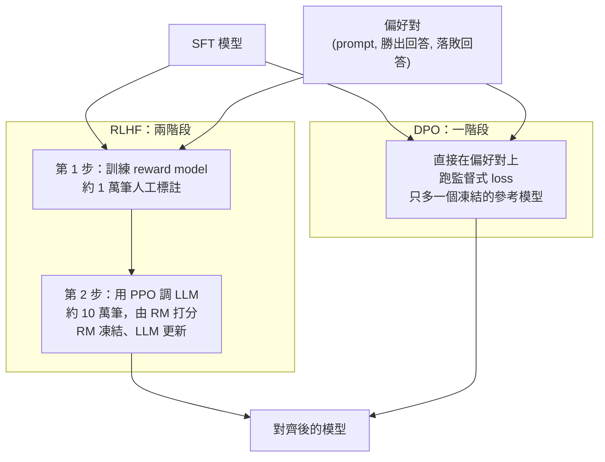

> 🌏 [English version](/posts/ai/2026-09-29-cme295-preference-tuning-en)

本篇對應 Stanford [CME295](/posts/ai/2026-09-29-stanford-cme295-transformers-llms) 2025 版第 5 講「LLM tuning」（2025 年 10 月 31 日）。主要來源是 [111 頁投影片](https://cme295.stanford.edu/slides/fall25-cme295-lecture5.pdf)，[錄影](https://www.youtube.com/watch?v=PmW_TMQ3l0I)長 1 小時 47 分，可以對照著看。

前四講的模型都用同一種方式學東西：給正確答案，叫它照著寫。這一講要換一種訓練訊號。整個系列在這裡的落差最大，從監督式學習一口氣跳到強化學習，所以先花一節說清楚為什麼非跳不可，再進公式。

## 課程影片來源

下列影片連結已列於本文對應講次的來源。

```youtube
url: https://www.youtube.com/watch?v=PmW_TMQ3l0I
title: 2025 版第 5 講錄影
```

原始影片：[2025 版第 5 講錄影](https://www.youtube.com/watch?v=PmW_TMQ3l0I)

課程與錄影入口：

- [官方課程／講次來源](https://cme295.stanford.edu/syllabus/2025/)

## 為什麼 SFT 不夠

投影片開場先回顧流程：預訓練讓模型有語言和程式的「基本知識」，微調（SFT）讓它會做特定任務，這一講的 preference tuning 則讓它「對齊人的偏好」。

接著是一個場景。使用者問：「Suggest a new activity I could do with my teddy bear.」（推薦我跟泰迪熊一起做的新活動。）SFT 過的模型回答：「I'd suggest you do not spend much time with your teddy bear at all.」（我建議你別花太多時間陪泰迪熊。）

文法沒錯、語氣也算客氣，但顯然不是使用者要的。問題是 SFT 拿它沒辦法。SFT 的 loss 只會把「好答案」的機率往上推，沒有機制把這種壞答案的機率往下壓。投影片的說法是：模型可能會亂來，我們需要「注入負面訊號」。

做法是收集**偏好對**：同一個 prompt 配兩個回答，標出哪個比較好。例如把上面那句和「當然！泰迪熊不只是很棒的睡覺夥伴……你們要不要一起看部電影？」放在一起，後者勝出。

投影片列了三個理由，說明為什麼要走這條路，而不是繼續加 SFT 資料：

- **比較比生成容易**：叫標註者判斷 A 比 B 好，比叫他從頭寫出 A 簡單得多
- **SFT 對資料分布很敏感**：一不小心就「搞砸」
- **SFT 難以擴大規模**：資料品質很重要，高品質資料又很難取得

投影片也補了一句提醒：模型亂回答，有時也是一記警鐘，該回頭檢查 SFT 資料的品質。

## 偏好資料長什麼樣

一筆觀察是一組（prompt, response）。投影片把標註方式分成三種：

| 形式 | 標什麼 | 例子 |
|---|---|---|
| pointwise | 每筆一個分數 | Obs 1 = 0.4、Obs 2 = 0.9 |
| pairwise | 兩兩比較 | Obs 1 < Obs 2、Obs 1 > Obs 3 |
| listwise | 整批排名 | Obs 2 第 1、Obs 1 第 2…… |

本講後面全部用 pairwise。取得 pairwise 資料的食譜有兩步：

1. **對同一個 prompt 產生兩個回答**。prompt 可以來自使用紀錄或參考分布；回答可以用 SFT 模型在溫度大於 0 的設定下抽樣（同一個 prompt 才會得到不同回答），也可以用合成資料或改寫。
2. **標出哪個比較好**。可以找人評分，也可以用代理指標，例如 LLM-as-a-judge、BLEU、ROUGE。量尺可以是二元的（好或壞），也可以更細。

## 把 LLM 看成強化學習裡的 agent

有了偏好資料，下一個問題是怎麼用它調模型。投影片把 LLM 套進強化學習的標準框架：

- **state**：到目前為止的輸入
- **action**：下一個 token
- **policy**：下一個 token 的機率分布，也就是 LLM 本身
- **reward**：人類偏好

目標變成：調整 policy，讓它產生的東西符合人類偏好。這就是 [RLHF](https://arxiv.org/abs/2203.02155)（Reinforcement Learning from Human Feedback）。投影片引用的是 OpenAI 的 InstructGPT 論文（Ouyang et al., 2022），分成兩步：



## RLHF 第一步：訓練 reward model

reward model 的工作是分辨好壞：輸入一組 prompt 和回答，輸出一個分數。泰迪熊那兩個回答丟進去，「一起看電影」要拿高分，「別陪它」要拿低分。

它怎麼從「A 比 B 好」這種比較資料學出分數？投影片用 1952 年的 [Bradley-Terry 模型](https://www.jstor.org/stable/2334029)：假設每個回答有一個分數，A 勝過 B 的機率由兩者分數的**差**決定。差越大，勝出機率越接近 1；分數一樣就是五五波。訓練時就讓勝出回答的分數盡量高過落敗回答。

投影片給的規格：

- **資料**：約 1 萬筆（O(10,000)）觀察，標籤是人工評分。投影片特別點出，RLHF 的「HF」指的就是這一步
- **模型**：拿預訓練 LLM 接一個分類頭，取代原本預測下一個 token 的輸出層；也可以用 BERT 這類 encoder-only 模型，從 [CLS] 位置投影出分數
- 評估 reward model 好不好，投影片引了 [RewardBench](https://arxiv.org/abs/2403.13787)

<details>
<summary>公式：Bradley-Terry 與 reward model 的 loss</summary>

```
p(y_i > y_j) = exp(r_i) / (exp(r_i) + exp(r_j)) = σ(r_i − r_j)

σ(x) = 1 / (1 + exp(−x))

L(θ) = −E[ log σ( r(x, ŷ_w) − r(x, ŷ_l) ) ]
```

- `r_i`、`r_j`：兩個回答的 reward 分數
- `ŷ_w`：勝出（winner）的回答；`ŷ_l`：落敗（loser）的回答
- 分數差代進 sigmoid，就是「勝出回答真的比較好」的機率；loss 取負對數，等於在做二元分類

</details>

## RLHF 第二步：用強化學習改模型權重

第二步把 reward model 凍結起來當評分員，換 LLM 上場訓練：LLM 對 prompt 產生回答，reward model 打分，再用強化學習改 LLM 的權重，壓低壞回答、推高好回答。

投影片給的規格：

- **資料**：約 10 萬筆（O(100,000)），標籤是 reward model 打的分數，不用再找人
- **模型**：從 SFT 模型出發
- **目標**：最大化 reward，同時**不要離原本的模型太遠**

第二個條件很關鍵。投影片說它是為了避免兩件事：**reward hacking** 和訓練不穩定。reward model 只是人類偏好的近似，模型如果只顧衝高分，很快就會找到它的漏洞，產出分數很高、品質很差的回答。所以目標裡要加一項懲罰，用 KL divergence 量「現在的模型和原本的 SFT 模型差多遠」，差越多扣越多。

### PPO：最常用的演算法

投影片說最常用的 RL 演算法是 [PPO](https://arxiv.org/abs/1707.06347)（Proximal Policy Optimization, Schulman et al., 2017），並補充了三個細節：

**一、PPO 最大化的其實是 advantage，不是 reward。** advantage 約等於「reward 減掉一個基準值」。同樣拿 0.5 分，如果這題平常只拿 0.2，這次就算表現好；平常拿 0.9，這次就是退步。這個基準值由另一個模型 value function 估計。投影片列出它的特性：在 token 層級運作；估的是「照目前 policy 走下去會拿多少 reward」；和 policy 一起訓練，標籤就是 reward。怎麼算 advantage，投影片推薦讀 [GAE](https://arxiv.org/abs/1506.02438)（Schulman et al., 2015）。

**二、變體 PPO-Clip。** 把新舊 policy 的機率比值夾在一個小範圍內，避免單次更新改太多。

**三、變體 PPO-KL Penalty。** 不夾比值，改成直接懲罰新舊 policy 分布的差距。投影片註明：原始 PPO 論文裡的 KL 是對「上一輪的 policy」算，現在的做法多半改成對 ref（base model）算。

<details>
<summary>公式：RLHF 目標、PPO-Clip、PPO-KL Penalty</summary>

RLHF 的目標（投影片寫成要最小化的 loss）：

```
L(θ) = −[ r(x, ŷ) − λ · KL( π_θ(ŷ|x) ‖ π_ref(ŷ|x) ) ]
```

- `r(x, ŷ)`：reward model 打的分數，要最大化
- `KL(...)`：現在的 policy π_θ 和 base model π_ref 差多遠，不能太遠
- 2025 期末考把係數寫成 β，意思一樣

PPO 把 reward 換成 advantage：

```
Advantage ≈ Reward − Baseline      （Baseline 由 value function 估計）
```

PPO-Clip：

```
L^CLIP(θ) = Ê_t[ min( r_t(θ) · Â_t,  clip(r_t(θ), 1−ε, 1+ε) · Â_t ) ]

r_t(θ) = π_θ(a_t | s_t) / π_θ_old(a_t | s_t)
```

- `r_t(θ)` 在這裡是**新舊 policy 的機率比值**，不是 reward。投影片特別提醒這個記號容易混淆
- `L^CLIP` 是要**最大化**的目標函數，不是 loss，名字裡的 L 也容易讓人誤會
- advantage 為正時，比值超過 1+ε 就不再給更多獎勵；為負時，比值低於 1−ε 就不再加重懲罰

PPO-KL Penalty：

```
L^KLPEN(θ) = Ê_t[ (π_θ(a_t|s_t) / π_θ_old(a_t|s_t)) · Â_t − β · KL[ π_θ_old(·|s_t), π_θ(·|s_t) ] ]
```

- `θ_old`：上一輪 RL 迭代的模型；`ref`：base model

</details>

## PPO 的帳單，以及不做 RL 的退路

PPO 的限制，投影片寫得很直接：**同時要 4 個模型**，分別是正在訓練的 policy、value function、reward model、當 KL 基準的 base model。然後問了一句：「值得嗎？」

替代的 RL 演算法有 REINFORCE、[GRPO](https://arxiv.org/abs/2402.03300)（出自 DeepSeekMath 論文）等等。GRPO 會在[第 6 講](/posts/ai/2026-09-29-cme295-llm-reasoning)細談。

即使換演算法，RL 路線還有一串共同難題，投影片列了六條：

- 要先訓練 reward model，整個流程是兩階段
- 超參數很多
- 訓練不穩定
- 很難找到監控訓練進度的指標
- 產出的回答需要有多樣性
- 「不太清楚 preference tuning 為什麼一定要用 RL」

最後一條是整講的轉折點。在介紹 DPO 之前，投影片先示範一個完全不訓練的退路：**Best-of-N（BoN）**。同一個 prompt 讓 SFT 模型產生多個回答，用 reward model 打分，挑最高分的那個。投影片的例子是三個回答：「一起看電影」得 0.8、「別陪它」得 −2、「帶泰迪熊去後院野餐」得 0.2，選第一個。

BoN 跳過了 RL，但每次推論都要生成 N 個回答再打分，成本搬到了推論端。

## DPO：把偏好對直接變成監督式 loss

投影片給 [DPO](https://arxiv.org/abs/2305.18290)（Direct Preference Optimization, Rafailov et al., 2023）的動機有三條：RL 有上面那串限制、BoN 在推論時太貴，那「為什麼不用監督式的方式訓練？」

DPO 的 loss 長得很像 reward model 的 Bradley-Terry loss，差別在「分數」換成了一個特別的東西：**模型對某個回答的機率，比參考模型高出多少**（取對數再乘上 β）。訓練時就讓勝出回答的這個比值拉高、落敗回答的壓低。

投影片列出的好處：

- 不用另外訓練 reward model，公式裡根本沒有 `r(x, y)`
- 直接在偏好資料上運作
- 形式上跟 Bradley-Terry 一樣，只是用了一種特殊的 reward

這個「特殊的 reward」怎麼來？投影片分五步從 PPO 目標推出來。直覺是這樣：帶 KL 懲罰的 RLHF 目標，最佳 policy 可以直接寫成解析解。把式子反過來，reward 就能用「最佳 policy 和參考模型的機率比」表示。代回 Bradley-Terry，reward model 就消失了。DPO 論文的副標題「Your Language Model is Secretly a Reward Model」講的就是這件事。

<details>
<summary>公式：DPO loss 與五步推導</summary>

```
L_DPO(π_θ; π_ref) = −E_(x, y_w, y_l)~D [ log σ( β·log(π_θ(y_w|x) / π_ref(y_w|x))
                                              − β·log(π_θ(y_l|x) / π_ref(y_l|x)) ) ]
```

把 `β·log(π_θ(y|x) / π_ref(y|x))` 看成 `r_θ(x, y)`，就變成：

```
L_DPO = −E[ log σ( r_θ(x, y_w) − r_θ(x, y_l) ) ]
```

跟 reward model 的 loss 同一個形狀。

推導五步（投影片標題）：

1. 從 PPO 目標出發：最大化 reward，減掉 β 倍的 KL(π ‖ π_ref)
2. 推出最佳 policy。DPO 論文給的解是
   `π*(y|x) = (1 / Z(x)) · π_ref(y|x) · exp( r(x, y) / β )`，Z(x) 是正規化常數
3. 找出「reward」項：把上式移項
   `r*(x, y) = β·log( π*(y|x) / π_ref(y|x) ) + β·log Z(x)`
4. 把這個 reward 代進 Bradley-Terry。勝出和落敗回答用的是同一個 x，`β·log Z(x)` 相減後消掉
5. 用 π_θ 取代 π*，得到上面的 DPO loss

</details>

### 選 PPO 還是 DPO

| | PPO 路線的 RLHF | DPO |
|---|---|---|
| 訓練流程 | 多階段 | 監督式學習 |
| 額外模型 | reward model、value model、base model | 只多一個 base model |
| 效果 | 沒有共識，依任務而定，對實作細節敏感 | 同左 |

效果那一列，投影片引了 [Xu et al., 2024](https://arxiv.org/abs/2404.10719)〈Is DPO Superior to PPO for LLM Alignment?〉，結論是沒有絕對的贏家。

## 連回你用的模型

投影片最後用一個問題收尾：「Can I put my teddy bear in the washer?」（泰迪熊可以丟洗衣機嗎？）

- 預訓練＋指令微調的模型：「No, it might get damaged. Try hand washing instead.」（不行，可能會壞，改用手洗。）
- 再加上偏好微調：「It's better not to. Your teddy could get hurt! A gentle hand wash is safer.」（最好不要。你的泰迪熊可能會受傷！輕輕手洗比較安全。）

兩個答案給的建議一樣，差在口氣。投影片沒有多做解釋，但這個對照點出了偏好微調最容易察覺的效果。你每天用的聊天模型回答得比較體貼，很大一部分是這一步調出來的，不是預訓練或 SFT 就有的。

## 2026 版改了什麼

2026 版目前只釋出第 1 講的投影片，以下只根據 [2026 課表](https://cme295.stanford.edu/syllabus/)的主題清單比對，細節要等投影片上架才能確認。

2025 版這一講是獨立的「LLM tuning」。2026 版把它拆成兩半：

- **第 3 講「LLM training」（2026-10-09）**：preference tuning（RLHF、DPO）變成一個條目，跟預訓練、SFT、LoRA、reasoning、on-policy distillation、distillation to smaller models 擠在同一講
- **第 4 講「Reinforcement learning with LLMs」（2026-10-16）**：新增的整講，條目是數學記號、reward design、policy gradients、limitations、用 PPO 做 preference tuning（RLHF）、用 GRPO 做 reasoning（RLVR）、on-policy distillation

從條目看，2025 版分散在第 5 講（PPO）和第 6 講（GRPO）的 RL 內容，2026 版集中到同一講，而且前面多了數學記號和 policy gradient 的鋪陳。這正好補上本講最陡的那一段：2025 版投影片直接給 PPO 目標，沒有從 policy gradient 推起。

## 自我檢測

以下題目改寫自 [2025 期末考](https://cme295.stanford.edu/exams/fall25-cme295-final.pdf)第 I 大題「LLM tuning」，答案在[解答 PDF](https://cme295.stanford.edu/exams/fall25-cme295-final-solutions.pdf)：

1. preference tuning 要補的是 SFT 的哪一個缺口？（第 1 題）
2. Bradley-Terry 模型在 reward modeling 裡負責算什麼？（第 3 題）
3. PPO 目標裡的 −βKL(π_θ ‖ π_ref) 那一項是做什麼用的？（第 4 題）
4. DPO 的關鍵理論洞見是什麼？為什麼它能用監督式 loss 取代 RL？（第 5 題）
5. PPO 的 value function 在估計什麼？（第 8 題）
6. 從訓練時要載入幾個模型的角度，說明 DPO 比 PPO 省在哪裡；再舉一個仍然選 PPO 的理由。（第 10 題）

## 想深入

- 另一門課怎麼講同一段：[CS224N 第 8 講：從 instruction tuning、RLHF 到 DPO](/posts/ai/2026-08-22-cs224n-post-training)
- 更偏實作與資料的角度：[CS336 Lecture 15：SFT 與 RLHF](/posts/ai/2026-08-22-cs336-sft-rlhf)
- PPO 之後的下一步：[CS336 Lecture 16：RLVR 與 GRPO](/posts/ai/2026-08-22-cs336-rlvr)，以及本系列[第 6 講：推理](/posts/ai/2026-09-29-cme295-llm-reasoning)
- 補 RL 基礎，把 policy gradient 和 actor-critic 從頭推一遍：[Berkeley CS285 L5–10](/posts/learning/2026-08-22-berkeley-cs285-policy-value-methods)

## 更新紀錄

- 2026-10-10：補上課程影片來源與錄影取得方式。

## 參考資料

- [CME 295 2025 版課表](https://cme295.stanford.edu/syllabus/2025/)
- [2025 版第 5 講投影片（PDF）](https://cme295.stanford.edu/slides/fall25-cme295-lecture5.pdf)
- [2025 版第 5 講錄影](https://www.youtube.com/watch?v=PmW_TMQ3l0I)
- [CME 295 2026 版課表](https://cme295.stanford.edu/syllabus/)
- [2025 期末考](https://cme295.stanford.edu/exams/fall25-cme295-final.pdf)／[解答](https://cme295.stanford.edu/exams/fall25-cme295-final-solutions.pdf)
- [Ouyang et al., Training language models to follow instructions with human feedback (2022)](https://arxiv.org/abs/2203.02155)
- [Bradley & Terry, Rank Analysis of Incomplete Block Designs: I. The Method of Paired Comparisons (1952)](https://www.jstor.org/stable/2334029)
- [Lambert et al., RewardBench: Evaluating Reward Models for Language Modeling (2024)](https://arxiv.org/abs/2403.13787)
- [Schulman et al., Proximal Policy Optimization Algorithms (2017)](https://arxiv.org/abs/1707.06347)
- [Schulman et al., High-Dimensional Continuous Control Using Generalized Advantage Estimation (2015)](https://arxiv.org/abs/1506.02438)
- [Shao et al., DeepSeekMath (2024)](https://arxiv.org/abs/2402.03300)
- [Rafailov et al., Direct Preference Optimization: Your Language Model is Secretly a Reward Model (2023)](https://arxiv.org/abs/2305.18290)
- [Xu et al., Is DPO Superior to PPO for LLM Alignment? A Comprehensive Study (2024)](https://arxiv.org/abs/2404.10719)
- [Stanford CME295 導讀（本系列總覽）](/posts/ai/2026-09-29-stanford-cme295-transformers-llms)
