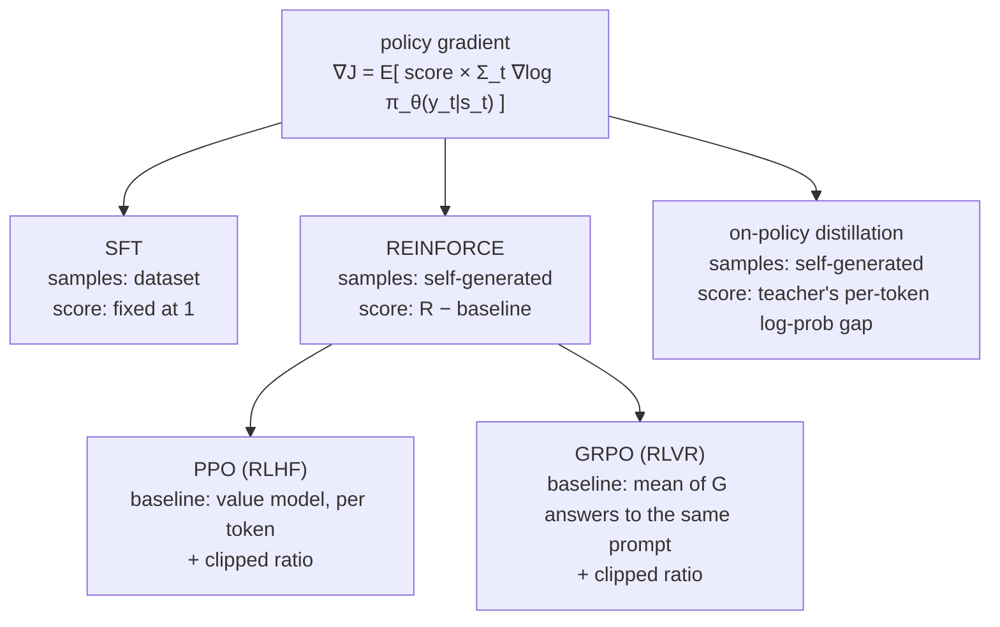

> 🌏 [中文版](/posts/ai/2026-09-29-cme295-rl-with-llms)

**Video status: Related supplementary video included; the original lecture recording has not been verified.** [Source details](#course-video-sources)

> **Pre-lecture edition**: This post was written on September 29, 2026, before 2026 Lecture 4 (October 16, 2026) has been taught. It is based on the 2026 syllabus topic list, material the 2025 slides already covered, and the original papers. It will be checked against the video and slides once they are posted.

This is post 11 in the Stanford [CME295](/posts/ai/2026-09-29-stanford-cme295-transformers-llms-en) series, covering Lecture 4, "Reinforcement learning with LLMs," which is new in 2026. The [2026 syllabus](https://cme295.stanford.edu/syllabus/) (checked 2026-09-29) lists seven items for it:

1. Mathematical conventions
2. Reward design
3. Policy gradients
4. Limitations
5. Preference tuning with PPO (RLHF)
6. Reasoning with GRPO (RLVR)
7. On-policy distillation

The lecture sits after Lecture 3, "LLM training," and before the midterm. 2025 had no such lecture: PPO was in Lecture 5 and GRPO in Lecture 6, and both handed you the objective without deriving it from the policy gradient. [Post 5 (preference tuning)](/posts/ai/2026-09-29-cme295-preference-tuning-en) and [post 6 (reasoning)](/posts/ai/2026-09-29-cme295-llm-reasoning-en) of this series already cover the intuition for the RLHF pipeline, reward models, DPO, and the R1 recipe, and left the full derivation for this post. So this post does one thing: connect the math from start to finish.

The punchline first. Reading posts 5 and 6, the PPO and GRPO formulas look like two unrelated long expressions. Derive them once and SFT, REINFORCE, PPO, GRPO, and on-policy distillation all turn out to share a shape: **the gradient of the model's log-probability of a token, times a score**. The five methods differ in only two things: where the samples come from, and how the score is computed.

Each section below gives the intuition first, with formulas tucked into expandable blocks. Anything marked "2025 slides" comes from the [2025 Lecture 5](https://cme295.stanford.edu/slides/fall25-cme295-lecture5.pdf) or [Lecture 6](https://cme295.stanford.edu/slides/fall25-cme295-lecture6.pdf) slides; the rest comes from the original papers, linked inline.

## Course video sources

This article is a pre-written guide to CME295 2026 Lecture 4 (Reinforcement learning with LLMs, October 16). The official 2026 syllabus, read on 2026-10-10, still marks that lecture "Coming soon", so the original lecture recording is not yet available. The videos below are the public 2025 Lecture 5 (LLM tuning, with PPO) and Lecture 6 (LLM reasoning, with GRPO); the 2025 course had no standalone RL lecture, so they are included only as related background and are not the 2026 Lecture 4 recording.

```youtube
url: https://www.youtube.com/watch?v=PmW_TMQ3l0I
title: Stanford CME295 Transformers & LLMs | Autumn 2025 | Lecture 5 - LLM tuning
```

```youtube
url: https://www.youtube.com/watch?v=k5Fh-UgTuCo
title: Stanford CME295 Transformers & LLMs | Autumn 2025 | Lecture 6 - LLM Reasoning
```

Original videos: [Stanford CME295 Transformers & LLMs | Autumn 2025 | Lecture 5 - LLM tuning](https://www.youtube.com/watch?v=PmW_TMQ3l0I), [Stanford CME295 Transformers & LLMs | Autumn 2025 | Lecture 6 - LLM Reasoning](https://www.youtube.com/watch?v=k5Fh-UgTuCo)

Course and recording entries:

- [Official course / lecture source](https://cme295.stanford.edu/syllabus/2025/)
- [CME295 Autumn 2025 playlist (Stanford Online, 9 videos)](https://www.youtube.com/playlist?list=PLoROMvodv4rOCXd21gf0CF4xr35yINeOy)

Checked: 2026-10-10.

## 1. Mathematical conventions: writing "generate an answer" as RL

The 2025 slides (Lecture 5, pp. 23–28) already gave the mapping. The agent is the LLM, the state is "the input so far," and the action is "the next token." The policy is "the probability distribution of the next token," and the reward is human preference. This section just turns that table into symbols that every later formula uses.

Two things are worth fixing in mind. First, this "environment" is very simple: pick the next token and the next state is the old one with that token appended, with no randomness. Second, the reward usually arrives once, when the whole answer is done. Whether the answer is 20 tokens or 2,000, the model gets a single score at the end. Many of the limitations later trace back to this.

The 2025 slides (Lecture 5, pp. 67–68) also flagged two confusing symbols. In the PPO paper, `r_t` is the ratio of new to old policy probabilities, not a reward. And `L^CLIP` is an objective to maximize, not a loss. To avoid that trap, this post writes the ratio as `ρ` and the reward as `R` or `r`.

<details>
<summary>Formulas: RL notation for LLMs</summary>

```
x                     prompt
y = (y_1, …, y_T)     the model's answer, one token per step
s_t = (x, y_<t)       state: prompt plus tokens generated so far
a_t = y_t             action: the next token
π_θ(a_t | s_t)        policy: the LLM's softmax over the next token

Probability of a whole answer:
π_θ(y | x) = Π_t π_θ(y_t | x, y_<t)

Deterministic transition: s_{t+1} = s_t with a_t appended
Reward: R(x, y), usually given only at the last token

Objective: maximize expected reward
J(θ) = E_{x~D} E_{y~π_θ(·|x)} [ R(x, y) ]
```

- Treating the whole answer `y` as one action is the "sequence-level" view; one token per step is the "token-level" view. With a single terminal reward and no discounting (γ = 1), the two give the same gradient
- This post uses `ρ_t = π_θ / π_old` for the ratio, avoiding the PPO paper's clash with `r_t`

</details>

## 2. Reward design: where the score comes from

RL sees only the score, so how you score nearly decides what the model learns. Pulling together the sources used in earlier posts and in this one, there are roughly four kinds:

| Source | Example | Density | Main risk |
|---|---|---|---|
| Learned reward model | The Bradley-Terry model in RLHF (see [post 5](/posts/ai/2026-09-29-cme295-preference-tuning-en)) | One per answer | Reward hacking: the model finds holes in the grader |
| Rule-based verification | Is the answer right, do tests pass, is the `<think>` format there (see [post 6](/posts/ai/2026-09-29-cme295-llm-reasoning-en)) | One per answer | Only works when answers can be checked automatically |
| KL penalty | Subtract more the further you drift from a reference model | Every token | Too large and nothing is learned; too small and hacking gets through |
| Teacher log-probs | On-policy distillation | Every token | Needs a strong enough teacher whose log-probs you can query |

RL with rule-checked rewards later got a name, RLVR. The term comes from AI2's [Tülu 3 report](https://arxiv.org/abs/2411.15124): Reinforcement Learning with Verifiable Rewards. The syllabus labels the GRPO item "RLVR," using that term.

The density column matters. With a single score at the end, the model knows "this attempt was bad overall" but not which step went wrong. [Thinking Machines Lab](https://thinkingmachines.ai/blog/on-policy-distillation/) puts it as: RL teaches only a fixed number of bits per episode, regardless of how long the answer is. On-policy distillation in section 7 moves the score from "one per answer" to "one per token."

<details>
<summary>Formulas: four ways to write the reward</summary>

```
Learned reward model (Bradley-Terry, post 5):
  R(x, y) = r_φ(x, y)

Rule-based verification (DeepSeek-R1's two terms, post 6):
  R(x, y) = 1[format correct] + 1[answer correct]

KL penalty spread over tokens (common in InstructGPT and PPO):
  r_t = r_φ(x, y) · 1[t = T]  −  β · log( π_θ(y_t | s_t) / π_ref(y_t | s_t) )

Teacher scores every token (on-policy distillation, section 7):
  r_t = −( log π_θ(y_t | s_t) − log π_teacher(y_t | s_t) )
```

- The third form is equation (2) in [DeepSeekMath](https://arxiv.org/abs/2402.03300), which cites [InstructGPT](https://arxiv.org/abs/2203.02155). The reward model scores only the last token; the KL penalty applies at every token
- The fourth has almost the same shape as the third, with `π_ref` swapped for `π_teacher`. Thinking Machines says their implementation was a one-line change on top of an RL setup with KL regularization: swap the regularizer model

</details>

## 3. Policy gradients: one formula behind every method

The goal is to maximize expected reward `J(θ)`. The catch is that the reward comes from "sample some text, then grade it," and the sampling step can't be differentiated directly. The policy gradient gets around this with a small trick, `∇π = π · ∇log π`. Apply it and the gradient becomes an expectation you can estimate by sampling:

> Sample an answer, compute its score, then push up the log-probability of every token in that answer, with strength equal to the score.

High-scoring answers get pushed up; a negative score pushes down. This is [REINFORCE, introduced by Williams in 1992](https://link.springer.com/article/10.1007/BF00992696).

Setting this next to SFT shows what it means. The SFT loss is the negative log-probability of each token in the dataset, so its gradient pushes log-probabilities up with a fixed strength of 1. In other words, **SFT is a policy gradient whose score is always 1 and whose samples come from a dataset**. Section 5.2 of the DeepSeekMath paper writes SFT, rejection sampling, DPO, PPO, and GRPO in one form, changing only two fields: data source and gradient coefficient. This post borrows that framework as its spine.

REINFORCE has a problem. If scores are always positive (say 0 to 1), every answer gets pushed up, just by different amounts, and the signal is noisy. The fix is to subtract a **baseline**, the "usual level" for this prompt. Above usual gets pushed up, below usual gets pushed down. As long as the baseline doesn't depend on the sampled answer, subtracting it leaves the expected gradient unchanged and only lowers the variance. The score after subtracting the baseline is the **advantage** that posts 5 and 6 keep mentioning.

From here, PPO, GRPO, and on-policy distillation differ only in how they fill that slot: how the baseline is estimated and how the score is computed.



<details>
<summary>Formulas: the policy gradient theorem and baselines</summary>

```
Derivation (fix one x):
∇_θ J = ∇_θ Σ_y π_θ(y|x) · R(x, y)
      = Σ_y π_θ(y|x) · ∇_θ log π_θ(y|x) · R(x, y)        ← ∇π = π · ∇log π
      = E_{y~π_θ} [ R(x, y) · Σ_t ∇_θ log π_θ(y_t | x, y_<t) ]

REINFORCE in practice: sample y, compute R, minimize
  loss = −R(x, y) · Σ_t log π_θ(y_t | x, y_<t)

Compare SFT (y from the dataset):
  loss = −Σ_t log π_θ(y_t | x, y_<t)          ← R fixed at 1

A baseline leaves the expectation unchanged:
E_{y~π_θ} [ b(x) · ∇ log π_θ(y|x) ]
  = b(x) · Σ_y ∇ π_θ(y|x)
  = b(x) · ∇ Σ_y π_θ(y|x)
  = b(x) · ∇ 1 = 0

So
∇_θ J = E[ (R(x, y) − b(x)) · Σ_t ∇ log π_θ(y_t | s_t) ]
A = R − b is the advantage

DeepSeekMath's unified form (Section 5.2, eq. 5):
∇_θ J_A = E_{(q,o)~D} [ (1/|o|) Σ_t GC_A(q, o, t) · ∇_θ log π_θ(o_t | q, o_<t) ]
  D   = data source (a dataset, or the current policy's own samples)
  GC  = gradient coefficient (1 for SFT; the respective advantage for PPO and GRPO)
```

- For the general policy gradient theorem, see [Sutton et al. (1999)](https://papers.nips.cc/paper/1713-policy-gradient-methods-for-reinforcement-learning-with-function-approximation)
- The baseline can depend on the state (e.g., `V(s_t)`); as long as it doesn't depend on which token was chosen at that step, the proof above still holds

</details>

## 4. Limitations: why plain REINFORCE isn't enough

The syllabus places "limitations" after policy gradients and before PPO. Below are the points this topic usually covers, drawn from the original papers; they don't mean the 2026 slides will say exactly this:

- **High variance**: one answer gets one score, and a single prompt can yield wildly different answers. Gradients estimated from a few samples point in unstable directions; baselines target this
- **Coarse credit assignment**: every token in an answer is multiplied by the same score. The one wrong step and the nine right steps get pushed down together, and the model can't tell where it went wrong
- **Samples are single-use**: the policy gradient is an expectation under the *current* policy. After one update, old samples no longer come from the new policy and strictly can't be reused. And generation is the most expensive part of LLM training
- **Step size is hard to set**: one update that's too large can collapse the policy, after which every sample is bad and recovery is hard. This is what [TRPO](https://arxiv.org/abs/1502.05477) and PPO try to address
- **Improvement only within what the model can already do**: on a prompt the model has never solved, every score is the same and the advantage is 0. The Thinking Machines post also notes that RL needs the base model to have nonzero success to begin with
- **Reward hacking**: when the score comes from a learned reward model, the model finds its holes (post 5 has examples)

The 2025 slides have their own list too (Lecture 5, pp. 75–82), with an engineering angle. PPO needs 4 models at once and a reward model trained first; there are many hyperparameters, training is unstable, monitoring metrics are hard to find, and answers need diversity. Lecture 6, pp. 95–113, covers GRPO's ever-growing outputs, which post 6 already discusses.

## 5. PPO: several updates from one batch

PPO targets the third and fourth points above. It uses **importance sampling** to keep old samples useful: when estimating the new policy's expectation with samples from the old one, multiply each token by the ratio `ρ = π_θ / π_old`. At `θ = θ_old`, this surrogate objective's gradient equals the policy gradient exactly, so it is an extension of the same formula.

When the ratio drifts far from 1, though, the correction becomes unreliable and the update may be too large. PPO's fix is direct: clip the ratio to `[1−ε, 1+ε]`. With a positive advantage, a ratio above 1+ε earns no extra reward; with a negative one, a ratio below 1−ε earns no extra penalty. The same batch can then run several gradient steps without going too far. Post 5 already lists the formulas for both PPO-Clip and PPO-KL Penalty.

What's left is estimating the advantage. PPO trains a separate **value model** `V(s_t)` to estimate "the average score if we keep writing from this token," and uses it as a per-token baseline. The standard advantage estimator is [GAE](https://arxiv.org/abs/1506.02438). In the usual LLM setting (no discounting, λ = 1), GAE reduces to "the return collected after this token, minus the value model's estimate here."

The value model solves the baseline but adds cost. The 2025 slides (Lecture 5, p. 75) count it out: PPO keeps four networks in play, the policy, value, reward model, and reference model. DeepSeekMath adds another problem: the reward model usually scores only the last token, which makes it hard to train a value model that is accurate at every token.

<details>
<summary>Formulas: from importance sampling to PPO and GAE</summary>

```
Estimate the new policy's objective with old-policy samples:
J(θ) ≈ E_{y~π_old} [ Σ_t ρ_t(θ) · Â_t ]
ρ_t(θ) = π_θ(y_t | s_t) / π_old(y_t | s_t)

At θ = θ_old:
∇_θ ρ_t = ρ_t · ∇_θ log π_θ(y_t | s_t) = ∇_θ log π_θ(y_t | s_t)
→ gradient of the surrogate = policy gradient

PPO-Clip (to maximize):
L^CLIP(θ) = E_t [ min( ρ_t · Â_t,  clip(ρ_t, 1−ε, 1+ε) · Â_t ) ]

GAE (Schulman et al., 2015):
δ_t = r_t + γ · V_ψ(s_{t+1}) − V_ψ(s_t)
Â_t = Σ_{l≥0} (γλ)^l · δ_{t+l}

With γ = λ = 1 the terms telescope (V of the final state is 0):
Â_t = Σ_{l≥t} r_l − V_ψ(s_t)        ← return from here on − value estimate

Value model objective:
L_V(ψ) = E_t [ ( V_ψ(s_t) − Σ_{l≥t} r_l )² ]
```

- `r_l` uses the per-token form from section 2: the KL penalty applies at every step, and the reward model's score is added only at the last
- TRPO constrains each update with a KL bound; the PPO paper replaces it with the easier-to-implement clip

</details>

## 6. GRPO: other answers to the same prompt as the baseline

Post 6 already gave the intuition for GRPO: sample G answers to the same prompt, subtract the group mean from each answer's score to get its advantage, and skip the value model. Here are two things post 6 didn't derive.

**First, GRPO extends REINFORCE with a group baseline.** A close relative is RLOO (REINFORCE Leave-One-Out), which [Ahmadian et al. (2024)](https://arxiv.org/abs/2402.14740) brought to RLHF. Its baseline is "the mean of the other G−1 answers," excluding the answer itself. A little algebra shows that GRPO's numerator, "subtract the mean including yourself," equals the RLOO advantage times the constant (G−1)/G. The real differences are that GRPO also divides by the group standard deviation, and it adds PPO's ratio and clipping.

**Second, dividing by the standard deviation and by length both introduce bias.** [Dr. GRPO](https://arxiv.org/abs/2503.20783) identifies two biases. Dividing by answer length `|o_i|` causes response-level length bias, the "wrong answers keep getting longer" effect from post 6. Dividing by the standard deviation causes question-level difficulty bias. Its fix is to drop both normalizations. The same paper argues that with rule-based rewards there is no reward-model distribution shift to guard against, so the KL term can go too, saving the reference model's memory.

One more property reads straight off the formula: if a group is all right or all wrong, every advantage is 0 and that prompt contributes no gradient. That's the concrete version of "improvement only within what the model can already do" from section 4.

<details>
<summary>Formulas: GRPO, RLOO, and the KL estimator</summary>

```
Sample G answers y_1..y_G to the same x, scores R_1..R_G

RLOO (leave-one-out baseline):
A_i = R_i − (1/(G−1)) · Σ_{j≠i} R_j

GRPO (outcome supervision, DeepSeekMath Section 4.1.2):
A_i = ( R_i − mean(R_1..R_G) ) / std(R_1..R_G)
Every token of answer i shares A_i

How they relate (ignoring std):
R_i − mean(R) = R_i − (R_i + Σ_{j≠i} R_j) / G
             = ((G−1)/G) · ( R_i − (1/(G−1)) Σ_{j≠i} R_j )

All right or all wrong: R_1 = … = R_G → every A_i = 0

GRPO objective (DeepSeekMath eq. 3; full form in post 6):
J(θ) = E[ (1/G) Σ_i (1/|o_i|) Σ_t { min( ρ_{i,t} Â_{i,t}, clip(ρ_{i,t}, 1−ε, 1+ε) Â_{i,t} )
                                     − β · D_KL[π_θ ‖ π_ref] } ]

KL goes straight into the objective, estimated per token (DeepSeekMath eq. 4):
D_KL ≈ π_ref/π_θ − log(π_ref/π_θ) − 1        (always ≥ 0)

Dr. GRPO: drop both the 1/|o_i| and the std normalization
```

- "GRPO ≈ RLOO times a constant" is this post's own algebra to show how the two relate, not a statement from DeepSeekMath
- DeepSeekMath credits the KL estimator to Schulman (2020), i.e., [John Schulman's blog post](http://joschu.net/blog/kl-approx.html)

</details>

## 7. On-policy distillation: a teacher grades every token

The 2025 CME295 covered two kinds of distillation. Lecture 2 (slides pp. 101–104) is Hinton-style: the small model matches the large model's next-token distribution. Lecture 6 (pp. 142–147) is R1-Distill: the large model writes full reasoning traces and the small model is SFT'd on them. Both are **off-policy**: the student learns the paths the teacher took.

The trouble shows up at inference. If the student makes an early mistake the teacher never makes, it ends up somewhere its training data never visited, and errors compound. Thinking Machines uses a chess analogy. Off-policy distillation is like watching a grandmaster: brilliant moves, but in positions a novice rarely reaches. RL is like playing your own games: you learn whether you won only at the end, not which move lost the game.

On-policy distillation combines the two: **let the student generate, and have the teacher score every token the student wrote**. There are three primary sources for this line of work:

- **[GKD](https://arxiv.org/abs/2306.13649)** (Agarwal et al., ICLR 2024, Google DeepMind): the student matches the teacher's distribution token by token on sequences it generated itself. It writes supervised KD and on-policy KD as one objective, with a parameter λ controlling the "student data fraction." The divergence D can be forward KL, reverse KL, or the generalized JSD between them. Gradients don't flow through the student's sampling, which the paper says keeps training stable and cheap. It also combines on-policy distillation with an RL reward in a single objective
- **[MiniLLM](https://arxiv.org/abs/2306.08543)** (Gu et al., 2023): concurrent work that optimizes sequence-level reverse KL with policy gradients
- **[Thinking Machines Lab's "On-Policy Distillation"](https://thinkingmachines.ai/blog/on-policy-distillation/)** (Kevin Lu et al., October 2025): uses per-token reverse KL as the reward with no discounting, sets each token's advantage to the negative reverse KL, and feeds it to an existing RL loss

That last formulation ties it back to this post's spine: on-policy distillation is a policy gradient whose score is "the log-prob gap between student and teacher on this token." It keeps the on-policy benefit, since the student learns the paths it will actually take, and adds a dense per-token signal that says which step was wrong. In the Thinking Machines post's example, the teacher penalizes most heavily the few opening tokens that lead the student astray. The final wrong answer itself isn't penalized, because given everything before it, it was the predictable outcome.

Evidence on cost comes from Table 21 of the [Qwen3 technical report](https://arxiv.org/abs/2505.09388). From the same Qwen3-8B starting point, further RL reached 67.6 on AIME'24 using 17,920 GPU hours; on-policy distillation reached 74.4 using 1,800 GPU hours. Qwen3's small models, 0.6B through 14B plus 30B-A3B, were trained with a two-phase distillation: off-policy first, then on-policy.

The limitations need to be stated plainly too. The GKD paper assumes the student can already generate "adequate quality" sequences, so every experiment starts from an SFT'd student. Thinking Machines likewise runs off-policy distillation first as mid-training, and notes that when the student starts far from the teacher, a much larger batch is needed. The teacher must also be able to compute log-probs on the student's token sequence; the Thinking Machines experiments all use open-weight Qwen3 models as teachers.

<details>
<summary>Formulas: from off-policy distillation to GKD and on-policy distillation</summary>

```
Off-policy: SFT on teacher-generated y (sequence-level KD)
L = E_{y~π_teacher} [ −Σ_t log π_θ(y_t | s_t) ]
  → minimizes forward KL(teacher ‖ student) on states the teacher visits

GKD per-token divergence (eq. 2):
D(p_T ‖ p_S^θ)(y|x) = (1/|y|) Σ_n D( p_T(·|y_<n, x) ‖ p_S^θ(·|y_<n, x) )

On-policy KD (eq. 4):
L_OD(θ) = E_{x~X} E_{y~p_S(·|x)} [ D_KL(p_T ‖ p_S^θ)(y|x) ]
          (no backprop through the student's sampling)

GKD (λ = student data fraction):
L_GKD(θ) = (1−λ) · E_{(x,y)~(X,Y)} [ D(p_T ‖ p_S^θ)(y|x) ]
         +    λ  · E_{x~X} E_{y~p_S(·|x)} [ D(p_T ‖ p_S^θ)(y|x) ]

Generalized JSD (eq. 1):
D_JSD(β)(P ‖ Q) = β·KL(P ‖ βP+(1−β)Q) + (1−β)·KL(Q ‖ βP+(1−β)Q)

GKD + RL (eq. 5, α sets the weight on distillation):
E_x [ (1−α) · E_{y~p_S^θ}[ r(y) ]  −  α · E_{y~p_S}[ D(p_T ‖ p_S^θ)(y|x) ] ]

Thinking Machines (per-token reverse KL, discount 0):
KL(π_θ ‖ π_teacher) = E_{x~π_θ} [ log π_θ(x_{t+1}|x_1..t) − log π_teacher(x_{t+1}|x_1..t) ]
Â_t = −( log π_θ(y_t | s_t) − log π_teacher(y_t | s_t) )
→ fed to the RL importance-sampling loss
```

- When the student's probability for a token equals the teacher's, `Â_t = 0`; tokens the student is more confident about than the teacher get pushed down, less confident ones get pushed up
- The GKD paper treats on-policy KD and supervised KD as special cases of GKD: D is forward KL, and λ is 1 and 0 respectively
- Thinking Machines also names [DAgger](https://arxiv.org/abs/1011.0686) from imitation learning as a precursor: let the student act, and have the teacher demonstrate at the states the student reaches

</details>

## Connecting back to the models you use

- **The small open model you use was very likely distilled.** Qwen3's small models used on-policy distillation; DeepSeek's R1-Distill series used off-policy SFT on traces (post 6). The difference is whose paths the student practiced on
- **For your own post-training, start with what scores you have.** If answers can be checked by rules, take the GRPO/RLOO route that needs no value model, and check how many prompts come back all-right or all-wrong and contribute no gradient. If you have a stronger open teacher whose log-probs you can query, try on-policy distillation first; Qwen3's numbers suggest it can be an order of magnitude cheaper
- **When a new algorithm appears, just ask two questions**: where do the samples come from (a dataset, the current model, a teacher)? And what score multiplies each token? Most new names fit somewhere in the diagram above

## Where the 2025 version covered this

The 2026 slides aren't out yet, so this table maps only the seven 2026 syllabus items to 2025 slide pages:

| 2026 syllabus item | 2025 coverage | What this post adds |
|---|---|---|
| Mathematical conventions | Lecture 5 pp. 23–28, RL mapping; Lecture 6 pp. 3–4, recap | Turns the mapping into notation |
| Reward design | Lecture 5 pp. 32–43 (reward model); Lecture 6 pp. 54–61 (format + accuracy) | Four reward types and density |
| Policy gradients | **None**. Lecture 5 p. 76 only lists REINFORCE as a PPO alternative | Full derivation and baseline proof |
| Limitations | Lecture 5 pp. 75–82 (4 models, challenges of the RL route); Lecture 6 pp. 95–113 (length bias) | Limits of REINFORCE itself |
| PPO (RLHF) | Lecture 5 pp. 56–74 | Importance sampling, GAE simplification |
| GRPO (RLVR) | Lecture 6 pp. 69–94 | Relation to RLOO, Dr. GRPO's biases |
| On-policy distillation | **None**. Only logit distillation in Lecture 2 pp. 101–104 and R1-Distill in Lecture 6 pp. 142–147 | GKD, MiniLLM, Thinking Machines, Qwen3 |

The 2026 Lecture 3 ("LLM training") syllabus also lists "On-policy distillation (OPD and variants)," so the topic appears in both Lectures 3 and 4. How deep each goes will have to wait for the slides. The guide for Lecture 3 is the "What changed in 2026" section of [post 4 (training)](/posts/ai/2026-09-29-cme295-llm-training-en).

## Self-check

The first four questions are adapted from items in Parts I and II of the [2025 final exam](https://cme295.stanford.edu/exams/fall25-cme295-final.pdf) that posts 5 and 6 didn't use, with answers in the [solutions PDF](https://cme295.stanford.edu/exams/fall25-cme295-final-solutions.pdf). The 2025 exam didn't test the policy gradient derivation or on-policy distillation, so the last three are written for this post and have no official answers.

1. In a standard RLHF pipeline, what does the reward model take as input? (Part I, Q2)
2. What is a common symptom of reward hacking in RLHF? (Part I, Q7)
3. After SFT, what are the two main training stages of RLHF, and what does the model trained in the first stage do? (Part I, Q9)
4. In the context of reasoning models, what does "distillation" refer to, and how does it differ from this post's on-policy distillation? (Part II, Q8; the second half is this site's extension)
5. (Written for this post) Prove that as long as the baseline b(x) doesn't depend on the sampled answer y, subtracting it from the reward doesn't change the expected policy gradient.
6. (Written for this post) Write SFT as a policy gradient: where do the samples come from, and what score multiplies each token?
7. (Written for this post) A GRPO group of 8 answers is entirely correct. What does this prompt contribute to the gradient? In on-policy distillation, if the student's probability for a token exactly matches the teacher's, what is that token's advantage?

## Going deeper

- RL foundations, deriving policy gradients and actor-critic from scratch: [Berkeley CS285 L5–10](/posts/learning/2026-08-22-berkeley-cs285-policy-value-methods-en), plus the earlier [imitation learning and RL basics](/posts/learning/2026-08-22-berkeley-cs285-imitation-rl-basics-en) (where DAgger lives)
- RLHF via PPO and reward overoptimization: [CS336 Lecture 15: SFT and RLHF](/posts/ai/2026-08-22-cs336-sft-rlhf-en)
- GRPO's biases and the cost of rollout systems: [CS336 Lecture 16: RLVR](/posts/ai/2026-08-22-cs336-rlvr-en)
- Another take on on-policy distillation and off-policy drift: [CS224N Lecture 13](/posts/ai/2026-08-22-cs224n-reasoning-two-en)
- Neighboring posts in this series: [post 5: preference tuning](/posts/ai/2026-09-29-cme295-preference-tuning-en), [post 6: reasoning](/posts/ai/2026-09-29-cme295-llm-reasoning-en); and from the same pre-lecture batch, [post 10: LLM systems](/posts/ai/2026-09-29-cme295-llm-systems-en), where the cost of generating rollouts comes up

## Update plan

After the October 16, 2026 lecture, once the slides are posted, this post will be checked against:

- Notation: does the course use τ or y, J or L, sequence-level or token-level?
- Policy gradients: is the baseline proof included, and does it mention RLOO or other group baselines?
- Which items are listed under reward design and limitations, and how they differ from sections 2 and 4 here
- Which source is cited for on-policy distillation (GKD, MiniLLM, Thinking Machines, or Qwen3), and whether it uses forward or reverse KL
- The recording link, and whether the 2026 midterm (October 23) tests this lecture

## Update Log

- 2026-10-10: Added explicit video status and checked recording sources and access notes.
- 2026-10-10: Rechecked video status. The 2026 Lecture 4 recording is not yet published; the 2025 Lecture 5 and 6 videos are included as related supplementary material.

## References

- [CME 295 2026 syllabus](https://cme295.stanford.edu/syllabus/) (checked 2026-09-29)
- [CME 295 2025 syllabus](https://cme295.stanford.edu/syllabus/2025/)
- [2025 Lecture 5 slides (PDF)](https://cme295.stanford.edu/slides/fall25-cme295-lecture5.pdf)
- [2025 Lecture 6 slides (PDF)](https://cme295.stanford.edu/slides/fall25-cme295-lecture6.pdf)
- [2025 final exam](https://cme295.stanford.edu/exams/fall25-cme295-final.pdf) / [solutions](https://cme295.stanford.edu/exams/fall25-cme295-final-solutions.pdf)
- [Williams, Simple Statistical Gradient-Following Algorithms for Connectionist Reinforcement Learning (1992)](https://link.springer.com/article/10.1007/BF00992696)
- [Sutton et al., Policy Gradient Methods for Reinforcement Learning with Function Approximation (1999)](https://papers.nips.cc/paper/1713-policy-gradient-methods-for-reinforcement-learning-with-function-approximation)
- [Schulman et al., Trust Region Policy Optimization (2015)](https://arxiv.org/abs/1502.05477)
- [Schulman et al., High-Dimensional Continuous Control Using Generalized Advantage Estimation (2015)](https://arxiv.org/abs/1506.02438)
- [Schulman et al., Proximal Policy Optimization Algorithms (2017)](https://arxiv.org/abs/1707.06347)
- [Ouyang et al., Training language models to follow instructions with human feedback (2022)](https://arxiv.org/abs/2203.02155)
- [Shao et al., DeepSeekMath (2024)](https://arxiv.org/abs/2402.03300)
- [Ahmadian et al., Back to Basics: Revisiting REINFORCE Style Optimization for Learning from Human Feedback in LLMs (2024)](https://arxiv.org/abs/2402.14740)
- [Lambert et al., Tülu 3: Pushing Frontiers in Open Language Model Post-Training (2024)](https://arxiv.org/abs/2411.15124)
- [Liu et al., Understanding R1-Zero-Like Training: A Critical Perspective (2025)](https://arxiv.org/abs/2503.20783)
- [Schulman, Approximating KL Divergence (2020)](http://joschu.net/blog/kl-approx.html)
- [Agarwal et al., On-Policy Distillation of Language Models: Learning from Self-Generated Mistakes (ICLR 2024)](https://arxiv.org/abs/2306.13649)
- [Gu et al., MiniLLM (2023)](https://arxiv.org/abs/2306.08543)
- [Lu & Thinking Machines Lab, On-Policy Distillation (2025)](https://thinkingmachines.ai/blog/on-policy-distillation/)
- [Qwen Team, Qwen3 Technical Report (2025)](https://arxiv.org/abs/2505.09388)
- [Ross et al., A Reduction of Imitation Learning and Structured Prediction to No-Regret Online Learning (DAgger, 2010)](https://arxiv.org/abs/1011.0686)
- [Reading Stanford CME295 (series overview)](/posts/ai/2026-09-29-stanford-cme295-transformers-llms-en)
