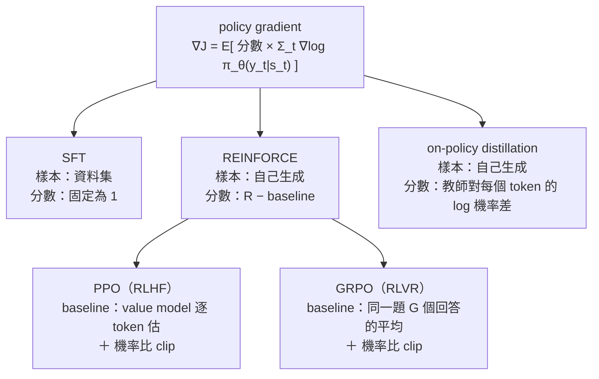

> 🌏 [English version](/posts/ai/2026-09-29-cme295-rl-with-llms-en)

**影片狀態：僅附相關補充影片；原講次錄影未確認。** [影片來源與說明](#課程影片來源)

> **課前預寫版**：本篇寫於 2026 年 9 月 29 日，2026 版第 4 講（2026 年 10 月 16 日）尚未開課。內容根據 2026 課表的主題清單、2025 版投影片中已講過的部分，以及原始論文整理；影片與投影片上架後會對照更新。

本篇是 Stanford [CME295](/posts/ai/2026-09-29-stanford-cme295-transformers-llms) 導讀系列的第 11 篇，對應 2026 版新增的第 4 講「Reinforcement learning with LLMs」。[2026 課表](https://cme295.stanford.edu/syllabus/)（2026-09-29 查詢）替這一講列了七個條目：

1. Mathematical conventions（數學記號）
2. Reward design（獎勵設計）
3. Policy gradients
4. Limitations（限制）
5. Preference tuning with PPO (RLHF)
6. Reasoning with GRPO (RLVR)
7. On-policy distillation

這講排在第 3 講「LLM training」之後、期中考之前。2025 版沒有這一講：PPO 放在第 5 講、GRPO 放在第 6 講，兩講都直接給目標函數，沒有從 policy gradient 推起。本系列的[第 5 篇（偏好對齊）](/posts/ai/2026-09-29-cme295-preference-tuning)和[第 6 篇（推理）](/posts/ai/2026-09-29-cme295-llm-reasoning)已經寫過 RLHF 流程、reward model、DPO、R1 配方這些直覺，並把完整推導留到這一篇。所以本篇只做一件事：把數學主線從頭接起來。

先講結論。讀第 5、6 篇時，PPO 和 GRPO 的公式看起來像兩個不相干的長式子。推一遍之後會發現，SFT、REINFORCE、PPO、GRPO、on-policy distillation 都長成同一個形狀：**模型對某個 token 的 log 機率梯度，乘上一個分數**。五種方法的差別只有兩個：樣本從哪裡來，分數怎麼算。

以下每一節先講直覺，公式收在可展開的區塊裡。凡是標「2025 投影片」的內容出自 [2025 版第 5 講](https://cme295.stanford.edu/slides/fall25-cme295-lecture5.pdf)或[第 6 講](https://cme295.stanford.edu/slides/fall25-cme295-lecture6.pdf)投影片；其餘來自原始論文，會附連結。

## 課程影片來源

本文預寫 CME295 2026 版第 4 講（Reinforcement learning with LLMs，10 月 16 日）。2026-10-10 讀取官方 2026 課表，該講仍標示 “Coming soon”，原講次錄影尚未上架。下方是 2025 版第 5 講（LLM tuning，含 PPO）與第 6 講（LLM reasoning，含 GRPO）的公開錄影；2025 版沒有獨立的 RL 講次，所以只作相關補充，不是 2026 版第 4 講的錄影。

```youtube
url: https://www.youtube.com/watch?v=PmW_TMQ3l0I
title: Stanford CME295 Transformers & LLMs | Autumn 2025 | Lecture 5 - LLM tuning
```

```youtube
url: https://www.youtube.com/watch?v=k5Fh-UgTuCo
title: Stanford CME295 Transformers & LLMs | Autumn 2025 | Lecture 6 - LLM Reasoning
```

原始影片：[Stanford CME295 Transformers & LLMs | Autumn 2025 | Lecture 5 - LLM tuning](https://www.youtube.com/watch?v=PmW_TMQ3l0I)、[Stanford CME295 Transformers & LLMs | Autumn 2025 | Lecture 6 - LLM Reasoning](https://www.youtube.com/watch?v=k5Fh-UgTuCo)

課程與錄影入口：

- [官方課程／講次來源](https://cme295.stanford.edu/syllabus/2025/)
- [CME295 Autumn 2025 播放清單（Stanford Online，9 支）](https://www.youtube.com/playlist?list=PLoROMvodv4rOCXd21gf0CF4xr35yINeOy)

查核日期：2026-10-10。

## 一、數學記號：把「生成一段回答」寫成 RL

2025 投影片（第 5 講第 23–28 頁）已經給過對照表。agent 是 LLM，state 是「到目前為止的輸入」，action 是「下一個 token」。policy 是「下一個 token 的機率分布」，reward 是人類偏好。這一節只是把那張表寫成符號，後面每一條公式都會用到。

有兩點值得先記住。第一，這個「環境」非常單純：選了下一個 token，下一個 state 就是把它接在後面，沒有隨機性。第二，獎勵通常只在整段回答結束時才給一次。不管回答有 20 個 token 還是 2,000 個，模型最後只拿到一個分數。後面講到的限制，很多都從這一點來。

2025 投影片（第 5 講第 67–68 頁）也提醒過兩個容易混淆的記號。PPO 論文裡的 `r_t` 指的是新舊 policy 的機率比，不是 reward。`L^CLIP` 則是要最大化的目標，不是 loss。本篇為了避開這個坑，機率比一律寫成 `ρ`，獎勵寫成 `R` 或 `r`。

<details>
<summary>公式：LLM 的 RL 記號</summary>

```
x                     prompt
y = (y_1, …, y_T)     模型的回答，一個 token 算一步
s_t = (x, y_<t)       state：prompt 加上已經生成的 token
a_t = y_t             action：下一個 token
π_θ(a_t | s_t)        policy：LLM 對下一個 token 的 softmax 機率

整段回答的機率：
π_θ(y | x) = Π_t π_θ(y_t | x, y_<t)

轉移是確定的：s_{t+1} = s_t 接上 a_t
獎勵：R(x, y)，通常只在最後一個 token 給

目標：最大化期望獎勵
J(θ) = E_{x~D} E_{y~π_θ(·|x)} [ R(x, y) ]
```

- 把整段回答 `y` 當成一個動作，是「sequence 層級」的看法；一個 token 一步，是「token 層級」的看法。只有最後才給獎勵、又不打折（γ = 1）時，兩種寫法的梯度一樣
- 本篇用 `ρ_t = π_θ / π_old` 表示機率比，避開 PPO 論文 `r_t` 的撞名

</details>

## 二、Reward design：分數從哪裡來

RL 只看分數，所以「分數怎麼給」幾乎決定了模型會學到什麼。把本系列前幾篇和本篇會用到的來源整理起來，大致有四類：

| 來源 | 例子 | 密度 | 主要風險 |
|---|---|---|---|
| 學出來的 reward model | RLHF 的 Bradley-Terry 模型（見[第 5 篇](/posts/ai/2026-09-29-cme295-preference-tuning)） | 每段一個 | reward hacking：模型找到評分器的漏洞 |
| 規則驗證 | 答案對不對、程式過不過測試、有沒有 `<think>` 格式（見[第 6 篇](/posts/ai/2026-09-29-cme295-llm-reasoning)） | 每段一個 | 只適用答案能自動判對錯的任務 |
| KL 懲罰 | 跟參考模型差多少就扣多少 | 每個 token | 係數太大學不動，太小擋不住 hacking |
| 教師模型的 log 機率 | on-policy distillation | 每個 token | 需要一個夠強、能查 log 機率的教師 |

「用規則驗證的獎勵做 RL」這個做法，後來有了名字 RLVR。這個詞出自 AI2 的 [Tülu 3 報告](https://arxiv.org/abs/2411.15124)，全名是 Reinforcement Learning with Verifiable Rewards。課表把 GRPO 那一項標成「RLVR」，用的就是這個詞。

表格最後一欄的「密度」很關鍵。只在結尾給一個分數，模型知道「這次整體不好」，卻不知道是哪一步出錯。[Thinking Machines Lab](https://thinkingmachines.ai/blog/on-policy-distillation/) 的說法是，RL 每個 episode 只教得到固定數量的 bits，跟回答多長無關。第七節的 on-policy distillation，就是把分數從「每段一個」改成「每個 token 一個」。

<details>
<summary>公式：四種 reward 的寫法</summary>

```
學出來的 reward model（Bradley-Terry，第 5 篇）：
  R(x, y) = r_φ(x, y)

規則驗證（DeepSeek-R1 的兩項，第 6 篇）：
  R(x, y) = 1[格式正確] + 1[答案正確]

把 KL 懲罰攤到每個 token（InstructGPT 與 PPO 常見寫法）：
  r_t = r_φ(x, y) · 1[t = T]  −  β · log( π_θ(y_t | s_t) / π_ref(y_t | s_t) )

教師模型逐 token 打分（on-policy distillation，第七節）：
  r_t = −( log π_θ(y_t | s_t) − log π_teacher(y_t | s_t) )
```

- 第三條的寫法見 [DeepSeekMath](https://arxiv.org/abs/2402.03300) 式 (2)，它引用 [InstructGPT](https://arxiv.org/abs/2203.02155)。reward model 只在最後一個 token 給分，KL 懲罰則每個 token 都扣
- 第四條跟第三條形狀幾乎一樣，只是把 `π_ref` 換成 `π_teacher`。Thinking Machines 的文章說，他們的實作在帶 KL 正則的 RL 程式上只改了一行：換掉正則化用的模型

</details>

## 三、Policy gradient：一條式子統一所有方法

目標是最大化期望獎勵 `J(θ)`。問題是，獎勵來自「抽出一段文字、拿去評分」，抽樣這一步不能直接微分。policy gradient 用一個小技巧繞過去：`∇π = π · ∇log π`。套上去之後，梯度變成一個期望值，可以直接用抽樣估計：

> 抽一段回答，算它的分數，然後把這段回答每個 token 的 log 機率往上推，推的力道等於分數。

分數高的回答被推高，分數是負的就被壓低。這就是 [Williams 在 1992 年提出的 REINFORCE](https://link.springer.com/article/10.1007/BF00992696)。

把這條式子跟 SFT 放在一起看，最能看出它的意思。SFT 的 loss 是「資料集裡每個 token 的負 log 機率」，梯度就是把 log 機率往上推，力道固定是 1。所以 **SFT 就是分數永遠等於 1、樣本來自資料集的 policy gradient**。DeepSeekMath 論文第 5.2 節把 SFT、rejection sampling、DPO、PPO、GRPO 全部寫成同一個形式，只換「資料來源」和「梯度係數」兩個欄位。本篇的主軸就是借這個框架。

REINFORCE 有一個麻煩：如果分數永遠是正的（例如 0 到 1），每段回答都會被推高，只是推多推少，訊號很吵。解法是減掉一個 **baseline**，也就是這題的「平常水準」。高於平常的推高，低於平常的壓低。只要 baseline 不依賴這次抽到的回答，減掉它不會改變梯度的期望值，只會降低變異數。減掉 baseline 後的分數，就是第 5、6 篇一直提到的 **advantage**。

接下來 PPO、GRPO、on-policy distillation 的差別，全都落在「baseline 怎麼估、分數怎麼算」這一格：



<details>
<summary>公式：policy gradient 定理與 baseline</summary>

```
推導（固定一個 x）：
∇_θ J = ∇_θ Σ_y π_θ(y|x) · R(x, y)
      = Σ_y π_θ(y|x) · ∇_θ log π_θ(y|x) · R(x, y)        ← ∇π = π · ∇log π
      = E_{y~π_θ} [ R(x, y) · Σ_t ∇_θ log π_θ(y_t | x, y_<t) ]

REINFORCE 的實作：抽 y、算 R，最小化
  loss = −R(x, y) · Σ_t log π_θ(y_t | x, y_<t)

對照 SFT（y 來自資料集）：
  loss = −Σ_t log π_θ(y_t | x, y_<t)          ← 等於把 R 固定成 1

baseline 不改變期望：
E_{y~π_θ} [ b(x) · ∇ log π_θ(y|x) ]
  = b(x) · Σ_y ∇ π_θ(y|x)
  = b(x) · ∇ Σ_y π_θ(y|x)
  = b(x) · ∇ 1 = 0

所以
∇_θ J = E[ (R(x, y) − b(x)) · Σ_t ∇ log π_θ(y_t | s_t) ]
A = R − b 就是 advantage

DeepSeekMath 的統一寫法（第 5.2 節，式 5）：
∇_θ J_A = E_{(q,o)~D} [ (1/|o|) Σ_t GC_A(q, o, t) · ∇_θ log π_θ(o_t | q, o_<t) ]
  D   ＝ 資料來源（資料集，或目前的 policy 自己生成）
  GC  ＝ gradient coefficient（SFT 為 1；PPO、GRPO 為各自的 advantage）
```

- 更一般的 policy gradient 定理見 [Sutton et al. (1999)](https://papers.nips.cc/paper/1713-policy-gradient-methods-for-reinforcement-learning-with-function-approximation)
- baseline 可以跟著 state 變（例如 `V(s_t)`），只要不依賴「這一步選了哪個 token」，上面的證明一樣成立

</details>

## 四、Limitations：為什麼不能直接用 REINFORCE

課表把「limitations」排在 policy gradient 之後、PPO 之前。以下是這個主題通常列的幾條，對照原始論文整理，不代表 2026 投影片一定這樣講：

- **變異數大**：一段回答只有一個分數，而一個 prompt 能抽出的回答千差萬別。少量樣本估出的梯度方向很不穩，這是 baseline 要解決的問題
- **功過分不清（credit assignment 很粗）**：同一段回答裡每個 token 都乘上同一個分數。寫錯的那一步和寫對的九步一起被壓低，模型分不出是哪裡錯
- **樣本只能用一次**：policy gradient 的期望是對「目前的」policy 取的。更新一步之後，舊樣本就不再是從新 policy 抽的，嚴格來說不能再用。生成又是 LLM 訓練裡最貴的一環
- **步伐不好拿捏**：一次更新太大，policy 可能一口氣崩掉，之後抽出的樣本全是爛的，很難救回來。這是 [TRPO](https://arxiv.org/abs/1502.05477) 與 PPO 想處理的問題
- **只能在會的範圍裡變好**：模型從沒答對過的題目，分數永遠一樣，advantage 是 0。Thinking Machines 的文章也寫到，RL 需要基礎模型本來就有非零的成功率
- **reward hacking**：分數來自學出來的 reward model 時，模型會找到它的漏洞（第 5 篇有例子）

2025 投影片也有一份清單（第 5 講第 75–82 頁），角度偏工程。PPO 要同時放 4 個模型，還要先訓練 reward model；超參數多、訓練不穩、難找監控指標，回答也需要多樣性。第 6 講第 95–113 頁則講了 GRPO 的輸出越訓越長，第 6 篇已經寫過。

## 五、PPO：讓一批樣本可以更新好幾次

PPO 針對上面第三、四條。它用 **importance sampling** 讓舊樣本可以繼續用：拿舊 policy 抽的樣本估新 policy 的期望時，每個 token 乘上機率比 `ρ = π_θ / π_old` 來修正。在 `θ = θ_old` 那一點，這個替代目標的梯度剛好等於 policy gradient，所以它是同一條式子的延伸。

但比值離 1 太遠時，修正會失準，更新也可能太大。PPO 的處理很直接：把比值夾在 `[1−ε, 1+ε]`。advantage 為正時，比值超過 1+ε 就不再給額外獎勵；為負時，低於 1−ε 就不再加重懲罰。這樣同一批樣本可以跑好幾輪梯度更新，又不會走太遠。PPO-Clip 與 PPO-KL Penalty 兩個版本的公式，第 5 篇已經列過。

剩下的是 advantage 怎麼估。PPO 另外訓練一個 **value model** `V(s_t)`，估「從這個 token 繼續寫下去，平均會拿幾分」，當成逐 token 的 baseline。advantage 的標準估法是 [GAE](https://arxiv.org/abs/1506.02438)。在 LLM 常見的設定下（不打折、λ = 1），GAE 會化簡成「這個 token 之後拿到的回報，減掉 value model 在這裡的預估」。

value model 解決了 baseline，卻帶來帳單。2025 投影片（第 5 講第 75 頁）算過：PPO 要同時放 policy、value、reward model、參考模型 4 個網路。DeepSeekMath 補了另一個問題：reward model 通常只在最後一個 token 給分，要訓練一個「每個 token 都估得準」的 value model 並不容易。

<details>
<summary>公式：從 importance sampling 到 PPO 與 GAE</summary>

```
用舊 policy 的樣本估新 policy 的目標：
J(θ) ≈ E_{y~π_old} [ Σ_t ρ_t(θ) · Â_t ]
ρ_t(θ) = π_θ(y_t | s_t) / π_old(y_t | s_t)

在 θ = θ_old：
∇_θ ρ_t = ρ_t · ∇_θ log π_θ(y_t | s_t) = ∇_θ log π_θ(y_t | s_t)
→ 替代目標的梯度 ＝ policy gradient

PPO-Clip（要最大化）：
L^CLIP(θ) = E_t [ min( ρ_t · Â_t,  clip(ρ_t, 1−ε, 1+ε) · Â_t ) ]

GAE（Schulman et al., 2015）：
δ_t = r_t + γ · V_ψ(s_{t+1}) − V_ψ(s_t)
Â_t = Σ_{l≥0} (γλ)^l · δ_{t+l}

γ = λ = 1 時逐項相消（最後一個 state 的 V 為 0）：
Â_t = Σ_{l≥t} r_l − V_ψ(s_t)        ← 之後的回報 − value 預估

value model 的訓練目標：
L_V(ψ) = E_t [ ( V_ψ(s_t) − Σ_{l≥t} r_l )² ]
```

- `r_l` 用第二節的逐 token 寫法：KL 懲罰每步都扣，reward model 的分數只在最後一步加
- TRPO 用 KL 限制每步更新；PPO 論文把它換成比較好實作的 clip

</details>

## 六、GRPO：用同一題的其他回答當 baseline

GRPO 的想法，第 6 篇已經用直覺講過：同一題抽 G 個回答，每個回答的分數減掉整組平均，就是它的 advantage，不用 value model。這裡補兩件第 6 篇沒推的事。

**第一，GRPO 是 REINFORCE 加 group baseline 的延伸。** 一個相近的做法叫 RLOO（REINFORCE Leave-One-Out），[Ahmadian et al. (2024)](https://arxiv.org/abs/2402.14740) 把它帶進 RLHF。它的 baseline 是「其他 G−1 個回答的平均」，不含自己。簡單移項就能看出，GRPO 分子上的「減掉含自己在內的平均」，剛好等於 RLOO 的 advantage 乘上常數 (G−1)/G。兩者真正的差別在 GRPO 還會除以組內標準差，以及它套上 PPO 的機率比與 clip。

**第二，除以標準差和除以長度都會引入偏差。** [Dr. GRPO](https://arxiv.org/abs/2503.20783) 指出兩個偏差。除以回答長度 `|o_i|` 造成 response-level length bias，也就是第 6 篇講的「錯的回答越寫越長」。除以標準差則造成 question-level difficulty bias。它的修正是把兩個正規化都拿掉。同一篇論文也主張，用規則驗證當獎勵時沒有 reward model 分布偏移的問題，可以把 KL 項拿掉，省下參考模型的記憶體。

還有一個直接從公式讀出來的性質：一組回答全對或全錯時，每個 advantage 都是 0，這題對梯度沒有貢獻。這就是第四節「只能在會的範圍裡變好」的具體版本。

<details>
<summary>公式：GRPO、RLOO 與 KL 估計</summary>

```
同一題 x 抽 G 個回答 y_1..y_G，分數 R_1..R_G

RLOO（leave-one-out baseline）：
A_i = R_i − (1/(G−1)) · Σ_{j≠i} R_j

GRPO（outcome supervision，DeepSeekMath 第 4.1.2 節）：
A_i = ( R_i − mean(R_1..R_G) ) / std(R_1..R_G)
同一個回答的每個 token 共用 A_i

兩者的關係（不看 std）：
R_i − mean(R) = R_i − (R_i + Σ_{j≠i} R_j) / G
             = ((G−1)/G) · ( R_i − (1/(G−1)) Σ_{j≠i} R_j )

全對或全錯：R_1 = … = R_G → 每個 A_i = 0

GRPO 目標（DeepSeekMath 式 3，完整寫法見第 6 篇）：
J(θ) = E[ (1/G) Σ_i (1/|o_i|) Σ_t { min( ρ_{i,t} Â_{i,t}, clip(ρ_{i,t}, 1−ε, 1+ε) Â_{i,t} )
                                     − β · D_KL[π_θ ‖ π_ref] } ]

KL 直接放進目標，逐 token 用這個估計量（DeepSeekMath 式 4）：
D_KL ≈ π_ref/π_θ − log(π_ref/π_θ) − 1        （恆 ≥ 0）

Dr. GRPO：拿掉 1/|o_i| 與 std 兩個正規化
```

- 「GRPO ≈ RLOO 乘常數」是本篇自己的代數推導，用來說明兩者的關係，不是 DeepSeekMath 的原文說法
- KL 估計量的來源，DeepSeekMath 標為 Schulman (2020)，也就是 [John Schulman 的部落格文章](http://joschu.net/blog/kl-approx.html)

</details>

## 七、On-policy distillation：每個 token 都有老師打分

2025 版 CME295 講過兩種蒸餾。第 2 講（投影片第 101–104 頁）是 Hinton 式的蒸餾：讓小模型對齊大模型「下一個 token 的機率分布」。第 6 講（第 142–147 頁）是 R1-Distill：大模型寫好整段推理，小模型拿來做 SFT。這兩種都是 **off-policy**：學生學的是教師走過的路。

問題出在推論時。學生早早犯了一個教師從來不會犯的錯，接下來它就站在一個訓練資料裡從沒出現過的地方，錯誤會一路累積。Thinking Machines 用下棋比喻。off-policy 蒸餾像看大師下棋，招很漂亮，但那些盤面新手自己很少遇到。RL 像自己下棋，終局才知道輸贏，卻不知道是哪一步輸的。

On-policy distillation 把兩邊的好處接起來：**讓學生自己生成，教師對學生的每一個 token 打分**。這條路線的一手來源有三個：

- **[GKD](https://arxiv.org/abs/2306.13649)**（Agarwal et al., ICLR 2024，Google DeepMind）：學生在自己生成的序列上，逐 token 對齊教師的分布。它把 supervised KD 和 on-policy KD 寫成同一個目標，用參數 λ 控制「學生自產資料的比例」。發散度 D 可選 forward KL、reverse KL，或介於兩者之間的 generalized JSD。梯度不穿過學生的抽樣過程，論文說這讓訓練穩定又省算力。它也把 on-policy 蒸餾和 RL 獎勵寫進同一個目標
- **[MiniLLM](https://arxiv.org/abs/2306.08543)**（Gu et al., 2023）：同期工作，用 policy gradient 最佳化序列層級的 reverse KL
- **[Thinking Machines Lab 的〈On-Policy Distillation〉](https://thinkingmachines.ai/blog/on-policy-distillation/)**（Kevin Lu 等，2025 年 10 月）：用逐 token 的 reverse KL 當獎勵，不打折，直接把「負的 reverse KL」當成每個 token 的 advantage，丟進現成的 RL loss

最後一個寫法把它接回本篇主線：on-policy distillation 就是 policy gradient，分數換成「學生和教師對這個 token 的 log 機率差」。它有 on-policy 的好處，學生學的是自己會走到的路；又有逐 token 的密集訊號，知道錯在哪一步。那篇文章的例子裡，教師扣分最重的是把學生帶歪的那幾個起頭 token。最後那個錯誤答案本身反而沒被扣，因為前面寫成那樣，它已是順理成章的結果。

成本上的證據來自 [Qwen3 技術報告](https://arxiv.org/abs/2505.09388)表 21：同一個 Qwen3-8B 起點，接著做 RL，AIME'24 到 67.6，花 17,920 GPU 小時；改做 on-policy distillation，到 74.4，花 1,800 GPU 小時。Qwen3 的 0.6B 到 14B 小模型與 30B-A3B，都用「先 off-policy、再 on-policy」的兩段式蒸餾訓練。

限制也要說清楚。GKD 論文假設學生一開始就能產生「品質夠用」的序列，所以實驗都從 SFT 過的學生開始；Thinking Machines 也先做一輪 off-policy 蒸餾當 mid-training，並寫到學生的起點離教師太遠時，需要大得多的 batch。另外，教師必須能對學生生成的那串 token 算出 log 機率。Thinking Machines 的實驗用的都是開源權重的 Qwen3 當教師。

<details>
<summary>公式：從 off-policy 蒸餾到 GKD 與 on-policy distillation</summary>

```
off-policy：拿教師生成的 y 做 SFT（序列層級 KD）
L = E_{y~π_teacher} [ −Σ_t log π_θ(y_t | s_t) ]
  → 在「教師走過的 state」上最小化 forward KL(teacher ‖ student)

GKD 的逐 token 發散度（式 2）：
D(p_T ‖ p_S^θ)(y|x) = (1/|y|) Σ_n D( p_T(·|y_<n, x) ‖ p_S^θ(·|y_<n, x) )

on-policy KD（式 4）：
L_OD(θ) = E_{x~X} E_{y~p_S(·|x)} [ D_KL(p_T ‖ p_S^θ)(y|x) ]
          （不對學生的抽樣過程反向傳播）

GKD（λ ＝ 學生自產資料的比例）：
L_GKD(θ) = (1−λ) · E_{(x,y)~(X,Y)} [ D(p_T ‖ p_S^θ)(y|x) ]
         +    λ  · E_{x~X} E_{y~p_S(·|x)} [ D(p_T ‖ p_S^θ)(y|x) ]

generalized JSD（式 1）：
D_JSD(β)(P ‖ Q) = β·KL(P ‖ βP+(1−β)Q) + (1−β)·KL(Q ‖ βP+(1−β)Q)

GKD ＋ RL（式 5，α 控制蒸餾比重）：
E_x [ (1−α) · E_{y~p_S^θ}[ r(y) ]  −  α · E_{y~p_S}[ D(p_T ‖ p_S^θ)(y|x) ] ]

Thinking Machines 的做法（逐 token reverse KL，折扣為 0）：
KL(π_θ ‖ π_teacher) = E_{x~π_θ} [ log π_θ(x_{t+1}|x_1..t) − log π_teacher(x_{t+1}|x_1..t) ]
Â_t = −( log π_θ(y_t | s_t) − log π_teacher(y_t | s_t) )
→ 丟進 RL 的 importance-sampling loss
```

- 學生對某個 token 的機率跟教師一樣時，`Â_t = 0`；學生比教師更有把握時被壓低，比教師沒把握時被推高
- GKD 論文把 on-policy KD 和 supervised KD 都看成 GKD 的特例：D 取 forward KL，λ 分別為 1 和 0
- Thinking Machines 也點出這個做法的前身是模仿學習的 [DAgger](https://arxiv.org/abs/1011.0686)：讓學生走、請老師在學生走到的地方示範

</details>

## 連回你用的模型

- **你手上的小型開源模型，很可能是蒸餾出來的。** Qwen3 的小尺寸模型用了 on-policy distillation；DeepSeek 的 R1-Distill 系列用的是 off-policy 的軌跡 SFT（第 6 篇）。兩者的差別，就是學生練習時走的是誰的路
- **自己做 post-training 時，先看手上有什麼分數。** 能用規則判對錯，就走 GRPO／RLOO 這類不需要 value model 的路線，記得檢查有多少題整組全對或全錯、沒貢獻梯度；手上有更強、能查 log 機率的開源教師，on-policy distillation 值得先試，Qwen3 的數字顯示它可能便宜一個數量級
- **看到新演算法時，問兩個問題就好**：樣本從哪裡來（資料集、目前的模型、教師）？每個 token 乘上的分數怎麼算？大部分新名字都能歸進上面那張圖

## 2025 版在哪裡講過

2026 版投影片尚未釋出，下表只拿 2026 課表的七個條目，對照 2025 版投影片頁碼：

| 2026 課表條目 | 2025 版對應 | 本篇補的部分 |
|---|---|---|
| Mathematical conventions | 第 5 講 p.23–28 的 RL 對照表；第 6 講 p.3–4 回顧 | 把對照表寫成符號 |
| Reward design | 第 5 講 p.32–43（reward model）；第 6 講 p.54–61（格式＋正確性） | 四類 reward 與密度 |
| Policy gradients | **沒有**。第 5 講 p.76 只把 REINFORCE 列成 PPO 的替代 | 完整推導與 baseline 證明 |
| Limitations | 第 5 講 p.75–82（4 個模型、RL 路線的難題）；第 6 講 p.95–113（長度偏差） | REINFORCE 本身的限制 |
| PPO (RLHF) | 第 5 講 p.56–74 | importance sampling、GAE 化簡 |
| GRPO (RLVR) | 第 6 講 p.69–94 | 與 RLOO 的關係、Dr. GRPO 的偏差 |
| On-policy distillation | **沒有**。只有第 2 講 p.101–104 的 logit 蒸餾、第 6 講 p.142–147 的 R1-Distill | GKD、MiniLLM、Thinking Machines、Qwen3 |

另外，2026 第 3 講「LLM training」的課表也列了「On-policy distillation (OPD and variants)」，所以這個主題在第 3、4 講會出現兩次。兩講各講到什麼深度，要等投影片確認。第 3 講的對應導讀是[第 4 篇（訓練）](/posts/ai/2026-09-29-cme295-llm-training)的「2026 版改了什麼」一節。

## 自我檢測

前四題改寫自 [2025 期末考](https://cme295.stanford.edu/exams/fall25-cme295-final.pdf)第 I、II 大題中第 5、6 篇沒用過的題目，答案在[解答 PDF](https://cme295.stanford.edu/exams/fall25-cme295-final-solutions.pdf)。2025 考卷沒有考 policy gradient 推導與 on-policy distillation，後三題由本篇自擬，沒有官方解答。

1. 標準 RLHF 流程裡，reward model 的輸入是什麼？（第 I 大題第 2 題）
2. RLHF 裡的 reward hacking，常見的症狀是什麼？（第 I 大題第 7 題）
3. SFT 之後，RLHF 還有哪兩個主要訓練階段？第一個階段訓練出來的模型負責什麼？（第 I 大題第 9 題）
4. 在推理模型的脈絡裡，distillation 指的是什麼？它跟本篇的 on-policy distillation 差在哪裡？（第 II 大題第 8 題；後半為本站延伸）
5. （自擬）證明：只要 baseline b(x) 不依賴抽到的回答 y，從獎勵裡減掉它不會改變 policy gradient 的期望值。
6. （自擬）把 SFT 寫成 policy gradient 的形式：樣本從哪裡來？每個 token 乘上的分數是多少？
7. （自擬）GRPO 的一組 8 個回答全部答對，這題對梯度的貢獻是多少？換成 on-policy distillation，如果學生在某個 token 的機率跟教師完全一樣，這個 token 的 advantage 是多少？

## 想深入

- RL 基礎，把 policy gradient、actor-critic 從頭推一遍：[Berkeley CS285 L5–10](/posts/learning/2026-08-22-berkeley-cs285-policy-value-methods)，以及更前面的[模仿學習與 RL 基礎](/posts/learning/2026-08-22-berkeley-cs285-imitation-rl-basics)（DAgger 在這裡）
- PPO 路線的 RLHF 與 reward overoptimization：[CS336 Lecture 15：SFT 與 RLHF](/posts/ai/2026-08-22-cs336-sft-rlhf)
- GRPO 的偏差與 rollout 系統成本：[CS336 Lecture 16：RLVR](/posts/ai/2026-08-22-cs336-rlvr)
- on-policy distillation 與 off-policy 漂移的另一種講法：[CS224N 第 13 講](/posts/ai/2026-08-22-cs224n-reasoning-two)
- 本系列前後篇：[第 5 篇：偏好對齊](/posts/ai/2026-09-29-cme295-preference-tuning)、[第 6 篇：推理](/posts/ai/2026-09-29-cme295-llm-reasoning)；同批課前預寫的[第 10 篇：LLM systems](/posts/ai/2026-09-29-cme295-llm-systems)，rollout 生成的成本會在那裡出現

## 更新計畫

2026 年 10 月 16 日上課、投影片上架後，會對照以下幾點更新：

- 數學記號：課程用 τ 還是 y、J 還是 L，sequence 層級還是 token 層級
- policy gradient：有沒有推 baseline 的證明，有沒有提 RLOO 或其他 group baseline
- reward design 與 limitations 各列了哪幾條，跟本篇第二、四節的整理有哪些出入
- on-policy distillation 引了哪篇來源（GKD、MiniLLM、Thinking Machines 或 Qwen3），用 forward 還是 reverse KL
- 錄影連結，以及 2026 期中考（10 月 23 日）有沒有考到這一講

## 更新紀錄

- 2026-10-10：標註影片狀態，核對錄影來源與取得方式。
- 2026-10-10：重查影片狀態。2026 版第 4 講錄影尚未上架，附上 2025 版第 5、6 講作為相關補充影片。

## 參考資料

- [CME 295 2026 版課表](https://cme295.stanford.edu/syllabus/)（2026-09-29 查詢）
- [CME 295 2025 版課表](https://cme295.stanford.edu/syllabus/2025/)
- [2025 版第 5 講投影片（PDF）](https://cme295.stanford.edu/slides/fall25-cme295-lecture5.pdf)
- [2025 版第 6 講投影片（PDF）](https://cme295.stanford.edu/slides/fall25-cme295-lecture6.pdf)
- [2025 期末考](https://cme295.stanford.edu/exams/fall25-cme295-final.pdf)／[解答](https://cme295.stanford.edu/exams/fall25-cme295-final-solutions.pdf)
- [Williams, Simple Statistical Gradient-Following Algorithms for Connectionist Reinforcement Learning (1992)](https://link.springer.com/article/10.1007/BF00992696)
- [Sutton et al., Policy Gradient Methods for Reinforcement Learning with Function Approximation (1999)](https://papers.nips.cc/paper/1713-policy-gradient-methods-for-reinforcement-learning-with-function-approximation)
- [Schulman et al., Trust Region Policy Optimization (2015)](https://arxiv.org/abs/1502.05477)
- [Schulman et al., High-Dimensional Continuous Control Using Generalized Advantage Estimation (2015)](https://arxiv.org/abs/1506.02438)
- [Schulman et al., Proximal Policy Optimization Algorithms (2017)](https://arxiv.org/abs/1707.06347)
- [Ouyang et al., Training language models to follow instructions with human feedback (2022)](https://arxiv.org/abs/2203.02155)
- [Shao et al., DeepSeekMath (2024)](https://arxiv.org/abs/2402.03300)
- [Ahmadian et al., Back to Basics: Revisiting REINFORCE Style Optimization for Learning from Human Feedback in LLMs (2024)](https://arxiv.org/abs/2402.14740)
- [Lambert et al., Tülu 3: Pushing Frontiers in Open Language Model Post-Training (2024)](https://arxiv.org/abs/2411.15124)
- [Liu et al., Understanding R1-Zero-Like Training: A Critical Perspective (2025)](https://arxiv.org/abs/2503.20783)
- [Schulman, Approximating KL Divergence (2020)](http://joschu.net/blog/kl-approx.html)
- [Agarwal et al., On-Policy Distillation of Language Models: Learning from Self-Generated Mistakes (ICLR 2024)](https://arxiv.org/abs/2306.13649)
- [Gu et al., MiniLLM (2023)](https://arxiv.org/abs/2306.08543)
- [Lu & Thinking Machines Lab, On-Policy Distillation (2025)](https://thinkingmachines.ai/blog/on-policy-distillation/)
- [Qwen Team, Qwen3 Technical Report (2025)](https://arxiv.org/abs/2505.09388)
- [Ross et al., A Reduction of Imitation Learning and Structured Prediction to No-Regret Online Learning (DAgger, 2010)](https://arxiv.org/abs/1011.0686)
- [Stanford CME295 導讀（本系列總覽）](/posts/ai/2026-09-29-stanford-cme295-transformers-llms)
