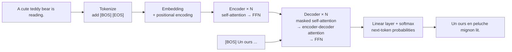

> 🌏 [中文版](/posts/ai/2026-09-29-cme295-transformer)

**Video status: Videos included.** [Source details](#course-video-sources)

This post covers Lecture 1, "Transformer," of Stanford's [CME295](/posts/ai/2026-09-29-stanford-cme295-transformers-llms-en). The main sources are the 2025 [recording](https://www.youtube.com/watch?v=Ub3GoFaUcds) and its [135-page slide deck](https://cme295.stanford.edu/slides/fall25-cme295-lecture1.pdf), cross-checked against the new edition released on September 25, 2026 ([recording](https://www.youtube.com/watch?v=114i2Kz-LZA), [slides](https://cme295.stanford.edu/slides/fall26-cme295-lecture1.pdf)).

The whole lecture runs on one example sentence: "A cute teddy bear is reading." It gets split into tokens, turned into vectors, handed to an RNN, and then we see why the RNN can't cope, until finally a Transformer translates it into French: "Un ours en peluche mignon lit." Follow that sentence from start to finish and you've covered the entire lecture.

## Course video sources

The first video comes from Stanford Online’s official CME295 Autumn 2025 playlist (Lecture 1); the second is the Autumn 2026 recording listed for Lecture 1 on the official 2026 syllabus (https://cme295.stanford.edu/syllabus/). Lecture titles and video IDs were checked live on 2026-10-10 and match.

```youtube
url: https://www.youtube.com/watch?v=Ub3GoFaUcds
title: Stanford CME295 Transformers & LLMs | Autumn 2025 | Lecture 1 - Transformer
```

```youtube
url: https://www.youtube.com/watch?v=114i2Kz-LZA
title: Stanford CME295 Transformers & LLMs | Autumn 2026 | Lecture 1 - Transformers
```

Original videos: [Stanford CME295 Transformers & LLMs | Autumn 2025 | Lecture 1 - Transformer](https://www.youtube.com/watch?v=Ub3GoFaUcds), [Stanford CME295 Transformers & LLMs | Autumn 2026 | Lecture 1 - Transformers](https://www.youtube.com/watch?v=114i2Kz-LZA)

Content check: verified against the video transcript (2026-10-10): For both videos I sampled the beginning, middle and end of the transcript, searched keywords, and compared against the chapter list in the video description (not a word-by-word comparison). Ub3GoFaUcds is Autumn 2025 Lecture 1, Transformer (page date 2025-09-26, length 1:41:59); its chapters include an NLP overview (sentiment analysis, NER, translation, and metrics such as BLEU, ROUGE and perplexity), tokenization, word representation, RNNs, self-attention, the Transformer architecture, and a detailed example (the teddy-bear sentence). 114i2Kz-LZA is Autumn 2026 Lecture 1, Transformers (1:44:28); its chapters go from a timeline to tokenization, word2vec, RNN/LSTM, attention, the Transformer and an end-to-end example, with no NLP overview or evaluation metrics (BLEU, ROUGE and perplexity never appear in the transcript), and it opens with a "difference from last year's edition" segment that mentions agents. This matches the post's statements that 2026 drops the NLP overview, covers it only in a timeline, and adds an agentic era; nothing needed correcting.

Course and recording entries:

- [Official course / lecture source](https://cme295.stanford.edu/syllabus/2025/)
- [CME295 Autumn 2025 playlist (Stanford Online, 9 videos)](https://www.youtube.com/playlist?list=PLoROMvodv4rOCXd21gf0CF4xr35yINeOy)

Checked: 2026-10-10.

## Step 1: Split the sentence into tokens

Models don't see text; they see tokens. There are three granularities for splitting, and the slides list the trade-offs of each:

| Granularity | Example | Upside | Cost |
|---|---|---|---|
| word-level | `cute` `teddy` `bear` | Simple, easy to interpret | Huge vocabulary; can't tell that `reading` and `read` share a root; helpless with unseen words |
| character-level | `c` `u` `t` `e` … | Small vocabulary; handles random capitalization and typos | Much longer sequences, slower compute; a single letter's vector carries no meaning |
| subword-level | `ted` `##dy` `read` `##ing` | Shares roots; learned from data | Needs an extra training step; quality depends on the training corpus |

A single typo exposes the problem with word-level tokenization: in "tedi bear," `tedi` isn't in the vocabulary, so it can only become `[UNK]` (unknown). Subword tokenization breaks it into smaller pieces it does recognize, which is why nearly every LLM today uses subwords (for example [BPE](https://arxiv.org/abs/1508.07909)).

Besides `[UNK]`, the slides introduce three special tokens: `[BOS]` marks the beginning of a sequence, `[EOS]` marks the end, and `[PAD]` pads sentences of different lengths to the same size. The slides also point out that real models have many more special tokens, such as the markers chat models use to separate user and assistant turns, and every vendor writes them differently. If you want to see how BPE merges bytes step by step, read the [CS336 Lecture 1 guide](/posts/ai/2026-08-22-cs336-overview-tokenization-en).

## Step 2: Turn tokens into vectors

The most direct representation is one-hot: with a vocabulary of V words, each token is a length-V vector with a single 1. The problem is that any two one-hot vectors are orthogonal, so "cute" is exactly as far from "soft" as it is from "laughing."

[word2vec](https://arxiv.org/abs/1301.3781) sets up a proxy task that forces a neural network to learn meaningful vectors on its own:

- **CBOW**: predict the middle word from its surrounding context
- **Skip-gram**: predict the surrounding context from the middle word

The network has only three layers: a V-dimensional one-hot input, a d-dimensional hidden layer, and an output that maps back to a V-dimensional probability distribution. After training, we throw away its predictions and keep only the middle layer, which becomes each word's embedding. The slides walk through predicting the next word in "a cute teddy bear is reading" step by step, with toy numbers small enough to compute by hand.

word2vec has two fundamental limits: it ignores word order, and a word gets the same vector no matter which sentence it appears in, so it can't adapt to context. Those two gaps are exactly what the next step sets out to fix. For the full derivation of word2vec, see the [CS224N Lecture 2 guide](/posts/ai/2026-08-22-cs224n-word-vectors-en).

## Step 3: RNNs remember order but lose track of long sentences

An [RNN](/posts/ai/2026-08-22-cs224n-rnn-language-models-en) reads one token at a time and passes its understanding so far along in a hidden state. That solves the word-order problem, and the same architecture can handle classification, sequence labeling, text generation, and translation. In 1997, the [LSTM](https://www.bioinf.jku.at/publications/older/2604.pdf) added more structured gates to the hidden state and went on to set the state of the art at the time.

The slides list two drawbacks. First, **vanishing gradients**: as a sentence gets longer, information from the beginning fades by the time it reaches the end. Second, **slow computation**: tokens have to be processed one after another, with no way to parallelize.

Translation magnifies the first problem. A seq2seq model has to compress the entire English sentence into one fixed-length vector and then produce French from that vector, so with longer sentences it "forgets" what came earlier. In 2014, [Bahdanau et al.](https://arxiv.org/abs/1409.0473) proposed a fix: when generating each French word, look back over the original English sentence and decide which words to align with right now. That was the beginning of attention.

## Step 4: Attention lets each token find the words that matter to it

The 2017 paper [Attention Is All You Need](https://arxiv.org/abs/1706.03762) went a step further: if attention works this well, drop the RNN entirely and build the whole model out of attention.

The slides explain self-attention through three roles: Query, Key, and Value. The intuition is a lookup:

- **Query**: what I'm looking for right now (e.g. "bear" wants to know what's describing it)
- **Key**: the label each token puts out so others can judge whether it's relevant to them
- **Value**: the actual content that gets taken

Each token compares its Query against every token's Key to get relevance scores, then takes a weighted average of all the Values using those scores. The result is that the new vector for "bear" now carries information from "cute" and "teddy," which is exactly the context-dependent representation word2vec couldn't produce. And since every token can be computed at the same time, the RNN's speed bottleneck disappears too.

<details>
<summary>Formula: scaled dot-product attention</summary>

```
Attention(Q, K, V) = softmax( Q Kᵀ / √d_k ) V
```

- `Q Kᵀ`: relevance scores for every pair of tokens, computed in one matrix multiplication
- `√d_k`: scaling. Question I.5 of the 2025 midterm tests exactly this: when the vector dimension is large, dot products get large, softmax saturates, and gradients go nearly to zero
- `softmax`: turns the scores into weights that sum to 1
- Multiplying by `V`: takes the weighted average of the Values

</details>

## Step 5: Assemble a Transformer

The original Transformer was designed for translation and has two halves:

- **Encoder**: in the slides' words, "compute meaningful embeddings." It reads the whole English sentence and computes a context-aware vector for every token
- **Decoder**: "generate next token." It produces one French token at a time



Because attention on its own can't see order, the input first gets a **positional encoding**, either a learned vector or a fixed sinusoidal function. The decoder has one extra layer compared with the encoder, **encoder-decoder attention**: while generating French, it uses Queries from the French side to look up Keys and Values from the English side, which does the same job as Bahdanau's attention. The final output layer is really a classification problem, where the classes are the words in the vocabulary.

The slides spend a good deal of space on the tricks that make this machine trainable at all:

| Technique | What it does | Why it's needed |
|---|---|---|
| [Residual connection](https://arxiv.org/abs/1512.03385) | Adds the sublayer's input directly to its output | Gives gradients a shortcut to flow backward |
| Layer normalization | Normalizes each token's hidden vector | Keeps numerical scale stable across layers, faster convergence |
| Masking (causal) | Hides future tokens not yet generated during training | Stops the model from peeking at the answer, and lets the whole sentence be computed in one vectorized pass |
| Multi-head attention | Runs several attention computations in parallel | Each head captures a different relationship, much like multiple filters in a CNN |
| [Dropout](https://jmlr.org/papers/v15/srivastava14a.html) | Randomly switches off some connections | Better generalization |
| Label smoothing | Lowers the correct answer's probability slightly below 1 | Prevents overconfidence and improves BLEU |

## Connecting back to the models you use

Today's mainstream chat LLMs (the GPT series, Llama, Qwen, and other models whose architectures have been made public) aren't this full encoder-decoder machine; they keep only the decoder. There's no "English sentence" for them to read, only "the conversation so far," and the task is always to predict the next token. Masking, multi-head attention, residual connections, and layer norm all carry over unchanged.

So although this lecture uses translation as its example, what it's really covering are the parts inside every LLM today. Lecture 2 picks up from here to show how the same Transformer split into encoder-only BERT and decoder-only GPT, and how attention was reworked to use less memory.

## What changed in 2026

Comparing the two slide decks (135 pages in 2025, 118 in 2026), the core is nearly identical, including the closing "Stitching all the pieces together" example that walks the example sentence through the entire Transformer one cell at a time, which appears in both. The differences are at the beginning and end:

- **The whole "NLP overview" section is gone**: the 2025 edition opened with three task types (sentiment analysis, named entity recognition, translation), along with evaluation metrics such as BLEU, ROUGE, F1, and perplexity, plus datasets. The 2026 edition covers these tasks in a single timeline slide.
- **The timeline gains an "Agentic era"**: it features Claude Code, Cursor, Codex, and Antigravity, and the final slide says the course will cover both the "conversational" and "agentic" eras.
- **A new batch of acronyms**: MLA, SWA, QKNorm, GSPO, RLVR, SWE-bench, HLE, and others are added, while GloVe, CoT, ToT, RAG, and others are dropped, which also hints at where later lectures will focus.

## Self-check

These questions are adapted from Part I of the [2025 midterm](https://cme295.stanford.edu/exams/fall25-cme295-midterm.pdf); answers are in the [solutions PDF](https://cme295.stanford.edu/exams/fall25-cme295-midterm-solutions.pdf):

1. Compared with word-level tokenization, what is the main advantage of subword tokenization? (Question 1)
2. Which word2vec proxy task predicts the middle word from its surrounding context? (Question 2)
3. Which sublayer appears only in the decoder and not in the encoder? (Question 4)
4. Why does scaled dot-product attention divide by √d_k? (Question 5)
5. Write out the self-attention formula and explain the role of Q, K, and V. (Question 9)
6. What does label smoothing optimize for, and why does it help generalization? (Question 10)

## Going deeper

- Deriving word vectors: [CS224N Lecture 2: how word2vec turns meaning into vectors](/posts/ai/2026-08-22-cs224n-word-vectors-en)
- RNNs and vanishing gradients: [CS224N Lecture 4: language models, RNNs, and vanishing gradients](/posts/ai/2026-08-22-cs224n-rnn-language-models-en)
- Another take on going from recurrence to Transformers: [CS224N Lecture 5](/posts/ai/2026-08-22-cs224n-transformers-en)
- Implementing BPE yourself: [CS336 Lecture 1](/posts/ai/2026-08-22-cs336-overview-tokenization-en)

## Update Log

- 2026-10-10: Added explicit video status and checked recording sources and access notes.
- 2026-10-10: Rechecked video status. Checked live against the 2025 playlist and the official 2026 syllabus; both Lecture 1 video IDs match, so the status is now videos included.
- 2026-10-10: Checked the video content against its transcript. Both videos (2025 and 2026 Lecture 1) match the post's "What changed in 2026" statements; nothing needed correcting.

## References

- [CME 295 2025 syllabus](https://cme295.stanford.edu/syllabus/2025/)
- [2025 Lecture 1 slides (PDF)](https://cme295.stanford.edu/slides/fall25-cme295-lecture1.pdf)
- [2025 Lecture 1 recording](https://www.youtube.com/watch?v=Ub3GoFaUcds)
- [2026 Lecture 1 slides (PDF)](https://cme295.stanford.edu/slides/fall26-cme295-lecture1.pdf)
- [2026 Lecture 1 recording](https://www.youtube.com/watch?v=114i2Kz-LZA)
- [2025 midterm](https://cme295.stanford.edu/exams/fall25-cme295-midterm.pdf) / [solutions](https://cme295.stanford.edu/exams/fall25-cme295-midterm-solutions.pdf)
- [Sennrich et al., Neural Machine Translation of Rare Words with Subword Units (2015)](https://arxiv.org/abs/1508.07909)
- [Mikolov et al., Efficient Estimation of Word Representations in Vector Space (2013)](https://arxiv.org/abs/1301.3781)
- [Hochreiter & Schmidhuber, Long Short-Term Memory (1997)](https://www.bioinf.jku.at/publications/older/2604.pdf)
- [Bahdanau et al., Neural Machine Translation by Jointly Learning to Align and Translate (2014)](https://arxiv.org/abs/1409.0473)
- [Vaswani et al., Attention Is All You Need (2017)](https://arxiv.org/abs/1706.03762)
- [He et al., Deep Residual Learning for Image Recognition (2015)](https://arxiv.org/abs/1512.03385)
- [Srivastava et al., Dropout (2014)](https://jmlr.org/papers/v15/srivastava14a.html)
- [Reading Stanford CME295 (series overview)](/posts/ai/2026-09-29-stanford-cme295-transformers-llms-en)
