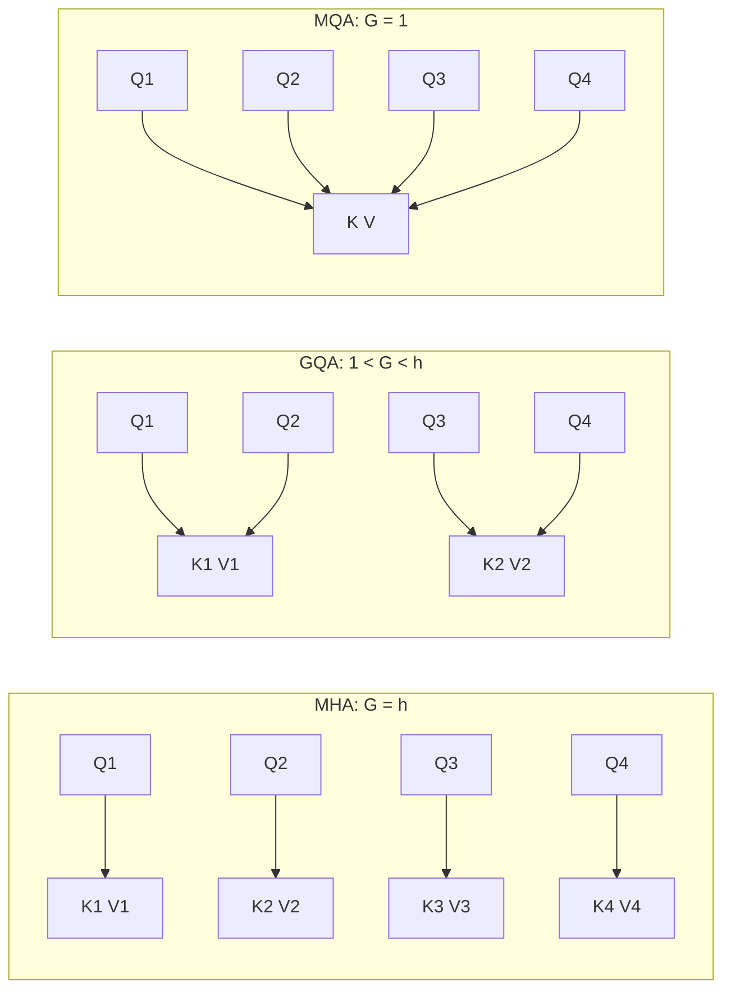
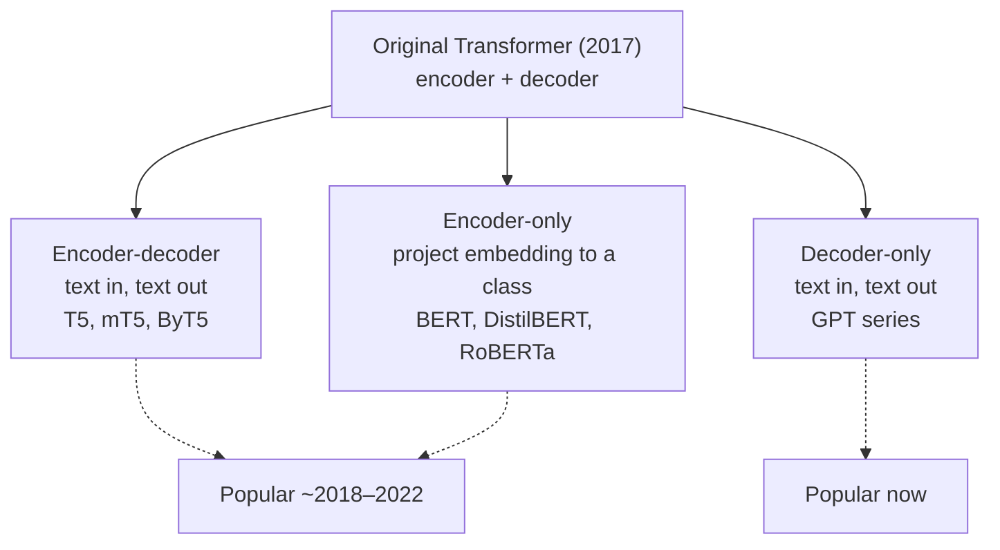

> 🌏 [中文版](/posts/ai/2026-09-29-cme295-transformer-tricks)

**Video status: Videos included.** [Source details](#course-video-sources)

This post covers Lecture 2 of the 2025 edition of Stanford's [CME295](/posts/ai/2026-09-29-stanford-cme295-transformers-llms-en), "Transformer-based models & tricks" (October 3, 2025). The main source is the [109-page slide deck](https://cme295.stanford.edu/slides/fall25-cme295-lecture2.pdf); the recording is on [YouTube](https://www.youtube.com/watch?v=yT84Y5zCnaA) (1 hour 47 minutes). This post is written from what is on the slides, and flags anything the slides don't cover.

[Lecture 1](/posts/ai/2026-09-29-cme295-transformer-en) assembled the [original 2017 Transformer](https://arxiv.org/abs/1706.03762). But the LLM you use today has swapped out almost all of its position encoding, normalization, and attention, and kept only the decoder half. Lecture 2 is that refit list: which parts of the same machine got replaced, why, and which model families grew out of keeping different halves.

The slides run in five sections: position embeddings → layer normalization → attention approximation → a taxonomy of Transformer models → a deep dive on BERT. The first three are part upgrades; the last two are about how the whole machine split into families.

## Course video sources

The videos below come from Stanford Online’s official CME295 Autumn 2025 playlist; on 2026-10-10 the lecture title and video ID were checked live against the playlist and match.

```youtube
url: https://www.youtube.com/watch?v=yT84Y5zCnaA
title: Stanford CME295 Transformers & LLMs | Autumn 2025 | Lecture 2 - Transformer-Based Models & Tricks
```

Original videos: [Stanford CME295 Transformers & LLMs | Autumn 2025 | Lecture 2 - Transformer-Based Models & Tricks](https://www.youtube.com/watch?v=yT84Y5zCnaA)

Course and recording entries:

- [Official course / lecture source](https://cme295.stanford.edu/syllabus/2025/)
- [CME295 Autumn 2025 playlist (Stanford Online, 9 videos)](https://www.youtube.com/playlist?list=PLoROMvodv4rOCXd21gf0CF4xr35yINeOy)

Checked: 2026-10-10.

## Position information: from "add a vector" to "rotate by an angle"

### Why position is needed

Attention connects every token directly to every other token, and the slides say these direct links "lose" position information: to attention, "A cute teddy bear" and "A teddy bear cute" are the same bag of tokens. So order has to be injected separately.

The slides walk through the approaches in historical order:

| Approach | Where it goes | How it's computed | Pros and cons listed on the slides |
|---|---|---|---|
| Learned position embedding | Added to the token embedding | One learned vector per position | Must retrain for longer sequences |
| Sinusoidal (hardcoded) | Added to the token embedding | Fixed values from sin and cos at different frequencies | Extends to any sequence length |
| T5 bias | On the attention scores | Bucketed by relative distance, one learned bias per head | Handles relative position directly |
| [ALiBi](https://arxiv.org/abs/2108.12409) | On the attention scores | Bias proportional to distance, not learned, unbounded | Handles relative position directly |
| [RoPE](https://arxiv.org/abs/2104.09864) | On Q and K inside attention | Rotates vectors by position | Labeled "Default choice nowadays" |

### From absolute to relative position

Sinusoidal encodings have a nice property, which the slides point out with the identity `cos(a−b) = cos(a)cos(b) + sin(a)sin(b)`: the dot product of two position encodings depends only on the **distance** between them. The slides then pivot: what attention actually cares about is relative position, so rather than adding vectors at the input, why not change the attention layer itself?

[T5](https://arxiv.org/abs/1910.10683) and ALiBi take the route of adding a bias to the query-key score. The difference is that T5's bias is learned per head and bucketed by distance, while ALiBi's bias is the distance times a fixed slope, with nothing to learn.

### RoPE: turning position into a rotation angle

The intuition behind RoPE works in two dimensions: picture the query and key as arrows on a plane, and a token at position m rotates its arrow by m unit angles. The dot product of two arrows depends on the angle between them, and that angle depends only on how many steps apart they were rotated, namely n − m. Position information lands directly in the attention score, and it is relative by construction.

For dimensions above 2, RoPE splits the vector into pairs and rotates each pair at a different frequency. The slides close with a plot: the further apart two tokens are, the lower the relative upper bound on their attention score, which they call "long-term decay."

<details>
<summary>Formulas: from bias to RoPE</summary>

```
# T5 / ALiBi: add a bias inside the softmax
score(m, n) = softmax( <q_m, k_n> / √d_k + bias(m, n) )

T5:     bias(m, n) = β_bucket(n−m)     # learned per head, bucketed by distance
ALiBi:  bias(m, n) = μ × (n − m)       # linear, fixed, unbounded

# RoPE: rotation matrix
block_i = | cos(mθ_i)  −sin(mθ_i) |
          | sin(mθ_i)   cos(mθ_i) |

R_{θ,m} = diag(block_1, block_2, ..., block_{d/2})

q_m k_nᵀ = x_m W_q R_{θ, n−m} W_kᵀ x_nᵀ
```

The last line is the point: after rotation, position appears in the dot product only as `n − m`.

</details>

Question II.10 on the 2025 midterm tests exactly this intuition: why rotating Q and K makes attention depend only on relative distance. The slides don't go into what goes wrong when RoPE is stretched to very long contexts; for that, see the [CS336 Lecture 3 guide](/posts/ai/2026-08-22-cs336-architectures-hyperparameters-en).

## Layer normalization: before or after?

The original Transformer places [layer normalization](https://arxiv.org/abs/1607.06450) **after** the residual connection (Post-LN). The slides cite [Xiong et al. (2020)](https://arxiv.org/abs/2002.04745) to contrast it with the alternative: move normalization **before** the sublayer (Pre-LN), so the residual path never passes through it.

The combination the slides label "Nowadays" is Pre-Norm plus [RMSNorm](https://arxiv.org/abs/1910.07467). RMSNorm simplifies LayerNorm's `γ·x̂ + β` to `γ·x / RMS(x)`: no mean subtraction and no shift. The slides only say layer norm helps training stability and convergence; they give no experimental numbers comparing the two placements.

## Attention approximation: not every token needs to see everything

Full self-attention has every token look at every token, and compute blows up as sequences grow. The slides present two ways to save.

### Look nearby: Longformer and sliding windows

Most of [Longformer](https://arxiv.org/abs/2004.05150)'s attention matrix is empty: each token only looks at a fixed-width window on either side (sliding window attention, SWA), and a few tokens such as `[CLS]` are designated "global tokens" that see everything and are seen by everything.

The slides compare this to the receptive field in a CNN: a single layer sees only neighbors, but after stacking many layers, information spreads outward layer by layer, so tokens in higher layers indirectly see far away. The slides also mention that [Mistral 7B](https://arxiv.org/abs/2310.06825) uses SWA, and that variations interleave local and global attention layers.

### Share keys and values: MHA, MQA, GQA

The second saving is to reduce how many copies of keys and values exist. In ordinary multi-head attention (MHA), every head has its own Q, K, and V. The slides unify three approaches with one parameter G, the number of key/value groups:



- **MHA**: G equals the number of heads h; every query head has its own K and V
- **[MQA](https://arxiv.org/abs/1911.02150)**: G = 1; all query heads share a single K and V
- **[GQA](https://arxiv.org/abs/2305.13245)**: in between; each group of query heads shares one K and V

The slides state only the idea, "share key/value attention heads within groups of queries," without saying what it saves. The motivation in the original MQA paper is that during token-by-token generation, every step has to read all of K and V from memory, making memory bandwidth the bottleneck; fewer K/V copies means less data to move. This ties into the KV cache, which the 2026 edition of CME295 moves to Lecture 5; on this site, the [CS336 Lecture 3](/posts/ai/2026-08-22-cs336-architectures-hyperparameters-en) and [Lecture 4](/posts/ai/2026-08-22-cs336-attention-moe-en) guides cover it now.

## Three families of Transformer models

With the parts upgraded, the slides turn to how the family split. The original Transformer has an encoder half and a decoder half, and which half you keep determines the kind of model you get:



The slides label encoder-decoder and encoder-only "Popular in ~2018-2022" and decoder-only "Popular now!" The rest of the lecture is spent on the flagship encoder-only model, BERT.

## BERT: what happens when you keep only the encoder

### The "bidirectional" in the name

[BERT](https://arxiv.org/abs/1810.04805) stands for Bidirectional Encoder Representations from Transformers. The slides make the contrast with the decoder's masked self-attention explicit: in a decoder, the query for "teddy bear" can only see "a" and "cute" to its left, which is **not** bidirectional. The encoder has no such mask, so every token sees both sides at once.

The slides also include a naming aside: [ELMo](https://arxiv.org/abs/1802.05365), submitted in February 2018, and BERT, submitted that October, are both named after Sesame Street characters.

### What the input looks like

| Component | Description on the slides |
|---|---|
| Tokenizer | WordPiece, trained beforehand on a training set; vocabulary of about 30,000 |
| Special tokens | `[CLS]` at the start, `[SEP]` between segments and at the end, `[MASK]` at masked positions |
| Token embedding | A gigantic lookup table with one vector per word |
| Position encoding | Either learned or fixed with sin/cos |
| Segment encoding | New in BERT: all tokens in a segment share one vector, telling the model whether a token belongs to the first or second sentence |

### Two proxy tasks

BERT is pretrained on two tasks that need no labels, then finetuned for the target task:

- **Masked Language Modeling (MLM)**: 15% of tokens are selected for prediction. Of those, 80% are replaced with `[MASK]`, 10% with a random word, and 10% are left unchanged. The slides say the latter two act as regularization that reflects the probabilistic nature of language.
- **Next Sentence Prediction (NSP)**: two sentences are drawn from the corpus; half the time they actually follow each other and half the time they don't, and the model has to tell which. It's an easy classification task that needs no human labels.

### Model sizes and finetuning

BERT's hyperparameters are the number of layers L, hidden size H, and number of attention heads A. The slides show a table from Tiny to Large. At the extremes are BERT-Tiny (L=2, H=128, 4M parameters) and BERT-Large (L=24, H=1024, A=16, 340M parameters); the commonly used BERT-Base has L=12, H=768, A=12, and 110M parameters.

The finetuning example is sentiment extraction. "This teddy bear is SO CUTE!" is lowercased and tokenized, `[CLS]` is added at the front and `[SEP]` and `[PAD]` at the end, each token gets position and segment embeddings, and everything goes through the pretrained BERT. Only the output vector at the `[CLS]` position is kept and fed to an FFN for classification. Among the tricks the slides mention is freezing early layers, which is sometimes a better trade-off between complexity and performance.

### Strengths, limits, and two variants

The strengths on the slides: state-of-the-art results at the time, truly context-dependent word representations, and adaptability to many classification tasks, making it "widely used in the industry for anything related to encoding." The limits are three: a bounded context window; heavy compute, a hard sell for low-latency or cost-sensitive applications; and a complex training paradigm, MLM/NSP pretraining followed by finetuning.

Two variants push in two directions:

| Variant | Direction | Approach and results listed on the slides |
|---|---|---|
| [DistilBERT](https://arxiv.org/abs/1910.01108) | Efficiency | Uses [knowledge distillation](https://arxiv.org/abs/1503.02531) to learn a 6-layer model from the 12-layer BERT-Base; about 1.6x faster while keeping about 97% of performance |
| [RoBERTa](https://arxiv.org/abs/1907.11692) | Performance | Removing NSP and segment encodings has almost no effect; masking becomes dynamic across epochs; the pretraining corpus grows from 16 GB to 160 GB; training goes from 1M steps at batch size 256 to 500k steps at batch size 8k. Same architecture, about +4% across benchmarks |

RoBERTa's result is the one to remember: NSP, a task specifically designed for BERT, made almost no difference when removed. What mattered was more data and longer training.

## Back to the model you use

The slides' answer is blunt: decoder-only is what's popular now, and it's also the reference answer to midterm question II.9. The chat models you use today are mostly assembled from the parts in the first half of this lecture: a decoder-only backbone, RoPE for position, Pre-Norm plus RMSNorm, and GQA or sliding windows to keep attention affordable. Which model uses which parts depends on each one's published technical report; the [CS336 Lecture 3 guide](/posts/ai/2026-08-22-cs336-architectures-hyperparameters-en) summarizes the consensus and the exceptions.

The BERT branch hasn't disappeared. The slides say it's still widely used in industry "for anything related to encoding," such as turning a passage into a vector to classify or compare. It just can't generate text, which the slides list outright as a drawback.

Lecture 3 returns to the decoder-only mainline and covers what gets added once it grows into an LLM: [CME295 Lecture 3](/posts/ai/2026-09-29-cme295-large-language-models-en).

## What changed in 2026

The 2026 slides and recording for Lecture 2 have not been released yet (the syllabus lists the class for October 2), so the following compares only the topic lists in the two syllabi:

- **Two lectures merged into one**: 2025's Lecture 2 (Transformer tricks) and Lecture 3 (LLMs) become a single 2026 lecture, "Large Language Models," covering in order: Transformer model families, LLM definition and architecture, MoE, MHA/MQA/GQA, position embeddings (RoPE and variants), context length and temperature, and sampling.
- **BERT is no longer a syllabus item**: 2025's "BERT and its derivatives" shrinks to a single line, "Transformer model families," in 2026. Whether MLM and NSP still get covered in detail will have to wait for the slides.
- **Position embeddings center on RoPE**: 2025 listed "Position embeddings (regular, learned)" and "RoPE and applications" as two items; 2026 lists only "RoPE and variants."
- **The "Attention approximation" item is gone**: the 2026 syllabus lists only MHA/MQA/GQA. That said, the abbreviation slide in the 2026 Lecture 1 deck lists MHA, GQA, MQA, MLA, SWA, and AttnRes under "Attention techniques," and MoE, RoPE, ALiBi, LN, QKNorm, and SwiGLU under "Architecture optimizations"; BERT and T5, which appeared on the 2025 version of that slide, are gone. The syllabus doesn't say which lecture these terms will show up in.

## Self-check

These questions are adapted from Part II of the [2025 midterm](https://cme295.stanford.edu/exams/fall25-cme295-midterm.pdf); answers are in the [solutions PDF](https://cme295.stanford.edu/exams/fall25-cme295-midterm-solutions.pdf):

1. What advantage do hardcoded sinusoidal position encodings have over learned ones? (Question 1)
2. Which kind of Transformer is bidirectional at pretraining time and well suited to sentence encoding and classification? (Question 3)
3. What does RoPE primarily do? (Question 4)
4. How does Longformer reduce the cost of attention? (Question 6)
5. Compare encoder-only, encoder-decoder, and decoder-only models: the typical pretraining objective of each, one example model of each, and which has become the default for today's LLMs. (Question 9)
6. Why does rotating Q and K make attention depend only on relative position? Name one practical benefit. (Question 10)

## Going deeper

- The consensus on modern LLM architecture (pre-norm, RMSNorm, RoPE, GQA): [CS336 Lecture 3](/posts/ai/2026-08-22-cs336-architectures-hyperparameters-en)
- Attention variants and MoE: [CS336 Lecture 4](/posts/ai/2026-08-22-cs336-attention-moe-en)
- BERT's place in the history of pretraining: [CS224N Lecture 7: pretraining, subwords, and in-context learning](/posts/ai/2026-08-22-cs224n-pretraining-en)
- Previous lecture: [CME295 Lecture 1: From Tokens to Transformer](/posts/ai/2026-09-29-cme295-transformer-en)

## Update Log

- 2026-10-10: Added explicit video status and checked recording sources and access notes.
- 2026-10-10: Rechecked video status. Checked live against the Stanford Online CME295 Autumn 2025 playlist; lecture and video ID match, so the status is now videos included.

## References

- [CME 295 2025 syllabus](https://cme295.stanford.edu/syllabus/2025/)
- [CME 295 2026 syllabus](https://cme295.stanford.edu/syllabus/)
- [2025 Lecture 2 slides (PDF)](https://cme295.stanford.edu/slides/fall25-cme295-lecture2.pdf)
- [2025 Lecture 2 recording](https://www.youtube.com/watch?v=yT84Y5zCnaA)
- [2026 Lecture 1 slides (PDF)](https://cme295.stanford.edu/slides/fall26-cme295-lecture1.pdf)
- [2025 midterm](https://cme295.stanford.edu/exams/fall25-cme295-midterm.pdf) / [solutions](https://cme295.stanford.edu/exams/fall25-cme295-midterm-solutions.pdf)
- [Vaswani et al., Attention Is All You Need (2017)](https://arxiv.org/abs/1706.03762)
- [Raffel et al., Exploring the Limits of Transfer Learning with a Unified Text-to-Text Transformer (T5, 2019)](https://arxiv.org/abs/1910.10683)
- [Press et al., Train Short, Test Long: ALiBi (2021)](https://arxiv.org/abs/2108.12409)
- [Su et al., RoFormer: Enhanced Transformer with Rotary Position Embedding (2021)](https://arxiv.org/abs/2104.09864)
- [Ba et al., Layer Normalization (2016)](https://arxiv.org/abs/1607.06450)
- [Xiong et al., On Layer Normalization in the Transformer Architecture (2020)](https://arxiv.org/abs/2002.04745)
- [Zhang & Sennrich, Root Mean Square Layer Normalization (2019)](https://arxiv.org/abs/1910.07467)
- [Beltagy et al., Longformer: The Long-Document Transformer (2020)](https://arxiv.org/abs/2004.05150)
- [Jiang et al., Mistral 7B (2023)](https://arxiv.org/abs/2310.06825)
- [Shazeer, Fast Transformer Decoding: One Write-Head is All You Need (MQA, 2019)](https://arxiv.org/abs/1911.02150)
- [Ainslie et al., GQA (2023)](https://arxiv.org/abs/2305.13245)
- [Devlin et al., BERT (2018)](https://arxiv.org/abs/1810.04805)
- [Peters et al., Deep contextualized word representations (ELMo, 2018)](https://arxiv.org/abs/1802.05365)
- [Hinton et al., Distilling the Knowledge in a Neural Network (2015)](https://arxiv.org/abs/1503.02531)
- [Sanh et al., DistilBERT (2019)](https://arxiv.org/abs/1910.01108)
- [Liu et al., RoBERTa (2019)](https://arxiv.org/abs/1907.11692)
- [Reading Stanford CME295 (series overview)](/posts/ai/2026-09-29-stanford-cme295-transformers-llms-en)
