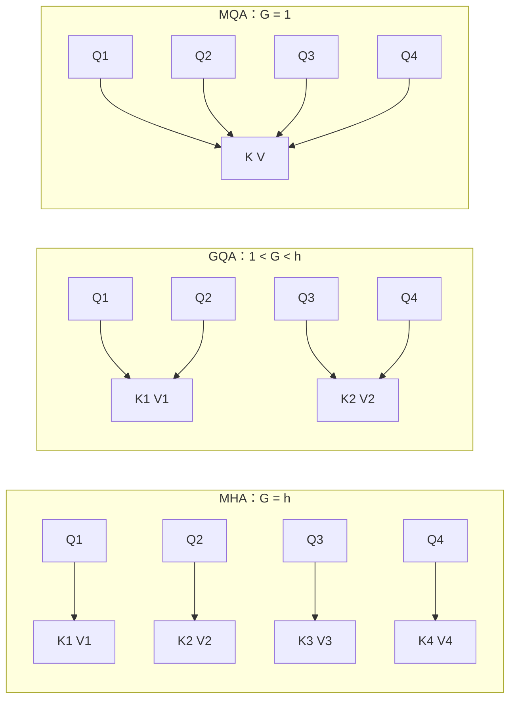
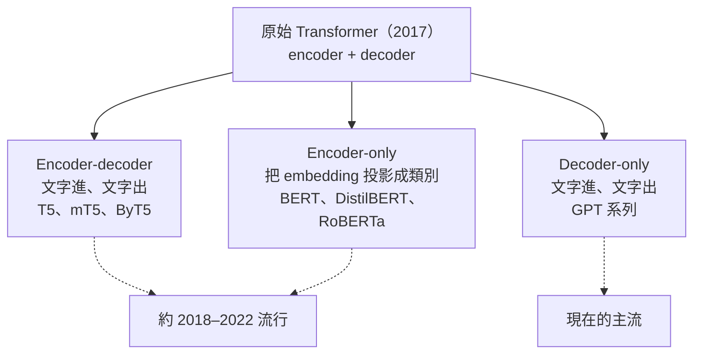

> 🌏 [English version](/posts/ai/2026-09-29-cme295-transformer-tricks-en)

**影片狀態：已附影片；播放未逐支確認。** [影片來源與說明](#課程影片來源)

本篇對應 Stanford [CME295](/posts/ai/2026-09-29-stanford-cme295-transformers-llms) 2025 版第 2 講「Transformer-based models & tricks」（2025 年 10 月 3 日）。主要來源是 [109 頁投影片](https://cme295.stanford.edu/slides/fall25-cme295-lecture2.pdf)，錄影在 [YouTube](https://www.youtube.com/watch?v=yT84Y5zCnaA)（1 小時 47 分）。本文只根據投影片上的內容寫，投影片沒寫的地方會標明。

[第 1 講](/posts/ai/2026-09-29-cme295-transformer)組好了一台 2017 年的[原始 Transformer](https://arxiv.org/abs/1706.03762)。可是你今天用的 LLM，位置編碼、正規化、attention 的做法幾乎都換過了，而且只留下 decoder 那一半。第 2 講就是這張改裝清單：同一台機器，哪些零件被換掉、為什麼換，以及拆成不同半邊之後長出了哪些模型家族。

投影片分五段：位置編碼 → layer normalization → attention approximation → Transformer 模型分類 → BERT 深入拆解。前三段是「零件升級」，後兩段是「整台機器怎麼分家」。

## 課程影片來源

下列影片連結已列於本文對應講次的來源。

```youtube
url: https://www.youtube.com/watch?v=yT84Y5zCnaA
title: 2025 版第 2 講錄影
```

原始影片：[2025 版第 2 講錄影](https://www.youtube.com/watch?v=yT84Y5zCnaA)

課程與錄影入口：

- [官方課程／講次來源](https://cme295.stanford.edu/syllabus/2025/)

## 位置資訊：從「加一個向量」到「轉一個角度」

### 為什麼需要位置

attention 讓每個 token 直接連到所有其他 token，投影片的說法是這些直接連結會「lose」位置資訊。結果是「A cute teddy bear」和「A teddy bear cute」在 attention 眼裡是同一包 token。所以一定要另外把順序塞進去。

投影片照時間順序走了四種做法：

| 做法 | 放在哪裡 | 怎麼算 | 投影片列的優缺點 |
|---|---|---|---|
| learned 位置 embedding | 加到 token embedding 上 | 每個位置學一個向量 | 序列變長就要重新訓練 |
| sinusoidal（寫死） | 加到 token embedding 上 | 用不同頻率的 sin、cos 算出固定值 | 可以延伸到任意長度 |
| T5 bias | attention 分數上 | 依相對距離分桶，每個 head 學一個 bias | 直接處理相對位置 |
| [ALiBi](https://arxiv.org/abs/2108.12409) | attention 分數上 | bias 和距離成正比，不用學、沒有上限 | 直接處理相對位置 |
| [RoPE](https://arxiv.org/abs/2104.09864) | attention 裡的 Q 和 K | 依位置旋轉向量 | 投影片標為「Default choice nowadays」 |

### 從絕對位置轉到相對位置

sinusoidal 編碼有一個好性質，投影片用三角恆等式 `cos(a−b) = cos(a)cos(b) + sin(a)sin(b)` 點出來：兩個位置的編碼做內積，結果只跟兩者的**距離**有關。投影片接著的轉折是：attention 真正在乎的本來就是相對位置，那與其在輸入端加向量，不如直接改 attention 層。

[T5](https://arxiv.org/abs/1910.10683) 和 ALiBi 走的是「在 query-key 分數上加一個 bias」這條路。差別在 T5 的 bias 是每個 head 自己學、依距離分桶；ALiBi 的 bias 是距離乘上一個固定斜率，完全不用學。

### RoPE：把位置變成旋轉角度

RoPE 的直覺可以用二維平面想像：把 query 和 key 看成平面上的箭頭，位置 m 的 token 就把箭頭轉 m 個單位角度。兩個箭頭的內積取決於它們的夾角，而夾角只跟「轉了幾格的差」有關，也就是 n − m。位置資訊於是直接進到 attention 分數裡，而且天生就是相對的。

維度大於 2 時，RoPE 把向量切成一對一對的小區塊，每對用不同頻率旋轉。投影片最後附了一張圖：兩個 token 距離越遠，attention 分數的相對上界越低，稱為「long-term decay」。

<details>
<summary>公式：從 bias 到 RoPE</summary>

```
# T5 / ALiBi：在 softmax 裡加 bias
score(m, n) = softmax( <q_m, k_n> / √d_k + bias(m, n) )

T5:     bias(m, n) = β_bucket(n−m)     # 每個 head 學一組，依距離分桶
ALiBi:  bias(m, n) = μ × (n − m)       # 線性、固定、沒有上限

# RoPE：旋轉矩陣
block_i = | cos(mθ_i)  −sin(mθ_i) |
          | sin(mθ_i)   cos(mθ_i) |

R_{θ,m} = diag(block_1, block_2, ..., block_{d/2})

q_m k_nᵀ = x_m W_q R_{θ, n−m} W_kᵀ x_nᵀ
```

最後一行是重點：旋轉後的內積裡，位置只以 `n − m` 的形式出現。

</details>

2025 期中考第 II.10 題就考這個直覺：旋轉 Q 和 K 為什麼能讓 attention 只看相對距離。延伸到超長 context 時 RoPE 會碰到什麼問題，投影片沒有展開，可以看 [CS336 Lecture 3 導讀](/posts/ai/2026-08-22-cs336-architectures-hyperparameters)。

## Layer normalization：放在前面還是後面

原始 Transformer 的 [layer normalization](https://arxiv.org/abs/1607.06450) 放在殘差連接**之後**（Post-LN）。投影片引 [Xiong 等人 2020 年的論文](https://arxiv.org/abs/2002.04745)對照另一種放法：把正規化移到子層**之前**（Pre-LN），殘差那條路就不經過正規化。

投影片標為「Nowadays」的組合是 Pre-Norm 加上 [RMSNorm](https://arxiv.org/abs/1910.07467)。RMSNorm 把 LayerNorm 的 `γ·x̂ + β` 簡化成 `γ·x / RMS(x)`，不減平均、也不加偏移。投影片只說 layer norm 的好處是訓練穩定、收斂快，沒有比較兩種放法的實驗數字。

## Attention approximation：不要每個 token 都看全部

完整的 self-attention 讓每個 token 看所有 token，序列一長計算量就爆掉。投影片給了兩類省法。

### 只看附近：Longformer 與 sliding window

[Longformer](https://arxiv.org/abs/2004.05150) 的 attention 矩陣大部分是空的：每個 token 只看左右一個固定寬度的視窗（sliding window attention，SWA）。另外再挑少數像 `[CLS]` 這樣的 token 當「全域 token」，它們可以看全部、也被全部看到。

投影片把這個設計比作 CNN 的 receptive field：單層只看得到鄰居，但疊很多層以後，資訊可以一層一層往外傳，上層的 token 間接看到很遠的地方。投影片也提到 [Mistral 7B](https://arxiv.org/abs/2310.06825) 用了 SWA，以及把局部與全域 attention 層交錯排列的變形。

### 共用 key 和 value：MHA、MQA、GQA

第二種省法是減少 key/value 的份數。一般的 multi-head attention（MHA）每個 head 都有自己的 Q、K、V。投影片用一個參數 G（key/value 的組數）把三種做法統一起來：



- **MHA**：G 等於 head 數 h，每個 query head 有自己的 K、V
- **[MQA](https://arxiv.org/abs/1911.02150)**：G = 1，所有 query head 共用同一份 K、V
- **[GQA](https://arxiv.org/abs/2305.13245)**：介於兩者之間，每組 query head 共用一份

投影片只寫了「share key/value attention heads within groups of queries」這個想法，沒有說省下的是什麼。MQA 原論文的動機是逐字生成時，每一步都要把所有 K、V 從記憶體讀出來，記憶體頻寬成為瓶頸；K、V 份數變少，要搬的資料就少了。這一點跟 KV cache 有關，CME295 2026 版把 KV cache 放到第 5 講，站上可以先看 [CS336 Lecture 3](/posts/ai/2026-08-22-cs336-architectures-hyperparameters) 和 [Lecture 4](/posts/ai/2026-08-22-cs336-attention-moe) 的導讀。

## 三類 Transformer 模型

改完零件，投影片開始分家。原始 Transformer 有 encoder 和 decoder 兩半，只留哪一半，就長出不同的模型：



投影片把 encoder-decoder 和 encoder-only 標為「Popular in ~2018-2022」，decoder-only 標為「Popular now!」。這一講剩下的時間都花在 encoder-only 的代表 BERT。

## BERT：只留 encoder 會怎樣

### 名字裡的「雙向」

[BERT](https://arxiv.org/abs/1810.04805) 是 Bidirectional Encoder Representations from Transformers。投影片特別用 decoder 的 masked self-attention 做對照：decoder 裡「teddy bear」的 query 只能看到它左邊的「a」和「cute」，這**不是**雙向的。encoder 沒有這層遮罩，每個 token 同時看左右兩邊。

投影片還附了一個命名彩蛋：同年 2 月投稿的 [ELMo](https://arxiv.org/abs/1802.05365) 和 10 月投稿的 BERT，名字都是芝麻街角色。

### 輸入長什麼樣

| 元件 | 投影片的描述 |
|---|---|
| tokenizer | WordPiece，事先在訓練集上訓練，詞彙表約 30,000 |
| 特殊 token | 開頭放 `[CLS]`、句段之間和結尾放 `[SEP]`、遮住的位置放 `[MASK]` |
| token embedding | 一張巨大的查表，每個詞一個向量 |
| 位置編碼 | learned 或 sin/cos 固定值皆可 |
| segment encoding | BERT 新加的：同一個句段共用一個向量，告訴模型這個 token 屬於第一句還是第二句 |

### 兩個代理任務

BERT 先用兩個不需要標註的任務預訓練，再針對目標任務 fine-tune：

- **Masked Language Modeling（MLM）**：挑 15% 的 token 來預測。這些 token 裡 80% 換成 `[MASK]`、10% 換成隨機的詞、10% 保持不變。投影片說後兩種的用意是正規化，反映語言本身的機率性質。
- **Next Sentence Prediction（NSP）**：從語料抽兩個句子，一半的機率是前後相連、一半不是，要模型判斷。這是一個不需要人工標註的簡單分類題。

### 模型大小與 fine-tuning

BERT 的超參數是層數 L、隱藏維度 H、head 數 A。投影片列了一張從 Tiny 到 Large 的表，兩端是 BERT-Tiny（L=2、H=128，4M 參數）和 BERT-Large（L=24、H=1024、A=16，340M 參數），常用的 BERT-Base 是 L=12、H=768、A=12，110M 參數。

fine-tuning 的例子是情緒分析：「This teddy bear is SO CUTE!」先轉小寫、切 token，前面加 `[CLS]`、後面補 `[SEP]` 和 `[PAD]`，每個 token 加上位置和 segment embedding，送進預訓練好的 BERT。最後只拿 `[CLS]` 位置的輸出向量，接一層 FFN 做分類。投影片提到的技巧包括凍結前面幾層，在複雜度和效果之間取得較好的平衡。

### 優點、限制與兩個變體

投影片列的優點是當時最好的成績、真正上下文相依的詞表示、能套到很多分類任務，在業界「凡是跟 encoding 有關的都廣泛使用」。限制有三個：context window 有上限；計算量大，對低延遲或在意成本的應用不好推；訓練流程複雜，要 MLM/NSP 預訓練再 fine-tune。

兩個變體分別往兩個方向改：

| 變體 | 方向 | 投影片列的做法與結果 |
|---|---|---|
| [DistilBERT](https://arxiv.org/abs/1910.01108) | 效率 | 用[知識蒸餾](https://arxiv.org/abs/1503.02531)從 12 層的 BERT-Base 學出 6 層小模型，約快 1.6 倍，保留約 97% 效能 |
| [RoBERTa](https://arxiv.org/abs/1907.11692) | 效能 | 拿掉 NSP 和 segment encoding 幾乎沒影響；改成每個 epoch 重新遮罩；語料從 16 GB 加到 160 GB；訓練從 batch 256 跑 1M 步改成 batch 8k 跑 500k 步。同一架構在各 benchmark 平均進步約 4% |

RoBERTa 的結果值得記住：NSP 這個當初特別設計的任務，拿掉後幾乎沒差，真正有用的是更多資料和更久的訓練。

## 連回你用的模型

投影片給的答案很直接：decoder-only 是現在的主流，2025 期中考第 II.9 題的標準答案也是這樣。你今天用的聊天模型，大多是這一講前半段零件的組合：decoder-only 骨架、RoPE 位置編碼、Pre-Norm 加 RMSNorm，再用 GQA 或 sliding window 壓低 attention 的成本。哪個模型實際用了哪幾個零件，要看各自公開的技術報告；[CS336 Lecture 3 導讀](/posts/ai/2026-08-22-cs336-architectures-hyperparameters)整理了這些設計的共識與例外。

BERT 這一支沒有消失。投影片說它在業界「凡是跟 encoding 有關的」都還在用，例如需要把一段文字變成向量、再拿去分類或比對的場景。只是它不會生成文字，這一點投影片直接列為缺點。

第 3 講會回到 decoder-only 這條主線，說明它長大成 LLM 之後多了哪些零件：[CME295 第 3 講](/posts/ai/2026-09-29-cme295-large-language-models)。

## 2026 版改了什麼

2026 版第 2 講的投影片和錄影都還沒釋出（課表標 10 月 2 日上課），以下只比對兩版課表的主題清單：

- **整講合併**：2025 的第 2 講（Transformer 技巧）和第 3 講（LLM）在 2026 課表併成一講「Large Language Models」。主題依序是 Transformer model families、LLM 定義與架構、MoE、MHA/MQA/GQA、位置編碼（RoPE and variants）、context length 與 temperature、sampling。
- **BERT 不再是課表項目**：2025 的「BERT and its derivatives」在 2026 只剩「Transformer model families」一行，是否還會細講 MLM、NSP，要等投影片。
- **位置編碼的重心移到 RoPE**：2025 寫「Position embeddings (regular, learned)」和「RoPE and applications」兩項；2026 只寫「RoPE and variants」。
- **「Attention approximation」這個條目消失**：2026 課表只列 MHA/MQA/GQA。不過 2026 第 1 講投影片有一張縮寫表：「Attention techniques」底下列了 MHA、GQA、MQA、MLA、SWA、AttnRes。「Architecture optimizations」底下列了 MoE、RoPE、ALiBi、LN、QKNorm、SwiGLU。同一張表 2025 版有的 BERT、T5 則不見了。這些詞會在哪一講出現，課表沒有說明。

## 自我檢測

以下題目改寫自 [2025 期中考](https://cme295.stanford.edu/exams/fall25-cme295-midterm.pdf)第 II 大題，答案在[解答 PDF](https://cme295.stanford.edu/exams/fall25-cme295-midterm-solutions.pdf)：

1. 寫死的 sinusoidal 位置編碼，比 learned 位置編碼多了什麼好處？（第 1 題）
2. 哪一類 Transformer 在預訓練時是雙向的，適合做句子編碼與分類？（第 3 題）
3. RoPE 主要做了什麼事？（第 4 題）
4. Longformer 靠什麼降低 attention 的成本？（第 6 題）
5. 比較 encoder-only、encoder-decoder、decoder-only 三類模型：各自典型的預訓練目標、一個代表模型，以及哪一類成了今天 LLM 的預設。（第 9 題）
6. 旋轉 Q 和 K 為什麼能讓 attention 只取決於相對位置？舉一個實際好處。（第 10 題）

## 想深入

- 現代 LLM 架構的共識（pre-norm、RMSNorm、RoPE、GQA）：[CS336 Lecture 3：Transformer 架構很多，真正穩定的預設值其實很少](/posts/ai/2026-08-22-cs336-architectures-hyperparameters)
- attention 變體與 MoE：[CS336 Lecture 4：Attention 不只一種，MoE 也不是免費擴大模型](/posts/ai/2026-08-22-cs336-attention-moe)
- BERT 在預訓練史上的位置：[CS224N 第 7 講：預訓練、subword 與 in-context learning](/posts/ai/2026-08-22-cs224n-pretraining)
- 上一講：[CME295 第 1 講：從切字到 Transformer](/posts/ai/2026-09-29-cme295-transformer)

## 更新紀錄

- 2026-10-10：標註影片狀態，核對錄影來源與取得方式。

## 參考資料

- [CME 295 2025 版課表](https://cme295.stanford.edu/syllabus/2025/)
- [CME 295 2026 版課表](https://cme295.stanford.edu/syllabus/)
- [2025 版第 2 講投影片（PDF）](https://cme295.stanford.edu/slides/fall25-cme295-lecture2.pdf)
- [2025 版第 2 講錄影](https://www.youtube.com/watch?v=yT84Y5zCnaA)
- [2026 版第 1 講投影片（PDF）](https://cme295.stanford.edu/slides/fall26-cme295-lecture1.pdf)
- [2025 期中考](https://cme295.stanford.edu/exams/fall25-cme295-midterm.pdf)／[解答](https://cme295.stanford.edu/exams/fall25-cme295-midterm-solutions.pdf)
- [Vaswani et al., Attention Is All You Need (2017)](https://arxiv.org/abs/1706.03762)
- [Raffel et al., Exploring the Limits of Transfer Learning with a Unified Text-to-Text Transformer (T5, 2019)](https://arxiv.org/abs/1910.10683)
- [Press et al., Train Short, Test Long: ALiBi (2021)](https://arxiv.org/abs/2108.12409)
- [Su et al., RoFormer: Enhanced Transformer with Rotary Position Embedding (2021)](https://arxiv.org/abs/2104.09864)
- [Ba et al., Layer Normalization (2016)](https://arxiv.org/abs/1607.06450)
- [Xiong et al., On Layer Normalization in the Transformer Architecture (2020)](https://arxiv.org/abs/2002.04745)
- [Zhang & Sennrich, Root Mean Square Layer Normalization (2019)](https://arxiv.org/abs/1910.07467)
- [Beltagy et al., Longformer: The Long-Document Transformer (2020)](https://arxiv.org/abs/2004.05150)
- [Jiang et al., Mistral 7B (2023)](https://arxiv.org/abs/2310.06825)
- [Shazeer, Fast Transformer Decoding: One Write-Head is All You Need (MQA, 2019)](https://arxiv.org/abs/1911.02150)
- [Ainslie et al., GQA (2023)](https://arxiv.org/abs/2305.13245)
- [Devlin et al., BERT (2018)](https://arxiv.org/abs/1810.04805)
- [Peters et al., Deep contextualized word representations (ELMo, 2018)](https://arxiv.org/abs/1802.05365)
- [Hinton et al., Distilling the Knowledge in a Neural Network (2015)](https://arxiv.org/abs/1503.02531)
- [Sanh et al., DistilBERT (2019)](https://arxiv.org/abs/1910.01108)
- [Liu et al., RoBERTa (2019)](https://arxiv.org/abs/1907.11692)
- [Stanford CME295 導讀（本系列總覽）](/posts/ai/2026-09-29-stanford-cme295-transformers-llms)
