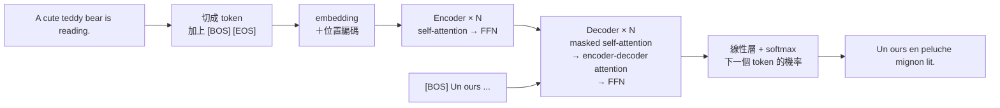

> 🌏 [English version](/posts/ai/2026-09-29-cme295-transformer-en)

本篇對應 Stanford [CME295](/posts/ai/2026-09-29-stanford-cme295-transformers-llms) 第 1 講「Transformer」。主要來源是 2025 版的[錄影](https://www.youtube.com/watch?v=Ub3GoFaUcds)與 [135 頁投影片](https://cme295.stanford.edu/slides/fall25-cme295-lecture1.pdf)，另外對照 2026 年 9 月 25 日剛上的新版[錄影](https://www.youtube.com/watch?v=114i2Kz-LZA)與[投影片](https://cme295.stanford.edu/slides/fall26-cme295-lecture1.pdf)。

整堂課只用一句例句：「A cute teddy bear is reading.」這句話先被切成 token、變成向量，再交給 RNN，然後說明 RNN 為什麼撐不住，最後由 Transformer 翻成法文「Un ours en peluche mignon lit.」。跟著這句話走一遍，就是這一講的全部路線。

## 課程影片來源

下列影片連結已列於本文對應講次的來源。

```youtube
url: https://www.youtube.com/watch?v=Ub3GoFaUcds
title: 2025 版第 1 講錄影
```

```youtube
url: https://www.youtube.com/watch?v=114i2Kz-LZA
title: 2026 版第 1 講錄影
```

原始影片：[2025 版第 1 講錄影](https://www.youtube.com/watch?v=Ub3GoFaUcds)、[2026 版第 1 講錄影](https://www.youtube.com/watch?v=114i2Kz-LZA)

課程與錄影入口：

- [官方課程／講次來源](https://cme295.stanford.edu/syllabus/2025/)

## 第一步：把句子切成 token

模型看不到文字，只看得到 token。切的方式有三種粒度，投影片各列了優缺點：

| 粒度 | 例子 | 好處 | 代價 |
|---|---|---|---|
| word-level | `cute` `teddy` `bear` | 簡單、好解讀 | 詞彙表很大；看不出 `reading` 和 `read` 同根；遇到沒看過的詞就沒轍 |
| character-level | `c` `u` `t` `e` … | 詞彙表小；大小寫亂打、拼錯字也能處理 | 序列變長、計算慢；單一字母的向量沒有意義 |
| subword-level | `ted` `##dy` `read` `##ing` | 共用字根；從資料學出來 | 要多做一步訓練；效果取決於訓練語料 |

word-level 的問題用一個拼錯的字就能看出來：「tedi bear」裡的 `tedi` 不在詞彙表裡，只能變成 `[UNK]`（unknown）。subword 會把它拆成認得的小片段，這是今天幾乎所有 LLM 都用 subword（例如 [BPE](https://arxiv.org/abs/1508.07909)）的原因。

除了 `[UNK]`，投影片還介紹了三個特殊 token：`[BOS]` 標記序列開頭、`[EOS]` 標記結尾、`[PAD]` 把長短不一的句子補齊。投影片也提醒，實際模型還有更多特殊 token，例如聊天模型用來區分 user 和 assistant 的標記，而且各家寫法不同。想看 BPE 怎麼一步步合併位元組，可以讀 [CS336 第 1 講導讀](/posts/ai/2026-08-22-cs336-overview-tokenization)。

## 第二步：把 token 變成向量

最直接的表示法是 one-hot：詞彙表有 V 個詞，每個 token 就是一個長度 V、只有一格是 1 的向量。問題是任兩個 one-hot 向量都互相垂直，「cute」和「soft」的距離跟「cute」和「laughing」一樣遠。

[word2vec](https://arxiv.org/abs/1301.3781) 的做法是設計一個代理任務，逼神經網路自己學出有意義的向量：

- **CBOW**：用前後文猜中間的詞
- **Skip-gram**：用中間的詞猜前後文

網路架構只有三層：輸入是 V 維 one-hot，中間是 d 維的隱藏層，輸出又回到 V 維的機率分布。訓練完，我們不要它的預測，只留下中間那層，它就是每個詞的 embedding。投影片用「a cute teddy bear is reading」一步步示範預測下一個詞，數字都是小到可以手算的玩具例子。

word2vec 有兩個根本限制：它不管詞序，而且同一個詞不管出現在哪個句子，向量都一樣，無法隨上下文變化。這兩點就是下一步要解決的問題。word2vec 的推導細節可以看 [CS224N 第 2 講導讀](/posts/ai/2026-08-22-cs224n-word-vectors)。

## 第三步：RNN 記得順序，但記不住長句

[RNN](/posts/ai/2026-08-22-cs224n-rnn-language-models) 一次讀一個 token，把目前為止的理解存在隱藏狀態裡往下傳。這解決了詞序問題，同一套架構可以做分類、序列標註、文字生成和翻譯。[LSTM](https://www.bioinf.jku.at/publications/older/2604.pdf) 在 1997 年幫隱藏狀態加上更有結構的閘門，當年拿下最好的成績。

投影片列的缺點有兩個：**梯度消失**，句子一長，開頭的資訊傳到後面就淡掉了；還有**計算很慢**，因為必須一個 token 接一個 token 算，無法平行。

翻譯任務把第一個問題放大了。seq2seq 模型要把整句英文壓進一個固定長度的向量，再從這個向量吐出法文，句子一長就「忘記」前面說了什麼。2014 年 [Bahdanau 等人](https://arxiv.org/abs/1409.0473)的解法是：生成每個法文字的時候，回頭看一遍英文原句，決定現在該對齊哪幾個字。這就是 attention 的起點。

## 第四步：attention，讓每個 token 自己去找相關的字

2017 年的 [Attention Is All You Need](https://arxiv.org/abs/1706.03762) 更進一步：既然 attention 這麼好用，乾脆把 RNN 拿掉，整個模型只靠 attention。

投影片用 Query、Key、Value 三個角色解釋 self-attention。直覺是一個查資料的動作：

- **Query**：我現在想找什麼（例如「bear」想知道自己被什麼形容）
- **Key**：每個 token 貼出來的標籤，讓別人判斷跟自己相不相關
- **Value**：真正要被拿走的內容

每個 token 拿自己的 Query 去比對所有 token 的 Key，算出相關分數，再依分數對所有 Value 取加權平均。結果是「bear」的新向量裡混進了「cute」和「teddy」的資訊，這就是 word2vec 做不到的上下文相依表示。所有 token 可以同時算，所以也沒有 RNN 的速度瓶頸。

<details>
<summary>公式：scaled dot-product attention</summary>

```
Attention(Q, K, V) = softmax( Q Kᵀ / √d_k ) V
```

- `Q Kᵀ`：每一對 token 的相關分數，一次用矩陣乘法算完
- `√d_k`：縮放。2025 期中考第 I.5 題考的就是它：向量維度大時點積會很大，softmax 會飽和，梯度幾乎為零
- `softmax`：把分數變成總和為 1 的權重
- 乘上 `V`：依權重取 Value 的加權平均

</details>

## 第五步：組成一台 Transformer

原始 Transformer 是為翻譯設計的，分成兩半：

- **Encoder**：投影片的說法是「compute meaningful embeddings」，讀完整句英文，替每個 token 算出帶上下文的向量
- **Decoder**：「generate next token」，一次產生一個法文 token



因為 attention 本身看不出順序，輸入要先加上**位置編碼**，可以用學出來的向量，也可以用固定的正弦函數。decoder 比 encoder 多一層 **encoder-decoder attention**：產生法文時，用法文這邊的 Query 去查英文那邊的 Key 和 Value，功能跟 Bahdanau 的 attention 一樣。最後的輸出層其實是一個分類問題，類別就是詞彙表裡的每個詞。

投影片花了不少篇幅講讓這台機器訓練得起來的技巧：

| 技巧 | 做什麼 | 為什麼需要 |
|---|---|---|
| [殘差連接](https://arxiv.org/abs/1512.03385) | 把子層輸入直接加到輸出 | 梯度有捷徑可以往回傳 |
| layer normalization | 對每個 token 的隱藏向量正規化 | 各層數值尺度穩定，收斂更快 |
| masking（causal） | 訓練時遮住還沒生成的未來 token | 避免模型偷看答案，而且整句可以一次向量化計算 |
| multi-head attention | 同時跑好幾組 attention | 每組抓不同的關係，類似 CNN 的多個濾鏡 |
| [dropout](https://jmlr.org/papers/v15/srivastava14a.html) | 隨機關掉部分連結 | 泛化更好 |
| label smoothing | 把正確答案的機率從 1 調低一點 | 避免過度自信，提高 BLEU |

## 連回你用的模型

今天主流的聊天 LLM（GPT 系列、Llama、Qwen 等公開過架構的模型）都不是這台完整的 encoder-decoder，而是只留下 decoder 的版本。它們沒有「英文句子」要讀，只有「目前為止的對話」，任務永遠是預測下一個 token。masking、多頭注意力、殘差和 layer norm 則全部留了下來。

所以這一講雖然用翻譯當例子，講的其實是今天所有 LLM 的零件。第 2 講會接著說明同一台 Transformer 怎麼分化成 encoder-only 的 BERT 和 decoder-only 的 GPT，以及 attention 怎麼被改得更省記憶體。

## 2026 版改了什麼

對照兩版投影片（2025 版 135 頁，2026 版 118 頁），主體幾乎一樣，包括最後那段用例句一格一格走完整台 Transformer 的「Stitching all the pieces together」範例，兩版都有。差別在頭尾：

- **刪掉「NLP overview」整節**：2025 版開頭介紹情緒分析、命名實體辨識、翻譯三類任務，以及 BLEU、ROUGE、F1、perplexity 等評估指標和資料集；2026 版只用一頁時間軸帶過這些任務。
- **時間軸多一格「Agentic era」**：放上 Claude Code、Cursor、Codex、Antigravity，最後一頁說這門課會涵蓋「對話」和「agent」兩個時代。
- **縮寫表換了一批**：新增 MLA、SWA、QKNorm、GSPO、RLVR、SWE-bench、HLE 等詞，拿掉 GloVe、CoT、ToT、RAG 等，也預告了後面幾講的重心。

## 自我檢測

以下題目改寫自 [2025 期中考](https://cme295.stanford.edu/exams/fall25-cme295-midterm.pdf)第 I 大題，答案在[解答 PDF](https://cme295.stanford.edu/exams/fall25-cme295-midterm-solutions.pdf)：

1. 跟 word-level 比，subword tokenization 最主要的好處是什麼？（第 1 題）
2. word2vec 的哪一種代理任務是用前後文猜中間的詞？（第 2 題）
3. 哪一個子層只出現在 decoder，不出現在 encoder？（第 4 題）
4. scaled dot-product attention 為什麼要除以 √d_k？（第 5 題）
5. 寫出 self-attention 的公式，並說明 Q、K、V 各自的角色。（第 9 題）
6. label smoothing 在最佳化什麼？為什麼有助於泛化？（第 10 題）

## 想深入

- 詞向量的推導：[CS224N 第 2 講：word2vec 如何把語意變成向量](/posts/ai/2026-08-22-cs224n-word-vectors)
- RNN 與梯度消失：[CS224N 第 4 講：語言模型、RNN 與消失梯度](/posts/ai/2026-08-22-cs224n-rnn-language-models)
- 從 recurrence 到 Transformer 的另一種講法：[CS224N 第 5 講](/posts/ai/2026-08-22-cs224n-transformers)
- 自己實作 BPE：[CS336 Lecture 1](/posts/ai/2026-08-22-cs336-overview-tokenization)

## 更新紀錄

- 2026-10-10：補上課程影片來源與錄影取得方式。

## 參考資料

- [CME 295 2025 版課表](https://cme295.stanford.edu/syllabus/2025/)
- [2025 版第 1 講投影片（PDF）](https://cme295.stanford.edu/slides/fall25-cme295-lecture1.pdf)
- [2025 版第 1 講錄影](https://www.youtube.com/watch?v=Ub3GoFaUcds)
- [2026 版第 1 講投影片（PDF）](https://cme295.stanford.edu/slides/fall26-cme295-lecture1.pdf)
- [2026 版第 1 講錄影](https://www.youtube.com/watch?v=114i2Kz-LZA)
- [2025 期中考](https://cme295.stanford.edu/exams/fall25-cme295-midterm.pdf)／[解答](https://cme295.stanford.edu/exams/fall25-cme295-midterm-solutions.pdf)
- [Sennrich et al., Neural Machine Translation of Rare Words with Subword Units (2015)](https://arxiv.org/abs/1508.07909)
- [Mikolov et al., Efficient Estimation of Word Representations in Vector Space (2013)](https://arxiv.org/abs/1301.3781)
- [Hochreiter & Schmidhuber, Long Short-Term Memory (1997)](https://www.bioinf.jku.at/publications/older/2604.pdf)
- [Bahdanau et al., Neural Machine Translation by Jointly Learning to Align and Translate (2014)](https://arxiv.org/abs/1409.0473)
- [Vaswani et al., Attention Is All You Need (2017)](https://arxiv.org/abs/1706.03762)
- [He et al., Deep Residual Learning for Image Recognition (2015)](https://arxiv.org/abs/1512.03385)
- [Srivastava et al., Dropout (2014)](https://jmlr.org/papers/v15/srivastava14a.html)
- [Stanford CME295 導讀（本系列總覽）](/posts/ai/2026-09-29-stanford-cme295-transformers-llms)
