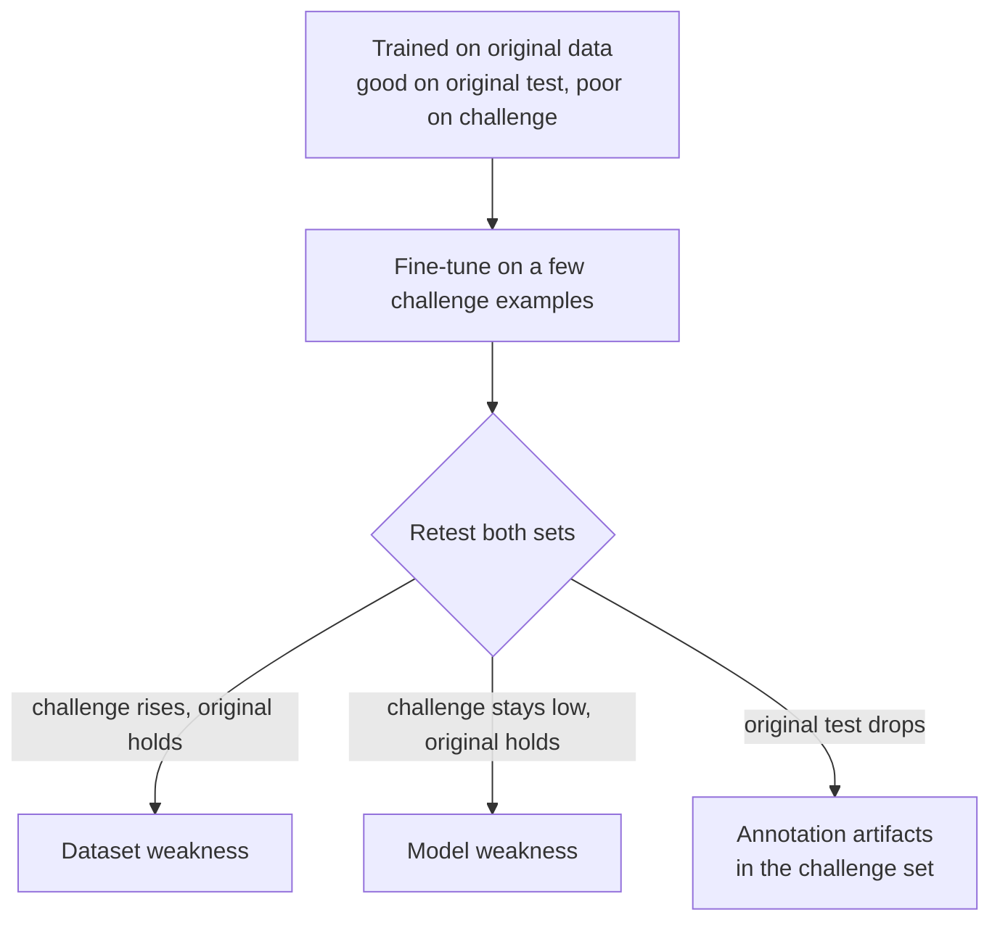
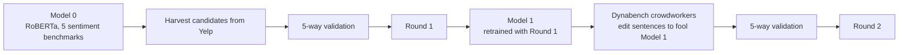

> 🌏 [中文版](/posts/ai/2026-09-29-cs224u-behavioral-evaluation)

> **Version note**: This post is based on the Spring 2023 offering of [CS224U](https://web.stanford.edu/class/cs224u/), the last on-campus version with a fully public site. The main materials are six sections of the [Advanced behavioral evaluation slides](https://web.stanford.edu/class/cs224u/slides/cs224u-behavioraleval-2023-handout.pdf) (Overview, Analytical, Tests, ANLI, DynaSent, Conclusions) and screencasts 25–26 and 29–31 of the [XCS224U playlist](https://www.youtube.com/playlist?list=PLoROMvodv4rOwvldxftJTmoR3kRcWkJBp). Every fact was checked against official materials on 2026-09-29. Access grade **A3**: slides and screencasts are fully public. What you can't get is Quiz 3 on Canvas and the classroom recordings.

**Series**: previous [Assignment 2: Few-shot OpenQA with DSPy](/posts/ai/2026-09-29-cs224u-hw2-openqa-dspy-en) | next [Compositional generalization: COGS, ReCOGS, and Assignment 3](/posts/ai/2026-09-29-cs224u-compositionality-recogs-hw3-en) | [Series overview](/posts/ai/2026-08-21-stanford-cs224u-natural-language-understanding-en)

The first three units were about models and architectures. The fourth turns to how we gather evidence and mark progress. At the start of [screencast 25](https://www.youtube.com/watch?v=l_w05N0QGLk), Potts says this unit looks only at input/output behavior; the next one goes inside the model.

The deck runs 80 pages. Its Compositionality and (Re)COGS sections tie into Assignment 3, so they get [their own post](/posts/ai/2026-09-29-cs224u-compositionality-recogs-hw3-en). This one covers the other six sections.

## Varieties of evaluation

Slide 3 sorts evaluation into two families:

- **Behavioral**: standard (IID), exploratory, hypothesis-driven, challenge, adversarial, security-oriented.
- **Structural**: probing, feature attribution, interventions.

The screencast presents the behavioral list as a spectrum that gets steadily less friendly. IID evaluation guarantees that test examples resemble training examples, which is the kindest setting for a system. Exploratory and hypothesis-driven tests start to step outside that assumption, for example by asking directly whether the model knows about synonyms. Challenge sets pose problems you know will be hard; adversarial sets come from studying the training data and the model, then building examples you expect it to fail. At the far end, security-oriented tests feed in unusual character combinations to see whether the model does something toxic or unsafe.

Structural evaluation is the topic of the fifth unit, covered later in this series.

## Why standard evaluation is too friendly

The slides lay out both procedures as five steps. Standard evaluation:

1. Create a dataset from a **single process**.
2. Divide it into disjoint train and test sets, and set the test set aside.
3. Develop a system on the train set.
4. Only after all development is complete, evaluate on the test set.
5. Report the results as an estimate of the system's capacity to generalize.

Adversarial evaluation changes steps 1 and 3: build the dataset however you like, then build a new test set of examples "that you suspect or know will be challenging."

In the screencast, Potts puts the weight on step 1. If train and test come from one process, you've already gone easy on the system, and the "capacity to generalize" in step 5 only holds within that distribution. For step 5 to hold up for a deployed system, diverse teams have to go looking for hard cases on purpose.

The idea isn't new. The slides trace it from Turing's 1950 imitation game through Winograd 1972 to [Levesque 2013](https://www.cs.toronto.edu/~hector/Papers/ijcai-13-paper.pdf). Winograd sentences are the classic example:

> The trophy doesn't fit into the brown suitcase because it's too small. What is too small?

Change small to large and the answer flips from the suitcase to the trophy. Levesque called the goal of such questions "foiling cheap tricks": make statistical shortcuts insufficient.

## What behavioral testing can and can't tell us

This is the subject of screencast 26 and the section most worth taking away.

**First, behavioral testing never gives a guarantee.** The slides use a black-box model that says whether a number word is even or odd. Model 1 gets five inputs like four and twenty one right; open it up and it's a lookup table that says odd for anything else, so 22 fails. Model 2 looks only at the last word and also passes, but sixteen fails. With model 3 you can keep testing, but you'll never be sure you haven't missed a case. The screencast's point: both earlier flaws were found by **looking inside the model**, not by behavioral tests.

**Second, metric limitations usually go unaddressed.** Most of the adversarial-testing literature keeps the original task's metrics. Potts says he plays by those rules in this unit, but a truly adversarial test could step outside the task's framing.

**Third, when a test fails, ask whether the model failed or the dataset did.** The slides use truth tables to show an unfair task. The training data cover only two combinations of p and q, and on those two rows p→q and p∨q give identical outputs. If you had p∨q in mind and the model learned p→q, the fault is the task designer's. The screencast adds the sequence 3, 5, 7: is the next number 9 (odd numbers) or 11 (primes)? The prompt doesn't decide.

### Three outcomes of inoculation by fine-tuning

To tell the two kinds of failure apart, the course uses [Liu et al. 2019](https://aclanthology.org/N19-1225/): after the model fails the challenge set, fine-tune it on a few challenge examples, then retest on both the original test set and the challenge set.

The screencast names a research temptation. Everyone wants to claim a model weakness, because "the Transformer fundamentally can't learn X" is a headline. A dataset weakness is more common, and it just means the data were insufficient and more data would fix it.

The course's example comes from Potts's own lab: MoNLI ([Geiger et al. 2020](https://aclanthology.org/2020.blackboxnlp-1.16/)). It tests negation's entailment reversal: pizza entails food, so not food entails not pizza. BERT trained only on SNLI scored 2.2% on the negated half of MoNLI, as if it ignored negation entirely. After fine-tuning on negated MoNLI, that number went to 90.0, with SNLI performance roughly unchanged. The slide's diagnosis is two words: "Dataset failing!"

The section ends with a caution in the other direction: biological creatures often solve "unfair" tasks. The slides cite relational match-to-sample, where young children and some animals make same/different judgments with essentially no training. So we should pose fair tasks, and also remember that some generalizations we expect aren't supported by the data.

## Three adversarial tests, three lessons

Screencast 29 revisits this history through three cases, each teaching something different.

**SQuAD and distractor sentences ([Jia & Liang 2017](https://aclanthology.org/D17-1215/)).** The screencast shows a SQuAD leaderboard where humans sit at about 87% exact match, yet you have to go down to position 31 to find a system worse than humans. Jia and Liang appended a misleading sentence to each passage, and models switched to the name in that sentence. Train on those examples and models learn to ignore the end of the passage; prepend the sentence instead and they're fooled again. Worse, the ranking reshuffled: the original number 1 fell to 5, number 2 fell to 10, and the original number 7 took first place. The slide's scatter plot of original versus adversarial scores shows no evident correlation.

**Breaking NLI ([Glockner et al. 2018](https://aclanthology.org/P18-2103/)).** The method is simple. Replace sad in an SNLI hypothesis with its synonym unhappy, and models tend to switch to contradiction. Replace wine with champagne (disjoint but closely related) and models still say entailment. The test rests on a systematicity intuition: swapping a synonym shouldn't change the label. In the screencast Potts adds a rerun of his own. He downloaded a RoBERTa model fine-tuned on MultiNLI and, with no changes, it essentially solved the adversary, even across datasets. He says even the most cynical would call that progress.

**NLI stress tests ([Naik et al. 2018](https://aclanthology.org/C18-1198/)).** The course schedule labels this "Naik et al. 2019," but the link goes to the COLING 2018 Stress Test Evaluation paper. It has categories including antonyms, numerical reasoning, word overlap, and negation. Systems that do well on MultiNLI do badly on almost all of them. Run through the inoculation framework, though, the same benchmark yields three different diagnoses:

| Category | Diagnosis |
|---|---|
| Word overlap, negation | Dataset weakness: solvable given enough examples |
| Spelling errors, length mismatch | Model weakness: fine-tuning doesn't help |
| Numerical reasoning | Challenge-set artifacts: fine-tuning disrupts the model |

Potts calls this a sign of progress in itself: we now have tools to ask **why** models fail on different challenge sets.

## ANLI: bringing the adversary into training

Screencast 30 moves from testing to training. As far as Potts knows, [ANLI (Nie et al. 2020)](https://aclanthology.org/2020.acl-main.441/) is the first large train set full of adversarial examples. The slides give its collection procedure in five steps:

1. The annotator gets a premise and a target condition (entailment, contradiction, neutral).
2. The annotator writes a hypothesis.
3. A state-of-the-art model predicts the label for the pair.
4. If the model's prediction matches the condition, the annotator goes back to step 2.
5. If the model was fooled, other annotators independently validate the pair.

The dataset also includes "reason" texts, the annotator's explanation of why the model might have failed. The screencast notes these have barely been used in the literature and could serve as indirect supervision.

The key rows in the results table are BERT's. Trained only on SNLI and MultiNLI, it gets about 20% accuracy on the three ANLI rounds combined. Adding earlier ANLI rounds to training helps, but performance stays far below its SNLI and MultiNLI numbers.

The slides then quote two lines describing a vision for evaluation. [Zellers et al. 2019](https://aclanthology.org/P19-1472/) (HellaSwag):

> a path for NLP progress going forward: towards benchmarks that adversarially co-evolve with evolving state-of-the-art models.

The ANLI paper describes this as a "moving post" dynamic target rather than a static benchmark that will eventually saturate. [Dynabench (Kiela et al. 2021)](https://aclanthology.org/2021.naacl-main.324/) is the open-source platform built to do this; the slides list its four tasks at the time: NLI, QA, sentiment, and hate speech.

## DynaSent: the details of a two-round design

Screencast 31 is a deep dive on [DynaSent](https://aclanthology.org/2021.acl-long.186/). You already used this data in [Assignment 1](/posts/ai/2026-09-29-cs224u-hw1-multidomain-sentiment-en); here's how it was built. It has 121,634 sentences across two rounds, each with five human labels.

**Round 1 was harvested, not written.** Model 0 is a RoBERTa classifier trained on five benchmarks: CR, IMDB, SST-3, Yelp, and Amazon. The harvesting heuristic favors sentences from 1-star reviews that Model 0 predicts positive, and from 5-star reviews it predicts negative. It's only a heuristic; every final label comes from human validation. The result is 47% adversarial examples.

The screencast recommends a training method called distributional training: repeat each example five times, once with each annotator's label. You keep the examples that have no majority label, and the model sees the spread in human judgments. Potts says this produces more robust models in practice.

Round 1's dev and test sets balance the three classes and are set up so Model 0 performs at chance. Estimated human F1 is about 88%; the slide notes that 614 of 1,280 workers never disagreed with the majority label.

**Round 2 was written by people, but not from scratch.** The team first followed ANLI and asked crowdworkers to write a sentence from scratch that would fool the model. That turned out to be a hard creative-writing task, and people repeated similar tricks, which risks artifacts. They switched to a "prompt condition": give the worker a real sentence from Yelp and ask them to **edit** it to fool Model 1. This round has only 19% adversarial examples, which the screencast reads as a sign that Model 1 is hard to fool. Human F1 is higher, at about 90%.

## The unit's five open questions

The last content slide lists five questions, and the screencast gives Potts's leanings:

1. **Can adversarial training improve systems?** He thinks the evidence overall says yes, with nuance still to calibrate.
2. **What constitutes a fair non-IID generalization test?** This gets sharpest with the all-zero COGS splits; see the [next post](/posts/ai/2026-09-29-cs224u-compositionality-recogs-hw3-en).
3. **Can hard behavioral testing certify systems as trustworthy?** In a way, he says, we know the answer is no: no behavioral test can give that kind of guarantee, and certifying safety means going inside the model.
4. **Are our best systems finding systematic solutions?**
5. **Where humans generalize without direct experience, how should AI system design respond?** He says he doesn't have an answer.

## How to self-study it

1. Watch screencast 26 first (about 22 minutes). It's the analytical frame for the whole unit, and every case study reads better through it.
2. For each adversarial test, place it in the three inoculation outcomes: did the failure turn out to be the data, the model, or the challenge set?
3. When you do Assignment 1 or a final project, treat DynaSent's distributional training as a ready-made comparison condition.

One thing to do tonight: take any classifier you have and write five minimal pairs that differ by one word, like the slides' "The bakery sells a mean apple pie" and "She sells a mean apple pie." If even one pair flips its prediction, you have a starting point for an inoculation experiment.

## Further reading

- Course status and the COGS results table: [Stanford CS224U (series overview)](/posts/ai/2026-08-21-stanford-cs224u-natural-language-understanding-en)
- How CS224N covered the same ground in 2026: [CS224N Lecture 11: Why LLM Benchmarks Expire](/posts/ai/2026-08-22-cs224n-benchmark-evaluation-en)
- Methods that look inside the model: [CS224N Lecture 15: Reading Agentic Interpretability Without Public Slides](/posts/ai/2026-08-22-cs224n-interpretability-en)

## References

- [CS224U course site (Spring 2023)](https://web.stanford.edu/class/cs224u/) — the April 26 session and this unit's reading list
- [Advanced behavioral evaluation slides (Spring 2023)](https://web.stanford.edu/class/cs224u/slides/cs224u-behavioraleval-2023-handout.pdf) — varieties of evaluation, the two five-step procedures, the even/odd models, the MoNLI table, ANLI's procedure, DynaSent numbers, the five open questions
- [Screencast 25: Overview (XCS224U, Spring 2023)](https://www.youtube.com/watch?v=l_w05N0QGLk) — the evaluation spectrum and step 1 of standard evaluation
- [Screencast 26: Analytical considerations](https://www.youtube.com/watch?v=sZPxZm8HfaE) — limits of behavioral testing, fairness, inoculation, MoNLI
- [Screencast 29: Adversarial testing](https://www.youtube.com/watch?v=486mTOQnhgU) — the SQuAD reshuffle, Breaking NLI, the RoBERTa rerun, Naik's three diagnoses
- [Screencast 30: Adversarial NLI](https://www.youtube.com/watch?v=_ZkewUyBb-w) — ANLI's collection procedure, reason texts, Dynabench
- [Screencast 31: DynaSent and conclusion](https://www.youtube.com/watch?v=2K0BH52EtIw) — two rounds, distributional training, the prompt condition, open questions
- [Jia & Liang, Adversarial Examples for Evaluating Reading Comprehension Systems (EMNLP 2017)](https://aclanthology.org/D17-1215/)
- [Glockner, Shwartz & Goldberg, Breaking NLI Systems with Sentences that Require Simple Lexical Inferences (ACL 2018)](https://aclanthology.org/P18-2103/)
- [Liu, Schwartz & Smith, Inoculation by Fine-Tuning (NAACL 2019)](https://aclanthology.org/N19-1225/)
- [Naik et al., Stress Test Evaluation for Natural Language Inference (COLING 2018)](https://aclanthology.org/C18-1198/) — listed as 2019 on the course schedule
- [Nie et al., Adversarial NLI (ACL 2020)](https://aclanthology.org/2020.acl-main.441/)
- [Kiela et al., Dynabench (NAACL 2021)](https://aclanthology.org/2021.naacl-main.324/)
- [Potts, Wu, Geiger & Kiela, DynaSent (ACL 2021)](https://aclanthology.org/2021.acl-long.186/)
- [cgpotts/dynasent GitHub repo](https://github.com/cgpotts/dynasent) — the data, code, and models listed on the slides
- [Geiger, Richardson & Potts, Neural NLI models partially embed theories of lexical entailment and negation (BlackboxNLP 2020)](https://aclanthology.org/2020.blackboxnlp-1.16/) — source of MoNLI
- [Zellers et al., HellaSwag (ACL 2019)](https://aclanthology.org/P19-1472/) — source of the "adversarially co-evolve" quote
- [Levesque, On Our Best Behaviour (IJCAI 2013)](https://www.cs.toronto.edu/~hector/Papers/ijcai-13-paper.pdf) — foiling cheap tricks
