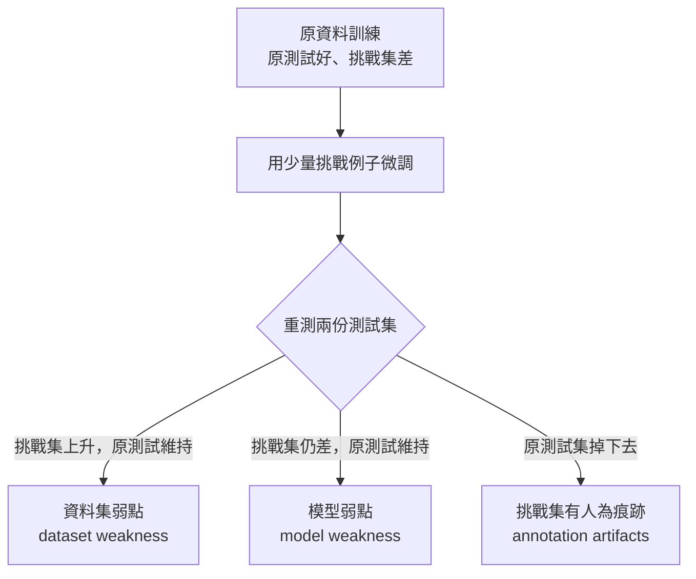
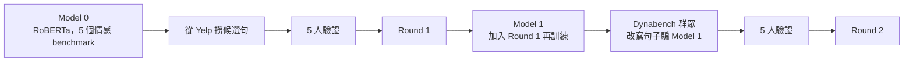

> 🌏 [English version](/posts/ai/2026-09-29-cs224u-behavioral-evaluation-en)

**影片狀態：已附影片。** [影片來源與說明](#課程影片來源)

> **版本說明**：本文依據 [CS224U](https://web.stanford.edu/class/cs224u/) 2023 春季版（課程網站最後一次完整公開的校內版）。主要材料是 [Advanced behavioral evaluation 投影片](https://web.stanford.edu/class/cs224u/slides/cs224u-behavioraleval-2023-handout.pdf)的 Overview、Analytical、Tests、ANLI、DynaSent、Conclusions 六節，以及 [XCS224U 播放清單](https://www.youtube.com/playlist?list=PLoROMvodv4rOwvldxftJTmoR3kRcWkJBp)第 25–26、29–31 支錄影。事實皆於 2026-09-29 打開官方材料核對。存取等級 **A3**：投影片與錄影全公開；拿不到的是 Canvas 上的 Quiz 3 與教室錄影。

**系列位置**：上一篇 [作業二：用 DSPy 做少樣本 OpenQA](/posts/ai/2026-09-29-cs224u-hw2-openqa-dspy)｜下一篇 [組合性泛化：COGS、ReCOGS 與作業三](/posts/ai/2026-09-29-cs224u-compositionality-recogs-hw3)｜[系列總覽](/posts/ai/2026-08-21-stanford-cs224u-natural-language-understanding)

前面三個單元都在講模型與架構。第四單元換一個方向：我們怎麼蒐集證據、怎麼標記進步。Potts 在[第 25 支錄影](https://www.youtube.com/watch?v=l_w05N0QGLk)開頭說，這個單元只看輸入輸出行為；下一個單元才往模型內部看。

這份投影片有 80 頁，中間的 Compositionality 與 (Re)COGS 兩節跟作業三綁在一起，留到[下一篇](/posts/ai/2026-09-29-cs224u-compositionality-recogs-hw3)。本篇講其餘六節。

## 課程影片來源

下列影片是 Stanford Online 發布的 Spring 2023 對應講次錄影，與本文採用的 2023 年春季版課程一致。2026-10-10 已對照官方播放清單（50 支）比較影片標題與影片 ID。

```youtube
url: https://www.youtube.com/watch?v=l_w05N0QGLk
title: Stanford XCS224U: NLU I Behavioral Evaluation of NLU Models, Part 1: Overview I Spring 2023
```

```youtube
url: https://www.youtube.com/watch?v=sZPxZm8HfaE
title: Stanford XCS224U I Behavioral Eval of NLU Models, Pt 2: Analytical Considerations I Spring 2023
```

原始影片：[Stanford XCS224U: NLU I Behavioral Evaluation of NLU Models, Part 1: Overview I Spring 2023](https://www.youtube.com/watch?v=l_w05N0QGLk)、[Stanford XCS224U I Behavioral Eval of NLU Models, Pt 2: Analytical Considerations I Spring 2023](https://www.youtube.com/watch?v=sZPxZm8HfaE)

內容核對：已依字幕核對（2026-10-10）：影片 25（Part 1: Overview）與影片 26（Part 2: Analytical Considerations）的字幕逐項對照：評估光譜、標準評估與對抗評估流程、Winograd／Levesque、奇偶模型、不公平題目的兩個例子、inoculation by fine-tuning 三種結果、MoNLI；文中引用的影片 29–31（Adversarial Testing／ANLI／DynaSent）也讀過，SQuAD 排名洗牌、Breaking NLI、Naik 三種診斷、ANLI 流程、DynaSent 兩輪設計與五個開放問題皆吻合。唯一無法由字幕支持的是『約 22 分鐘』的片長，已刪除；MoNLI 的 2.2% 與 90.0 為投影片數字，字幕只說『essentially 0』。

課程與錄影入口：

- [XCS224U 播放清單](https://www.youtube.com/playlist?list=PLoROMvodv4rOwvldxftJTmoR3kRcWkJBp)
- [官方課程／講次來源](https://web.stanford.edu/class/cs224u/)

## 評估有哪幾種

投影片第 3 頁把評估分成兩大類：

- **行為評估**：標準（IID）、探索式、假設驅動、挑戰、對抗、安全導向。
- **結構評估**：probing、feature attribution、interventions。

錄影把行為評估那一排講成一條越來越不友善的光譜。IID 評估保證測試例子跟訓練例子很像，對系統最友善。探索式與假設驅動開始跨出這個假設，例如專門問「模型懂不懂同義詞」。挑戰集刻意出你知道很難的題目，對抗集則是研究過訓練資料與模型之後，專挑會失敗的例子。最極端的是安全導向：丟進不尋常的字元組合，看模型會不會產出有害內容。

結構評估是第五單元的主題，本系列之後會寫。

## 標準評估為什麼太友善

投影片把兩套流程並排寫成五步驟。標準評估：

1. 用**單一流程**建一份資料集。
2. 切成互不重疊的訓練集與測試集，測試集鎖起來。
3. 在訓練集上開發系統。
4. 開發完才用測試集評估。
5. 把結果當成系統泛化能力的估計。

對抗評估只改了第 1 與第 3 步：資料集怎麼建都行，另外再建一份「你懷疑或確知會讓系統出錯」的新測試集。

Potts 在錄影裡強調的是第 1 步。只要訓練與測試資料出自同一個流程，你在第 1 步就已經對系統放水了，第 5 步的「泛化能力」其實只保證在同一分布內。系統要部署到真實世界，第 5 步要站得住，就得用多元的團隊去刻意找難題。

這個想法不新。投影片從 Turing 1950 的模仿遊戲、Winograd 1972 講到 [Levesque 2013](https://www.cs.toronto.edu/~hector/Papers/ijcai-13-paper.pdf)。Winograd 句是其中最經典的一組：

> The trophy doesn't fit into the brown suitcase because it's too small. What is too small?

把 small 換成 large，答案就從行李箱變成獎盃。Levesque 把這種題目的目的叫做「foiling cheap tricks」，要讓統計捷徑不夠用。

## 行為測試能證明什麼、不能證明什麼

這是第 26 支錄影的主題，也是整個單元最值得帶走的一節。

**第一，行為測試永遠給不了保證。** 投影片用一個「判斷數字是奇是偶」的黑盒模型示範。模型 1 對 four、twenty one 等五個輸入全對，打開一看，它只是一張查表，查不到就回答 odd，所以 22 會錯。模型 2 改成只看最後一個詞，同樣全對，但 sixteen 會錯。到了模型 3，你還能繼續測，但永遠不確定有沒有漏掉的例子。錄影的重點是：前兩次都是**打開模型才找到弱點**，不是行為測試找到的。

**第二，指標的限制通常沒被處理。** 對抗測試文獻大多沿用原任務的指標。Potts 說他在這個單元也照這個規矩走，但真正的對抗測試可以跳出原任務的框架。

**第三，失敗時要先問：是模型失敗，還是資料集失敗？** 投影片用兩張真值表說明「不公平的題目」。訓練資料只給了 p、q 的兩種組合，這兩種組合下，p→q 與 p∨q 的輸出一模一樣。你心裡想的是 p∨q，模型學成 p→q，錯的是出題的人。錄影還舉了數列 3、5、7：下一個是 9（奇數）還是 11（質數），題目本身沒有決定。

### Inoculation by fine-tuning 的三種結果

要把兩種失敗分開，課程用的是 [Liu et al. 2019](https://aclanthology.org/N19-1225/) 的方法：模型在挑戰集上失敗後，拿少量挑戰例子微調，再同時測原測試集與挑戰集。



錄影提醒一個研究上的誘惑：大家都想宣稱找到「模型弱點」，因為「Transformer 根本學不會某現象」是頭條級結果。但更常見的情況是資料集弱點，意思只是資料不夠，補資料就好。

課程拿自己實驗室的 MoNLI 當例子（[Geiger et al. 2020](https://aclanthology.org/2020.blackboxnlp-1.16/)）。它測的是否定的蘊含反轉：pizza 蘊含 food，那 not food 就蘊含 not pizza。只在 SNLI 上訓練的 BERT，在否定版 MoNLI 上的準確率是 2.2%，看起來完全忽略了否定。用否定版 MoNLI 微調之後，這個數字變成 90.0，SNLI 表現幾乎沒掉。投影片的診斷寫得很短：「Dataset failing!」

這一節最後補了一個反方向的提醒：生物其實經常解得出「不公平」的題目。投影片舉的是 relational match-to-sample，幼兒與部分動物幾乎不需要訓練，就能做「相同／不同」的關係判斷。所以我們一方面要出公平的題，一方面也要記得，有些我們期待的泛化，資料本身並不支持。

## 三個對抗測試的教訓

第 29 支錄影用三個案例回顧這段歷史，每個教的東西不一樣。

**SQuAD 與干擾句（[Jia & Liang 2017](https://aclanthology.org/D17-1215/)）。** 錄影截了一張 SQuAD 排行榜：人類約 87% exact match，但要往下數到第 31 名才找得到比人類差的系統。Jia & Liang 在段落末尾加一句誤導句，模型就改答那句裡的名字。把這類例子加進訓練集，模型學會不理段尾；改成加在段首，模型又被騙。更麻煩的是排名整個洗牌：原本第 1 名掉到第 5，第 2 名掉到第 10，第 7 名反而變第 1。投影片畫的原始分數對對抗分數散佈圖，看不出任何相關。

**Breaking NLI（[Glockner et al. 2018](https://aclanthology.org/P18-2103/)）。** 做法很簡單：把 SNLI 假設句裡的 sad 換成同義詞 unhappy，模型卻傾向改判矛盾；把 wine 換成 champagne（兩者互斥但語意相近），模型仍說蘊含。這個測試靠的是系統性直覺：換同義詞不該改變標籤。Potts 在錄影裡補了一個自己重跑的結果：直接下載一個在 MultiNLI 上微調過的 RoBERTa，不做任何調整，就幾乎解掉這個對抗集，而且還是跨資料集的設定。他說這連最憤世嫉俗的人都得承認是進步。

**NLI stress tests（[Naik et al. 2018](https://aclanthology.org/C18-1198/)）。** 課程講次表標成「Naik et al. 2019」，連結指向的是 COLING 2018 的 Stress Test Evaluation 論文。它有反義詞、數字、字詞重疊、否定等多個類別。系統在 MultiNLI 表現不錯，在這些類別上幾乎全軍覆沒。但把它放進 inoculation 框架，同一份 benchmark 給出三種不同診斷：

| 類別 | 診斷 |
|---|---|
| 字詞重疊、否定 | 資料集弱點：給夠例子就解得開 |
| 拼字錯誤、長度不匹配 | 模型弱點：微調也拉不上來 |
| 數字推理 | 挑戰集的人為痕跡：微調反而干擾模型 |

Potts 的結論是，這本身就是進步：我們現在有工具，能往下一層問模型**為什麼**在不同挑戰集上失敗。

## ANLI：把對抗帶進訓練集

第 30 支錄影從測試轉到訓練。[ANLI（Nie et al. 2020）](https://aclanthology.org/2020.acl-main.441/) 是 Potts 所知第一個大規模、充滿對抗例子的訓練集。收集流程在投影片上是五步：

1. 標注者拿到一個前提句與一個目標標籤（蘊含、矛盾、中立）。
2. 標注者寫一個假設句。
3. 當時最強的模型對這組前提與假設做預測。
4. 如果模型猜對，回到第 2 步再寫。
5. 如果模型被騙，這組例子交給其他標注者獨立驗證。

資料裡還附了「reason」欄位，是標注者對模型為什麼會錯的解釋。錄影說這些文字在文獻中很少被用，可能是一種間接監督的來源。

結果表的重點是 BERT 那幾列：只用 SNLI 與 MultiNLI 訓練時，三輪 ANLI 合計只有約 20% 的準確率；加入前幾輪的 ANLI 資料會進步，但仍遠低於它在 SNLI、MultiNLI 上的表現。

投影片接著引兩句話，描述一個評估方式的願景。[Zellers et al. 2019](https://aclanthology.org/P19-1472/)（HellaSwag）寫的是：

> a path for NLP progress going forward: towards benchmarks that adversarially co-evolve with evolving state-of-the-art models.

ANLI 論文則說這會產生一個「moving post」式的動態目標，而不是終將飽和的靜態 benchmark。[Dynabench（Kiela et al. 2021）](https://aclanthology.org/2021.naacl-main.324/) 就是實作這個願景的開源平台，投影片列出它當時的四個任務：NLI、QA、情感、仇恨言論。

## DynaSent：兩輪收集的設計細節

第 31 支錄影是 [DynaSent](https://aclanthology.org/2021.acl-long.186/) 的深入介紹。這份資料你在[作業一](/posts/ai/2026-09-29-cs224u-hw1-multidomain-sentiment)已經用過，這裡看它是怎麼做出來的。規模是兩輪共 121,634 句，每句 5 個人工標籤。



**Round 1 不是人寫的，是撈的。** Model 0 是一個 RoBERTa 分類器，訓練資料來自 CR、IMDB、SST-3、Yelp、Amazon 五個 benchmark。撈句的啟發式是：挑一星評論裡 Model 0 判成正面的句子，以及五星評論裡判成負面的句子。這只是啟發式，最終標籤全部來自人工驗證。結果有 47% 是對抗例子。

錄影特別推薦一種訓練方式，叫 distributional training：每個例子重複五次，每次配一個標注者給的標籤。這樣不用丟掉「沒有多數標籤」的例子，模型也看得到人類判斷本身的分歧。Potts 說實務上這樣訓練出來的模型比較穩。

Round 1 的 dev 與 test 把三個類別平衡，並刻意讓 Model 0 在上面只有隨機水準。人類估計的 F1 約 88%；投影片另註，1,280 位標注者中有 614 位從未跟多數標籤不一致。

**Round 2 改成人寫，但不是從零寫。** 一開始團隊照 ANLI 的做法，請群眾從頭寫一句能騙過模型的句子。他們發現這是很難的創意寫作，人會一再重複類似的手法，容易留下人為痕跡。後來改成「prompt condition」：給標注者一句 Yelp 上的真實句子，請他**修改**這句去騙 Model 1。這一輪只有 19% 是對抗例子，錄影的解讀是 Model 1 已經很難騙。人類 F1 反而更高，約 90%。

## 單元結尾的五個開放問題

投影片最後一頁列了五個問題，錄影逐一給了 Potts 自己的傾向：

1. **對抗訓練能改善系統嗎？** 他認為整體證據偏向「能」，但細節還需要校準。
2. **什麼算公平的非 IID 泛化測試？** 這個問題在 COGS 那幾個全 0 的切分上最尖銳，見[下一篇](/posts/ai/2026-09-29-cs224u-compositionality-recogs-hw3)。
3. **困難的行為測試能不能用來認證系統可信？** 他說某種意義上我們知道答案是否定的：沒有任何行為測試能給出那種保證，真要認證安全，得往模型內部看。
4. **最好的系統有沒有找到系統性的解法？**
5. **人類會在缺乏直接經驗時泛化，AI 系統設計該怎麼回應？** 他說自己沒有答案。

## 自學怎麼做

1. 先看第 26 支錄影，它是整個單元的分析框架；其他案例都可以用它來讀。
2. 讀每個對抗測試時，把它放進 inoculation 的三格表：這個失敗後來被證明是資料、模型，還是挑戰集本身的問題？
3. 做作業一或期末專案時，把 DynaSent 的 distributional training 當成一個可以直接試的對照組。

今晚可以做的一件事：拿你手上任何一個分類模型，寫五組只差一個詞的最小對比句，例如投影片裡的「The bakery sells a mean apple pie」與「She sells a mean apple pie」。只要有一組預測翻轉，你就得到一個可以做 inoculation 實驗的起點。

## 延伸閱讀

- 課程狀態與 COGS 成績表：[Stanford CS224U 導讀（系列總覽）](/posts/ai/2026-08-21-stanford-cs224u-natural-language-understanding)
- 同一件事在 2026 年 CS224N 的講法：[CS224N 第 11 講：Benchmark 與 LLM 評估為什麼會過期](/posts/ai/2026-08-22-cs224n-benchmark-evaluation)
- 往模型內部看的方法：[CS224N 第 15 講：Agentic Interpretability](/posts/ai/2026-08-22-cs224n-interpretability)

## 更新紀錄

- 2026-10-10：標註影片狀態，核對錄影來源與取得方式。
- 2026-10-10：重查影片狀態。依官方播放清單逐講核對影片 ID 與講次，確認無誤，影片標題改用原標題。
- 2026-10-10：依字幕核對影片內容。刪除字幕無法驗證的『約 22 分鐘』片長；其餘影片說法與字幕相符。

## 參考資料

- [CS224U 課程官網（Spring 2023）](https://web.stanford.edu/class/cs224u/) — 4 月 26 日講次與本單元 readings 清單
- [Advanced behavioral evaluation 投影片（Spring 2023）](https://web.stanford.edu/class/cs224u/slides/cs224u-behavioraleval-2023-handout.pdf) — 評估種類、兩套五步驟、奇偶模型、MoNLI 表、ANLI 流程、DynaSent 數字、五個開放問題
- [錄影 25：Overview（XCS224U, Spring 2023）](https://www.youtube.com/watch?v=l_w05N0QGLk) — 評估光譜與標準評估的第 1 步
- [錄影 26：Analytical considerations](https://www.youtube.com/watch?v=sZPxZm8HfaE) — 行為測試的極限、公平性、inoculation 與 MoNLI
- [錄影 29：Adversarial testing](https://www.youtube.com/watch?v=486mTOQnhgU) — SQuAD 排名洗牌、Breaking NLI、RoBERTa 重跑結果、Naik 的三種診斷
- [錄影 30：Adversarial NLI](https://www.youtube.com/watch?v=_ZkewUyBb-w) — ANLI 收集流程、reason 欄位、Dynabench
- [錄影 31：DynaSent and conclusion](https://www.youtube.com/watch?v=2K0BH52EtIw) — 兩輪設計、distributional training、prompt condition、開放問題
- [Jia & Liang, Adversarial Examples for Evaluating Reading Comprehension Systems（EMNLP 2017）](https://aclanthology.org/D17-1215/)
- [Glockner, Shwartz & Goldberg, Breaking NLI Systems with Sentences that Require Simple Lexical Inferences（ACL 2018）](https://aclanthology.org/P18-2103/)
- [Liu, Schwartz & Smith, Inoculation by Fine-Tuning（NAACL 2019）](https://aclanthology.org/N19-1225/)
- [Naik et al., Stress Test Evaluation for Natural Language Inference（COLING 2018）](https://aclanthology.org/C18-1198/) — 課程講次表標為 2019
- [Nie et al., Adversarial NLI（ACL 2020）](https://aclanthology.org/2020.acl-main.441/)
- [Kiela et al., Dynabench（NAACL 2021）](https://aclanthology.org/2021.naacl-main.324/)
- [Potts, Wu, Geiger & Kiela, DynaSent（ACL 2021）](https://aclanthology.org/2021.acl-long.186/)
- [cgpotts/dynasent GitHub repo](https://github.com/cgpotts/dynasent) — 投影片列出的資料、程式與模型位置
- [Geiger, Richardson & Potts, Neural NLI models partially embed theories of lexical entailment and negation（BlackboxNLP 2020）](https://aclanthology.org/2020.blackboxnlp-1.16/) — MoNLI 出處
- [Zellers et al., HellaSwag（ACL 2019）](https://aclanthology.org/P19-1472/) — 「adversarially co-evolve」引文出處
- [Levesque, On Our Best Behaviour（IJCAI 2013）](https://www.cs.toronto.edu/~hector/Papers/ijcai-13-paper.pdf) — foiling cheap tricks
