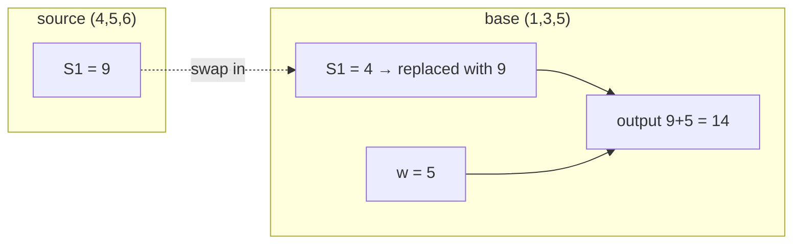

> 🌏 [中文版](/posts/ai/2026-09-29-cs224u-causal-abstraction-iit-das)

**This post is based on the Spring 2023 offering of [CS224U](https://web.stanford.edu/class/cs224u/).** It is part 12 of the [Stanford CS224U guide series](/posts/ai/2026-08-21-stanford-cs224u-natural-language-understanding-en) and picks up where [Analysis Methods I](/posts/ai/2026-09-29-cs224u-analysis-probing-attribution-en) left off. It covers the second half of the Analysis methods unit: causal abstraction, interchange intervention training (IIT), distributed alignment search (DAS), and the unit's conclusions.

I used four official sources: slides 41–61 of the [Analysis methods in NLP deck](https://web.stanford.edu/class/cs224u/slides/cs224u-analysis-2023-handout.pdf), videos 36–37 of the playlist, [`iit_equality.ipynb`](https://github.com/cgpotts/cs224u/blob/main/iit_equality.ipynb) in the repo, and the two files it depends on, [`iit.py`](https://github.com/cgpotts/cs224u/blob/main/iit.py) and [`torch_deep_neural_classifier_iit.py`](https://github.com/cgpotts/cs224u/blob/main/torch_deep_neural_classifier_iit.py). Access level: **A3 (historical offering)**.

This is the steepest post in the series. I stick to intuition, use the notebook's equality task as the running example, and keep the formal definitions in a collapsed block.

## Remember where the last post got stuck

In the last post's addition network, a probe said L2 stored x + y, yet the output layer's weight on L2 was 0. **Having the information doesn't mean using it.** Probing can't answer "does the model rely on this to decide?" The tools in this post exist to answer exactly that, and they do it by directly editing the model's internal states.

At the start of video 36, Potts says he has been heavily involved in developing these methods. Most of the findings below come from his group.

## Causal abstraction in three steps

Slide 42:

1. State a hypothesis about the target model's causal structure. You can write it as a small program (the high-level causal model).
2. Find an **alignment**: which set of neurons in the network corresponds to each variable in the high-level model.
3. Test the alignment with **interchange interventions**.

### Interchange interventions: move a value over, see what the output does

Keep the addition example. The high-level model is S1 = x + y, w = z, output = S1 + w. The hypothesis is that the network's L3 plays the role of S1.

Start with the high-level model. The base input (1, 3, 5) gives 9, and the source input (4, 5, 6) gives 15. Move the source's S1 (4 + 5 = 9) into the base's S1 and the output becomes 9 + 5 = **14**. We understand the high-level model completely, so this result is known in advance.

Now do the same thing to the network: run the source, grab L3's value, put it into L3 while running the base, and look at the output. **If it is also 14**, that is one piece of evidence that L3 and S1 play the same causal role.

You can test L1 ↔ w the same way. Move the source's w (6) into the base; the high-level model outputs 4 + 6 = 10, and the network should too. If no intervention on L2 ever changes the output, you have shown that L2 plays no causal role in the behavior.

If this holds for every possible input, you have proven that the high-level model is an **abstraction** of the network. In video 36, Potts says you are then licensed to let the neural model fall away and reason entirely in terms of the high-level model.

### The realistic version: IIA

Two things are impossible in practice: trying every input (even three-number addition has infinitely many), and getting a perfect match (naturally trained models are messy). So you need a graded score. Slide 44 defines **interchange intervention accuracy (IIA)**: under a chosen alignment, the share of interventions whose output matches the high-level model. Its properties:

- It ranges from 0 to 1, like regular accuracy.
- **It can exceed task accuracy**, because an intervention sometimes puts the model in a better state. Potts says in the video that this has actually happened to them.
- **It is extremely sensitive to which interventions you choose.**
- The most convincing interventions are the ones that **should change the output label**. Count those carefully.

**What to do**: when you report IIA, also report what share of your interventions should change the label. Don't give just one overall number.

### Findings the course cites

Slide 45 lists four. Video 36 stresses that "because" is deliberately causal language:

- Fine-tuned BERT models succeed at hard out-of-domain examples involving lexical entailment and negation **because** they are abstracted by simple monotonicity programs (Geiger et al. 2020).
- Fine-tuned BERT models succeed at MQNLI **because** they find compositional solutions (Geiger et al. 2021).
- Models succeed at MNIST Pointer Value Retrieval **because** they are abstracted by simple programs like "if the digit is 6, the label is in the lower left."
- BART and T5 use entity and situation representations that evolve as the discourse unfolds (Li et al. 2021).

## Walking through iit_equality.ipynb

The notebook is by Atticus Geiger, and its version string is "CS224u, Stanford, Spring 2023".

### The task and the high-level model

**The hierarchical equality task**: the input is two pairs of objects. The label is True if both pairs are "same" or both are "different," and False otherwise. `AABB` and `ABCD` are True; `ABCC` and `BBCD` are False.

The high-level model applies equality three times: V1 = whether the first two match, V2 = whether the last two match, output = whether V1 equals V2.

In the notebook, each object is a random 4-dimensional vector, so one input is 16-dimensional. The network is a feed-forward classifier with three hidden layers.

### A 0.99-accuracy network that doesn't run this program

In the notebook's saved outputs, the network reaches 1.00 train accuracy and 0.99 test accuracy.

Then it proposes an alignment: V1 lives in the first 4 neurons of hidden layer 1, and V2 in the next 4. It takes 100 test examples and pairs them up, giving 10,000 base/source interventions. IIA for V1 is **0.50** and for V2 is **0.54**, about chance.

Under this alignment, there is no evidence that the network computes these two equality relations. Accuracy is high, but the internal mechanism isn't the one you assumed. Behavioral evaluation can't see this.

### IIT: training the causal structure in

Since you know what the high-level model *should* output after an intervention, you have a supervision signal. IIT runs interchange interventions as before, but instead of only evaluating, it computes a loss against the high-level model's counterfactual labels and backpropagates.

Video 36 points out one detail. At the intervened site, the whole source computation graph, including gradient information, is carried over. So that site gets updates from both the base path and the source path, which Potts calls a double update. With repeated training, the network gets pushed to store S1's information **modularly** at the site you chose.

The notebook's results (saved outputs):

| Setting | Standard eval | V1 counterfactual | V2 counterfactual |
|---|---|---|---|
| No IIT | Test 0.99 | 0.50 | 0.54 |
| IIT on V1 only | 1.00 | 1.00 | 0.50 |
| IIT on V1 and V2 | 1.00 | 1.00 | 1.00 |

Train only V1's site and V2 is still at chance. The model grows the structure you ask for, and only that structure.

Slide 50 lists four IIT applications: state-of-the-art results on MNIST-PVR and ReaSCAN; a distillation objective where the student matches the teacher's internal representations under counterfactuals, not just its outputs; inducing character-level representations in subword language models; and causal proxy models, a concept-level explanation method.

Back to the scorecard from the last post: Potts says intervention-based methods now fill all three columns. They characterize representations, support causal inference, and improve models.

Formal definition (the notebook's statement and the implementation interface)

The notebook's statement:

> "an high-level model is a causal abstraction of a neural network if and only if for all base and source inputs, the algorithm and network provides the same output, for some alignment between these two models."

In code, an alignment is written as coordinates like `{"layer": 1, "start": 0, "end": embedding_dim}`. `InterventionableTorchDeepNeuralClassifier.retrieve_activations(input, get, sets)` uses PyTorch hooks to read or overwrite activations at those coordinates. `iit.get_IIT_equality_dataset(variable, embed_dim, size)` produces bases, sources, base labels, counterfactual labels, and intervention site IDs. `TorchDeepNeuralClassifierIIT` maps intervention IDs to coordinates through `id_to_coords`.

One small inconsistency to watch for: the "The algorithm with an intervention" text says it sets V1 to False, but the code passes `{"V1": True}`. The explanation that follows (False changed to True) matches the code.

## DAS: what if the answer isn't on the standard axes?

Slide 53 admits two remaining problems with intervention methods:

1. **Alignment search is expensive.** The number of ways to pair high-level variables with sets of neurons is astronomical for large models, so you approximate and can easily miss a good alignment.
2. **You might miss structure that is really there**, because you assume the standard basis, where each variable maps to some whole neurons.

Slides 54–56 illustrate the second point with Boolean AND. The high-level model is V1 = p, V2 = q, V3 = V1 ∧ V2. The network has two hidden units, H1 and H2, whose weights are rotated by 20 degrees, and its behavior is perfect. The intuitive alignment V1 ↔ H1, V2 ↔ H2 makes an interchange intervention fail: the high-level model says True, and the network outputs a negative value, meaning False. Video 37 reveals why: the example was built so that the correct mapping is V1 ↔ H2, V2 ↔ H1. Rotate [H1, H2] by −20 degrees, though, and the alignment holds.

In video 37 Potts says:

> "It's intuitive for us as humans, but there's no reason to presume that our neural models prefer to operate in that basis."

DAS **freezes the model's parameters and learns only a rotation matrix R**. It rotates the target representation into a new basis, performs the interchange intervention there, rotates back, and trains R to maximize IIA. It combines IIT's training technique with causal abstraction's analytical stance. The model stays frozen because the goal is to explain it, not change it.

DAS findings from slide 58:

- On the hierarchical equality task (the notebook's task), models really do learn hierarchical solutions, but standard causal abstraction easily misses them.
- Models learn theories of lexical entailment and negation, but brittle ones that preserve the identities of the lexical items instead of generalizing. This adds a finer qualification to the earlier Geiger et al. 2020 result.
- [Wu et al. 2023](https://arxiv.org/abs/2305.08809) scaled DAS to Alpaca, a 7B-parameter model, and found it implements an intuitive algorithm for a numerical reasoning task. In video 37, Potts says this scale became possible because the alignment is now learned rather than searched for.

Note: the repo has **no DAS notebook**. `iit_equality.ipynb` covers only causal abstraction and IIT. For DAS you have the slides, the video, and the [original paper](https://arxiv.org/abs/2303.02536).

## The wider literature

Slide 46 connects causal abstraction to a string of related methods: constructive abstraction, causal mediation analysis, role learning networks, CausaLM, amnesic probing, causal scrubbing, and [Circuits](https://distill.pub/2020/circuits/). Circuits is on the schedule's reading list, and the slide also cites the induction heads work and the GPT-2 indirect object identification circuit. For how these methods fit under causal abstraction, the slides point to the [SAIL blog post on causal abstraction](https://ai.stanford.edu/blog/causal-abstraction/).

## The unit's conclusions

Slides 60–61 return to the opening diagram. Positive guarantees about bias, approved uses, and safety all require analytic guarantees about models. Potts lists four near-term directions for explainability research:

1. Causal explanations
2. Human-interpretable explanations. Causality alone isn't enough; otherwise writing out the transformer's math would count as an explanation.
3. Applying these methods to ever-larger instruction-tuned LLMs
4. Growing evidence that models are inducing a **semantics**: a mapping from language into a network of concepts

The last point ties back to the COGS/ReCOGS discussion in the [compositionality post](/posts/ai/2026-09-29-cs224u-compositionality-recogs-hw3-en).

**What to do**: tonight, open `iit_equality.ipynb` and run it only through the "Evaluation" section. It imports only repo modules (`torch_deep_neural_classifier`, `torch_deep_neural_classifier_iit`, `iit`, `utils`) plus PyTorch and scikit-learn, and needs no dataset or pretrained model downloads. You'll watch a 0.99-accuracy network get an IIA of about 0.5. Then run the IIT section and watch the same number go to 1.00.

## What this post can and can't confirm

Confirmed: the schedule's reading list, the slide content, videos 36–37, and the notebook's code and saved outputs. Your numbers will vary slightly with random seeds and environment when you rerun it. Not confirmed: Quiz 4's questions (Canvas requires a login) and any extended classroom discussion. The slides list the DAS paper as "Ms., Stanford University," its manuscript status at the time of the course; this post doesn't evaluate later published versions.

Further reading: the site's [CS224N interpretability guide](/posts/ai/2026-08-22-cs224n-interpretability-en) follows the agentic interpretability and concept discovery line, which makes a useful contrast.

Series navigation: previous, [Analysis Methods I: probing and feature attribution](/posts/ai/2026-09-29-cs224u-analysis-probing-attribution-en) | next, [Methods and Metrics I: classifier and generation metrics](/posts/ai/2026-09-29-cs224u-methods-metrics-en)

## References

- [CS224U: Natural Language Understanding (Spring 2023 course site and schedule)](https://web.stanford.edu/class/cs224u/)
- [Analysis methods in NLP slides (Potts, 2023)](https://web.stanford.edu/class/cs224u/slides/cs224u-analysis-2023-handout.pdf)
- [Video 36: Causal Abstraction & Interchange Intervention Training (IIT)](https://www.youtube.com/watch?v=6pwpOOj33aw)
- [Video 37: Distributed Alignment Search (DAS) & Conclusion](https://www.youtube.com/watch?v=fSx1Vj0BZj0)
- [XCS224U Spring 2023 YouTube playlist](https://www.youtube.com/playlist?list=PLoROMvodv4rOwvldxftJTmoR3kRcWkJBp)
- [iit_equality.ipynb (cgpotts/cs224u)](https://github.com/cgpotts/cs224u/blob/main/iit_equality.ipynb)
- [iit.py](https://github.com/cgpotts/cs224u/blob/main/iit.py)
- [torch_deep_neural_classifier_iit.py](https://github.com/cgpotts/cs224u/blob/main/torch_deep_neural_classifier_iit.py)
- [Geiger et al. 2022: Faithful, Interpretable Model Explanations via Causal Abstraction (SAIL blog)](https://ai.stanford.edu/blog/causal-abstraction/)
- [Geiger, Wu, et al. 2022: Inducing Causal Structure for Interpretable Neural Networks (ICML 2022)](https://proceedings.mlr.press/v162/geiger22a.html)
- [Geiger, Wu, et al. 2023: Finding Alignments Between Interpretable Causal Variables and Distributed Neural Representations (DAS)](https://arxiv.org/abs/2303.02536)
- [Wu et al. 2023: Interpretability at Scale: Identifying Causal Mechanisms in Alpaca](https://arxiv.org/abs/2305.08809)
- [Geiger, Carstensen, Frank, and Potts 2020: Relational reasoning and generalization using non-symbolic neural networks](https://arxiv.org/abs/2006.07968)
- [Cammarata et al. 2020: Thread: Circuits (Distill)](https://distill.pub/2020/circuits/)
